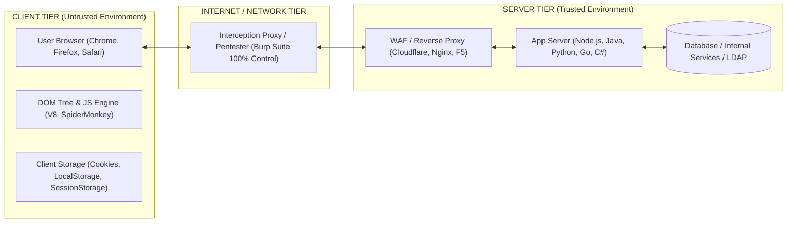
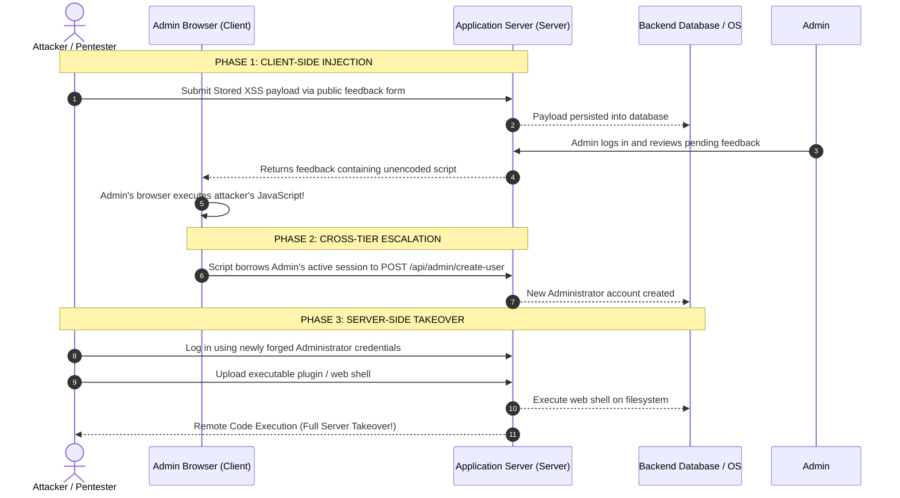

> **Practical Web Security & Pentesting Methodology**  
> *Objective:* Master web application architectures, establish precise Trust Boundaries, classify vulnerability mechanics, and leverage cross-tier exploit chaining in offensive engagements.

---

## 1. Web Architecture & Trust Boundaries

In modern web applications (particularly Single Page Applications using React, Angular, or Vue backed by RESTful or GraphQL APIs), the system is divided into two distinct operating environments separated by an untrusted network:



### What is a Trust Boundary?
* **Client Tier:** Executes entirely on the end user's machine. Any code delivered to the client (HTML, CSS, JavaScript, WebAssembly) is completely accessible, modifiable, and bypassable using Browser Developer Tools (`F12`) or local proxy interceptors like **Burp Suite**. Therefore, **the client is an intrinsically untrusted environment**.
* **Server Tier:** Resides within corporate data centers or cloud VPCs. This tier manages databases, business transaction logic, session state validation, and internal service access. It is considered a trusted environment that must defensively guard against all external input.

---

## 2. Client-Side Vulnerabilities

### 2.1. Concept & Threat Model
Client-side vulnerabilities arise from defects in how an application processes data **within the user's local browser context**.

* **Direct Victim:** Not the backend infrastructure, but **other users** (regular visitors or administrators browsing the application).
* **Primary Attacker Objectives:** Session hijacking, unauthorized state-changing actions (impersonation), credential harvesting, keystroke logging, or sensitive API token exfiltration.

### 2.2. Common Client-Side Vulnerability Classes

#### A. Cross-Site Scripting (XSS)
Enables attackers to inject and execute arbitrary JavaScript within the execution context of the victim's session:
* **Reflected XSS:** Payload originates from user-controlled request parameters (URL queries, forms) and is reflected immediately in the server response without proper sanitization or context-aware encoding.
* **Stored XSS:** Payload is permanently stored in the backend database (e.g., user profiles, comments, tickets). The malicious script executes every time any victim visits the infected page.
* **DOM-based XSS:** Occurs entirely within client-side code. Client JavaScript reads unsanitized data from an untrusted **Source** (e.g., `location.search`, `location.hash`, `window.name`) and delivers it directly into an execution **Sink** (e.g., `innerHTML`, `document.write()`, `eval()`, `setTimeout()`) without ever transmitting the payload to the server.

#### B. Cross-Site Request Forgery (CSRF)
Abuses the browser's implicit trust mechanism of **automatically attaching ambient session credentials (cookies)** to outgoing requests targeting a specific origin:
* An attacker tricks an authenticated user into visiting `attacker.com`.
* The malicious page silently triggers a state-changing POST request to `bank.com/api/transfer`.
* The victim's browser includes their active session cookies, tricking the server into executing the transfer as a legitimate user action.

#### C. Cross-Origin Resource Sharing (CORS) Misconfiguration
Occurs when backend servers set overly permissive access-control headers, breaking the Same-Origin Policy (SOP):
```http
HTTP/1.1 200 OK
Access-Control-Allow-Origin: https://attacker.com
Access-Control-Allow-Credentials: true
```
* **Dynamic Origin Reflection:** The server dynamically mirrors any incoming `Origin` header into `Access-Control-Allow-Origin` while allowing credentials. An attacker's domain can make authenticated cross-origin XMLHttpRequests to read confidential user profiles, financial logs, or private tokens.

#### D. Clickjacking (UI Redressing)
Attackers iframe a target application into a malicious page with transparent styling (`opacity: 0`), overlaying deceptive UI buttons (e.g., "Click here to win a prize"):
* When the victim clicks the visible bait, they unknowingly click an underlying action button inside the hidden iframe (e.g., "Delete Account" or "Grant Admin Privileges").

#### E. Client-Side Logic Flaws & Insecure Storage
* **Insecure Token Storage:** Saving long-lived JWTs, passwords, or credit card numbers in `localStorage` or `sessionStorage`. Unlike cookies flagged with `HttpOnly`, browser Web Storage is fully accessible to any JavaScript running on the page, magnifying the impact of minor XSS flaws.
* **Client-Only Authorization Logic:** Hiding administrative buttons purely in client-side code (e.g., Angular `*ngIf="role === 'admin'"` or React state). Attackers simply bypass the frontend restrictions and issue raw HTTP requests directly to the backend API.

### 2.3. Modern Client-Side Defensive Controls
* **Same-Origin Policy (SOP):** Fundamental browser isolation preventing scripts from one origin from reading resources of a different origin.
* **Content Security Policy (CSP):** HTTP response header (`Content-Security-Policy`) dictating legitimate script sources, banning inline scripts, and blocking `eval()`.
* **Cookie Security Attributes:**
  * `HttpOnly`: Prevents client-side scripts from reading the cookie via `document.cookie`, mitigating credential theft via XSS.
  * `Secure`: Ensures cookies are transmitted exclusively over encrypted HTTPS connections.
  * `SameSite=Lax/Strict`: Prevents the browser from sending cookies on cross-site requests, mitigating traditional CSRF vectors.
* **Frame Sandboxing:** Deploying `X-Frame-Options: DENY` or CSP directive `frame-ancestors 'self'` to defeat clickjacking attacks.

---

## 3. Server-Side Vulnerabilities

### 3.1. Concept & Threat Model
Server-side vulnerabilities stem from flaws in **backend source code, business logic workflows, server infrastructure configurations, or database interactions**.

* **Direct Victim:** The **server infrastructure, underlying enterprise networks, databases, and business assets**.
* **Primary Attacker Objectives:** Full system compromise (Remote Code Execution), persistent data breach, unauthorized privilege escalation, business logic subversion, or internal pivot.

### 3.2. Common Server-Side Vulnerability Classes

#### A. Injection Vulnerabilities
Occurs when untrusted user input is directly concatenated into structured command interpreters:
* **SQL Injection (SQLi):** Malicious inputs alter database queries to bypass authentication, dump entire databases, or execute OS commands via database procedures.
* **Command Injection:** Backend logic executes system binaries (e.g., `exec()`, `system()`, `Process.Start()`) using user input without strict escaping, granting arbitrary OS shell access.
* **Server-Side Template Injection (SSTI):** Template engines (Jinja2, Twig, Freemarker, Thymeleaf) evaluate user input as native code directives, frequently escalating directly to RCE.

#### B. Broken Object Level Authorization (BOLA / IDOR)
The most common and critical API security flaw today:
* The backend accepts an object identifier parameter (e.g., `GET /api/documents/1005`).
* The server verifies that the requester is logged in, but **fails to validate whether the requester owns document #1005**.
* Attackers iterate through IDs to read, edit, or delete any customer's records.

#### C. Server-Side Request Forgery (SSRF)
The server provides functionality to fetch resources from remote URLs (e.g., image import, webhooks, link previews):
* Attackers substitute the target URL with internal endpoints (`http://127.0.0.1:8080`, internal microservices, or cloud metadata services like `http://169.254.169.254/latest/meta-data/`).
* The server issues requests from its privileged network position, bypassing perimeter firewalls.

#### D. Dangerous File Uploads & Insecure Deserialization
* **Arbitrary File Upload:** Inadequate file extension, MIME type, or content inspection allows attackers to upload executable web shells (`.php`, `.aspx`, `.jsp`) into public web directories, achieving instant code execution.
* **Insecure Deserialization:** The backend reconstructs serialized binary, JSON, or XML streams back into memory objects without verification, executing arbitrary gadget chains.

#### E. Business Logic Flaws
Errors in workflow architecture rather than technical syntax:
* Submitting negative quantities (`quantity: -5`) to reduce shopping cart totals.
* Redeeming promo codes concurrently across multiple threads to trigger **Race Conditions**.
* Skipping intermediate checkout steps while directly invoking the order completion API.

---

## 4. Comprehensive Comparison Matrix

| Evaluation Criteria | Client-Side Vulnerability | Server-Side Vulnerability |
| :--- | :--- | :--- |
| **Execution Context** | End-user web browser (Chrome, Edge, Safari, Firefox) | Backend server, database, cloud microservice |
| **Relevant Technologies** | HTML, CSS, JavaScript, TypeScript, WebAssembly | Java, Python, Go, C#, PHP, SQL, Shell, Docker |
| **Direct Victim** | End users, employees, administrators | The enterprise, database records, corporate infrastructure |
| **Tester Visibility** | **White-Box** (100% visible via DevTools, Sources, DOM) | **Black-Box** (Inferred via behavioral responses/timing) |
| **Environment Dependency** | Client browser version, extensions, OS rendering engine | Framework version, backend runtime, server OS |
| **Primary Testing Tooling** | Browser DevTools, Console, DOM Breakpoints, XSS Payloads | Burp Suite (Repeater, Intruder), Python scripts, API fuzzers |
| **Typical Impact** | Account takeover, DOM defacement, credential harvesting | Massive data breach, Remote Code Execution (RCE), service outage |
| **Logging Footprint** | Often invisible in server access logs (e.g., DOM XSS `#`) | Recorded in web access logs, query logs, system events |

---

## 5. The Art of Chaining: Combining Client-Side and Server-Side

Advanced security researchers and penetration testers never evaluate vulnerabilities in isolation. The most devastating attack vectors occur when **a client-side flaw is leveraged to bridge the gap into full server-side compromise**, and vice versa:



### Real-World Chaining Scenarios:
1. **XSS (Client) ➡️ CSRF Token Steal ➡️ Server-Side RCE:**
   * A server has an administrative file upload feature protected by a non-guessable CSRF token.
   * An attacker identifies Stored XSS in a support portal. When the admin opens the ticket, the script fetches the CSRF token from the DOM and sends a multipart request uploading a webshell.
2. **CORS Misconfiguration (Client) ➡️ Token Exfiltration ➡️ BOLA / IDOR (Server):**
   * Exploiting an insecure CORS origin reflection allows an external site to read user authentication tokens.
   * The attacker utilizes the stolen token against backend REST APIs to exploit IDOR vulnerabilities across customer databases.
3. **Information Disclosure (Server) ➡️ Client-Side Logic Bypass:**
   * Querying leaky configuration endpoints (e.g., `/api/v1/config/system` or `/AbpUserConfiguration/GetAll`) exposes internal role definitions and secret keys.
   * The attacker patches the client-side JavaScript bundle to unlock hidden administration menus and privileged functions.

---

## 6. Core Principles in Secure Architecture & Testing

> [!CAUTION]
> ### 1. "Never Trust the Client"
> Every client-side validation check — such as input length (`maxlength`), HTML form constraints (`required`), disabled buttons (`disabled`), or hidden DOM nodes (`display: none`, `*ngIf`) — **can be bypassed with a single keystroke in Burp Suite or DevTools**. All critical security enforcement must reside authoritatively on the server.

> [!TIP]
> ### 2. Defense in Depth
> Resilient web applications never rely on a single defensive layer:
> * Do not rely solely on a WAF to stop SQL Injection; enforce **Parameterized Prepared Statements** at the data access layer.
> * Do not rely only on input filtering for XSS; combine **Context-Aware Output Encoding**, strict **Content Security Policy (CSP)**, and the **`HttpOnly`** cookie flag.

> [!IMPORTANT]
> ### 3. Segregation of Engineering Responsibilities
> * **Frontend Engineers:** Responsible for secure DOM manipulation, context-aware output encoding, avoiding dangerous sinks (`innerHTML`, `eval`), safe state handling, and secure iframe framing.
> * **Backend Engineers:** Responsible for identity authentication, fine-grained object ownership authorization (BOLA defense), parameterized database queries, strict file upload sanitization, server resource isolation, and secure infrastructure configuration.

---

*Authored by **k0z1l aka 0xDTK** | Notes & Security Fundamentals*
