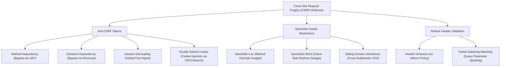

Welcome to the **Cross-Site Request Forgery (CSRF)** research series within the **PortSwigger Web Security Academy** writeup collection.

Cross-Site Request Forgery (CSRF) is a client-side vulnerability where an attacker induces an authenticated user's browser to perform unintended, state-changing actions on a trusted web application. By exploiting the browser's default behavior of automatically including session cookies with cross-site HTTP requests, an adversary can forge actions such as modifying account email addresses, altering passwords, transferring funds, or executing administrative commands.

---

## 1. Core Prerequisites for CSRF

For a CSRF attack to succeed against a target endpoint, three foundational conditions must be satisfied:

1. **A Relevant Action:** The application must process a sensitive, state-changing action (e.g., modifying user profile data, altering credentials, managing permissions).
2. **Cookie-Based Session Handling:** The application must rely entirely on browser-managed session cookies to authenticate incoming requests, without verifying secondary transport-layer tokens or authorization headers.
3. **No Unpredictable Request Parameters:** The requests required to execute the action must contain no values that an attacker cannot determine or guess (e.g., absence of cryptographically secure anti-CSRF tokens).

---

## 2. Series Challenge Index

The table below catalogs all 11 practical challenges across Apprentice and Practitioner levels, detailing their primary vulnerability mechanisms and real-world exploitation impact:

| Lab | Challenge Name | Level | Primary Vulnerability Mechanism | Exploit Impact |
| :---: | :--- | :---: | :--- | :--- |
| **1** | [CSRF vulnerability with no defenses](lab-01-csrf-vulnerability-with-no-defenses/) | Apprentice | Application lacks anti-CSRF tokens and SameSite cookie restrictions | Unauthenticated email modification via crafted HTML form |
| **2** | [CSRF where token validation depends on request method](lab-02-csrf-where-token-validation-depends-on-request-method/) | Apprentice | Token verification enforced strictly on POST but omitted for GET requests | Method conversion bypass to change victim email |
| **3** | [CSRF where token validation depends on token being present](lab-03-csrf-where-token-validation-depends-on-token-being-present/) | Apprentice | Server validates token integrity only if present in request parameters | Token parameter omission to bypass verification |
| **4** | [CSRF where token is not tied to user session](lab-04-csrf-where-token-is-not-tied-to-user-session/) | Practitioner | Global token pool validation without binding tokens to user session IDs | Token harvesting from attacker session to forge victim requests |
| **5** | [CSRF where token is tied to non-session cookie](lab-05-csrf-where-token-is-tied-to-non-session-cookie/) | Practitioner | Token tied to custom tracking cookie combined with cookie injection | Injecting matching `csrfKey` cookie to validate stolen token |
| **6** | [CSRF where token is duplicated in cookie](lab-06-csrf-where-token-is-duplicated-in-cookie/) | Practitioner | Naive Double Submit Cookie pattern without server-side state verification | Cookie injection (via search/CRLF) to set synchronized pseudo-token |
| **7** | [SameSite Lax bypass via method override](lab-07-samesite-lax-bypass-via-method-override/) | Practitioner | Top-level navigation sends Lax cookies combined with `_method` override | Converting POST to GET navigation via form method override |
| **8** | [SameSite Strict bypass via client-side redirect](lab-08-samesite-strict-bypass-via-client-side-redirect/) | Practitioner | Same-site client-side redirect gadget triggers secondary request with Strict cookies | Chaining client-side redirect to bypass Strict cookie boundaries |
| **9** | [SameSite Strict bypass via sibling domain](lab-09-samesite-strict-bypass-via-sibling-domain/) | Practitioner | Vulnerable sibling domain (XSS) within same registrable domain (`eTLD+1`) | Cross-subdomain exploitation to trigger authenticated requests with Strict cookies |
| **10** | [CSRF where Referer validation depends on header being present](lab-10-csrf-where-referer-validation-depends-on-header-being-present/) | Practitioner | Server verifies Referer domain if present but skips check when header omitted | Omitting Referer header via `<meta name="referrer" content="no-referrer">` |
| **11** | [CSRF with broken Referer validation](lab-11-csrf-with-broken-referer-validation/) | Practitioner | Flawed regex or substring matching on Referer header (`indexOf` or partial match) | Appending target domain to query parameter of attacker exploit host |

---

## 3. Defense Taxonomy & Bypass Vectors

---

## 4. Defense-in-Depth Remediation Principles

Modern enterprise defenses against CSRF combine multiple layers of verification:

1. **Synchronizer Token Pattern (CSRF Tokens):**
   - High-entropy, cryptographically random, per-user-session tokens.
   - Enforce server-side validation strictly across all state-changing HTTP verbs (`POST`, `PUT`, `DELETE`, `PATCH`).
2. **Modern SameSite Cookie Attributes:**
   - Enforce `SameSite=Strict` or `SameSite=Lax` on all authenticated session cookies.
   - Guard against top-level GET transitions and method-override routing gadgets.
3. **Custom Request Headers:**
   - Enforce custom headers (e.g., `X-Requested-With`, `Authorization: Bearer <token>`) on REST and JSON APIs, requiring cross-origin preflight checks (CORS).
4. **Interactive Confirmation for Sensitive Operations:**
   - Re-authenticate users (password entry) or require Multi-Factor Authentication (MFA) prior to high-risk transactions (email modification, password changes, fund transfers).
