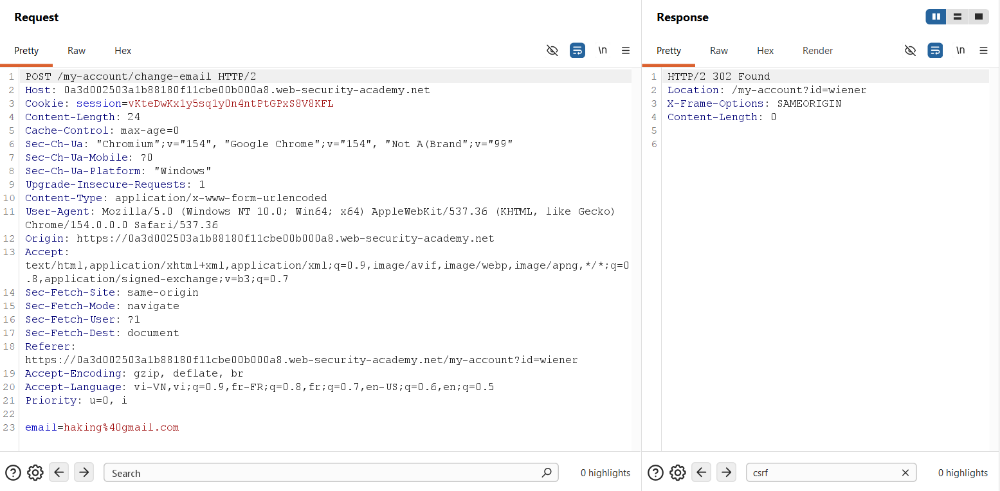
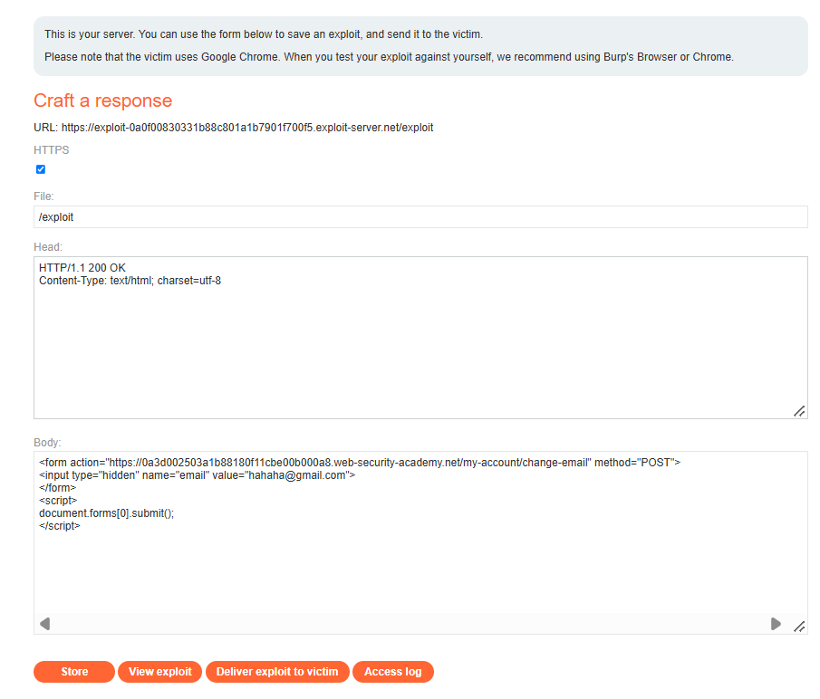

## Challenge Overview

* **Challenge Name**: CSRF vulnerability with no defenses
* **Category**: Cross-Site Request Forgery (CSRF) / Client-Side Security
* **Level**: Apprentice
* **Target Endpoint**: `POST /my-account/change-email`
* **Objective**: Exploit a Cross-Site Request Forgery (CSRF) vulnerability lacking defenses to change the victim's registered email address by hosting an exploit payload on the exploit server and delivering it to the victim.

---

## 1. Core Fundamentals

Cross-Site Request Forgery (CSRF) is a client-side web vulnerability enabling an adversary to induce an authenticated user to perform unintentional, state-changing actions on a trusted web application.

### 1.1. HTTP Protocol Nature & The Ambient Authority Model

HTTP is fundamentally a stateless transport protocol. To sustain continuous user authentication across disparate requests, web applications rely on session tokens stored within the client's browser (typically as HTTP cookies).

The foundational architectural vulnerability enabling CSRF is the browser's **Ambient Authority** credential-handling model:

> Whenever a web browser initiates an HTTP request targeting a destination origin (whether initiated via hyperlinks, image tags, scripts, or form submissions), **it automatically and unconditionally attaches all cookies associated with that domain**—regardless of the origin hosting the executing code.

If a server relies exclusively on the presence of the `Cookie: session=...` header to validate incoming state-changing requests without corroborating user intent or origin, the backend inherently treats cross-site forged transactions as genuine user actions.

```text
+-----------------------------------------------------------------------------------------+
|                           Ambient Authority Mechanics                                   |
+-----------------------------------------------------------------------------------------+
| 1. Victim authenticates to target.com -> Server issues "Cookie: session=XYZ".           |
| 2. Victim visits attacker.com in another tab or window.                                 |
| 3. attacker.com serves HTML containing a form posting to target.com/change-email.        |
| 4. Browser issues the POST request to target.com.                                       |
| 5. BROWSER AUTOMATICALLY INJECTS "Cookie: session=XYZ" into the outgoing request!       |
| 6. target.com receives the request, sees valid session XYZ, and processes the mutation.|
+-----------------------------------------------------------------------------------------+
```

### 1.2. The Same-Origin Policy (SOP) Fallacy

A prevalent misconception in application security is assuming that the **Same-Origin Policy (SOP)** inherently protects against CSRF.

* **SOP Enforces Read Boundaries:** SOP restricts a document or script loaded from origin A (`attacker.com`) from reading response data or inspecting the DOM tree of origin B (`target.com`).
* **SOP Does Not Enforce Write Boundaries:** Standard SOP does not block a web browser from **transmitting** cross-origin requests. Standard HTML `<form>` submissions can target external domains without restriction.

Because CSRF is a **one-way, blind state-changing attack**, the attacker has no need to read the server's response. The attack succeeds the moment the server parses the request body and updates backend state. Therefore, SOP provides zero protection against classical form-based CSRF.

### 1.3. The Three Classical Preconditions for CSRF

For an application endpoint to be vulnerable to CSRF, three fundamental preconditions must align:

1. **A Relevant, State-Changing Action:** The endpoint executes an action with meaningful business or security implications (such as modifying email addresses, altering passwords, updating billing details, or changing administrative roles).
2. **Cookie-Based Session Handling:** Session management relies strictly on browser cookies transmitted in the request header (`Cookie: session=...`). No secondary transport-layer tokens or authorization headers (e.g., `Authorization: Bearer <JWT>`) are validated.
3. **Absence of Unpredictable Request Parameters:** All parameters required to process the request are deterministic and fully predictable by an external attacker. The application requires no randomized anti-CSRF tokens, dynamic cryptographic nonces, or user verification challenges (such as current password confirmation).

```text
+-----------------------------------------------------------------------------------------+
|                                CSRF Pre-Conditions Matrix                               |
+-----------------------------------------------------------------------------------------+
| Condition 1: Relevant Action            --> YES: POST /my-account/change-email          |
| Condition 2: Cookie-based Session       --> YES: Relies solely on session cookie         |
| Condition 3: No Unpredictable Data      --> YES: Deterministic parameter "email" only   |
+-----------------------------------------------------------------------------------------+
| VERDICT: CRITICALLY VULNERABLE TO UNRESTRICTED CROSS-SITE REQUEST FORGERY              |
+-----------------------------------------------------------------------------------------+
```

---

## 2. Attack Architecture / Threat Model

### 2.1. Trust Boundaries & Attack Flow

The vulnerability arises from a breakdown in client-server trust boundaries:
* **The Application Server** erroneously trusts that any incoming HTTP request bearing a valid session cookie was intentionally initiated by the user.
* **The User's Browser** executes untrusted JavaScript and HTML served by `attacker.com` within an isolated browsing context, yet transmits ambient credentials belonging to `target.com`.

### 2.2. Attack Flow Diagram

```text
[ Attacker Exploit Server ]
       │
       │  1. Prepares malicious zero-click exploit page:
       │     <form action="https://target.com/my-account/change-email" method="POST">
       │         <input type="hidden" name="email" value="hahaha@gmail.com">
       │     </form>
       │     <script>document.forms[0].submit();</script>
       │
       │  2. Delivers phishing link / exploit URL to Victim
       ▼
[ Authenticated Victim Browser ]
       │  (Victim already holds valid session cookie on target.com)
       │
       │  3. Loads attacker exploit page (/exploit)
       │  4. DOM executes document.forms[0].submit() automatically
       │
       │  5. Dispatches Cross-Site Form POST:
       │     POST /my-account/change-email HTTP/2
       │     Host: target.com
       │     Cookie: session=vKteDwKxly5...  <── Browser automatically injects!
       │     email=hahaha@gmail.com
       ▼
[ Target Web Application ]
       │
       │  6. Validates session cookie (matches victim's session)
       │  7. Checks for CSRF tokens -> None required!
       │  8. Updates account email to hahaha@gmail.com
       ▼
[ State Mutated: Account Takeover Prerequisite Achieved ]
```

### 2.3. Root Cause Analysis

The root cause of this vulnerability encompasses two distinct engineering failures:
1. **Lack of Anti-CSRF Token Validation:** The endpoint does not implement the Synchronizer Token Pattern. It fails to require a secret, unpredictable, session-bound token with incoming mutation requests.
2. **Absence of Strict Cookie SameSite Enforcement:** The session cookie is issued without modern `SameSite=Strict` or `SameSite=Lax` restrictions, permitting cross-site form POST requests to transmit authentication cookies without browser intervention.

---

## 3. Vulnerability Exploitation

### Phase 1: Baseline Analysis & Traffic Interception via Burp Suite

We authenticate into the test account (`wiener:peter`) and trigger the email modification functionality. The traffic is captured via Burp Suite Proxy and analyzed in Burp Suite Repeater:



#### HTTP Request Analysis

```http
POST /my-account/change-email HTTP/2
Host: 0a3d002503a1b88180f11cbe00b000a8.web-security-academy.net
Cookie: session=vKteDwKxly5sqly0n4ntPtGPxS8V8KFL
Content-Length: 24
Content-Type: application/x-www-form-urlencoded

email=haking%40gmail.com
```

#### HTTP Response Analysis

```http
HTTP/2 302 Found
Location: /my-account?id=wiener
X-Frame-Options: SAMEORIGIN
Content-Length: 0
```

#### Attack Surface Evaluation:
1. **Target Action Endpoint:** The state-changing operation is strictly bound to `/my-account/change-email`. Dispatching requests to `/my-account` alone will fail because the parent controller does not process mutation parameters.
2. **Authentication Mechanism:** The application authenticates the request purely through `Cookie: session=vKteDwKxly5sqly0n4ntPtGPxS8V8KFL`.
3. **Absence of CSRF Tokens:** Searching for `csrf` across headers and body parameters yields **0 matches**. No hidden form tokens exist.
4. **Lack of Re-Authentication:** The server does not require verification of the user's current password prior to committing the email change.
5. **Immediate Execution:** The server returns `302 Found`, redirecting back to `/my-account?id=wiener`. The email address modification is executed synchronously.

---

### Phase 2: Weaponizing the Zero-Click Exploit Payload

To exploit this vulnerability against external victims, we configure PortSwigger's **Exploit Server** (`https://exploit-...exploit-server.net/exploit`):



We configure the HTTP response parameters on the Exploit Server:
* **File:** `/exploit`
* **Head:**
  ```http
  HTTP/1.1 200 OK
  Content-Type: text/html; charset=utf-8
  ```
* **Body:**
  ```html
  <form action="https://0a3d002503a1b88180f11cbe00b000a8.web-security-academy.net/my-account/change-email" method="POST">
      <input type="hidden" name="email" value="hahaha@gmail.com">
  </form>
  <script>
      document.forms[0].submit();
  </script>
  ```

#### Detailed Breakdown of Exploit Mechanics:
* **The `<form>` Element:**
  * `action`: Must point to the absolute URL of the vulnerable endpoint (`https://0a3d002503a1b88180f11cbe00b000a8.web-security-academy.net/my-account/change-email`).
  * `method="POST"`: Instructs the victim browser to dispatch an HTTP POST request formatted as `application/x-www-form-urlencoded`, matching backend expectations.
* **The `<input type="hidden">` Element:**
  * `name="email"`: Corresponds directly to the parameter expected by the server.
  * `value="hahaha@gmail.com"`: The attacker-controlled email address designed to overwrite the victim's primary contact.
  * `type="hidden"`: Prevents any visual input controls from rendering in the victim's browser.
* **The Programmatic Auto-Submit Mechanism:**
  * `document.forms[0]`: Accesses the first form node in the DOM tree. Placing this script immediately following the form ensures reliable reference without requiring element identifiers.
  * `.submit()`: Executes the native DOM form submission method immediately upon page load.
  * **Zero-Click Impact:** The attack requires zero user interaction beyond simply opening or being redirected to the exploit URL.

---

### Phase 3: Delivering Exploit to Victim & Verification

1. **Storing the Payload:** Click **Store** to persist the payload at `/exploit`.
2. **Local Sanity Check:** Click **View exploit** to test the exploit against your own active session. Observe that your account email updates to `hahaha@gmail.com`.
3. **Delivering to Victim:** Click **Deliver exploit to victim**.


#### Execution Flow & Lab Resolution:
* The PortSwigger testing infrastructure dispatches a simulated victim bot (authenticated as `wiener` in a headless Chromium instance) to access our exploit URL.
* The victim's browser evaluates the HTML document, builds the DOM tree, and executes `document.forms[0].submit()`.
* Due to the ambient authority model, the victim's browser includes their active session cookie with the cross-origin POST request directed at the target application.
* The target server validates the session cookie, processes the parameter update, and commits `hahaha@gmail.com` to the victim's account.
* The application detects the state change performed from an external origin, successfully solving the lab:
  
  **Banner Status:** `LAB Solved` — *"Congratulations, you solved the lab!"* *(Confirmed in Figure 3)*.

---

## 4. Remediation Strategies

Eliminating CSRF vulnerabilities requires a robust, defense-in-depth approach combining cryptographic tokens, browser-level attributes, and workflow verification.

```text
+-----------------------------------------------------------------------------------------+
|                              Multi-Layered CSRF Defenses                                |
+-----------------------------------------------------------------------------------------+
| 1. Cryptographic Defense : Synchronizer Token Pattern (Anti-CSRF Nonces)                |
| 2. Browser-Level Defense : SameSite Cookie Attributes (Strict / Lax)                    |
| 3. Workflow Defense      : Step-Up Re-Authentication (Password / TOTP Confirmation)     |
| 4. Architecture Defense  : REST / JSON APIs with Custom Headers (CORS Preflight)        |
+-----------------------------------------------------------------------------------------+
```

### 4.1. Primary Defense: Synchronizer Token Pattern (Anti-CSRF Tokens)

The industry standard defense against CSRF is the **Synchronizer Token Pattern**:
1. When a user authenticates, the server generates a cryptographically strong, pseudorandom token with high entropy (e.g., 256 bits via CSPRNG).
2. The server binds this token to the user's active server-side session.
3. When rendering sensitive state-changing forms, the server injects this token into a hidden form parameter:
   ```html
   <form action="/my-account/change-email" method="POST">
       <input type="hidden" name="csrf_token" value="c8f1e2d3b4a59687e1f0a2b3c4d5e6f7" />
       <input type="email" name="email" value="" required />
       <button type="submit">Update email</button>
   </form>
   ```
4. Upon receiving the POST request, the backend verifies that the submitted `csrf_token` exactly matches the value stored in the user's session.
5. **Why this stops CSRF:** Under the Same-Origin Policy (SOP), an attacker hosting a malicious site on `attacker.com` cannot read the victim's DOM on `target.com`. Because the attacker cannot obtain or predict this dynamic token, any cross-origin forged request will lack a valid token and will be rejected (`403 Forbidden`).

#### Secure Backend Implementation Example (Node.js / Express):

```javascript
// Example middleware enforcing anti-CSRF token validation
const crypto = require('crypto');

// 1. Generate token on session creation
function generateCsrfToken(req) {
    if (!req.session.csrfToken) {
        req.session.csrfToken = crypto.randomBytes(32).toString('hex');
    }
    return req.session.csrfToken;
}

// 2. Strict validation middleware for state-changing HTTP methods
function verifyCsrfToken(req, res, next) {
    const sensitiveMethods = ['POST', 'PUT', 'DELETE', 'PATCH'];
    if (sensitiveMethods.includes(req.method)) {
        const submittedToken = req.body.csrf_token || req.headers['x-csrf-token'];
        if (!submittedToken || submittedToken !== req.session.csrfToken) {
            return res.status(403).json({ 
                error: 'CSRF token validation failed. Request terminated.' 
            });
        }
    }
    next();
}
```

### 4.2. Browser-Level Defense: The `SameSite` Cookie Attribute

All authentication and session cookies must be explicitly configured with the `SameSite` attribute:

```http
Set-Cookie: session=vKteDwKxly5...; Secure; HttpOnly; SameSite=Lax; Path=/
```

* **`SameSite=Strict`:** Cookies are never transmitted in any cross-site request, including top-level link navigations from external sites. Strongly recommended for sensitive user portals and management consoles.
* **`SameSite=Lax`:** Cookies are withheld on cross-site subrequests (such as cross-origin form POSTs, iframes, and image tags). Cookies are only transmitted on safe, top-level `GET` navigations (e.g., following a hyperlink). This prevents form-based CSRF attacks by default.
* **`SameSite=None; Secure`:** Cookies are transmitted in all cross-site contexts. Should only be utilized where cross-site iframe embedding is strictly required, and must be guarded by anti-CSRF tokens.

### 4.3. Re-Authentication for Sensitive Operations

For high-impact state changes (such as email changes, password resets, and MFA reconfiguration), require **Step-Up Authentication**:
* Mandate that the user re-enters their **current password** or provides a **Time-based One-Time Password (TOTP)** alongside the new email.
* Because an external attacker executing a CSRF attack cannot guess or extract the victim's password, the attack fails.

### 4.4. Modern API Architecture & Custom Request Headers

For modern Single Page Applications (SPAs) and REST APIs:
1. **Adopt JSON Payloads:** Transition endpoints to expect `Content-Type: application/json` rather than form-encoded bodies.
2. **Require Custom Headers:** Enforce headers such as `X-Requested-With: XMLHttpRequest` or `X-CSRF-Token`.
3. **Leverage CORS Preflight:** Browsers cannot send cross-origin requests with custom headers or `application/json` without first dispatching a preflight `OPTIONS` request. Unless the server explicitly authorizes the attacker's origin via `Access-Control-Allow-Origin`, the browser terminates the request before the state-changing POST is dispatched.
