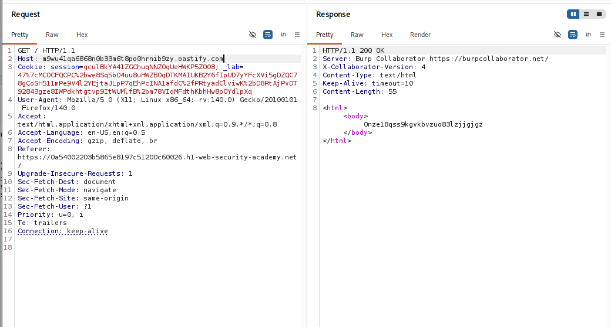
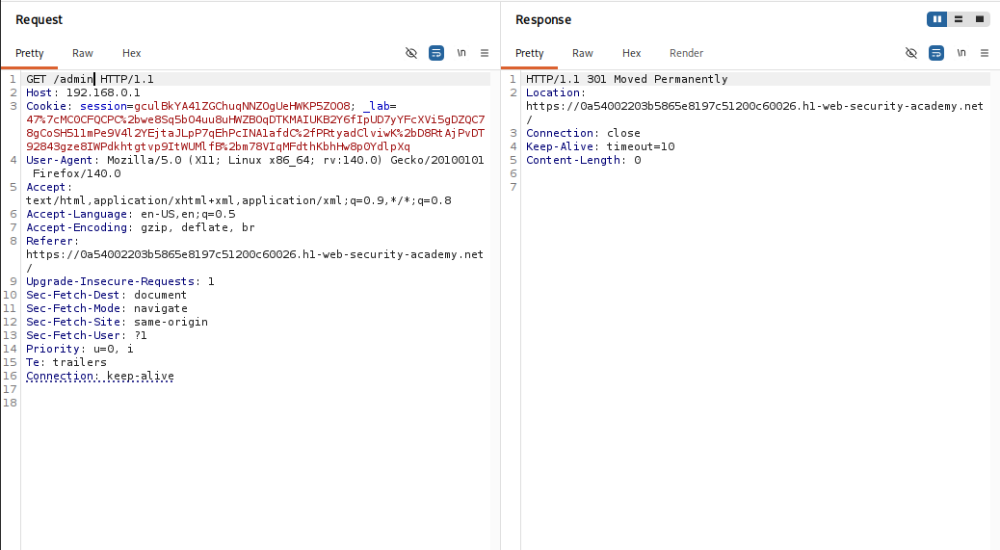
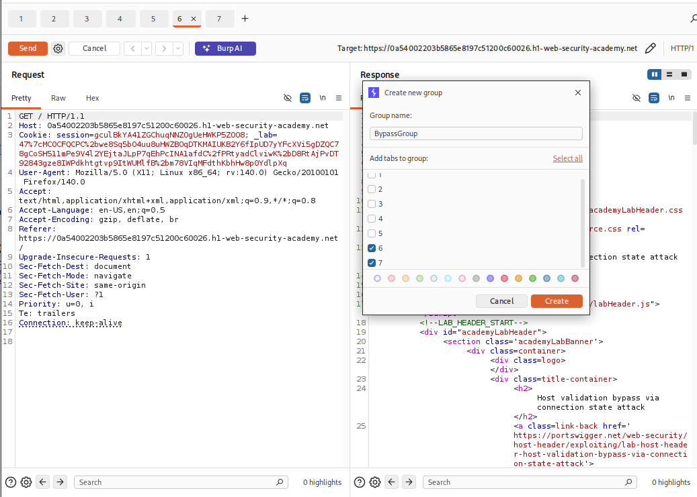
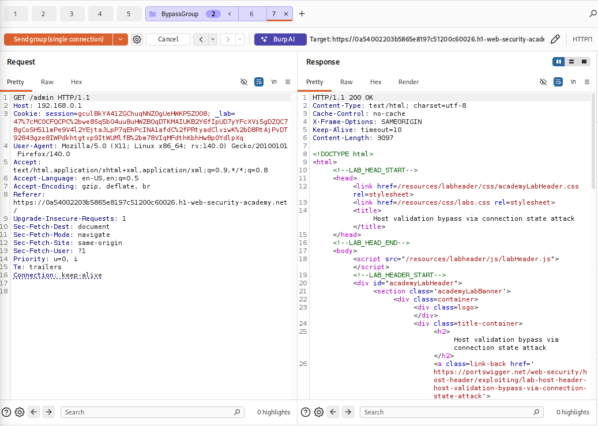
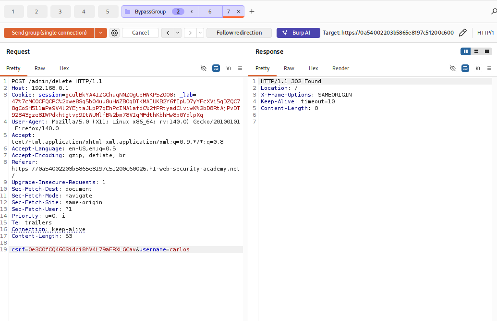
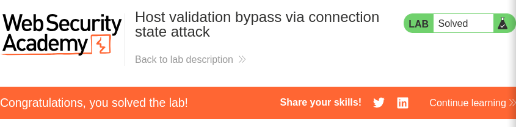

---
title: "[PortSwigger] Lab 6: Host Validation Bypass via Connection State Attack"
date: 2026-09-14
description: "Khai thác giả định sai lầm của Reverse Proxy trong việc chỉ kiểm tra header Host ở request đầu tiên của persistent connection để bypass kiểm tra và truy cập trang quản trị nội bộ."
categories: ["PortSwigger Labs"]
series: ["HTTP Host Header Attacks"]
series_order: 6
showAuthor: false
showTableOfContents: true
---

## Thông tin bài Lab
* **Tên bài Lab**: Host validation bypass via connection state attack
* **Chuyên đề**: HTTP Host Header attacks / Connection State Discrepancy
* **Mức độ**: Practitioner
* **Mục tiêu**: Bypass cơ chế kiểm tra Host header thông qua kỹ thuật tấn công trạng thái kết nối TCP (Keep-Alive), truy cập trang quản trị nội bộ tại `192.168.0.1` và xóa tài khoản `carlos`.

---

## 1. Kiến thức nền tảng

Trong kiến trúc mạng tối ưu hóa hiệu năng, giao thức HTTP/1.1 và HTTP/2 sử dụng cơ chế kết nối liên tục (Persistent Connection) để tái sử dụng một đường truyền TCP duy nhất cho nhiều chu kỳ request và response liên tiếp. Cơ chế này loại bỏ độ trễ khởi tạo bắt tay ba bước TCP và bắt tay mã hóa TLS cho từng yêu cầu riêng rẽ.

### 1.1. Cơ chế tái sử dụng kết nối mạng

Giữa Front-end Reverse Proxy và Back-end Server, hệ thống thường duy trì một Connection Pool. Khi client gửi một chuỗi request với tiêu đề `Connection: keep-alive`, Proxy tiếp nhận và chuyển tiếp các gói tin này trên cùng một socket TCP đang mở mà không ngắt kết nối.

### 1.2. Sai lầm phụ thuộc trạng thái kết nối

Lỗ hổng xuất hiện khi Front-end Reverse Proxy áp dụng cơ chế kiểm tra bảo mật có tính trạng thái thay vì kiểm tra độc lập trên từng thông điệp:
- **Tại request đầu tiên**: Proxy thực hiện phân tích đầy đủ và xác thực trường Host header với danh sách tên miền hợp lệ. Khi kiểm tra thành công, kết nối TCP này được gắn nhãn tin cậy.
- **Tại các request kế tiếp trên cùng kết nối**: Proxy cho rằng toàn bộ các gói tin đi sau trên cùng kết nối mạng đều kế thừa mức độ tin cậy của request đầu tiên, dẫn đến việc bỏ qua hoàn toàn quy trình xác thực Host header.

---

## 2. Mô hình tấn công

### 2.1. Phân tích nguyên nhân và điều kiện phát sinh lỗ hổng

- **Giả định tin cậy sai lầm**: Hệ thống giả định một kết nối TCP đã xác thực thì mọi request bên trong đều an toàn.
- **Thiếu kiểm soát trên từng thông điệp**: Front-end không phân tích cú pháp và xác thực lại Host header cho các request thứ cấp đi qua đường ống Keep-Alive.
- **Định tuyến Back-end phụ thuộc Host header**: Back-end server vẫn tiếp nhận và xử lý định tuyến tài nguyên dựa trên Host header của từng request riêng lẻ mà không đối chiếu với trạng thái Front-end.

### 2.2. Sơ đồ luồng dữ liệu tấn công

```text
[ Attacker từ Internet ]
       │
       │  (1) Request 1: GET / HTTP/1.1
       │      Host: victim-lab.net          <── Host hợp lệ, Connection: keep-alive
       │
       │  (2) Request 2: GET /admin HTTP/1.1 (Gửi ngay trên CÙNG kết nối TCP)
       │      Host: 192.168.0.1             <── Host mạng nội bộ!
       ▼
[ Front-end Reverse Proxy ]
       │
       │  Request 1: Kiểm tra Host hợp lệ ──► Gắn nhãn kết nối TCP: TIN CẬY
       │  Request 2: Thấy kết nối đã được TIN CẬY ──► BỎ QUA KIỂM TRA HOST HEADER!
       ▼
[ Back-end Server / Intranet Admin ]
       │
       │  Nhận Request 2 với Host: 192.168.0.1
       │  Xử lý và trả về giao diện Admin Panel
       ▼
[ Bypass thành công! Trả về 200 OK cho Attacker ]
```

---

## 3. Khai thác lỗ hổng

Quy trình thực nghiệm tấn công được triển khai tuần tự qua 4 giai đoạn:

### Giai đoạn 1: Khảo sát định tuyến và hành vi chặn của Front-end

Gửi request thử nghiệm với trường Host trỏ về tên miền Burp Collaborator `m9wu41qa6868n0b33m6t8po0hrnib9zy.oastify.com`. Máy chủ phản hồi mã HTTP/1.1 200 OK từ Burp Collaborator, xác nhận hệ thống có hỗ trợ cơ chế định tuyến qua Host header:

```http
GET / HTTP/1.1
Host: m9wu41qa6868n0b33m6t8po0hrnib9zy.oastify.com
Connection: keep-alive
```



Thử nghiệm gửi trực tiếp request đơn lẻ `GET /admin HTTP/1.1` với `Host: 192.168.0.1`. Front-end lập tức chặn truy cập, phản hồi mã `HTTP/1.1 301 Moved Permanently` chuyển hướng về tên miền chính thức và kèm chỉ thị ngắt kết nối `Connection: close`:

```http
GET /admin HTTP/1.1
Host: 192.168.0.1
Connection: keep-alive
```



---

### Giai đoạn 2: Thiết lập nhóm request trên một kết nối duy nhất

Để vượt qua cơ chế kiểm tra trên, ta thiết lập gửi chuỗi request trên cùng một kết nối TCP trong Burp Suite Repeater:
- **Tab thứ nhất (Request hợp lệ)**: Gửi `GET / HTTP/1.1` với Host chính thức của bài lab và `Connection: keep-alive` nhằm mục đích xác thực kết nối ban đầu.
- **Tab thứ hai (Request độc hại)**: Gửi `GET /admin HTTP/1.1` với `Host: 192.168.0.1`.

Tạo một Tab Group mới đặt tên là `BypassGroup` chứa cả hai tab request trên:



---

### Giai đoạn 3: Thực thi tấn công trạng thái kết nối để truy cập trang quản trị

Tại tab BypassGroup, lựa chọn chế độ gửi **Send group (single connection)**. Burp Suite sẽ khởi tạo một kết nối TCP duy nhất, gửi request hợp lệ ở tab thứ nhất trước, sau đó tái sử dụng ngay chính kết nối đó để gửi tiếp request thứ hai.

Kết quả: Request thứ hai với `Host: 192.168.0.1` không còn bị chặn mã 301 mà phản hồi thành công mã `HTTP/1.1 200 OK`, mở ra toàn bộ giao diện quản trị nội bộ.



---

### Giai đoạn 4: Thực thi xóa tài khoản carlos và giải quyết bài lab

Trích xuất token CSRF từ mã nguồn HTML của trang quản trị (`0e3C0fCQ460Sidci8hV4L79aFRXLGcav`). Soạn request xóa tài khoản carlos tại tab thứ hai:

```http
POST /admin/delete HTTP/1.1
Host: 192.168.0.1
Cookie: session=gculBkYA41ZGChuqNNZOgUeHWKP5ZO08; ...
Connection: keep-alive
Content-Length: 53

csrf=0e3C0fCQ460Sidci8hV4L79aFRXLGcav&username=carlos
```

Tiếp tục nhấn nút **Send group (single connection)**. Máy chủ nội bộ tiếp nhận và xử lý lệnh xóa, phản hồi mã `HTTP/1.1 302 Found` chuyển hướng về trang chủ. Tài khoản carlos đã bị xóa thành công.



Kiểm tra lại giao diện bài lab trên trình duyệt, thông báo giải quyết bài lab thành công xuất hiện.



---

## 4. Biện pháp khắc phục

### 4.1. Cấu hình bảo vệ tại Reverse Proxy

- **Xác thực phi trạng thái trên từng Request**: Reverse Proxy tuyệt đối không được dựa vào trạng thái kết nối mạng TCP để quyết định bỏ qua bước kiểm tra bảo mật. Mọi HTTP Request riêng lẻ đi qua đường truyền Keep-Alive đều phải được xác thực và kiểm tra Host header độc lập.
- **Cách ly Connection Pool giữa các phạm vi bảo mật**: Không dùng chung đường kết nối TCP giữa các yêu cầu hướng ra ngoài Internet và các yêu cầu định tuyến nội bộ.
- **Tái thiết lập kết nối khi chuyển hướng phạm vi**: Khi một request yêu cầu truy cập vào tài nguyên thuộc vùng bảo mật khác hoặc có sự thay đổi tên miền đích, proxy phải chủ động ngắt kết nối hiện tại và khởi tạo kết nối mới.

### 4.2. Cấu hình bảo vệ tại tầng Ứng dụng

- **Xác thực phiên làm việc độc lập**: Mọi chức năng quản trị phải luôn kiểm tra tính hợp lệ của phiên đăng nhập (Session Token) trên từng request, không dựa vào bất kỳ sự tin tưởng ngầm định nào từ hạ tầng proxy.
- **Kiểm soát truy cập đa tầng**: Các dịch vụ nội bộ quan trọng phải được bảo vệ bằng cơ chế xác thực riêng biệt (như mTLS hoặc API Gateway Token), ngăn chặn việc truy cập trái phép dù kết nối đã vào được mạng LAN.
