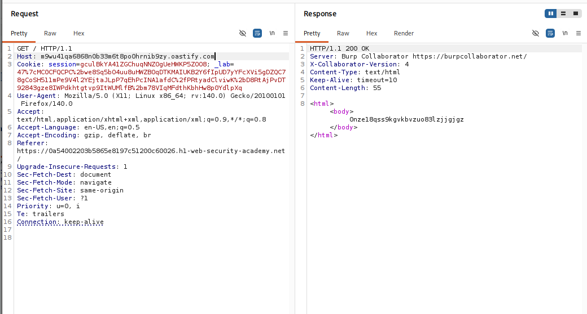
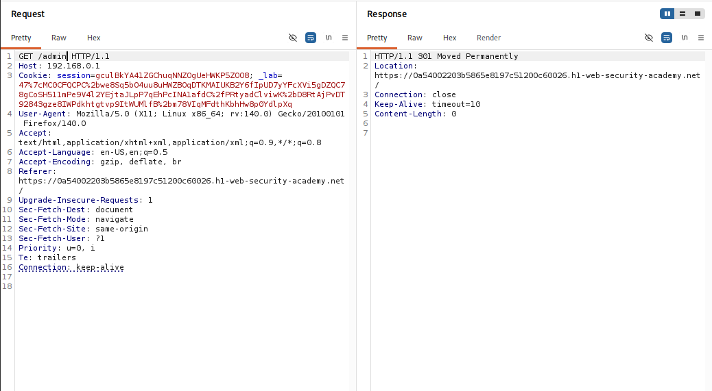
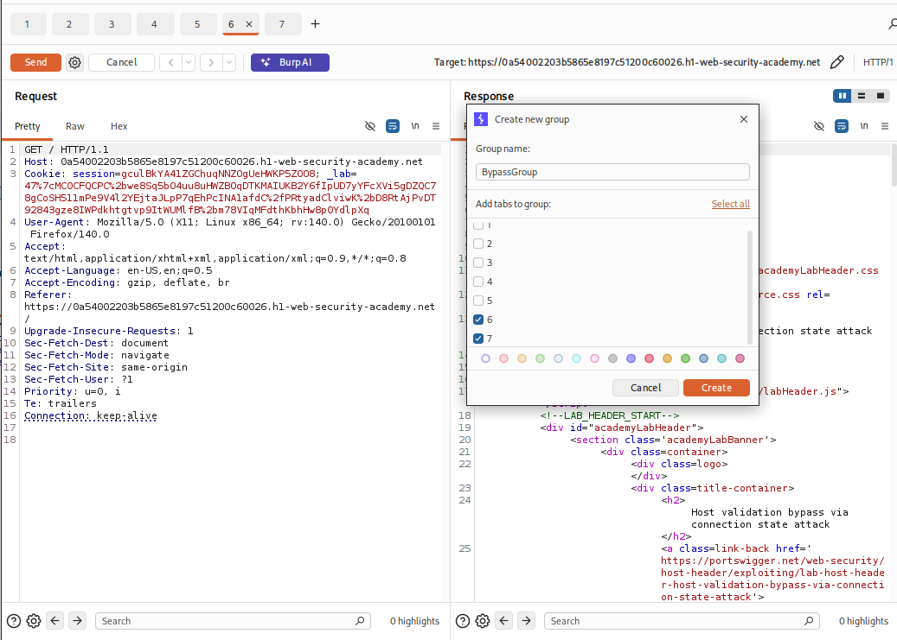
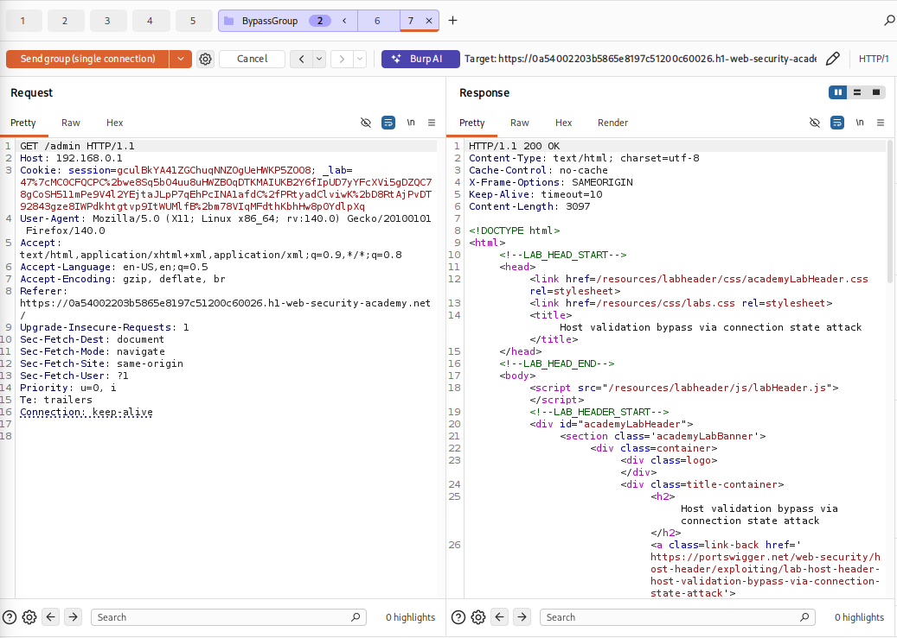
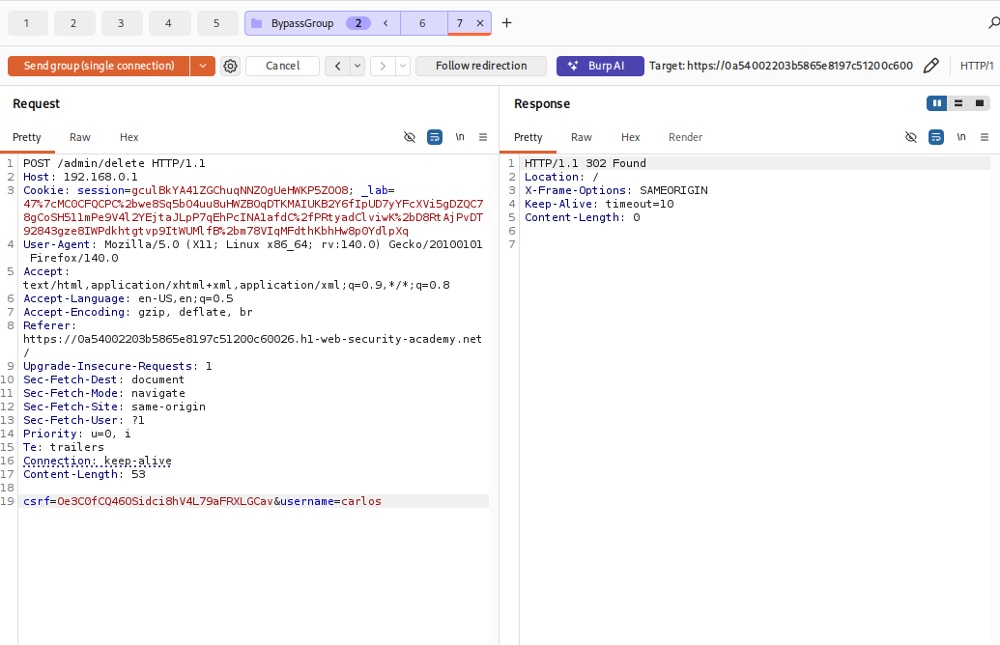
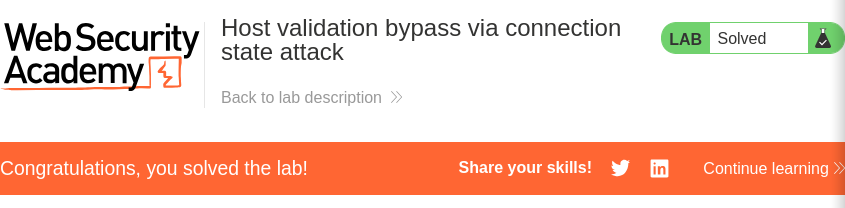

## Challenge Overview
* **Challenge name**: Host validation bypass via connection state attack
* **Category**: HTTP Host Header attacks / Connection State Discrepancy
* **Level**: Practitioner
* **Objective**: Bypass the front-end Host header validation mechanism via a TCP connection state (Keep-Alive) attack, access the internal administration interface at `192.168.0.1`, and delete the `carlos` account.

---

## 1. Core Fundamentals

In high-performance networking architectures, HTTP/1.1 and HTTP/2 utilize persistent connections to reuse a single underlying TCP transport channel across multiple sequential request-response cycles. This mechanism mitigates latency overhead by eliminating redundant TCP three-way handshakes and TLS cryptographic negotiations for each discrete request.

### 1.1. Network Connection Reuse Mechanics

Systems typically maintain a connection pool between front-end reverse proxies and backend servers. When a client transmits a sequence of requests featuring the header `Connection: keep-alive`, the proxy receives and multiplexes these messages across an existing, open TCP socket without tearing down the underlying session.

### 1.2. The Connection-State Dependency Pitfall

Vulnerabilities arise when a reverse proxy implements stateful security validation instead of inspecting each request message independently:
- **On the Initial Request**: The proxy performs full inspection, validating the Host header against a whitelist of legitimate hostnames. Once this check succeeds, the underlying TCP connection is marked as trusted.
- **On Subsequent Requests Across the Same Connection**: The proxy erroneously assumes that all subsequent messages multiplexed through this trusted connection inherit the trustworthiness of the initial request, skipping Host header validation entirely.

---

## 2. Attack Architecture / Threat Model

### 2.1. Root Cause and Vulnerability Preconditions

- **Erroneous Trust Assumption**: The system assumes that because a TCP connection was initially validated, every subsequent request received over that connection is safe.
- **Absence of Per-Message Validation**: The front-end fails to parse and re-validate the Host header for secondary requests passing through the keep-alive pipeline.
- **Host-Dependent Backend Routing**: The backend server continues to evaluate and route requests based on each message's individual Host header without cross-checking the front-end validation state.

### 2.2. Attack Flow Diagram

```text
[ Attacker from Internet ]
       │
       │  (1) Request 1: GET / HTTP/1.1
       │      Host: victim-lab.net          <── Valid Host, Connection: keep-alive
       │
       │  (2) Request 2: GET /admin HTTP/1.1 (Sent immediately on the SAME TCP connection)
       │      Host: 192.168.0.1             <── Internal LAN Host!
       ▼
[ Front-end Reverse Proxy ]
       │
       │  Request 1: Validates legitimate Host ──► Marks TCP connection: TRUSTED
       │  Request 2: Observes TRUSTED connection ──► SKIPS HOST HEADER VALIDATION!
       ▼
[ Back-end Server / Intranet Admin ]
       │
       │  Receives Request 2 with Host: 192.168.0.1
       │  Processes request and returns Admin Panel interface
       ▼
[ Successful Bypass! Returns 200 OK to Attacker ]
```

---

## 3. Vulnerability Exploitation

The vulnerability verification procedure was executed sequentially across four phases:

### Phase 1: Investigating Routing Behavior and Front-end Blocking

Transmit a probe request with the Host header pointing to the Burp Collaborator domain `m9wu41qa6868n0b33m6t8po0hrnib9zy.oastify.com`. The server responds with `HTTP/1.1 200 OK` originating from Burp Collaborator, confirming that backend routing relies dynamically on the Host header:

```http
GET / HTTP/1.1
Host: m9wu41qa6868n0b33m6t8po0hrnib9zy.oastify.com
Connection: keep-alive
```



Next, attempt to send an isolated request `GET /admin HTTP/1.1` directly targeting `Host: 192.168.0.1`. The front-end immediately blocks access, returning an `HTTP/1.1 301 Moved Permanently` redirecting back to the official domain accompanied by a `Connection: close` directive:

```http
GET /admin HTTP/1.1
Host: 192.168.0.1
Connection: keep-alive
```



---

### Phase 2: Configuring Request Grouping Over a Single Connection

To circumvent this defense mechanism, configure a sequence of requests to be transmitted over a single persistent TCP connection within Burp Suite Repeater:
- **First Tab (Legitimate Request)**: Sends `GET / HTTP/1.1` with the official lab Host header and `Connection: keep-alive` to validate and establish the trusted connection.
- **Second Tab (Malicious Request)**: Sends `GET /admin HTTP/1.1` targeting `Host: 192.168.0.1`.

Create a new Tab Group named `BypassGroup` containing both request tabs:



---

### Phase 3: Executing the Connection State Attack to Access the Admin Panel

In the `BypassGroup` tab, select the sending mode **Send group (single connection)**. Burp Suite establishes a single TCP connection, sends the legitimate request from the first tab, and immediately reuses that exact socket to deliver the second request.

Result: The second request with `Host: 192.168.0.1` is no longer intercepted with a 301 redirect. Instead, it successfully receives an `HTTP/1.1 200 OK` response, exposing the complete internal administrative interface.



---

### Phase 4: Deleting the Carlos Account and Completing the Lab

Extract the CSRF token from the admin panel's HTML source (`0e3C0fCQ460Sidci8hV4L79aFRXLGcav`). Craft the deletion request targeting Carlos in the second tab:

```http
POST /admin/delete HTTP/1.1
Host: 192.168.0.1
Cookie: session=gculBkYA41ZGChuqNNZOgUeHWKP5ZO08; ...
Connection: keep-alive
Content-Length: 53

csrf=0e3C0fCQ460Sidci8hV4L79aFRXLGcav&username=carlos
```

Click **Send group (single connection)** again. The internal server receives and processes the deletion command, responding with an `HTTP/1.1 302 Found` redirecting back to the homepage. The `carlos` account is successfully deleted.



Checking the lab interface in the browser verifies that the challenge has been solved.



---

## 4. Remediation Strategies

### 4.1. Reverse Proxy Hardening

- **Stateless Per-Request Validation**: Reverse proxies must never rely on underlying TCP connection state to bypass security inspection. Every discrete HTTP request multiplexed over a keep-alive connection must undergo independent Host header parsing and whitelist verification.
- **Connection Pool Isolation Across Security Boundaries**: Do not share persistent TCP connection pools between external public client traffic and internal backend routing segments.
- **Connection Teardown on Context Switching**: When a request targets a resource belonging to a different security zone or changes the target authority, the proxy should actively terminate the existing connection and negotiate a clean socket.

### 4.2. Application-Layer Controls

- **Independent Session Authentication**: All administrative and sensitive endpoints must strictly validate user session tokens on every request rather than placing implicit trust in network perimeter proxies.
- **Defense-in-Depth Access Controls**: Internal sensitive services must enforce independent mutual TLS (mTLS) or API gateway tokens, preventing unauthorized lateral movement even if network segmentation is bypassed.
