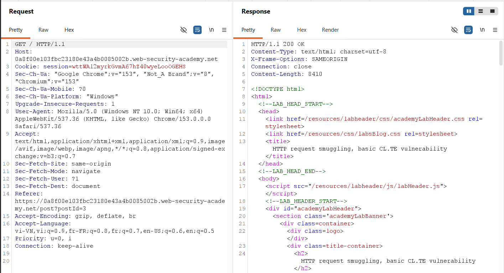
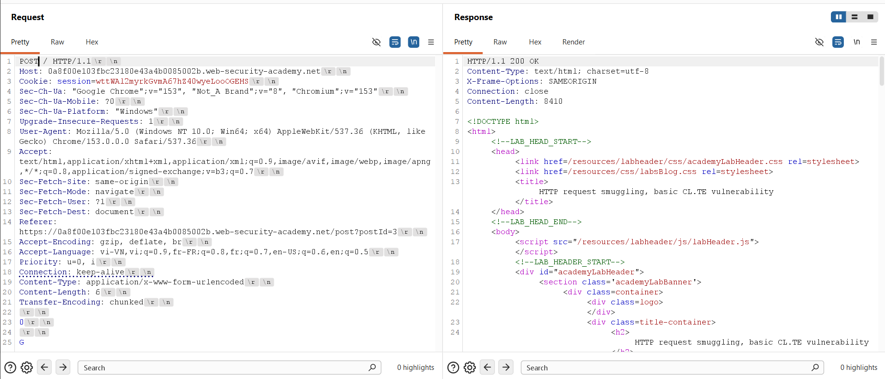
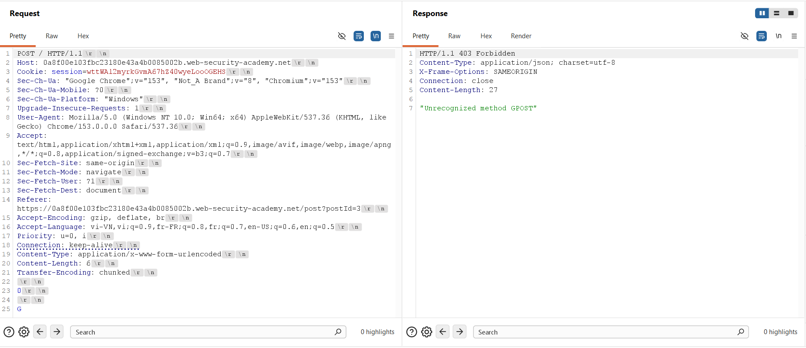
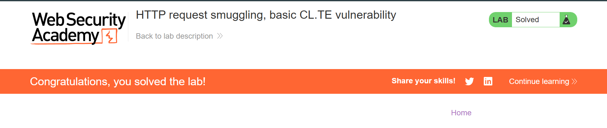

## Thông tin bài Lab
* **Tên bài Lab**: HTTP request smuggling, basic CL.TE vulnerability
* **Chuyên đề**: HTTP Request Smuggling
* **Mức độ**: Practitioner
* **Mục tiêu**: Khai thác sự bất đồng bộ giữa Front-end và Back-end bằng kỹ thuật tuồn request CL.TE, khiến yêu cầu tiếp theo gửi đến Back-end bị biến đổi phương thức thành `GPOST` và bị từ chối với phản hồi 403 Forbidden.

---

## 1. Kiến thức nền tảng

Lỗ hổng HTTP Request Smuggling là lớp lỗ hổng bảo mật nghiêm trọng xảy ra tại tầng giao vận ứng dụng, xuất phát từ sự bất đồng bộ trong việc xác định ranh giới gói tin giữa các thành phần trung gian và máy chủ xử lý dữ liệu cuối cùng.

### 1.1. Kiến trúc chuỗi máy chủ chuyển tiếp và cơ chế tái sử dụng kết nối
* **Mô hình đa tầng:** Kiến trúc ứng dụng web hiện đại thường triển khai mô hình đa tầng gồm Front-end (Reverse Proxy, bộ cân bằng tải, CDN, tường lửa ứng dụng web) và Back-end (máy chủ ứng dụng nội bộ).
* **Cơ chế tái sử dụng kết nối:** Để tối ưu hiệu năng mạng và giảm chi phí thiết lập bắt tay TCP cũng như TLS, Front-end duy trì các kết nối TCP dài hạn dùng chung tới Back-end (HTTP Keep-Alive / Connection Reuse). Toàn bộ các yêu cầu HTTP từ nhiều người dùng khác nhau sẽ được Front-end ghép liên tiếp vào cùng một luồng dữ liệu trên kết nối TCP này để chuyển tiếp tới Back-end.

### 1.2. Cơ chế phân định ranh giới gói tin theo chuẩn HTTP/1.1
Theo tiêu chuẩn RFC 7230, giao thức HTTP/1.1 cung cấp hai tiêu đề chính để xác định điểm kết thúc của phần thân thông điệp:
* **Content-Length:** Chỉ định độ dài chính xác của phần thân thông điệp bằng số lượng byte cụ thể.
* **Transfer-Encoding:** Khi mang giá trị `chunked`, phần thân thông điệp được chia thành các khối dữ liệu. Mỗi khối bắt đầu bằng độ dài dữ liệu tính theo hệ thập lục phân, theo sau bởi cặp ký tự xuống dòng CRLF (`\r\n`), nội dung của khối và kết thúc bằng một khối có kích thước bằng 0 (khối `0\r\n\r\n`).
* **Quy tắc xung đột theo RFC 7230:** Mục 3.3.3 của tiêu chuẩn RFC 7230 quy định rõ: nếu một thông điệp chứa đồng thời cả tiêu đề Content-Length và Transfer-Encoding, tiêu đề Transfer-Encoding bắt buộc phải được ưu tiên xử lý và tiêu đề Content-Length phải bị bỏ qua để ngăn chặn các xung đột định tuyến dữ liệu.

### 1.3. Lỗ hổng bất đồng bộ dạng CL.TE
Lỗ hổng CL.TE phát sinh khi có sự bất đồng bộ trong việc tuân thủ tiêu chuẩn giữa hai máy chủ:
* **Đặc điểm Front-end:** Front-end ưu tiên xử lý tiêu đề Content-Length và bỏ qua Transfer-Encoding.
* **Đặc điểm Back-end:** Back-end tuân thủ chuẩn RFC hoặc ưu tiên xử lý tiêu đề `Transfer-Encoding: chunked`.

Hậu quả là Front-end đọc toàn bộ gói tin dựa trên số byte của Content-Length, trong khi Back-end dừng đọc ngay tại khối chunked kết thúc, để lại phần dữ liệu thừa nằm lại trong bộ đệm của socket kết nối TCP.

---

## 2. Mô hình tấn công

Mô hình tấn công CL.TE tận dụng kỹ thuật nhồi một phần của yêu cầu tiếp theo vào cuối phần thân của yêu cầu hiện tại, khiến Back-end hiểu nhầm phần dữ liệu thừa này là phần mở đầu của yêu cầu kế tiếp trong cùng kết nối TCP.

```text
[Attacker]
    │
    │ Gửi yêu cầu chứa cả Content-Length và Transfer-Encoding
    ▼
[Front-end Server] (Ưu tiên Content-Length: 6)
    │ Đọc toàn bộ 6 byte (gồm cả chunk 0 và byte 'G')
    │ Chuyển tiếp toàn bộ gói tin tới Back-end trên kết nối TCP dùng chung
    ▼
[Back-end Server] (Ưu tiên Transfer-Encoding: chunked)
    │ Đọc gặp '0\r\n\r\n' -> Kết thúc yêu cầu 1, trả về 200 OK
    │ Byte 'G' còn lại bị giữ trong bộ đệm TCP socket
    ▼
[Yêu cầu tiếp theo từ máy khách: POST / HTTP/1.1]
    │ Đi vào cùng kết nối TCP
    │ Back-end ghép byte 'G' tồn đọng vào đầu -> Trở thành GPOST / HTTP/1.1
    ▼
[Back-end phản hồi 403 Forbidden - "Unrecognized method GPOST"]
```

### 2.1. Luồng dữ liệu tấn công
1. **Bước 1 - Gửi yêu cầu đầu độc:** Kẻ tấn công tạo một yêu cầu HTTP POST chứa đồng thời `Content-Length: 6` và `Transfer-Encoding: chunked`. Thân gói tin chứa khối kết thúc `0\r\n\r\n` và một ký tự tuồn `G`.
2. **Bước 2 - Front-end chuyển tiếp:** Front-end đọc đúng 6 byte trong phần thân (bao gồm cả khối 0 và ký tự G) theo chỉ số Content-Length, xác nhận gói tin hợp lệ và chuyển tiếp toàn bộ 6 byte này qua kết nối TCP tới Back-end.
3. **Bước 3 - Back-end xử lý chunk kết thúc:** Back-end phân tích gói tin theo `Transfer-Encoding: chunked`. Khi gặp khối kích thước `0\r\n\r\n`, Back-end xác định yêu cầu thứ nhất đã kết thúc hoàn chỉnh, xử lý và phản hồi mã 200 OK cho yêu cầu này.
4. **Bước 4 - Tồn đọng dữ liệu trong bộ đệm:** Ký tự `G` còn lại chưa được xử lý không bị hủy bỏ mà vẫn tồn đọng trong bộ đệm tiếp nhận của socket kết nối TCP trên Back-end.
5. **Bước 5 - Biến dạng yêu cầu tiếp theo:** Khi một yêu cầu HTTP tiếp theo (ví dụ `POST / HTTP/1.1`) được gửi tới trên cùng kết nối TCP, Back-end đọc dữ liệu từ bộ đệm bắt đầu bằng ký tự `G`, ghép nối trực tiếp với phần đầu của yêu cầu mới tạo thành `GPOST / HTTP/1.1`.
6. **Bước 6 - Kích hoạt phản hồi lỗi:** Back-end không nhận dạng được phương thức `GPOST`, lập tức từ chối và trả về mã phản hồi 403 Forbidden kèm thông báo lỗi phương thức không hợp lệ.

### 2.2. Nguyên nhân cốt lõi và điều kiện phát sinh lỗ hổng
* **Nguyên nhân 1:** Front-end không tuân thủ nghiêm ngặt tiêu chuẩn RFC 7230 khi ưu tiên Content-Length thay vì Transfer-Encoding khi cả hai tiêu đề cùng hiện diện.
* **Nguyên nhân 2:** Front-end chuyển tiếp nguyên vẹn thông điệp có chứa cặp tiêu đề xung đột tới Back-end mà không chuẩn hóa tiêu đề hoặc từ chối gói tin ngay tại cửa ngõ.
* **Nguyên nhân 3:** Hệ thống sử dụng chung một kết nối TCP đường truyền nội bộ để vận chuyển nhiều yêu cầu HTTP độc lập mà không có cơ chế cô lập ngữ cảnh gói tin.

---

## 3. Khai thác lỗ hổng

Quá trình thực nghiệm tấn công được tiến hành trên Burp Suite Repeater nhằm chứng minh khả năng làm biến dạng yêu cầu tiếp theo thông qua kỹ thuật tuồn gói tin CL.TE.

### 3.1. Khảo sát hành vi yêu cầu HTTP ban đầu
Chặn bắt một yêu cầu `GET / HTTP/1.1` thông thường tới trang chủ của ứng dụng mục tiêu và chuyển sang Burp Suite Repeater để kiểm tra phản hồi:

```http
GET / HTTP/1.1
Host: 0a8f00e103fbc23180e43a4b0085002b.web-security-academy.net
Cookie: session=wttWAl2myrkGvmA67hZ40wyeLooOGEHS
Connection: keep-alive
```

Máy chủ xử lý bình thường và trả về mã trạng thái `HTTP/1.1 200 OK` cùng toàn bộ nội dung HTML của trang chủ.



### 3.2. Cấu hình kiểm thử lỗ hổng CL.TE và gửi yêu cầu đầu độc

Chuyển đổi phương thức yêu cầu sang `POST`, tắt tính năng `Update Content-Length` tự động trong cấu hình Repeater của Burp Suite, và cấu hình gói tin chứa đồng thời hai tiêu đề xác định độ dài:

> [!NOTE]
> **Lưu ý cấu hình giao thức trong Burp Repeater:**
> Mặc dù hệ thống bài lab có hỗ trợ HTTP/2, kỹ thuật khai thác bất đồng bộ CL.TE cổ điển yêu cầu tương tác trực tiếp ở cấp độ tiêu đề văn bản của HTTP/1.1. Bạn cần đảm bảo đã chuyển đổi giao thức của request sang `HTTP/1.1` trong phần **Request attributes** tại panel **Inspector** của Burp Suite Repeater, đồng thời bỏ chọn **Update Content-Length** trong menu tùy chọn của Repeater để giữ nguyên giá trị độ dài cố định là 6 byte.
>
> Máy chủ Front-end trong bài lab không hỗ trợ `chunked encoding` (nên ưu tiên đọc `Content-Length`), đồng thời áp dụng cơ chế kiểm soát chỉ cho phép các yêu cầu có phương thức `GET` hoặc `POST`.

```http
POST / HTTP/1.1
Host: 0a8f00e103fbc23180e43a4b0085002b.web-security-academy.net
Connection: keep-alive
Content-Type: application/x-www-form-urlencoded
Content-Length: 6
Transfer-Encoding: chunked

0

G
```

Phân tích cấu trúc phần thân gói tin:
* **Ký tự kết thúc chunk:** Ký tự `0` chiếm 1 byte.
* **Ký tự phân tách dòng CRLF:** Hai cặp ký tự xuống dòng `\r\n\r\n` chiếm 4 byte.
* **Dữ liệu tuồn:** Ký tự tuồn `G` chiếm 1 byte.
* **Tổng số byte:** Tổng độ dài phần thân đúng bằng `1 + 2 + 2 + 1 = 6` byte, khớp chính xác với giá trị `Content-Length: 6`.

Gửi yêu cầu lần thứ nhất, máy chủ trả về mã `HTTP/1.1 200 OK` do Back-end đã đọc khối chunked `0` và hoàn tất xử lý yêu cầu hợp lệ ban đầu, trong khi ký tự `G` vẫn nằm lại trong bộ đệm kết nối TCP.



### 3.3. Kích hoạt lỗi phương thức không xác định trên yêu cầu tiếp theo
Tiếp tục nhấn `Send` gửi yêu cầu thứ hai ngay trên cùng kết nối TCP. Lúc này, Back-end đọc dữ liệu từ bộ đệm bắt đầu bằng ký tự `G` còn sót lại, ghép nối liền với phần đầu `POST / HTTP/1.1` của yêu cầu mới:

```http
GPOST / HTTP/1.1
Host: 0a8f00e103fbc23180e43a4b0085002b.web-security-academy.net
...
```

Back-end nhận diện phương thức yêu cầu là `GPOST` - một phương thức HTTP hoàn toàn không hợp lệ, và lập tức phản hồi mã trạng thái `403 Forbidden` cùng thông báo chi tiết trong phần thân phản hồi:

```http
HTTP/1.1 403 Forbidden
Content-Type: application/json; charset=utf-8
X-Frame-Options: SAMEORIGIN
Connection: close
Content-Length: 27

"Unrecognized method GPOST"
```



### 3.4. Xác nhận hoàn thành bài thực hành
Sau khi chuỗi ký tự `GPOST` được xử lý thành công trên máy chủ Back-end, hệ thống của bài lab xác nhận lỗ hổng CL.TE đã được chứng minh và giải quyết thành công.



---

## 4. Biện pháp khắc phục

Để loại bỏ hoàn toàn lỗ hổng HTTP Request Smuggling dạng CL.TE, cần thực hiện các biện pháp kiểm soát kiến trúc và cấu hình hệ thống đồng bộ:

### 4.1. Nâng cấp và triển khai HTTP/2 toàn diện
* **Đóng khung nhị phân:** Sử dụng giao thức HTTP/2 cho toàn bộ chuỗi kết nối từ máy khách tới Front-end và từ Front-end tới Back-end (End-to-End HTTP/2). HTTP/2 sử dụng cơ chế đóng khung nhị phân với độ dài khung dữ liệu được xác định tường minh trong phần tiêu đề nhị phân, loại bỏ hoàn toàn việc phân tích cú pháp chuỗi văn bản Content-Length hay Transfer-Encoding.
* **Tránh giáng cấp giao thức:** Tránh cấu hình giáng cấp giao thức từ HTTP/2 ở Front-end xuống HTTP/1.1 ở Back-end, vì quá trình chuyển đổi này rất dễ làm tái xuất hiện các lỗ hổng bất đồng bộ.

### 4.2. Chuẩn hóa và làm sạch tiêu đề tại Front-end
* **Từ chối yêu cầu mơ hồ:** Cấu hình Front-end kiểm tra chặt chẽ các yêu cầu đến. Nếu phát hiện yêu cầu chứa đồng thời cả hai tiêu đề Content-Length và Transfer-Encoding, hệ thống phải từ chối ngay lập tức với mã lỗi 400 Bad Request thay vì cố gắng phân giải.
* **Chuẩn hóa định dạng:** Trường hợp bắt buộc phải chuyển tiếp, Front-end phải chuẩn hóa thông điệp thành một định dạng duy nhất (ví dụ: giải mã toàn bộ khối chunked và thiết lập lại tiêu đề Content-Length chuẩn xác) trước khi chuyển tiếp tới Back-end.

### 4.3. Quản lý kết nối an toàn giữa Front-end và Back-end
* **Đồng bộ hóa phần mềm máy chủ:** Sử dụng cùng một loại phần mềm máy chủ web hoặc đồng bộ hóa phiên bản và cấu hình phân tích cú pháp HTTP giữa Front-end và Back-end để bảo đảm tính thống nhất tuyệt đối trong việc tuân thủ tiêu chuẩn RFC 7230.
* **Kiểm soát tái sử dụng kết nối:** Thiết lập giới hạn tái sử dụng kết nối TCP giữa Front-end và Back-end, hoặc vô hiệu hóa việc ghép nhiều yêu cầu của các phiên người dùng khác nhau trên cùng một kết nối nội bộ.
