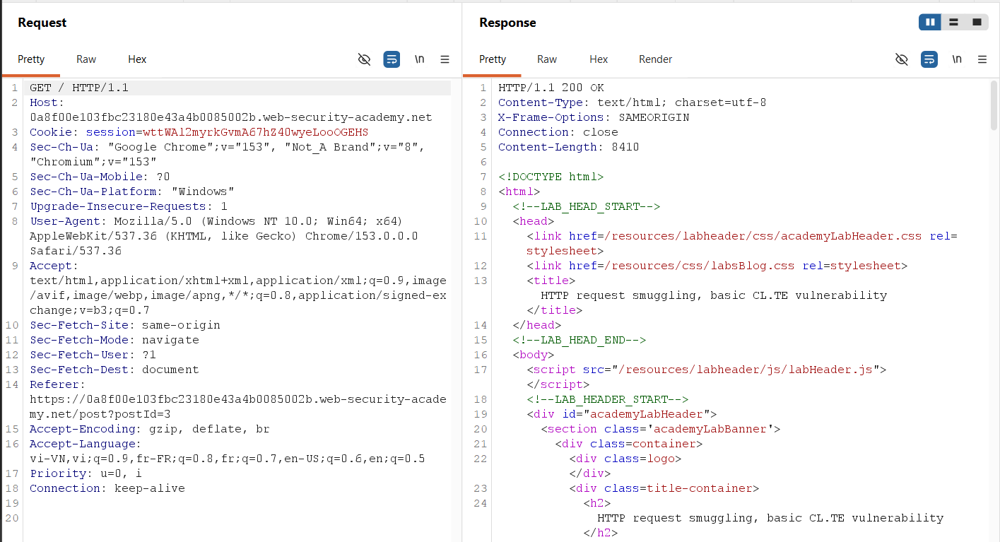
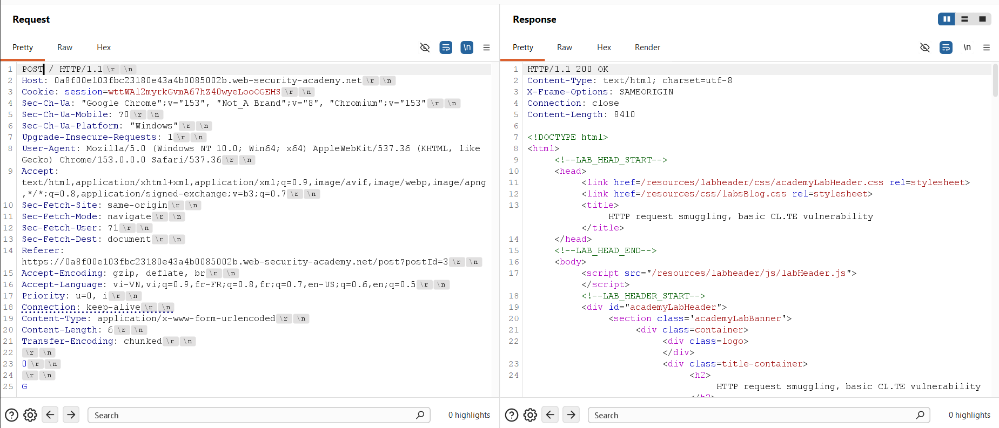
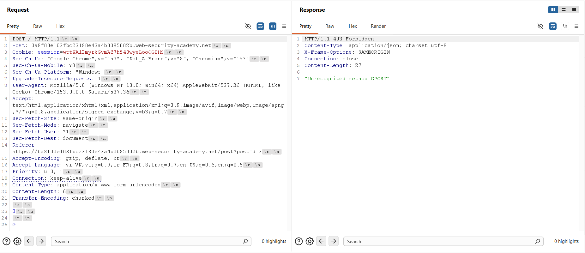
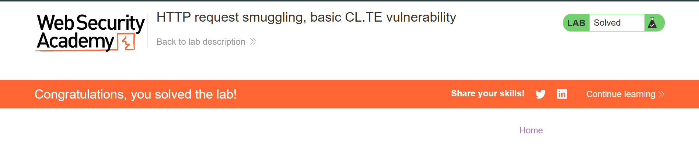

## Challenge Overview
* **Challenge name**: HTTP request smuggling, basic CL.TE vulnerability
* **Category**: HTTP Request Smuggling
* **Level**: Practitioner
* **Objective**: Exploit a front-end and back-end desynchronization using the CL.TE request smuggling technique to alter the subsequent request forwarded to the back-end, mutating its method to `GPOST` and eliciting a 403 Forbidden response.

---

## 1. Core Fundamentals

HTTP Request Smuggling is a critical application-layer vulnerability arising from discrepancies in message boundary delimitation between intermediate reverse proxies and backend application servers.

### 1.1. Reverse Proxy Chain Architecture and Connection Reuse
* **Multi-Tier Model:** Modern web architectures commonly deploy a reverse proxy chain consisting of a Front-end server (Reverse Proxy, Load Balancer, CDN, or WAF) and a Back-end server (internal application server).
* **Connection Pooling and Reuse:** To optimize network performance and reduce TCP/TLS handshake overhead, the front-end maintains persistent, long-lived TCP connections to the back-end (HTTP Keep-Alive / Connection Reuse). Incoming HTTP requests from disparate clients are multiplexed sequentially across these shared TCP streams to the back-end.

### 1.2. HTTP/1.1 Message Framing and Delimitation Mechanics
Under RFC 7230, the HTTP/1.1 protocol provides two primary headers to demarcate message body boundaries:
* **Content-Length:** Explicitly indicates the size of the message body in octets (bytes).
* **Transfer-Encoding:** When configured to `chunked`, the message body is split into a series of chunks. Each chunk begins with its size represented in hexadecimal, followed by a CRLF (`\r\n`), the chunk data, and terminates with a zero-length chunk (`0\r\n\r\n`).
* **Conflict Resolution under RFC 7230:** Section 3.3.3 of RFC 7230 specifies that if a message contains both `Content-Length` and `Transfer-Encoding`, the `Transfer-Encoding` header MUST take precedence and the `Content-Length` header MUST be ignored to prevent request routing discrepancies.

### 1.3. The CL.TE Desynchronization Primitive
A CL.TE vulnerability occurs when there is an implementation discrepancy regarding RFC compliance between proxy layers:
* **Front-end Behavior:** The front-end prioritizes the `Content-Length` header and ignores or does not support `Transfer-Encoding`.
* **Back-end Behavior:** The back-end complies with RFC specifications, prioritizing `Transfer-Encoding: chunked`.

Consequently, the front-end forwards the entire payload based on the byte count in `Content-Length`, whereas the back-end terminates parsing at the terminating zero-chunk, leaving unparsed bytes lingering in the TCP connection's socket buffer.

---

## 2. Attack Architecture / Threat Model

The CL.TE attack pattern involves injecting a partial request prefix into the body of an initial request. The back-end treats this leftover data as the start of the next incoming request on the shared TCP connection.

```text
[Attacker]
    │
    │ Sends request containing both Content-Length and Transfer-Encoding
    ▼
[Front-end Server] (Prioritizes Content-Length: 6)
    │ Reads entire 6 bytes (including chunk 0 and byte 'G')
    │ Forwards entire packet to Back-end over shared TCP connection
    ▼
[Back-end Server] (Prioritizes Transfer-Encoding: chunked)
    │ Reads up to '0\r\n\r\n' -> Completes request 1, responds 200 OK
    │ Remaining byte 'G' lingers in TCP socket receive buffer
    ▼
[Subsequent client request: POST / HTTP/1.1]
    │ Arrives on the same TCP connection
    │ Back-end prepends lingering 'G' to new request -> Becomes GPOST / HTTP/1.1
    ▼
[Back-end responds 403 Forbidden - "Unrecognized method GPOST"]
```

### 2.1. Attack Execution Flow
1. **Step 1 - Dispatching the Poisoning Request:** The attacker crafts an HTTP POST request specifying both `Content-Length: 6` and `Transfer-Encoding: chunked`. The request body includes the terminating chunk `0\r\n\r\n` followed by a smuggled prefix character `G`.
2. **Step 2 - Front-end Forwarding:** The front-end evaluates the body length as exactly 6 bytes (including chunk 0 and character G) per the `Content-Length` header, treats the request as valid, and forwards all 6 bytes across the pooled TCP connection.
3. **Step 3 - Back-end Chunk Parsing:** The back-end parses the payload using `Transfer-Encoding: chunked`. Upon encountering `0\r\n\r\n`, it marks the first request as complete and returns an `HTTP/1.1 200 OK` response.
4. **Step 4 - Buffer Remainder:** The remaining unparsed character `G` is not discarded; it remains buffered in the back-end's TCP socket receive queue.
5. **Step 5 - Request Mutation:** When the next HTTP request (e.g., `POST / HTTP/1.1`) is processed on the same connection, the back-end reads from the socket buffer starting with `G`, prepending it to the incoming request line to form `GPOST / HTTP/1.1`.
6. **Step 6 - Triggering the Error Response:** The back-end fails to recognize `GPOST` as a valid HTTP verb and rejects the request with a `403 Forbidden` status code accompanied by an invalid method error message.

### 2.2. Root Cause and Vulnerability Preconditions
* **Root Cause 1:** The front-end violates RFC 7230 section 3.3.3 by failing to prioritize `Transfer-Encoding` over `Content-Length`.
* **Root Cause 2:** The front-end transparently relays conflicting framing headers without sanitization, normalization, or early rejection at the perimeter.
* **Root Cause 3:** The infrastructure multiplexes independent client sessions across persistent back-end TCP connections without session-level or request-level isolation barriers.

---

## 3. Vulnerability Exploitation

The exploitation process was conducted using Burp Suite Repeater to demonstrate request method mutation via CL.TE smuggling.

### 3.1. Baseline HTTP Traffic Analysis
Capturing a standard `GET / HTTP/1.1` request targeting the application's root endpoint and analyzing the response via Burp Suite Repeater:

```http
GET / HTTP/1.1
Host: 0a8f00e103fbc23180e43a4b0085002b.web-security-academy.net
Cookie: session=wttWAl2myrkGvmA67hZ40wyeLooOGEHS
Connection: keep-alive
```

The application functions normally, returning an `HTTP/1.1 200 OK` status code alongside the HTML content of the homepage.



### 3.2. Crafting the CL.TE Desynchronization Payload

Switch the request method to `POST`, disable the automatic `Update Content-Length` option in Burp Suite Repeater, and configure dual framing headers:

> [!NOTE]
> **Burp Repeater Protocol Configuration:**
> Although the lab infrastructure supports HTTP/2, classic CL.TE exploitation relies on direct interaction with textual HTTP/1.1 headers. Ensure the protocol is explicitly set to `HTTP/1.1` under **Request attributes** in Burp Repeater's **Inspector** tab, and uncheck **Update Content-Length** from the Repeater menu to lock the body length at 6 bytes.
>
> The front-end server does not support `chunked encoding` (defaulting to `Content-Length`) and enforces an access rule permitting only `GET` and `POST` methods.

```http
POST / HTTP/1.1
Host: 0a8f00e103fbc23180e43a4b0085002b.web-security-academy.net
Connection: keep-alive
Content-Type: application/x-www-form-urlencoded
Content-Length: 6
Transfer-Encoding: chunked

0

G
```

Payload structure breakdown:
* **Terminating Chunk:** The character `0` accounts for 1 byte.
* **CRLF Delimiters:** Two consecutive CRLF line breaks (`\r\n\r\n`) account for 4 bytes.
* **Smuggled Prefix:** The smuggled character `G` accounts for 1 byte.
* **Total Byte Length:** The exact body length equals `1 + 2 + 2 + 1 = 6` bytes, matching `Content-Length: 6`.

Dispatching the first request yields an `HTTP/1.1 200 OK` response because the back-end processes the terminating chunk `0` and fulfills the initial request, leaving `G` lingering in the TCP connection buffer.



### 3.3. Smuggling the Payload and Triggering Method Poisoning
Send a second request immediately across the same TCP connection. The back-end consumes the lingering `G` from its socket buffer, prepending it to the incoming request line:

```http
GPOST / HTTP/1.1
Host: 0a8f00e103fbc23180e43a4b0085002b.web-security-academy.net
...
```

The back-end identifies the method as `GPOST`—an invalid HTTP verb—and returns a `403 Forbidden` response containing error details in the JSON body:

```http
HTTP/1.1 403 Forbidden
Content-Type: application/json; charset=utf-8
X-Frame-Options: SAMEORIGIN
Connection: close
Content-Length: 27

"Unrecognized method GPOST"
```



### 3.4. Challenge Completion Verification
Once the mutated `GPOST` request is processed by the back-end server, the Web Security Academy platform confirms the CL.TE vulnerability and marks the challenge as solved.



---

## 4. Remediation Strategies

To eliminate CL.TE HTTP Request Smuggling vulnerabilities, defense-in-depth architectural and configuration controls must be applied:

### 4.1. End-to-End HTTP/2 Implementation
* **Binary Framing Layer:** Deploy HTTP/2 end-to-end (Client-to-Front-end and Front-end-to-Back-end). HTTP/2 uses binary framing where frame lengths are explicitly declared within binary headers, entirely removing the ambiguity of textual `Content-Length` and `Transfer-Encoding` parsing.
* **Avoid Protocol Downgrades:** Prohibit protocol downgrading from HTTP/2 at the reverse proxy to HTTP/1.1 at the backend, as header translation is a frequent source of desynchronization flaws.

### 4.2. Front-End Header Normalization and Sanitization
* **Reject Ambiguous Requests:** Configure the reverse proxy to strictly inspect incoming requests. If a request provides both `Content-Length` and `Transfer-Encoding`, reject it immediately with an `HTTP 400 Bad Request` instead of attempting heuristic resolution.
* **Message Normalization:** When forwarding requests to legacy backend services, normalize messages into a single canonical format (e.g., dechunking the payload and recalculating an authoritative `Content-Length` header) before transmission.

### 4.3. Secure Connection Pooling and Backend Hardening
* **Server Software Parity:** Standardize HTTP server implementations, versions, and parsing libraries across proxy and application tiers to ensure uniform RFC 7230 compliance.
* **Connection Pool Isolation:** Limit backend TCP connection reuse or enforce strict connection isolation per user session to prevent lingering data in socket buffers from affecting subsequent client requests.
