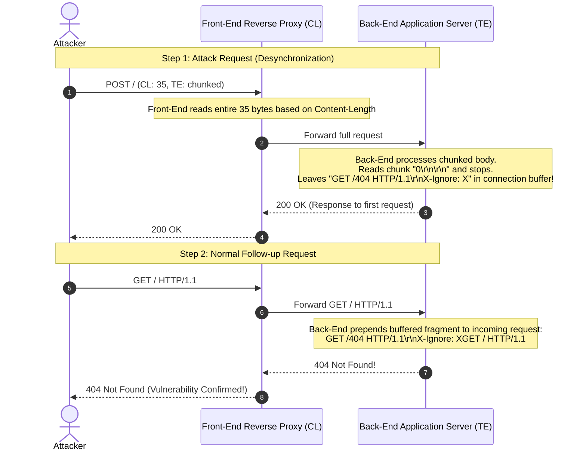

## Challenge Overview
* **Challenge name**: HTTP request smuggling, confirming a CL.TE vulnerability via differential responses
* **Category**: HTTP Request Smuggling
* **Level**: Practitioner
* **Objective**: Smuggle a request to the back-end server, so that a subsequent request for `/` (the web root) triggers a 404 Not Found response.

---

## 1. Core Fundamentals

### 1.1. Limitations of Timing-Based Detection
While timing delays (inducing a deliberate back-end read timeout) are effective for initial reconnaissance, they have inherent drawbacks:
1. **Network Jitter & Latency:** High network latency or temporary server overload can produce false positives.
2. **False Assumptions:** Delays can arise from other application factors rather than true HTTP pipeline desynchronization.
3. **Socket Starvation:** Inducing timeouts consumes server sockets, which may trigger rate-limiting or firewall defenses.

### 1.2. Confirmation via Differential Responses
Differential response confirmation provides deterministic proof of vulnerability:
* The attacker sends an **attack request** designed to desynchronize the front-end and back-end parser boundaries, leaving an unparsed request prefix stored in the backend TCP stream buffer.
* The attacker (or a victim) then sends a standard **normal request** (e.g., `GET /`).
* If desynchronization occurred, the backend prepends the stored prefix to the incoming request, transforming it into a completely different request (e.g., requesting a non-existent endpoint like `/404`), returning a **differential response** (`404 Not Found` instead of `200 OK`).

---

## 2. Attack Architecture & Desynchronization Mechanics

In a **CL.TE** vulnerability:
* **Front-end Server:** Prioritizes or exclusively supports `Content-Length`.
* **Back-end Server:** Prioritizes or supports `Transfer-Encoding: chunked`.



---

## 3. Exploitation & Step-by-Step PoC

### 3.1. Crafting the Smuggling Payload

In Burp Repeater, ensure HTTP/1.1 is selected (in the **Inspector** panel -> **Request attributes**). Ensure `Update Content-Length` is disabled in Repeater settings if manually tweaking bytes.

```http
POST / HTTP/1.1
Host: YOUR-LAB-ID.web-security-academy.net
Content-Type: application/x-www-form-urlencoded
Content-Length: 35
Transfer-Encoding: chunked

0

GET /404 HTTP/1.1
X-Ignore: X
```

> [!NOTE] Length Breakdown
> * `0\r\n\r\n` (5 bytes): Indicates end of chunked payload to the backend TE parser.
> * `GET /404 HTTP/1.1\r\n` (18 bytes).
> * `X-Ignore: X` (12 bytes without trailing CRLF).
> * Total body length = 5 + 18 + 12 = **35 bytes** matching `Content-Length: 35`.

### 3.2. Execution Steps
1. Capture any `POST /` or `GET /` request from the lab in Burp Suite and send it to **Repeater**.
2. Switch HTTP protocol to **HTTP/1.1** via Inspector if HTTP/2 is active.
3. Configure the headers and body as shown above.
4. Send the request once: The server responds with `200 OK`.
5. Immediately send the exact same request a second time: The backend combines the smuggled `GET /404` prefix with the incoming request, triggering an immediate **`404 Not Found`** response.
6. The lab status will transition to **Solved**.

---

## 4. Remediation & Defense-in-Depth

1. **Adopt End-to-End HTTP/2:** Using HTTP/2 natively between the front-end and back-end completely eliminates ambiguities regarding message framing and length calculation.
2. **Strict Request Normalization:** Front-end reverse proxies must sanitize incoming requests: if both `Content-Length` and `Transfer-Encoding` are present, either normalize to one standard or reject the request with `400 Bad Request`.
3. **Disable TCP Connection Reuse:** Where feasible for high-security boundaries, avoid multiplexing multiple independent clients over single persistent backend TCP connections.
