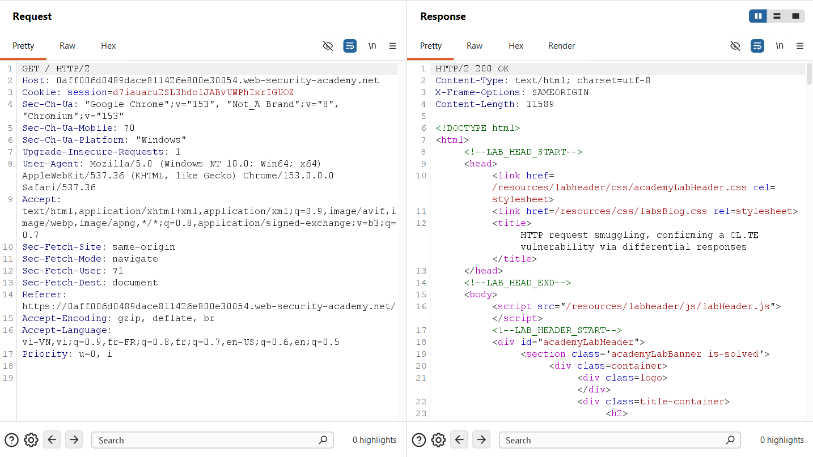
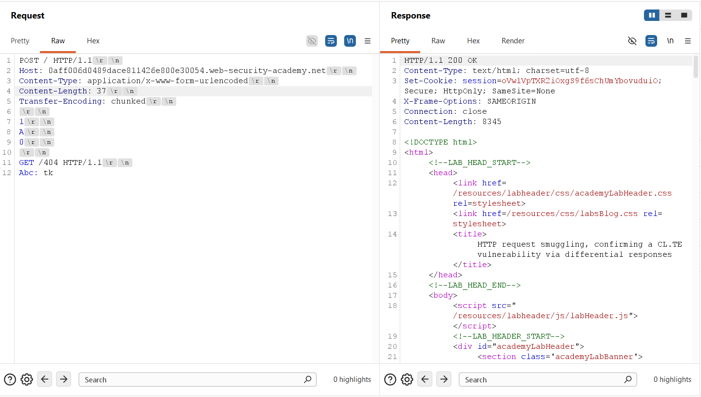
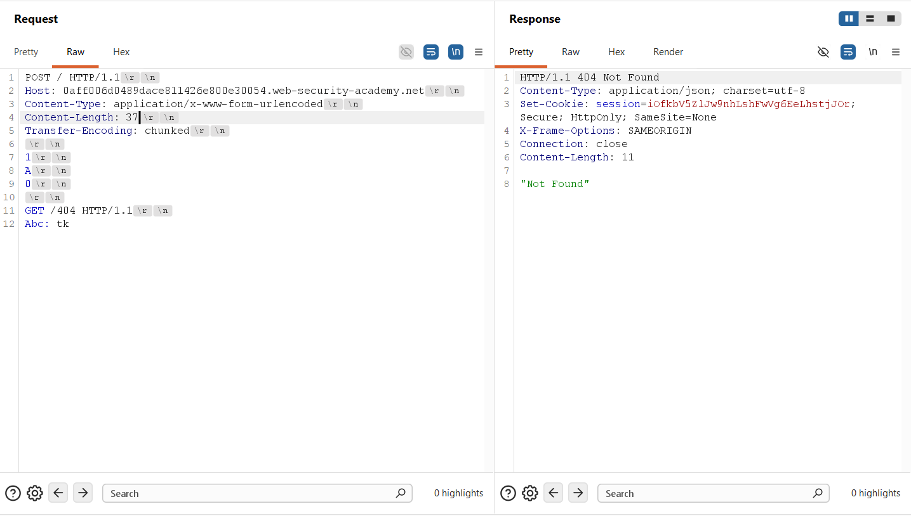
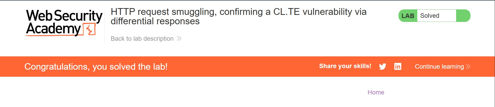

## Challenge Overview
* **Challenge name**: HTTP request smuggling, confirming a CL.TE vulnerability via differential responses
* **Category**: HTTP Request Smuggling
* **Level**: Practitioner
* **Objective**: Smuggle a request to the back-end server, so that a subsequent request for `/` (the web root) triggers a 404 Not Found response.

---

## 1. Fundamental Concepts

HTTP Request Smuggling represents a critical class of transport-layer application vulnerabilities that arise from discrepancies in how modern, multi-tier web architectures interpret message boundaries. Modern web applications rarely operate as monolithic services; instead, they employ an edge reverse proxy or load balancer (Front-end) that forwards client traffic to internal application servers (Back-end) over persistent, multiplexed TCP connections (HTTP Keep-Alive / Connection Reuse).

### 1.1. Message Framing in HTTP/1.1 and the CL.TE Desynchronization
* **Message Framing Standards:** Under RFC 7230, HTTP/1.1 specifies two distinct mechanisms for determining where the message body ends: the `Content-Length` header, which indicates the exact size of the payload in bytes, and the `Transfer-Encoding: chunked` header, which transmits data in a sequence of self-delimiting chunks terminated by a zero-length chunk (`0\r\n\r\n`).
* **The CL.TE Discrepancy:** A CL.TE vulnerability occurs when the Front-end server exclusively evaluates the `Content-Length` header to determine request boundaries, while the Back-end server prioritizes or supports `Transfer-Encoding: chunked`. When both headers are present, RFC 7230 Section 3.3.3 mandates that `Transfer-Encoding` must take precedence and `Content-Length` must be ignored. A failure by the Front-end to follow this specification creates a severe boundary desynchronization.

### 1.2. The Differential Responses Verification Technique
* **Limitations of Syntax-Based Probing:** In basic exploit scenarios, security testers often inject malformed method prefixes (such as `GPOST`) to provoke syntax errors (e.g., 400 Bad Request or 403 Forbidden). However, in realistic environments, syntax anomalies may be dropped by intermediate WAFs, fail to reach application routing, or prove indistinguishable from transient transport drops.
* **Principle of Differential Responses:** The Differential Responses technique represents the definitive confirmation methodology. Instead of inducing a syntax error, the tester smuggles a syntactically valid HTTP request targeted at a distinct resource (e.g., `GET /404 HTTP/1.1`). When the subsequent request arrives on the poisoned connection, it receives a completely different response code (404 Not Found instead of 200 OK). This divergence decisively proves that the back-end executed an entirely separate, smuggled request.

---

## 2. Attack Model & Architecture

The attack model relies on smuggling a partial HTTP request within the body of an outer request. The smuggled request carries an unclosed trailing header designed to absorb the request line of the next incoming request on the shared TCP connection.

```text
[Attacker]
    │
    │ 1. Sends dual-header request (Content-Length: 37, Transfer-Encoding: chunked)
    │    Body contains valid chunk (1\r\nA\r\n0\r\n\r\n) + partial request (GET /404... Abc: tk)
    ▼
[Front-end Server] (Prioritizes Content-Length: 37)
    │ Reads all 37 bytes as a single valid request
    │ Forwards entire 37-byte payload over shared TCP connection to Back-end
    ▼
[Back-end Server] (Prioritizes Transfer-Encoding: chunked)
    │ Reads chunk '1', data 'A', and terminating chunk '0\r\n\r\n'
    │ Completes Request #1 -> Returns HTTP/1.1 200 OK to Attacker
    │ Leftover stream 'GET /404 HTTP/1.1\r\nAbc: tk' remains in socket receive buffer
    ▼
[Subsequent Normal Request: POST / HTTP/1.1]
    │ Arrives on the same reused TCP connection
    │ Back-end reads buffered bytes first: 'Abc: tk' absorbs 'POST / HTTP/1.1'
    │ Effective request executed: GET /404 HTTP/1.1
    ▼
[Back-end returns HTTP/1.1 404 Not Found - Differential Response Confirmed]
```

### 2.1. Attack Data Flow
1. **Step 1 - Poisoning Request Transmission:** The attacker issues an HTTP/1.1 POST request containing both `Content-Length: 37` and `Transfer-Encoding: chunked`. The body contains a valid chunk sequence followed by a smuggled `GET /404 HTTP/1.1` request terminated by an unclosed header `Abc: tk`.
2. **Step 2 - Front-end Boundary Evaluation:** The Front-end reads all 37 bytes of the payload according to `Content-Length`, validates the request as a single unit, and forwards the entire stream over the pooled TCP connection to the Back-end.
3. **Step 3 - Back-end Chunk Processing & Desynchronization:** The Back-end parses the stream using `Transfer-Encoding: chunked`. Upon reading the terminating chunk (`0\r\n\r\n`), the Back-end concludes the primary request, processes it, and responds with `HTTP/1.1 200 OK`. The remaining bytes (`GET /404 HTTP/1.1\r\nAbc: tk`) remain unread in the back-end TCP socket buffer.
4. **Step 4 - Request Line Absorption:** A subsequent normal request (e.g., `POST / HTTP/1.1`) arrives on the reused connection. The Back-end reads the leftover buffered bytes first. The initial request line of the new request is concatenated directly after `Abc: tk`, converting it into a harmless header value (`Abc: tkPOST / HTTP/1.1`).
5. **Step 5 - Differential Response Execution:** The Back-end routes the request based on the smuggled request line (`GET /404 HTTP/1.1`). Because `/404` does not exist on the server, the Back-end responds with `HTTP/1.1 404 Not Found`, confirming successful exploitation.

### 2.2. Root Causes and Preconditions
* **Parser Asymmetry:** The Front-end fails to adhere to RFC 7230 Section 3.3.3 by failing to prioritize Transfer-Encoding when both Content-Length and Transfer-Encoding are present.
* **Lack of Upstream Header Sanitization:** The Front-end forwards ambiguous, conflicting headers directly to the Back-end without sanitization or header normalization.
* **Unsafe Transport Connection Pooling:** The back-end infrastructure pools and reuses TCP connections across distinct requests without validating message boundaries or isolating client session contexts.

---

## 3. Vulnerability Exploitation

The vulnerability was confirmed and exploited using Burp Suite Repeater through protocol downgrading, precise payload framing, and differential response observation.

### 3.1. Protocol Identification and Downgrading to HTTP/1.1
Modern browsers and Burp Suite negotiate HTTP/2 by default via ALPN when interacting with the target application. Because HTTP/2 utilizes binary framing rather than text-based boundary parsing, classic CL.TE smuggling cannot be executed over native HTTP/2 connections.

To establish a valid testing environment, the request protocol was explicitly switched from HTTP/2 to HTTP/1.1 within Burp Suite Repeater using the Inspector panel under **Request attributes**. The initial baseline request returned an expected HTTP/2 200 OK response before protocol adjustment.



### 3.2. Payload Construction & Framing
Within Burp Suite Repeater, automatic Content-Length updating was disabled to prevent Burp from overriding manual length calculations. The attack request was configured as follows:

```http
POST / HTTP/1.1
Host: 0aff006d0489dace811426e800e30054.web-security-academy.net
Content-Type: application/x-www-form-urlencoded
Content-Length: 37
Transfer-Encoding: chunked

1
A
0

GET /404 HTTP/1.1
Abc: tk
```

Detailed breakdown of the payload structure:
* **Chunk 1:** `1\r\nA\r\n` defines a 1-byte chunk containing the character `A`.
* **Terminating Chunk:** `0\r\n\r\n` defines the standard terminating chunk, signaling completion of the chunked message body to the Back-end.
* **Smuggled Request:** `GET /404 HTTP/1.1\r\n` specifies the targeted non-existent resource.
* **Absorption Header:** `Abc: tk` (without trailing CRLF) serves as an open header to merge cleanly with the incoming request line of the next request.
* **Length Synchronization:** The body from `1` to `k` consists of exactly 37 bytes, matching `Content-Length: 37`.

### 3.3. Execution and Differential Response Confirmation
Sending the attack request for the first time resulted in an immediate `HTTP/1.1 200 OK` response. The Front-end forwarded all 37 bytes, while the Back-end processed only the valid chunked sequence (`1\r\nA\r\n0\r\n\r\n`) and left the remaining bytes in its socket buffer.



Immediately sending a second request on the same connection caused the Back-end to parse the buffered `GET /404` request. The Back-end responded with `HTTP/1.1 404 Not Found` containing the body `"Not Found"`:

```http
HTTP/1.1 404 Not Found
Content-Type: application/json; charset=utf-8
Set-Cookie: session=iOfkbV5ZlJw9nhLshFwVg6EeLhstjJOr; Secure; HttpOnly; SameSite=None
X-Frame-Options: SAMEORIGIN
Connection: close
Content-Length: 11

"Not Found"
```



The reception of a 404 Not Found response for a request sent to `/` definitively proved the execution of the smuggled request. The PortSwigger Web Security Academy platform confirmed the lab was successfully solved.



---

## 4. Remediation & Prevention

Remediating HTTP Request Smuggling requires defense-in-depth measures across both the reverse proxy architecture and the application server tier:

### 4.1. Comprehensive End-to-End HTTP/2 Implementation
* **Binary Framing:** Deploy HTTP/2 natively across all communication segments, including from clients to the reverse proxy and from the reverse proxy to internal back-end servers (End-to-End HTTP/2). HTTP/2 uses unambiguous binary framing that eliminates text-based message length parsing entirely.
* **Avoid Protocol Downgrades:** Avoid protocol downgrading where the front-end receives HTTP/2 but translates requests to HTTP/1.1 when forwarding to internal servers, as the translation layer frequently reintroduces parsing discrepancies.

### 4.2. Strict Header Validation and Normalization on Front-end Proxies
* **Reject Ambiguous Requests:** Configure front-end reverse proxies (such as Nginx, HAProxy, or Envoy) to immediately reject any request containing both Content-Length and Transfer-Encoding headers with an HTTP 400 Bad Request response.
* **Normalize Headers:** Normalize incoming requests before forwarding by stripping redundant or conflicting headers and standardizing chunked bodies into fixed Content-Length payloads prior to upstream routing.

### 4.3. Back-end Configuration and Connection Management
* **RFC 7230 Compliance:** Ensure back-end web servers strictly adhere to RFC 7230 Section 3.3.3: always prioritize Transfer-Encoding over Content-Length if both are present, and never silently fall back to Content-Length upon encountering malformed chunk data.
* **Isolate Upstream TCP Connections:** Disable internal TCP connection reuse across different client sessions, or enforce dedicated TCP connections per client identity, ensuring that pipeline state contamination cannot leak across users.
