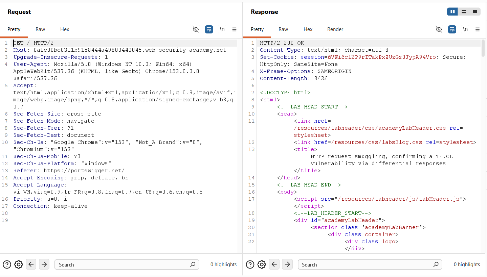
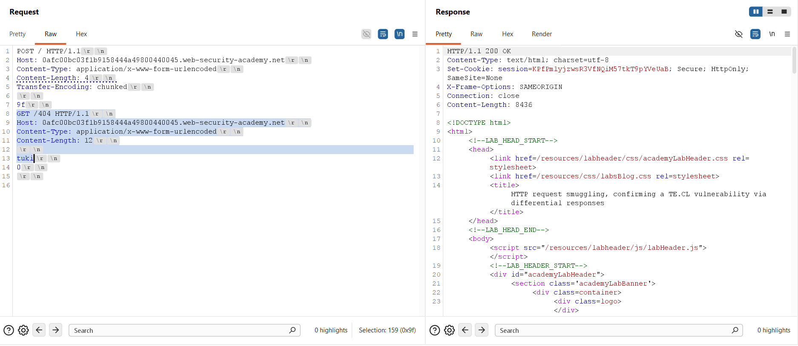
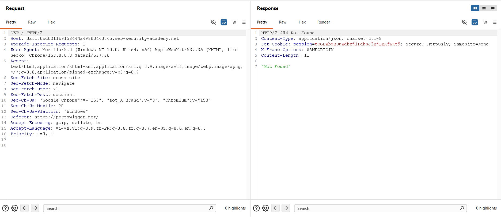
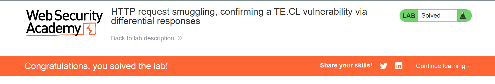

## Challenge Overview
* **Challenge name**: HTTP request smuggling, confirming a TE.CL vulnerability via differential responses
* **Category**: HTTP Request Smuggling
* **Level**: Practitioner
* **Objective**: Smuggle a request to the back-end server, so that a subsequent request for `/` (the web root) triggers a 404 Not Found response.

---

## 1. Fundamental Concepts

HTTP Request Smuggling via TE.CL desynchronization represents a sophisticated transport-layer vulnerability occurring in multi-tier web architectures where the front-end reverse proxy and the back-end application server disagree on how message boundaries are calculated.

### 1.1. Architectural Discrepancy in TE.CL Systems
* **Dual Framing Standards:** Under HTTP/1.1 specifications (RFC 7230), requests can specify their payload length either via `Content-Length` (fixed byte count) or `Transfer-Encoding: chunked` (dynamically sized blocks terminated by a zero-length chunk `0\r\n\r\n`).
* **The TE.CL Divergence:** In a TE.CL environment, the front-end proxy prioritizes `Transfer-Encoding: chunked`, reading until the terminating zero-chunk. Conversely, the back-end server ignores or fails to parse `Transfer-Encoding`, relying strictly on the `Content-Length` header.
* **Connection Multiplexing Impact:** To optimize latency, intermediate proxies maintain persistent, multiplexed TCP connections to the back-end (HTTP Keep-Alive / Connection Pooling). Discrepancies in boundary demarcation cause bytes belonging to one request to spill into subsequent requests sent across the same connection stream.

### 1.2. Differential Responses Verification
* **Limitations of Syntax Corruption:** While basic exploit proofs may intentionally corrupt an HTTP method (such as injecting `GPOST` to provoke a 400 Bad Request or 403 Forbidden), such syntax errors can be caught prematurely by WAF inspection or discarded by web servers without confirming backend application execution.
* **Definitive Proof via Differential Responses:** The Differential Responses technique provides conclusive proof of request smuggling. By smuggling a syntactically valid request targeting an endpoint that produces a distinctive status code (such as `GET /404 HTTP/1.1`), the attacker forces an otherwise normal, benign subsequent request to receive a 404 Not Found response instead of 200 OK. This stark divergence proves beyond doubt that the smuggled request was executed by the application backend.

---

## 2. Attack Model & Architecture

The TE.CL differential response attack model requires precise byte-level engineering. The outer request must appear as a complete, valid chunked stream to the front-end, while presenting a minimal `Content-Length` to the back-end, leaving the nested request waiting in the back-end buffer.

```text
[Attacker]
    │
    │ 1. Sends dual-header request (Content-Length: 4, Transfer-Encoding: chunked)
    │    Body: [9f\r\n] + [GET /404... Content-Length: 12\r\n\r\ntuki\r\n0\r\n\r\n]
    ▼
[Front-end Server] (Prioritizes Transfer-Encoding: chunked)
    │ Reads chunk '9f' (159 bytes) and terminating chunk '0\r\n\r\n'
    │ Validates request as complete and forwards all bytes to Back-end over pooled TCP
    ▼
[Back-end Server] (Prioritizes Content-Length: 4)
    │ Reads first 4 bytes ('9f\r\n') as body of Request 1 -> Responds HTTP/1.1 200 OK
    │ Remaining 159 bytes remain in TCP socket buffer: starts with GET /404
    │ Reads GET /404 headers with Content-Length: 12
    │ Available buffered body ('tuki\r\n0\r\n\r\n') is only 11 bytes
    │ Back-end pauses, waiting for 1 more byte (NO unsolicited response sent)
    ▼
[Subsequent Normal Request: GET / HTTP/2]
    │ Routed across the same pooled TCP connection by Front-end
    │ Back-end consumes 1st byte of new request to fulfill 12-byte body of GET /404
    │ Back-end executes GET /404 HTTP/1.1 -> Emits HTTP 404 Not Found
    ▼
[Front-end maps 404 response to the 2nd request -> Differential Response Confirmed]
```

### 2.1. Attack Data Flow
1. **Step 1 - Smuggling Probe Transmission:** The attacker sends an HTTP/1.1 POST request containing both `Transfer-Encoding: chunked` and `Content-Length: 4`. The body contains a chunk size line in hexadecimal (`9f\r\n`), followed by the smuggled request `GET /404 HTTP/1.1`, a Host header, an oversized `Content-Length: 12`, a short body prefix `tuki\r\n`, and the terminating chunk `0\r\n\r\n`.
2. **Step 2 - Front-end Stream Forwarding:** The Front-end parses the stream using `Transfer-Encoding: chunked`. It processes the large chunk of length 0x9f (159 bytes), validates the terminating chunk `0\r\n\r\n`, deems the request fully complete, and forwards the entire byte sequence across the pooled TCP connection to the Back-end.
3. **Step 3 - Back-end Premature Request Termination:** The Back-end parses the stream using `Content-Length: 4`. It reads exactly the first 4 bytes of the body (`'9'`, `'f'`, `'\r'`, `'\n'`), considers the primary `POST /` request fulfilled, processes it, and returns an initial `HTTP/1.1 200 OK`. The remaining 159 bytes remain unread in the back-end TCP socket receive buffer.
4. **Step 4 - Buffer Poisoning & Holding State:** The Back-end begins reading the next request from its buffer, which starts with `GET /404 HTTP/1.1`. It reads the headers, including `Content-Length: 12`. Crucially, the remaining bytes available in the buffer (`tuki\r\n0\r\n\r\n`) account for only 11 bytes. Since `12 > 11`, the Back-end is short by 1 byte and halts execution, waiting for additional data without emitting a response.
5. **Step 5 - Triggering the Differential Response:** When a subsequent normal request arrives from a client (e.g., `GET / HTTP/2`), the Front-end reuses the healthy, idle TCP connection. The Back-end immediately consumes the first byte of this new request to satisfy the 12th byte of the pending `GET /404` body. The Back-end executes `GET /404 HTTP/1.1` and returns `HTTP/1.1 404 Not Found` to the front-end.
6. **Step 6 - Victim Impact & Delivery:** The Front-end receives the `404 Not Found` response and delivers it to the user who requested the root page `'/'`, completing the exploitation.

### 2.2. The Critical Necessity of an Oversized Content-Length
A vital technical insight in TE.CL differential response attacks is why the inner smuggled request MUST have an oversized `Content-Length` (e.g., 12) rather than an exact match of the buffered bytes (e.g., 11):
* **The Danger of Exact Content-Length:** If `Content-Length` were set to 11, the Back-end would have all 11 bytes (`tuki\r\n0\r\n\r\n`) immediately available. It would execute `GET /404` instantly and transmit an unsolicited second response (`HTTP/1.1 404 Not Found`) back to the Front-end.
* **Front-end Pipeline Desynchronization:** The Front-end only forwarded ONE request from the attacker, so it only expects ONE response on that connection. When an unsolicited "orphan" response arrives with no pending client request, the Front-end detects a critical protocol violation / pipeline desynchronization error, immediately drops the 404 response, and tears down the TCP connection.
* **The Suspension Mechanism:** By setting `Content-Length` to 12 (exceeding the available 11 bytes), the Back-end is forced into a suspended state. No unsolicited response is sent, the Front-end maintains the connection in its active pool, and the trap is sprung cleanly when the next request arrives.

---

## 3. Vulnerability Exploitation

The vulnerability was confirmed and exploited using Burp Suite Repeater through protocol inspection, precise chunk size calculation, connection poisoning, and differential response verification.

### 3.1. Baseline Protocol Inspection
Initial interaction with the lab showed that modern browsers and Burp Suite negotiate HTTP/2 by default via ALPN. Sending a baseline `GET /` request yielded an expected `HTTP/2 200 OK` response.



### 3.2. Constructing the TE.CL Attack Request
To craft the attack, protocol versioning in Burp Suite Repeater was switched to HTTP/1.1 under **Request attributes**, and the **Update Content-Length** setting was unchecked to preserve manual length values.

The attack payload was engineered as follows:

```http
POST / HTTP/1.1
Host: 0afc00bc03f1b9158444a49800440045.web-security-academy.net
Content-Type: application/x-www-form-urlencoded
Content-Length: 4
Transfer-Encoding: chunked

9f
GET /404 HTTP/1.1
Host: 0afc00bc03f1b9158444a49800440045.web-security-academy.net
Content-Type: application/x-www-form-urlencoded
Content-Length: 12

tuki
0

```

Technical verification of payload metrics:
* **Outer Content-Length:** Set to 4, covering precisely `'9'`, `'f'`, `'\r'`, `'\n'`. The Back-end terminates Request 1 immediately after these 4 bytes.
* **Hex Chunk Size Calculation:** The block from `GET /404` through `tuki` measures exactly 159 bytes. Burp Suite's selection inspector confirmed `Selection: 159 (0x9f)`.
* **Mandatory Host Header:** Included to comply with RFC 7230 back-end requirements, preventing a 400 Bad Request error.
* **Holding State Metric:** Set to 12. The trailing data `tuki\r\n0\r\n\r\n` provides 11 bytes. Requiring 12 bytes forces the back-end to pause until the next incoming request supplies the final byte.

### 3.3. Execution and Differential Response Confirmation
Sending the attack request resulted in an immediate `HTTP/1.1 200 OK` response. The Front-end transferred all chunked data, while the Back-end processed only the outer request, leaving the `GET /404` request primed inside the socket buffer.



A standard `GET / HTTP/2` request was subsequently dispatched to the application. The Front-end routed this request over the poisoned backend connection. The Back-end consumed the incoming bytes, fulfilled the pending `GET /404` request, and returned an `HTTP 404 Not Found` response containing the JSON body `"Not Found"`:

```http
HTTP/2 404 Not Found
Content-Type: application/json; charset=utf-8
Set-Cookie: session=tRGEXWbqBUuWdbxj1PdhSJ3BjLBXfwKt9; Secure; HttpOnly; SameSite=None
X-Frame-Options: SAMEORIGIN
Content-Length: 11

"Not Found"
```



The reception of a 404 Not Found response for a root endpoint request conclusively verified the TE.CL vulnerability. The Web Security Academy platform confirmed the lab was successfully solved.



---

## 4. Remediation & Prevention

Preventing TE.CL Request Smuggling requires rigorous architectural and configuration controls across the entire web infrastructure:

### 4.1. End-to-End HTTP/2 Implementation
* **Native Binary Framing:** Implement HTTP/2 natively across all proxy and application tiers (Client-to-Front-end and Front-end-to-Back-end). HTTP/2 uses unambiguous binary framing that inherently eliminates text-based length interpretation discrepancies.
* **Eliminate Protocol Downgrading:** Avoid HTTP/2 protocol downgrading at the reverse proxy. Translating binary HTTP/2 frames into HTTP/1.1 text streams when routing to back-end servers frequently introduces desynchronization vulnerabilities.

### 4.2. Upstream Header Validation and Normalization
* **Reject Ambiguous Header Combinations:** Configure front-end reverse proxies (such as Nginx, HAProxy, or Envoy) to reject any incoming request containing both Transfer-Encoding and Content-Length with an HTTP 400 Bad Request.
* **Enforce Authoritative Length Normalization:** Ensure the reverse proxy normalizes all forwarded traffic: if receiving chunked requests, completely decode and buffer the body, compute an authoritative Content-Length, and strip the Transfer-Encoding header before forwarding to back-end services.

### 4.3. Back-end Server Hardening & Connection Isolation
* **RFC 7230 Compliance:** Ensure back-end application servers strictly follow RFC 7230 Section 3.3.3: if both headers are present, Transfer-Encoding MUST take precedence over Content-Length. Application servers must never silently discard Transfer-Encoding in favor of Content-Length.
* **Connection Isolation:** Disable internal TCP connection pooling across untrusted client boundaries, or restrict connection reuse strictly to authenticated, single-user sessions to prevent cross-tenant request interception.
