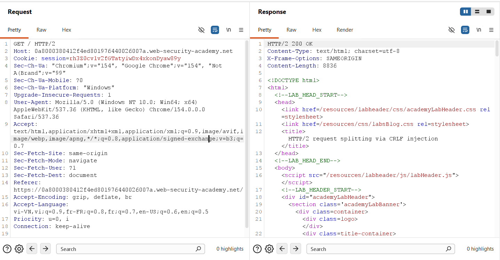
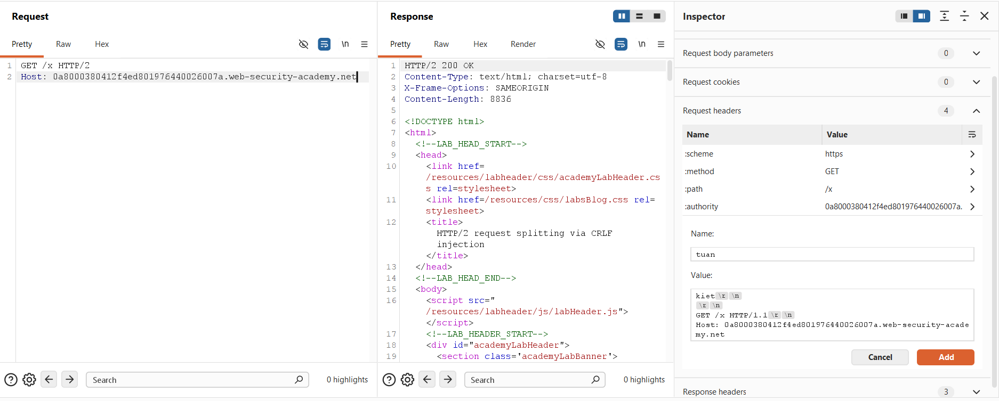
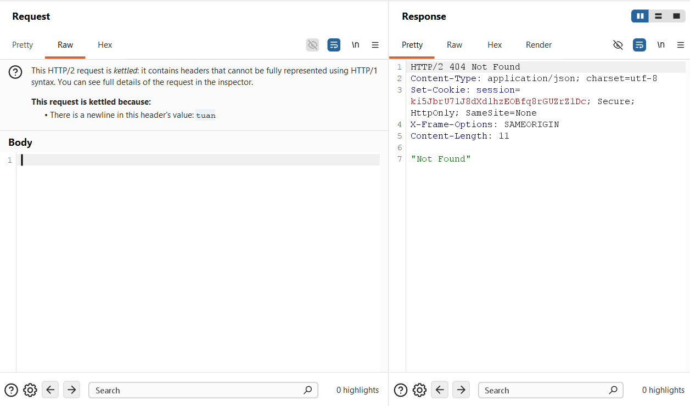
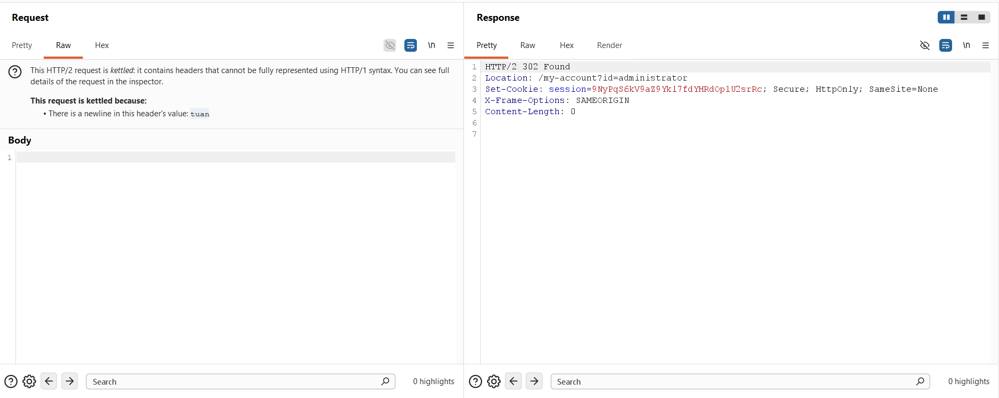
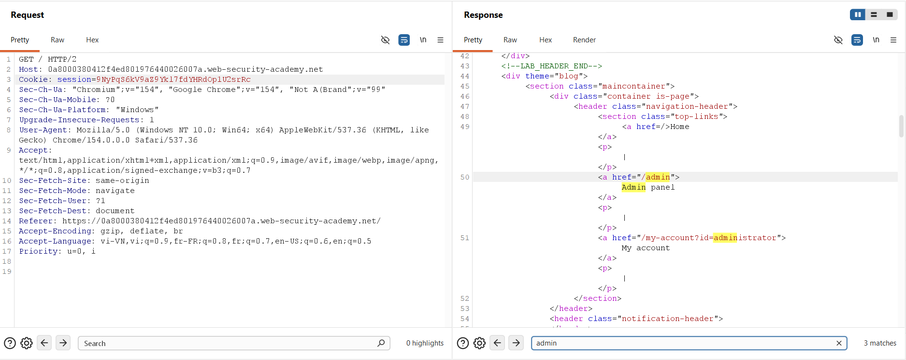
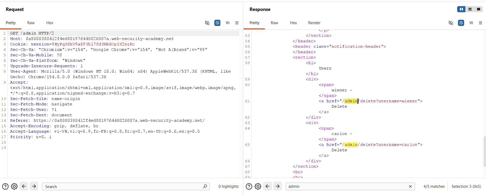
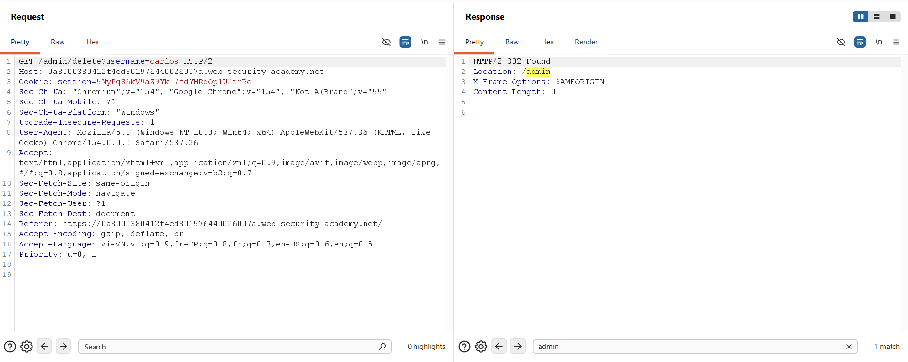
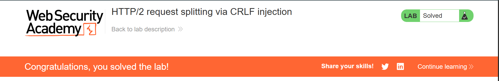

## Challenge Overview
* **Challenge name**: HTTP/2 request splitting via CRLF injection
* **Category**: HTTP Request Smuggling
* **Level**: Practitioner
* **Objective**: Delete the user `carlos` by using response queue poisoning to break into the admin panel at `/admin`. An admin user will log in approximately every 10 seconds.

---

## 1. Fundamental Concepts

HTTP/2 request splitting via CRLF injection represents an advanced transport-layer exploitation technique. In this attack vector, an adversary weaponizes front-end reverse proxy protocol downgrading (HTTP/2 to HTTP/1.1) to inject header delimiters (CRLF sequences: `\r\n\r\n`). Unlike classic request smuggling that hides a secondary request within a chunked body, request splitting bifurcates a single incoming HTTP/2 request into two completely independent, syntactically valid HTTP/1.1 requests at the header level. When coupled with backend TCP connection reuse, this induces Response Queue Poisoning, enabling adversaries to hijack administrative sessions and compromise privileged functionality.

### 1.1. HTTP/2 Binary Framing vs. HTTP/1.1 Delimiter Architecture
* **HTTP/1.1 Delimiter Semantics:** Under HTTP/1.1 (RFC 7230), headers and messages are represented as text streams. Fields are separated by CRLF (`\r\n`), and the entire header block is terminated by a double CRLF (`\r\n\r\n`). Crucially, the presence of `\r\n\r\n` signals to the parser that all headers have ended. If the request method is GET (which carries no defined payload semantics), the parser immediately finalizes the request and begins parsing the next bytes on the socket as a subsequent HTTP request.
* **HTTP/2 Binary Encoding:** HTTP/2 (RFC 7540 / RFC 9113) abstracts communication into binary frames. Headers are packed within HEADERS frames as length-prefixed key-value pairs compressed with HPACK. Field boundaries are determined by binary length integers rather than text delimiters. Consequently, binary bytes representing 0x0D (`\r`) and 0x0A (`\n`) embedded inside a header value are treated as literal characters rather than message boundary markers.
* **Ingress Validation Gap:** Although RFC 7540 Section 8.1.2 explicitly mandates that proxies and servers must reject any HTTP/2 request containing carriage returns or line feeds in header values with an HTTP 400 Bad Request, vulnerable edge proxies fail to sanitize header values at ingress.

### 1.2. The Mechanism of HTTP/2 Request Splitting
* **Protocol Translation & Downgrading:** When a front-end proxy translates an inbound HTTP/2 frame into an HTTP/1.1 cleartext socket stream, it serializes each binary header as `Name: Value\r\n`.
* **Header-Level Bifurcation:** If an attacker injects a double CRLF sequence into a header value (e.g., `tuan: kiet\r\n\r\nGET /x HTTP/1.1\r\nHost: target.net`), the front-end outputs this literal sequence into the socket. The backend parser encounters the first `\r\n\r\n`, concluding that Request #1 is complete. It immediately evaluates the subsequent bytes (`GET /x HTTP/1.1...`) as an entirely new Request #2.
* **Automatic Boundary Closure:** When the front-end completes writing out all headers, it appends its own trailing `\r\n\r\n` to the end of the downgraded stream. This automatically terminates the header block of Request #2, creating two syntactically perfect HTTP/1.1 requests from a single HTTP/2 request without requiring any message body manipulation.

### 1.3. Response Queue Poisoning Dynamics
* **TCP Connection Pipelining:** In high-performance web architectures, front-end proxies maintain persistent, multiplexed TCP connections to upstream backend servers. Multiple client sessions are routed through the same backend socket in a pipelined or sequential manner.
* **FIFO Response Processing:** HTTP/1.1 operates on a strict First-In, First-Out (FIFO) queue for responses. For each request sent downstream, the proxy expects exactly one response back in corresponding order.
* **Queue Desynchronization:** When an attacker splits a request, 1 front-end request produces 2 backend requests. The backend processes both and dispatches 2 responses. The front-end delivers Response #1 to the attacker, but Response #2 remains unconsumed at the head of the backend TCP socket buffer.
* **Session Hijacking via Queue Contamination:** When an innocent user (such as an administrative bot) issues a request over the shared connection, the front-end pulls the pre-existing Response #2 from the queue and serves it to the victim. The victim's genuine response (e.g., a 302 Found redirect containing administrative session cookies) is placed into the queue. When the attacker sends a subsequent request, the proxy dequeues and delivers the administrator's private session response directly to the attacker.

> [!IMPORTANT]
> **CRITICAL ARCHITECTURAL DISTINCTION:** Request Smuggling (Lab 13) relies on Transfer-Encoding to conceal a request inside the BODY of another request. Request Splitting (Lab 14) injects `\r\n\r\n` to terminate headers early, carving TWO distinct requests directly out of the HEADER block without needing any body data.

---

## 2. Attack Model & Architecture

The attack model illustrates the interaction between the attacker, the HTTP/2 front-end proxy, the persistent backend TCP connection, and the administrative victim bot. Through header CRLF injection, the attacker bifurcates the request stream, inducing Response Queue Poisoning and capturing the administrator's authenticated session cookie.

```text
[Attacker]
    │
    │ (1) Sends Single HTTP/2 Request (GET /x)
    │     Headers:
    │       :method: GET
    │       :path: /x
    │       tuan: kiet\r\n\r\nGET /x HTTP/1.1\r\nHost: target.net
    │     Body: [EMPTY - NO DATA FRAMES]
    ▼
[Front-end Proxy] (Evaluates HTTP/2 Binary Frames)
    │ Accepts request (valid GET with no body)
    │ Translates request into HTTP/1.1 plain text stream:
    │   GET /x HTTP/1.1\r\n
    │   Host: target.net\r\n
    │   tuan: kiet\r\n
    │   \r\n                        <-- [Injected double CRLF]
    │   GET /x HTTP/1.1\r\n
    │   Host: target.net\r\n
    │   \r\n                        <-- [Front-end final CRLF]
    ▼
[Back-end Server] (Parses HTTP/1.1 on Shared TCP Socket)
    │ [Request 1: GET /x] --> Executed --> Produces Response 1 (404 Not Found)
    │ [Request 2: GET /x] --> Executed --> Produces Response 2 (404 Not Found)
    │
    │ Front-end dequeues Response 1 --> Returned to Attacker
    │ Response 2 (404) remains sitting at HEAD of TCP receive queue!
    ▼
[Admin Bot Accesses Application] (Every ~10 seconds)
    │ (2) Admin sends GET / or POST /login over shared socket
    │ Front-end pulls unconsumed Response 2 (404) from queue --> Sent to Admin!
    │ Back-end processes Admin request --> Produces Response 3:
    │     HTTP/1.1 302 Found
    │     Location: /my-account?id=administrator
    │     Set-Cookie: session=ADMIN_SESSION_TOKEN
    │ Response 3 enters the socket queue!
    ▼
[Attacker Sends Follow-up Request]
    │ (3) Attacker dispatches GET /x HTTP/2
    │ Front-end dequeues Response 3 from backend socket --> Delivered to Attacker!
    │ Attacker harvests ADMIN_SESSION_TOKEN from Set-Cookie header!
    ▼
[Privilege Escalation & Account Compromise]
    │ (4) Attacker accesses /admin with stolen cookie
    │ (5) Attacker dispatches GET /admin/delete?username=carlos --> Carlos Deleted!
```

### 2.1. Attack Lifecycle & Data Flow Breakdown
1. **Phase 1 - Baseline Discovery & Canary Selection:** The attacker establishes communication with the target via HTTP/2, verifying that GET requests to non-existent endpoints (`/x`) return HTTP/2 404 Not Found.
2. **Phase 2 - Payload Construction & Ingress Bypass:** Using Burp Inspector, the attacker inserts a custom header (`tuan`) containing double CRLF sequences and a secondary `GET /x` request line with the target Host header.
3. **Phase 3 - Request Splitting & Queue Poisoning:** The request is dispatched. The front-end downgrades the frame, the backend parses two complete `GET /x` requests, and Response #2 is stranded in the backend socket queue.
4. **Phase 4 - Victim Trapping:** The administrative bot triggers an authenticated action. The proxy serves the stranded 404 response to the administrator, leaving the administrator's genuine 302 redirect response queued for retrieval.
5. **Phase 5 - Session Extraction & Account Takeover:** The attacker sends follow-up requests, extracting the administrator's session cookie from the dequeued 302 Found response.
6. **Phase 6 - Unauthorized Admin Action Execution:** The attacker accesses the administrative control panel at `/admin` and issues an authenticated request to delete the target user `carlos`.

### 2.2. Deep-Dive Analysis: The Architectural Rationale for GET /x vs. POST
* **Why Outer Request Uses GET (Absence of DATA Frames):** In Lab 13, the exploit payload was placed in the message body. In HTTP/2, body content is transmitted via DATA frames. Front-end ingress filters strictly enforce the rule that GET requests cannot contain a message body, rejecting such requests with `HTTP/2 403 Forbidden: "GET requests cannot contain a body"`. Therefore, Lab 13 mandated POST.
* **Ingress Filter Evasion:** In Lab 14, the attack occurs entirely within the HEADERS frame. The body is completely empty (no DATA frames). A bodyless GET request is completely standard and permitted by front-end ingress filters, bypassing all body inspection rules.
* **Bodyless Requirement for Clean Request Bifurcation:** For request splitting to succeed, Request #1 must NOT have a body. In HTTP/1.1, GET requests have no message body by definition. When the backend sees the injected `\r\n\r\n`, it immediately concludes that Request #1 is finished, allowing the subsequent text to be recognized as Request #2. If Request #1 were POST, the backend would expect body data, absorbing the subsequent text into the body rather than splitting it into a second request.
* **The Canary Function of /x:** The endpoint `/x` serves as an ideal canary marker. Under normal circumstances, `/x` returns 404 Not Found. When Response Queue Poisoning succeeds, sending `/x` suddenly returns a 302 Found or 200 OK, immediately alerting the attacker that the administrative response has been captured without ambiguity.

### 2.3. Root Causes
* **Ingress Header Sanitization Failure:** The front-end proxy fails to reject HTTP/2 requests with carriage returns (0x0D) and line feeds (0x0A) in header values as mandated by RFC 7540 Section 8.1.2.
* **Unsafe Protocol Downgrading:** The translation engine unsafely downgrades binary headers to text lines without escaping control characters or ensuring that one HTTP/2 header maps strictly to one HTTP/1.1 line.
* **Shared Upstream Connection Pools:** Persistent backend TCP sockets are multiplexed across disparate users without logical session boundary enforcement, enabling cross-user response queue desynchronization.

---

## 3. Vulnerability Exploitation

The vulnerability was systematically verified, weaponized, and executed using Burp Suite Repeater through an 8-stage methodology.

### 3.1. Establishing Baseline Communication
Initial reconnaissance was conducted by intercepting a standard homepage request (`GET / HTTP/2`) in Burp Suite Repeater. The proxy confirmed native HTTP/2 negotiation with the target front-end, returning `HTTP/2 200 OK` under the attacker's baseline session (`session=rh3Z0cv1v2fGTatyiwDx4xkonDyaw89y`):



### 3.2. Crafting the Request Splitting Payload via Burp Inspector
The request path was modified to `/x` (`GET /x HTTP/2`). In the Inspector panel, a custom header named `tuan` was added. Using **Shift + Return**, literal carriage return and line feed characters were injected into the header value to construct the secondary request:

```http
kiet\r\n
\r\n
GET /x HTTP/1.1\r\n
Host: 0a8000380412f4ed801976440026007a.web-security-academy.net
```

Burp Inspector visually rendered the injected line breaks as discrete `\r` and `\n` control tokens:



### 3.3. Initiating Response Queue Poisoning
The request was transmitted. Burp Suite flagged the request as **kettled** because it contained multi-line header syntax that cannot be represented in standard HTTP/1. The server returned `HTTP/2 404 Not Found` (`"Not Found"`) with `Content-Length: 11`:



This 404 response corresponded to Request #1. Downstream on the backend TCP connection, Request #2 had already been processed, stranding an extra 404 response in the socket buffer.

### 3.4. Capturing the Administrator's Authenticated Session
A brief pause of 5 to 10 seconds was observed to allow the automated administrative bot to perform its scheduled login routine. A follow-up request was dispatched over the connection. Rather than the expected 404 Not Found, the server returned an immediate `HTTP/2 302 Found` redirect:

```http
HTTP/2 302 Found
Location: /my-account?id=administrator
Set-Cookie: session=9NyPqS6kV9aZ9Ykl7fdYHRdOp1U2srRc; Secure; HttpOnly; SameSite=None
X-Frame-Options: SAMEORIGIN
Content-Length: 0
```



The front-end proxy dequeued the administrative response from the poisoned socket buffer and delivered it directly to the attacker. The extracted administrative session token was: `session=9NyPqS6kV9aZ9Ykl7fdYHRdOp1U2srRc`.

### 3.5. Verifying Administrative Privilege
To confirm successful impersonation, a request was issued to `GET / HTTP/2` supplying the captured cookie `session=9NyPqS6kV9aZ9Ykl7fdYHRdOp1U2srRc`. The server rendered the privileged navigation bar containing links to `/admin` and `/my-account?id=administrator`:



### 3.6. Enumerating Administrative User Controls
With administrative access verified, a request was dispatched to `GET /admin HTTP/2` using the stolen session cookie. The response rendered the user administration portal, revealing active accounts and identifying the deletion endpoint for user `carlos` (`/admin/delete?username=carlos`):



### 3.7. Executing User Deletion
A request was issued to `GET /admin/delete?username=carlos HTTP/2` carrying the administrator's session cookie. The backend executed the account deletion, returning `HTTP/2 302 Found` redirecting back to `/admin`:



### 3.8. Laboratory Resolution
The target application was refreshed in the browser. The platform displayed the official resolution banner confirming successful lab completion:



---

## 4. Remediation & Prevention

Mitigating HTTP/2 request splitting and response queue poisoning requires structural remediation across edge proxies, transport protocols, connection management, and application session controls.

### 4.1. Strict Ingress Header Validation (RFC 7540 / RFC 9113)
* **Zero Tolerance for Newlines:** Edge reverse proxies and Web Application Firewalls must enforce RFC 7540 Section 8.1.2. Any incoming HTTP/2 request containing 0x0D (`\r`), 0x0A (`\n`), or 0x00 (NUL) characters in header names or values must be classified as malformed and immediately rejected with an HTTP 400 Bad Request at the protocol parser level.
* **Character Whitelisting:** Implement strict character whitelisting on all incoming headers, permitting only printable ASCII characters (0x20 through 0x7E) before queuing frames for internal routing or downgrading.

### 4.2. End-to-End HTTP/2 Architecture
* **Eliminate Protocol Downgrading:** Deploy native HTTP/2 or HTTP/3 framing across the entire application architecture, from the edge reverse proxy to the backend application servers. Eliminating protocol downgrading removes text-based delimiter parsing, rendering CRLF injection and request splitting completely obsolete.
* **Safe Header Serialization:** If protocol translation to HTTP/1.1 is unavoidable, the serialization engine must strip or encode all newline characters, ensuring that each HTTP/2 header field maps strictly to exactly one physical HTTP/1.1 header line.

### 4.3. Backend Connection Pool Isolation
* **Connection Pool Partitioning:** Never share persistent TCP connections across multiple client IP addresses, TLS sessions, or user identities. Maintaining dedicated connection pools partitioned by client session prevents response queue desynchronization from leaking data across security boundaries.
* **Immediate Socket Teardown on Error:** Configure proxies to immediately tear down and destroy backend TCP sockets upon encountering syntax anomalies, framing errors, or unexpected trailing data.

### 4.4. Application-Level Defense-in-Depth
* **Cryptographic Session Binding:** Cryptographically bind session tokens to client TLS parameters, client certificates, or IP addresses. Even if an attacker captures a session token via response queue poisoning, transport-layer discrepancies will prevent unauthorized session reuse.
* **Protected State-Changing Operations:** Require re-authentication, step-up MFA, or CSRF-protected POST requests for high-impact administrative functions such as user deletion, rather than permitting state changes via simple GET requests.
